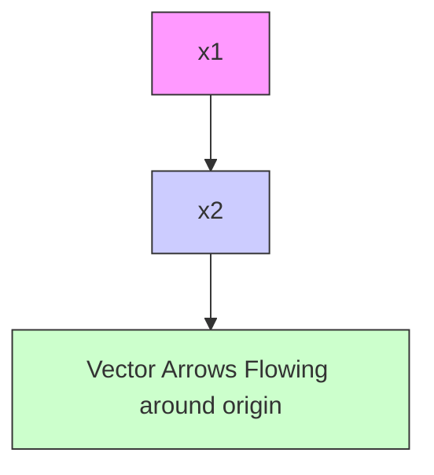

$$= C \left\{x _ {1} x _ {2} + \left[ \varepsilon h \left(x _ {1}\right) + x _ {2} \right] \left[ \varepsilon h ^ {\prime} \left(x _ {1}\right) x _ {2} - x _ {1} - \varepsilon h ^ {\prime} \left(x _ {1}\right) x _ {2} \right] \right\}= C \left[ x _ {1} x _ {2} - \varepsilon x _ {1} h \left(x _ {1}\right) - x _ {1} x _ {2} \right]= - \varepsilon C x _ {1} h \left(x _ {1}\right)$$

上面的表达式说明,在原点附近,由于 $|x_{1}|$ 较小, $x_{1}h(x_{1})$ 为负值,所以轨线获得能量。它也说明存在一个区域带 $-a\leqslant x_{1}\leqslant b$ ,轨线在带内获得能量,在带外失去能量。带的边界-a和b是 $h(x_{1})=0$ 的根,如图2.18所示。随着轨线在带内带外移动,在带内获得能量和在带外失去能量有一个能量交换。如果在一个循环内沿一条轨线的净能量交换是零,就会发生稳定振荡,这样的轨线就是闭轨道。它证明了负阻振荡有一个孤立的闭轨道,这将在下面的例子,范德波尔振荡器中说明。

text_image

-a
b
x₁

图2.18 $h(x_{1})$ （虚线）和 $-x_{1}h(x_{1})$ （实线），说明当 $-a\leqslant x_1\leqslant b$ 时 $\dot{E}$ 是正的

例 2.6 图 2.19(a)、图 2.19(b) 和图 2.20(a) 所示为范德波尔方程

$$\dot {x} _ {1} = x _ {2} \tag {2.5}\dot {x} _ {2} = - x _ {1} + \varepsilon \left(1 - x _ {1} ^ {2}\right) x _ {2} \tag {2.6}$$

当参数 $\varepsilon$ 取三个不同值时的相图，三个值分别为一个较小值0.2，一个中等值1.0和一个较大值5.0。这三种情况的相图都显示出有一个唯一的闭轨道吸引所有从轨道出发的轨线。当 $\varepsilon = 0.2$ 时，闭轨道是一条平滑轨道，为半径接近于2的圆，这是 $\varepsilon$ 较小时（如 $\varepsilon < 0.3)$ 的典型情况。当 $\varepsilon = 1.0$ 时，闭轨道的形状是扭曲的圆，如图2.19(b)所示。当 $\varepsilon$ 较大，为5.0时，闭轨道严重扭曲，如图2.20(a)所示。在这种情况下，如果选择状态变量为 $z_{1} = i_{L},z_{2} = v_{C}$ ，可得到一个更具启发性的相图，此时状态方程为：

$$\dot {z} _ {1} = \frac {1}{\varepsilon} z _ {2}\dot {z} _ {2} = - \varepsilon \left(z _ {1} - z _ {2} + \frac {1}{3} z _ {2} ^ {3}\right)$$

图2.20(b)所示为 $\varepsilon = 5.0$ 时在 $z_{1} - z_{2}$ 平面的相图，除各个角(接近竖直)外，闭轨道非常接近曲线 $z_{1} = z_{2} - (1 / 3)z_{2}^{3}$ 。闭轨道的竖起部分可以看成当其到达角时，闭轨道从曲线的一个分支跳到另一个分支。发生跳跃现象的振荡通常称为张弛振荡，这是 $\varepsilon$ 较大（ $\varepsilon >3.0$ ）时的典型相图。

contour

| x1 | x2 |
| --- | --- |
| -2 | 3 |
| 0 | 0 |
| 2 | -1 |
| 4 | -2 |

(a)

flowchart

(b)
