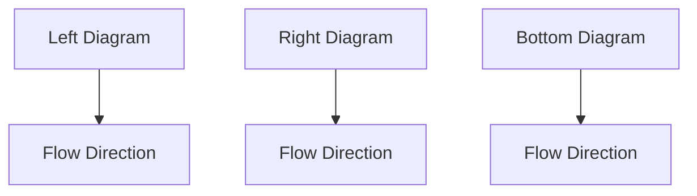

# 2.7 分岔

二阶系统的特性由其平衡点和周期轨道的模式及其稳定性质决定。在实际中很重要的一点是在无穷小的扰动下系统能否保持其特性,如果能保持,就说系统是结构稳定的。本节主要讨论结构稳定性的余集。实际上我们更关心那些会改变系统的平衡点或周期轨道,或改变其稳定性质的平衡点。例如,考虑由参数 $\mu$ 决定的系统

$$\dot {x} _ {1} = \mu - x _ {1} ^ {2}\dot {x} _ {2} = - x _ {2}$$

当 $\mu > 0$ 时，系统有两个平衡点 $(\sqrt{\mu}, 0)$ 和 $(- \sqrt{\mu}, 0)$ 。在点 $(\sqrt{\mu}, 0)$ 线性化，可得到雅可比矩阵

$$
\left[ \begin{array}{c c} - 2 \sqrt {\mu} & 0 \\ 0 & - 1 \end{array} \right]
$$

说明 $(\sqrt{\mu},0)$ 是稳定结点，而在点 $(- \sqrt{\mu},0)$ 线性化可得到雅可比矩阵

$$
\left[ \begin{array}{c c} 2 \sqrt {\mu} & 0 \\ 0 & - 1 \end{array} \right]
$$

说明 $(- \sqrt{\mu}, 0)$ 是一个鞍点。随 $\mu$ 减小，鞍点和结点互相逼近，在 $\mu = 0$ 时相遇，而当 $\mu < 0$ 时消失。当 $\mu$ 通过零时，会在系统的相图上看到一个戏剧性的变化。图2.27所示是 $\mu$ 值为正、为零和为负时系统的相图。当 $\mu$ 值为正时，无论其多么小，在 $\{x_{1} > -\sqrt{\mu}\}$ 内的所有轨线都在稳定结点达到稳态。当 $\mu$ 值为负时，所有轨线最终都逃向无穷。系统的这种特性的变化称为分岔。一般来说，分岔就是当参数变化时，平衡点、周期轨道或稳定性质的改变。参数称为分岔参数，发生变化处的参数值称为分岔点。在前面的例子中，分岔参数是 $\mu$ ，分岔点是 $\mu = 0$ 。

flowchart

图2.27 $\mu > 0$ （左）， $\mu = 0$ （中）和 $\mu < 0$ （右）时鞍点分岔的相图

在前面例子中看到的分岔可由图2.28(a)所示的分岔图表示,该图绘出了平衡点的模(或范数)与分岔参数的关系,稳定结点由实线表示,鞍点由虚线表示。一般情况下,分岔图的坐标是平衡点或周期轨道的模值,实线表示稳定结点、稳定焦点和稳定极限环,而虚线表示非稳定结点、非稳定焦点和非稳定极限环。图2.28(a)表示的分岔称为鞍结点分岔,因为它是由鞍点和结点相遇产生的。注意,雅可比矩阵在平衡点有一个为零的特征值,这是图2.28(a)到图2.28(d)的一般特性,这几个图都是零特征值分岔的例子。图2.28(b)所示为跨临界(transcritical)分岔,其平衡点在分岔过程中始终存在,但其稳定特性发生了变化。例如,系统

$$\dot {x} _ {1} = \mu x _ {1} - x _ {1} ^ {2}\dot {x} _ {2} = - x _ {2}$$

有两个点 $(0,0)$ 和 $(\mu ,0)$ 。在 $(0,0)$ 点的雅可比矩阵为

$$
\left[ \begin{array}{c c} \mu & 0 \\ 0 & - 1 \end{array} \right]
$$

说明当 $\mu < 0$ 时 $(0,0)$ 是稳定结点，而当 $\mu > 0$ 时 $(0,0)$ 是鞍点。而点 $(\mu,0)$ 的雅可比矩阵为

$$
\left[ \begin{array}{c c} - \mu & 0 \\ 0 & - 1 \end{array} \right]
$$

说明当 $\mu<0$ 时 $(\mu,0)$ 是鞍点，而当 $\mu>0$ 时 $(\mu,0)$ 是稳定结点。所以，当平衡点在整个分岔点 $\mu=0$ 都存在时， $(0,0)$ 从稳定结点变为鞍点，而 $(\mu,0)$ 从鞍点变为稳定结点。

natural_image

Simple curved line with a dashed extension, labeled μ at the bottom (no text or symbols beyond the label)

(a) 鞍结点分岔
