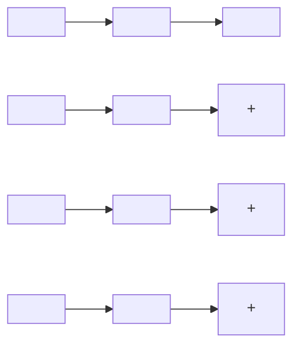

$$
\begin{array}{l} \dot {x} = \left[ \begin{array}{r r} 0 & 1 \\ - 1 & 0 \end{array} \right] x + \left[ \begin{array}{l} 0 \\ 1 \end{array} \right] u \\ y = \left[ \begin{array}{l l} 1 & 0 \end{array} \right] x \\ \end{array}
$$

u 和 y 分别是输入和输出。当以方程(4.9)的形式建模时(无驱动输入)，设 $A_{s}$ 和 $A_{p}$ 分别为串联和并联连接的矩阵，则有

$$
A _ {p} = \left[ \begin{array}{c c c c} 0 & 1 & 0 & 0 \\ - 1 & 0 & 0 & 0 \\ 0 & 0 & 0 & 1 \\ 0 & 0 & - 1 & 0 \end{array} \right] \qquad A _ {s} = \left[ \begin{array}{c c c c} 0 & 1 & 0 & 0 \\ - 1 & 0 & 0 & 0 \\ 0 & 0 & 0 & 1 \\ 1 & 0 & - 1 & 0 \end{array} \right]
$$

矩阵 $A_{s}$ 和 $A_{p}$ 在虚轴上有相同的特征值 $\pm j$ ，其代数重数为 $q_{i} = 2$ ，其中 $j = \sqrt{-1}$ 。容易验证 $\mathrm{rank}(A_p - jI) = 2 = n - q_i$ ，而 $\mathrm{rank}(A_s - jI) = 3 \neq n - q_i$ 。因此，根据定理4.5可得，并联连接的原点是稳定的，而串联连接的原点是不稳定的。为了从物理上看清两者的区别，注意到在并联连接中，非零初始条件产生了频率为 $1\mathrm{rad / s}$ 的正弦振荡，是时间的有界函数。这些正弦信号之和仍然是有界的。而在串联连接中，非零初始条件在第一级产生的频率为 $1\mathrm{rad / s}$ 的正弦振荡，以驱动输入的形式作用于第二级。由于第二级具有 $1\mathrm{rad / s}$ 的无阻尼固有频率，所以驱动输入引起共振，因而使响应变为无界的。 $\triangle$

flowchart

图 4.6 (a) 串联；(b) 并联

当 $A$ 的所有特征值都满足 $\operatorname{Re} \lambda_i < 0$ 时， $A$ 就称为赫尔维茨(Hurwitz)矩阵或稳定性矩阵。

当且仅当 $A$ 是赫尔维茨矩阵时，系统(4.9)的原点是渐近稳定的。原点的渐近稳定性也可以用李雅普诺夫法研究。考虑一个备选的二次李雅普诺夫函数

$$V (x) = x ^ {\mathrm{T}} P x$$

其中 $P$ 为实对称正定矩阵， $V$ 沿线性系统(4.9)的轨线的导数为

$$\dot {V} (x) = x ^ {\mathrm{T}} P \dot {x} + \dot {x} ^ {\mathrm{T}} P x = x ^ {\mathrm{T}} (P A + A ^ {\mathrm{T}} P) x = - x ^ {\mathrm{T}} Q x$$

其中 $Q$ 为对称矩阵, 其定义为 $PA + A^{\mathrm{T}}P = -Q$ (4.12)

如果 Q 是正定的, 根据定理 4.1 可得, 原点是渐近稳定的。即, 对于 A 的所有特征值, 都有 $\operatorname{Re} \lambda_{i} < 0$ 。这里, 按照李雅普诺夫法的一般步骤, 选择 $V(x)$ 为正定的, 并检验 $\dot{V}(x)$ 的负定性。在线性系统中, 可以颠倒这两步的顺序。假设先选择 Q 为实对称正定矩阵, 然后解方程 (4.12) 求 P。如果方程 (4.12) 有一个正定解, 就可以得出原点渐近稳定的结论。方程 (4.12) 称为李雅普诺夫方程。下面的定理给出原点的渐近稳定性特征与李雅普诺夫方程的解的关系。

定理4.6 当且仅当对于任意给定的正定对称矩阵 $Q$ ，存在一个正定对称矩阵 $P$ 满足李雅普诺夫方程(4.12)，那么 $A$ 就是赫尔维茨矩阵，即 $A$ 的所有特征值都满足 $\operatorname{Re} \lambda_i < 0$ 。此外，如果 $A$ 是赫尔维茨矩阵，那么 $P$ 就是方程(4.12)的唯一解。

证明:由定理4.1的李雅普诺夫函数 $V(x)=x^{T}Px$ 可得其充分性,证明如前。为了证明必要性,假设A的所有特征值都满足 $Re\lambda_{i}<0$ ,并考虑矩阵P,其定义为

$$P = \int_ {0} ^ {\infty} \exp (A ^ {\mathrm{T}} t) Q \exp (A t) d t \tag {4.13}$$
