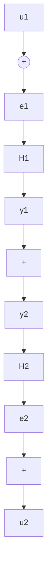

# 5.4 反馈系统: 小增益定理

因为系统增益可以跟踪信号通过系统时信号范数的增加或减少,所以输入-输出稳定性的形式在研究互联系统稳定性中特别必要,这一点在图5.1的反馈连接中尤为突出。图中有两个系统 $L_{e}^{m}\rightarrow L_{e}^{q}$ 和 $L_{e}^{q}\rightarrow L_{e}^{m}$ 。假设两个系统都是有限增益L稳定的①,即,

$$\left\| y _ {1 \tau} \right\| _ {\mathcal {L}} \leqslant \gamma_ {1} \left\| e _ {1 \tau} \right\| _ {\mathcal {L}} + \beta_ {1}, \forall e _ {1} \in \mathcal {L} _ {e} ^ {m}, \forall \tau \in [ 0, \infty) \tag {5.38}\left\| y _ {2 \tau} \right\| _ {\mathcal {L}} \leqslant \gamma_ {2} \left\| e _ {2 \tau} \right\| _ {\mathcal {L}} + \beta_ {2}, \forall e _ {2} \in \mathcal {L} _ {e} ^ {q}, \forall \tau \in [ 0, \infty) \tag {5.39}$$

进一步假设对每对输入 $u_{1} \in \mathcal{L}_{e}^{m}$ 和 $u_{2} \in \mathcal{L}_{e}^{q}$ 都存在唯一的输出 $e_{1}, y_{2} \in \mathcal{L}_{e}^{m}$ 和 $e_{2}, y_{1} \in \mathcal{L}_{e}^{q}$ ②，在此意义下反馈系统有明确的定义。定义

$$
u = \left[ \begin{array}{l} u _ {1} \\ u _ {2} \end{array} \right], y = \left[ \begin{array}{l} y _ {1} \\ y _ {2} \end{array} \right], e = \left[ \begin{array}{l} e _ {1} \\ e _ {2} \end{array} \right]
$$

关键问题是当把反馈连接看成从输入 u 到输出 e 的映射,或从输入 u 到输出 y 的映射时,反馈连接是否是有限增益 L 稳定的③。不难看出,从 u 到 e 的映射是有限增益 L 稳定的,则当且仅当从 u 到 y 的映射是有限增益 L 稳定的(见习题 5.21)。因此可以简单地说,如果其中任一映射是有限增益 L 稳定的,则反馈连接就是有限增益 L 稳定的。下面的小增益定理给出了反馈连接有限增益 L 稳定性的充分条件。

flowchart

图5.1 反馈连接

定理5.6 在前面的假设条件下，如果 $\gamma_{1}\gamma_{2} < 1$ ，则反馈连接是有限增益 $\mathcal{L}$ 稳定的。

◇

证明:假设解存在,可写为

$$e _ {1 \tau} = u _ {1 \tau} - \left(H _ {2} e _ {2}\right) _ {\tau}, \quad e _ {2 \tau} = u _ {2 \tau} + \left(H _ {1} e _ {1}\right) _ {\tau}$$

则 $\| e_{1\tau}\|_{\mathcal{L}}\leqslant \| u_{1\tau}\|_{\mathcal{L}} + \| (H_2e_2)_\tau \|_{\mathcal{L}}\leqslant \| u_{1\tau}\|_{\mathcal{L}} + \gamma_2\| e_{2\tau}\|_{\mathcal{L}} + \beta_2$

$$\leqslant \| u _ {1 \tau} \| _ {\mathcal {L}} + \gamma_ {2} \left(\| u _ {2 \tau} \| _ {\mathcal {L}} + \gamma_ {1} \| e _ {1 \tau} \| _ {\mathcal {L}} + \beta_ {1}\right) + \beta_ {2}= \gamma_ {1} \gamma_ {2} \| e _ {1 \tau} \| _ {\mathcal {L}} + \left(\| u _ {1 \tau} \| _ {\mathcal {L}} + \gamma_ {2} \| u _ {2 \tau} \| _ {\mathcal {L}} + \beta_ {2} + \gamma_ {2} \beta_ {1}\right)$$

因为 $\gamma_{1}\gamma_{2} < 1$ ，所以对于所有的 $\tau \in [0,\infty)$ 有
