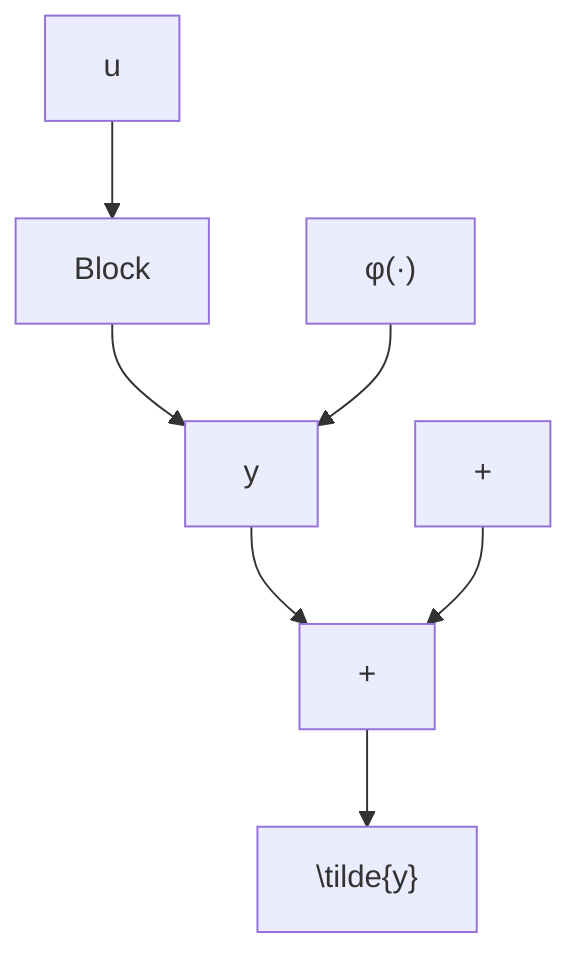
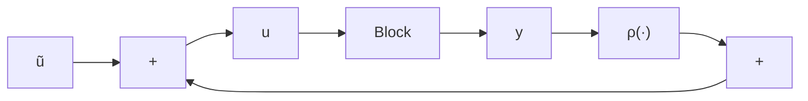

text_image

y
u

(b)

flowchart

(c)

图 6.4 $u^{T}y \geqslant \varepsilon u^{T}u$ 的图形表示。(a) $\varepsilon > 0$ (过量无源性); (b) $\varepsilon < 0$ (欠量无源性); (c) 通过输入前馈消除过量和欠量无源性  

text_image

y
u

(a)

text_image

y
u

(b)

flowchart

(c)   
图 6.5 $u^{T}y \geqslant \delta y^{T}y$ 的图形表示。(a) $\delta > 0$ (过量无源性); (b) $\delta < 0$ (欠量无源性); (c) 通过输出反馈消除过量和欠量无源性
