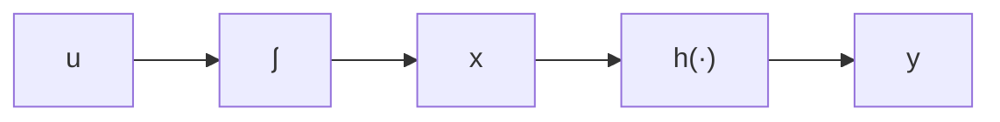
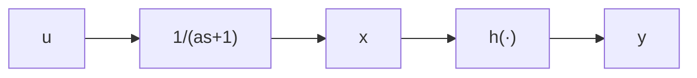

$$a \dot {x} = - x + u, \qquad y = h (x)$$

表示。用 $V(x) = a\int_0^x h(\sigma)d\sigma$ 作为存储函数，有

$$\dot {V} = h (x) (- x + u) = y u - x h (x) \leqslant y u$$

因此系统是无源的。当对于所有 $x \neq 0, xh(x) > 0$ 时，系统是严格无源的。

flowchart

(a)

flowchart

(b)   
图6.10 例6.3
