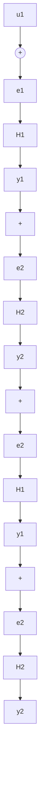

# 6.5 反馈系统:无源性定理

考虑图 6.11 所示的反馈连接, 反馈分支 $H_{1}$ 和 $H_{2}$ 一个是时不变动力学系统, 其状态方程表示为

$$\dot {x} _ {i} = f _ {i} \left(x _ {i}, e _ {i}\right) \tag {6.21}y _ {i} = h _ {i} \left(x _ {i}, e _ {i}\right) \tag {6.22}$$

另一个(可能是时变的)无记忆函数,表示为

$$y _ {i} = h _ {i} (t, e _ {i}) \tag {6.23}$$

flowchart

图6.11 反馈连接，图中 $u_{1}, y_{1}$ ， $u_{2}$ 和 $y_{2}$ 可以是同维向量

我们感兴趣的是利用反馈分支 $H_{1}$ 和 $H_{2}$ 的无源性分析

反馈连接的稳定性。仍然研究 $L_{2}$ 稳定性和李雅普诺夫稳定性。我们要求反馈连接具有明确定义的状态模型。当 $H_{1}$ 和 $H_{2}$ 都是动力学系统时，其闭环状态模型为

$$\dot {x} = f (x, u) \tag {6.24}y = h (x, u) \tag {6.25}$$

其中 $x = \left[ \begin{array}{l}x_{1}\\ x_{2} \end{array} \right],\quad u = \left[ \begin{array}{l}u_{1}\\ u_{2} \end{array} \right],\quad y = \left[ \begin{array}{l}y_{1}\\ y_{2} \end{array} \right]$

假设 $f$ 是局部利普希茨的， $h$ 是连续的，且 $f(0,0) = 0, h(0,0) = 0$ 。容易验证，如果方程

$$e _ {1} = u _ {1} - h _ {2} \left(x _ {2}, e _ {2}\right) \tag {6.26}e _ {2} = u _ {2} + h _ {1} \left(x _ {1}, e _ {1}\right) \tag {6.27}$$

对于每个 $(x_{1},x_{2},u_{1},u_{2})$ 有唯一解 $(e_{1},e_{2})$ ，则反馈连接具有明确定义的状态模型。性质 $f(0,0)=0$ 和 $h(0,0)=0$ 是由 $f_{i}(0,0)=0$ 和 $h_{i}(0,0)=0$ 推出的。容易看出，如果 $h_{1}$ 与 $e_{1}$ 无关或 $h_{2}$ 与 $e_{2}$ 无关，则方程(6.26)和方程(6.27)将总有唯一解。此时，闭环状态模型的函数f和h仍具有反馈分支 $f_{i}$ 和 $h_{i}$ 的光滑特性。特别地，如果 $f_{i}$ 和 $h_{i}$ 是局部利普希茨的，则f和h也将是局部利普希茨的。对于线性系统，要求 $h_{i}$ 独立于 $e_{i}$ 等价于要求 $H_{i}$ 的传递函数是严格正则的 $^{①}$ 。

当有一个分支,比如说 $H_{1}$ 是动力学系统,另一个分支是无记忆函数时,闭环状态模型为

$$\dot {x} = f (t, x, u) \tag {6.28}y = h (t, x, u) \tag {6.29}$$

其中 $x = x_{1}, u = \left[ \begin{array}{c}u_{1}\\ u_{2} \end{array} \right],\quad y = \left[ \begin{array}{c}y_{1}\\ y_{2} \end{array} \right]$

假设f对t分段连续,对 $(x,u)$ 是局部利普希茨的,h对t分段连续,对 $(x,u)$ 连续,且 $f(t,0,0)=0$ , $h(t,0,0)=0$ 。如果方程

$$e _ {1} = u _ {1} - h _ {2} (t, e _ {2}) \tag {6.30}e _ {2} = u _ {2} + h _ {1} \left(x _ {1}, e _ {1}\right) \tag {6.31}$$

对于每个 $(x_{1},t,u_{1},u_{2})$ 都有唯一解 $(e_1,e_2)$ ，则反馈连接有明确定义的状态模型。当 $h_1$ 与 $e_1$ 无关时,就是这种情况。如果两个分支都是无记忆函数,这种情况就不重要了,一般是状态x不存在的特例。此时反馈连接表示为 $y=h(t,u)$ 。

我们从下面的基本性质开始分析。

定理 6.1 两无源系统的反馈连接仍是无源系统。
