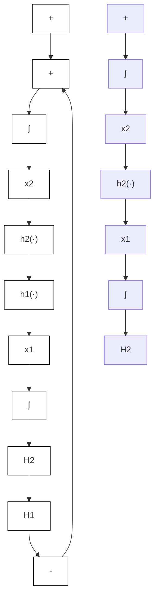

图6.12 例6.11

当反馈连接的一个分支是动力学系统,另一分支为无记忆函数时,可以用动力学系统的存储函数作为备选李雅普诺夫函数进行李雅普诺夫分析。但重要的是区分时变和时不变无记忆函数,因为对于前者,闭环系统是非自治系统,不能应用不变原理,如定理6.3的证明。下面两个定理将分别研究这两种情况。

定理 6.4 考虑形如系统(6.21)\~(6.22)的严格无源时不变动力学系统与形如方程(6.23)的无源(可能时变)无记忆函数的反馈连接,闭环系统(6.28)(当 u=0 时)的原点是一致渐近稳定的。而且,如果动力学系统的存储函数是径向无界的,则原点是全局一致渐近稳定的。

证明:按照引理6.7的证明,可以证明 $V_{1}(x_{1})$ 是正定的,其导数为

$$\dot {V} _ {1} = \frac {\partial V _ {1}}{\partial x _ {1}} f _ {1} (x _ {1}, e _ {1}) \leqslant e _ {1} ^ {\mathrm{T}} y _ {1} - \psi_ {1} (x _ {1}) = - e _ {2} ^ {\mathrm{T}} y _ {2} - \psi_ {1} (x _ {1}) \leqslant - \psi_ {1} (x _ {1})$$

该结论由定理 4.9 得出。

定理 6.5 考虑形如系统(6.21)\~(6.22)的时不变动力学系统 $H_{1}$ 与形如方程(6.23)的时不变无记忆函数 $H_{2}$ 的反馈连接。假设 $H_{1}$ 是零状态可观测的，且有一个正定存储函数，满足

$$e _ {1} ^ {\mathrm{T}} y _ {1} \geqslant \dot {V} _ {1} + y _ {1} ^ {\mathrm{T}} \rho_ {1} (y _ {1}) \tag {6.36}$$

$H_{2}$ 满足

$$e _ {2} ^ {\mathrm{T}} y _ {2} \geqslant e _ {2} ^ {\mathrm{T}} \varphi_ {2} (e _ {2}) \tag {6.37}$$

则如果

$$\boldsymbol {v} ^ {\mathrm{T}} \left[ \rho_ {1} (v) + \varphi_ {2} (v) \right] > 0, \quad \forall v \neq 0 \tag {6.38}$$

闭环系统(6.28)(当 u=0 时)的原点是渐近稳定的。进一步讲,如果 $V_{1}$ 是径向无界的,则原点是全局渐近稳定的。

证明:用 $V_{1}(x_{1})$ 作为备选李雅普诺夫函数,得

$$
\begin{array}{l} \dot {V} _ {1} = \frac {\partial V _ {1}}{\partial x _ {1}} f _ {1} \left(x _ {1}, e _ {1}\right) \leqslant e _ {1} ^ {\mathrm{T}} y _ {1} - y _ {1} ^ {\mathrm{T}} \rho_ {1} \left(y _ {1}\right) \\ = - e _ {2} ^ {\mathrm{T}} y _ {2} - y _ {1} ^ {\mathrm{T}} \rho_ {1} (y _ {1}) \leqslant - \left[ y _ {1} ^ {\mathrm{T}} \varphi_ {2} (y _ {1}) + y _ {1} ^ {\mathrm{T}} \rho_ {1} (y _ {1}) \right] \\ \end{array}
$$
