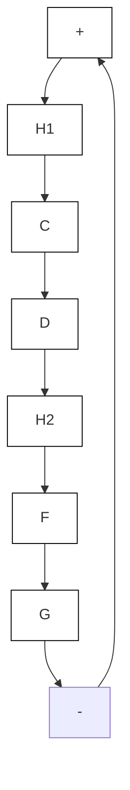

的反馈连接,其中 $\tilde{\sigma}\in[0,\infty]$ , $a=\alpha-b$ 。如果 $\alpha>b$ , 可以证明(见习题6.4) $\tilde{H}_{1}$ 是严格无源的, 其存储函数的形式为 $V_{1}=k\int_{0}^{x_{1}}h(s)ds+x^{\mathrm{T}}Px$ , 其中 $P=P^{T}>0$ 。因此, 由定理6.4可知, 反馈连接的原点是全局渐近稳定的。

  
图6.13 恒定增益的环路变换。扇形区域 $[K_1, K_2]$ 的无记忆函数 $\tilde{H}_2$ 变换为扇形区域 $[0, \infty]$ 的无记忆函数 $\tilde{H}_2$

下一步,我们以图6.14所示的动态乘法器讨论环路变换。假如 $W^{-1}(s)$ 存在,以传递函数 $W(s)$ 左乘 $H_{2}$ 可被 $W^{-1}(s)$ 右乘 $H_{1}$ 抵消。例如,当 $H_{2}$ 为无源、时不变的无记忆函数h时,由例6.3可知,用传递函数 $1/(as+1)$ 左乘h得到严格无源的动力学系统。如果用 $(as+1)$ 右乘 $H_{1}$ 得到一个严格无源系统或零状态可观测的严格输出无源系统,应用定理6.3可得出原点的渐近稳定性。这一思想在下面两个例子中以 $H_{1}$ 分别为线性和非线性两种情况加以说明。

例 6.15 设 $H_{1}$ 是一个线性时不变系统, 其状态模型为

$$\dot {x} = A x + B e _ {1}, \quad y _ {1} = C x$$

其中 $A = \left[ \begin{array}{cc}0 & 1\\ -1 & -1 \end{array} \right],\quad B = \left[ \begin{array}{c}0\\ 1 \end{array} \right],\quad C = \left[ \begin{array}{ll}1 & 0 \end{array} \right]$

其系统传递函数 $1/(s^{2}+s+1)$ 的相对阶为 2，因此不是正实函数。用 $(as+1)$ 右乘 $H_{1}$ 得 $\tilde{H}_{1}$ ，可表示为状态模型

$$\dot {x} = A x + B e _ {1}, \quad \tilde {y} _ {1} = \tilde {C} x$$

其中 $\tilde{C} = C + aCA = [1a]$ 。如果 $a > 1$ ，则其传递函数 $(as + 1) / (s^2 + s + 1)$ 满足条件

$$\mathrm{Re} \left[ \frac {1 + j \omega a}{1 - \omega^ {2} + j \omega} \right] = \frac {1 + (a - 1) \omega^ {2}}{(1 - \omega^ {2}) ^ {2} + \omega^ {2}} > 0, \forall \omega \in R$$

与 $\lim_{\omega \to \infty}\omega^2\operatorname {Re}\left[\frac{1 + j\omega a}{1 - \omega^2 + j\omega}\right] = a - 1 > 0$

因此选择 $a > 1$ 就可以应用引理6.1和引理6.4得出 $\tilde{H}_1$ 是严格无源的，其存储函数为 $(1 / 2)x^{\mathrm{T}}Px,P$ 对某个 $L$ 及 $\varepsilon >0$ 满足方程

$$P A + A ^ {\mathrm{T}} P = - L ^ {\mathrm{T}} L - \varepsilon P, \quad P B = \tilde {C} ^ {\mathrm{T}}$$

flowchart

(a)

flowchart

