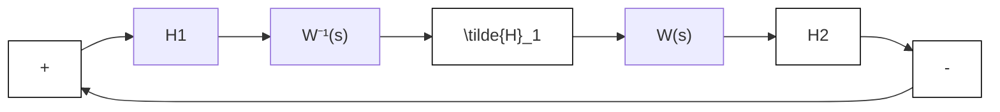

(b)   
图 6.14 动态乘法器的环路变换

另一方面，设 $H_{2}$ 由 $y_{2} = h(e_{2})$ 给出，其中 $h\in [0,\infty ]$ 。由例6.3可知，以传递函数 $1 / (as + 1)$ 左乘 $h$ 得到一个严格无源性系统，其存储函数为 $a\int_0^{e_2}h(s)ds$ 。应用定理6.3证明变换后的反馈连接图6.14(b)(零输入)的原点是渐近稳定的，其李雅普诺夫函数为 $V = (1 / 2)x^{\mathrm{T}}Px + a\int_0^{e_2}h(s)ds$ 。但要注意，变换后的反馈连接图6.14(b)有一个三维状态模型，而原反馈连接为二维状态模型。为说明原反馈连接原点的渐近稳定性，还要做更多的工作。如果利用变换后的反馈连接得出李雅普诺夫函数 $V$ ，并计算 $V$ 相对于原反馈连接的导数，可以减少这些额外的工作。这一导数为

$$
\begin{array}{l} \dot {V} = \frac {1}{2} x ^ {\mathrm{T}} P \dot {x} + \frac {1}{2} \dot {x} ^ {\mathrm{T}} P x + a h (e _ {2}) \dot {e} _ {2} \\ = \frac {1}{2} x ^ {\mathrm{T}} P [ A x - B h (e _ {2}) ] + \frac {1}{2} [ A x - B h (e _ {2}) ] ^ {\mathrm{T}} P x + a h (e _ {2}) C [ A x - B h (e _ {2}) ] \\ = - \frac {1}{2} x ^ {\mathrm{T}} L ^ {\mathrm{T}} L x - (\varepsilon / 2) x ^ {\mathrm{T}} P x - x ^ {\mathrm{T}} \tilde {C} ^ {\mathrm{T}} h (e _ {2}) + a h (e _ {2}) C A x \\ = - \frac {1}{2} x ^ {\mathrm{T}} L ^ {\mathrm{T}} L x - (\varepsilon / 2) x ^ {\mathrm{T}} P x - x ^ {\mathrm{T}} [ C + a C A ] ^ {\mathrm{T}} h (e _ {2}) + a h (e _ {2}) C A x \\ = - \frac {1}{2} x ^ {\mathrm{T}} L ^ {\mathrm{T}} L x - (\varepsilon / 2) x ^ {\mathrm{T}} P x - e _ {2} ^ {\mathrm{T}} h (e _ {2}) \leqslant - (\varepsilon / 2) x ^ {\mathrm{T}} P x \\ \end{array}
$$

说明原点是渐近稳定的。事实上,由于V是径向无界的,可得出原点是全局渐近稳定的。

例6.16 考虑 $H_{1}$ ： $\left\{ \begin{array}{lll} \dot{x}_1 & = & x_2\\ \dot{x}_2 & = & -bx_1^3 -kx_2 + e_1\\ y_1 & = & x_1 \end{array} \right.$ 和 $H_{2}:y_{2} = h(e_{2})$

的反馈连接,其中 b>0, k>0, $h\in[0,\infty]$ 。以 $(as+1)$ 右乘 $H_{1}$ 得到由同一状态方程表示的系统 $\tilde{H}_{1}$ ，但具有新的输出 $\bar{y}=x_{1}+ax_{2}$ 。用 $V_{1}=(1/4)b x_{1}^{4}+(1/2)x^{\mathrm{T}}P x$ 作为 $\tilde{H}_{1}$ 的备选存储函数，得

$$
\begin{array}{l} \dot {V} _ {1} = b \left(1 - p _ {2 2}\right) x _ {1} ^ {3} x _ {2} - p _ {1 2} b x _ {1} ^ {4} + \left(p _ {1 1} x _ {1} + p _ {1 2} x _ {2}\right) x _ {2} \\ - \left(p _ {1 2} x _ {1} + p _ {2 2} x _ {2}\right) k x _ {2} + \left(p _ {1 2} x _ {1} + p _ {2 2} x _ {2}\right) e _ {1} \\ \end{array}
$$

取 $p_{11}=k,p_{12}=p_{22}=1,a=1$ ，并假设k>1，得

$$\dot {V} _ {1} = - b x _ {1} ^ {4} - (k - 1) x _ {2} ^ {2} + \tilde {y} _ {1} e _ {1}$$

说明 $\tilde{H}_1$ 是严格无源的。另一方面，以传递函数 $1 / (s + 1)$ 左乘 $h$ 得到一个严格无源系统，其存储函数为 $\int_0^{e_2}h(s)ds$ 。利用该(变换后反馈连接的)存储函数

$$V = (1 / 4) b x _ {1} ^ {4} + (1 / 2) x ^ {\mathrm{T}} P x + \int_ {0} ^ {e _ {2}} h (s) d s$$

作为原反馈连接(当 u=0 时)的备选李雅普诺夫函数,得

$$
\begin{array}{l} \dot {V} = b x _ {1} ^ {3} x _ {2} + \left(k x _ {1} + x _ {2}\right) x _ {2} + \left(x _ {1} + x _ {2}\right) \left[ - b x _ {1} ^ {3} - k x _ {2} - h \left(e _ {2}\right) \right] + h \left(e _ {2}\right) x _ {2} \\ = - (k - 1) x _ {2} ^ {2} - b x _ {1} ^ {4} - x _ {1} h \left(x _ {1}\right) \\ \end{array}
$$

它是负定的。由于 V 正定且径向无界，因此可得原点是全局渐近稳定的。

△
