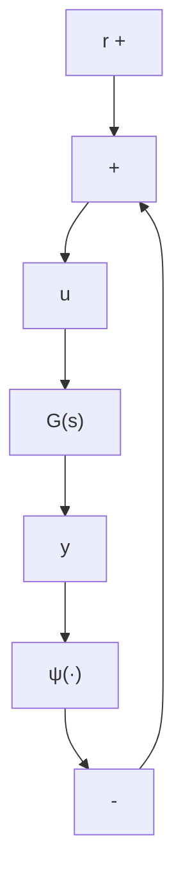

# 第7章 反馈系统的频域分析

多数非线性物理系统可以表示为一个线性系统和非线性单元的反馈连接,如图7.1所示。在这种形式下,描述系统的方法取决于所涉及的特定系统,例如,对于只有继电器或执行机构/传感器的具有非线性特性的控制系统,不难表示成如图7.1所示的反馈系统。而在其他情况下,系统的表示则不够明显。假设外部输入r=0,我们在这种情况下研究无激励系统的响应。本章的特殊之处是线性系统频

flowchart

图7.1 反馈连接

域响应的应用,而频域响应是基于奈奎斯特(Nyquist)曲线和奈奎斯特准则这类经典控制工具的。7.1节将研究系统的绝对稳定性。如果系统在给定扇形区域内的所有非线性在原点处都有一个全局一致渐近稳定的平衡点,则系统是绝对稳定的。圆判据和Popov判据以传递函数的严格正实性给出了系统的绝对稳定性在频域中的充分条件。对单输入-单输出系统,可以借助图形分析法来使用这两个判据。7.2节用描述函数法(describing function method)研究单输入-单输出系统周期解的存在性。通过推导图解法所需的频域条件,预测系统是否存在振荡。若有振荡,则估算振荡的频率和幅度。
