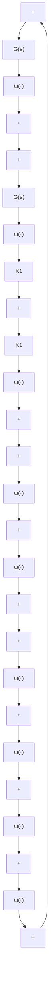

图 7.2 $\psi\in[K_{1},\infty]$ 经环路变换转换成 $\tilde{\psi}\in[0,\infty]$   

```mermaid
graph TD
    A["+"] --> B["G(s)"]
    B --> C["ψ(·)"]
    C --> D["+"]
    D --> E["+"]
    E --> F["G(s)"]
    F --> G["K"]
    G --> H["+"]
    H --> I["ψ(·)"]
    I --> J["K⁻¹"]
    J --> K["+"]
    K --> L["+"]
    L --> M["ψ(·)"]
    M --> N["K₁"]
    N --> O["-"]
    O --> P["+"]
    P --> Q["+"]
    Q --> R["ψ(·)"]
    R --> S["-"]
    S --> T["+"]
    T --> U["+"]
    U --> V["ψ(·)"]
    V --> W["-"]
    W --> X["+"]
    X --> Y["+"]
    Y --> Z["ψ(·)"]
    Z --> AA["-"]
```

flowchart

图 7.3 $\psi\in[K_{1},K_{2}]$ 经环路变换转换成 $\tilde{\psi}\in[0,\infty]$

例 7.1 考虑系统(7.1)\~(7.3)，并假设 $G(s)$ 是赫尔维茨且严格正则的。设

$$\gamma_ {1} = \sup _ {\omega \in R} \sigma_ {\max} [ G (j \omega) ] = \sup _ {\omega \in R} \| G (j \omega) \| _ {2}$$

其中 $\sigma_{\max}[\cdot]$ 代表复矩阵的最大奇异值。因为 $G(s)$ 是赫尔维茨的，故常数 $\gamma_{1}$ 有限。假设 $\psi$ 满足不等式

$$\| \psi (t, y) \| _ {2} \leqslant \gamma_ {2} \| y \| _ {2}, \forall t \geqslant 0, \forall y \in R ^ {p} \tag {7.9}$$

那么， $\psi$ 属于扇形区域 $[K_1, K_2]$ ， $K_1 = -\gamma_2 I, K_2 = \gamma_2 I$ 。为了应用定理7.1，需要证明

$$Z (s) = [ I + \gamma_ {2} G (s) ] [ I - \gamma_ {2} G (s) ] ^ {- 1}$$

是严格正实的。由于 $Z(\infty) = I$ ，所以 $\operatorname{det}[Z(s) + Z^{\mathrm{T}}(-s)]$ 不恒为零。应用引理6.1，由于 $G(s)$ 是赫尔维茨的，如果 $[I - \gamma_2 G(s)]^{-1}$ 是赫尔维茨的，则 $Z(s)$ 也是赫尔维茨的。注意①，

$$\sigma_ {\mathrm{min}} [ I - \gamma_ {2} G (j \omega) ] \geqslant 1 - \gamma_ {1} \gamma_ {2}$$

可以看出,如果 $\gamma_{1}\gamma_{2}<1,\det\left[I-\gamma_{2}G(j\omega)\right]$ 的曲线既不通过原点,也不围绕原点。因此根据多变量奈奎斯特判据 $^{②}$ , $\left[I-\gamma_{2}G(s)\right]^{-1}$ 是赫尔维茨的。因而, $Z(s)$ 也是赫尔维茨的。

接下来证明 $Z(j\omega) + Z^{\mathrm{T}}(-j\omega) > 0,\forall \omega \in R$

该不等式的左边由下式给出：
