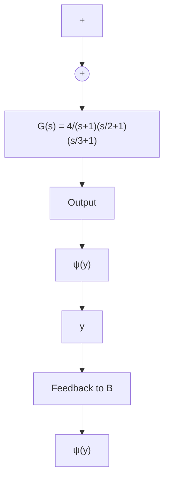

flowchart

图 7.7 具有饱和非线性的反馈连接

例7.3 设

$$G (s) = \frac {4}{(s - 1) (\frac {1}{2} s + 1) (\frac {1}{3} s + 1)}$$

该传递函数不是赫尔维茨的,因为它在右半开平面内有一个极点。因此必须限定 $\alpha$ 为正,然后应用圆判据的第一种情况。 $G(j\omega)$ 的奈奎斯特曲线如图7.8所示。由圆判据可知,奈奎斯特曲线必须按逆时针方向环绕圆盘 $D(\alpha,\beta)$ 一次。观察奈奎斯特曲线可知,只要圆盘完全在位于左半复平面的奈奎斯特曲线形成的某一瓣内,即可被奈奎斯特曲线环绕。右瓣中的圆盘是按顺时针方向被环绕的,不满足圆判据的条件。左瓣中的圆则按逆时针方向被环绕,因此需要选择合适的 $\alpha$ 和 $\beta$ 使圆盘 $D(\alpha,\beta)$ 位于左瓣内。把圆心置于点 $-3.2+j0$ , 大约在实轴上两瓣端点之间。从圆心到奈奎斯特曲线的最小距离是 0.1688, 因此选择半径为 0.168, 可以得出当所有非线性都在扇形区域 [0.2969, 0.3298] 内时, 系统是绝对稳定的。

line

| x | y |
| --- | --- |
| -4 | 0.2 |
| -3 | 0.1 |
| -2 | 0.0 |
| -1 | -0.1 |
| 0 | -0.2 |
| 1 | -0.1 |
| 2 | 0.0 |
| 3 | 0.1 |
| 4 | 0.2 |

图7.8 例7.3的奈奎斯特曲线

从例 7.1 到例 7.3 所研究的都是扇形区域条件全局满足的情况, 下面的例子讨论扇形区域条件仅仅在有限区间内满足的情况。

例 7.4 考虑图 7.1 中的反馈连接, 其中线性系统由传递函数

$$G (s) = \frac {s + 2}{(s + 1) (s - 1)}$$

表示,非线性特性为 $\psi(y)=\mathrm{sat}(y)$ 。非线性全局属于扇形区域[0,1]。但由于 $G(s)$ 不是赫尔维茨的,我们必须应用圆判据的第一种情况,要求 $\alpha$ 为正时扇形区域条件成立,因而不能通过圆判据得出系统绝对稳定的结论①,希望得到的最好结果是证明系统的有限区域绝对稳定。图7.9显示了在区间 $[-a,a]$ 内,非线性 $\psi$ 属于扇形区域 $[\alpha,\beta]$ ,其中 $\alpha=1/a,\beta=1$ 。由于 $G(s)$ 有一个实部为正的极点,因此图7.10中 $G(j\omega)$ 的奈奎斯特曲线一定按逆时针方向环绕圆盘 $D(\alpha,1)$ 一次。用解析法可以验证,当 $\alpha>0.5359$ 时满足条件(7.10)。因而,选取 $\alpha=0.55$ ,则在区间 $[-1.818,1.818]$ 上满足扇形区域条件,且奈奎斯特曲线按逆时针方向环绕圆盘 $D(0.55,1)$ 一次。由圆判据的第一种情况可以得出系统是有限区域绝对稳定的。还可以利用李雅普诺夫二次函数 $V(x)=x^{\mathrm{T}}Px$ 估计吸引区。考虑状态模型

$$\dot {x} _ {1} = x _ {2}\dot {x} _ {2} = x _ {1} + uy = 2 x _ {1} + x _ {2}u = - \psi (y)$$

text_image

y/a
ψ(y)
1
- a - 1 0 1 a y
- a
- 1
0
1
a

图7.9 例7.4的扇形区域

text_image

Im G
Re G
-2 -1 -0.5 0 0

图7.10 例7.4的奈奎斯特曲线

图 7.3 所示的环路变换为
