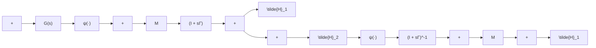

$$V = \frac {1}{2} x ^ {\mathrm{T}} P x + \sum_ {i = 1} ^ {p} \gamma_ {i} \int_ {0} ^ {y _ {i}} \psi_ {i} (\sigma) d \sigma$$

用 V 作为原反馈连接系统(7.13)\~(7.15)的备选李雅普诺夫函数,其导函数 $\dot{V}$ 由下式给出:

$$
\begin{array}{l} \dot {V} = \frac {1}{2} x ^ {\mathrm{T}} P \dot {x} + \frac {1}{2} \dot {x} ^ {\mathrm{T}} P x + \psi^ {\mathrm{T}} (y) \Gamma \dot {y} \\ = \frac {1}{2} x ^ {\mathrm{T}} (P A + A ^ {\mathrm{T}} P) x + x ^ {\mathrm{T}} P B u + \psi^ {\mathrm{T}} (y) \Gamma C (A x + B u) \\ \end{array}
$$

利用式(7.16)和式(7.17)，得

$$
\begin{array}{l} \dot {V} = - \frac {1}{2} x ^ {\mathrm{T}} L ^ {\mathrm{T}} L x - \frac {1}{2} \varepsilon x ^ {\mathrm{T}} P x + x ^ {\mathrm{T}} \left(C ^ {\mathrm{T}} + A ^ {\mathrm{T}} C ^ {\mathrm{T}} \Gamma - L ^ {\mathrm{T}} W\right) u \\ + \psi^ {\mathrm{T}} (y) \Gamma C A x + \psi^ {\mathrm{T}} (y) \Gamma C B u \\ \end{array}
$$

以 $u = -\psi (y)$ 代入并利用式(7.18)，得

$$\dot {V} = - \frac {1}{2} \varepsilon x ^ {\mathrm{T}} P x - \frac {1}{2} (L x + W u) ^ {\mathrm{T}} (L x + W u) - \psi (y) ^ {\mathrm{T}} [ y - M \psi (y) ] \leqslant - \frac {1}{2} \varepsilon x ^ {\mathrm{T}} P x$$

这就证明原点是全局渐进稳定的。若 $\psi$ 仅对 $y \in Y$ 满足扇形区域条件, 则前面的分析仅在原点的某个邻域内成立, 说明原点是渐近稳定的。

flowchart

图7.12 环路变换

当 $M + (I + s\Gamma)G(s)$ 为严格正实时， $G(s)$ 一定是赫尔维茨的。正如在圆判据中所做的，对 $G(s)$ 的限制可通过进行一次环路变换消除，即用 $G(s)[I + K_1G(s)]^{-1}$ 代替 $G(s)$ 。这里不做一般性重复，而是通过一个例子加以说明。在标量情况 $p = 1$ 时，可以用图解法检验 $Z(s) = (1 / k) + (1 + s\gamma)G(s)$ 的严格正实性。由引理6.1可知，如果 $G(s)$ 是赫尔维茨的，且

$$\frac {1}{k} + \operatorname{Re} [ G (j \omega) ] - \gamma \omega \operatorname{Im} [ G (j \omega) ] > 0, \quad \forall \omega \in [ - \infty , \infty ] \tag {7.19}$$
