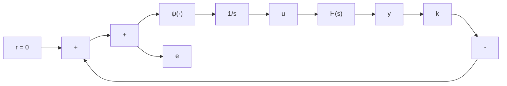

$$\dot {V} \leqslant z ^ {\mathrm{T}} (P A + A ^ {\mathrm{T}} P) z - 2 z ^ {\mathrm{T}} (P B - w) \psi (y) - \gamma \psi^ {2} (y)$$

其中 $w = adC^{T} + (1/2)bA^{T}C^{T}, \gamma = (2ad/k) + b(d + CB)$ 。假设选择 b 使 $\gamma \geqslant 0$ 。

(c) 证明如果 $\frac{1}{k} + \mathrm{Re}[(1 + j\omega \eta)G(j\omega)] > 0, \forall \omega \in R, \eta = \frac{b}{2ad}$

则系统绝对稳定。

7.9 （见文献[85]）图7.23的反馈系统表示一个控制系统，其中 $H(s)$ 是被控对象的（标量）传递函数，内环表示执行机构模型。设 $H(s) = (s + 6) / (s + 2)(s + 3)$ ，并假设 $k \geqslant 0, \psi$ 属于扇形区域 $(0, \beta], \beta$ 可以任意大，但有限。

flowchart

图7.23 习题7.9

(a) 证明系统可表示为图 7.1 所示的反馈连接, 其中输出为 e, 零输入, 且 $G(s) = [H(s) + k] / s$ 。  
(b) 应用习题 7.8 的 Popov 判据, 求出下界 $k_{c}$ , 使系统对于所有 $k > k_{c}$ 绝对稳定。

7.10 对于下列各奇对称非线性 $\psi(y)$ , 验证给定表达式为其描述函数 $\Psi(a)$ 。

(1) $\psi(y) = y^5; \quad \Psi(a) = 5a^4 / 8$   
(2) $\psi(y) = y^3 |y|$ ; $\Psi(a) = 32a^3 / 15\pi$   
(3) $\psi(y)$ : 图7.24(a); $\Psi(a)=k+\frac{4A}{\pi a}$

$\psi(y)$ : 图7.24(b)

(4) $\Psi(a) = \left\{ \begin{array}{c}0,\\ (4B / \pi a)[1 - (A / a)^2 ]^{1 / 2}, \end{array} \right.$ $a\leqslant A$ $a\geqslant A$

$\psi(y)$ : 图7.24(c)

(5) $\Psi(a) = \left\{ \begin{array}{ll}0, & a\leqslant A\\ k[1 - N(a / A)], & A\leqslant a\leqslant B\\ k[N(a / B) - N(a / A)], & a\geqslant B \end{array} \right.$

其中 $N(x) = \frac{2}{\pi}\left[\arcsin \left(\frac{1}{x}\right) + \frac{1}{x}\sqrt{1 - \left(\frac{1}{x}\right)^2}\right]$

7.11 对于下列各种情况,按照图 7.1 所示的反馈连接,应用描述函数法研究周期解的存在性和可能的振荡频率及振荡幅度。

(1) $G(s) = (1 - s)/s(s + 1)$ , $\psi(y) = y^{5}$ .   
(2) $G(s)=(1-s)/s(s+1)$ , $\psi$ 为习题 7.10 中第 5 小题的非线性特性, 其中 A=1, B=3/2, k=2。  
(3) $G(s) = 1 / (s + 1)^6, \psi(y) = \text{sgn}(y)$ .   
(4) $G(s) = (s + 6) / s(s + 2)(s + 3)$ , $\psi(y) = \text{sgn}(y)$ .   
(5) $G(s) = s / (s^2 - s + 1), \psi(y) = y^5$ .   
(6) $G(s) = 5 (s + 0.25) / s^{2} (s + 2)^{2}$ , $\psi$ 是习题 7.10 中第 3 小题的非线性特性, 其中 A = 1, k = 2。  
(7) $G(s)=5(s+0.25)/s^{2}(s+2)^{2}$ , $\psi$ 是习题 7.10 中第 4 小题的非线性特性, 其中 A=1, B=1。  
(8) $G(s) = 5 (s + 0.25) / s^{2} (s + 2)^{2}$ , $\psi$ 是习题 7.10 中第 5 小题的非线性特性, 其中 A = 1, B = 3/2, k = 2。  
(9) $G(s)=1/(s+1)^{3},\psi(y)=\mathrm{sgn}(y)$ 。  
(10) $G(s)=1/(s+1)^{3},\psi(y)=\mathrm{sat}(y)$
