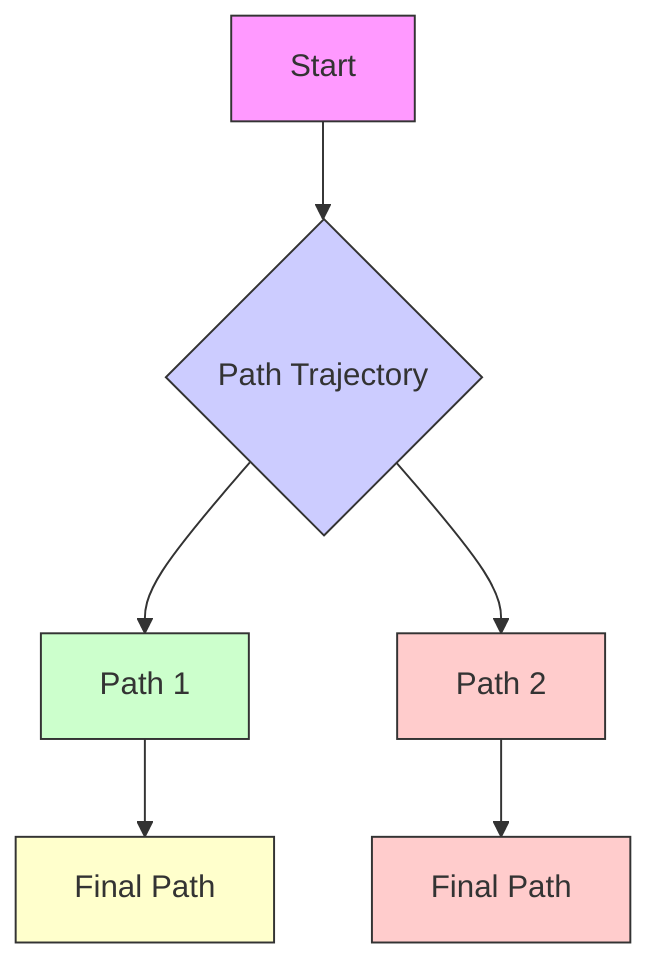

text_image

x₂
x₁
-4 -2 0 2 4
-4 -2 0 2 4

图8.2 例8.5的相图

$$
A = \left. \frac {\partial f}{\partial x} \right| _ {x = 0} = \left[ \begin{array}{l l} 0 & - 1 \\ 1 & - 1 \end{array} \right]
$$

的特征值为 $-1/2 \pm j\sqrt{3}/2$ 。显然吸引区有界，因为始于极限环外的轨线不能通过极限环到达原点。由于不存在其他平衡点，所以 $R_{A}$ 的边界一定是该极限环。观察相图可见，所有始于极限环内的轨线确实都以螺线形式趋向原点。

例8.6 考虑二阶系统

$$
\begin{array}{l} \dot {x} _ {1} = x _ {2} \\ \dot {x} _ {2} = - x _ {1} + \frac {1}{3} x _ {1} ^ {3} - x _ {2} \\ \end{array}
$$

该系统有三个孤立的平衡点 $(0,0),(\sqrt{3},0)$ 和 $(- \sqrt{3},0)$ ，图8.3为系统的相图。相图说明原点是稳定焦点，而另外两个平衡点是鞍点。因此，原点是渐近稳定的，而其他两个平衡点是非稳定的，这一点也可以应用线性化来证明。从相图还可以看出，鞍点的稳定轨线形成两条分界线，即吸引区的边界，该区域是无界的。

flowchart

图8.3 例8.6的相图

例8.7 系统

$$\dot {x} _ {1} = - x _ {1} (1 - x _ {1} ^ {2} - x _ {2} ^ {2})\dot {x} _ {2} = - x _ {2} \left(1 - x _ {1} ^ {2} - x _ {2} ^ {2}\right)$$

在原点有一个孤立平衡点,且在单位圆上存在由平衡点组成的连续统(continuum),即单位圆上的每一点都是平衡点。显然 $R_{A}$ 必须限制在单位圆内,系统的轨线就是单位圆的半径,将系统变换到极坐标系中即可看到这一点。应用变量代换

$$x _ {1} = \rho \cos \theta , \quad x _ {2} = \rho \sin \theta$$

得

$$\dot {\rho} = - \rho (1 - \rho^ {2}), \quad \dot {\theta} = 0$$

所有始于 $\rho < 1$ 的轨线在 t 趋于无穷时都趋于原点, 因此 $R_{A}$ 在单位圆内。

应用李雅普诺夫法可以求出或估算吸引区 $R_A$ ，确定 $R_A$ 边界的基本工具是Zubov定理，参看习题8.10。但该定理具有存在定理的特征，且要求解偏微分方程。经过一些简单步骤，应用李雅普诺夫法可以求出 $R_A$ 的估计值。由 $R_A$ 的估计值，即集合 $\Omega \subset R_A$ ，可使当 $t$ 趋于无穷时，始于 $\Omega$ 内的每条轨线都趋于原点。本节其余部分将讨论估算 $R_A$ 方面的问题。首先证明定理4.1（或推论4.1）中的定义域 $D$ 不是 $R_A$ 的估计值。如定理4.1和推论4.1所述，如果 $D$ 是包含原点的定义域，并可在 $D$ 内求出一个正定的李雅普诺夫函数 $V(x)$ ，且 $\dot{V}(x)$ 在 $D$ 内是负定的或半负定的，但除零解 $x = 0$ 以外没有解可始终保持在集合 $\{\dot{V}(x) = 0\}$ 内，则原点是渐近稳定的。有人可能会由此认为 $D$ 就是 $R_A$ 的估计值，但这一推测是错误的，下面的例题将说明这一点。

例8.8 重新考虑例8.6的系统 $\dot{x}_1 = x_2$

$$\dot {x} _ {2} = - x _ {1} + \frac {1}{3} x _ {1} ^ {3} - x _ {2}$$

该系统是例 4.5 的一个特例, 其中

$$h (x _ {1}) = x _ {1} - \frac {1}{3} x _ {1} ^ {3}, \quad a = 1$$

因此李雅普诺夫函数为
