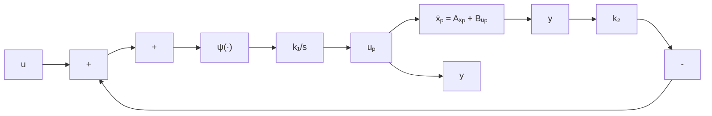
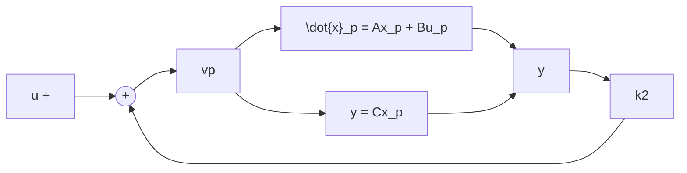

$$\omega_ {r} = \frac {\omega}{\Omega}; i _ {r} = \frac {i R}{k \Omega}; u _ {r} = \frac {u}{k \Omega}$$

重写状态方程为 $T_{m}\frac{d\omega_{r}}{dt}=i_{r}$

$$T _ {e} \frac {d i _ {r}}{d t} = - \omega_ {r} - i _ {r} + u _ {r}$$

其中 $T_{m}=JR/k^{2}$ 是力学时间常数， $T_{e}=L/R$ 是电路时间常数。由于 $T_{m}\gg T_{e}$ ，设 $T_{m}$ 为时间单位，即引入无量纲的时间变量 $t_{r}=t/T_{m}$ ，且重写状态方程为

$$\frac {d \omega_ {r}}{d t _ {r}} = i _ {r}\frac {T _ {e}}{T _ {m}} \frac {d i _ {r}}{d t _ {r}} = - \omega_ {r} - i _ {r} + u _ {r}$$

该尺度变换把模型变成具有物理意义的无量纲参数

$$\varepsilon = \frac {T _ {e}}{T _ {m}} = \frac {L k ^ {2}}{J R ^ {2}}$$

的标准形式。

△

例 11.2 考虑图 11.1 所示的反馈控制系统, 内环代表具有高增益反馈的控制器。高增益参数是积分器常数 $k_{1}$ , 设备为由状态模型 $\{A, B, C\}$ 表示的 n 阶单输入-单输出系统。非线性

$\psi(\cdot)\in(0,\infty]$ ，即 $\psi(0)=0,\ y\psi(y)>0,\ \forall\ y\neq0$

闭环系统的状态方程为 $\dot{x}_{p} = Ax_{p} + Bu_{p}$

$$\frac {1}{k _ {1}} \dot {u} _ {p} = \psi (u - u _ {p} - k _ {2} C x _ {p})$$

当 $\varepsilon = 1 / k_{1}$ ， $x_{p} = x$ 和 $u_{p} = z$ 时，模型具有方程(11.1）\~方程(11.2)的形式。令 $\varepsilon = 0$ ，相当于 $k_{1} = \infty$ ，解方程

$$\psi (u - u _ {p} - k _ {2} C x _ {p}) = 0$$

得 $u_{p} = u - k_{2}Cx_{p}$

由于 $\psi(\cdot)$ 在原点为零,因此它是唯一的根。所得降阶模型

$$\dot {x} _ {p} = (A - B k _ {2} C) x _ {p} + B u$$

是图 11.2 的简化方框图的模型, 其中图 11.1 的整个内环由直接连接代替。

△

flowchart

图 11.1 具有高增益反馈的制动器控制

flowchart

图 11.2 图 11.1 的简化方框图

例11.3 重新考虑图10.2所示的例10.4的电路。关于电容器两端电压的微分方程为

$$C \dot {v} _ {1} = \frac {1}{R} (E - v _ {1}) - \psi (v _ {1}) - \frac {1}{R _ {c}} (v _ {1} - v _ {2})C \dot {v} _ {2} = \frac {1}{R} (E - v _ {2}) - \psi (v _ {2}) - \frac {1}{R _ {c}} (v _ {2} - v _ {1})$$

在例10.4中对“大”电阻 $R_{c}$ 电路进行了分析，当令 $1 / R_{c}$ 为零时，为理想的开路。本例研究“小” $R_{c}$ 电路。令 $R_{c} = 0$ ，把电阻短路以使两个电容并联。对简化的电路模型，并联的两个电容应由一个等效电容代替，这就是说简化电路模型为一阶。为了把这个阶次降低的模型表示为奇异扰动，先选择 $\varepsilon = R_{c}$ ，并重写状态方程为
