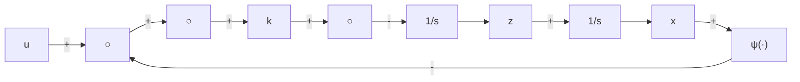

# 11.6 习题

11.1 考虑图 11.13 所示的 RC 电路, 并假设电容 $C_{2}$ 相对于 $C_{1}$ 较小, 但 $R_{1} = R_{2} = R$ 。试用标准奇异扰动形式表示该系统。

11.2 考虑如图 11.13 所示的 RC 电路, 并假设电阻 $R_{1}$ 相对于 $R_{2}$ 较小, 但 $C_{1} = C_{2} = C$ 。试用标准奇异扰动形式表示该系统。

11.3 考虑 1.2.2 节的隧道二极管电路, 并假设电感 L 相对较小, 使得时间常数 L/R 远小于时间常数 CR。试用标准奇异扰动模型表示该系统, 取 $\varepsilon = L/CR^{2}$ 。

11.4（见文献[105]）图11.14所示的反馈系统有一个增益为 $k$ 的高增益放大器和一个非线性元件 $\psi$ 。试把系统表示为标准奇异扰动模型，取 $\varepsilon = 1 / k$ 。

text_image

R₂
+
u
-
+
v₂
-
C₂
R₁
+
v₁
-
C₁

图11.13 习题11.1和习题11.2

flowchart

图11.14 习题11.4

11.5 证明如果雅可比函数 $[\partial g / \partial y]$ 满足特征值条件(11.16)，则存在常数 $k, \gamma$ 和 $\rho_0$ ，使不等式(11.15)成立。

11.6 证明如果存在一个李雅普诺夫函数满足式(11.17)和式(11.18)，则式(11.19)的估计值满足不等式(11.15)。

11.7 考虑奇异扰动问题 $\dot{x} = x^{2} + z, \quad x(0) = \xi$

$$\varepsilon \dot {z} = x ^ {2} - z + 1, \quad z (0) = \eta$$

(a) 在时间区间 $[0,1]$ 上, 建立关于 $x$ 和 $z$ 的一个 $O(\varepsilon)$ 逼近。

(b) 设 $\xi = \eta = 0$ ，当 (1) $\varepsilon = 0.1$ 和 (2) $\varepsilon = 0.05$

时,对 x 和 z 进行仿真,并与(a)得出的逼近结果相比较。在进行计算机仿真时要注意,在 t=1 的短时间之后,系统有一个有限逃逸时间。

11.8 考虑奇异扰动问题

$$\dot {x} = x + z, \quad x (0) = \xi\varepsilon \dot {z} = - \frac {2}{\pi} \arctan \left(\frac {\pi}{2} (2 x + z)\right), \quad z (0) = \eta$$

(a) 在时间区间 $[0,1]$ 上, 建立关于 x 和 z 的一个 $O(\varepsilon)$ 逼近。

(b) 设 $\xi = \eta = 1$ , 当 (1) $\varepsilon = 0.2$ 和 (2) $\varepsilon = 0.1$

对 x 和 z 进行仿真, 并与(a)得出的逼近结果相比较。

11.9 考虑奇异扰动系统 $\dot{x} = z, \varepsilon \dot{z} = -x - \varepsilon z - \exp(z) + 1 + u(t)$

求出降阶模型和边界层模型,并分析边界层模型的稳定性质。

11.10 （见文献[105]）考虑奇异扰动系统

$$\dot {x} = \frac {x ^ {2} t}{z}, \qquad \varepsilon \dot {z} = - (z + x t) (z - 2) (z - 4)$$

(a) 该系统可能有多少种降阶模型?

(b) 对于每个降阶模型,研究其边界层的稳定性。

(c) 设 $x(0)=1$ 和 $z(0)=a$ ，对于 a 在区间 $[-2,6]$ 内的所有取值，求出 x 和 z 在时间区间 $[0,1]$ 上的 $O(\varepsilon)$ 逼近。

11.11 应用定理 11.2, 研究系统 $\dot{x} = -x + z - \sin t, \quad \varepsilon \dot{z} = -z + \sin t$

当 t 趋于无穷时的渐近特性。

11.12 （见文献[105]）求系统 $\dot{x} = xz^3$ ， $\varepsilon \dot{z} = -z - x^{4 / 3} + \frac{4}{3}\varepsilon x^{16 / 3}$

的精确慢流形。

11.13 （见文献[105]）下面的系统有多少慢流形？其中哪些会吸引系统的轨线？
