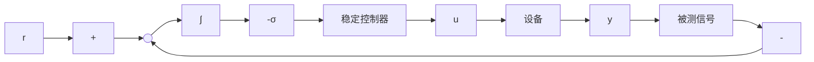

对于多输出系统 $(p > 1)$ ，积分器方程表示 $p$ 个积分器的叠加，各积分器对于 $e$ 的每个分量进行积分，显然，对于 $e$ 积分要求 $y$ 和 $r$ 都应在线获得。现在的控制任务就是设计一个稳定反馈控制器，使我们讨论的状态模型(12.18)～(12.19)在平衡点 $(x_{\mathrm{ss}}, \sigma_{\mathrm{ss}})$ 处稳定，其中 $\sigma_{\mathrm{ss}}$ 产生期望的 $u_{\mathrm{ss}}$ 。图12.1给出了积分控制方案的方框图。

flowchart

图12.1 积分控制

积分控制器由两部分组成:积分器和稳定控制器。因为积分器与方程 v=0 的模型完全相同,所以有时也称为内模(internal model),它产生外部恒定信号 v。稳定控制器的结构取决于被测信号。例如,在状态反馈中,当 $y_{m}=x$ 时,稳定控制器的形式为

$$u = \gamma (x, \sigma , e)$$

其中 $\gamma$ 设计为使方程存在唯一解 $\sigma_{\mathrm{ss}}$ ，满足方程

$$\gamma (x _ {\mathrm{ss}}, \sigma_ {\mathrm{ss}}, 0) = u _ {\mathrm{ss}}$$

日使闭环系统 $\dot{x} = f(x, \gamma(x, \sigma, h(x, w) - r), w)$

$$\dot {\sigma} = h (x, w) - r$$

有一个渐近稳定平衡点,位于 $(x_{\mathrm{ss}},\sigma_{\mathrm{ss}})$ 。在平衡点有y=r,且与w的值无关。因此,在 $(x_{\mathrm{ss}},\sigma_{\mathrm{ss}})$ 的吸引区内,对所有初始状态都实现了渐近调节。

图 12.1 中的积分控制器对所有不破坏闭环系统稳定性的参数扰动都具有鲁棒性, 这一点可直观地解释如下: 反馈控制器产生一个渐近稳定平衡点, 所有信号在该点都必须是常数, 因为积分器 $\dot{\sigma}=e$ 的输出为常数 $\sigma$ , 故其输入 e 一定为零。因此, 积分器迫使调节误差在平衡点处为零。参数扰动会改变平衡点, 但在平衡时 e=0 的条件不会改变, 因此只要被扰动平衡点保持渐近稳定, 就能够实现调节。

设计稳定控制器并不简单,因为闭环方程取决于未知向量 w。在下一节会看到通过线性化解决这一难题的简单方法,但它只能实现局部调节,非局部调节可通过第14章介绍的非线性设计工具实现,14.1.4节给出了一个这样的例题。
