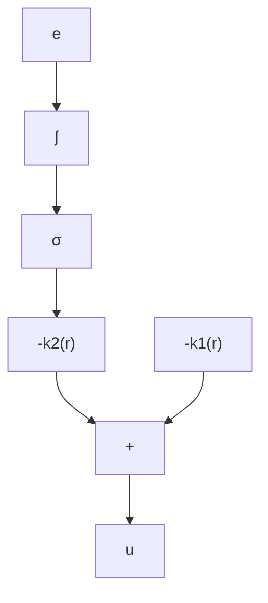

$$\frac {[ 2 \zeta \omega_ {n} + \gamma (\alpha) ] s + \omega_ {n} ^ {2}}{s ^ {2} + [ 2 \zeta \omega_ {n} - a (\alpha) ] s + \omega_ {n} ^ {2}}$$

注意,由 $(A_{f},B_{f},C_{f})$ 和 $(A_{s},B_{s},C_{s})$ 表示的两个线性模型是不同的,前者是闭环系统在固定增益控制器下的线性化模型,而后者是在增益分配控制器下的线性化模型。两种情况都是在期望工作点的线性化。在理想情况下,我们希望这两个模型是等价的,如果是这样的,就知道闭环系统在期望工作点附近的局部特性与设计模型预测的结果相匹配。比较这两个模型可知, $A_{s}=A_{f},C_{s}=C_{f}$ ,但 $B_{s}\neq B_{f}$ ,这就导致闭环传递函数具有不同的零点位置,但两者的传递函数仍具有相同的极点,对阶跃输入的零稳态调节误差性质也是相同的。如果只有一个设计目标,可以说增益分配控制器是可以接受的。但是,如果还要考虑其他性能要求,如受零点位置影响的阶跃响应过渡部分,就需要对模型 $(A_{s},B_{s},C_{s})$ 进行线性分析或仿真(或两者结合起来),以研究零点移动的影响。另一种方法是,用对每个 $\alpha$ 都与 $(A_{f},B_{f},C_{f})$ 等效的线性模型所要达到的目标,修正增益分配控制器,把增益分配控制

器修正为① $u = -k_{1}(r)e + \eta ,\quad \dot{\eta} = -k_{2}(r)e$

即可实现。对于恒定增益 $k_{2}$ ，这种修正可解释为把增益 $-k_{2}$ 直接与积分器交换（见图 12.3）。在修正的增益分配控制器下，闭环非线性系统为

$$\dot {x} = f (x, - k _ {1} (r) (x - r) + \eta)\dot {\eta} = - k _ {2} (r) (x - r)$$

当 $r = \alpha$ 时，系统具有一个平衡点，位于 $x = x_{\mathrm{ss}}$ 和 $\eta = u_{\mathrm{ss}}$ 。在 $(x,\eta) = (x_{\mathrm{ss}},u_{\mathrm{ss}})$ 且 $r = \alpha$ 时，对系统线性化可得

$$\dot {z} _ {\delta} = A _ {m s} (\alpha) z _ {\delta} + B _ {m s} (\alpha) r _ {\delta}, \quad y _ {\delta} = C _ {m s} z _ {\delta}$$

其中

$$
A _ {m s} (\alpha) = \left[ \begin{array}{c c} a (\alpha) - 2 \zeta \omega_ {n} & b (\alpha) \\ - \omega_ {n} ^ {2} / b (\alpha) & 0 \end{array} \right], \quad B _ {m s} (\alpha) = \left[ \begin{array}{c} 2 \zeta \omega_ {n} \\ \omega_ {n} ^ {2} / b (\alpha) \end{array} \right], \quad C _ {m s} = \left[ \begin{array}{l l} 1 & 0 \end{array} \right]
$$

$z_{\delta}=\left[x_{\delta}\quad\eta_{\delta}\right]^{\mathrm{T}},\eta_{\delta}=\eta-u_{\mathrm{ss}}$ ，导数 $k_{2}^{\prime}$ 在模型中未出现，因为 $k_{2}$ 是e的倍数，在平衡点处为零。通过相似变换

$$
\xi_ {\delta} = \left[ \begin{array}{c c} 1 & 0 \\ 0 & - b (\alpha) / \omega_ {n} ^ {2} \end{array} \right] z _ {\delta}
$$

容易看出,模型 $(A_{f},B_{f},C_{f})$ 和 $(A_{ms},B_{ms},C_{ms})$ 是等效的。因此,两个模型具有相同的从 $r_{\delta}$ 到 $y_{\delta}$ 的传递函数。

flowchart

原始模型

flowchart

