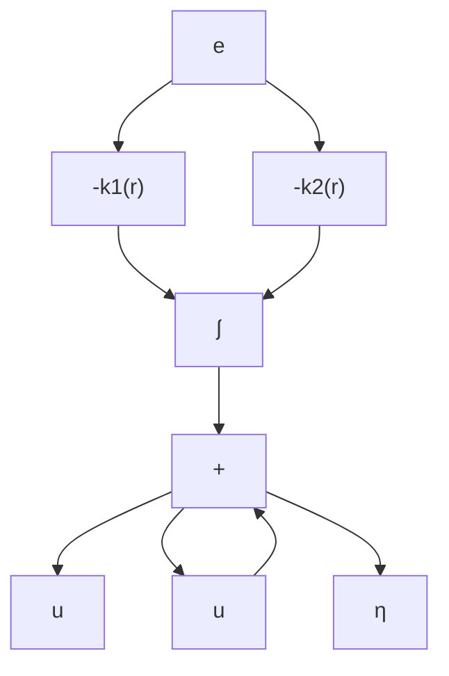

修正模型  
图 12.3 例 12.5 增益分配 PI 控制器的修正

通过这个例子,我们可以归纳出非线性系统增益分配跟踪控制器的设计步骤:

1. 在一组工作点(平衡点)对非线性系统线性化,以分配变量作为参数。  
2. 利用线性化,设计一组参数化的线性控制器,以实现对每个工作点的指定性能要求。  
3. 构造一个增益控制器,使得

- 对每个恒定的外部输入,闭环系统在增益分配控制器下与在固定增益控制器下的平衡点相同;  
- 闭环系统在增益分配控制器下的线性化与固定增益控制器下的线性化等效。

4. 通过对非线性闭环模型仿真,检验增益分配控制器的非局部性能。

第二步可以通过解决一组线性模型的设计问题完成,这些模型与分配变量连续相关,如例 12.5 所示。也可以只对有限个工作点进行设计, 对所有工作点采用相同的控制器结构, 但控制器参数可以随不同的工作点变化。然后对这些控制器参数进行插值运算, 产生一组参数化的线性控制器。实际上, 插值过程通常是根据具体问题的物理背景进行专门处理的①。在下面的推导中, 我们只讨论与分配变量连续相关的一组线性模型的设计问题。

考虑系统

$$\dot {x} = f (x, u, v, w) \tag {12.28}y = h (x, w) \tag {12.29}y _ {m} = h _ {m} (x, w) \tag {12.30}$$

$f, h$ 和 $h_m$ 在定义域 $D_x \times D_u \times D_v \times D_w \subset R^n \times R^p \times R^q \times R^l$ 上是 $(x, u, v)$ 的二次连续可微函数，且对 $w$ 连续。其中， $x$ 是状态， $u$ 是控制输入， $v$ 是被测外部输入， $w$ 是由未知恒定参数及扰动组成的向量， $y \in R^p$ 是受控输出， $y_m \in R^m$ 是被测输出，假设 $y$ 可测，即 $y$ 是 $y_m$ 的子集，设 $r \in D_r \subset R^p$ 是参考信号，我们要设计一个输出反馈控制器，对外部输入

$$
\rho = \left[ \begin{array}{l} r \\ v \end{array} \right] \in D _ {\rho} \stackrel {\mathrm{def}} {=} D _ {r} \times D _ {v}
$$

达到较小的跟踪误差 $e = y - r$ 。利用积分控制，在 $\rho = \alpha$ （常数向量）时实现零稳态误差，并利用增益分配使其对缓慢变化的 $\rho$ 实现较小的误差。将 $\alpha$ 分块，得 $\alpha = [\alpha_r^{\mathrm{T}},\alpha_v^{\mathrm{T}}]^{\mathrm{T}},\alpha_r$ 和 $\alpha_{v}$ 分别对 $r$ 和 $v$ 不变，以 $\rho$ 作为分配变量②。为设计积分控制，假设存在唯一的 $(x_{\mathrm{ss}},u_{\mathrm{ss}}):D_{\rho}\times D_{w}\rightarrow D_{x}\times D_{u}$ 对 $\alpha$ 连续可微，且对 $w$ 连续，对所有 $(\alpha ,w)\in D_{\rho}\times D_{w}$ 满足

$$0 = f \left(x _ {\mathrm{ss}} (\alpha , w), u _ {\mathrm{ss}} (\alpha , w), \alpha_ {v}, w\right) \tag {12.31}\alpha_ {r} = h \left(x _ {\mathrm{ss}} (\alpha , w), w\right) \tag {12.32}$$

当 $\rho=\alpha$ 时, 利用线性化, 如上节所示, 设计如下形式的积分控制器:

$$\dot {\sigma} = e = y - r \tag {12.33}\dot {z} = F (\alpha) z + G _ {1} (\alpha) \sigma + G _ {2} (\alpha) y _ {m} \tag {12.34}u = L (\alpha) z + M _ {1} (\alpha) \sigma + M _ {2} (\alpha) y _ {m} + M _ {3} (\alpha) e \tag {12.35}$$

其中控制器增益 $F, G_{1}, G_{2}, L, M_{1}, M_{2}$ 和 $M_{3}$ 是 $\alpha$ 的连续可微函数，并设计这些函数对于所有 $(\alpha, w) \in D_{\rho} \times D_{w}$ ，使矩阵

$$
\mathcal {A} _ {c} (\alpha , w) = \left[ \begin{array}{c c c} A + B M _ {2} C _ {m} + B M _ {3} C & B M _ {1} & B L \\ C & 0 & 0 \\ G _ {2} C _ {m} & G _ {1} & F \end{array} \right]
$$
