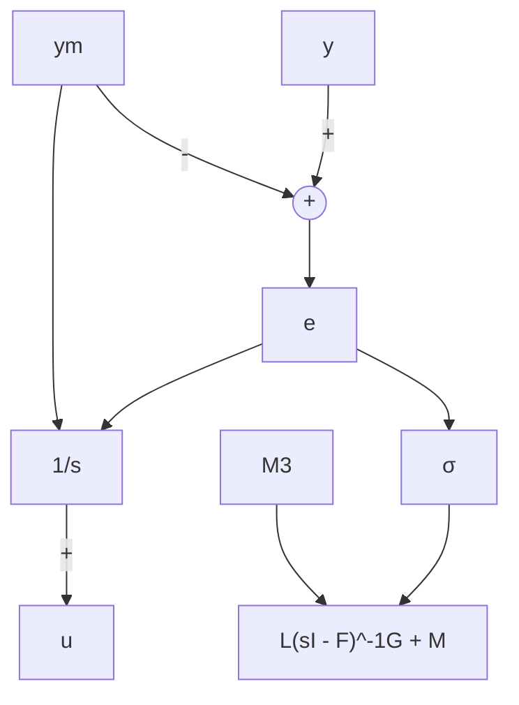

$$
\mathcal {X} = \left[ \begin{array}{c} x \\ \varphi \\ \eta \end{array} \right], \quad g (\mathcal {X}, \rho , w) = \left[ \begin{array}{c} f (x, \eta + M _ {3} (\rho) e, v, w) \\ F (\rho) \varphi + G _ {1} (\rho) e + G _ {2} (\rho) \dot {y} _ {m} \\ L (\rho) \varphi + M _ {1} (\rho) e + M _ {2} (\rho) \dot {y} _ {m} \end{array} \right]
e = h (x, w) - r, \quad \dot {y} _ {m} = \frac {\partial h _ {m}}{\partial x} (x, w) f (x, \eta + M _ {3} (\rho) e, v, w)
$$

当 $\rho=\alpha$ 时, 系统(12.45)\~(12.46) 具有唯一的平衡点

$$
\mathcal {X} _ {\mathrm{ss}} (\alpha , w) = \left[ \begin{array}{c} x _ {\mathrm{ss}} (\alpha , w) \\ 0 \\ u _ {\mathrm{ss}} (\alpha , w) \end{array} \right] \tag {12.47}
$$

在该点 $y = \alpha_{r}$ 。在 $X = X_{ss}$ 对系统 (12.45) \~ (12.46) 线性化，且 $\rho = \alpha$ ，得①

$$\dot {\mathcal {X}} _ {\delta} = A _ {m s} (\alpha , w) \mathcal {X} _ {\delta} + B _ {m s} (\alpha , w) \rho_ {\delta} \tag {12.48}y _ {\delta} = C _ {m s} (\alpha , w) \mathcal {X} _ {\delta} \tag {12.49}$$

其中

$$
\mathcal {X} _ {\delta} = \mathcal {X} - \mathcal {X} _ {\mathrm{ss}}, \quad A _ {m s} = \left[ \begin{array}{c c c} A + B M _ {3} C & 0 & B \\ G _ {1} C + G _ {2} C _ {m} (A + B M _ {3} C) & F & G _ {2} C _ {m} B \\ M _ {1} C + M _ {2} C _ {m} (A + B M _ {3} C) & L & M _ {2} C _ {m} B \end{array} \right]

B _ {m s} = \left[ \begin{array}{c c} - B M _ {3} & E \\ - G _ {1} - G _ {2} C _ {m} B M _ {3} & G _ {2} C _ {m} E \\ - M _ {1} - M _ {2} C _ {m} B M _ {3} & M _ {2} C _ {m} E \end{array} \right], \quad C _ {m s} = \left[ \begin{array}{l l l} C & 0 & 0 \end{array} \right]
$$

验证矩阵 $P = \left[ \begin{array}{ccccc} I & 0 & 0 \\ G_{2}C_{m} & G_{1} & F \\ M_{2}C_{m} & M_{1} & L \end{array} \right]$ (12.50)

是非奇异的，且 $P^{-1}A_{ms}P = A_f,\quad P^{-1}B_{ms} = B_f,\quad C_{ms}P = C_f$ (12.51)

作为习题留给读者完成(见习题12.6)。由此可知,线性模型(12.48)\~(12.49)等价于线性模型(12.40)\~(12.41)。

到目前为止,我们对增益分配控制器下闭环系统的分析,一直集中在恒定工作点邻域内的局部特性,我们能给出非线性系统的更多特性吗?如果分配变量不是常数时系统特性又将如何?在增益分配应用中,习惯上一直可以对时变变量进行分配,只要这些变量的变化相对于系统动态特性足够缓慢,下面的定理即可证明这一点。

flowchart

原始模型

flowchart

