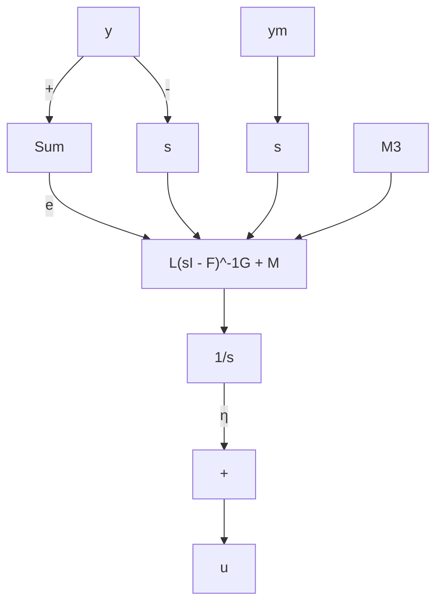

修正模型  
图12.4 增益分配控制器的修正

定理12.1 考虑在前述假设条件下的闭环系统(12.45)\~(12.46)。假设对于所有 $t \geqslant 0, \rho(t)$ 是连续可微的， $\rho(t) \in S(D_{\rho}$ 的一个紧子集），并且 $\| \dot{\rho}(t) \| \leqslant \mu$ 。那么存在正常数 $k_{1}, k_{2}, k$ 和 $T$ ，使得如果 $\mu < k_{1}$ 及 $\| \mathcal{X}(0) - \mathcal{X}_{\mathrm{ss}}(\rho(0), w) \| < k_{2}$ ，则对于所有 $t \geqslant 0, \mathcal{X}(t)$ 是一致有界的，并且 $\| e(t) \| \leqslant k\mu, \quad \forall t \geqslant T$

进而，当 $t$ 趋于无穷时，如果 $\rho (t)$ 趋于 $\rho_{\mathrm{ss}}$ ，且 $\dot{\rho} (t)$ 趋于零，则

$$e (t) \longrightarrow 0$$

证明: 见附录 C.19。

该定理说明,如果分配变量变化缓慢,且在初始时刻初始状态足够靠近平衡点,那么跟踪误差最终与分配变量的导数具有相同的数量级,而且如果分配变量趋于常数极限,则跟踪误差将趋于零。

如果不能得到 $\dot{y}_{m}$ 的测量值, 可以使用下面的增益分配控制器

$$\dot {\varphi} = F (\rho) \varphi + G _ {1} (\rho) e + G _ {2} (\rho) \vartheta \tag {12.52}\dot {\eta} = L (\rho) \varphi + M _ {1} (\rho) e + M _ {2} (\rho) \vartheta \tag {12.53}u = \eta + M _ {3} (\rho) e \tag {12.54}$$

其中， $\dot{y}_{m}$ 可由其估计值 $\vartheta$ 代替，由滤波器

$$\varepsilon \dot {\zeta} = - \zeta + y _ {m} \tag {12.55}\vartheta = \frac {1}{\varepsilon} (- \zeta + y _ {m}) \tag {12.56}$$

得到,其中 $\varepsilon$ 是充分小的正常数,滤波器总是在 $\zeta(0)$ 时启动,且对于某一 k>0,有

$$\| \zeta (0) - y _ {m} (0) \| \leqslant k \varepsilon \tag {12.57}$$

由于 $y_{m}$ 是可测的, 因此总可以满足这一初始条件。进一步讲, 只要系统从一个平衡点启动, 条件 (12.57) 就自动满足, 因为在平衡点 $y_{m} = \zeta$ 。滤波器 (12.55) \~ (12.56) 在 $\varepsilon$ 充分小时可以看成微商逼近器, 由其传递函数

$$\frac {s}{\varepsilon s + 1} I$$

即可看出,当频率远小于 $1/\varepsilon$ 时 $^{①}$ ,上式逼近微分器传递函数 sI。在增益分配控制器(12.52)\~(12.56)下,闭环系统取奇异扰动形式

$$\dot {\mathcal {X}} = g (\mathcal {X}, \rho , w) + N (\rho) (\vartheta - \dot {y} _ {m}) \tag {12.58}\varepsilon \dot {\vartheta} = - \vartheta + \dot {y} _ {m} \tag {12.59}y = h (x, w) \tag {12.60}$$

其中 $\dot{y}_m = \frac{\partial h_m}{\partial x} (x,w)f(x,\eta +M_3(\rho)e,v,w),\quad N = \left[ \begin{array}{c}0\\ G_2\\ M_2 \end{array} \right]$

设定 $\varepsilon=0$ , 可得 $\vartheta=\dot{y}_{m}$ , 系统 (12.58) \~ (12.60) 简化为系统 (12.45) \~ (12.46) , 下面的定理说明对于充分小的 $\varepsilon$ , 滤波器 (12.55) \~ (12.56) 的应用。
