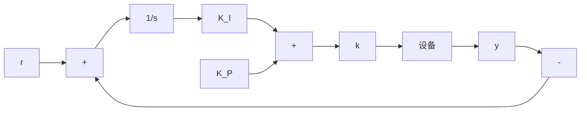
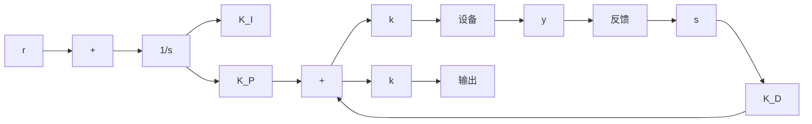

当 $\rho=1$ 时, 控制器(14.29)为典型的 PI 控制器加上一个饱和器(见图 14.13)。当 $\rho=2$ 时, 控制器(14.29)为典型的 PID 控制器加上一个饱和器(见图 14.14)。由此可见, 这是连续滑模控制器与经典控制器之间的有机联系。

flowchart

图 14.13 系统相对阶为 1 时的连续滑模控制器(14.29): 一个 PI 控制器, 其中 $K_{I} = kk_{0} / \varepsilon$ , $K_{P} = k / \varepsilon$ , 后接一个饱和器  

flowchart

图 14.14 系统相对阶为 1 时的连续滑模控制器(14.29): 一个 PID 控制器, 其中 $K_{I} = kk_{0} / \varepsilon$ , $K_{P} = kk_{1} / \varepsilon$ , $K_{D} = k / \varepsilon$ , 后接一个饱和器

① 为了证明该不等式成立,需要附加条件

$$\left| \frac {\Delta (x _ {\mathrm{ss}} , v _ {1} , w , r) - \Delta (x _ {\mathrm{ss}} , v _ {2} , w , r)}{L _ {g} L _ {f} ^ {\rho - 1} h (x _ {\mathrm{ss}} , w)} \right| \leqslant \ell | v _ {1} - v _ {2} |, \quad 0 \leqslant \ell < 1$$

其中 $(v_{1}, v_{2}, w, r) \in R \times R \times D_{w} \times D_{r}\circ$
