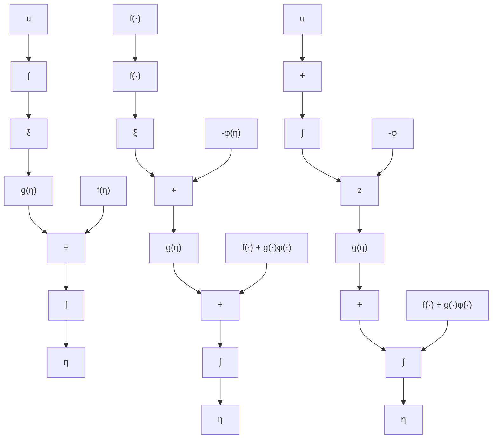

图 14.15 （a）系统(14.49)～(14.50)的方框图；(b) 引入 $\phi(\eta)$ ; (c) 通过积分器的“反步” $-\phi(\eta)$

引理 14.2 考虑系统(14.49)～(14.50)，设 $\phi(\eta)$ 是式(14.49)的稳定状态反馈控制律， $\phi(0)=0$ ，对于某个正定函数 $W(\eta)$ ， $V(\eta)$ 是满足系统(14.51)的李雅普诺夫函数。则状态反馈控制律(14.52)可稳定系统(14.49)～(14.50)的原点，其中 $V(\eta)+[\xi-\phi(\eta)]^{2}/2$ 为系统的李雅普诺夫函数。此外,如果所有假设都全局成立,且 $V(\eta)$ 径向无界,则原点是全局渐近稳定的。

例14.8 考虑系统 $\begin{array}{rcl}\dot{x}_1 & = & x_1^2 -x_1^3 +x_2\\ \dot{x}_2 & = & u \end{array}$

上式采用系统(14.49)\~(14.50)的形式,其中 $\eta=x_{1},\xi=x_{2}$ 。首先考虑标量系统

$$\dot {x} _ {1} = x _ {1} ^ {2} - x _ {1} ^ {3} + x _ {2}$$

把 $x_{2}$ 看成输入,设计反馈控制 $x_{2}=\phi(x_{1})$ ,以稳定原点 $x_{1}=0$ 。取

$$x _ {2} = \phi (x _ {1}) = - x _ {1} ^ {2} - x _ {1}$$

消去非线性项 $x_{1}^{2①}$ ，得

$$\dot {x} _ {1} = - x _ {1} - x _ {1} ^ {3}$$

且 $V(x_{1})=x_{1}^{2}/2$ 满足

$$\dot {V} = - x _ {1} ^ {2} - x _ {1} ^ {4} \leqslant - x _ {1} ^ {2}, \quad \forall x _ {1} \in R$$

因此 $\dot{x}_{1} = -x_{1} - x_{1}^{3}$ 的原点是全局指数稳定的。为运用反步法，应用变量代换

$$z _ {2} = x _ {2} - \phi (x _ {1}) = x _ {2} + x _ {1} + x _ {1} ^ {2}$$

系统的形式转换为 $\begin{array}{rcl}\dot{x}_1 & = & -x_1 - x_1^3 +z_2\\ \dot{z}_2 & = & u + (1 + 2x_1)(-x_1 - x_1^3 +z_2) \end{array}$

取 $V_{c}(x) = \frac{1}{2} x_{1}^{2} + \frac{1}{2} z_{2}^{2}$

作为复合李雅普诺夫函数,得

$$
\begin{array}{l} \dot {V} _ {c} = x _ {1} \left(- x _ {1} - x _ {1} ^ {3} + z _ {2}\right) + z _ {2} \left[ u + \left(1 + 2 x _ {1}\right) \left(- x _ {1} - x _ {1} ^ {3} + z _ {2}\right) \right] \\ = - x _ {1} ^ {2} - x _ {1} ^ {4} + z _ {2} \left[ x _ {1} + (1 + 2 x _ {1}) \left(- x _ {1} - x _ {1} ^ {3} + z _ {2}\right) + u \right] \\ \end{array}
$$

取 $u = -x_{1} - (1 + 2x_{1})(-x_{1} - x_{1}^{3} + z_{2}) - z_{2}$

得 $\dot{V}_{c}=-x_{1}^{2}-x_{1}^{4}-z_{2}^{2}$

因此，原点是全局渐近稳定的。

由于标量系统很简单,因此上一例直接运用了积分器反步法。对于高阶系统,通过积分器反步的迭代仍可简化设计,如下例所示。

例14.9 三阶系统 $\dot{x}_1 = x_1^2 - x_1^3 + x_2$

$$
\begin{array}{l} \dot {x} _ {2} = x _ {3} \\ \dot {x} _ {3} = u \\ \end{array}
$$

由上例中的二阶系统以及在输入端附加的积分器组成,仍采用上例中的积分器反步法。
在完成一次反步后,我们知道二阶系统

$$
\begin{array}{l} \dot {x} _ {1} = x _ {1} ^ {2} - x _ {1} ^ {3} + x _ {2} \\ \dot {x} _ {2} = x _ {3} \\ \end{array}
$$
