  
图14.17 当 $\varepsilon = 0.004$ 时因峰化引起的不稳定

在实际情况下,可以通过在我们感兴趣的紧区域外采用饱和控制,产生一个缓冲,使设备免受峰化的影响。假设饱和控制为

$$u = \mathrm{sat} (- \hat {x} _ {2} ^ {3} - \hat {x} _ {1} - \hat {x} _ {2})$$

图14.18给出了闭环系统在饱和状态反馈与输出反馈下的性能，图中所示为在较短的时间区间内，控制 $u$ 在出现峰值时表现的控制饱和。峰值的持续时间随 $\varepsilon$ 的减小而减小，状态 $x_{1}$ 和 $x_{2}$ 表现出我们前面希望的固有特性，即随着 $\varepsilon$ 的减小，输出反馈的响应逼近状态反馈的响应。注意，在非饱和情况下，当 $\varepsilon < 0.004$ 时就可以检测到不稳定现象，而图中的 $\varepsilon$ 已减小到0.001，不仅系统保持稳定，而且输出反馈下的响应与状态反馈下的响应几乎相同，更有意思的是，当 $\varepsilon$ 趋于零时，输出反馈下的吸引区逼近状态反馈下的吸引区，如图14.19和图14.20所示。图14.19为闭环系统在控制 $u = \mathrm{sat}(-x_2^3 -x_1 - x_2)$ 下的相图，这是被极限环包围的有界吸引区；图14.20为在控制 $u = \mathrm{sat}(-\hat{x}_2^3 -\hat{x}_1 - \hat{x}_2)$ 下，当 $\varepsilon$ 趋于零时，在 $x_{1} - x_{2}$ 相平面内吸引区边界逼近极限环时的交点。

  
图 14.18 在状态反馈(SFB)和输出(OFB)反馈饱和控制下系统的性能

```mermaid
graph TD
    A["Start"] --> B{x1=-3}
    B --> C["->"]
    C --> D["x1=3"]
    D --> E["->"]
    E --> F["->"]
    F --> G["x1=0"]
    G --> H["->"]
    H --> I["->"]
    I --> J["x1=1"]
    J --> K["->"]
    K --> L["x1=2"]
    L --> M["->"]
    M --> N["x1=3"]
    N --> O["->"]
    O --> P["x1=4"]
    P --> Q["->"]
    Q --> R["x1=5"]
    R --> S["->"]
    S --> T["x1=6"]
    T --> U["->"]
    U --> V["x1=7"]
    V --> W["->"]
    W --> X["x1=8"]
    X --> Y["->"]
    Y --> Z["x1=9"]
    Z --> A
    style A fill:#f9f,stroke:#333
    style B fill:#ccf,stroke:#333
    style C fill:#cfc,stroke:#333
    style D fill:#fcc,stroke:#333
    style E fill:#cff,stroke:#333
    style F fill:#ffc,stroke:#333
    style G fill:#cfc,stroke:#333
    style H fill:#fcc,stroke:#333
    style I fill:#cfc,stroke:#333
    style J fill:#fcc,stroke:#333
    style K fill:#cfc,stroke:#333
    style L fill:#fcc,stroke:#333
    style M fill:#cfc,stroke:#333
    style N fill:#fcc,stroke:#333
    style O fill:#cfc,stroke:#333
    style P fill:#fcc,stroke:#333
    style Q fill:#cfc,stroke:#333
    style R fill:#fcc,stroke:#333
    style S fill:#cfc,stroke:#333
    style T fill:#fcc,stroke:#333
```

flowchart

图14.19 闭环系统在 $u = \mathrm{sat}(-x_2^3 - x_1 - x_2)$ 下的相图

contour

