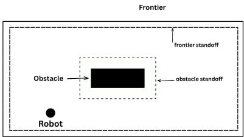
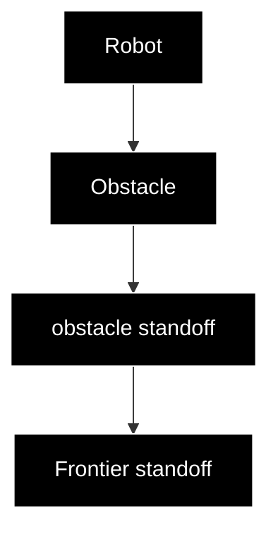
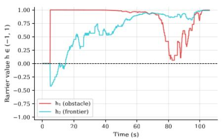
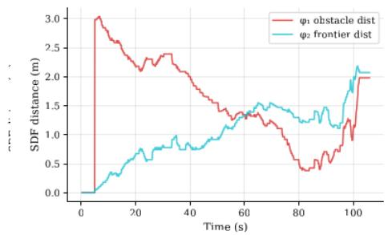
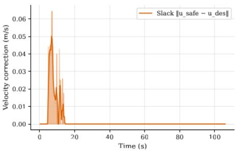

# A Closed-Form Dual-Barrier CBF Safety Filter for Holonomic Robots on Incrementally Built Occupancy Grid Maps

Himanshu Paudel, Basanta Joshi, Dhirendra Raj Madai, Alina Bartaula, Biman Rimal, Sanjay Neupane

Abstract—We present a dual-barrier control barrier function (CBF) safety filter for real-time, safety-critical velocity control of holonomic robots operating in incrementally built occupancygrid maps. As a robot explores an unknown environment, its map grows incrementally and unmapped regions carry irreducible uncertainty: obstacle geometry beyond the explored frontier is entirely unknown, making incursion into unexplored space a source of unquantifiable collision risk especially in cases with only front facing sensor based maps. To address this, we enforce two complementary safety constraints simultaneously: the robot must avoid mapped obstacles and must not venture beyond the explored frontier into regions where no obstacle information exists. Each constraint is derived analytically from the occupancy grid’s signed distance field, yielding a closed-form safety filter that requires at most a small linear system solve per control cycle rather than a general-purpose optimizer. On resourceconstrained companion computers such as the Raspberry Pi, perception and planning pipelines including visual-inertial SLAM already impose substantial computational load, leaving little headroom for a safety layer; the analytical nature of our filter ensures minimal overhead , leaving the remaining compute budget available for SLAM and planning. An adaptive gain schedule further relaxes the frontier constraint in information-rich regions and tightens it in well-mapped areas, improving exploration efficiency without sacrificing safety guarantees. Because the filter acts purely in velocity space as a minimally invasive correction, it composes transparently with arbitrary nominal controllers, including learning-based navigation frameworks, providing formal safety guarantees without requiring access to or modification of the underlying policy. Hardware flight experiments on a PX4- controlled quadrotor demonstrate zero obstacle contacts across multiple indoor runs, with the filter intervening only when the nominal velocity would violate a safety margin.

Index Terms—Control barrier functions, UAV exploration, occupancy grid, signed distance field, safety filter, quadratic programming, adaptive gain, PX4.

# I. INTRODUCTION

AFETY-CRITICAL velocity control of holonomic robots S operating in incrementally built maps requires simultaneously avoiding mapped obstacles and respecting the boundary of explored space, where obstacle information is absent. These two objectives are in direct tension: aggressive navigation toward unexplored regions naturally drives the robot toward unmapped space, where the risk of collision is highest.

Classical reactive controllers, such as artificial potential fields (APF) [3], resolve this tension heuristically: repulsive potentials slow the robot near obstacles while an attractive potential pulls it toward the navigation goal. However, APF controllers provide no formal safety certificate and are susceptible to local minima. Model predictive control (MPC) can incorporate safety constraints explicitly, but its computational cost is prohibitive for onboard execution at high rates on resource-constrained companion computers. The safety filter presented here is demonstrated on a UAV platform with an RRT\*-APF nominal controller, but applies directly to any velocity-controlled holonomic robot; a particularly attractive use case is safety-wrapping learning-based navigation frameworks.

Control barrier functions (CBFs) [1] offer a principled middle ground. A CBF $h \ : \ \mathcal { X } \ \to \ \mathbb { R }$ certifies forward invariance of the safe set $\mathcal { C } = \{ x \mid h ( x ) \geq 0 \}$ by enforcing $\dot { h } ( x , u ) \ge - \gamma h ( x )$ , which reduces to a linear constraint on the control input u and can be resolved as a QP at each timestep. Recent work has extended CBFs to occupancy-grid maps by constructing barrier functions from signed distance fields (SDFs) [2], enabling real-time safety filtering on maps produced by onboard SLAM.

Contribution. We extend the OGM-CBF framework of [2] in three directions:

1) Dual barrier with admissible shaping class: we generalise the single-barrier OGM-CBF to a dual formulation by defining two simultaneous barrier functions—one penalising proximity to obstacles $( h _ { 1 } )$ and one penalising excursion into unexplored space $( h _ { 2 } ) \cdot$ —each constructed from an SDF composed with a shaping function from an admissible class T (monotone, Lipschitz-continuous, sign-preserving, bounded). The class-level analysis subsumes the tanh construction as one concrete instantiation and clarifies which properties are essential for the CBF conditions to hold.   
2) Closed-form dual projection: instead of a generalpurpose QP solver, we enumerate the four KKT activeset cases analytically, reducing the per-cycle computation to at most a $2 \times 2$ linear system. A soft-QP bisection fallback handles the singular case when both SDF gradient directions coincide, finding the least-violating safe velocity.   
3) Adaptive $\gamma _ { 2 } \colon$ the frontier barrier gain is scheduled online using a local uncertainty density estimate derived from the occupancy grid. This relaxes the frontier constraint in information-rich regions and tightens it once the neighbourhood is fully mapped, improving navigation efficiency without sacrificing safety.

We validate the complete system with hardware experiments on a Cuav Nano 7 , Raspberry Pi 4B quadrotor running

PX4 v1.16 and ROS 2 Jazzy, reporting CBF parameters across multiple runs. The remainder of this paper is structured as follows. Section II reviews related work. Section III states the problem formulation. Section IV presents the TanhDualCBF filter in detail. Section VI describes the hardware setup and experimental results. Section VIII concludes.

# II. RELATED WORK

# A. Control Barrier Functions for Robotics

CBFs were formalised by Ames et al. [1] and have since been applied to wheeled robots [4], manipulators, and aerial vehicles [5]. For a control-affine system ${ \dot { x } } = f ( x ) + g ( x ) u$ , a control barrier function $h : \mathcal { X }  \mathbb { R }$ defines the safe set $\mathcal { C } = \{ x \in \mathcal { X } \mid h ( x ) \geq 0 \}$ . Forward invariance is enforced by requiring the existence of a class-K function α such that

$$
L _ {f} h (x) + L _ {g} h (x) u \geq - \alpha (h (x)), \tag {1}
$$

which, for the common linear choice $\alpha ( h ) = \gamma h$ with $\gamma > 0 .$ , reduces to the affine inequality $L _ { f } h ( x ) + L _ { g } h ( x ) u \geq - \gamma h ( x )$ . The standard formulation appends a CBF constraint to a CLF-based QP (CLF-CBF-QP), yielding a safety filter that minimally modifies a nominal controller. Extensions include high-relative-degree systems [6], stochastic settings [7], and learning-based approaches [8].

# B. Safety Filtering for UAVs

Safety-critical control for quadrotors has been studied using CBFs [5] and Hamilton–Jacobi reachability. Most existing approaches assume a known, static environment represented by a geometric model (sphere trees, polytopes), which limits applicability to online SLAM settings where the map evolves continuously.

# C. Occupancy-Grid-Based CBFs

The closest prior work to ours is the OGM-CBF framework [2], which constructs a single barrier function from the signed distance field of an occupancy grid and derives the corresponding CBF condition using the Eikonal property $\| \nabla \phi \| = 1$ . Our work extends this to a dual barrier that additionally constrains the frontier SDF, introduces a closed-form solver for the resulting two-constraint QP, and demonstrates the approach on real UAV hardware.

# D. Frontier-Based Exploration

Frontier exploration [9] identifies boundaries between known-free and unknown space as candidate goals. Scoring functions based on information gain [10], travel cost, and approach-corridor quality have been proposed to select among candidate frontiers.

# III. PROBLEM FORMULATION

# A. System Model

Consider a quadrotor operating in a 2D horizontal plane at fixed altitude, with state $\mathbf { x } = [ p _ { x } , p _ { y } ] ^ { \top } \in \mathbb { R } ^ { 2 }$ and velocity control input $\mathbf { u } = [ v _ { x } , v _ { y } ] ^ { \top } \in \mathbb { R } ^ { \bar { 2 } }$ . The kinematic model is:

$$
\dot {\mathbf {x}} = \mathbf {u}. \tag {2}
$$

flowchart

Fig. 1. Illustration of the frontier and obstacle stand-off distances used in the safety constraints.

A nominal controller (here, an artificial potential field) produces a desired velocity $\mathbf { u } _ { \mathrm { d e s } } \in \mathbb { R } ^ { 2 }$ . Our goal is to compute a minimally modified safe velocity $\mathbf { u } _ { \mathrm { s a f e } }$ such that two safety constraints are satisfied simultaneously.

# B. Occupancy Grid and Signed Distance Fields

Let $\mathcal { M } \subset \mathbb { Z } ^ { 2 }$ denote an occupancy grid map with resolution r [m/cell], where each cell takes values in $\{ - 1 , 0 , 1 0 0 \}$ representing unknown, free, and occupied, respectively. We define two signed distance fields over M:

Obstacle SDF $\phi _ { \mathrm { o b s } } \mathrm { : }$ the signed Euclidean distance to the nearest obstacle cell,

$$
\phi_ {\mathrm{obs}} (\mathbf {x}) > 0 \text {   in   free   space, } \quad \phi_ {\mathrm{obs}} (\mathbf {x}) <   0 \text {   inside   obstacles. } \tag {3}
$$

Both SDFs satisfy the Eikonal equation $\| \nabla \phi \| = 1$ almost everywhere (by Rademacher’s theorem applied to the distance transform), which yields unit-norm gradients suitable for CBF constraint construction.

Frontier SDF $\phi _ { \mathrm { u n k } } \mathrm { : }$ the signed Euclidean distance to the nearest significant unknown-cell cluster. Unknown clusters with fewer than $N _ { \mathrm { m i n } }$ cells are discarded to suppress SLAM noise. When no significant frontier exists (map fully explored), $\phi _ { \mathrm { u n k } }$ is undefined and the frontier constraint is dropped.

# C. Safety Constraints

We require the vehicle to remain in the dual-safe set:

$$
\mathcal {C} _ {1} = \left\{\mathbf {x} \mid \phi_ {\mathrm{obs}} (\mathbf {x}) \geq d _ {\text { safe }} \right\}, \tag {4}
$$

$$
\mathcal {C} _ {2} = \left\{\mathbf {x} \mid \phi_ {\mathrm{unk}} (\mathbf {x}) \geq d _ {\text { stop }} \right\}, \tag {5}
$$

where $d _ { \mathrm { s a f e } }$ and $d _ { \mathrm { s t o p } }$ are user-defined standoff distances. $\mathcal { C } _ { 1 }$ keeps the drone away from obstacles; $\mathcal { C } _ { 2 }$ prevents it from entering unmapped territory where no obstacle information is available. Fig. 1 illustrates the frontier standoff distance and obstacle standoff distance, each defined as the sum of the maximum robot radius and a desired clearance from frontier and obstacles respectively.

# IV. DUAL-OGM-CBF SAFETY FILTER

# A. Admissible Shaping Function Class

Following Raja et al. [2], we do not use the raw SDF as a barrier function directly. Instead, we compose it with a shaping function drawn from the following admissible class.

Definition 1 (Admissible shaping class T ). A function T : R → R belongs to T if it satisfies:

(T1) $T ( 0 ) = 0$ and $T ( s ) \geq 0 \iff s \geq 0$ .   
(T2) T is strictly increasing: $s _ { 1 } < s _ { 2 } \Rightarrow T ( s _ { 1 } ) < T ( s _ { 2 } )$ .   
(T3) $T$ is continuously differentiable with $| T ^ { \prime } ( s ) | \leq L$ for some finite $L = L ( T ) > 0$ .   
(T4) T is bounded: sup ${ \mathrm { , } } | T ( s ) | < \infty .$

Property (T1) ensures $T ( 0 ) = 0$ and sign-preservation, so the zero-superlevel set of $T ( \phi ( \cdot ) - d )$ coincides with $\{ \phi \geq d \}$ . Shifted sigmoids satisfying $T ( 0 ) = 0$ are admissible. Property (T3) guarantees that the Eikonal property $\| \nabla \phi \| = 1$ (valid a.e. by Rademacher’s theorem) carries through to give a bounded gradient norm for the composed barrier. Property (T4) ensures $h _ { i }$ is bounded, preventing $b _ { i } ~ = ~ - \gamma _ { i } h _ { i }$ from becoming arbitrarily negative far from the surface. Without T4, the constraint $\mathbf { g } _ { i } ^ { \top } \mathbf { u } \geq b _ { i }$ would be trivially satisfiable for any u at large $\varphi _ { i } ,$ providing no meaningful safety guarantee in the interior of $\mathcal { C } _ { i }$ .

Remark 1. Any $T \in { \mathcal { T } }$ admits a first-order CBF construction under Definition 1. In particular, $\tau$ includes: (i) $T ( s ) \ = \quad$ tanh(as), a > 0 (our instantiation); (ii) $T ( s ) = s / ( 1 + | s | ) ;$ ; (iii) $T ( s ) \ = \ \mathrm { e r f } ( a s ) , \ a \ > \ 0 ; \ \mathrm { ( i v ) }$ any odd sigmoid with bounded derivative. The analysis in Sections IV-B–IV-E holds for all $T \in { \mathcal { T } } ;$ ; the specific closed forms in (10)–(11) specialise to $T = \operatorname { t a n h }$ .

# B. Dual Barrier Function Construction

Given $T \in { \mathcal { T } }$ and a shift parameter $a _ { i } > 0 ,$ , define the scaled shaping function $T _ { a _ { i } } ( s ) : = T ( a _ { i } s )$ . Note that $T _ { a . }$ satisfies T1, T2, T4 by construction. It satisfies T3 with inherited constant $L _ { i } = a _ { i } L ( T )$ , since by the chain rule $\begin{array} { r } { | T _ { a _ { i } } ^ { \prime } ( s ) | = a _ { i } | T ^ { \prime } ( a _ { i } s ) | \leq } \end{array}$ $a _ { i } L ( T )$ . Hence $T _ { a _ { i } } \in \mathcal { T }$ . The constraint normal $\mathbf { g } _ { i }$ therefore has norm $\| \mathbf { g } _ { i } \| = T _ { a _ { i } } ^ { \prime } ( \varphi _ { i } - d _ { i } ) \| \nabla \varphi _ { i } \| \leq a _ { i } L ( T )$ , which is finite and bounded away from the saturated regime. The i-th barrier function is:

$$
h _ {i} (\mathbf {x}) = T _ {a _ {i}} \big (\phi_ {i} (\mathbf {x}) - d _ {i} \big), \quad i \in \{1, 2 \}, \tag {6}
$$

where $( \phi _ { 1 } , d _ { 1 } ) = ( \phi _ { \mathrm { o b s } } , d _ { \mathrm { s a f e } } )$ and $( \phi _ { 2 } , d _ { 2 } ) = ( \phi _ { \mathrm { u n k } } , d _ { \mathrm { s t o p } } )$ .

Proposition 1. For any $T \in { \mathcal { T } } ,$ , the zero-superlevel set of $h _ { i }$ satisfies $\{ h _ { i } \ge 0 \} = \{ \phi _ { i } \ge d _ { i } \} = \mathcal { C } _ { i }$ .

Proof. Since T satisfies sign-preservation and strict monotonicity (T1, T2), $T ( s ) ~ \geq ~ 0 ~ \iff ~ s ~ \geq ~ 0$ . Therefore $h _ { i } ( \mathbf { x } ) = T _ { a _ { i } } ( \phi _ { i } - d _ { i } ) \geq 0 \iff \phi _ { i } ( \mathbf { x } ) \geq d _ { i } .$ . □

Proposition 2 (Forward invariance of $\mathcal { C } _ { 1 } \cap \mathcal { C } _ { 2 } )$ . Let $h _ { 1 } , h _ { 2 }$ be constructed as in (6) for any $T \in \mathcal T . \ I f \ \mathbf { u } _ { \mathrm { s a f e } }$ is the solution to (12), then the dual-safe set $\mathcal { C } _ { 1 } \cap \mathcal { C } _ { 2 }$ is forward invariant under the kinematic model (2).

Proof. It suffices to show that $\mathbf { u } _ { \mathrm { s a f e } }$ satisfies both halfspace constraints simultaneously, i.e., $\mathbf { g } _ { i } ^ { \top } \mathbf { u } _ { \mathrm { s a f e } } \geq b _ { i }$ for $i = 1 , 2 $ , which implies $\dot { h } _ { i } \geq - \gamma _ { i } h _ { i }$ for each $i ,$ and hence $h _ { i } ( t ) \geq 0$ for all $t \geq 0$ whenever $h _ { i } ( 0 ) \geq 0$ . The $\mathrm { Q P } \left( 1 2 \right)$ is a projection onto $H _ { 1 } \cap H _ { 2 }$ , where $H _ { i } = \{ \mathbf { u } : \mathbf { g } _ { i } ^ { \top } \mathbf { u } \geq b _ { i } \}$ . Each $H _ { i }$ is a closed halfspace, so $H _ { 1 } \cap H _ { 2 }$ is a closed convex set. The KKT enumeration of Section IV-D finds the unique projection of $\mathbf { u } _ { \mathrm { d e s } }$ onto $H _ { 1 } \cap H _ { 2 }$ whenever det $( G ) \neq 0 ,$ , where G is the Gram matrix defined in Section IV-D. When det $( G ) = 0 ( \mathbf { g } _ { 1 }$ ∥ $\mathbf { g } _ { 2 } )$ and $H _ { 1 } \cap H _ { 2 } = \emptyset$ , the soft-QP fallback of Section IV-E finds the least-violating $\mathbf { u } _ { \mathrm { s a f e } }$ with minimum slack $\delta ^ { \star } ;$ in this case both barriers decay at a bounded rate governed by $\delta ^ { \star }$ . In all non-degenerate cases, $\mathbf { u } _ { \mathrm { s a f e } } \in H _ { 1 } \cap H _ { 2 }$ by construction, giving $\dot { h } _ { i } ( \mathbf { x } , \mathbf { u } _ { \mathrm { s a f e } } ) \geq - \gamma _ { i } h _ { i } ( \mathbf { x } )$ for $i = 1 , 2 $ . By the standard CBF invariance theorem [1], each $\mathcal { C } _ { i }$ is forward invariant, and therefore so is $\mathcal { C } _ { 1 } \cap \mathcal { C } _ { 2 }$ . □

Theorem 1. For any $T \in \tau ,$ , the function $\begin{array} { r l } { h _ { i } ( \mathbf { x } ) } & { { } = } \end{array}$ $T _ { a _ { i } } ( \varphi _ { i } ( \mathbf { x } ) - d _ { i } )$ is a valid CBF for Ci with decay rate $\gamma _ { i } ,$ yielding the halfspace constraint (9).

Proof. $\dot { h } _ { i } = T _ { a _ { i } } ^ { \prime } ( \varphi _ { i } - d _ { i } ) \nabla \varphi _ { i } ^ { \top } \mathbf { u }$ . Since $T _ { a _ { i } } ^ { \prime } ~ > ~ 0 ~ ( \mathrm { T } 2 )$ and $\| \nabla \varphi _ { i } \| = 1 \ \mathrm { a . e }$ . (Eikonal), $\dot { h } _ { i }$ is linear and nondegenerate in u. Setting $\dot { h } _ { i } \geq - \gamma _ { i } h _ { i }$ gives constraint (9). □

Corollary 1. For T = tanh, constraint (9) specialises to (10)– (11).

Concrete instantiation. We choose T = tanh, giving:

$$
h _ {i} (\mathbf {x}) = \tanh \left(a _ {i} \left(\phi_ {i} (\mathbf {x}) - d _ {i}\right)\right) \in (- 1, 1). \tag {7}
$$

This choice is convenient because tanh has an explicit derivative tan $\operatorname { \mathrm { 1 } } ^ { \prime } ( s ) = 1 - \operatorname { t a n h } ^ { 2 } ( s ) = \operatorname { s e c h } ^ { 2 } ( s )$ , yielding compact closed-form expressions below, and is numerically stable for large |ϕi|.

# C. CBF Conditions and Linear Velocity Constraints

For a general $T \in { \mathcal { T } } .$ , the time derivative of $h _ { i }$ along the kinematic model (2) is:

$$
\dot {h} _ {i} = T _ {a _ {i}} ^ {\prime} \big (\phi_ {i} - d _ {i} \big) \nabla \phi_ {i} ^ {\top} \mathbf {u}. \tag {8}
$$

Since $\mathit { T } _ { a _ { i } } ^ { \prime } \ > \ 0$ (strict monotonicity, T2) and $\| \nabla \varphi _ { i } \| = 1$ a.e. (Eikonal), $\dot { h } _ { i }$ is linear in u with a well-defined, bounded coefficient. On the discretised occupancy grid, $\nabla \varphi _ { i }$ is approximated by central finite differences and is well-defined at every cell; the CBF condition $\dot { h } _ { i } \geq - \gamma _ { i } h _ { i }$ therefore holds pointwise without qualification. The CBF condition $\dot { h } _ { i } \geq - \gamma _ { i } h _ { i }$ becomes the halfspace constraint:

$$
\underbrace {T _ {a _ {i}} ^ {\prime} \left(\phi_ {i} - d _ {i}\right) \nabla \phi_ {i} ^ {\top}} _ {\mathbf {g} _ {i} ^ {\top}} \mathbf {u} \geq \underbrace {- \gamma_ {i} T _ {a _ {i}} \left(\phi_ {i} - d _ {i}\right)} _ {=: b _ {i}}. \tag {9}
$$

Specialisation to T = tanh. Using tanh $' ( s ) = \operatorname { s e c h } ^ { 2 } ( s ) =$ $1 - \operatorname { t a n h } ^ { 2 } ( s )$ :

$$
\dot {h} _ {i} = a _ {i} \left(1 - h _ {i} ^ {2}\right) \nabla \phi_ {i} ^ {\top} \mathbf {u}, \tag {10}
$$

$$
b _ {i} = - \gamma_ {i} h _ {i} = - \frac {\gamma_ {i}}{2 a _ {i}} \sinh (2 a _ {i} (\phi_ {i} - d _ {i})). \tag {11}
$$

Because $\| \nabla \phi _ { i } \| = 1$ a.e., the constraint normal ${ \bf g } _ { i } = a _ { i } ( 1 -$ $h _ { i } ^ { 2 } ) \nabla \phi _ { i }$ has norm $a _ { i } ( 1 - h _ { i } ^ { 2 } ) \leq a _ { i }$ , so the halfspace is always well-conditioned away from the saturated regime $h _ { i }  \pm 1$ .

# D. Closed-Form Dual Projection

Given the linear constraints (9), the safety filter solves the minimal-modification QP:

$$
\mathbf {u} _ {\text { safe }} = \arg \min _ {\mathbf {u}} \frac {1}{2} \| \mathbf {u} - \mathbf {u} _ {\text { des }} \| ^ {2} \quad \text { s.t. } \quad \mathbf {g} _ {i} ^ {\top} \mathbf {u} \geq b _ {i}, i = 1, 2. \tag {12}
$$

This derivation is valid for any $T \in { \mathcal { T } } ;$ the specific values of $\mathbf { g } _ { i }$ and $b _ { i }$ depend on the chosen instantiation. This is a projection onto the intersection of two halfspaces in $\mathbb { R } ^ { 2 }$ . We enumerate the four KKT active-set cases analytically:

Case 1 (neither constraint violated): $\mathbf { u } _ { \mathrm { s a f e } } = \mathbf { u } _ { \mathrm { d e s } } .$

Case 2 (only constraint i violated): project onto the single halfspace,

$$
\mathbf {u} _ {\text { safe }} = \mathbf {u} _ {\text { des }} + \frac {b _ {i} - \mathbf {g} _ {i} ^ {\top} \mathbf {u} _ {\text { des }}}{\left\| \mathbf {g} _ {i} \right\| ^ {2}} \mathbf {g} _ {i}, \tag {13}
$$

then verify the other constraint. If satisfied, accept; otherwise fall through to Case 4.

Case 3: symmetric to Case 2 for the other constraint.

Case 4 (both constraints active): solve the $2 \times 2$ Gram system

$$
\left[ \begin{array}{l l} \mathbf {g} _ {1} ^ {\top} \mathbf {g} _ {1} & \mathbf {g} _ {1} ^ {\top} \mathbf {g} _ {2} \\ \mathbf {g} _ {2} ^ {\top} \mathbf {g} _ {1} & \mathbf {g} _ {2} ^ {\top} \mathbf {g} _ {2} \end{array} \right] \left[ \begin{array}{l} \lambda_ {1} \\ \lambda_ {2} \end{array} \right] = \left[ \begin{array}{l} b _ {1} - \mathbf {g} _ {1} ^ {\top} \mathbf {u} _ {\mathrm{des}} \\ b _ {2} - \mathbf {g} _ {2} ^ {\top} \mathbf {u} _ {\mathrm{des}} \end{array} \right], \tag {14}
$$

yielding $\mathbf { u } _ { \mathrm { s a f e } } ~ = ~ \mathbf { u } _ { \mathrm { d e s } } + \lambda _ { 1 } \mathbf { g } _ { 1 } + \lambda _ { 2 } \mathbf { g } _ { 2 }$ . The determinant of the Gram matrix is det $= \| \mathbf { g } _ { 1 } \| ^ { 2 } \| \mathbf { g } _ { 2 } \| ^ { 2 } - ( \mathbf { g } _ { 1 } ^ { \top } \mathbf { g } _ { 2 } ) ^ { 2 } =$ $\sin ^ { 2 } \theta \ \left\| \mathbf { g } _ { 1 } \right\| ^ { 2 } \left\| \mathbf { g } _ { 2 } \right\| ^ { 2 }$ , which vanishes if and only if g1 ∥ g2 (obstacle and frontier gradients aligned). KKT dual feasibility requires $\lambda _ { 1 } , \lambda _ { 2 } \geq 0 ;$ if one multiplier is negative, the corresponding constraint is not truly active and we fall back to the single-constraint projection.

# E. Soft-QP Fallback

When $\mathbf { g } _ { 1 } \parallel \mathbf { g } _ { 2 }$ and the hard problem is infeasible, we solve a soft relaxation:

$$
\min _ {\mathbf {u}, \delta \geq 0} \frac {1}{2} \| \mathbf {u} - \mathbf {u} _ {\mathrm{des}} \| ^ {2} + \frac {p}{2} \delta^ {2} \quad \text {s.t.} \quad \mathbf {g} _ {i} ^ {\top} \mathbf {u} \geq b _ {i} - \delta , i = 1, 2. \tag {15}
$$

We solve (15) for $\delta ^ { \star }$ via bisection (20 iterations) and then apply the dual projection of Section IV-D to the relaxed constraints.

# F. Adaptive Frontier Gain $\gamma _ { 2 }$

A fixed $\gamma _ { 2 }$ imposes the same frontier-avoidance stiffness regardless of how much information is available nearby. We instead compute a local uncertainty density:

$$
\rho (\mathbf {x}) = \frac {\left| \{\text { unknown   cells   within   sensor   disc } \} \right|}{\left| \text { disc   area   in   cells } \right|} \in [ 0, 1 ], \tag {16}
$$

and schedule:

$$
\gamma_ {2} = \gamma_ {\min} + (\gamma_ {\max} - \gamma_ {\min}) (1 - \rho). \tag {17}
$$

When $\rho$ is high (many unknown cells nearby), $\gamma _ { 2 }  \gamma _ { \mathrm { m i n } } ,$ relaxing the frontier constraint and allowing the drone to approach unexplored space. When $\rho \approx 0$ (mostly mapped neighbourhood), $\gamma _ { 2 }  \gamma _ { \mathrm { m a x } } .$ , tightening the constraint since there is no exploration value in pushing further. Since $\gamma _ { 2 } ( \mathbf { x } ) \geq$ $\gamma _ { \mathrm { m i n } } > 0$ for all x, the CBF condition $\dot { h } _ { 2 } \ge - \gamma _ { 2 } ( { \bf x } ) h _ { 2 }$ is sufficient for forward invariance of $\mathcal { C } _ { 2 }$ by [1].

# G. Speed Ceiling

After the dual projection, a ball projection enforces a maximum speed:

$$
\mathbf {u} _ {\text { safe }} \leftarrow \left\{ \begin{array}{l l} \mathbf {u} _ {\text { safe }} & \text { if } \| \mathbf {u} _ {\text { safe }} \| \leq v _ {\max}, \\ v _ {\max} \mathbf {u} _ {\text { safe }} / \| \mathbf {u} _ {\text { safe }} \| & \text { otherwise }. \end{array} \right. \tag {18}
$$

Algorithm 1 CBF Safety Filter (general $T \in { \mathcal { T } }$ , tanh instantiation)

Require: $\mathbf { u } _ { \mathrm { d e s } } .$ , ϕobs, $\phi _ { \mathrm { u n k } }$ (or NONE), grid cell $( g _ { x } , g _ { y } )$ , resolution r

Compute $\mathbf { g } _ { 1 } , b _ { 1 }$ from $\phi _ { \mathrm { o b s } }$ via (9)–(11)

if $\phi _ { \mathrm { u n k } } = \Nu$ ONE then

$$
\mathbf {u} _ {\text { safe }} \leftarrow \text { single   projection } (1 3) \text { with } (\mathbf {g} _ {1}, b _ {1})
$$

Compute $\mathbf { g } _ { 2 } , b _ { 2 }$ from $\phi _ { \mathrm { u n k } } ;$ update $\gamma _ { 2 }$ via (17)

Attempt dual projection (Cases 1–4, Section IV-D)

if residual constraint violated then

$$
\mathbf {u} _ {\text { safe }}, \delta^ {\star} \leftarrow \text { soft - QP   bisection   (15) }
$$

end if

end if

Apply speed ceiling; return $\mathbf { u } _ { \mathrm { s a f e } }$

TABLE I CBF PARAMETER SETTINGS 

<table><tr><td>Parameter</td><td>Symbol</td><td>Value</td></tr><tr><td>Obstacle standoff</td><td> $d_{\text{safe}}$ </td><td>0.35 m</td></tr><tr><td>Frontier standoff</td><td> $d_{\text{stop}}$ </td><td>0.35 m</td></tr><tr><td>Obstacle tanh sharpness</td><td> $a_1$ </td><td>2.0</td></tr><tr><td>Frontier tanh sharpness</td><td> $a_2$ </td><td>2.0</td></tr><tr><td>Obstacle CBF gain</td><td> $\gamma_1$ </td><td>1.5</td></tr><tr><td>Frontier CBF gain (max)</td><td> $\gamma_{2,\text{max}}$ </td><td>1.0</td></tr><tr><td>Frontier CBF gain (min)</td><td> $\gamma_{2,\text{min}}$ </td><td>0.2</td></tr><tr><td>Maximum speed</td><td> $v_{\text{max}}$ </td><td>0.20 m s $^{-1}$ </td></tr><tr><td>Min. unknown cluster</td><td> $N_{\text{min}}$ </td><td>25 cells</td></tr></table>

# H. Complete Filter

Algorithm 1 summarises the complete CBF filter.

# V. SYSTEM INTEGRATION

# A. Hardware Platform

Experiments are conducted on a custom quadrotor comprising a CUAV Nano 7 flight controller running PX4 v1.16 and a Raspberry Pi 4B (4 GB) companion computer. Perception is provided by Intel Realsense D435i Camera and a TFMini laser rangefinder for altitude hold. The vehicle communicates via Micro-XRCE DDS over ethernet; the companion computer runs ROS 2 Jazzy and controls the drone in PX4 Offboard mode by streaming velocity setpoints at 10 Hz.

# B. Software Architecture

The exploration stack comprises three layers:

1) Global planner: frontier detection on the RTAB-Map occupancy grid, followed by $\mathrm { R R T ^ { * } }$ path planning on an inflated costmap.   
2) Local controller: artificial potential field (APF) tracking the current RRT∗ waypoint, with repulsive terms for mapped obstacles.   
3) Safety filter: TanhDualCBF applied to the APF output velocity before publication to cmd\_vel.

# C. Parameter Settings

Table I lists the CBF parameters used in all experiments.

# VI. EXPERIMENTAL RESULTS

# A. Simulation Results

Simulation experiments were conducted to evaluate the performance of the proposed CBF filter against the RRT\*-APF only baseline. While the baseline controller maintains safety through highly conservative, distance-based repulsion, this heuristic approach inherently restricts the drone’s operational envelope, causing it to shy away from high curvature areas and unexplored boundaries. Effectively, the baseline controller prioritizes distance from obstacles over mission progress, leading to a ’lazy’ exploration pattern characterized by premature repulsion from frontier interfaces.

In contrast, the proposed CBF acts as an exploration enabler. By providing formal safety guarantees, the filter allows the drone to aggressively navigate boundary proximal regions that the baseline controller would otherwise avoid with lowering of velocity. This ’adventurous’ navigation strategy is quantitatively reflected in the results summarized in Table II: the CBF-enabled drone achieves a final explored area of 81.68 m², increase over the baseline’s 56.35 m². The average adaptive γ2 was in the range of 0.733 - 1.0 . The soft-QP fallback wasn’t triggered.

Table II summarizes the quantitative comparison between the proposed CBF-enabled approach and the RRT\*-APF-only baseline.

# B. Hardware Results

1) Experimental Setup: Experiments were conducted in a hall with relatively open space with some obstacles. The drone was initialised at different positions and was commanded to explore autonomously for up to 120 seconds. In practice, individual runs were terminated early due to low battery or proximity-triggered operator intervention; only data up to the point of termination is reported for each run. Three hardware runs are reported.

2) Representative Hardware Traces: Fig. 2 presents representative traces from Run 1, including the barrier values, raw SDF distances, and the CBF-induced velocity change. Together with Table III, these plots summarize the same hardware-run category from complementary perspectives: time-series behavior in the figure and aggregate run-level metrics in the table.   
3) Intervention Analysis: Table III summarises the CBFspecific metrics across the three hardware runs. The soft-QP Fallback wasn’t triggered across any runs.   
4) Safety Record: Across all hardware runs, zero obstacle contacts were recorded. The minimum observed clearance of 0.25 m occurred in Run 3; although the resulting velocity correction was small in magnitude, at such proximity even a marginal deflection is safety-critical. The barrier $h _ { 1 }$ briefly dipped below zero in this run, however the physical clearance remained above the drone radius of 0.22 m, consistent with the conservative 0.35 m safety margin encoded in the barrier function providing a buffer against such transient violations.

# VII. DISCUSSION

Limitations. The current implementation operates in 2D (horizontal plane at fixed altitude). Extension to 3D would require volumetric SDF computation, which is computationally more demanding. The frontier barrier relies on the occupancy grid produced by RTAB-Map; SLAM failures or delayed loop closures can temporarily misrepresent the frontier SDF.Furthermore, the framework currently assumes a static environment; handling dynamic obstacles would necessitate the integration of velocity prediction within the CBF constraints. We also note that the tuning of class-κ functions presents a trade-off between safety and performance, and in highly cluttered scenarios, the underlying QP solver may face infeasibility, requiring more robust slack variable handling.

# VIII. CONCLUSION

We presented a dual-constraint safety filter that simultaneously enforces obstacle standoff and frontier containment for autonomous UAV exploration. The filter admits a closed-form solution via KKT active-set enumeration, avoiding the overhead of a general QP solver, and falls back to a soft relaxation that finds the least-violating velocity in the degenerate case. An adaptive gain schedule improves exploration efficiency by relaxing the frontier constraint in information-rich regions. Hardware experiments on a real PX4 quadrotor demonstrate the CBF filter execution on a Raspberry Pi 4B companion computer.

TABLE IICOMPARATIVE PERFORMANCE METRICS BETWEEN THE PROPOSED CBF-ENABLED APPROACH AND THE RRT\*-APF ONLY BASELINE.

<table><tr><td>Metric</td><td>CBF (Proposed)</td><td>Baseline (APF Only)</td></tr><tr><td colspan="3">Mission Performance</td></tr><tr><td>Total exploration time (s)</td><td>120.0</td><td>120.0</td></tr><tr><td>Final coverage (%)</td><td>50.2</td><td>50.4</td></tr><tr><td>Explored area ( $m^2$ )</td><td>81.68</td><td>56.35</td></tr><tr><td>Total path length (m)</td><td>15.88</td><td>13.35</td></tr><tr><td>Average speed (m/s)</td><td>0.133</td><td>0.112</td></tr><tr><td colspan="3">Safety &amp; CBF Metrics</td></tr><tr><td>Global min clearance (m)</td><td>0.304</td><td>0.412</td></tr><tr><td>Obstacle violation ticks</td><td>11</td><td>0</td></tr><tr><td>Frontier violation ticks</td><td>66</td><td>56</td></tr><tr><td>CBF intervention rate</td><td>0.0467</td><td>0.0000</td></tr><tr><td>CBF speed clips</td><td>189</td><td>0</td></tr><tr><td>Avg CBF slack</td><td>0.0012</td><td>0.0000</td></tr><tr><td>Avg adaptive  $\gamma_2$ </td><td>0.9253</td><td>—</td></tr></table>

line

| Time (s) | h₁ (obstacle) | h₂ (frontier) |
| -------- | -------------- | ------------- |
| 0        | 1.00           | -0.50         |
| 20       | 1.00           | 0.50          |
| 40       | 1.00           | 0.75          |
| 60       | 1.00           | 0.90          |
| 80       | 0.10           | 0.85          |
| 100      | 1.00           | 1.00          |

(a) CBF barrier functions

line

| Time (s) | φ₁ obstacle dist | φ₂ frontier dist |
| -------- | ---------------- | ---------------- |
| 0        | 3.0              | 0.0              |
| 20       | 2.2              | 0.8              |
| 40       | 2.4              | 1.0              |
| 60       | 1.4              | 1.5              |
| 80       | 0.4              | 1.3              |
| 100      | 2.0              | 2.2              |

(b) Raw SDF distances

line

| Time (s) | Velocity correction (m/s) |
| -------- | ------------------------- |
| 0        | 0.00                      |
| 5        | 0.06                      |
| 10       | 0.04                      |
| 15       | 0.02                      |
| 20       | 0.00                      |
| 25       | 0.00                      |
| 30       | 0.00                      |
| 35       | 0.00                      |
| 40       | 0.00                      |
| 45       | 0.00                      |
| 50       | 0.00                      |
| 55       | 0.00                      |
| 60       | 0.00                      |
| 65       | 0.00                      |
| 70       | 0.00                      |
| 75       | 0.00                      |
| 80       | 0.00                      |
| 85       | 0.00                      |
| 90       | 0.00                      |
| 95       | 0.00                      |
| 100      | 0.00                      |

(c) CBF-induced velocity change   
Fig. 2. Representative hardware traces from Run 1 showing the barrier-function evolution, raw SDF distances, and the change in commanded velocity induced by the CBF filter.

TABLE III CBF METRICS ACROSS HARDWARE RUNS 

<table><tr><td>Run</td><td>Ticks eval.</td><td>Obs. active</td><td>Front. active</td><td>Interv. rate</td><td>Infeasible</td><td>Speed clips</td><td>Min  $h_1$  / Min  $h_2$ </td></tr><tr><td>Run 1</td><td>1058</td><td>0</td><td>71</td><td>0.0671</td><td>0</td><td>56</td><td>0.0000 / -0.4219</td></tr><tr><td>Run 2</td><td>1008</td><td>0</td><td>145</td><td>0.1438</td><td>0</td><td>89</td><td>0.0000 / -0.9743</td></tr><tr><td>Run 3</td><td>1198</td><td>4</td><td>172</td><td>0.1469</td><td>0</td><td>107</td><td>-0.1974 / -0.7163</td></tr></table>

<table><tr><td>Run</td><td>Avg. CBF slack</td><td>Max CBF slack</td></tr><tr><td>Run 1</td><td>0.0018</td><td>0.0647</td></tr><tr><td>Run 2</td><td>0.0098</td><td>0.1844</td></tr><tr><td>Run 3</td><td>0.0056</td><td>0.0926</td></tr></table>

# AUTHOR CONTRIBUTIONS

Himanshu Paudel conceptualized the theoretical framework, formulated the control barrier function (CBF)-based filter, derived the analytical solutions, and developed the exploration planner. Additionally, he led the simulation efforts, contributed heavily to the VIO setup, SLAM, and hardware implementation, and wrote the original draft of the manuscript. Basanta Joshi collaborated on the VIO setup, SLAM, and their respective simulation and hardware implementations and experiments . Dhirendra Raj Madai and Alina Bartaula designed the UAV platform, integrated the physical hardware components, and managed the electrical wiring and avionics. All student authors jointly handled the low-level flight controller (PX4) configuration. Biman Rimal and Sanjay Neupane provided overall project supervision, secured hardware resources, offered high level structural guidance, and contributed to the review and editing of the final manuscript.

# ACKNOWLEDGMENTS REFERENCES

[1] A. D. Ames, S. Coogan, M. Egerstedt, G. Notomista, K. Sreenath, and P. Tabuada, “Control barrier functions: Theory and applications,” in Proc. 18th European Control Conf. (ECC), Naples, Italy, 2019, pp. 3420–3431.

[2] G. Raja, T. Mokk ¨ onen, and R. Ghabcheloo, “Safe robot control using ¨ occupancy grid map-based control barrier function (OGM-CBF),” arXiv preprint arXiv:2405.10703, 2024.   
[3] O. Khatib, “Real-time obstacle avoidance for manipulators and mobile robots,” Int. J. Robot. Res., vol. 5, no. 1, pp. 90–98, 1986.   
[4] L. Wang, A. D. Ames, and M. Egerstedt, “Safety barrier certificates for collisions-free multirobot systems,” IEEE Trans. Robot., vol. 33, no. 3, pp. 661–674, 2017.   
[5] G. Wu and K. Sreenath, “Safety-critical and constrained geometric control synthesis for a quadrotor UAV on SE(3),” in Proc. Amer. Control Conf. (ACC), Boston, MA, USA, 2016, pp. 2038–2044.   
[6] Q. Nguyen and K. Sreenath, “Exponential control barrier functions for enforcing high relative-degree safety-critical constraints,” in Proc. Amer. Control Conf. (ACC), Boston, MA, USA, 2016, pp. 322–328.   
[7] A. Clark, “Control barrier functions for stochastic systems,” Automatica, vol. 130, p. 109688, 2021.   
[8] M. Srinivasan, A. Dabholkar, S. Coogan, and P. A. Vela, “Synthesis of control barrier functions using a supervised machine learning approach,” in Proc. IEEE/RSJ Int. Conf. Intell. Robots Syst. (IROS), Las Vegas, NV, USA, 2020, pp. 7139–7145.   
[9] B. Yamauchi, “A frontier-based approach for autonomous exploration,” in Proc. IEEE Int. Symp. Comput. Intell. Robot. Autom. (CIRA), Monterey, CA, USA, 1997, pp. 146–151.   
[10] A. Bircher, M. Kamel, K. Alexis, H. Oleynikova, and R. Siegwart, “Receding horizon “next-best-view” planner for 3D exploration,” in Proc. IEEE Int. Conf. Robot. Autom. (ICRA), Stockholm, Sweden, 2016, pp. 1462–1468.