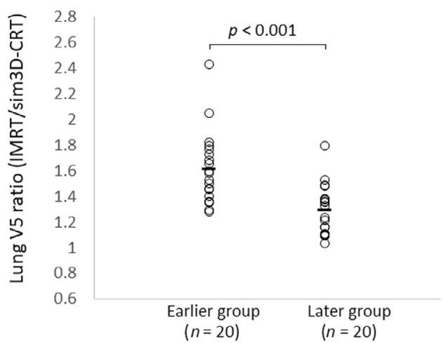
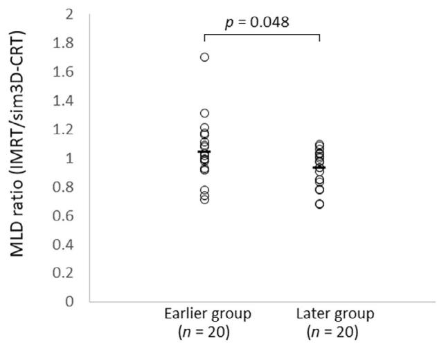

# Learning curve of lung dose optimization in intensity-modulated radiotherapy for locally advanced non-small cell lung cancer

Mitsunobu Igari | Takanori Abe | Misaki Iino | Satoshi Saito | Tomomi Aoshika | Yasuhiro Ryuno | Tomohiro Ohta | Ryuta Hirai | Yu Kumazaki | Shin-ei Noda | Shingo Kato

Department of Radiation Oncology, International Medical Center, Saitama Medical University, Saitama, Japan

# Correspondence

Takanori Abe, Department of Radiation Oncology, International Medical Center, Saitama Medical University, Saitama, 350-1298, Japan. Email: mrtaka100@yahoo.co.jp

# Abstract

Background: Intensity-modulated radiotherapy (IMRT) has been increasingly used for patients with locally advanced non-small cell lung cancer (LA-NSCLC). However, there are some barriers to implementing IMRT for LA-NSCLC, including the complexity of treatment plan optimization. This study aimed to evaluate the learning curve of lung dose optimization in IMRT for LA-NSCLC and identify the factors that affect the degree of achievement of lung dose optimization.

Methods: We retrospectively evaluated 40 consecutive patients with LA-NSCLC who received concurrent chemoradiotherapy at our institution. These 40 patients were divided into two groups: 20 initially treated patients (earlier group) and 20 subsequently treated patients (later group). Patient and tumor characteristics were compared between the two groups. The dose-volume parameter ratio between the actually delivered IMRT plan and the simulated three-dimensional conformal radiotherapy plan was also compared between the two groups to determine the learning curve of lung dose optimization.

Results: The dose-volume parameter ratio for lung volume to receive more than 5 Gy (lung V5) and mean lung dose (MLD) significantly decreased in later groups. The spread of the beam path and insufficient optimization of dose coverage of planning target volume (PTV) might cause poor control of lung V5, MLD.

Conclusions: A learning curve for lung dose optimization was observed with the accumulation of experience. Appropriate techniques, such as restricting the beam path and ensuring dose coverage of PTV during the optimization process, are essential to control lung dose in IMRT for LA-NSCLC.

# K E Y W O R D S

intensity-modulated radiotherapy, learning curve, lung cancer, lung dose, optimization

# INTRODUCTION

Radiotherapy plays a key role in curative therapy for locally advanced non-small cell lung cancer (LA-NSCLC).1 Recently, radiotherapy technology has progressed, and various cancers are currently treated with intensity-modulated radiotherapy (IMRT) rather than three-dimensional conformal radiation therapy (3D-CRT).2 IMRT is an irradiation method that can increase the dose to the tumor and decrease the dose to the surrounding risk organs by changing the dose intensity within the irradiation field. Dosimetric comparative studies revealed that IMRT for LA-NSCLC could increase the dose to the tumor while reducing the dose to the lungs, heart, esophagus, and spinal cord compared with 3D-CRT.3,4 In addition, several studies reported clinical results, and IMRT has been demonstrated to reduce adverse events while achieving comparable tumor control as 3D-CRT.5–7 Another advance in the treatment of LA-NSCLC is the evolution of pharmacotherapy.

This is an open access article under the terms of the Creative Commons Attribution-NonCommercial-NoDerivs License, which permits use and distribution in any medium, provided the original work is properly cited, the use is non-commercial and no modifications or adaptations are made. © 2023 The Authors. Thoracic Cancer published by China Lung Oncology Group and John Wiley & Sons Australia, Ltd.

The PACIFIC trial, which examined the efficacy of consolidative durvalumab after definitive radiotherapy for LA-NSCLC, recorded improvements in progression-free and overall survival,8,9 and this regimen has become the standard of care.1 In this era, the safe completion of definitive radiotherapy and the smooth introduction of durvalumab are of critical importance. In that sense, reducing adverse events by lowering the dose to organs at risk while securing the radiation dose to the tumor using IMRT has gained great significance. However, there are some barriers in introducing IMRT for locally advanced lung cancer.10 One such barrier is the complexity of treatment plan optimization. When optimizing IMRT plans for LA-NSCLC, doses to several organs at risk such as the lungs, spinal cord, esophagus, skin, and heart should be reduced while ensuring sufficient radiation doses to tumors. In clinical practice, working time is limited, but some time is required to create reasonable treatment plans that satisfy all dose constraints for several organs and tumors. In addition, it is difficult to clarify whether the dose distribution is maximally optimized even if the treatment plan satisfies dose constraints. In our previous study, we proposed a clinically useful and significant simple indicator to determine the degree of dose optimization in individual patients with lung cancer.11 Although this indicator was significant and useful for lung dose optimization in IMRT for LA-NSCLC, there could be room for improvement with accumulated experience because the indicator was derived from our earlier experiences. In this study, we reapplied our methods in a larger number of patients and examined whether there was a learning curve in lung dose optimization and whether there were changes in our proposed indicator for evaluating the degree of lung dose optimization.

# METHODS

# Patients

In this retrospective study, patients with LA-NSCLC who underwent concurrent chemoradiotherapy and then received durvalumab at our hospital between March 2020 and March 2022 were analyzed. All patients were pathologically diagnosed via biopsy using a bronchial scope. Chest x-ray, chest-to-pelvis computed tomography (CT), 2-[fluorine-18] fluoro-2-deoxy-D-glucose (FDG)-positron emission tomography (PET)/CT, and brain magnetic resonance imaging (MRI) were performed to determine the tumor stage using the TNM Classification of Malignant Tumors (eighth edition). This study was approved by our Institutional Review Board (reference no.: 22–144) and was performed in accordance with the Declaration of Helsinki. Written informed consent for the use of medical data was obtained from all patients.

# Radiotherapy

All clinical plans were generated for the Trilogy or True-Beam (Varian Medical Systems) with 6 MV photon beams. The Eclipse treatment planning system (version 15 and 16, Varian Medical Systems) and an analytical anisotropic algorithm (AAA, version 15.0.11 or 16.0.1, Varian Medical Systems) was used. All patients were treated with volumetric modulated arc therapy (VMAT) with a total dose of 60 Gy in 30 fractions in this study. We adopted involved field irradiation, and no patients were treated with elective nodal irradiation. A method to create the target volume was described in detail in our previous study.11 The radiation dose of 60 Gy in 30 fractions was prescribed to cover 95% of the planning target volume (PTV). First, the plan for each patient used multiple partial arc fields to avoid beam incidence on the healthy lung as much as possible. In addition, the dummy region of interest (ROI) was created on the contralateral lung ipsilateral and distant lobe from the primary tumor and it was used to limit beam entrance into the normal lung. The parameter for the optimization calculations were set manually based on the planner’s experience, and dose distributions were calculated to satisfy the dose constraints specified in the in-house protocol which are summarized in Table 1.

T A B L E 1 Dose constraints of our in-house protocol. 

<table><tr><td>Volume of interest</td><td>Dose constraints</td></tr><tr><td rowspan="2">Planning target volume</td><td>D95  $\geq$  60 Gy</td></tr><tr><td>Dmax  $\leq$  72 Gy</td></tr><tr><td rowspan="2">Lungs (exclude gross tumor volume)</td><td>V5  $\leq$  60%</td></tr><tr><td>V20  $\leq$  25%</td></tr><tr><td>Esophagus</td><td>V60  $\leq$  19%</td></tr><tr><td>Heart</td><td>V50  $\leq$  30%</td></tr><tr><td>Spinal cord</td><td>Dmax &lt; 50 Gy</td></tr></table>

# Simulated 3D-CRT

Simulated 3D-CRT was performed using a simple and reproducible method as much as possible because it served as a reference. The target volume and contouring of organs at risk matched those of the IMRT plan. The radiation dose of 60 Gy in 30 fractions was prescribed to the isocenter of beams, which were automatically set at the geometrical center of PTV with TPS. When the isocenter was located in the lung parenchyma, it was slightly moved inside the tumor, which exhibited soft tissue density on CT. Four beams were used, and the beam angles were 0 and 180 for the opposed angle and 30 for the rotated diagonal angle. The multileaf collimator (MLC) margin was 5 mm from the PTV. In this study, the MLC position was not manually adjusted to cover the spinal cord or other organs at risk because this simulated 3D-CRT plan was only used as the reference.

# Chemotherapy

Chemotherapy was concurrently administered with IMRT. Before administration, patient conditions and organ function were carefully checked by thoracic medical oncologists. Pre-existing interstitial pneumonia is considered a contraindication for CCRT in our hospital. Patients received platinumbased chemotherapy, and regimens were determined by medical oncologists while considering the patient’s medical and social conditions.

# Durvalumab

Durvalumab therapy was initiated after CCRT. Before durvalumab initiation, chest CT was performed to assess disease progression and detect radiation pneumonitis (RP). Toxicities were classified in accordance with the National Cancer Institute Common Toxicity Criteria for Adverse Events, version 5.0. If there was no problem, durvalumab was administered biweekly for 1 year until disease progression or the occurrence of grade 2 or higher interstitial lung disease.

# Evaluation

During durvalumab administration, patients underwent chest x-ray and blood tests at each hospital visit. Chest CT or FDG-PET/CT was performed in cases of suspicion of RP or recurrence. In this study, interstitial lung disease was carefully diagnosed by thoracic medical oncologists using the results of multiple examinations such as CT, blood tests, and patients’ medical history and symptoms. Bacterial and viral pneumonia was also carefully excluded by thoracic medical oncologists when patients developed respiratory symptoms. After a careful diagnosis, RP was classified using CTCAE version 5.0. After durvalumab therapy, patients underwent follow-up every 3 months, and they periodically received any necessary examination such as blood tests, chest x-ray, chest CT, and brain FDG-PET/ CT and MRI.

# Statistical analysis

A total of 40 consecutive patients who received the PACIFIC regimen since we started utilizing it in January 2020 were analyzed in this study. Patients were divided into two groups (earlier and later groups, n = 20/group). Patient and tumor characteristics were compared between the groups using the Student’s t-test for numerical variables and the chi-squared test for categorical variables. Dose–volume parameters such as lung volume to receive more than 5 Gy (lung V5), lung volume to receive more than 20 Gy (lung V20), and the mean lung dose (MLD) and their ratios between IMRT and simulated 3D-CRT were calculated and compared between the groups using the Student’s t-test. These statistical analyses were performed using IBM SPSS Statistics for Windows, version 25.0 (IBM Corp.). Scatter plot diagrams were drawn using Excel 2016 (Microsof ).

T A B L E 2 Patient characteristics (n = 40). 

<table><tr><td>Patient or tumor characteristics</td><td>Earlier group (n = 20)</td><td>Later group (n = 20)</td><td>p-value</td></tr><tr><td>Age, years, median</td><td>71</td><td>69</td><td>0.322</td></tr><tr><td>Sex</td><td></td><td></td><td></td></tr><tr><td>Male</td><td>14</td><td>13</td><td>0.736</td></tr><tr><td>Female</td><td>6</td><td>7</td><td></td></tr><tr><td>Histopathological type, n, (%)</td><td></td><td></td><td></td></tr><tr><td>Adenocarcinoma</td><td>4</td><td>5</td><td>0.002</td></tr><tr><td>Squamous cell carcinoma</td><td>15</td><td>14</td><td></td></tr><tr><td>NSCLC</td><td>1</td><td>1</td><td></td></tr><tr><td>T classification, n (%)</td><td></td><td></td><td></td></tr><tr><td>1</td><td>3</td><td>5</td><td>0.254</td></tr><tr><td>2</td><td>5</td><td>7</td><td></td></tr><tr><td>3</td><td>2</td><td>4</td><td></td></tr><tr><td>4</td><td>10</td><td>4</td><td></td></tr><tr><td>N classification, n (%)</td><td></td><td></td><td></td></tr><tr><td>0</td><td>3</td><td>1</td><td>0.057</td></tr><tr><td>1</td><td>6</td><td>2</td><td></td></tr><tr><td>2</td><td>9</td><td>8</td><td></td></tr><tr><td>3</td><td>2</td><td>9</td><td></td></tr><tr><td>Clinical stage, n (%)</td><td></td><td></td><td></td></tr><tr><td>IIB</td><td>1</td><td>2</td><td>0.18</td></tr><tr><td>IIIA</td><td>13</td><td>7</td><td></td></tr><tr><td>IIIB</td><td>5</td><td>6</td><td></td></tr><tr><td>IIIC</td><td>1</td><td>5</td><td></td></tr><tr><td>Volume of PTV, mL</td><td>240</td><td>267</td><td>0.476</td></tr><tr><td>Location of primary tumor</td><td></td><td></td><td></td></tr><tr><td>Right upper lobe</td><td>8</td><td>6</td><td>0.745</td></tr><tr><td>Right middle lobe</td><td>0</td><td>1</td><td></td></tr><tr><td>Right lower lobe</td><td>5</td><td>5</td><td></td></tr><tr><td>Left upper lobe</td><td>5</td><td>7</td><td></td></tr><tr><td>Left lower lobe</td><td>2</td><td>1</td><td></td></tr><tr><td>Regimen of chemotherapy, n (%)</td><td></td><td></td><td></td></tr><tr><td>Daily carboplatin</td><td>9</td><td>10</td><td>0.738</td></tr><tr><td>Weekly carboplatin + paclitaxel</td><td>10</td><td>8</td><td></td></tr><tr><td>Cisplatin + TS-1</td><td>1</td><td>2</td><td></td></tr><tr><td>Tumor proportion score, n (%)</td><td></td><td></td><td></td></tr><tr><td>&lt;1%</td><td>8</td><td>5</td><td>0.738</td></tr><tr><td>1–49%</td><td>5</td><td>4</td><td></td></tr><tr><td>&gt;49%</td><td>5</td><td>8</td><td></td></tr><tr><td>Not evaluated</td><td>2</td><td>3</td><td></td></tr></table>

Abbreviation: NSCLC, non-small cell lung cancer; PTV, planning target volume.

# RESULTS

# Patient and tumor characteristics

We retrospectively analyzed 40 consecutive patients with LA-NSCLC who were treated between March 2020 and

T A B L E 3 Dose–volume parameters $( n = 4 0 )$ . 

<table><tr><td rowspan="2"></td><td colspan="3">Earlier group (n = 20)</td><td colspan="3">Later group (n = 20)</td></tr><tr><td>IMRT</td><td>Simulated 3D-CRT</td><td>p-value</td><td>IMRT</td><td>Simulated 3D-CRT</td><td>p-value</td></tr><tr><td>Lung V5, % (±SD)</td><td>47.0 (±9.8)</td><td>29.7 (±6.5)</td><td>&lt;0.001</td><td>45.1 (±9.8)</td><td>35.5 (±9.0)</td><td>0.003</td></tr><tr><td>Lung V20</td><td>17.9 (±3.9)</td><td>19.6 (±5.0)</td><td>0.253</td><td>19.3 (±5.4)</td><td>22.8 (±6.4)</td><td>0.074</td></tr><tr><td>Lung V30</td><td>11.2 (±2.6)</td><td>16.4 (±5.0)</td><td>&lt;0.001</td><td>13.5 (±4.3)</td><td>18.8 (±5.8)</td><td>0.002</td></tr><tr><td>Lung V40</td><td>6.9 (±2.1)</td><td>13.4 (±4.0)</td><td>&lt;0.001</td><td>9.2 (±3.3)</td><td>15.7 (±5.2)</td><td>&lt;0.001</td></tr><tr><td>Lung V50</td><td>4.3 (±1.6)</td><td>9.4 (±3.6)</td><td>&lt;0.001</td><td>5.8 (±2.5)</td><td>11.6 (±4.6)</td><td>&lt;0.001</td></tr><tr><td>Lung V60</td><td>2.1 (±1.1)</td><td>1.3 (±1.3)</td><td>0.058</td><td>2.8 (±1.6)</td><td>2.9 (±2.9)</td><td>0.875</td></tr><tr><td>Mean lung dose</td><td>10.8 (±1.9)</td><td>10.7 (±2.5)</td><td>0.888</td><td>11.6 (±2.7)</td><td>12.7(±3.3)</td><td>0.267</td></tr><tr><td>Conformity index</td><td>1.2 (±0.2)</td><td>0.9 (±0.6)</td><td>0.078</td><td>1.1 (±0.1)</td><td>1.5 (±0.7)</td><td>0.006</td></tr><tr><td>Mean heart dose</td><td>8.7 (±7.4)</td><td>10.7 (±11.9)</td><td>0.536</td><td>10.9 (±7.4)</td><td>13.7 (±11.2)</td><td>0.345</td></tr><tr><td>Mean esophagus dose</td><td>14.7 (±6.5)</td><td>9.9 (±8.7)</td><td>0.058</td><td>16.5 (±8.7)</td><td>16.5 (±9.7)</td><td>0.999</td></tr></table>

Abbreviations: IMRT, intensity-modulated radiotherapy; 3D-CRT, three-dimensional conformal radiation therapy.

scatter

| Group              | Lung V5 ratio (IMRT/sim3D-CRT) |
| ------------------ | ------------------------------ |
| Earlier group (n = 20) | 2.4                            |
| Earlier group (n = 20) | 2.0                            |
| Earlier group (n = 20) | 1.8                            |
| Earlier group (n = 20) | 1.6                            |
| Earlier group (n = 20) | 1.4                            |
| Earlier group (n = 20) | 1.2                            |
| Earlier group (n = 20) | 1.0                            |
| Later group (n = 20)   | 1.8                            |
| Later group (n = 20)   | 1.5                            |
| Later group (n = 20)   | 1.3                            |
| Later group (n = 20)   | 1.1                            |
| Later group (n = 20)   | 0.9                            |
| Later group (n = 20)   | 0.7                            |

F I G U R E 1 Lung V5 ratio between intensity-modulated radiotherapy (IMRT) and simulated three-dimensional conformal radiation therapy (3D-CRT) are shown. Circle dot represents individual patients and black bar represents mean value for each group. Mean $\mathrm { V } 5 _ { \mathrm { I M R T } } / \mathrm { V } 5 _ { \mathrm { s i m } 3 \mathrm { D } - \mathrm { C R T } }$ was 1.61 in the earlier group while it was 1.29 in the later group which was significantly different $\left( { p < 0 . 0 0 1 } \right)$ ).

March 2022. The cohort included 27 men and 13 women with a median age of 71 years old. The pathological diagnosis was adenocarcinoma in 19 patients, squamous cell carcinoma in 19 patients, and NSCLC in two patients. The clinical tumor stages were IIB, IIIA, IIIB, and IIIC in three, 20, 11, and six patients, respectively. The chemotherapy regimens were daily carboplatin $( n = 1 9 )$ , weekly carboplatin + paclitaxel $( n = 1 8 )$ , and cisplatin + TS-1 (n = 3). Programmed death ligand 1 tumor proportional scores were evaluated in 35 patients, and the score was <1% in 13 patients, 1%–49% in nine patients, and ≥50% in 13 patients. The median number of durvalumab cycles was 8.5. There were no significant differences for patient and tumor characteristics between two groups. These characteristics are summarized in Table 2.

scatter

| Group           | MLD ratio (IMRT/sim3D-CRT) |
| --------------- | -------------------------- |
| Earlier group   | 1.7                        |
| Earlier group   | 1.3                        |
| Earlier group   | 1.1                        |
| Earlier group   | 1.0                        |
| Earlier group   | 0.9                        |
| Earlier group   | 0.8                        |
| Earlier group   | 0.7                        |
| Later group     | 1.1                        |
| Later group     | 1.0                        |
| Later group     | 0.9                        |
| Later group     | 0.8                        |
| Later group     | 0.7                        |

F I G U R E 2 Mean lung dose ratio between intensity-modulated radiotherapy (IMRT) and simulated three-dimensional conformal radiation therapy (3D-CRT) are shown. Circle dot represents individual patients and the black bar represents mean value for each group. Mean $\mathbf { M L D _ { I M R T } } /$ MLD was 1.04 in the earlier group while it was 0.93 in the later group $( p = 0 . 0 4 8 )$ .

# Dose–volume parameters of the lungs

Dose–volume parameters of the lungs for IMRT and simulated 3D-CRT between each group are presented in Table 3. Lung V5 was significantly higher in the IMRT plan compared with sim 3D-CRT plan among both earlier and later groups. Dose-volume parameter ratio such as $\mathrm { V } 5 _ { \mathrm { I M R T } } / \mathrm { V } 5 _ { \mathrm { s i m } 3 \mathrm { D } - \mathrm { C R T } }$ was 1.61 in the earlier group while it was 1.29 in the later group which was significantly different $\left( \boldsymbol { p } < 0 . 0 0 1 \right)$ (Figure 1). Also, $\mathrm { M L D _ { I M R T } / M L D _ { 3 D } }$ -CRT was 1.04 in the earlier group while it was 0.93 in the later group $(  { p } = 0 . 0 4 8 )$ (Figure 2). $\mathrm { V } 2 0 _ { \mathrm { I M R T } } / \mathrm { V } 2 0 _ { \mathrm { s i m } 3 \mathrm { D } - \mathrm { C R T } }$ was 0.96 in the earlier group while it was 0.86 in the later group $\left( \boldsymbol { p } < 0 . 5 8 4 \right)$ .

# Incidence of RP

In the earlier group, two patients did not develop RP, 10 patients developed grade 1 RP, seven patients developed grade 2 RP and one patient developed grade 3 RP. Grade 4 or 5 RP were not observed in the earlier group. In the later group, one patient did not develop RP, 10 patients developed grade 1 RP, nine patients developed grade 2 RP. Grade 3 or greater RP was not observed in the later group.

# DISCUSSION

In this study, we evaluated the learning curve of lung dose optimization in IMRT for lung cancer. The results illustrated that the increase in lung V5 associated with IMRT versus 3D-CRT was significantly suppressed in the later 20 patients compared with the findings in the first 20 patients. This result indicates that a specific technique for reducing lung V5, such as setting an appropriate avoidance structure, was refined with the accumulation of experience. We believe that it is important to understand the characteristics of IMRT planning for lung cancer and pay attention to these factors at facilities utilizing this treatment.

Controlling lung V5 is important to decrease the incidence of RP in patients receiving IMRT for locally advanced lung cancer.7 However, IMRT might, by its nature, increase lung V5.6,7 In our previous study, we reported the possibility that the dose ratio of simulated 3D-CRT was correlated with RP.10 When this method was applied to new patients, the lung V5 ratio decreased significantly with the accumulation of experience. There were no significant differences in T factor, N factor, stage, and PTV between the two groups, which could reflect differences in planning techniques. When all cases were reviewed by multiple experienced radiation oncologists and medical physicists to determine the changes in planning techniques between the two halves of this study, important points related to the degree of lung V5 were identified. First, low doses such as lung V5 occur in the beam path, and thus, it is necessary to restrict the beam entrance area. In this regard, the beam path of 3D-CRT is limited to only two directions, namely the front–back opposing beam and oblique beam, in the conventional method, and the area receiving 5 Gy might not be large. However, if a VMAT treatment plan is created without any restrictions, the beam will pass through the entire lung, thereby increasing lung V5. To avoid this, it is necessary to limit the entrance of the beam by creating avoidance structures. However, restriction of the beam pass is not compatible with the conformity of the PTV. For example, if we attempt to reproduce the same beam path as 3D-CRT for lung cancer in the right lung using VMAT, the arc angle will range from 0 to 30 and from 180 to 210. Although this will decrease lung V5, the conformity of PTV will be degraded, and the dose to organs at risk in the mediastinum will be increased. Therefore, it is necessary to create an appropriate avoidance structure that efficiently prevents an unnecessary beam path while maintaining the conformity of the PTV.

Next, we reviewed the first and second halves of the cohort and focused on patients with poor control of lung V5 and V20. We found that the lung dose might increase because of normalization after the final calculation when there is a gap in PTV coverage before and after final calculation in the optimization process. It is natural that the lung and the maximum doses in the PTV will increase if we attempt to correct for insufficient dose coverage of the PTV by normalization. Therefore, it is important to perform reoptimization when a gap in PTV coverage is found after the final calculation.

In this study, the MLD ratio between IMRT and simulated 3D-CRT was significantly lower in the second group, whereas there was no significant difference in the lung V20 ratio between the two groups. In our study, the lung V20 ratio between IMRT and simulated 3D-CRT was 0.96 in the first group and 0.86 in the second group. For reference, in the secondary analysis of RTOG0617 trial, lung V20 was 30.5% for the IMRT group and 29.9% for the 3D-CRT group, which means that lung V20 ratio was 1.02.5 However, in this secondary analysis, PTV volume was 427 mL in the 3D-CRT group and 486 mL in the IMRT group, which may be disadvantageous to IMRT. Another dosimetric comparative study found that lung V20 ratio was 0.81 between IMRT and 3D-CRT for the same target volumes.3 However, this study used PTV D95 as a normalization for 3D-CRT, which may increase the lung dose. In addition, 25% of cases was solitary mediastinal lymph nodes recurrence after surgery, which may be advantageous to IMRT regarding lung dose. Although it is difficult to make fair comparisons, our lung V20 ratio is at least comparable to these studies, and we believe that lung V20 was not unnecessarily increased for lung V5 suppression. It is a known that lung V20 are significantly associated with RP5 and it should be reduced as much as possible. However, we believe that lung V20 in this study was sufficiently optimized to some extent from the first group, and MLD was reduced by lowering lung V5 in the second group. We believe that significant reductions of MLD and lung V5 without increases of lung V20 will meaningfully reduce the risk of RP.

This study had multiple limitations. It retrospectively evaluated the learning curve of lung dose optimization using results from the accumulation of personal experiences; thus, it is difficult to know whether the lung dose was maximally optimized. However, at least, the crude incidence of grade 2 or greater RP or this study are comparable to the results from other reports12–14 and could therefore validly be used for evaluating achievement degree of lung dose optimization. Regarding the efficiency of dose optimization, deep learning-based optimization algorithms might have an advantage compared with manual optimization.15,16 However, no such method has been established clinically, and we believe that our method is useful because it is simple and available for use by all clinicians. Next, in the optimization of our treatment plan, we aimed to reduce V5, V20, and the average lung doses as much as possible while paying attention to the conformity and heterogeneity of the PTV dose. For example, if we focus only on lung dose reduction without prioritizing PTV conformity, it is possible that different optimization results from those in our study will be obtained. The factors to prioritize are a matter of clinical judgment, but we believe it is clinically appropriate to at least pursue PTV conformity and lung dose reduction. In conclusion, a learning curve was observed with accumulation of experience regarding lung dose reduction. Restriction of beam path with avoidance structure and sufficient optimization of dose coverage of PTV are important to reduce lung dose in IMRT for LA-NSCLC.

# AUTHOR CONTRIBUTIONS

All authors had full access to the data in the study and take responsibility for the integrity of the data and the accuracy of the data analysis. Study concept and design: Mitsunobu Igari and Takanori Abe. Acquisition of data: Misaki Iino, Satoshi Saito, Tomomi Aoshika, and Yasuhiro Ryuno. Analysis and interpretation of the data: Tomohiro Ohta, Ryuta Hirai, and Yu Kumazaki. Drafting of the manuscript: Mitsunobu Igari and Takanori Abe. Critical revision of the manuscript for important intellectual content: Shin-ei Noda and Shingo Kato. Statistical analysis: Mitsunobu Igari and Takanori Abe. Obtained funding: None. Administrative, technical and material support: Tomomi Aoshika. Study supervision: Shingo Kato.

# ACKNOWLEDGMENTS

We thank Joe Barber Jr., PhD, from Edanz (www.edanz. com/ac) for editing a draft of this manuscript.

# CONFLICT OF INTEREST STATEMENT

The authors declare no conflicts of interest.

# ORCID

Takanori Abe https://orcid.org/0000-0001-6209-9446

# REFERENCES

1. Ettinger DS, Wood DE, Aisner DL, Akerley W, Bauman JR, Bharat A, et al. Non-small cell lung cancer, version 3.2022, NCCN clinical practice guidelines in oncology. J Natl Compr Canc Netw. 2022;20: 497–530.   
2. Staffurth J. Radiotherapy development board. A review of the clinical evidence for intensity-modulated radiotherapy. Clin Oncol (R Coll Radiol). 2010;22:643–57.   
3. Boyle J, Ackerson B, Gu L, Kelsey CR. Dosimetric advantages of intensity modulated radiation therapy in locally advanced lung cancer. Adv Radiat Oncol. 2017;2:6–11.   
4. Fleckenstein J, Kremp K, Kremp S, Palm J, Rübe C. IMRT and 3D conformal radiotherapy with or without elective nodal irradiation in locally advanced NSCLC: a direct comparison of PET-based treatment planning. Strahlenther Onkol. 2016;192:75–82.   
5. Chun SG, Hu C, Choy H, Komaki RU, Timmerman RD, Schild SE, et al. Impact of intensity-modulated radiation therapy technique for locally advanced non-small-cell lung cancer: a secondary analysis of

the NRG oncology RTOG 0617 randomized clinical trial. J Clin Oncol. 2017;35:56–62.   
6. Abe T, Iino M, Saito S, Aoshika T, Ryuno Y, Ohta T, et al. Feasibility of intensity modulated radiotherapy with involved field radiotherapy for Japanese patients with locally advanced non-small cell lung cancer. J Radiat Res. 2021;62:894–900.   
7. Tsukita Y, Yamamoto T, Mayahara H, Hata A, Takeda Y, Nakayama H, et al. Intensity-modulated radiation therapy with concurrent chemotherapy followed by durvalumab for stage III non-small cell lung cancer: a multi-center retrospective study. Radiother Oncol. 2021;160:266–72.   
8. Antonia SJ, Villegas A, Daniel D, Vicente D, Murakami S, Hui R, et al. Overall survival with Durvalumab after chemoradiotherapy in stage III NSCLC. N Engl J Med. 2018;379:2342–50.   
9. Spigel DR, Faivre-Finn C, Gray JE, Vicente D, Planchard D, Paz-Ares L, et al. Five-year survival outcomes from the PACIFIC trial: Durvalumab after chemoradiotherapy in stage III non-small-cell lung cancer. J Clin Oncol. 2022;40:1301–11.   
10. Kubo N, Kobayashi D, Iwanaga M, Matsuura M, Higuchi K, Eishima J, et al. Radiotherapy patterns of Care for Locally-advanced non-small Cell Lung Cancer in the pre- and post-durvalumab era: a region-wide survey in a Japanese prefecture. J Radiat Res. 2022;63: 264–71.   
11. Abe T, Iino M, Saito S, Aoshika T, Ryuno Y, Ohta T, et al. Simple method for evaluating achievement degree of lung dose optimization in individual patients with locally advanced non-small cell lung cancer treated with intensity modulated radiotherapy. Thorac Cancer. 2022; 13:2890–6.   
12. Mayahara H, Uehara K, Harada A, Kitatani K, Yabuuchi T, Miyazaki S, et al. Predicting factors of symptomatic radiation pneumonitis induced by durvalumab following concurrent chemoradiotherapy in locally advanced non-small cell lung cancer. Radiat Oncol. 2022;17:7.   
13. Shintani T, Kishi N, Matsuo Y, Ogura M, Mitsuyoshi T, Araki N, et al. Incidence and risk factors of symptomatic radiation pneumonitis in non-small-cell lung cancer patients treated with concurrent chemoradiotherapy and consolidation Durvalumab. Clin Lung Cancer. 2021;22:401–10.   
14. Jung HA, Noh JM, Sun JM, Lee SH, Ahn JS, Ahn MJ, et al. Real world data of durvalumab consolidation after chemoradiotherapy in stage III non-small-cell lung cancer. Lung Cancer. 2020;146:23–9.   
15. Momin S, Fu Y, Lei Y, Roper J, Bradley JD, Curran WJ, et al. Knowledge-based radiation treatment planning: a data-driven method survey. J Appl Clin Med Phys. 2021;22:16–44.   
16. Tambe NS, Pires IM, Moore C, Cawthorne C, Beavis AW. Validation of in-house knowledge-based planning model for advance-stage lung cancer patients treated using VMAT radiotherapy. Br J Radiol. 2020;93:20190535.

How to cite this article: Igari M, Abe T, Iino M, Saito S, Aoshika T, Ryuno Y, et al. Learning curve of lung dose optimization in intensity-modulated radiotherapy for locally advanced non-small cell lung cancer. Thorac Cancer. 2023;14(26):2642–7. https:// doi.org/10.1111/1759-7714.15046