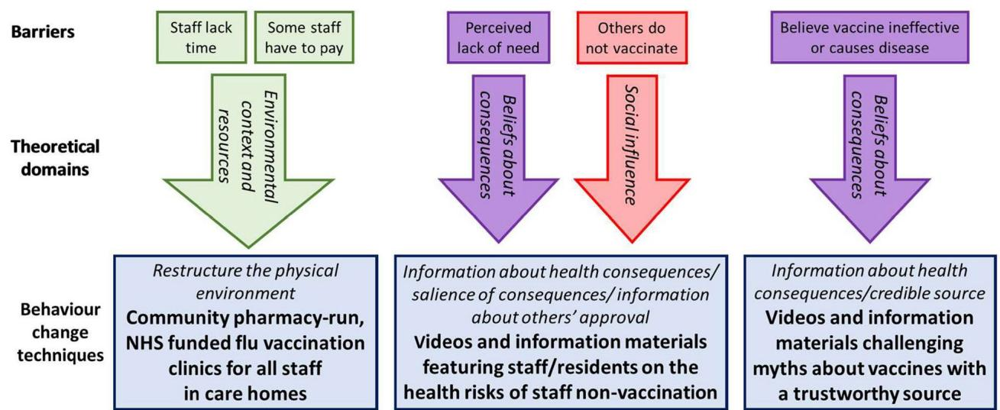
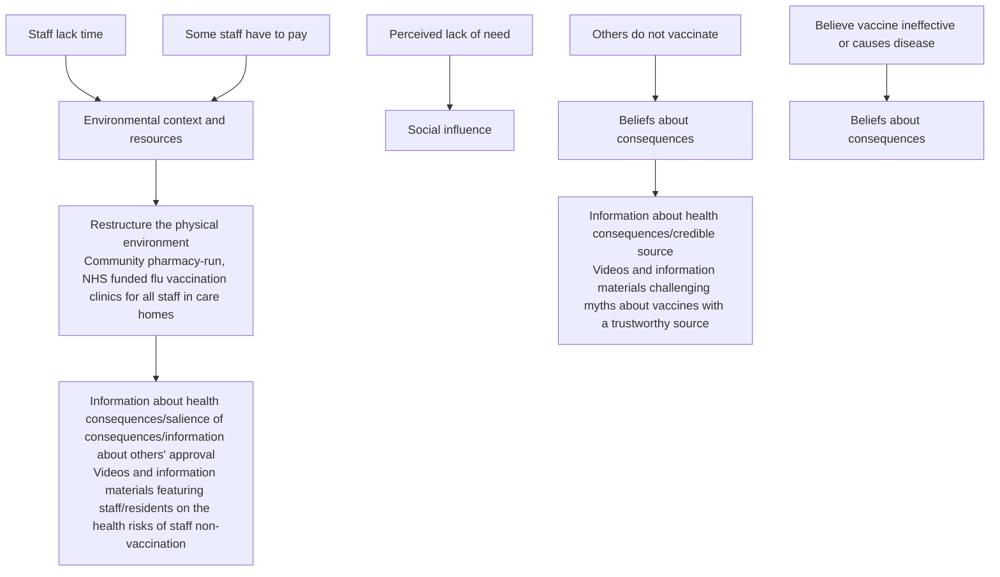

# STUDY PROTOCOL

# Open Access

# Protocol of the process evaluation of cluster randomised control trial for estimating the efectiveness and cost-efectiveness of a complex intervention to increase care home staf infuenza vaccination rates compared to usual practice (FluCare)

Linda Birt1\* , Thando Katangwe‑Chigamba2 , Sion Scott1 , David J Wright1 , Adam P. Wagner2,3, Erika Sims2 , Veronica Bion2 , Carys Seeley2 , Faisal Alsaif4 , Allan Clarke5 , Alys Grifths6 , Liz Jones6 , Alison Bryant6 and Amrish Patel7

# Abstract

Background Infuenza (fu) vaccination rates in UK care home staf are extremely low. Less than 40% of staf in care homes are vaccinated for infuenza (fu), presenting risks to the health of frail residents and potential staf absence from cross-infection. Staf often do not perceive a need for vaccination and are unaware they are entitled to free fu vaccination. The FluCare study, a cluster randomised control trial (RCT), uses behavioural interventions to address barriers. Videos, posters, and leaflets are intended to raise awareness of fu vaccination benefts and debunk myths. On-site staf vaccination clinics increase accessibility. Financial incentives to care homes for improved vaccination rates and regular monitoring infuence the environment. This paper outlines the planned process evaluation which will describe the intervention’s mechanisms of action, explain any changes in outcomes, identify local adaptations, and inform design of the implementation phase.

Methods/design A mixed method process evaluation to inform the interpretation of trial fndings.

# Objectives

• Describe the intervention as delivered in terms of dose and fdelity, including adaptations and variations across care homes.   
• Explore the efects of individual intervention components on primary outcomes.   
• Investigate the mechanisms of impact.   
• Describe the perceived efectiveness of relevant intervention components (including videos, leafets, posters, and fu clinics) from participant perspectives (care home manager, care home staf, fu clinic providers).   
• Describe the characteristics of care homes and participants to assess reach.

\*Correspondence:

Linda Birt

linda.birt@leicester.ac.uk

Full list of author information is available at the end of the article

BMC

© The Author(s) 2023. Open Access This article is licensed under a Creative Commons Attribution 4.0 International License, which permits use, sharing, adaptation, distribution and reproduction in any medium or format, as long as you give appropriate credit to the original author(s) and the source, provide a link to the Creative Commons licence, and indicate if changes were made. The images or other third party material in this article are included in the article’s Creative Commons licence, unless indicated otherwise in a credit line to the material. If material is not included in the article’s Creative Commons licence and your intended use is not permitted by statutory regulation or exceeds the permitted use, you will need to obtain permission directly from the copyright holder. To view a copy of this licence, visit http://creativecommons.org/licenses/by/4.0/. The Creative Commons Public Domain Dedication waiver (http://creativecom mons.org/publicdomain/zero/1.0/) applies to the data made available in this article, unless otherwise stated in a credit line to the data.

A purposive sample of twenty care homes (ten in the intervention arm, ten in the control arm) for inclusion in the process evaluation. Data will include (1) study records including care home site profles, (2) responses to a mechanism of action questionnaire, and (3) semi-structured interviews with care home staf and clinic providers. Quantitative data will be descriptively reported. Interview data will be thematically analysed and then categories mapped to the Theoretical Domains Framework.

Discussion Adopting this systematic and comprehensive process evaluation approach will help ensure data is captured on all aspects of the trial, enabling a full understanding of the intervention implementation and RCT fndings.

Trial registration ISRCTN ISRCTN22729870. Registered on 24 August 2022.

Keywords Residential homes, Nursing homes, Care homes, Long-term care facilities, Infuenza vaccination, Staf, Employees

# Introduction

In the United Kingdom (UK) each year, seasonal infuenza (fu) causes around 17,000 deaths [1]. Tis creates a major risk for older residents of care and nursing homes [2]. Risks can be mitigated by vaccinating care staf [3]. Te World Health Organization (WHO) recommends that at least 75% of health and social care staf are vaccinated for fu [4]. In England, rates fall far below this recommendation increasing risks to care home residents’ health and staf well-being. In February 2022, only 26.8% of the total staf of older adult care homes were reported as having received the fu vaccination [5]. Low fu vaccination uptake may in part be due to vaccination hesitancy linked with compulsory COVID-19 vaccinations for care home staf in the UK [6, 7]. However, fu vaccine hesitancy is long-standing, and pre-COVID preparation work for the FluCare study, including a narrative synthesis, survey, and qualitative work, identifed fve individual-level behavioural barriers to fu vaccination: access to vaccination, cost of vaccination, perceived lack of need, vaccine beliefs, and peer infuences. Staf are more likely to take up fu vaccination if they consider it benefts them [8].

Te FluCare intervention aims to address these barriers by drawing on behavioural change theory. Behaviour change techniques (BCTs) are intended to alter behaviours and are frequently utilised to increase vaccination rates [9]. Mapping known barriers to vaccination to the Teoretical Domains Framework (TDF) informs those domains which require addressing. Te TDF is a synthesis of behaviour change theories organised into 14 domains which are the determinants of an individual’s behaviour, including social infuence, social/professional role and identity, beliefs about consequences, environmental context, and resources [10]. Using the mapping table by Cane et al. [11], 31 potentially appropriate BCTs, the active ingredients of behaviour change interventions, were identifed, see Fig.  1. A nominal group technique stakeholder consensus study [12] with 13 care home staf and managers supported the development of the FluCare intervention elements. Stakeholders selected from the list of BCTs, those which met the APEASE criteria (afordable, practicality, efectiveness, acceptability, side efects, equity) for addressing the barriers [13].

flowchart

Fig. 1 Relationship between behaviour change techniques, barriers, and theory

Stakeholders then characterised ways in which each BCT may be operationalised in care home practice. Tis characterisation was refned by public and patient involvement (care home residents and relatives) to arrive at the following intervention elements.

1. Restructure the physical environment—ofer NHSfunded fu vaccination clinics in the care home at convenient times to account for shift work. Ofer to all staf, including agency, working in the care homes. Flu vaccination clinics run by community pharmacy or GP surgery.   
2. Information about health consequences—provide information on the health risks of low staf vaccine uptake featuring staf and residents. Information delivered through a short 5-min video and poster. To maximise engagement, the material should refect staf cultural diversity (i.e. multi-lingual and to represent the range of socio-demographics), particularly given the low vaccine uptake in minority ethnic communities [14].   
3. Information about health consequences from a credible source—provide information from a trustworthy source, e.g. general practitioner, challenging myths about vaccines such as it causes the fu or being dangerous to pregnant people.

While the FluCare intervention targets staf-level behaviour change, it is widely recognised that a maximising beneft is seen when staf feel the behaviour aligns with the priorities of their organisation. Employer encouragement is a known enabler for staf vaccination [8, 15].

Our intervention (Fig. 1) is therefore augmented by two organisational-level strategies: regular vaccine uptake monitoring of care homes and feedback on their uptake performance relative to other care homes.

1. Financial incentives for care homes with staf vaccination rate > 70%.

Te feasibility study for the FluCare intervention was undertaken during the 2021/2022 fu season, confrming that care homes and vaccination providers (GPs and Pharmacists) could be successfully recruited and were willing to participate [paper in press]. Te feasibility study informed the frequency of data collection and design of the control arm. While data collection frequency (monthly versus end of study) did not infuence the uptake of fu vaccination in the control arm, monthly data collection was preferred by sites. Te provision of posters and leafets appeared to have a small but limited efect.

A cluster RCT started in October 2022, and recruitment closed on 31 March 2023. Te primary outcome measure is the total number of staf vaccinated in a fu season over a total number of staf employed at any point throughout that fu season [16]. Secondary outcome measures are staf fu vaccination rate at the end of November 2022; numbers of staf sick days, GP and nurse visits, and resident hospitalisations; and resident mortality [16].

Te defnitive RCT and embedded process evaluation was approved by the University of East Anglia ethics committee. Te RCT is on the ISRCTN registry (ISRCTN22729870). Te process evaluation is embedded in the main RCT protocol version 1.1, 5 August 2022.

# Process evaluation design

A mixed-methods, theory-driven process evaluation will be undertaken in parallel to the FluCare defnitive RCT. Te evaluation design follows guidance on process evaluations [17]. Te Teoretical Domains Framework (TDF) underpins the exploration of the barriers and enablers to fu vaccination uptake within this trial [10]. Consideration will be given to how the intervention might need to be altered to complement current care home systems [18]. Te protocol follows SPIRIT guidelines see additional fle 1 [19].

# Public involvement

Patient and public involvement members have been involved in all project stages, from inception to providing advice on the diferent elements of the intervention, e.g. poster and video, providing guidance on how to enhance our approach to recruitment and how to communicate efectively with care homes. Tey have explored feasibility data and refned interview questions for the process evaluation. Tey will continue to have regular input into the trial and process evaluation analysis and dissemination.

# Objectives

1. To describe the intervention as delivered in terms of dose and fdelity, including adaptations and variations across care homes   
2. To explore the efects of individual intervention components on the primary outcomes   
3. To investigate the mechanisms of impact

4. To describe the perceived efectiveness of relevant intervention components (including videos, leafets, posters, and fu clinics) from participant’s (care home manager, care home staf, and fu clinic providers) perspectives   
5. To describe the characteristics of care homes and participants to assess reach

# Process evaluation framework

# Behavioural change intervention

Te behavioural assumption is that access to information on the benefts of fu vaccination alongside easy access to vaccination clinics on site will improve staf vaccination rates. Intervention care home managers receive behavioural change information (posters, leafets, videos). Tey are asked to make these materials available to all staf, i.e. display posters and leave leafets in staf rooms etc. and send the video link through the usual means they communicate with staf such as WhatsApp. Care homes will be partnered with a fu vaccination provider: either a pharmacy or GP practice. Flu clinic providers will work with care home managers to deliver up to four vaccination clinics.

Te process evaluation will be undertaken at the end of the trial. Data will be collected and analysed to understand and provide an explanation for trial outcomes and inform future adaptations considering the four aspects of implementation, mechanisms of action, outcomes, and contextual factors.

# Trail status

Recruitment to the process evaluation commenced when the RCT ended on 1 May 2023 and recruitment will close on 30 July 2023. Te process evaluation is embedded in the main RCT protocol version 1.1, 5 August 2022.

# Sample

Seventy-fve care homes were randomised in the RCT: 38 to the control arm and 37 to the intervention arm. Te process evaluation data will be from a sample of 10 control and 10 intervention care homes purposefully selected for variety in characteristics, namely the size of the home, characteristics of the staf, and type of care home registration. Up to 20 fu clinic providers will be invited, including those unable to deliver a fu clinic. Recruitment for the process evaluation will close on 30 July 2023.

# Data collection and analysis

Data will be collected and analysed to provide evidence for each aspect of the process evaluation. Implementation: information on the use of intervention material to assess reach, dose, and fdelity of the intervention, see Table 1.

Mechanisms of impact: Data will be collected to understand the mechanisms of impact in achieving the aims of changing staf beliefs about fu vaccination and increasing staf vaccination rates. Data on vaccination rates in both arms will help identify if the intervention increases fu vaccination rates over usual patterns of change due to factors outside the trial such as public health campaigns, see Table 2.

Contextual factors as characteristics of care homes and their staf and availability of fu vaccination clinics will be considered on how they afect delivery and intervention’s impact of the intervention, see Table 3.

# Data source

# Site profle questionnaire and care home logs

Tese are records generated during the trial. All homes will be characterised at the start and end of the trial period to identify the characteristics (i.e. home type (private/charity/local authority), size (beds), with/without nursing, number and type of staf (age gender and ethnicity), staf employment status (employed, bank, agency voluntary), infection control policies, protocols/operating procedures, vaccination policy, guidance/education routinely provided) and changes which may afect the intervention implementation during the trial period. Descriptive narrative analysis of data will provide context to any variation in implementation and outcomes.

# Mechanism of Action Questionnaire (MAQ)

Te MAQ comprises of four items, each with a 5-point Likert scale response option (strongly disagree to strongly agree), measuring the extent to which the intervention has addressed the four theoretical domains (Fig. 1). Managers in a sample of 20 care homes (control n = 10, intervention n = 10) will be asked to distribute the MAQ electronically to all staf at baseline; those responding will be invited to complete the MAQ again at the end of the intervention period. Data will be informally compared using descriptive statistics for each respondent to the extent to which the intervention has addressed the barriers to fu vaccination. Variations in MAQ responses between participants, care homes, and other contextual factors will be explored further using qualitative interviews.

Table 1 Intervention implementation tasks and data collection during the process evaluation 

<table><tr><td>Task</td><td>Aim (what is being assessed)</td><td>Data collected</td><td>Date source</td></tr><tr><td>Provision of behavioural change material leaflets (posters) to all care home staff</td><td>Reach intervention</td><td>Where leaflets and posters displayed Staff awareness of seeing posters, leaflets</td><td>Care home manager interviews Staff interviews</td></tr><tr><td>Provision of behavioural change video to all staff</td><td>Reach and dose of intervention</td><td>Number of times the video played Staff awareness of video</td><td>Metrics on viewing (which is embedded in video) Staff interviews</td></tr><tr><td>Provision of on-site flu vaccinator clinic</td><td>Dose and fidelity to intervention</td><td>Number of flu clinics provided</td><td>Flu vaccination clinic log Interviews</td></tr></table>

Table 2 Mechanism of impact and data collection in process evaluation 

<table><tr><td>Impact</td><td>Mechanism of impact</td><td>Data collected</td><td>Date source</td></tr><tr><td>Improved staff understanding of the benefits of flu vaccination for themselves</td><td>Provide behavioural change material (videos, leaflets, posters) to all care home staff</td><td>Staff perceptions of materialChange in staff beliefs and intention to be vaccinated</td><td>Semi-structured interviews with all care home staffPre- and post-intervention mechanisms of action survey</td></tr><tr><td>Improved access to flu vaccinations</td><td>Provide onsite flu vaccination clinics</td><td>Number of staff who attended clinic and had vaccinationNumber of staff who attended clinic and refused vaccina-tionStaff perceptions of the flu clinics</td><td>Flu vaccination clinic logFlu vaccination clinic logStaff interviews included those who did and did not receive vaccination at the flu clinic</td></tr></table>

Table 3 Contextual factors and data collected as part of process evaluation 

<table><tr><td>Contextual factors</td><td>To examine</td><td>Data collected</td><td>Data source</td></tr><tr><td>Barriers to delivering the intervention</td><td>Staff variation</td><td>Staff perceptions</td><td>Care home staff interviewsFlu clinic provider interviews</td></tr><tr><td>Facilitators to delivering the intervention</td><td></td><td>Staff perceptions</td><td>Care home staff interviewsFlu clinic provider interviews</td></tr><tr><td rowspan="3">Site factors</td><td rowspan="3">Inter-site variation</td><td>Care home factors</td><td>Baseline and end of study Site profile questionnaire</td></tr><tr><td>Care home staff factors</td><td>Care home staff logs</td></tr><tr><td>Flu clinic provider characteristics</td><td>Flu clinic provider logs</td></tr><tr><td>Statutory public health policies</td><td>Variation in national vaccination communication</td><td></td><td>Review of public-facing documents</td></tr></table>

# Semi‑structured interviews

At the end of the intervention period, care home managers, their staf, and vaccination providers will be invited to an online interview. We will seek to interview up to 13 care home managers (control n = 3, intervention n = 10). Interviews will focus on the implementation and perceived outcomes of the intervention and clarify contextual information. We will seek to interview up to 30 care home staf (control n = 4, intervention n = 26) sampled for a variety of job roles. Interviews will focus on thoughts about fu vaccination, access to intervention material, use, or non-use of fu vaccination clinics. We will see to interview up to 20 vaccination providers including those who did not deliver fu vaccination clinics. Interviews will focus on the implementation of the fu clinic, outcomes of running the clinic, and contextual factors. We are not interviewing residents or their families as they are not directly involved in the study.

Each participant will be provided with a participant information sheet and electronic written consent taken prior to the interview. Interview topic guides have been designed with patient and public involvement representatives and seek to ask staf for views on how each BCT was delivered (content); its acceptability, including how compatible it was with routine practices and how each BCT worked within the home (theoretical fdelity), and exploring why BCTs have succeeded in/failed to address certain barriers. Interviews with care home managers will focus on procedures for vaccination clinic visits, staf working arrangements, local infection control policies, and other contextual issues afecting intervention delivery. Interviews with pharmacists/healthcare practitioners delivering fu vaccination clinics will elicit experiences of setting up/running fu vaccination visits and interviews with pharmacists/healthcare practitioners who were unable to deliver on-site clinics will explore the barriers and challenges that prevented them from providing the service. All interviews will be audio-recorded and transcribed verbatim and last no longer than 60 min. At this point, all identifers will be removed and transcriptions checked against the audio recording. Anonymised transcripts will be uploaded to NViVO for analysis. Audio recordings will be destroyed after analysis. Following an inductive thematic analysis of interview transcripts, each of them will be mapped across to the TDF, to examine how the process and content of the intervention functioned from the participants’ perspective, identifying how barriers were overcome to increase vaccination rates and intervention sustainability over time.

# Documentary review of policies and protocols

Relevant protocols, policies, and standard operating procedures (e.g. national fu campaign policies; infection control procedures) will be reviewed to understand which guidance for fu vaccinations is in place at the time of the intervention and how they are operationalised within each home, providing context to the analyses.

# Data synthesis

Once all process and main trial outcomes are reported, all data sets will be integrated using a triangulation approach to consider agreement, partial agreement, silence, and dissonance across the data [20]. Tis will identify, clarify, and relate causal pathways related to participant experience, providing a means to explain unexpected outcomes and identify optimal intervention contexts. If the FluCare trial fndings suggest that behaviour change strategies are efective in increasing care home staf vaccinations, the process evaluation will inform recommendations for implementation into routine practice. Te process evaluation is designed to enable an understanding of the reasons for where the intervention has, or has not, been successful. Te FluCare study has a discrete programme of work to consider how to disseminate learning and codesign resources for use in practice, which will take place following completion of the RCT.

# Discussion

Tis study is one of the frst to use a theory-informed intervention designed to comprehensively address identifed barriers to care home staf infuenza vaccination. Tis intervention has fve distinct elements designed to increase staf awareness of the benefts of vaccination, make vaccination easier to access, and develop a workplace culture that prioritises fu vaccination. Te fve elements include written information through posters and leafets, visual information in video, fu vaccination clinics on site, regular monitoring and feedback on fu vaccination rates, and fnancial incentives for achieving vaccination rates of 70%. Our feasibility work indicated that not all intervention elements were delivered; for example, the videos were not viewed. Purposive sampling will provide cohorts for comparison, examining if organisational culture in support of vaccination is suffcient to increase vaccination rates in care home staf.

In summary, results from the process evaluation will provide evidence of the efcacy of the behavioural change strategies within the complexity of care homes providing care to older people across England. Understanding how this theoretically informed intervention works within a real-world setting is important to enable recommendations for upscaling of behavioural change strategies. If the RCT does not fnd statistically signifcant diferences between the intervention and control arms, the process evaluation will provide explanations for this and importantly expose which distinct elements work and in what ways. Te fnal work programme in FluCare will draw on the principles of the RE-AIM framework [21] to develop recommendations for wider implementation.

# Abbreviations

BCT Behavioural change strategy

GP General practitioner

MAQ Mechanism of Action Questionnaire

SPQ Site Profle Questionnaire

TDF Theoretical Domains Framework

WHO World Health Organization

UK United Kingdom

# Supplementary Information

The online version contains supplementary material available at https://doi. org/10.1186/s13063-​023-​07613-5.

Additional fle 1.

# Acknowledgements

We would like to thank the FluCare public involvement group who have the feasibility study reviewed data and contributed to discussions about recruitment and data collection methods. Thanks to the wider FluCare study team who will be involved in the recruitment and collection of study documents.

# Authors’ contributions

AP, DW, APW, SS, AG, ES, AC, and LB were all co-applicants on the grant application. LB prepared the frst draft of the manuscript, and all authors commented on the draft, which LB then revised and submitted. All authors agreed to the fnal version. ES, TK, VB, CS, FA, LB, SS, and APW contributed actively to the design of the protocol. AG and LJ co-led the patient and public involvement element of the project. WB is a PPI member who has actively contributed to all stages of the project. All authors are active members of the project management group which meets regularly to oversee the project delivery.

# Funding

This study was funded by the National Institute of Health Research Public Health Research Programme (Grant Number: NIHR133455). APW also received support from the National Institute for Health Research (NIHR) Applied Research Collaboration East of England. The views expressed are those of the authors and not necessarily those of the NIHR or the Department of Health and Social Care.

Sponsor: University of East Anglia, researchsponsor@uea.ac.uk

# Availability of data and materials

Requests for access to the FluCare trial dataset should be made to Dr. Amrish Patel (Amrish.Patel@uea.ac.uk) and/or Researchsponsor@uea.ac.uk. During the trial requests will be reviewed by the chief investigators, trial management group, and the trial steering committee. Post-trial requests will be reviewed by the chief investigators (and representatives from the trial management group where available) and sponsor. Requests will be reviewed to ensure that there is no confict with the objectives of the FluCare trial (pre-publication of FluCare fndings) or funder constraints. All data requests will be subject to a data sharing agreement with the University of East Anglia.

# Declarations

# Ethics approval and consent to participate

Ethical approval was received from the Faculty of Medicine and Health Sciences Research Ethics Subcommittee on 01/08/2022. Study approval number: ETH2122-2719. Written informed consent to participate in the study will be obtained from care home managers, care home staf, and vaccination providers.

# Consent for publication

Consent for publication has been obtained from the NIHR.

# Competing interests

The authors declare that they have no competing interests.

# Author details

1 School of Healthcare, University of Leicester, Leicester, UK. 2 Norwich Clinical Trials Unit, University of East Anglia, Norwich, UK. 3 National Institute for Health Research (NIHR) Applied Research Collaboration (ARC) East of England (EoE), Cambridge, UK. 4 School of Pharmacy, University of East Anglia, Norwich, UK. 5 Norwich Medical School, University of East Anglia, Norwich, UK. 6 Institute of Population Health, University of Liverpool, Liverpool, UK. 7 School of Economics, University of East Anglia, Norwich, UK.

Received: 19 June 2023 Accepted: 29 August 2023

Published online:15 September 2023

# References

1. Wendelboe AM, Grafe C, McCumber M, Anderson MP. Inducing herd immunity against seasonal infuenza in long-term care facilities through employee vaccination coverage: a transmission dynamics model. Comput Math Methods Med. 2015;2015:1–6. https://doi.org/10.1155/2015/ 178247.   
2. Van Den Dool C, Bonten MJM, Hak E, Heijne JCM, Wallinga J. The efects of infuenza vaccination of health care workers in nursing homes: insights from a mathematical model. PLoS Med. 2008;5(10):e200. https://doi.org/ 10.1371/journal.pmed.0050200.   
3. Ng ANM, Lai CKY. Efectiveness of seasonal infuenza vaccination in healthcare workers: a systematic review. J of Hosp Infect. 2011;79(4):279– 86. https://doi.org/10.1016/j.jhin.2011.08.004.   
4. World Health Assembly Resolution WHA56.19. Prevention and control of infuenza pandemics and annual epidemics. In: Fifty-sixth World Health Assembly, Geneva, 28 May, 2003. Geneva: World Health Organization; 2003. http://apps.who.int/gb/archive/pdf\_fles/WHA56/ea56r19.pdf   
5. Department Health and Social Care. Adult Social Care Monthly Statistics England: March 2022. https://www.gov.uk/government/statistics/adult-​ social-​care-​in-​england-​monthly-​statistics-​march-​2022/adult-​social-​care-​ monthly-​statistics-​england-​march-​2022   
6. Kumar S, Shah Z, Garfeld S. Causes of vaccine hesitancy in adults for the infuenza and COVID-19 vaccines: a systematic literature review. Vaccines. 2022;10(9):1518. https://doi.org/10.3390/vaccines10091518.

7. Troiano G, Nardi A. Vaccine hesitancy in the era of COVID-19. Public Health. 2021;194:245–51. https://doi.org/10.1016/j.puhe.2021.02.025.   
8. Shrouf A, Copping J, Musonda P, Vivancos R, Langden V, Armstrong S, Slack R. Infuenza vaccine uptake among staf in care homes in Nottinghamshire: a random cluster sample survey. Public Health. 2009;123(10):645–9. https://doi.org/10.1016/j.puhe.2009.09.014.   
9. Attwell K, Betsch C, Dubé E, Sivelä J, GagneurA, Suggs LS, Picot V, Thomson A. Increasing vaccine acceptance using evidence-based approaches and policies: insights from research on behavioural and social determinants presented at the 7th Annual Vaccine Acceptance Meeting. Int J Infect Dis. 2021;105:188–193. https://doi.org/10.1016/j.ijid.2021.02.007.   
10. Atkins L, Francis J, Islam R, et al. A guide to using the Theoretical Domains Framework of behaviour change to investigate implementation problems. Implement Sci. 2017;12(1):77. https://doi.org/10.1186/ s13012-​017-​0605-9.   
11. Cane J, Richardson M, Johnston M, Ladha R, Michie S. From lists of behaviour change techniques (BCTs) to structured hierarchies: comparison of two methods of developing a hierarchy of BCTs. Br J Health Psychol. 2015;20(1):130–50. https://doi.org/10.1111/bjhp.12102.   
12. McMillan SS, King M, Tully MP. How to use the nominal group and Delphi techniques. Int J Clin Pharm. 2016;38:655–62. https://doi.org/10.1007/ s11096-​016-​0257-x.   
13. Michie S, Atkins L, West R. The APEASE criteria for designing and evaluating interventions. The behaviour change wheel: a guide to designing interventions. London: Silverback Publishing; 2014.   
14. Razai MS, Osama T, McKechnie DGJ, Majeed A. COVID-19 vaccine hesitancy among ethnic minority groups. BMJ. 2021;372:n513. https://doi. org/10.1136/bmj.n513.   
15. Boey L, Bral C, Roelants M, et al. Attitudes, believes, determinants and organisational barriers behind the low seasonal infuenza vaccination uptake in healthcare workers - a cross-sectional survey. Vaccine. 2018;36(23):3351–8. https://doi.org/10.1016/j.vaccine.2018.04.044.   
16. Patel A, Sims E, Blacklock J, et al. Cluster randomised control trial protocol for estimating the efectiveness and cost-efectiveness of a complex intervention to increase care home staf infuenza vaccination rates compared to usual practice (FLUCARE). Trials. 2022;23:989. https://doi.org/10. 1186/s13063-​022-​06925-2.   
17. Moore GF, Audrey S, Barker M, et al. Process evaluation of complex interventions: Medical Research Council guidance. BMJ. 2015;350:h1258. https://doi.org/10.1136/bmj.h1258.   
18. Skivington K, Matthews L, Simpson SA, et al. A new framework for developing and evaluating complex interventions: update of Medical Research Council guidance. BMJ. 2021;374:n2061. https://doi.org/10.1136/bmj. n2061.   
19. Chan A-W, Tetzlaf JM, Gøtzsche PC, Altman DG, Mann H, Berlin J, Dickersin K, Hróbjartsson A, Schulz KF, Parulekar WR, Krleža-Jerić K, Laupacis A, Moher D. SPIRIT 2013 Explanation and Elaboration: Guidance for protocols of clinical trials. BMJ. 2013;346:e7586.   
20. O’Cathain A, Murphy E, Nicholl J. Three techniques for integrating data in mixed methods studies. BMJ. 2010;341:c4587. https://doi.org/10.1136/ bmj.c4587.   
21. Holtrop JS, Estabrooks PA, Gaglio B, et al. Understanding and applying the RE-AIM framework: clarifcations and resources. J Clin Transl Sci. 2021;5(1):e126. https://doi.org/10.1017/cts.2021.789.

# Publisher’s Note

Springer Nature remains neutral with regard to jurisdictional claims in published maps and institutional afliations.