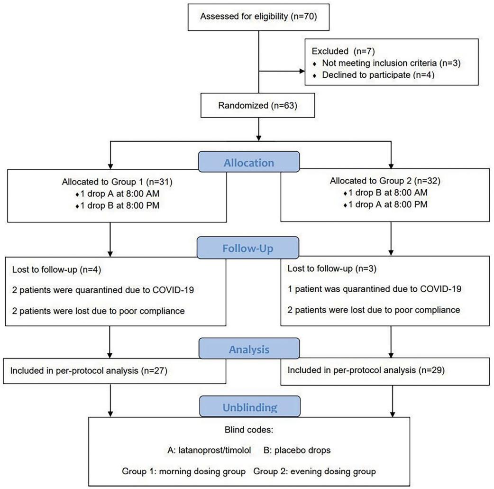
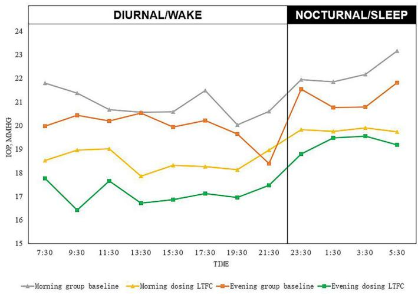

# Clinical Trials

# Efficacy of Morning Versus Evening Latanoprost/Timolol Fixed Combination for Open-Angle Glaucoma and Ocular Hypertension: A Randomized Clinical Trial

Hui Feng1, Dong Han2, Wensheng Lu2, Guangxian Tang3, Hengli Zhang3, Sujie Fan4, Aiguo Lv4, Jing Jiang5, Qing Zhang1,6, Ye Zhang1, Kai Cao1,6, Zhi Li1, and Shuning Li1

1 Beijing Tongren Eye Center, Beijing Tongren Hospital, Beijing Ophthalmology & Visual Science Key Lab, Capital Medical University, Beijing, China   
2 Department of Glaucoma, Hebei Eye Hospital, Xingtai, Hebei, China   
3 Department of ophthalmology, 1st Hospital of Shijiazhuang, Shijiazhuang, China   
4 Department of Ophthalmology, Handan 3rd Hospital, Handan, Hebei, China   
5 Department of Glaucoma, Fushun Eye Hospital, Fushun, China   
6 Beijing Institute of Ophthalmology, Beijing Tongren Hospital, Capital Medical University, Beijing, China

Correspondence: Shuning Li, Beijing Tongren Hospital, No.1 Dongjiaominxiang, Dongcheng District, Beijing 100054, China. e-mail: lishuningqd@163.com

Received: March 22, 2023 Accepted: December 26, 2023 Published: January 29, 2024

Keywords: primary open-angle glaucoma; ocular hypertension; randomized clinical trial; latanoprost/timolol

Citation: Feng H, Han D, Lu W, Tang G, Zhang H, Fan S, Lv A, Jiang J, Zhang Q, Zhang Y, Cao K, Li Z, Li S. Efficacy of morning versus evening latanoprost/timolol fixed combination for open-angle glaucoma and ocular hypertension: A randomized clinical trial. Transl Vis Sci Technol. 2024;13(1):21, https://doi.org/10.1167/tvst.13.1.21

Purpose: To compare the efficacy of morning and evening latanoprost/timolol fixedcombination (LTFC) dosing in patients with primary open-angle glaucoma (POAG) and ocular hypertension.

Methods: In this double-blind, randomized clinical trial, 63 untreated Chinese patients with POAG and ocular hypertension were enrolled. All patients received LTFC and were randomized (1:1) to group 1, morning (8 AM) dosing, or group 2, evening (8 PM) dosing. Vehicle drops were used in the morning or evening, accordingly, to preserve masking. Patients were treated for 4 weeks. Outcomes included mean reduction of the 24-hour intraocular pressure (IOP) and IOP fluctuation from baseline after a 4-week treatment.

Results: Fifty-six patients were included in the final analysis. In both groups, the posttreatment IOP values were significantly lower than those at baseline at each 24-hour measuring time point. A significant difference between the groups in IOP reduction from baseline was observed at the 9:30 AM time point (4.01 ± 2.62 vs. $2 . 4 2 \pm 3 . 2 3$ mm Hg, evening dosing versus morning dosing group; P = 0.048). Both groups showed decreased IOP fluctuation after treatment. However, the morning dosing group had a significantly greater decrease in diurnal IOP fluctuation than that of the evening dosing group (2.04 ± 2.32 mm Hg vs. 0.50 ± 1.70 mm Hg, respectively; P = 0.012).

Conclusions: Both morning and evening LTFC dosing can effectively reduce 24-hour IOP and IOP fluctuation. Morning dosing is more likely to effectively control diurnal IOP fluctuations.

Translational Relevance: This multicenter, double-blind, randomized clinical trial generates robust evidence on the optimal LTFC dosing regimen to help clinical decisionmaking in the treatment of raised IOP.

# Introduction

Intraocular pressure (IOP) is widely recognized as the greatest risk factor for progressive damage in glaucoma, and the use of topical IOP-lowering medications remains the preferred initial treatment for increased IOP.1–3 However, monotherapy is sometimes unsuccessful in achieving the target IOP. Application of combined medication formulations can achieve better patient compliance, reduce toxicity, and improve the long-term health of the ocular surface compared to unfixed therapies with multiple dosing.4,5

Latanoprost (0.005%)/timolol maleate (0.5%) is a fixed-combination product. Previous studies have found that the latanoprost/timolol fixed combination (LTFC) has a better IOP-lowering effect than either of its respective constituents as monotherapy6; however, the optimal LTFC dosing regimen (i.e., morning or evening) remains controversial. Timolol maleate, a β- adrenergic antagonist, lowers IOP by decreasing the production of aqueous humor. In standard practice, timolol maleate is administered twice daily during daytime.7 However, evidence indicates that the IOPlowering effect of timolol maleate during the nighttime hours is not comparable to that observed during daytime.8 Some studies have suggested that timolol maleate failed to effectively lower the production of aqueous humor during sleep because general aqueous humor production is considerably lower at night.9 Latanoprost, a prostaglandin F2α analogue, lowers IOP by facilitating uveoscleral outflow of aqueous humor and is less affected by circadian variations in aqueous production.10 One-time daily administration of latanoprost is recommended during nocturnal periods. Consequently, the following question arises: What is the optimal dosing time when using LTFC once daily: morning or evening?

Previous studies have sought to determine whether morning or evening LFTC dosing is more effective in reducing IOP and achieving a stable 24-hour IOP curve.11 However, limited double-blinded, randomized studies are available. The purpose of this randomized, double-blind study was to compare the efficacy of morning versus evening dosing of LTFC in controlling IOP and IOP fluctuation in untreated patients with primary open-angle glaucoma (POAG) or ocular hypertension (OHT).

# Participants and Methods

# Study Design

This double-blind, randomized clinical trial study was conducted in five centers in northern China (Beijing, Xingtai, Shijiazhuang, Handan, and Fushun) between November 2020 and November 2021. The study was approved by the ethics committee of each participating center and was conducted according to the ethical principles described in the Declaration of Helsinki. The trial was registered at https://www.chictr. org.cn/ (identifier: ChiCTR1900025215). All patients provided written informed consent.

# Participants

Adult patients aged 18 years newly diagnosed with POAG or OHT were consecutively recruited at five participating centers. The diagnostic criteria for POAG were as follows: (1) normal anterior chamber and open angle on gonioscopy examination, (2) IOP >21 mm Hg on two or more occasions in one or both eyes, (3) characteristic glaucomatous optic disc damage and visual field (VF) defects, and (4) visual acuity better than 20/40 in either eye. Meanwhile, OHT was detected according to the following criteria: (1) consistently elevated IOP >21 mm Hg on two or more occasions in one or both eyes and (2) absence of clinical evidence of optic nerve damage, VF defect, or other unknown pathologies.12

The exclusion criteria were as follows: (1) any condition preventing reliable tonometry readings or abnormally thin (<500 μM) or thick (>600 μM) corneas, (2) inadequate visualization of the fundus, (3) IOP >35 mm Hg, (4) a cup-to-disc (C/D) diameter ratio of 0.8 or worse, (4) ocular inflammation/infection within 3 months before study entry, (5) progressive retinal or optic nerve disease other than glaucoma, (6) intraocular surgery or laser surgery, (7) severe ocular trauma at any time, (8) secondary glaucoma, (9) hypersensitivity to any components of the preparations used in this study, (10) severe medical or psychiatric condition, (11) reactive airway disease, (12) second- or thirddegree atrioventricular block, (13) congestive heart failure, (14) concomitant use of systemic β-blockers, (15) history of bronchial asthma, (16) unwillingness to accept a risk of iris color or eyelash changes, (17) inability to adhere to treatment, (18) pregnant or nursing female patients, and (19) planned pregnancy within 8 months of study completion.13,14

Glaucomatous optic disc damage was determined according to the presence of any two of the following characteristics, considering optic disc size: localized rim loss, disc hemorrhage, notching, nerve fiber layer defect, and C/D diameter asymmetry >0.2.12,15 A typical glaucomatous VF defect had to be present on at least two reliable visual Swedish interactive threshold algorithm standard 24-2 VF tests (Humphrey Systems; Carl Zeiss Meditec AG, Oberkochen, Germany). Reliability was defined as a fixation loss of <20% and false positives and false negatives of <33%. VF defects met at least two of the following criteria: a cluster of 3 depressed nonedge points on the pattern deviation plot at a P < 0.05 level with at least one point depressed at a P < 0.01 level on two consecutive fields, a glaucoma hemifield test result outside normal limits, and a pattern standard deviation (SD) occurring in <5% of normal fields.15

All patients underwent a complete ophthalmologic examination (LSN, TGX, ZHL, FSJ, JJ, LWS, LJH), including best-corrected visual acuity (5-m standard logarithmic visual acuity chart at a distance of 5 m), slit-lamp examination, gonioscopy (Goldmann one-mirror lens; Haag-Streit, Bern, Switzerland), IOP measurement (NT510, noncontact tonometer; Nidek, Tokyo, Japan) and 24-hour IOP monitoring (Icare Pro tonometer; Icare Finland Oy, Vantaa, Finland), photography of the fundus (CR-2 AF nonmydriatic retinal camera; Canon, Tokyo, Japan), ocular biometry including central corneal thickness (CCT) and axial length (AXL) (Lenstar, LS900; Haag-Streit), and VF testing (Humphrey 750i; Carl Zeiss, Jena, Germany).

# Randomization and Masking

The unit of randomization was the patient (not the eye). Both eyes underwent the same allocated treatment as the patients in whom both eyes were eligible, while only the affected eye underwent the allocated treatment in patients with unilateral OHT or high-tension glaucoma (HTG). Patients were randomly assigned to two groups in a 1:1 ratio by an independent statistician according to the random number table method using SAS software (SAS Institute, Inc., Cary, NC, USA). The random allocation sequence was determined using a randomized block model with a block size of 8. Randomization sequence and allocation were concealed to all patients, research staff, and investigators until completion of the study.

The pharmaceutical manufacturing unit (Qilu Pharmaceutical, Shandong, China) provided LTFC (0.005% latanoprost and 0.5% timolol maleate), and vehicle drops (excipient without the LTFC drug ingredients) were in identical containers with tear-off labels to identify the container contents. The labels were removed by the pharmaceutical manufacturing unit and replaced with study identification letters A or B. During the study, the site investigator and examiners performed IOP measurements, patients were masked to the ingredients of A or B, and the blind codes were held securely by the pharmaceutical manufacturing unit. Both groups received A and B within a day, but the order of administration was different. Group 1 was treated with one drop of A at 8:00 AM and one drop of B at 8:00 PM. Group 2 was treated with one drop of B at 8:00 AM and one drop of A at 8:00 PM. The site investigator enrolled each patient and obtained the results of the grouping by informing the statistician by telephone. The site investigator then guided the patients to the medication order of the different groups. Using the method described above, the site investigator, examiners, and patients were blinded to the LTFC administration time throughout the study. Blinding was maintained until completion of the study and of the statistical analyses (Fig. 1).

# Procedures

All eligible patients underwent 24-hour IOP measurements at baseline. The patients were then randomized to group 1 or 2 and were treated according to the corresponding 4-week A and B regimen. Weekly follow-up visits were conducted. At each visit, diurnal IOP was measured, and the order of drug administration and local and systemic adverse effects were recorded. The 24-hour IOP measurements were repeated at the end of the 4-week treatment period (Fig. 1). All members of staff were trained in the study procedures to ensure high-quality data.

# Outcome Measures

# Twenty-Four-Hour IOP

Patients were admitted to the hospital for 24-hour IOP monitoring using an Icare Pro tonometer (Icare Finland Oy). The IOP of both eyes was measured every 2 hours from 7:30 AM to 5:30 AM the following day (i.e., 7:30 AM, 9:30 AM, 11:30 AM, 1:30 PM, 3:30 PM, 5:30 PM, 7:30 PM, and 9:30 PM for diurnal IOP and 11:30 PM, 1:30 AM, 3:30 AM, and 5:30 AM for nocturnal IOP). An Icare Pro Tonometer was used to record six reliable measurements simultaneously. The builtin software automatically discarded the highest and lowest average values, and IOP was calculated based on four measurements.16 Trained operators performed all IOP measurements.

Patients were encouraged to continue their daily routine during the study period and were allowed to sleep between IOP measurements. Estimation of the 24-hour IOP rhythm was performed in the habitual body positions, sitting during the day and supine at night. IOP measurements were performed in the supine position at 11:30 PM, 1:30 AM, 3:30 AM, and 5:30 AM.17

# IOP Fluctuation

The mean IOP within 24 hours was calculated without adjustment for CCT. Circadian fluctuations were calculated by subtracting the trough IOP from the peak IOP during the 24-hour cycle. Diurnal fluctuations were determined as the daytime IOP variation measured from 7:30 AM to 9:30 PM, while nocturnal fluctuations were determined as the nighttime IOP variation measured from 11:30 PM to 5:30 AM. Peak



<details>
<summary>flowchart</summary>

```mermaid
graph TD
    A["Assessed for eligibility (n=70)"] --> B{Excluded (n=7)}
    B -->|Yes| C["Not meeting inclusion criteria (n=3)"]
    B -->|No| D["Declined to participate (n=4)"]
    C --> E["Randomized (n=63)"]
    E --> F["Allocation"]
    F --> G["Allocated to Group 1 (n=31)\n• 1 drop A at 8:00 AM\n• 1 drop B at 8:00 PM"]
    F --> H["Allocated to Group 2 (n=32)\n• 1 drop B at 8:00 AM\n• 1 drop A at 8:00 PM"]
    G --> I["Follow-Up"]
    H --> I
    I --> J["Lost to follow-up (n=4)\n2 patients were quarantined due to COVID-19\n2 patients were lost due to poor compliance"]
    I --> K["Lost to follow-up (n=3)\n1 patient was quarantined due to COVID-19\n2 patients were lost due to poor compliance"]
    J --> L["Analysis"]
    K --> L
    L --> M["Included in per-protocol analysis (n=27)"]
    L --> N["Included in per-protocol analysis (n=29)"]
    M --> O["Unblinding"]
    N --> O
    O --> P["Blind codes:\nA: latanoprost/timolol B: placebo drops\nGroup 1: morning dosing group Group 2: evening dosing group"]
```
</details>

Figure 1. Patient flowchart.

IOP and trough IOP were recorded as the highest and lowest values, respectively, among the 12 IOP values in the 24-hour IOP measurements and during the diurnal and nocturnal periods.

A previous study showed that the limit of the mean amplitude of intraocular pressure excursion (MAPE) is based on one SD of the circadian IOP value of each patient.18 By calculating the differences between two adjacent values, we derived a series of excursions. MAPE was calculated as the arithmetic mean of the relevant IOP fluctuations that exceeded the limit. The diurnal and nocturnal MAPE values were also calculated.

# Statistical Analysis

The sample size was calculated based on a previous study wherein a significant difference in the mean IOP reduction from baseline was observed between patients treated with LTFC at 8:00 AM $( 7 . 4 \pm 0 . 6 $ mm Hg) and patients treated with LTFC at 8:00 PM $( 8 . 1 \pm 0 . 8$ mm Hg).11 The trial had 90% power to detect a 0.7- mm Hg difference in mean IOP between the morning and evening dosing groups with respect to the same outcome using a two-sided alpha level of 0.05. The sample size was adjusted to allow for a loss to followup of 10%. The required sample size was determined to be at least 26 participants per treatment group or a total of 52 patients.

For patients with unilateral or bilateral OHT or HTG, only the affected eye or right eye was included in the analysis. Prior to parametric statistical analysis, the normality of the data was tested using the Shapiro–Wilk normality test. Continuous variables were described as the mean and SD. Regarding the 24-hour IOP at individual time points, the analysis of variance model with repeated measures was adopted to compare baseline IOP between the morning and evening dosing LTFC groups up to different time points. A linear mixed-effects model was used to evaluate the change in the mean of differences (IOP after therapy minus baseline IOP) between the groups. The model included the baseline IOP measurement as fixed covariates. Regarding the 24-hour IOP characteristics, the baseline and the mean of differences (IOP after therapy minus baseline IOP) were compared using the independent-sample t test if applicable. Otherwise, the baseline and the median of the differences (IOP after therapy minus baseline IOP) between the groups were compared using the Mann–Whitney U test. Categorical variables were described as frequencies and constituent ratios and were analyzed using the chi-square test. All statistical analyses were performed using the commercially available statistical software package SPSS, version 22.0 (IBM Corp., Armonk, NY, USA). Differences were considered statistically significant at $\alpha = 0 . 0 5$ .

# Results

# Demographic and Ophthalmic Characteristics

Among the 63 patients enrolled, 31 and 32 patients were randomized to the morning and evening dosing groups, respectively. Seven patients discontinued treatment, four patients were lost to follow-up as a result of the COVID-19 pandemic, and three patients were lost to follow-up because of poor compliance. Finally, 56 patients were included in the data analysis (Fig. 1). There were no significant differences between the groups with respect to age, sex, CCT, AXL, C/D, and diagnosis (Table 1).

# Comparison of Mean IOP and 24-Hour IOP for Individual Time Points Before and After 4 Weeks of Treatment

Mean IOP and IOP at each time point were reduced in both groups throughout the 4-week treatment period. The two groups were compared for IOP reduction at each time point and mean IOP before and after treatment (Tables 2 and 3 and Fig. 2). There were no significant differences in the baseline IOP except for IOP at 21:30 $( P = 0 . 0 4 3 )$ . Regarding the amplitude of IOP reduction, the morning dosing group showed greater reduction at 6 of the 12 time points (7:30, 17:30, 21:30, 1:30, 3:30, 5:30), while evening dosing group showed greater reduction at the remaining 6 time points (9:30, 11:30, 13:30, 15:30, 19:30, 23:30). Considering the baseline IOP differences, we used a linear mixedeffects model to evaluate the change in the mean of the differences. A significant difference was noted between the two groups at 9:30 AM. At this time point, the IOP reduction of the evening dosing group was larger than that of morning dosing group (evening group: 4.01 ± 2.62 mm Hg versus morning group: $2 . 4 2 \pm 3 . 2 3$ mm Hg, $P = 0 . 0 4 8 )$ .

# Comparison of 24-Hour IOP Characteristics Before and After 4 Weeks of Treatment

Comparisons of the 24-hour IOP characteristics between the groups, the classical 24-hour IOP parameters (IOP fluctuations, peak, and trough IOP), and MAPE as circadian and diurnal/nocturnal parameters, respectively, are shown in Tables 4 and 5. No significant differences were observed in the mean circadian and diurnal/nocturnal IOP between the two groups (mean circadian IOP, $P = 0 . 8 5 4 ;$ mean diurnal IOP, $P = 0 . 5 1 2 ;$ ; mean nocturnal IOP, $P = 0 . 4 5 6 )$ . Regarding the peak and trough IOP, the IOP in both the groups significantly decreased after treatment. However, no significant differences were noted in peak and trough IOP values between the two groups, regardless of whether IOP was circadian (peak IOP, P  0.275; trough IOP, $P = 0 . 0 7 2 )$ , diurnal (peak IOP, P = 0.706; trough IOP, P  0.425), or nocturnal (peak IOP, $P = 0 . 4 3 5 ;$ trough IOP, P = 0.594) parameters.

We calculated IOP fluctuation (peak minus trough IOP) and MAPE during the circadian, diurnal, and

Table 1. Demographics of Study Participants 

<table><tr><td>Parameter</td><td>Morning Dosing Group (Group 1, n = 27)</td><td>Evening Dosing Group (Group 2, n = 29)</td><td>P Value</td></tr><tr><td>Age, mean ± SD, y</td><td>43.96 ± 2.59</td><td>41.28 ± 2.98</td><td>0.50</td></tr><tr><td>Sex, male/female, n</td><td>14/13</td><td>17/12</td><td>0.61</td></tr><tr><td>Diagnosis, OHT/POAG, n</td><td>11/16</td><td>11/18</td><td>0.83</td></tr><tr><td>Corneal thickness, mean ± SD, μm</td><td>553.27 ± 6.31</td><td>557.17 ± 6.33</td><td>0.67</td></tr><tr><td>Vertical cup/disc ratio, mean ± SD</td><td>0.60 ± 0.04</td><td>0.55 ± 0.03</td><td>0.29</td></tr><tr><td>Axial length, mean ± SD, mm</td><td>24.84 ± 1.82</td><td>24.87 ± 2.21</td><td>0.97</td></tr></table>

Table 2. Comparison of 24-Hour IOP for Individual Time Points and Mean IOP at Baseline and after Treatment 

<table><tr><td rowspan="2">Measurement (Time)</td><td colspan="2">Morning Dosing Group(Group 1, n = 27)</td><td colspan="2">Evening Dosing Group(Group 2, n = 29)</td><td rowspan="2">P Value</td></tr><tr><td>Baseline</td><td>Posttreatment</td><td>Baseline</td><td>Posttreatment</td></tr><tr><td>07:30</td><td>21.80 ± 4.40</td><td>18.53 ± 3.84</td><td>19.98 ± 3.78</td><td>17.84 ± 3.90</td><td>0.096</td></tr><tr><td>09:30</td><td>21.38 ± 4.31</td><td>18.96 ± 4.48</td><td>20.49 ± 3.46</td><td>16.36 ± 2.67</td><td>0.364</td></tr><tr><td>11:30</td><td>20.67 ± 4.42</td><td>19.02 ± 4.52</td><td>20.18 ± 4.04</td><td>17.81 ± 2.92</td><td>0.679</td></tr><tr><td>13:30</td><td>20.57 ± 4.14</td><td>17.86 ± 3.65</td><td>20.50 ± 4.73</td><td>16.76 ± 2.50</td><td>0.974</td></tr><tr><td>15:30</td><td>20.57 ± 4.26</td><td>18.31 ± 3.40</td><td>20.16 ± 3.85</td><td>16.87 ± 3.00</td><td>0.566</td></tr><tr><td>17:30</td><td>21.49 ± 4.34</td><td>18.26 ± 4.10</td><td>20.33 ± 3.63</td><td>17.06 ± 3.06</td><td>0.234</td></tr><tr><td>19:30</td><td>20.04 ± 3.23</td><td>18.14 ± 3.77</td><td>19.69 ± 3.86</td><td>16.93 ± 2.75</td><td>0.678</td></tr><tr><td>21:30</td><td>20.60 ± 4.04</td><td>18.97 ± 3.79</td><td>18.65 ± 3.96</td><td>17.33 ± 3.27</td><td>0.043</td></tr><tr><td>23:30</td><td>21.95 ± 5.96</td><td>19.82 ± 4.53</td><td>21.72 ± 4.63</td><td>18.87 ± 4.77</td><td>0.772</td></tr><tr><td>1:30</td><td>21.86 ± 4.64</td><td>19.76 ± 4.86</td><td>20.99 ± 4.12</td><td>19.57 ± 3.87</td><td>0.351</td></tr><tr><td>3:30</td><td>22.17 ± 4.81</td><td>19.91 ± 3.86</td><td>20.90 ± 3.46</td><td>19.74 ± 3.31</td><td>0.215</td></tr><tr><td>5:30</td><td>23.16 ± 4.40</td><td>19.74 ± 3.77</td><td>21.98 ± 4.83</td><td>19.32 ± 3.79</td><td>0.279</td></tr></table>

Values are presented as mean ± SD. P value for the comparison of the baseline IOP between morning or evening dosing latanoprost/timolol fixed-combination group.

Table 3. Comparison of Mean IOP Reduction for Individual Time Points 

<table><tr><td>Measurement (Time)</td><td>Morning Dosing Group(Group 1, n = 27)</td><td>Evening Dosing Group(Group 2, n = 29)</td><td>P Value</td></tr><tr><td>07:30</td><td>3.27 ± 4.21</td><td>2.21 ± 2.59</td><td>0.076</td></tr><tr><td>09:30</td><td>2.42 ± 3.23</td><td>4.01 ± 2.62</td><td>0.048</td></tr><tr><td>11:30</td><td>1.65 ± 3.51</td><td>2.56 ± 4.10</td><td>0.125</td></tr><tr><td>13:30</td><td>2.71 ± 3.76</td><td>3.82 ± 4.16</td><td>0.320</td></tr><tr><td>15:30</td><td>2.26 ± 2.51</td><td>3.08 ± 4.11</td><td>0.192</td></tr><tr><td>17:30</td><td>3.23 ± 4.63</td><td>3.10 ± 3.33</td><td>0.526</td></tr><tr><td>19:30</td><td>1.90 ± 3.24</td><td>2.70 ± 3.06</td><td>0.422</td></tr><tr><td>21:30</td><td>1.63 ± 3.69</td><td>0.92 ± 3.73</td><td>0.483</td></tr><tr><td>23:30</td><td>2.13 ± 4.94</td><td>2.74 ± 4.27</td><td>0.489</td></tr><tr><td>1:30</td><td>2.10 ± 3.98</td><td>1.29 ± 3.88</td><td>0.835</td></tr><tr><td>3:30</td><td>2.26 ± 5.00</td><td>1.23 ± 3.28</td><td>0.834</td></tr><tr><td>5:30</td><td>3.43 ± 3.89</td><td>2.63 ± 4.11</td><td>0.720</td></tr></table>

Values are presented as mean ± SD. IOP Reduction = IOP at baseline minus IOP after 4 weeks of treatment.   
P value for the comparison of the mean IOP reduction between morning or evening dosing latanoprost/timolol fixedcombination group.

nocturnal periods. Direct comparisons of the two dosing regimens showed that the morning dosing group achieved a greater reduction in IOP fluctuation and MAPE than did the evening dosing group, regardless of whether it was circadian (morning group: 1.12 $\pm ~ 2 . 6 5$ mm Hg versus evening group: 0.54 ± 1.80 mm Hg), diurnal (morning group: $2 . 0 4 \pm 2 . 3 2$ mm Hg versus evening group: $0 . 5 0 \pm 1 . 7 0$ mm Hg), or nocturnal (morning group: $1 . 4 8 \pm 3 . 1 9$ mm Hg versus evening group: 0.57  2.13 mm Hg). However, a significant difference was noted only in diurnal MAPE between the morning and evening dosing groups $( P = 0 . 0 1 2 )$ .

# Adverse Events

No serious adverse events associated with LTFC were reported. Nine and seven ocular adverse events occurred in the morning and evening dosing groups, respectively. No differences were detected in the distribution of adverse ocular effects. The most frequent ocular adverse events, 24-hour blood pressure measurements, and heart rate values are shown in Supplementary Tables S1, S2, and S3.



<details>
<summary>line</summary>

| TIME | Morning group baseline | Morning dosing LTFC | Evening group baseline | Evening dosing LTFC |
|---|---|---|---|---|
| 7:30 | 21.8 | 18.5 | 20.0 | 17.8 |
| 9:30 | 21.4 | 18.9 | 20.4 | 16.4 |
| 11:30 | 20.7 | 19.0 | 20.2 | 17.7 |
| 13:30 | 20.6 | 17.8 | 20.5 | 16.7 |
| 15:30 | 20.6 | 18.3 | 20.0 | 16.8 |
| 17:30 | 21.5 | 18.2 | 20.2 | 17.1 |
| 19:30 | 20.0 | 18.1 | 19.6 | 16.9 |
| 21:30 | 20.6 | 19.0 | 18.4 | 17.5 |
| 23:30 | 22.0 | 19.8 | 21.5 | 18.8 |
| 1:30 | 21.8 | 19.7 | 20.8 | 19.4 |
| 3:30 | 22.2 | 19.9 | 20.8 | 19.5 |
| 5:30 | 23.2 | 19.7 | 21.8 | 19.2 |
DIURNAL/WAKE
NOCTURNAL/SLEEP
</details>

Figure 2. The 24-hour patterns of mean IOP in the habitual body position at each time point.

# Discussion

In this double-blind, randomized study, we compared the 24-hour efficacy of morning and evening LTFC dosing for untreated POAG and OHT. LTFC has become available in many countries. However, evidence for establishing the superiority of the morning or evening LTFC dosing remains insufficient.19,20 This study found that both morning and evening LTFC administration can effectively reduce the 24-hour IOP of patients with POAG and OHT, but morning dosing can significantly reduce diurnal IOP fluctuation.

Both dosing regimens of once-daily LTFC therapy significantly reduced the mean IOP and IOP at each measurement time point. Additionally, the mean IOP and IOP at each time point of the morning LFTC dosing were generally equal to those of the evening dosing, except for IOP at 9:30 AM, which showed a greater reduction in the evening dosing group. These results are consistent with those of previous studies.21 Takmaz et al.11 also found that evening LTFC dosing showed greater IOP reduction at 6:00 AM

Table 4. Comparison of 24-Hour IOP Characteristics at Baseline and after Treatment 

<table><tr><td rowspan="2">Parameter</td><td colspan="2">Morning Dosing Group (Group 1, n = 27)</td><td colspan="2">Evening Dosing Group (Group 2, n = 29)</td><td rowspan="2">P Value</td></tr><tr><td>Baseline</td><td>Posttreatment</td><td>Baseline</td><td>Posttreatment</td></tr><tr><td colspan="6">IOP fluctuation, mm Hg</td></tr><tr><td>Circadian fluctuation</td><td>10.09 ± 0.68</td><td>7.47 ± 0.61</td><td>8.80 ± 0.50</td><td>7.86 ± 0.54</td><td>0.125</td></tr><tr><td>Diurnal fluctuation</td><td>7.45 ± 2.87</td><td>5.33 ± 2.59</td><td>6.56 ± 2.75</td><td>5.34 ± 1.52</td><td>0.243</td></tr><tr><td>Nocturnal fluctuation</td><td>6.10 ± 3.17</td><td>5.10 ± 2.64</td><td>5.19 ± 2.83</td><td>5.16 ± 3.02</td><td>0.261</td></tr><tr><td colspan="6">Peak and trough IOP, mm Hg</td></tr><tr><td>Circadian peak IOP</td><td>27.09 ± 0.88</td><td>23.42 ± 0.95</td><td>25.29 ± 0.74</td><td>22.30 ± 0.71</td><td>0.120</td></tr><tr><td>Circadian trough IOP</td><td>16.99 ± 0.53</td><td>15.95 ± 0.52</td><td>16.50 ± 0.51</td><td>14.44 ± 0.46</td><td>0.504</td></tr><tr><td>Diurnal peak</td><td>25.13 ± 4.40</td><td>21.41 ± 4.38</td><td>23.41 ± 4.35</td><td>20.13 ± 2.92</td><td>0.148</td></tr><tr><td>Diurnal trough</td><td>17.68 ± 2.64</td><td>16.09 ± 2.75</td><td>16.85 ± 2.87</td><td>14.80 ± 2.53</td><td>0.266</td></tr><tr><td>Nocturnal peak</td><td>25.47 ± 4.77</td><td>22.60 ± 4.47</td><td>23.90 ± 4.06</td><td>21.85 ± 3.99</td><td>0.188</td></tr><tr><td>Nocturnal trough</td><td>19.37 ± 4.40</td><td>17.50 ± 3.20</td><td>18.71 ± 3.01</td><td>16.69 ± 3.00</td><td>0.511</td></tr><tr><td colspan="6">MAPE, mm Hg</td></tr><tr><td>Circadian MAPE</td><td>5.47 ± 0.35</td><td>4.35 ± 0.41</td><td>4.78 ± 0.35</td><td>4.24 ± 0.34</td><td>0.167</td></tr><tr><td>Diurnal MAPE</td><td>5.17 ± 1.99</td><td>3.13 ± 1.71</td><td>4.31 ± 1.83</td><td>3.65 ± 1.77</td><td>0.095</td></tr><tr><td>Nocturnal MAPE</td><td>5.34 ± 2.39</td><td>3.86 ± 2.53</td><td>4.85 ± 2.55</td><td>4.38 ± 2.01</td><td>0.462</td></tr><tr><td colspan="6">Mean IOP, mm Hg</td></tr><tr><td>Circadian</td><td>21.35 ± 3.15</td><td>18.94 ± 3.32</td><td>20.35 ± 3.13</td><td>17.82 ± 2.58</td><td>0.237</td></tr><tr><td>Diurnal</td><td>20.89 ± 3.24</td><td>18.50 ± 3.46</td><td>19.91 ± 3.23</td><td>17.11 ± 2.54</td><td>0.264</td></tr><tr><td>Nocturnal</td><td>22.29 ± 4.22</td><td>19.81 ± 3.62</td><td>21.22 ± 3.57</td><td>19.25 ± 3.62</td><td>0.312</td></tr></table>

Values are presented as mean ± SD. P value for the comparison of the baseline IOP between morning or evening dosing latanoprost/timolol fixed-combination group.

Table 5. Comparison of 24-Hour IOP Characteristics Reduction after Treatment 

<table><tr><td>Parameter</td><td>Morning Dosing Group (Group 1, n = 27)</td><td>Evening Dosing Group (Group 2, n = 29)</td><td>P Value</td></tr><tr><td colspan="4">IOP fluctuation, mm Hg</td></tr><tr><td>Circadian fluctuation</td><td> $2.62 \pm 3.84$ </td><td> $0.93 \pm 3.04$ </td><td>0.073</td></tr><tr><td>Diurnal fluctuation</td><td> $2.11 \pm 3.02$ </td><td> $1.22 \pm 2.54$ </td><td>0.346</td></tr><tr><td>Nocturnal fluctuation</td><td> $1.00 \pm 3.52$ </td><td> $0.03 \pm 3.51$ </td><td>0.244</td></tr><tr><td colspan="4">Peak and trough IOP, mm Hg</td></tr><tr><td>Circadian peak IOP</td><td> $3.66 \pm 9.71$ </td><td> $3.00 \pm 3.63$ </td><td>0.275</td></tr><tr><td>Circadian trough IOP</td><td> $1.04 \pm 1.87$ </td><td> $2.06 \pm 2.22$ </td><td>0.072</td></tr><tr><td>Diurnal peak</td><td> $3.71 \pm 3.22$ </td><td> $3.28 \pm 3.37$ </td><td>0.706</td></tr><tr><td>Diurnal trough</td><td> $1.59 \pm 1.86$ </td><td> $2.05 \pm 2.36$ </td><td>0.425</td></tr><tr><td>Nocturnal peak</td><td> $2.87 \pm 4.27$ </td><td> $2.05 \pm 3.58$ </td><td>0.435</td></tr><tr><td>Nocturnal trough</td><td> $1.87 \pm 3.00$ </td><td> $2.01 \pm 3.01$ </td><td>0.594</td></tr><tr><td colspan="4">MAPE, mm Hg</td></tr><tr><td>Circadian MAPE</td><td> $1.12 \pm 2.65$ </td><td> $0.54 \pm 1.80$ </td><td>0.228</td></tr><tr><td>Diurnal MAPE</td><td> $2.04 \pm 2.32$ </td><td> $0.50 \pm 1.70$ </td><td>0.012</td></tr><tr><td>Nocturnal MAPE</td><td> $1.48 \pm 3.19$ </td><td> $0.57 \pm 2.13$ </td><td>0.219</td></tr><tr><td colspan="4">Mean IOP, mm Hg</td></tr><tr><td>Circadian</td><td> $2.42 \pm 1.84$ </td><td> $2.52 \pm 2.20$ </td><td>0.854</td></tr><tr><td>Diurnal</td><td> $2.38 \pm 1.86$ </td><td> $2.80 \pm 2.25$ </td><td>0.456</td></tr><tr><td>Nocturnal</td><td> $2.48 \pm 3.07$ </td><td> $1.97 \pm 2.68$ </td><td>0.512</td></tr></table>

Values are presented as mean ± SD. Reduction = IOP at baseline minus IOP after 4 weeks of treatment. P value for the comparison of the mean IOP characteristics reduction between morning or evening dosing latanoprost/timolol fixedcombination group.

and 10:00 AM and greater mean diurnal measurement $( P < 0 . 0 1 )$ than that observed with morning LTFC dosing of LTFC. Konstas et al.22 compared evening and morning dosing of concomitant latanoprost and timolol maleate and found that the only significant difference in IOP between the dosing regimens was achieved at 6 AM, with an evening dosing regimen. Both studies concluded that evening dosing appeared to be more effective in controlling early diurnal IOP. The reason underlying this phenomenon may be that latanoprost achieves peak efficacy between 12 and 24 hours after administration.22,23 Therefore, when LTFC is administered in the evening, latanoprost controls the IOP over the following day. However, when LTFC is administered in the morning, latanoprost does not function immediately, hence the ineffective diurnal IOP management. It is important to note that IOP fluctuations were not evaluated in these previous studies.21–24

In addition to lowering IOP,1,2,4 flattened fluctuation of 24-hour IOP is an important index for the evaluation of eye drops in the treatment of glaucoma.25 Currently, the frequently used IOP fluctuation index considers only two measurements, peak IOP and trough IOP, and the difference between the two, which overlooks the fluctuations between the two continuous time points of all measurements. Zhai et al.18 proposed the MAPE as a fluctuation parameter that calculates the accumulative fluctuations between every two continuous time points based on all measurements. The authors found that MAPE values in patients with POAG were higher than those in healthy controls and were more closely related to the severity of POAG, rather than mean IOP, SD of IOP, or IOP fluctuation. Therefore, the MAPE and other frequently used parameters of IOP fluctuation were evaluated in the present study.

From our results, the morning dosing group demonstrated a greater reduction in circadian, diurnal, and nocturnal IOP fluctuations and circadian, diurnal, and nocturnal MAPE than the evening dosing group, with a significant difference between the two groups for diurnal MAPE (P = 0.012). This suggests that morning administration of LTFC may have a more stabilizing effect on 24-hour IOP than evening LTFC administration.

This study has some limitations. First, this study observed only the 24-hour IOP after a 4-week treatment period, and the long-term efficacy of LTFC remains to be established. Second, only patients with untreated POAG and OHT in the early stages were included. Therefore, the study results may not be applicable to patients with advanced glaucoma undergoing treatment with multiple IOP-lowering drugs. Third, only individuals from the Chinese Han population were included in this study; thus, the findings may not be generalizable to other ethnic groups. Fourth, although the bottles of medicine provided were labeled “A” or “B,” the investigators and patients were aware of the two treatment groups because of the different order of administration of the medication. This may have led to some potential bias.

# Conclusions

This double-blind, randomized clinical trial showed that LTFC with both morning and evening dosing had a reasonable effect on lowering 24-hour IOP and IOP fluctuations. Evening dosing possessed a greater IOP-lowering effect than morning dosing only at 9:30 AM. However, morning dosing offers superior control of IOP fluctuation, particularly in the diurnal period. Considering the stable 24-hour IOP curve, morning dosing may be a better option for LTFC than evening dosing. Long-term follow-up of glaucoma progression should be performed to provide more robust evidence for morning or evening dosing of LTFC.

# Acknowledgments

The authors thank Huaizhou Wang, Guoping Qing, Dapeng Mu, Bingsong Wang, and Xia Sun of the Beijing Tongren Hospital for assisting with the recruitment of patients. The authors also thank Qilu Pharmaceutical, Shandong, China, for providing the LTFC and vehicle drops.

Disclosure:  , None;  , None;  , H. Feng D. Han W. LuNone;  , None;  , None;  , None; G. Tang H. Zhang S. Fan , None;  , None;  , None; A. Lv J. Jiang Q. Zhang Y., None;  , None;  , None;  , None

# References

1. The Advanced Glaucoma Intervention Study (AGIS): 7. The relationship between control of intraocular pressure and visual field deterioration. Am J Ophthalmol. 2000;130(4):429– 440.   
2. Kass MA, Heuer DK, Higginbotham EJ. The Ocular Hypertension Treatment Study: a random-

ized trial determines that topical ocular hypotensive medication delays or prevents the onset of primary open-angle glaucoma. Arch Ophthalmol. 2002;120(6):701–713; discussion 829–830.   
3. Garway-Heath DF, Crabb DP, Bunce C, et al. Latanoprost for open-angle glaucoma (UKGTS): a randomised, multicentre, placebo-controlled trial. Lancet. 2015;385(9975):1295–1304.   
4. Leske MC, Heijl A, Hussein M. Factors for glaucoma progression and the effect of treatment: the early manifest glaucoma trial. Arch Ophthalmol. 2003;121(1):48–56.   
5. Diestelhorst M, Larsson LI. A 12-week, randomized, double-masked, multicenter study of the fixed combination of latanoprost and timolol in the evening versus the individual components. Ophthalmology. 2006;113(1):70–76.   
6. Pfeiffer N. A comparison of the fixed combination of latanoprost and timolol with its individual components. Graefes Arch Clin Exp Ophthalmol. 2002;240(11):893–899.   
7. Kazemi A, McLaren JW, Trese MGJ, et al. Effect of timolol on aqueous humor outflow facility in healthy human eyes. Am J Ophthalmol. 2019;202:126–132.   
8. Seibold LK, DeWitt PE, Kroehl ME, Kahook MY. The 24-hour effects of brinzolamide/brimonidine fixed combination and timolol on intraocular pressure and ocular perfusion pressure. J Ocul Pharmacol Ther. 2017;33(3):161–169.   
9. Topper JE, Brubaker RF. Effects of timolol, epinephrine, and acetazolamide on aqueous flow during sleep. Invest Ophthalmol Vis Sci. 1985;26(10):1315–1319.   
10. Sharif NA, Crider JY, Husain S, Kaddour-Djebbar I, Ansari HR, Abdel-Latif AA. Human ciliary muscle cell responses to FPclass prostaglandin analogs: phosphoinositide hydrolysis, intracellular Ca2 mobilization and MAP kinase activation. J Ocul Pharmacol Ther. 2003;19(5):437–455.   
11. Takmaz T, A¸sik ¸S, Kürkçüoglu P, Gürdal C, Can ˘ ˙I. Comparison of intraocular pressure lowering effect of once daily morning vs evening dosing of latanoprost/timolol maleate combination. Eur J Ophthalmol. 2008;18(1):60–65.   
12. Grippo TM, Liu JHK, Zebardast N, Arnold TB, Moore GH, Weinreb RN. Twenty-four-hour pattern of intraocular pressure in untreated patients with ocular hypertension. Invest Ophthalmol Vis Sci. 2013;54(1):512–517.   
13. Shin DH, Feldman RM, Sheu WP. Efficacy and safety of the fixed combinations latanoprost/timolol versus dorzolamide/timolol

in patients with elevated intraocular pressure. Ophthalmology. 2004;111(2):276–282.   
14. Magacho L, Reis R, Shetty RK, Santos LC, Ávila MP. Efficacy of latanoprost or fixed-combination latanoprost-timolol in patients switched from a combination of timolol and a nonprostaglandin medication. Ophthalmology. 2006;113(3):442–445.   
15. Wang NL, Friedman DS, Zhou Q, et al. A population-based assessment of 24-hour intraocular pressure among subjects with primary openangle glaucoma: the Handan Eye Study. Invest Ophthalmol Vis Sci. 2011;52(11):7817–7821.   
16. Fang Z, Wang X, Qiu S, Sun X, Chen Y, Xiao M. 24-H intraocular pressure patterns measured by Icare PRO rebound in habitual position of openangle glaucoma eyes. Graefes Arch Clin Exp Ophthalmol. 2021;259(8):2327–2335.   
17. Liu JHK, Zhang X, Kripke DF, Weinreb RN. Twenty-four-hour intraocular pressure pattern associated with early glaucomatous changes. Invest Ophthalmol Vis Sci. 2003;44(4):1586–1590.   
18. Zhai R, Cheng J, Xu H, et al. Mean amplitude of intraocular pressure excursions: a new assessment parameter for 24-h pressure fluctuations in glaucoma patients. Eye. 2021;35(1):326–333.   
19. Coleman AL, Gordon MO, Beiser JA, Kass MA. Baseline risk factors for the development of primary open-angle glaucoma in the Ocular Hypertension Treatment Study. Am J Ophthalmol. 2004;138(4):684–685.   
20. Friedman DS, Wilson MR, Liebmann JM, Fechtner RD, Weinreb RN. An evidence-based assess-

ment of risk factors for the progression of ocular hypertension and glaucoma. Am J Ophthalmol. 2004;138(3):19–31.   
21. Konstas AGP, Boboridis K, Tzetzi D, Kallinderis K, Jenkins JN, Stewart WC. Twenty-four-hour control with latanoprost-timolol-fixed combination therapy vs latanoprost therapy. Arch Ophthalmol. 2005;123(7):898–902.   
22. Konstas AGP, Nakos E, Tersis I, Lallos NA, Leech JN, Stewart WC. A comparison of once-daily morning vs evening dosing of concomitant latanoprost/timolol. Am J Ophthalmol. 2002;133(6):753–757.   
23. Konstas AG, Maltezos AC, Gandi S, Hudgins AC, Stewart WC. Comparison of 24-hour intraocular pressure reduction with two dosing regimens of latanoprost and timolol maleate in patients with primary open-angle glaucoma. Am J Ophthalmol. 1999;128(1):15–20.   
24. Pachimkul P, Yuttitham K, Thoophom P. 24-hour intraocular pressure control between travoprost/timolol fixed combination, latanoprost/timolol fixed combination and standard timolol in primary open angle glaucoma and ocular hypertension. J Med Assoc Thai. 2011;94(suppl 2):S81–S87.   
25. Caprioli J, Coleman AL. Intraocular pressure fluctuation a risk factor for visual field progression at low intraocular pressures in the advanced glaucoma intervention study. Ophthalmology. 2008;115:1123–1129.e3.