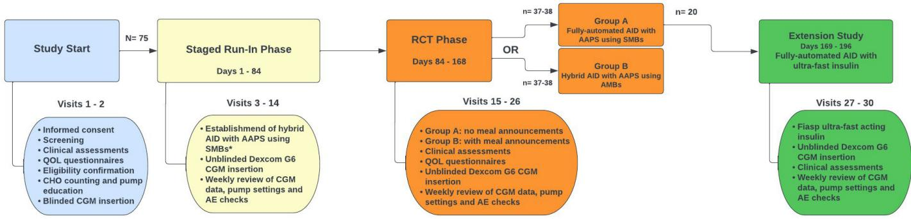
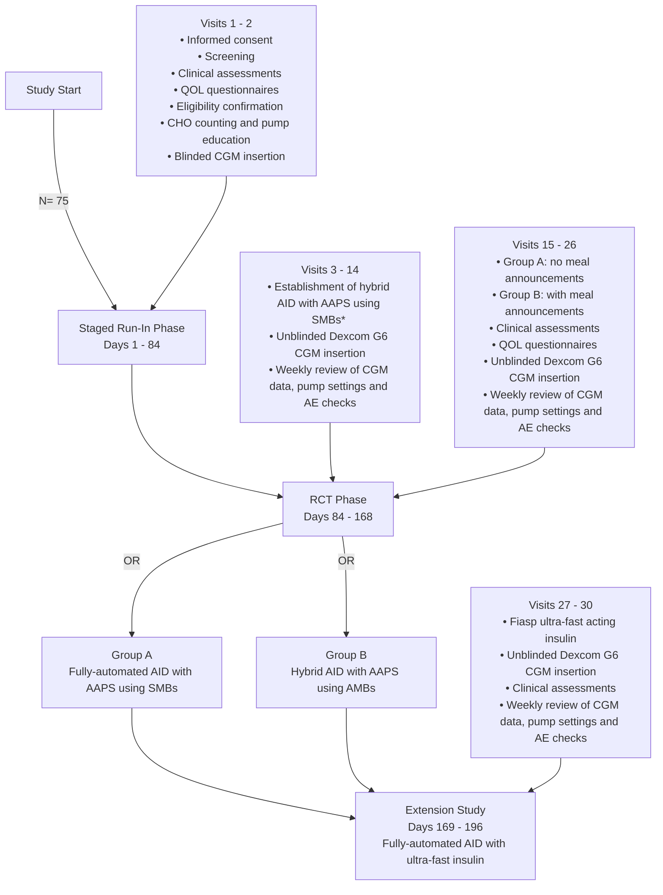

# BMJOpen

# Study protocol for a randomised openlabel clinical trial examining the safety and efficacy of the Android Artificial Pancreas System (AAPS) with advanced bolus-free features in adults with type 1 diabetes: the ‘CLOSE IT’ (Closed Loop Open SourcE In Type 1 diabetes) trial

Tom Wilkinson ,1 Dunya Tomic,2,3 Erin Boyle,2 David Burren,2 Yasser Elghattis ,2 Alicia Jenkins,2 Celeste Keesing,1 Sonia Middleton,2 Natalie Nanayakkara,2 Jonathan Williman ,1 Martin de Bock,1 Neale D Cohen2

To cite: Wilkinson T, Tomic D, Boyle E, et al. Study protocol for a randomised open-label clinical trial examining the safety and efficacy of the Android Artificial Pancreas System (AAPS) with advanced bolus-free features in adults with type 1 diabetes: the ‘CLOSE IT’ (Closed Loop Open SourcE In Type 1 diabetes) trial. BMJ Open 2024;14:e078171. doi:10.1136/ bmjopen-2023-078171

Prepublication history for this paper is available online. To view these files, please visit the journal online (http://dx.doi. org/10.1136/bmjopen-2023- 078171).

Received 26 July 2023

Accepted 20 November 2023

# Check for updates

© Author(s) (or their employer(s)) 2024. Re-use permitted under CC BY-NC. No commercial re-use. See rights and permissions. Published by BMJ.

For numbered affiliations see end of article.

Correspondence to

Dr Tom Wilkinson;

thomas.wilkinson@cdhb.health. nz

# ABSTRACT

Introduction Multiple automated insulin delivery (AID) systems have become commercially available following randomised controlled trials demonstrating benefits in people with type 1 diabetes (T1D). However, their realworld utility may be undermined by user-associated burdens, including the need to carbohydrate count and deliver manual insulin boluses. There is an important need for a ‘fully automated closed loop’ (FCL) AID system, without manual mealtime boluses. The (Closed Loop Open SourcE In Type 1 diabetes) trial is a randomised trial comparing an FCL AID system to the same system used as a hybrid closed loop (HCL) in people with T1D, in an outpatient setting over an extended time frame.

Methods and analysis Randomised, open-label, parallel, non-inferiority trial comparing the Android Artificial Pancreas System (AAPS) AID algorithm used as FCL to the same algorithm used as HCL. Seventy-five participants aged 18–70 will be randomised (1:1) to one of two treatment arms for 12 weeks: (a) FCL—participants will be advised not to bolus for meals and (b) HCL—participants will use the AAPS AID algorithm as HCL with announced meals. The primary outcome is the percentage of time in target sensor glucose range (3.9–10.0 mmol/L). Secondary outcomes include other glycaemic metrics, safety, psychosocial factors, platform performance and user dietary factors. Twenty FCL arm participants will participate in a 4-week extension phase comparing glycaemic and dietary outcomes using NovoRapid (insulin aspart) to Fiasp (insulin aspart and niacinamide).

Ethics and dissemination Approvals are by the Alfred Health Ethics Committee (615/22) (Australia) and Health and Disability Ethics Committees (2022 FULL 13832) (New Zealand). Each participant will provide written informed consent. Data protection and confidentiality will be ensured. Study results will be disseminated by publications, conferences and patient advocacy groups.

# STRENGTHS AND LIMITATIONS OF THIS STUDY

⇒ Closed Loop Open SourcE In Type 1 diabetes is a direct comparison of an automated insulin delivery (AID) system used as full closed loop (FCL) to that same system used as hybrid closed loop, in people with type 1 diabetes during prolonged (12 weeks) outpatient follow-up.   
⇒ A 12-week run-in phase allows for optimisation of AID settings and pump self-management skills for all participants prerandomisation.   
⇒ Dietary records and qualitative interviews will explore changes in dietary intake and attitudes in FCL system users.   
⇒ This trial is unmasked, with participants in both arms having access to the same devices, therefore, there is a risk of spuriously concluding non-inferiority due to participant non-adherence.

Trial registration numbers ACTRN12622001400752 and ACTRN12622001401741.

# INTRODUCTION

Type 1 diabetes (T1D) is a chronic health condition with substantial self-management demands regarding lifestyle, diet and insulin dosing. Despite technological advances including continuous glucose monitoring (CGM) and insulin pump therapy, most people with T1D do not attain glycaemic targets,1 exposing them to risk of acute and chronic complications. Automated insulin delivery (AID) systems, also termed closed loop or artificial pancreas systems combine insulin pump technology, CGM and control algorithms, to automatically adjust insulin delivery based on interstitial fluid glucose sensor readings.2 Multiple AID systems have become commercially available following large randomised controlled trials (RCTs) demonstrating improved glycaemia in people with T1D when compared with sensor-augmented pump therapy (SAPT).3–7 Participants in these trials delivered manual insulin boluses premeals and real-world users are advised to do the same, hence these systems are termed ‘hybrid closed loop’ (HCL).

Despite clear glycaemic benefits, real-world utility of AID systems may be undermined by the burden associated with their use. Notably, reluctance to start AID, and AID discontinuation once started, have been reported as more prevalent in users with suboptimal baseline glycaemia.8 9 Reducing inequity in diabetes outcomes, therefore, requires minimisation of perceived and actual burdens of AID use. The burden is multifactorial, including device-related factors10 and difficulty trusting automated insulin dosing decisions.10–14 However, the need to deliver manual insulin boluses with carbohydrate counting is likely to be contributory in many users. Observational T1D studies have described frequent missed mealtime boluses in pump-users15 16 and inaccuracies in carbohydrate counting.17 18 Therefore, there is an important need for an AID system, which can be used as ‘fully automated closed loop’ (FCL), without manual mealtime boluses.

The oref1 ‘reference design’ algorithm introduced in open-source artificial pancreas system is also used in Android Artificial Pancreas System (AAPS) installed as an application on an Android phone. These ‘do-it-yourself’ AID systems were first shared as open-source software in 2015.19 The CREATE trial (n=97) found that those with T1D using oref1 for 24 weeks in an outpatient setting had higher mean time in range (TIR; percentage of CGM recordings between 3.9 and 10.0mmol/L) compared with those using SAPT (71.2% vs 54.5%, p<0.001).20 Results broadly aligned with comparable trials of commercial AID systems.3–7 Furthermore, a pilot crossover trial comparing oref1 used as FCL to the same system used as HCL in adolescents with T1D during supervised 3-day periods found no significant difference in mean TIR (81% vs 83%).21 Further investigation is required to assess if these findings extrapolate to unselected patients in an unsupervised home environment.

Delayed insulin activity following subcutaneous injection is a barrier to attainment of glycaemic targets by any FCL system.22 Fiasp is an ultra-rapid-acting insulin preparation, containing insulin aspart and niacinamide. Compared with insulin aspart alone (NovoRapid), subcutaneous injection of Fiasp results in more rapid appearance of insulin in the intravascular space.23 24 Fiasp has shown modest improvements in TIR in trials of HCL systems,25 26 and in a pivotal trial of the iLet Bionic Pancreas which uses ‘simplified meal announcement’.27 Improved TIR has also been demonstrated with the ultra-rapid-acting preparation Lyumjev in HCL users.28 However, Fiasp and NovoRapid have only been directly compared in AID users consuming unannounced meals in small short-term studies.26 29

The Closed Loop Open SourcE In Type 1 diabetes (CLOSE IT) trial assesses the efficacy of AAPS as FCL. The primary study objective is to evaluate TIR, comparing AAPS used as FCL to AAPS used as HCL during 12 weeks use. Secondary outcomes are the effectiveness of AAPS used as FCL relative to AAPS used as HCL with regard to glycaemic control and safety30; psychosocial factors; platform performance and user dietary factors. The CLOSE IT trial also includes a 4-week extension phase during which participants using FCL will change from Novo-Rapid to Fiasp, assessing changes in glycaemic metrics.

# METHODS AND ANALYSIS Study design

The CLOSE IT trial is an open-label, multisite, randomised, parallel-group 12-week non-inferiority trial evaluating the effectiveness and safety of AAPS used as FCL compared with AAPS used as HCL in adults (aged 18–70 years) with T1D.

All participants will complete a 12-week run-in phase, during which they become familiar with Dexcom G6 CGM and the Ypsomed insulin pump and initiate AAPS, used as HCL (see figure 1). Participants will then be randomly allocated (1:1) to one of two treatment groups:

flowchart

\*AID will becommenced inastaged manner,depending on training and discretion of study staff   
Figure 1 Study flow diagram. AAPS, Android Artificial Pancreas System; AE, adverse event; AID, automated insulin delivery; CGM, continuous glucose monitoring; QOL, quality of life; RCT, randomised controlled trial; SMB, super micro boluses.

Table 1 Baseline assessments 

<table><tr><td>Demographic</td><td>► Ethnicity► Gender► Highest level of education attained</td></tr><tr><td>Auxological</td><td>► Height► Weight► Body mass index</td></tr><tr><td>Diabetic</td><td>► Prior or current use of CGM or flash glucose monitoring (&gt;75% use)► No of episodes of severe hypoglycaemia in the 12 months prior to baseline visit► No of episodes of diabetic ketoacidosis in the 12 months prior to baseline visit► Mean total daily dose of insulin over the previous 14 days► Mode of insulin delivery (ie, multiple daily injections or insulin pump)► Clinical examination for lipohypertrophy that may impair absorption of subcutaneous insulin</td></tr><tr><td>Laboratory</td><td>► Venous blood sample obtained for glycated haemoglobin (HbA1c), full blood count and serum creatinine</td></tr><tr><td>Clinical</td><td>► Known allergies► Concomitant medications► Adverse event check</td></tr><tr><td>Diet</td><td>► Assessment of current carbohydrate intake, recorded over a 3-day period</td></tr><tr><td>Psychosocial</td><td>► EuroQol 5-dimensional Questionnaire 5-Level► Insulin Dosing Systems: Perceptions, Ideas, Reflections and Expectations (preintervention questionnaire)</td></tr><tr><td>Blinded CGM</td><td>► 14 days use of blinded Dexcom G6</td></tr><tr><td colspan="2">CGM, continuous glucose monitoring.</td></tr></table>

1. FCL system: Participants will continue to use AAPS, however, will be advised not to bolus for meals, and not to correct high glucose levels unless they become symptomatic or sensor glucose levels are >15.0 mmol/L for ≥1 hour.   
2. HCL system: Participants will continue to use AAPS as a HCL system with manual mealtime boluses informed by carbohydrate counting, unchanged from therapy established during the run-in phase.

The RCT phase is a 12-week duration, with the primary endpoint based on glycaemic data collected during the final 14 days.

# Run-in phase

Following baseline assessments (table 1), participants will be provided with an Ypsomed insulin pump, pump consumables and unmasked Dexcom G6 CGM and trained in their use. Training will be customised for each individual to account for factors including prior familiarity with pump therapy and current glycaemia. Novo-Rapid insulin will be exclusively used in the run-in and

Table 2 The oref1 settings 

<table><tr><td>Core settings</td><td>► Basal insulin rate► Insulin to carbohydrate ratio► Insulin sensitivity factor► Maximum insulin on board► Maximum bolus► Maximum basal rate</td></tr><tr><td>Super micro boluses (SMBs)</td><td>► Enable SMBs► Maximum minutes of basal to form SMBs</td></tr><tr><td>Common settings</td><td>► Basal rate multiplier safety ratios► Target blood glucose► Default temporary targets (eg, for exercise)► Enable unannounced meals</td></tr><tr><td>Insulin pharmacokinetic modelling</td><td>► Duration of insulin action► Time to peak insulin action</td></tr><tr><td>Other settings</td><td>► Default carbohydrate absorption rate</td></tr></table>

trial phases. A study dietitian will assess carbohydrate counting competency. Targeted education in carbohydrate counting will be provided if required.

Participants will receive an Android phone containing a locked version of the oref1 algorithm installed as an app (‘Lotus’), effectively representing open-source AAPS. This system uses a heuristic algorithm that estimates a glycaemia projection every 5 min based on current glucose levels, insulin doses, announced carbohydrate consumption and user-specific parameters. When initially used, the system adjusts insulin dosing by modulating the basal rate. In order to permit possible FCL use, participants will subsequently activate ‘super micro boluses’ (SMBs), which enable the system to deliver small, repeated boluses to correct high sensor glucose readings, and an ‘unannounced meals’ feature, which allows the algorithm to detect (and treat) glycaemic excursions that may represent unannounced carbohydrate intake.

The run-in phase is 84 days, with day 1 defined as the day on which the study insulin pump is first used to deliver insulin to the participant. During this phase, participants will commence HCL therapy using AAPS. Participants may either commence SAPT on day 1 and later transition to AID, or they may commence AID on day 1. AAPS settings will be optimised, including activation of SMBs. Participants will be supported through regular (at least weekly) electronic review of CGM data and pump insulin delivery records by research staff. In-person study visits will be arranged as required. Table 2 summarises settings within oref1 that may be adjusted for each individual participant. Participants may choose to alternate between multiple profiles (each representing a combination of settings) and set temporary glucose targets, for example, during exercise. While allowing a high degree of customisability, it is recognised that the large number of adjustable settings may add complexity. Adjustment of settings will be guided by regular meetings between research staff, sharing clinical and technical expertise.

Timing of AID commencement and optimisation of AAPS settings will be individualised for each participant; however, the target is for all participants to be established on AAPS with settings adjusted as best possible to optimise glycaemic control by day 70.

# Trial phase

The trial phase is 84 days, representing days 85–168 of the trial. Participants will be informed of their allocated treatment group. Those allocated to HCL will continue to use AAPS in a similar manner to the run-in phase. Those allocated to FCL will be asked to discontinue any meal announcement and only give a manual bolus if specified criteria are met (sensor-detected glucose >15.0 mmol/L for ≥1 hour, or symptomatic hyperglycaemia).

Participants in both groups may continue to alternate between multiple profiles and take anticipatory measures prior to exercise, for example, setting temporary glucose targets.

As in the run-in phase, participants will be supported through regular (at least weekly) electronic review of CGM data and pump insulin delivery records by research staff and in-person study visits as required. Further adjustments to oref1 settings may occur to optimise glycaemic control. Documentation of all reviews will be maintained to demonstrate that participants in both groups have equal access to clinical support.

# Extension phase

Participants allocated to FCL will, at completion of the trial phase, be sequentially invited to participate in the 28-day extension phase representing days 169–196 of the trial. Participants will change the insulin used in the study pump from NovoRapid (insulin aspart) to Fiasp (insulin aspart and niacinamide), while continuing to use AAPS as FCL under the same conditions as the trial phase. Participants will continue to be supported through regular (at least weekly) electronic review of CGM data and pump settings by research staff, and in-person study visits as required.

# Patient involvement

People with T1D were involved in protocol design. AAPS, as an open-source system, has been developed and refined by people living with T1D. Individuals with T1D will also contribute to trial conduct and to reporting and dissemination of trial results.

# Recruitment

The trial will enrol adults aged 18–70 with T1D at two sites: University of Otago, Christchurch (New Zealand) and the Baker Heart and Diabetes Institute, Melbourne (Australia). Recruitment commenced in April 2023 and is anticipated to be completed in 2024.

Study candidates will be identified by local clinicians. Formal recruitment will occur by research staff outside of routine clinical care, ensuring participants can provide informed consent free from undue influence. Evaluation of eligibility will be performed at screening according to inclusion and exclusion criteria (table 3). To include a broad range of participants, these criteria allow for participants to be using either multiple daily insulin injections or insulin pump therapy at baseline, with no eligibility restrictions based on glycaemic metrics.

Table 3 Inclusion and exclusion criteria for participation in ‘CLOSE IT’ 

<table><tr><td>Inclusion criteria</td><td>Exclusion criteria</td></tr><tr><td>► Type 1 diabetes as per the American Diabetes Association classification for &gt;12 months prior to the screening visit.► Aged 18–70 years inclusive.► Willing and able to adhere to the study protocol.</td><td>► If female, is pregnant or plans to become pregnant while participating in the study. A positive pregnancy test at screening is exclusionary.► Use of non-insulin glucose lowering therapy within 3 months of study commencement.► Severe renal impairment (estimated glomerular filtration rate; eGFR&lt;30 mL/min/1.73 m2).► Any documented active or suspected malignancy, except appropriately treated basal cell or squamous cell carcinoma of the skin or any ‘in situ’ carcinoma.► Acute cardiovascular event (myocardial infarction, unstable angina, stroke) in the 3 months prior to study commencement.► Severe hypoglycaemia* or diabetic ketoacidosis in the 3 months prior to study commencement.► Consumption of a very low carbohydrate diet, defined as carbohydrate intake &lt;40 g per day.► Inability to use insulin pump and/or mobile phone.► Any comorbid medical or psychological factors that would, on assessment by the investigators, make the person unsuitable for the study.► A lack of English literacy that would, on assessment by the investigators, make the person unsuitable for the study.► Allergy to insulin NovoRapid</td></tr></table>

\*Defined as coma or convulsion requiring assistance from others. CLOSE IT, Closed Loop Open SourcE In Type 1 diabetes.

# Sample size

The CLOSE IT trial has a non-inferiority design. Based on a mean TIR of 70% (SD 10%) approximating that seen in the HCL arm of the CREATE trial20 and similarly designed trials of commercial HCL systems,3–7 and a largest clinically acceptable difference of 7% TIR, 70 participants (35 in each group) are required to provide 90% power at α=0.05. An overall sample size of 75 participants allows for five drop-outs.

The prespecified non-inferiority margin of 7% difference in TIR is larger than the 3% difference in TIR recommended in the 2023 international consensus statement on CGM metrics in clinical trials,30 which was published after development of this protocol. This does not preclude a finding of non-inferiority at a 3% margin. A secondary outcome is the proportion of participants in each trial arm for whom TIR does not decrease by >5%, consistent with the international consensus on a significant change in TIR for an individual.

A sample size of 20 participants in the extension phase will provide 80% power at two-sided α=0.05 to detect a mean within-person absolute change of 5%, assuming a within-person SD of 7.5%.

# Screening and enrolment

Individuals deemed a study candidate at prescreening will be given the opportunity to review the participant information and consent form (PICF). Processes of obtaining informed consent will include the requirements of ISO 14155:2011 and Good Clinical Practice. All participants must sign and date the current ethics approved written informed consent form before any study-specific assessments or procedures are performed. Additional consent will be sought for participation in interviews during the study as appropriate.

Table 1 delineates the baseline information which will be gathered postconsent, screening eligibility confirmation and enrolment in the study. Participants who do not usually use a Dexcom G6 CGM will be required to complete 14 days blinded CGM, with >75% sensor data capture. Participants, who normally use a Dexcom G6 and who can provide CGM data from the preceding 14 days, will not be required to complete blinded CGM monitoring.

# Randomisation

Participants will be randomly allocated (1:1) to receive FCL or HCL therapy. A computer-generated randomisation list, with permuted blocks of random size, will be preprepared by the study statistician, who will not be involved in participant enrolment or treatment allocation. The randomisation list will be concealed and loaded into the Research Electronic Data Capture (REDCap) database on Baker Institute servers.

Participants may only be randomised on day 85, following completion of the run-in phase. Then, research staff with authorisation to randomise participants may click the ‘randomise’ button within REDCap, which will assign the treatment to the study number and lock the fields containing the treatment group. This process will ensure allocation is concealed from research staff and participants until after run-in phase completion.

# Primary outcome measures

The primary outcome is the percentage of time spent in target sensor glucose range (3.9–10.0mmol/L) during the last 14 days of the trial phase, comparing FCL to HCL. Timing of all assessments is in table 4.

# Secondary outcome measures

# Glycaemic control

Glycated haemoglobin (HbA1c) will be measured using an assay aligned to that used in the Diabetes Control and Complications Trial (DCCT) (ref: The Diabetes Control and Complications Trial Research Group. The effect of intensive treatment of diabetes on the development and progression of long-term complications in insulindependent diabetes mellitus. N Engl J Med 1993;329:977– 986) in local laboratories in venous blood from baseline and completion of the run-in and trial phases.

Individual CGM data will be pushed from the Android phone into a cloud-based server; Nightscout (described under Data Management). CGM data will be analysed according to standardised CGM metrics for clinical trials. 30

► Percentage of participants able to maintain TIR>70%.   
Percentage of participants for whom TIR decreases by >5% between days 71–84 and days 155–168.   
Time in tight range, defined as % CGM time 3.9–7.8mmol/L.   
► % CGM time<3.9mmol/L.   
► % CGM time<3.0mmol/L.   
► % CGM time>10.0mmol/L.   
► % CGM time>13.9mmol/L.   
Mean sensor glucose and glucose variability (expressed primarily as coefficient of variation and second as an SD).   
Glycaemic outcomes differentiated as 24 hours, day (06:00–23:59hours) and night (00:00–05:59hours).

# Insulin Dosing Systems: Perceptions, Ideas, Reflections and Expectations

Insulin Dosing Systems: Perceptions, Ideas, Reflections and Expectations is a standardised tool with questions specific to AID systems, with demonstrated reliability of individual items on initial validation in a cohort of people with T1D.31 Participants will complete the 22-item adult baseline questionnaire during the study baseline assessment. Participants will complete the 22-item adult postintervention questionnaire twice: at the end of the run-in phase (recognising that they will have used AID for most of this phase) and at the end of the trial phase.

# Health status (EuroQol 5-Dimensional Questionnaire 5-Level)

EuroQol 5-Dimensional 5-Level (EQ-5D-5L) is a generic patient-reported outcome questionnaire, with demonstrated validity and reliability in many disease areas.32

<table><tr><td rowspan="6"></td><td rowspan="6" colspan="2">Screening, consent and baseline</td><td rowspan="6">Staged run-in phase (days 1–84) Establishment of hybrid AID with AAPS using SMBs</td><td rowspan="6" colspan="3">RCT phase (days 85–168) Group A: fully automated AID with AAPS using SMBs Group B: hybrid AID with AAPS using SMBs</td><td rowspan="6">Extension study (n=20) (days 169–196) Fully automated AID with ultra-fast insulin</td></tr><tr></tr><tr></tr><tr></tr><tr></tr><tr></tr><tr><td>Screening and informed consent</td><td>X</td><td></td><td></td><td></td><td></td><td></td><td></td></tr><tr><td>Demographics*</td><td>X</td><td></td><td></td><td></td><td></td><td></td><td></td></tr><tr><td>Clinical assessment†</td><td>X</td><td></td><td></td><td>X</td><td></td><td>X</td><td>X</td></tr><tr><td>HbA1c</td><td>X</td><td></td><td></td><td>X</td><td></td><td>X</td><td></td></tr><tr><td>1,5 anhydroglucitol and blood biomarkers for storage (Australia only)</td><td>X</td><td></td><td></td><td>X</td><td></td><td>X</td><td>X</td></tr><tr><td>Renal function and full blood count</td><td>X</td><td></td><td></td><td></td><td></td><td></td><td></td></tr><tr><td>Height/weight</td><td>X</td><td></td><td></td><td>X</td><td></td><td>X</td><td>X</td></tr><tr><td>Pregnancy test‡</td><td>X</td><td></td><td></td><td></td><td></td><td></td><td></td></tr><tr><td>Carbohydrate counting education</td><td></td><td>X</td><td></td><td></td><td></td><td></td><td></td></tr><tr><td>Dietary assessment§</td><td>X</td><td></td><td></td><td>X</td><td></td><td>X</td><td>X</td></tr><tr><td>Insulin pump training</td><td></td><td>X</td><td></td><td></td><td></td><td></td><td></td></tr><tr><td>Blinded CGM¶</td><td></td><td>X</td><td></td><td></td><td></td><td></td><td></td></tr><tr><td>Randomisation</td><td></td><td></td><td></td><td>X</td><td></td><td></td><td></td></tr><tr><td>INSPIRE and EQ-5D questionnaires</td><td>X</td><td></td><td></td><td>X**</td><td></td><td>X**</td><td></td></tr><tr><td>SUS Questionnaire</td><td></td><td></td><td></td><td></td><td></td><td>X</td><td></td></tr><tr><td>Qualitative interview††</td><td></td><td></td><td></td><td></td><td></td><td>X</td><td></td></tr><tr><td>Weekly review of CGM data and pump settings</td><td></td><td></td><td></td><td></td><td></td><td></td><td></td></tr><tr><td>AE collection</td><td></td><td></td><td></td><td></td><td></td><td></td><td></td></tr><tr><td>Concomitant medication check</td><td></td><td></td><td></td><td></td><td></td><td></td><td></td></tr><tr><td>Pump and sensor glucose data</td><td></td><td></td><td></td><td></td><td></td><td></td><td></td></tr></table>

Continued

Table 4
Continued 

<table><tr><td rowspan="3"></td><td rowspan="2">Screening, consent and baseline</td><td rowspan="2">Staged run-in phase (days 1–84)Establishment of hybrid AID with AAPS using SMBs</td><td colspan="3">RCT phase (days 85–168)Group A: fully automated AID with AAPS using SMBsGroup B: hybrid AID with AAPS using SMBs</td><td rowspan="2">Extension study (n=20) (days 169–196)Fully automated AID with ultra-fast insulin</td></tr><tr><td rowspan="2">Days85±4</td><td rowspan="2">Days85–168</td><td rowspan="2">168±4</td></tr><tr><td>Day-14</td><td>Days 1–84</td><td>Days 196±4</td></tr></table>

\*Age, gender, ethnicity, highest level of education, length of time with diabetes, usual mode of insulin delivery.   
†Includes review of current diabetes management.   
‡Pregnancy test for females of childbearing potential only (all postmenarchal and premenopausal women).   
§Dietary assessment: daily carbohydrate intake during 3 separate days, recorded using Easy Diet Diary.   
\*\*Postintervention questionnaire.   
††Qualitative interview in up to 15 participants in the fully automated closed loop arm (Group A).   
nd E

Although it does not provide information specific to AID use in T1D, as a widely used measure it can inform health economic analyses. EQ-5D-5L assesses overall health re: mobility, self-care, usual activities, pain/discomfort and anxiety/depression. Participants rate their health on a given day on each dimension with five levels of severity and give a global rating of their health overall on a 0–100 scale. Participants will complete the questionnaire three times: baseline, end of run-in and end of trial phase.

# System Usability Scale

System Usability Scale, a validated global tool suited to consumer products to assess the user experience,33 comprises a 10-item questionnaire. Responses generate a score from 0 to 100, with a higher score representing greater user-friendliness. Participants will complete the questionnaire once, at the end of the trial phase.

# Platform performance

Insulin delivery data will also be pushed from the Android phone into Nightscout and used to analyse platform performance and to verify participant adherence to their allocated treatment group (FCL or HCL).

► Percentage time using AID.

► Frequency of manual insulin boluses, further catego - rised in the FCL arm as boluses delivered in accordance with protocol and boluses delivered outside of protocol.

► Total insulin dose delivered by manual boluses, expressed as a percentage of overall total insulin dose, further categorised in the fully automated arm as boluses delivered in accordance with protocol and boluses delivered outside of protocol.

# User dietary factors

Participants will complete a 3-day diet record at study enrolment, between days 71–84 (run-in phase), between days 155–168 (trial phase) and between days 183–196 (extension phase). Diet records will be completed in the Easy Diet Diary app (Xyris Software, Australia) on the participant’s phone, with assistance provided as required by a study dietitian. Participants will record all food, drinks and times consumed in the app by searching the food database, scanning barcodes and taking photos.

# Qualitative interviews

Up to 15 FCL group participants will be invited to a qualitative interview at completion of the trial phase, exploring their experiences. Verbatim transcripts will undergo descriptive qualitative thematic analysis.

# Tertiary outcome measures

# Biobanking

Venous blood (plasma, serum and cell pellet) from partic - ipants in Australia will be stored (−80°C) for future testing at each time that HbA1c is tested. Analyses will relate to glycaemia (1,5 anhydroglucitol, glycated albumin), inflammation (C reactive protein by high-sensitivity assay, vascular cell adhesion molecules), oxidative stress (myeloperoxidase, mitochondrial DNA copy number) and chronic complications (microRNAs).

# Masking

Masking of participants and trialists is not possible due to the nature of the intervention, requiring participants to actively change the way in which they use the study devices.

# Data analysis

A statistical analysis plan will be prepared by the study statistician and approved by principal investigators preanalyses. Analysis will commence after the last participant has completed the RCT phase and will be use an up-to-date version of R, SAS or Stata statistical software. CGM data, captured at 5 min intervals throughout the study, will be used to calculate the primary endpoint (TIR) by dividing the number of CGM measures within the target glucose range (3.9–10.0 mmol/L) by the total number of CGM measures recorded. This primary, and all secondary CGM metrics, will be calculated for all participants during the last 14 days of the run-in phase (days 71–84) and the last 14 days of the RCT phase (days 155–168). Study outcomes will be descriptively summarised by study phase and treatment group.

The primary endpoint, and all continuous secondary CGM endpoints, will be compared between treatment groups during the last 14 days of the RCT phase using constrained longitudinal data analysis. This model adjusts for baseline levels by forcing treatment groups to share a common mean value. Study site will be included as a fixed effect, but no other variables will be adjusted for. This model will be used to estimate the intervention effect (between group difference) with 95% CI. Other continuous secondary endpoints, collected during clinic visits at the start and end of the RCT phase (eg, HbA1c and psychosocial factors), will be analysed in an identical manner.

It is recognised that in non-inferiority trials, both intention-to-treat and per-protocol analyses risk biases that favour finding non-inferiority; intention-to-treat analysis may suffer due to treatment non-adherence and per-protocol analysis due to confounding.34 The primary analysis will be performed on the intention-to-treat population, and a per-protocol analysis will also be performed and results considered when determining non-inferiority. For the per-protocol analysis, CGM metrics will be considered to belong to the FCL group on days where the participant has delivered no manual boluses outside of protocol conditions, or to the HCL group on days where the participant has delivered ≥2 manual boluses outside of protocol conditions. Thus, a single participant may belong to different treatment groups on different days.

# Extension study outcome measures and analysis

The extension study’s primary endpoint is TIR between days 183 and 196, calculated in a similar manner as above and compared with TIR during the last 14 days of the trial phase (days 155–168). The change in TIR after having changed from NovoRapid to Fiasp insulin will be calculated for each individual and summarised for all 20 participants as mean and SD with 95% CI. A paired t-test will be used to determine if the observed change is consistent with the null hypothesis of no change, with a two-sided p<0.05 used to determine statistical significance. Secondary metrics will be tested similarly, with the Benjamini and Hochberg method used to control false discovery rates associated with multiplicity of testing.

# Data management

Data flow and management will occur through Nightscout, an open-source remote monitoring tool. Individual data will be pushed from the Android phone into Nightscout. Raw data, including all pump data at ≈5 min intervals, will be uploaded deidentified to Nightscout. These data will then be downloaded onto secure servers at the Baker Institute and University of Otago. Nightscout accounts are deidentified to protect privacy and will only hold insulin pump and CGM data.

Qualitative interviews will be transcribed using Otter, an online artificial intelligence transcription service (Los Altos, USA). Interview content will be stored on an Otterhosted online server, security of which is maintained by Otter and includes two-factor authentication to access participant data. Interviews will not collect personal identifying data (eg, name, address, employment information, health records or financial information).

All other deidentified data, including demographic, auxological, clinical, diabetic, lifestyle and psychosocial questionnaires and adverse events (AEs), will be electronically stored on REDCap in secure Baker Institute servers. REDCap is a web-based application, which supports data capture for research studies, providing validated data entry and audit trails for tracking data manipulation and export procedures, and custom modules for participant randomisation and scheduling data collection events.

Records containing identifying details of New Zealandbased participants will be securely stored at the University of Otago and accessed only by New Zealand study staff. Records containing identifying details of Australia-based participants will be securely stored at the Baker Institute. These records will be retained for at least 15 years.

SPIRIT (Standard Protocol Items: Recommendations for Interventional Trials) reporting guidelines for a protocol of a clinical trial35 have been used.

# ETHICS AND DISSEMINATION

The trial is registered with the Australian New Zealand Clinical Trials Registry (ACTRN12622001400752 and ACTRN12622001401741) and has been approved by the Alfred Health Ethics Committee (615/22) Australia and New Zealand Health and Disability Ethics Committees (2022 FULL 13832). Investigators will ensure the study conducted is in full conformance with the requirements of ISO 14155: 2011, the principles of the ‘Declaration of

Helsinki’ and with the laws and regulations of Australia and New Zealand. It is the responsibility of the investigator, or their designee to obtain signed and dated informed consent from each participant prior to study participation and after adequate explanation of the aims, methods, objectives and potential hazards of the study and opportunity to ask questions and consider answers. If a participant is unable to give informed consent then the principal investigator will assess if the participant meets eligibility criteria. Any participant who cannot read or write English will be excluded as they would not be able to comply with study requirements. During the informed consent process, participants will be given the option to opt-in or opt-out of the extension phase, qualitative interview and biobanking components of the trial.

At trial-end participants will return to their usual Healthcare Professional team. New Zealand-based participants will be eligible to apply for compensation from the New Zealand Accident Compensation Corporation (ACC) in the event of a study-related injury or illness. In the very unlikely event that ACC declines cover, then the University of Otago’s clinical trial insurance would apply. For Australia-based participants, the Baker Institute’s clinical trial insurance will apply in event of study-related injury or illness.

Any of the following AEs will be documented in a timely manner:

1. Adverse device effects: AEs resulting from insufficient or inadequate instructions for use, deployment, implantation, installation or operation, or any malfunction of the investigational medical device, and any event resulting from use error from intentional misuse of the investigational device.   
2. Serious AEs (SAEs): AEs resulting in death, lifethreatening illness or injury, causing permanent impairment of body structure or function, requiring hospitalisation, or medical or surgical intervention to prevent any of the aforementioned SAEs.   
3. Device deficiencies (DD): any inadequacy of a medical device with respect to its identity, quality, durability, reliability, safety or performance.

An electronic clinical record form (eCRF) will record:

► Start and stop date of the event.   
► A description of the event, including associated symptoms.   
► Assessment of seriousness.   
► Assessment of intensity.   
► Assessment of relationship to the investigational device.   
► Intervention/troubleshooting.   
► Outcome.

All reportable AE will be followed up, if possible, until return to baseline status or stability, and if this is not achieved an explanation will be recorded in the eCRF. An independent data monitoring committee will assess accumulated data to ensure trial integrity and safety.

Dissemination of study results will be via rigorous peerreviewed publications, conferences and patient advocacy groups. Investigators envisage trial results can deliver real-world health benefit for the global T1D community. The study is designed to maximise publishable outputs, including the first RCT outcome data for an FCL system in an outpatient setting. To deliver real-world impact investigators will leverage their representation on local and international diabetes advisory groups, and advocate approval of the open-source algorithm by relevant health regulators.

# Author affiliations

1 University of Otago Christchurch, Christchurch, New Zealand

2 Baker Heart and Diabetes Institute, Melbourne, Victoria, Australia

3 School of Public Health and Preventive Medicine, Monash University, Melbourne, Victoria, Australia

Contributors TW and DT wrote the manuscript. All authors reviewed the manuscript. TW, EB, DB, YE, JW, MdB, AJ, NN and NDC wrote the original study protocol. CK and SM advised regarding conduct of dietary aspects of the protocol.

Funding The trial is being funded by a grant from the JDRF non-profit diabetes research fund (grant key 2-SRA-2023-1266-M-B). No pharmaceutical or technology companies were involved in the design and development of this trial, nor in the writing and editing of this manuscript.

Competing interests TW, DT, EB, YE and NN have nothing to disclose. MdB declares receiving speaker fees from Medtronic, Dexcom, Boerhinger Ingelheim, research support from Dexcom, Medtronic, Novonordisk, Pfizer, SOOIL, and has served as advisory board membership for Dexcom. NDC declares speaker fees from Novo Nordisk, Lilly, Boehringer Ingelheim, Abbott and research support from Ypsomed, Novo Nordisk, Boehringer Ingelheim, Astra Zeneca, Novartis. JW declares research support from Dexcom and SOOIL. DB declares employment at Nascence Biomed (which provides the technical platform for the CLOSE IT trial) and serving on an editorial board for Ascensia.

Patient and public involvement Patients and/or the public were involved in the design, or conduct, or reporting, or dissemination plans of this research. Refer to the Methods section for further details.

Patient consent for publication Not applicable.

Provenance and peer review Not commissioned; externally peer reviewed.

Open access This is an open access article distributed in accordance with the Creative Commons Attribution Non Commercial (CC BY-NC 4.0) license, which permits others to distribute, remix, adapt, build upon this work non-commercially, and license their derivative works on different terms, provided the original work is properly cited, appropriate credit is given, any changes made indicated, and the use is non-commercial. See: http://creativecommons.org/licenses/by-nc/4.0/.

# ORCID iDs

Tom Wilkinson http://orcid.org/0000-0002-9025-3778

Yasser Elghattis http://orcid.org/0000-0001-8351-4784

Jonathan Williman http://orcid.org/0000-0001-5080-4435

# REFERENCES

1 Mair C, Wulaningsih W, Jeyam A, et al. Glycaemic control trends in people with type 1 diabetes in Scotland 2004–2016. Diabetologia 2019;62:1375–84.   
2 Renard E. Automated insulin delivery systems: from early research to routine care of type 1 diabetes. Acta Diabetol 2023;60:151–61.   
3 Brown SA, Kovatchev BP, Raghinaru D, et al. Six-month randomized, multicenter trial of closed-loop control in type 1 diabetes. N Engl J Med 2019;381:1707–17.   
4 Tauschmann M, Thabit H, Bally L, et al. Closed-loop insulin delivery in Suboptimally controlled type 1 diabetes: a Multicentre, 12-week randomised trial. Lancet 2018;392:1321–9.   
5 Collyns OJ, Meier RA, Betts ZL, et al. Improved Glycemic outcomes with Medtronic Minimed advanced hybrid closed-loop delivery: results from a randomized crossover trial comparing automated insulin delivery with predictive low glucose suspend in people with type 1 diabetes. Diabetes Care 2021;44:969–75.

6 Benhamou P-Y, Franc S, Reznik Y, et al. Closed-loop insulin delivery in adults with type 1 diabetes in real-life conditions: a 12-week Multicentre, open-label randomised controlled crossover trial. Lancet Digit Health 2019;1:e17–25.   
7 Haidar A, Legault L, Raffray M, et al. Comparison between closedloop insulin delivery system (the artificial Pancreas) and sensoraugmented pump therapy: A randomized-controlled crossover trial. Diabetes Technol Ther 2021;23:168–74.   
8 Messer LH, Berget C, Vigers T, et al. Real world hybrid closedloop discontinuation: predictors and perceptions of youth discontinuing the 670G system in the first 6 months. Pediatr Diabetes 2020;21:319–27.   
9 Telo GH, Volkening LK, Butler DA, et al. Salient characteristics of youth with type 1 diabetes initiating continuous glucose monitoring. Diabetes Technol Ther 2015;17:373–8.   
10 Naranjo D, Suttiratana SC, Iturralde E, et al. What end users and Stakeholders want from automated insulin delivery systems. Diabetes Care 2017;40:1453–61.   
11 van Bon AC, Kohinor MJE, Hoekstra JBL, et al. Patients' perception and future acceptance of an artificial Pancreas. J Diabetes Sci Technol 2010;4:596–602.   
12 Quintal A, Messier V, Rabasa-Lhoret R, et al. A qualitative study of the views of individuals with type 1 diabetes on the ethical considerations raised by the artificial Pancreas. Narrat Inq Bioeth 2020;10:237–61.   
13 Taleb N, Quintal A, Rakheja R, et al. Perceptions and expectations of adults with type 1 diabetes for the use of artificial Pancreas systems with and without glucagon addition: results of an online survey. Nutr Metab Cardiovasc Dis 2021;31:658–65.   
14 Tanenbaum ML, Iturralde E, Hanes SJ, et al. Trust in hybrid closed loop among people with diabetes: perspectives of experienced system users. J Health Psychol 2020;25:429–38.   
15 Olinder AL, Kernell A, Smide B. Missed bolus doses: devastating for metabolic control in CSII-treated adolescents with type 1 diabetes. Pediatr Diabetes 2009;10:142–8.   
16 Akturk HK, Snell-Bergeon J, Shah VN. Efficacy and safety of Tandem control IQ without user-initiated Boluses in adults with uncontrolled type 1 diabetes. Diabetes Technol Ther 2022;24:779–83.   
17 Meade LT, Rushton WE. Accuracy of carbohydrate counting in adults. Clin Diabetes 2016;34:142–7.   
18 Brazeau AS, Mircescu H, Desjardins K, et al. Carbohydrate counting accuracy and blood glucose variability in adults with type 1 diabetes. Diabetes Res Clin Pract 2013;99:19–23.   
19 Lewis D. History and perspective on DIY closed Looping. J Diabetes Sci Technol 2019;13:790–3.   
20 Burnside MJ, Lewis DM, Crocket HR, et al. Open-source automated insulin delivery in type 1 diabetes. N Engl J Med 2022;387:869–81.   
21 Petruzelkova L, Neuman V, Plachy L, et al. First use of open-source automated insulin delivery Androidaps in full closed-loop scenario: Pancreas4All randomized pilot study. Diabetes Technol Ther 2023;25:315–23.

22 Weinzimer SA, Steil GM, Swan KL, et al. Fully automated closed-loop insulin delivery versus Semiautomated hybrid control in pediatric patients with type 1 diabetes using an artificial Pancreas. Diabetes Care 2008;31:934–9.   
23 Heise T, Hövelmann U, Brøndsted L, et al. Faster-acting insulin Aspart: earlier onset of appearance and greater early pharmacokinetic and pharmacodynamic effects than insulin Aspart. Diabetes Obes Metab 2015;17:682–8.   
24 Heise T, Zijlstra E, Nosek L, et al. Pharmacological properties of faster-acting insulin Aspart vs insulin Aspart in patients with type 1 diabetes receiving continuous subcutaneous insulin infusion: A randomized, double-blind, crossover trial. Diabetes Obes Metab 2017;19:208–15.   
25 Ozer K, Cooper AM, Ahn LP, et al. Fast acting insulin Aspart compared with insulin Aspart in the Medtronic 670G hybrid closed loop system in type 1 diabetes: an open label crossover study. Diabetes Technol Ther 2021;23:286–92.   
26 Lee MH, Paldus B, Vogrin S, et al. Fast-acting insulin Aspart versus insulin Aspart using a second-generation hybrid closed-loop system in adults with type 1 diabetes: A randomized, open-label, crossover trial. Diabetes Care 2021;44:2371–8.   
27 Bionic Pancreas Research Group, Beck RW, Russell SJ, et al. A multicenter randomized trial evaluating fast-acting insulin Aspart in the Bionic Pancreas in adults with type 1 diabetes. Diabetes Technology & Therapeutics 2022;24:681–96.   
28 Nwokolo M, Lakshman R, Boughton CK, et al. 923-P: Camaps FX hybrid closed-loop with ultra-rapid insulin Lispro increases time in range compared with standard insulin Lispro in adults with type 1 diabetes—A double-blind, randomized, crossover study. Diabetes 2023;72:Supplement\_1.   
29 Dovc K, Piona C, Yeşiltepe Mutlu G, et al. Faster compared with standard insulin Aspart during day-and-night fully closed-loop insulin therapy in type 1 diabetes: A double-blind randomized crossover trial. Diabetes Care 2020;43:29–36.   
30 Battelino T, Alexander CM, Amiel SA, et al. Continuous glucose monitoring and Metrics for clinical trials: an international consensus statement. Lancet Diabetes Endocrinol 2023;11:42–57.   
31 Weissberg-Benchell J, Shapiro JB, Hood K, et al. Assessing patientreported outcomes for automated insulin delivery systems: the Psychometric properties of the INSPIRE measures. Diabet Med 2019;36:644–52.   
32 Devlin NJ, Shah KK, Feng Y, et al. Valuing health-related quality of life: an EQ-5D-5L value set for England. Health Econ 2018;27:7–22.   
33 Bangor A, Kortum PT, Miller JT. An empirical evaluation of the system usability scale. International Journal of Human-Computer Interaction 2008;24:574–94.   
34 Mo Y, Lim C, Watson JA, et al. Non-adherence in non-inferiority trials: pitfalls and recommendations. BMJ 2020;370:m2215.   
35 Chan A-W, Tetzlaff JM, Gøtzsche PC, et al. SPIRIT 2013 explanation and elaboration: guidance for protocols of clinical trials. BMJ 2013;346:e7586.