# Personalized insulin dosing using reinforcement learning for high-fat meals and aerobic exercises in type 1 diabetes: a proof-of-concept trial

Received: 17 July 2023

Accepted: 19 July 2024

Published online: 03 August 2024


Check for updates

Adnan Jafar 1,2, Alessandra Kobayati2 , Michael A. Tsoukas2,3 & Ahmad Haidar1,2,3

In type 1 diabetes, high-fat meals require more insulin to prevent hyperglycemia while meals followed by aerobic exercises require less insulin to prevent hypoglycemia, but the adjustments needed vary between individuals. We propose a decision support system with reinforcement learning to personalize insulin doses for high-fat meals and postprandial aerobic exercises. We test this system in a single-arm 16-week study in 15 adults on multiple daily injections therapy (NCT05041621). The primary objective of this study is to assess the feasibility of the novel learning algorithm. This study looks at glucose outcomes and patient reported outcomes. The postprandial incremental area under the glucose curve is improved from the baseline to the evaluation period for high-fat meals (378 ± 222 vs 38 ± 223 mmol/L/min, p = 0.03) and meals followed by exercises (−395 ± 192 vs 132 ± 181 mmol/L/min, p = 0.007). The postprandial time spent below 3.9 mmol/L is reduced after high-fat meals (5.3 ± 1.6 vs 1.8 ± 1.5%, p = 0.003) and meals followed by exercises (5.3 ± 1.2 vs 1.4 ± 1.1%, p = 0.003). Our study shows the feasibility of automatically personalizing insulin doses for high-fat meals and postprandial exercises. Randomized controlled trials are warranted.

Type 1 diabetes is an autoimmune disease characterized by the destruction of insulin-producing beta cells in the pancreas1 . In the absence of insulin, individuals with type 1 diabetes develop persistent high blood glucose levels, known as hyperglycemia, which, if left untreated, can lead to a variety of complications such as nephropathy, neuropathy, retinopathy, and cardiovascular disease2,3 . The Diabetes Control and Complications Trial in 1993 showed that intensive insulin therapy in the form of multiple daily injections (MDI) or continuous subcutaneous insulin infusion via an insulin pump reduce the risk, and delay the onset, of such complications2 .

MDI and pump therapies remain the standard of care for type 1 diabetes, with MDI therapy being the most commonly used worldwide due to its lower cost and ease of access, among others4,5 . MDI therapy specifically refers to the use of 1 or 2 daily basal injections of longacting insulin to control glycemia overnight and between meals, along with bolus injections of rapid-acting insulin at mealtimes to control postprandial blood glucose levels5 .

Carbohydrate is the macronutrient with the greatest impact on postprandial glucose levels6 . However, recent studies in both children and adults have shown that high-fat meals, regardless of fat type, delay the acute rise of blood glucose levels, possibly due to delayed gastric emptying7,8 , and lead to sustained hyperglycemia for up to 5 h postprandially9 . These studies also report that high-fat meals result in a smaller rise in glucose levels in the early postprandial period,

1 Department of Biomedical Engineering, McGill University, Montreal, QC, Canada. 2 The Research Institute of McGill University Health Centre, Montreal, QC, Canada. 3 These authors jointly supervised this work: Michael A. Tsoukas, Ahmad Haidar. e-mail: ahmad.haidar@mcgill.ca

potentially leading to hypoglycemia (low blood glucose levels) immediately after meal ingestions7–9 .

While official guidelines are yet to be published on how to account for fats in the calculation of meal boluses, several studies have shown that increasing insulin by 25–75% with a split dosing strategy (upfront and late postprandial boluses) can avoid early hypoglycemia and late hyperglycemia9–12. However, while carbohydrate ratios allow for flexibility in the meal carbohydrate content, no such concept exists for meal fat, which makes the split dosing strategy challenging to implement in practice due to the variability in inter-individual postprandial (early and late) insulin requirements for high-fat meals1 3,14

A separate, yet related, challenge that people with type 1 diabetes face is that of exercise. Regular exercise is recommended for people with type 1 diabetes since it is associated with less mortality, cardiovascular risk factor reduction15,16, diabetes-related microvascular complications16, and HbA1c levels16. However, many people with type 1 diabetes do not exercise, largely due to the fear of hypoglycemia17,18. During aerobic exercise (e.g., running, swimming, and cycling), the glucose uptake from the skeletal muscles increases by tenfold or more19, which, in healthy individuals, is being provided by counterregulatory mechanisms of the liver’s glycogen breakdown (through the reduction of endogenous insulin secretion) and the increase in endogenous glucagon secretion. However, in individuals with type 1 diabetes, this delicate and balanced alteration of hormonal secretions is absent, which often leads to hypoglycemia18,20,21.

Several strategies have been proposed to prevent exerciseinduced hypoglycemia in type 1 diabetes, including reduction of premeal insulin bolus for postprandial exercise21, and ingestion of carbohydrates prior to fasting exercise18. These strategies were implemented in consensus guidelines and were also tailored to the types, timing, duration, and intensity of exercise18. However, these strategies are population-based and executing them in practice remain a challenge due to the large inter- and intra-individual variability in the glycemic responses to exercise22.

Reinforcement learning is a type of machine learning that is gaining increasing popularity and was used to solve various problems, such as autonomous driving23, medication dosing24,25, and various board games26, without requiring any prior or complete knowledge of the environment. However, in environments where it is impossible to have an exposure to and control of the entire environment (e.g., traffic control, a swarm of robots, economics models), a single-agent reinforcement learning cannot learn the tasks fast enough to reach satisfactory performance27. Multi-agent reinforcement learning addresses this issue by employing multiple agents in the environment, in which they either collaborate (cooperative multi-agent reinforcement learning) and/or compete (competitive multi-agent reinforcement learning)27. For more details about multi-agent reinforcement learning, we refer the reader to ref. 27.

Table 1 | Participants’ baseline characteristics (n = 15) 

<table><tr><td>Characteristic</td><td>Mean (SD) or frequency (%)</td><td>Range (min-max)</td></tr><tr><td>Female sex</td><td>6 (40%)</td><td>-</td></tr><tr><td>Age (years)</td><td>38 ± 13</td><td>22-63</td></tr><tr><td>Weight (kg)*</td><td>85 ± 12</td><td>65-102</td></tr><tr><td>BMI (kg/m2)*</td><td>28 ± 3</td><td>24-33</td></tr><tr><td>HbA1c (%)</td><td>8.5 ± 1.1</td><td>6.8-10.1</td></tr><tr><td>HbA1c (mmol/mol)</td><td>69 ± 8</td><td>51-87</td></tr><tr><td>Duration of diabetes (years)</td><td>20 ± 12</td><td>4-40</td></tr><tr><td>Total daily insulin (U)</td><td>52 ± 17</td><td>24-86</td></tr><tr><td>Participants using fixed dose</td><td>9 (60%)</td><td>-</td></tr></table>

\* Weight and BMI were calculated based on data of 9 participants. The first 6 participants were enrolled on a previous protocol version that did not include weight measurements.

Here, we propose an advanced decision support system that contains two algorithms: (i) a multi-agent reinforcement learning algorithm that adjusts doses for high-fat meals and provides sportsspecific meal insulin bolus reductions to control postprandial aerobic exercise events, and (ii) a single-agent reinforcement learning algorithm that adjusts carbohydrate ratios (CR)28, and long-acting basal insulin. We assessed this advanced decision support system in a singlearm uncontrolled 16-week outpatient study in 15 adults with type 1 diabetes undergoing sensor-augmented MDI therapy. We developed a mobile application, iBolusV2, as a dose calculation tool containing an advanced decision support system.

# Results

In total, 15 participants were enrolled from July 2021 to October 2022 (six females, mean age 38 (13) years, HbA1c 8.5% (1.1%), duration of diabetes 20 (12) years, total daily insulin 53 (17) U; Table 1). 14 participants completed the study and one participant withdrew after 2 weeks due to a schedule conflict (Fig. 1a). The trial status is concluded.

# iBolusV2 app usage

Participants used the iBolusV2 app (Fig. 1b, c) for a median 2.4 times per day, which was relatively stable across the study duration (Supplementary Fig. S1). Participants followed the iBolusV2 app’s insulin dose recommendations for high-fat meals and meals followed by exercise 88% and 87% of the time, respectively. Out of a total of 485 algorithm runs, 32 required medical reviews by the clinical team, 3 of which were overridden, corresponding to 0.6% override rate.

# Outcomes after the intake of high-fat meals

Out of the 14 participants who completed the study, 10 participants ingested high-fat meals in both the baseline and the evaluation period and were thus included in this analysis. During the baseline and evaluation periods, 17% (19/111) and 53% (63/120) of the high-fat meals required a second later bolus, respectively. Figure 2a and Supplementary Fig. S2 show the 5-h incremental postprandial glucose levels after high-fat meals (overall, breakfast, lunch, and dinner, respectively). Comparing the baseline period to the evaluation period, the overall 5-h postprandial incremental area under the glucose levels curve was reduced by 90% (378 ± 222 vs 38 ± 223 mmol/L/min, P = 0.03; Table 2). Sub-analysis also showed numerical reductions by 33% after breakfast (998 ± 440 vs 672 ± 467 mmol/L/min, P = 0.36), 55% after lunch (573 ± 297 vs 255 ± 313 mmol/L/min, P = 0.30), and 99% after dinner (306 ± 264 vs 0.30 ± 279 mmol/L/min, P = 0.15; Table 2), though these reductions were not statistically significant. Figure 2b and Supplementary Fig. S3 show the (non-incremental) postprandial glucose levels after high-fat meals. The overall 5-h postprandial percentage time spent with glucose levels below 3.9 mmol/L was reduced by 54% (5.0 ± 1.5 vs 2.3 ± 1.5, P = 0.01; Table 2), with numerical reductions of 22% after breakfast (1.79 ± 1.7 vs 1.39 ± 2.2, P = 0.84), 87% after lunch (5.3 ± 1.5 vs 0.7 ± 1.6, P = 0.01), and 63% after dinner (4.9 ± 2.3 vs 1.8 ± 2.2, P = 0.10; Table 2).

Figure 2c shows the weekly 5-h postprandial incremental area under the curve for high-fat meals, demonstrating a continuous trend toward lower values albeit with high variability. Figure 3 shows the change in fat ratios throughout the 16-week study duration. Compared to baseline, participants needed numerically less insulin doses at mealtimes (10.5 ± 1.1 vs 9.3 ± 1.2, P = 0.09; Table 1) and more insulin 2 h after the meals (0.3 ± 1.0 vs 1.5 ± 1.5, P < 0.001; Table 2). Table 3 shows dose recommendations for high-fat meals at the end of the study duration, demonstrating large variability among participants in their insulin needs, varying from −71% to +30% of their usual dose at mealtime and up to +128% of their usual dose 2 h after the meal. Separate

a   
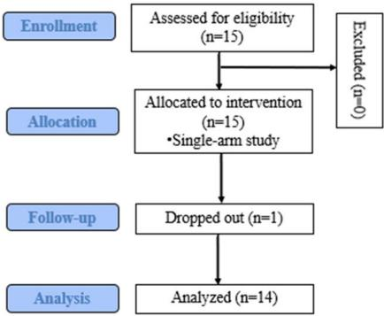

<details>
<summary>flowchart</summary>

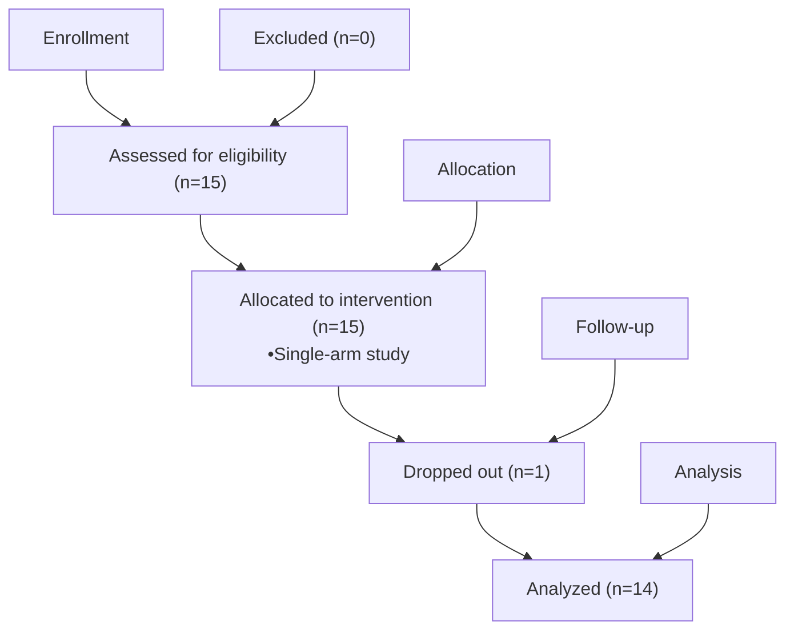
</details>

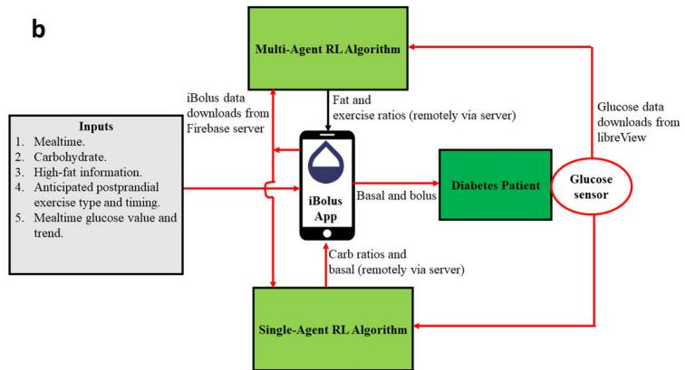

<details>
<summary>flowchart</summary>

```mermaid
graph TD
    A["Multi-Agent RL Algorithm"] -->|iBolus data downloads from Firebase server| B["iBolus App"]
    B -->|Fat and exercise ratios (remotely via server)| C["Diabetes Patient"]
    C -->|Basal and bolus| B
    B -->|Carb ratios and basal (remotely via server)| D["Single-Agent RL Algorithm"]
    D -->|Glucose data downloads from libreView| E["Glucose sensor"]
    E -->|Glucose data downloads from libreView| C
    F["Inputs\n1. Mealtime.\n2. Carbohydrate.\n3. High-fat information.\n4. Anticipated postprandial exercise type and timing.\n5. Mealtime glucose value and trend."] --> B
```
</details>

C   
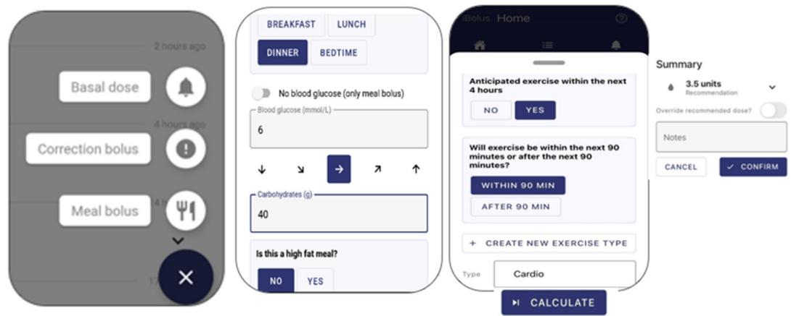

<details>
<summary>text_image</summary>

BESKFAST
LUNCH
DINNER
BEDTIME
No blood glucose (only meal bolus)
Blood glucose (mmol/L)
6
↓ ↓ → ↑ ↑
Carbohydrates (g)
40
Is this a high fat meal?
NO YES
Bolus Home
Anticipated exercise within the next 4 hours
NO YES
Will exercise be within the next 90 minutes or after the next 90 minutes?
WITHIN 90 MIN
AFTER 90 MIN
+ CREATE NEW EXERCISE TYPE
Type Cardio
CALCULATE
Summary
3.5 units
Recommendation
Override recommended dose?
Notes
CANCEL ✓ CONFIRM
</details>

Fig. 1 | Overview of the study and learning algorithm with the iBolus mobile app. a CONSORT diagram. b The advanced decision support system for individuals with type 1 diabetes on multiple daily injections therapy. c iBolusV2 app.

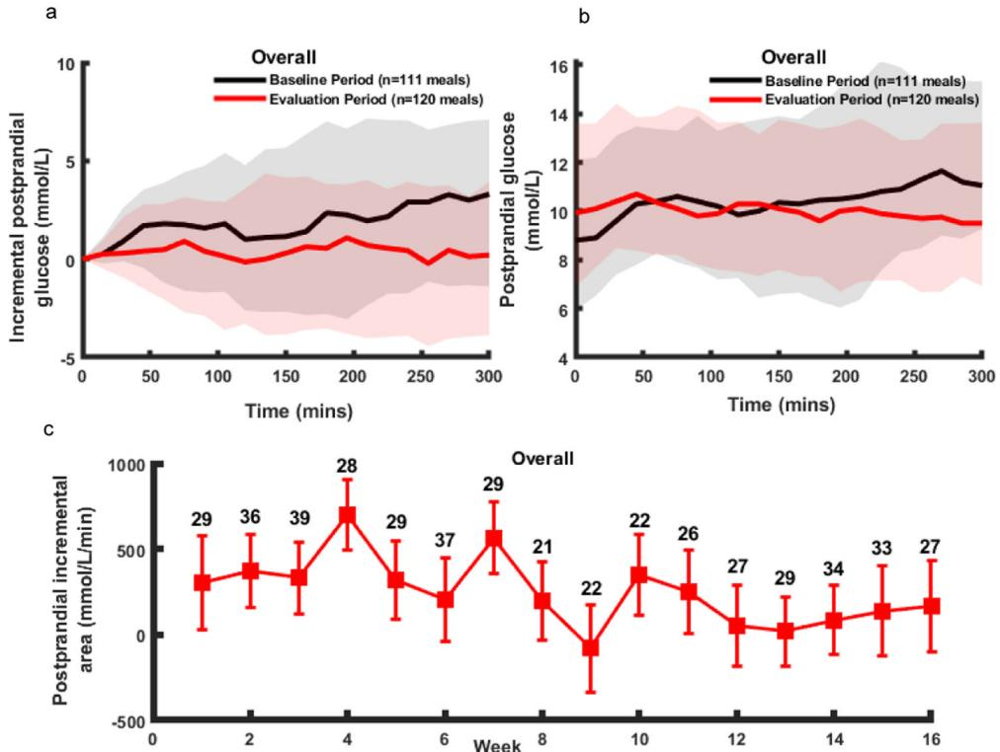  
Fig. 2 | Postprandial glucose outcomes in the baseline and evaluation periods after high-fat meals (with no postprandial exercises). a Overall postprandial incremental glucose levels (median and interquartile range), b overall postprandial glucose levels (median and interquartile range), and c weekly 5-h postprandial   
incremental area under the glucose levels curve (mean ± standard error); the numbers above the weekly data denote the number of high-fat meals in a particular week. Source data are provided as a Source Data file.

Table 2 | Comparison of the baseline period versus the evaluation period in postprandial outcomes after high-fat meals with no postprandial exercises (n = 10) 

<table><tr><td>Overall</td><td>Baseline period</td><td>Evaluation period</td><td>P value</td></tr><tr><td>Number of high-fat meals</td><td>111</td><td>120</td><td>-</td></tr><tr><td>iAUC 0–300 min (mmol/L/min)</td><td>378 ± 222</td><td>38 ± 223</td><td>0.03</td></tr><tr><td>AUC 0–300 min (mmol/L/min)</td><td>3104 ± 170</td><td>2965 ± 172</td><td>0.38</td></tr><tr><td>iAUC 240–300 min (mmol/L/min)</td><td>137 ± 52</td><td>4 ± 52</td><td>0.01</td></tr><tr><td>AUC 240–300 min (mmol/L/min)</td><td>750 ± 43</td><td>611 ± 43</td><td>0.02</td></tr><tr><td>TBR &lt; 3.9 mmol/L</td><td>5.0 ± 1.5</td><td>2.3 ± 1.5</td><td>0.01</td></tr><tr><td>TBR &lt; 3.9 mmol/L (0–2 h after meals)</td><td>4.3 ± 1.5</td><td>1.9 ± 1.4</td><td>0.04</td></tr><tr><td>TAR &gt; 10.0 mmol/L</td><td>53.7 ± 4.5</td><td>51.7 ± 4.5</td><td>0.64</td></tr><tr><td>Mealtime insulin (U)</td><td>10.5 ± 1.1</td><td>9.3 ± 1.2</td><td>0.09</td></tr><tr><td>Later bolus insulin (U)</td><td>0.3 ± 1.0</td><td>1.5 ± 1.5</td><td>&lt;0.001</td></tr><tr><td>Correction bolus insulin (U)</td><td>0.9 ± 0.3</td><td>0.5 ± 0.2</td><td>0.06</td></tr><tr><td colspan="4">Breakfast</td></tr><tr><td>Number of high-fat meals</td><td>26</td><td>23</td><td>-</td></tr><tr><td>iAUC 0–300 min (mmol/L/min)</td><td>998 ± 440</td><td>672 ± 467</td><td>0.36</td></tr><tr><td>AUC 0–300 min (mmol/L/min)</td><td>3698 ± 388</td><td>3261 ± 411</td><td>0.15</td></tr><tr><td>iAUC 240–300 min (mmol/L/min)</td><td>264 ± 112</td><td>99 ± 122</td><td>0.13</td></tr><tr><td>AUC 240–300 min (mmol/L/min)</td><td>809 ± 84</td><td>696 ± 91</td><td>0.14</td></tr><tr><td>TBR &lt; 3.9 mmol/L</td><td>1.8 ± 1.7</td><td>1.39 ± 1.8</td><td>0.84</td></tr><tr><td>TAR &gt; 10.0 mmol/L</td><td>70.7 ± 9.8</td><td>63.5 ± 11</td><td>0.40</td></tr><tr><td>Mealtime bolus insulin (U)</td><td>11.1 ± 2.9</td><td>10.1 ± 3.1</td><td>0.57</td></tr><tr><td>Later bolus insulin (U)</td><td>0.4 ± 0.2</td><td>0.6 ± 0.2</td><td>0.33</td></tr><tr><td>Correction bolus insulin (U)</td><td>1.7 ± 1.2</td><td>0.9 ± 1.1</td><td>0.08</td></tr><tr><td colspan="4">Lunch</td></tr><tr><td>Number of high-fat meals</td><td>37</td><td>46</td><td>-</td></tr><tr><td>iAUC 0–300 min (mmol/L/min)</td><td>573 ± 297</td><td>255 ± 313</td><td>0.30</td></tr><tr><td>AUC 0–300 min (mmol/L/min)</td><td>3189 ± 303</td><td>3200 ± 310</td><td>0.94</td></tr><tr><td>iAUC 240–300 min (mmol/L/min)</td><td>177 ± 85</td><td>38 ± 89</td><td>0.12</td></tr><tr><td>AUC 240–300 min (mmol/L/min)</td><td>705 ± 84</td><td>641 ± 86</td><td>0.35</td></tr><tr><td>TBR &lt; 3.9 mmol/L</td><td>5.3 ± 1.5</td><td>0.7 ± 1.6</td><td>0.01</td></tr><tr><td>TAR &gt; 10.0 mmol/L</td><td>53.3 ± 8.7</td><td>54.7 ± 8.9</td><td>0.84</td></tr><tr><td>Mealtime bolus insulin (U)</td><td>9.7 ± 1.6</td><td>9.0 ± 1.7</td><td>0.28</td></tr><tr><td>Later bolus insulin (U)</td><td>0.1 ± 0.2</td><td>2.0 ± 0.3</td><td>&lt;0.001</td></tr><tr><td>Correction bolus insulin (U)</td><td>0.6 ± 0.3</td><td>0.4 ± 0.3</td><td>0.70</td></tr><tr><td colspan="4">Dinner</td></tr><tr><td>Number of high-fat meals</td><td>48</td><td>51</td><td>-</td></tr><tr><td>iAUC 0–300 min (mmol/L/min)</td><td>306 ± 264</td><td>0.3 ± 279</td><td>0.15</td></tr><tr><td>AUC 0–300 min (mmol/L/min)</td><td>2786 ± 220</td><td>2705 ± 228</td><td>0.73</td></tr><tr><td>iAUC 240–300 min (mmol/L/min)</td><td>99 ± 66</td><td>22 ± 67</td><td>0.28</td></tr><tr><td>AUC 240–300 min (mmol/L/min)</td><td>646 ± 65</td><td>585 ± 67</td><td>0.33</td></tr></table>

Table 2 (continued) | Comparison of the baseline period versus the evaluation period in postprandial outcomes after high-fat meals with no postprandial exercises (n = 10) 

<table><tr><td>Overall</td><td>Baseline period</td><td>Evaluation period</td><td>P value</td></tr><tr><td>TBR &lt; 3.9 mmol/L</td><td>4.9 ± 2.3</td><td>1.8 ± 2.3</td><td>0.10</td></tr><tr><td>TBR &gt; 10.0 mmol/L</td><td>48.5 ± 6.5</td><td>49.9 ± 6.5</td><td>0.81</td></tr><tr><td>Mealtime bolus insulin (U)</td><td>9.7 ± 5.0</td><td>8.8 ± 4.0</td><td>0.25</td></tr><tr><td>Later bolus insulin (U)</td><td>0.5 ± 0.3</td><td>1.3 ± 0.3</td><td>0.002</td></tr><tr><td>Correction bolus insulin (U)</td><td>0.9 ± 0.4</td><td>0.6 ± 0.3</td><td>0.26</td></tr></table>

Outcomes are reported as mean ± standard error. TBR and TAR are time below range and time above range, respectively. Two-sided P values are calculated using a linear mixed model. No adjustments were made for multiple comparisons.

outcomes for high-fat meals while adjusting for age and sex are reported in the supplement (Supplementary Table S1).

# Outcomes for meals followed by exercise

Out of the 14 participants who completed the study, 9 participants performed exercises in both the baseline and the evaluation period and were thus included in this analysis. During the baseline and evaluation periods, 64% of the exercises were announced to be performed within 90 min of the mealtime while 36% were to be performed between 90 min and 4 h from the mealtime.

Figure 4a and Supplementary Fig. S4 show the 5-h postprandial incremental glucose levels after meals preceding exercise (overall, breakfast, lunch, and dinner). Comparing the baseline to the evaluation period, the overall 5-h postprandial incremental area under the glucose levels curve following meals preceding exercise was improved by 133% (−395 ± 192 vs 132 ± 181 mmol/L/min, P = 0.007; Table 4). Subanalysis also showed improvement of 102% after breakfast (−717 ± 390 vs 17 ± 353 mmol/L/min, P = 0.03), 196% after lunch (−222 ± 181 vs 215 ± 197 mmol/L/min, P = 0.08), and 113% after dinner (−479 ± 420 vs 65 ± 346 mmol/L/min, P = 0.16; Table 4). Figure 4b and Supplementary Fig. S5 show the (non-incremental) postprandial glucose levels after meals preceding exercise. The overall 5-h postprandial percentage time spent with glucose levels below 3.9 mmol/L was reduced by 73% (5.3 ± 1.2 vs 1.4 ± 1.1, P = 0.003; Table 4), with numerical reductions of 85% after breakfast (8.5 ± 1.6 vs 1.3 ± 1.2, P < 0.001), of 50% after lunch (3.2 ± 1.0 vs 1.6 ± 1.0, P = 0.11), and of 53% after dinner $( 8 . 0 \pm 4 . 7$ vs 3.7 ± 3.7, P = 0.48; Table 4). Separate outcomes for high-fat meals and non-high-fat meals with postprandial exercises are reported in the supplement (Supplementary Table S2 and Supplementary Fig. S6). Outcomes for meals that were preceded, but not followed, by exercise are also reported in the supplement (Supplementary Table S3 and Supplementary Fig. S7). Outcomes for meals preceding exercise while adjusting for age and sex are reported in the supplement (Supplementary Table S4).

Figure 4c shows the weekly 5-h postprandial incremental area under the curve, demonstrating a rapid improvement within 2 weeks. Figure 5 shows the change in exercise ratios throughout the 16-week study duration. Overall, participants needed less insulin at mealtimes (8.0 ± 1.4 vs 10.0 ± 1.3, P < 0.001; Table 4) in the evaluation period compared to baseline. Table 5 shows the dose recommendations for postprandial aerobic exercises at the end of the study period, showing a large variability among participants in their insulin needs, with exercise-dependent bolus doses being reduced up to 53% at mealtimes.

Supplementary Figs. S8 and S9 show the convergence of the Q-tables for the reinforcement learning algorithms.

# Combined outcomes

Supplementary Table S5 shows the glycemic and insulin outcomes over the 24-h, daytime, and nighttime periods, comparing the last to the first 10 days of the study period. The percentage time with glucose levels spent between 3.9 and 10 mmol/L was not different (47.9 ± 13.1 vs 48.9 ± 13.6, P = 0.73; Supplementary Table S5). The percentage time with glucose levels spent below 3.9 mmol/L was also unchanged (6.3 ± 5.8 vs 6.0 ± 4.0, P = 0.86; Supplementary Table S5). There was a numerical reduction of 0.3% in HbA1c at the end of study period compared to the baseline (8.2 ± 1.0 vs 8.5 ± 1.1, P = 0.12; Supplementary Table S5). Supplementary Fig. S10 shows the changes in carbohydrate ratios and basal doses throughout the 16-week study duration.

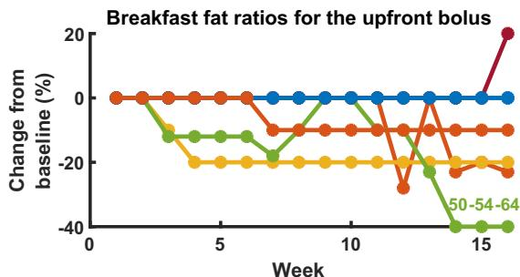

<details>
<summary>line</summary>

| Week | 50-54-64 | 65-74 | 75-84 | 85+ |
|------|----------|-------|-------|-----|
| 0    | 0        | 0     | 0     | 0   |
| 1    | 0        | 0     | 0     | 0   |
| 2    | -10      | -10   | -10   | -10 |
| 3    | -15      | -15   | -15   | -15 |
| 4    | -20      | -20   | -20   | -20 |
| 5    | -20      | -20   | -20   | -20 |
| 6    | -20      | -20   | -20   | -20 |
| 7    | -20      | -20   | -20   | -20 |
| 8    | -20      | -20   | -20   | -20 |
| 9    | -20      | -20   | -20   | -20 |
| 10   | -20      | -20   | -20   | -20 |
| 11   | -20      | -20   | -20   | -20 |
| 12   | -30      | -30   | -30   | -30 |
| 13   | -40      | -40   | -40   | -40 |
| 14   | -40      | -40   | -40   | -40 |
| 15   | 20       | 20    | 20    | 20  |
| 16   | 20       | 20    | 20    | 20  |
</details>

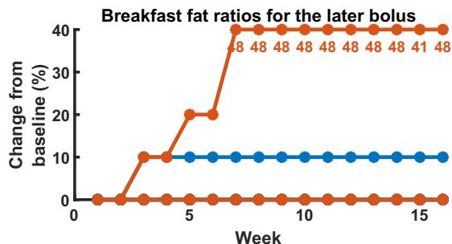

<details>
<summary>line</summary>

| Week | Change from baseline (%) |
| ---- | ------------------------ |
| 0    | 0                        |
| 1    | 0                        |
| 2    | 0                        |
| 3    | 10                       |
| 4    | 10                       |
| 5    | 20                       |
| 6    | 20                       |
| 7    | 40                       |
| 8    | 40                       |
| 9    | 40                       |
| 10   | 40                       |
| 11   | 40                       |
| 12   | 40                       |
| 13   | 40                       |
| 14   | 40                       |
| 15   | 40                       |
| 16   | 40                       |
</details>

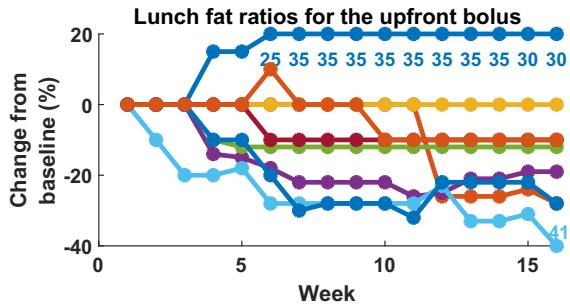

<details>
<summary>line</summary>

| Week | Change from baseline (%) |
|------|--------------------------|
| 0    | 0                        |
| 5    | -20                      |
| 10   | -30                      |
| 15   | -41                      |
</details>

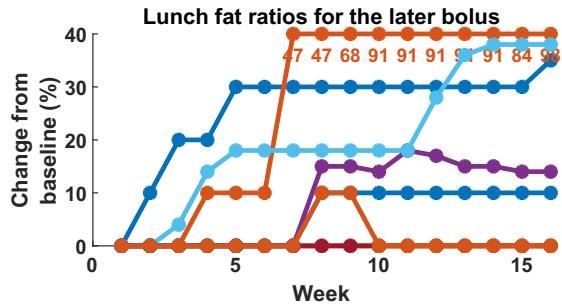

<details>
<summary>line</summary>

| Week | Blue Line | Orange Line | Light Blue Line | Purple Line |
|------|-----------|-------------|-----------------|-------------|
| 0    | 0         | 0           | 0               | 0           |
| 5    | 30        | 10          | 18              | 15          |
| 10   | 30        | 47          | 18              | 15          |
| 15   | 30        | 47          | 40              | 15          |
</details>

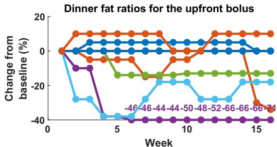

<details>
<summary>line</summary>

| Week | Orange Line (%) | Blue Line (%) | Green Line (%) | Light Blue Line (%) | Purple Line (%) |
|------|-----------------|---------------|----------------|---------------------|-----------------|
| 0    | 0               | 0             | 0              | 0                   | 0               |
| 5    | -10             | -5            | -15            | -35                 | -40             |
| 10   | 5               | 5             | -10            | -20                 | -40             |
| 15   | -30             | 0             | -10            | -20                 | -40             |
</details>

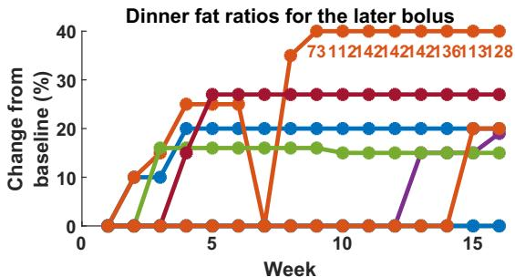  
Fig. 3 | Individual relative changes in the fat ratios for the upfront and later meal boluses. Initial recommendations for all fat ratios were zero. Source data are provided as a Source Data file.

Table 3 | Dose change recommendations for high-fat meals (with no postprandial exercises) at the end of the study duration 

<table><tr><td rowspan="2">Participant ID</td><td colspan="3">Breakfast recommendations</td><td colspan="3">Lunch recommendations</td><td colspan="3">Dinner recommendations</td></tr><tr><td>Mealtime</td><td>Later</td><td>High-fat meals</td><td>Mealtime</td><td>Later</td><td>High-fat meals</td><td>Mealtime</td><td>Later</td><td>High-fat meals</td></tr><tr><td>202</td><td>+0%</td><td>+10%</td><td>5</td><td>+30%</td><td>+35%</td><td>30</td><td>+0%</td><td>+17%</td><td>22</td></tr><tr><td>203</td><td>-23%</td><td>+48%</td><td>28</td><td>-28%</td><td>+98%</td><td>22</td><td>-34%</td><td>+128%</td><td>43</td></tr><tr><td>205</td><td>-20%</td><td>+0%</td><td>8</td><td>-</td><td>-</td><td>-</td><td>-</td><td>-</td><td>-</td></tr><tr><td>206</td><td>-</td><td>-</td><td>-</td><td>-</td><td>-</td><td>-</td><td>-71%</td><td>+19%</td><td>27</td></tr><tr><td>207</td><td>-60%</td><td>+0%</td><td>38</td><td>-12%</td><td>+0%</td><td>11</td><td>-13%</td><td>+15%</td><td>26</td></tr><tr><td>208</td><td>-</td><td>-</td><td>-</td><td>-</td><td>-</td><td>-</td><td>-</td><td>-</td><td>-</td></tr><tr><td>209</td><td>-</td><td>-</td><td>-</td><td>-39%</td><td>+38%</td><td>55</td><td>-28%</td><td>+0%</td><td>50</td></tr><tr><td>210</td><td>+20%</td><td>+10%</td><td>9</td><td>-</td><td>-</td><td>-</td><td>+0%</td><td>+27%</td><td>24</td></tr><tr><td>211</td><td>-</td><td>-</td><td>-</td><td>-</td><td>-</td><td>-</td><td>-</td><td>-</td><td>-</td></tr><tr><td>212</td><td>-</td><td>-</td><td>-</td><td>-</td><td>-</td><td>-</td><td>-</td><td>-</td><td>-</td></tr><tr><td>213</td><td>-</td><td>-</td><td>-</td><td>-28%</td><td>+10%</td><td>41</td><td>-</td><td>-</td><td>-</td></tr><tr><td>214</td><td>-</td><td>-</td><td>-</td><td>-</td><td>-</td><td>-</td><td>-</td><td>-</td><td>-</td></tr><tr><td>215</td><td>-</td><td>-</td><td>-</td><td>-10%</td><td>+0%</td><td>26</td><td>+10%</td><td>+20%</td><td>14</td></tr><tr><td>216</td><td>-</td><td>-</td><td>-</td><td>-</td><td>-</td><td>-</td><td>-</td><td>-</td><td>-</td></tr><tr><td>Average</td><td>-17 ± 30%</td><td>14 ± 20%</td><td>18 ± 15</td><td>-14 ± 24%</td><td>30 ± 37%</td><td>31 ± 15</td><td>-19 ± 28%</td><td>32 ± 43%</td><td>29 ± 13</td></tr></table>

There were no episodes of severe hypoglycemia, diabetic ketoacidosis, or other serious adverse events throughout the study.

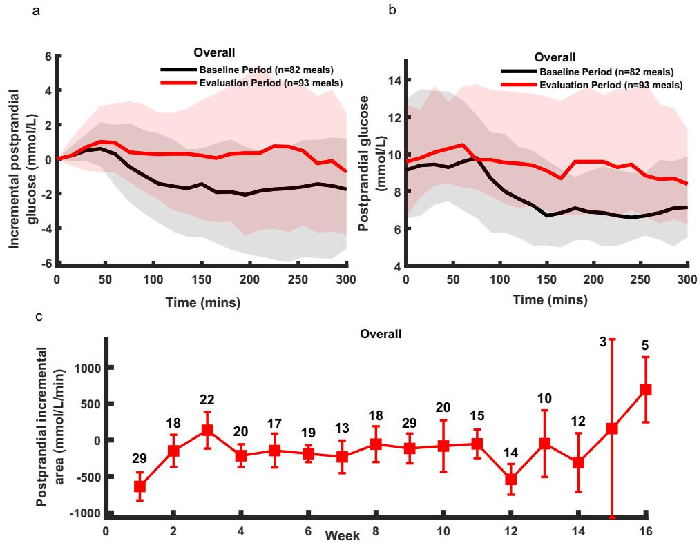  
Fig. 4 | Postprandial glucose outcomes in the baseline and evaluation periods after meals followed by aerobic exercises. a Overall postprandial incremental glucose levels (median and interquartile range), b overall postprandial glucose levels (median and interquartile range), and c weekly 5-h postprandial incremental   
area under the glucose levels curve (mean ± standard error); the numbers above the weekly data denote the number of meals with exercises in a particular week. Note the last 2 weeks included a small number of exercise sessions. Source data are provided as a Source Data file.

# Discussion

High-fat meals and postprandial aerobic exercise are common challenges that individuals with type 1 diabetes face to control their postprandial glucose levels. This uncontrolled pilot clinical study demonstrated the feasibility of an advanced decision support system based on reinforcement learning to provide personalized insulin recommendations in the context of high-fat meals and postprandial aerobic exercise, and suggested that postprandial glucose control may subsequently be improved. The study was registered at Clinicaltrials.gov (registration number NCT05041621). As this was an uncontrolled study, findings would need to be confirmed in randomized controlled trials.

This study highlights the need for individualized dose recommendations for both high-fat meals and meals followed by exercise. Although the average recommendations (Tables 3 and 5) are in line with clinical guidelines, there was a significant intra-individual variability. For high-fat meals, individuals’ insulin needs at mealtimes (upfront) varied among individuals between −60% to 0% for breakfast, −39% to +30% for lunch, and −71% to +10% for dinner, and 2 h after the meal 0% to +48% for breakfast, 0% to +98% for lunch, and 0% to +128% for dinner. Similarly, for meals followed by exercise, individuals’ insulin dose reductions varied between −10% to −50%. Our study did not have enough data to disentangle the variability between different exercise types (e.g., cardio vs walking) in the same individual, but this could be the topic of future studies.

Another interesting finding from our study is that the learning algorithm’s recommendations for high-fat meals and exercise converged after 5–6 and 3–4 weeks, respectively (Figs. 3 and 5). This may have implication on the design of the length of future clinical trials assessing similar learning algorithms. This also suggests that 4–6 weeks of glycemic and insulin data might be needed for the clinical optimization of individual strategies for the management of high-fat meals and exercise.

High-fat meals pose two main challenges: (i) hypoglycemia in the early postprandial period7 , likely due to slow gastric emptying, and (ii) hyperglycemia in the late postprandial period7 , likely due to increased gluconeogenesis. In our study, both early postprandial (< 2 h) hypoglycemia and late postprandial hyperglycemia were improved in the evaluation period compared to the baseline period, which was achieved while the algorithm reduced participants’ insulin doses at mealtimes and increased it 2 h after the meals (Table 2). These adjustments to the insulin doses by the algorithm were not pre-defined but resulted from reactive real-time weekly adaptations for each individual based on their glucose levels.

We expected improvements in daytime outcomes due to the improved postprandial glucose control. However, daytime outcomes for the last 10 days of the intervention were similar to the first 10 days of intervention. This might be due to the insufficient number of highfat meals (0.7 per participant per day) and exercise data (0.45 per participant per day) accumulated over the last 10 days, which led to a negligible improvement in the daytime outcomes. In other words, the impact on overall glucose outcomes of factors such as postprandial control after other meals, glucose levels between meals, and glucose levels at night is likely much larger than the impact of the few high-fat meals and meals with exercise.

In our study, most exercises were performed within 90 min of mealtime. For those exercises, forward planning with prandial insulin reductions is needed to prevent hypoglycemia. However, for exercises performed during the late postprandial period, modest carbohydrate intake at exercise onset is an alternative option to prevent hypoglycemia. In our interviews with study participants (supplement), some felt that the need to announce late postprandial exercise at mealtime is not always practical. Thus, the next iteration of our app will allow the announcement of exercise at any time, as opposed to only at mealtime. If exercise is announced outside mealtime, then the app should recommend a personalized carbohydrate intake to prevent hypoglycemia.

Table 4 | Comparison of the baseline period versus the evaluation period in postprandial outcomes with exercises (n = 9) 

<table><tr><td>Overall</td><td>Baseline period</td><td>Evaluation period</td><td>P value</td></tr><tr><td>Number of exercise sessions</td><td>82</td><td>93</td><td>-</td></tr><tr><td>iAUC 0–300 min (mmol/L/min)</td><td>-395 ± 192</td><td>132 ± 181</td><td>0.007</td></tr><tr><td>AUC 0–300 min (mmol/L/min)</td><td>2568 ± 159</td><td>3155 ± 155</td><td>&lt;0.001</td></tr><tr><td>iAUC 240–300 min (mmol/L/min)</td><td>-147 ± 51</td><td>-8 ± 47</td><td>0.01</td></tr><tr><td>AUC 240–300 min (mmol/L/min)</td><td>448 ± 36</td><td>609 ± 39</td><td>&lt;0.001</td></tr><tr><td>TBR &lt; 3.9 mmol/L</td><td>5.3 ± 1.2</td><td>1.4 ± 1.1</td><td>0.003</td></tr><tr><td>TBR &lt; 3.9 mmol/L (0–2 h after meals)</td><td>2.7 ± 1.0</td><td>0.8 ± 0.9</td><td>0.06</td></tr><tr><td>TAR &gt; 10.0 mmol/L</td><td>45 ± 6.4</td><td>50 ± 6.1</td><td>0.43</td></tr><tr><td>Mealtime insulin (U)</td><td>10.0 ± 1.3</td><td>8.0 ± 1.4</td><td>&lt;0.001</td></tr><tr><td>Correction bolus insulin (U)</td><td>0.1 ± 0.1</td><td>0.3 ± 0.2</td><td>0.28</td></tr><tr><td colspan="4">Breakfast</td></tr><tr><td>Number of exercise sessions</td><td>26</td><td>39</td><td>-</td></tr><tr><td>iAUC 0–300 min (mmol/L/min)</td><td>-717 ± 390</td><td>17 ± 353</td><td>0.03</td></tr><tr><td>AUC 0–300 min (mmol/L/min)</td><td>2843 ± 232</td><td>3454 ± 183</td><td>0.04</td></tr><tr><td>iAUC 240–300 min (mmol/L/min)</td><td>-267 ± 102</td><td>-91 ± 90</td><td>0.06</td></tr><tr><td>AUC 240–300 min (mmol/L/min)</td><td>450 ± 55</td><td>612 ± 44</td><td>0.02</td></tr><tr><td>TBR &lt; 3.9 mmol/L</td><td>8.5 ± 1.6</td><td>1.3 ± 1.2</td><td>&lt;0.01</td></tr><tr><td>TAR &gt; 10.0 mmol/L</td><td>59.4 ± 9.6</td><td>66.6 ± 8.7</td><td>0.42</td></tr><tr><td>Mealtime bolus insulin (U)</td><td>10 ± 1.4</td><td>8.0 ± 1.3</td><td>&lt;0.001</td></tr><tr><td>Correction bolus insulin (U)</td><td>0.1 ± 0.1</td><td>0.06 ± 0.1</td><td>0.62</td></tr><tr><td colspan="4">Lunch</td></tr><tr><td>Number of exercise sessions</td><td>47</td><td>36</td><td>-</td></tr><tr><td>iAUC 0–300 min (mmol/L/min)</td><td>-222 ± 181</td><td>215 ± 197</td><td>0.08</td></tr><tr><td>AUC 0–300 min (mmol/L/min)</td><td>2600 ± 244</td><td>2922 ± 241</td><td>0.15</td></tr><tr><td>iAUC 240–300 min (mmol/L/min)</td><td>-64 ± 51</td><td>52 ± 55</td><td>0.10</td></tr><tr><td>AUC 240–300 min (mmol/L/min)</td><td>487 ± 59</td><td>603 ± 57</td><td>0.05</td></tr><tr><td>TBR &lt; 3.9 mmol/L</td><td>3.2 ± 1.0</td><td>1.6 ± 1.0</td><td>0.11</td></tr><tr><td>TAR &gt; 10.0 mmol/L</td><td>40.5 ± 8.4</td><td>36 ± 8.2</td><td>0.61</td></tr><tr><td>Mealtime bolus insulin (U)</td><td>10.5 ± 1.4</td><td>8.1 ± 1.3</td><td>&lt;0.001</td></tr><tr><td>Correction bolus insulin (U)</td><td>0.1 ± 0.2</td><td>0.4 ± 0.2</td><td>0.19</td></tr><tr><td colspan="4">Dinner</td></tr><tr><td>Number of exercise sessions</td><td>9</td><td>18</td><td>-</td></tr><tr><td>iAUC 0–300 min (mmol/L/min)</td><td>-479 ± 420</td><td>65 ± 346</td><td>0.29</td></tr><tr><td>AUC 0–300 min (mmol/L/min)</td><td>2025 ± 312</td><td>2978 ± 247</td><td>0.02</td></tr><tr><td>iAUC 240–300 min (mmol/L/min)</td><td>-179 ± 111</td><td>41 ± 85</td><td>0.13</td></tr><tr><td>AUC 240–300 min (mmol/L/min)</td><td>309 ± 74</td><td>609 ± 56</td><td>0.004</td></tr><tr><td>TBR &lt; 3.9 mmol/L</td><td>8.0 ± 4.7</td><td>3.7 ± 3.7</td><td>0.48</td></tr><tr><td>TAR &gt; 10.0 mmol/L</td><td>32.1 ± 11.3</td><td>44.4 ± 8.7</td><td>0.40</td></tr><tr><td>Mealtime bolus insulin (U)</td><td>6.0 ± 1.7</td><td>5.5 ± 1.6</td><td>0.49</td></tr><tr><td>Correction bolus insulin (U)</td><td>0.5 ± 0.5</td><td>0.7 ± 0.3</td><td>0.62</td></tr></table>

Outcomes are reported as mean ± standard error. TBR and TAR are time below range and time above range, respectively. Two-sided P values are calculated using a linear mixed model. No adjustments were made for multiple comparisons.

Current approaches of insulin dose adjustments for high-fat meals7,10–13 and exercises management18–21 were tested only in supervised hospital stays of short duration. Our study was an outpatient unsupervised study. Furthermore, in contrast to previous approaches7,10–13,18–21, our advanced decision support system provides personalized suggestions for (i) meal-specific (i.e., breakfast, lunch, and dinner) insulin bolus doses for high-fat meals, (ii) exercisespecific (e.g., hockey, jogging) insulin bolus dose reduction recommendations, and (iii) adjustments to usual therapy parameters CRs/ fixed meal doses (in meals without high-fat and postprandial aerobic exercise) and long-acting basal dose so as to remove any effect of suboptimal usual therapy parameters on insulin adjustments for highfat meals and postprandial aerobic exercise.

Limitations of our study include (i) a small sample size, (ii) the lack of randomization and a control arm, which raises the possibility that the observed findings may have resulted from participant’ increased attention to diabetes management due to their study participation, rather than the intervention itself, (iii) an adult-only cohort, limiting the application of results to youth, and (iv) the lack of assessments of different algorithm designs (e.g., single-agent vs multi-agent). Despite these limitations, the study results primarily provide important trends and insights into future studies and development.

In conclusion, our study results suggest that the advanced decision support system has the potential to improve postprandial glycemia after high-fat meals and meals followed by postprandial aerobic exercise with the use of personalized insulin bolus dose recommendations. Future work will include the testing of the decision support system in larger and longer randomized controlled trials.

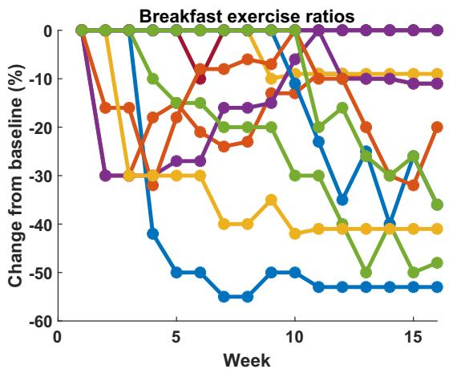

<details>
<summary>line</summary>

| Week | Series 1 | Series 2 | Series 3 | Series 4 | Series 5 | Series 6 | Series 7 | Series 8 |
|------|----------|----------|----------|----------|----------|----------|----------|----------|
| 0    | 0        | 0        | 0        | 0        | 0        | 0        | 0        | 0        |
| 1    | -30      | -15      | -30      | -30      | -30      | -30      | -30      | -30      |
| 2    | -30      | -15      | -30      | -30      | -30      | -30      | -30      | -30      |
| 3    | -30      | -15      | -30      | -30      | -30      | -30      | -30      | -30      |
| 4    | -30      | -15      | -30      | -30      | -30      | -30      | -30      | -30      |
| 5    | -30      | -15      | -30      | -30      | -30      | -30      | -30      | -30      |
| 6    | -30      | -15      | -30      | -30      | -30      | -30      | -30      | -30      |
| 7    | -30      | -15      | -30      | -30      | -30      | -30      | -30      | -30      |
| 8    | -30      | -15      | -30      | -30      | -30      | -30      | -30      | -30      |
| 9    | -30      | -15      | -30      | -30      | -30      | -30      | -30      | -30      |
| 10   | -30      | -15      | -30      | -30      | -30      | -30      | -30      | -30      |
| 11   | -30      | -15      | -30      | -30      | -30      | -30      | -30      | -30      |
| 12   | -30      | -15      | -30      | -30      | -30      | -30      | -30      | -30      |
| 13   | -30      | -15      | -30      | -30      | -30      | -30      | -30      | -30      |
| 14   | -30      | -15      | -30      | -30      | -30      | -30      | -30      | -30      |
| 15   | -30      | -15      | -30      | -30      | -30      | -30      | -30      | -30      |
| 16   | -30      | -15      | -30      | -30      | -30      | -30      | -30      | -30      |
| 17   | -30      | -15      | -30      | -30      | -30      | -30      | -30      | -30      |
| 18   | -30      | -15      | -30      | -30      | -30      | -30      | -30      | -30      |
| 19   | -30      | -15      | -30      | -30      | -30      | -30      | -30      | -30      |
| 20   | -30      | -15      | -30      | -30      | -30      | -30      | -30      | -30      |
| 21   | -30      | -15      | -30      | -30      | -30      | -30      | -30      | -30      |
| 22   | -30      | -15      | -30      | -30      | -30      | -30      | -30      | -30      |
| 23   | -30      | -15      | -30      | -30      | -30      | -30      | -30      | -30      |
| 24   | -30      | -15      | -30      | -30      | -30      | -30      | -30      | -30      |
| 25   | -30      | -15      | -30      | -30      | -30      | -30      | -30      | -30      |
| 26   | -30      | -15      | -30      | -30      | -30      | -30      | -30      | -30      |
| 27   | -30      | -15      | -30      | -30      | -30      | -30      | -30      | -30      |
| 28   | -30      | -15      | -30      | -30      | -30      | -30      | -30      | -30      |
| 29   | -30      | -15      | -30      | -30      | -30      | -30      | -30      | -30      |
| 2A   | 45       | 45       | 45       | 45       | 45       | 45       | 45       | 45       |
| 2B   | 45       | 45       | 45       | 45       | 45       | 45       | 45       | 45       |
| 2C   | 45       | 45       | 45       | 45       | 45       | 45       | 45       | 45       |
| 2D   | 45       | 45       | 45       | 45       | 45       | 45       | 45       | 45       |
| 2E   | 45       | 45       | 45       | 45       | 45       | 45       | 45       | 45       |
| 2F   | 45       | 45       | 45       | 45       | 45       | 45       | 45       | 45       |
| 2G   | 45       | 45       | 45       | 45       | 45       | 45       | 45       | 45       |
| 2H   | 45       | 45       | 45       | 45       | 45       | 45       | 45       | 45       |
| 2I   | 45       | 45       | 45       | 45       | 45       | 45       | 45       | 45       |
| 2J   | 45       | 45       | 45       | 45       | 45       | 45       | 45       | 45       |
| 2K   | 45       | 45       | 45       | 45       | 45       | 45       | 45       | 45       |
| 2L   +<fcel>-62.7%   +<fcel>-62.7%   +<fcel>-62.7%   +<fcel>-62.7%   +<fcel>-62.7%   +<fcel>-62.7%   +<fcel>-62.7%   +<fcel>-62.7%   +<fcel>-62.7%   +<nl>
</details>

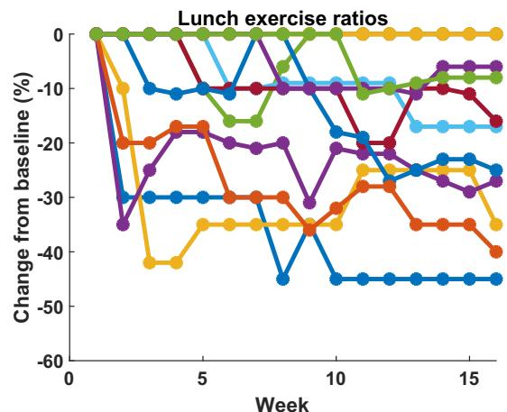

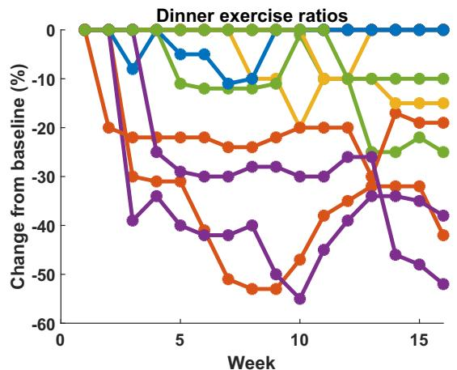  
Fig. 5 | Individual percentage changes in exercises ratios. Initial values for all ratios were zero. Source data are provided as a Source Data file.

Table 5 | Dose recommendations at the end of the study period for meals followed by postprandial aerobic exercise 

<table><tr><td rowspan="2">Participant ID</td><td colspan="2">Breakfast recommendations</td><td colspan="2">Lunch recommendations</td><td colspan="2">Dinner recommendations</td></tr><tr><td>Mealtime</td><td>Exercise sessions</td><td>Mealtime</td><td>Exercise sessions</td><td>Mealtime</td><td>Exercise sessions</td></tr><tr><td>202</td><td>-</td><td>-</td><td>-</td><td>--</td><td>-</td><td>-</td></tr><tr><td>203</td><td>-</td><td>-</td><td>-</td><td>-</td><td>-</td><td>-</td></tr><tr><td>205</td><td>Cardio: -53%</td><td>8</td><td>Cardio: -35%</td><td>21</td><td>-</td><td>-</td></tr><tr><td>206</td><td>Walking: -21%</td><td>4</td><td>-</td><td>-</td><td>Walking: -32%</td><td>8</td></tr><tr><td>207</td><td>ErgC6: -41%</td><td>6</td><td>Cardio: -35%</td><td>6</td><td>ErgC6: -15%</td><td>6</td></tr><tr><td rowspan="2">208</td><td>Walking: -10%</td><td>5</td><td>Walking: -20%</td><td>8</td><td>Walking: -38%</td><td>9</td></tr><tr><td>-</td><td>-</td><td>Running: -10%</td><td>5</td><td></td><td></td></tr><tr><td>209</td><td>Walking: -48%</td><td>32</td><td>-</td><td>-</td><td>Walking: -25%</td><td>9</td></tr><tr><td>210</td><td>-</td><td>-</td><td>Walking: -17%</td><td>10</td><td>-</td><td>-</td></tr><tr><td>211</td><td>-</td><td>-</td><td>Walking: -20%</td><td>73</td><td>-</td><td>-</td></tr><tr><td rowspan="2">212</td><td>Walking: -26%</td><td>8</td><td>Walking: -25%</td><td>8</td><td>-</td><td>-</td></tr><tr><td>Gym: -36%</td><td>6</td><td>Gym: -10%</td><td>5</td><td>-</td><td></td></tr><tr><td>213</td><td>Walking: -30%</td><td>23</td><td>Walking: -40%</td><td>11</td><td>Walking: -19%</td><td>4</td></tr><tr><td>214</td><td>-</td><td>-</td><td>-</td><td>-</td><td>-</td><td>-</td></tr><tr><td>215</td><td>-</td><td>-</td><td>-</td><td>-</td><td>-</td><td>-</td></tr><tr><td>216</td><td>-</td><td>-</td><td>-</td><td>-</td><td>-</td><td>-</td></tr><tr><td>Average</td><td>-33 ± 14%</td><td>12 ± 10</td><td>-24 ± 13%</td><td>16 ± 22</td><td>-26 ± 9%</td><td>7 ± 2</td></tr></table>

# Methods

The study was approved by the Advarra Ethics Board and Health Canada. The study was conducted in accordance with ICH good clinical practices and the Declaration of Helsinki. The study was registered at ClinicalTrials.gov (https://clinicaltrials.gov/study/NCT05041621).

# Decision support system

A standard decision support system calculates boluses as follows:

$$
B = \frac {\mathrm{CHO}}{\mathrm{CR}} + \frac {G _ {m} - G _ {T}}{\mathrm{CF}} - \mathrm{IOB} \tag {1}
$$

where $G _ { m }$ is the blood glucose level (mmol/L), $G _ { T }$ is the target glucose level (mmol/L), CHO is the amount of carbohydrates in the meal (g), CR is a carbohydrate ratio which defines how many grams of carbohydrate are covered by 1 unit of insulin (and is typically different for breakfast, lunch, and dinner), CF is a correction factor that defines how much 1 unit of insulin lowers glucose level, and IOB is the insulin-on-board that is still being absorbed from previous insulin doses.

# iBolusV2 app

We developed a mobile app, iBolusV2, as a dose calculation tool (Fig. 1c). The app contains an advanced decision support system to calculate insulin bolus recommendations for meals with or without high-fat meals and postprandial aerobic exercises. For high-fat meals, the app provides two boluses: upfront (at mealtime) and later (2 h after meal) doses. The app also provides basal dose recommendations, correction doses, and tracks insulin-on-board.

# Advanced decision support system

For high-fat meals, we propose an advanced decision support system formula that splits mealtime dosing to an upfront dose $\mathbf { U } _ { B }$ and to a later dose $\mathsf { L } _ { B }$ as follows:

$$
U _ {B} = \frac {\mathrm{CHO}}{\mathrm{CR}} (1 + F _ {u}) + \frac {G _ {m} - G _ {T}}{\mathrm{CF}} - \mathrm{IOB} \tag {2}
$$

$$
L _ {B} = \frac {\mathrm{CHO}}{\mathrm{CR}} F _ {L} \tag {3}
$$

where $F _ { u }$ and $F _ { L }$ are the fat ratios (different for each main meal) for the upfront and later boluses, respectively, adjusted by the multi-agent reinforcement learning algorithm.

For postprandial aerobic exercises, we propose an advanced decision support system formula for the meal bolus for exercises happening within or later than 90 min of mealtime $( \mathrm { U } _ { w 9 0 }$ and $\mathrm { U } _ { L 9 0 }$ , respectively) as follows:

$$
U _ {w 9 0} = \frac {\mathrm{CHO}}{\mathrm{CR}} (1 - E _ {w 9 0}) + \frac {G _ {m} - G _ {T}}{\mathrm{CF}} - \mathrm{IOB} \tag {4}
$$

$$
U _ {L 9 0} = \frac {\mathrm{CHO}}{\mathrm{CR}} (1 - E _ {L 9 0}) + \frac {G _ {m} - G _ {T}}{\mathrm{CF}} - \mathrm{IOB} \tag {5}
$$

where $E _ { w 9 0 }$ and $E _ { L 9 0 }$ are the exercise-specific ratios (different for distinct exercises and for each main meal) for exercises happing within or later than 90 min of mealtime, respectively, adjusted by the multiagent reinforcement learning algorithm. We are only considering exercises that reduce glucose levels (such as mild or moderate aerobic exercises).

Multi-agent Q-learning methods for high-fat meals and exercises We used a multi-agent Q-learning approach to provide personalized prandial insulin recommendations for high-fat meals and meals followed by exercise. We selected features in the state vector of the two learning algorithms to steer the late postprandial glucose levels into the desired target range while avoiding hypoglycemia. For high-fat meals, we additionally included a feature comprising glucose levels in the early and late postprandial periods, considering the impact of highfat meals on both time periods. For postprandial exercise, we additionally included a feature to minimize the risk of hypoglycemia beyond the observation period of the state features. The actions from the algorithms represent increase, decrease, or not changing the fat and exercise ratios. The details of algorithms are provided in the supplementary material.

# Single-agent Q-learning method for basal doses

We used a single-agent Q-learning approach to learn basal doses. We selected features in the state vector to steer the nighttime glucose level to the target range while avoiding hypoglycemia. The actions from the single-agent algorithm represent increase, decrease, and no change in the basal doses. The details of the algorithm for basal doses is provided in the supplementary material.

For meals without high-fat nor postprandial aerobic exercises, we adjust the CRs/fixed meal doses using a single-agent Q-learning algorithm as detailed in our previous work28. The learning algorithms were developed in MATLAB R2021a.

# Final recommendations

The learning algorithm is run on each day’s data of glucose levels, meals, and insulin doses to adjust the basal doses, carbohydrate ratios/fixed doses, fat ratios, and exercise ratios. These daily recommendations are not sent to the user. Final weekly recommendations are sent to the user and are determined using the median of the daily recommendations. If four days or more have hypoglycemia related to a parameter, then the median is taken only using those hypoglycemia days. To increase the safety of the algorithm, new parameter recommendations were confined to be within 20% of the previous week’s recommendations.

To avoid double adjustments in the meal bolus calculation (due to the simultaneous adjustments of carbohydrate ratios alone with fat and exercise ratios), we modify the final fat and exercise ratios as follows:

$$
\text { final } F _ {u, W + 1} ^ {j} = \frac {\mathrm{CR} _ {W + 1}}{\mathrm{CR} _ {W}} F _ {u, W + 1} ^ {j} \tag {6}
$$

$$
\text { final } F _ {L, W + 1} ^ {j} = \frac {\mathrm{CR} _ {W + 1}}{\mathrm{CR} _ {W}} F _ {L, W + 1} ^ {j} \tag {7}
$$

$$
\text { final } E _ {W 9 0, W + 1} ^ {w} = \frac {\mathrm{CR} _ {W + 1}}{\mathrm{CR} _ {W}} E _ {W 9 0, W + 1} ^ {w} \tag {8}
$$

$$
\text { final } E _ {L 9 0, W + 1} ^ {l} = \frac {\mathrm{CR} _ {W + 1}}{\mathrm{CR} _ {W}} E _ {L 9 0, W + 1} ^ {l} \tag {9}
$$

# Study design and participants

Since this is an exploratory pilot study, power calculation was not performed for the sample size. Instead, we recruited, from July 2021 to October 2022, 15 adults with type 1 diabetes on MDI therapy in a singlecenter, single-arm 16-week outpatient study. No blinding or masking was performed in this study. The study was conducted at Clinique Médicale Hygea, Montreal, Quebec, Canada. Inclusion criteria were signed and dated informed consent form, females and males ≥ 18 years old, diagnosis of type 1 diabetes of ≥12 months based on the clinical investigator’s judgment, undergoing MDI therapy, and a self-reported diet that consists of at least three high-fat meals per week or participation in exercise for at least 30 min, two times per week. Exclusion criteria were current use of any non-insulin antihyperglycemic medication (e.g., SGLT2 inhibitors, GLP-1 receptor agonists, metformin), current use of glucocorticoid medication (except inhaled and/or at low stable doses), pregnancy, use of isophane insulin or intermediate-acting insulin, significant clinical nephropathy, neuropathy, or retinopathy as per the clinical investigator’s judgment, acute macrovascular event (e.g., acute coronary syndrome or cardiac surgery) within six months of admission, severe diabetes ketoacidosis and/or hypoglycemia within one month of admission, other severe medical illness that the clinical investigator considers may interfere with participation in or completion of the study, and an inability or unwillingness to comply with study procedures as per the clinical investigator’s judgment.

The primary objective of this study is to assess the feasibility of using a novel learning algorithm to provide personalized prandial doses for high-fat meals and exercise.

# Procedures

Participants attended the enrollment visit at the Clinique Médicale Hygea where written informed consent was obtained, eligibility was confirmed, and MDI therapy parameters (long-acting basal dose, correction factors, and carbohydrate ratios/fixed mealtime doses) were recorded. The enrollment visit also included training participants on hypoglycemia and hyperglycemia management, and use of Freestyle Libre 1 sensor and use of the iBolusV2 app. Moreover, participants received training on how to identify high-fat meals by introducing them to the “Diabetes Exchange List (https://www.diabetesed.net/ page/\_files/THE-DIABETIC-EXCHANGE-LIST.pdf)” from the American Diabetes Association as a guide for assessing fat content and by reviewing the recalls of their common meals and determining whether these meals qualified as high-fat or not.

Throughout the study duration (16 weeks), participants were asked to scan the Freestyle Libre 1 sensor a minimum of five times per day (to avoid missing data). To calculate their meal boluses, participants were asked to use the iBolusV2 app by entering the amount of meal carbohydrates (if participants were carbohydrate counters), announcing the high-fat status (if fat is ≥20 g, a binary decision), and indicating whether a postprandial aerobic exercise is anticipated, along with the exercise type (e.g., jogging, running), and the timing of the exercise (within or later than 90 min after mealtime). The carbohydrate ratios/fixed doses were used to calculate meal boluses while the fat and exercise ratios were used to adjust boluses for high-fat meals and anticipated postprandial aerobic exercise. Following the meal bolus recommendations, the app did not confirm that the exercises were performed, nor the high-fat meals were ingested, as announced. Participants were able to use the app to provide correction boluses outside mealtimes at any time. The glucose sensor data from each participant were collected from their account in the LibreView platform, while meals, insulin, and participant parameters data were collected from the iBolusV2 app.

The learning algorithms provided personalized dosing parameters (long-acting insulin doses, carbohydrate ratios/fixed mealtime doses, fat ratios, and exercise ratios). Every week (Thursday evenings), the learning algorithm was run using participant’s glucose sensor data, meal’ carbohydrates (for users who count carbohydrates) and their high-fat status, the exercise type and their timing, and basal and bolus insulin data. These data along with their timestamps were uploaded to the cloud whenever the iBolusV2 app was connected to Wi-Fi. The new therapy parameters (carbohydrate ratios/fixed doses for breakfast, lunch, and dinner, basal doses, fat ratios and/or exercise ratios) were then automatically pushed into the iBolusV2 app from the cloud. Participants received a notification on the iBolusV2 app and were required to confirm for acknowledgment and continued their next week with the new parameters. The new therapy parameters were reviewed and approved by the clinical team, before being pushed to the iBolusV2 app, if the cumulative change from the initial values and/ or previously approved ones was ≥ 30%.

A blood draw was taken at the enrollment and the end-study visits to assess HbA1c. Four telephone follow ups were conducted at the end of Weeks 1, 3, 5, and 7 in case of any technical difficulties or questions. Semi-structured interviews to assess participants’ experience with the iBolusV2 app were conducted at the end of the intervention.

# Outcomes

As this is a pilot study, all outcomes are exploratory and include (i) a comparison between the evaluation period (last 4 weeks of the available high-fat meals data) versus the baseline period (first three weeks of the available high-fat meal data) in 5-h postprandial incremental area under the sensor glucose levels curve after high-fat meals, (ii) a comparison between the evaluation period (last 3 weeks of the available exercise data) versus the baseline period (the period, capped at 4 weeks, where the algorithm’s recommendations are ≤20% of the initial values) in 5-h postprandial incremental area under the sensor glucose levels curve after meals followed by postprandial aerobic exercise events, and (iii) change in an HbA1c from baseline. Other endpoints include (i) percentage time spent with glucose levels below target ranges (<3.9 mmol/L, <3.3 mmol/L, <2.8 mmol/L), in different target ranges (between 3.9 and 10 mmol/L, and between 3.9 and 7.8 mmol/L), and above target ranges (>7.8 mmol/L, >10 mmol/L, >13.9 mmol/L, and >16.7 mmol/L), (ii) mean glucose, standard deviation, and coefficient of variation, (iii) the 5-h postprandial incremental area under the sensor glucose levels after all meals, and (iv) mean scores of the survey items on the modified versions of the DTSQ, HFS-II, and MAUQ surveys.

# Statistical analysis

For the postprandial outcomes after high-fat meals and meals followed by postprandial aerobic exercise, we used a linear mixed model while controlling for the following confounding variables: sex and intercept. This comparison was made using outcomes from the individual meals (after high-fat and meals followed by postprandial aerobic exercise) during the baseline and the evaluation period. Residual values from the model were examined for an approximate normal distribution. If values were highly skewed, a transformation was used to normalize the distribution.

For the combined (postprandial plus fasting) outcomes we used a paired t test for outcomes with normally distributed data and a Wilcoxon rank-test for outcomes with non-normally distributed data. For normally distributed outcomes, we reported means and standard deviations (SD), and for non-normally distributed outcomes, we reported medians and interquartile ranges (IQR). Since this is an exploratory study, no corrections were applied for multiple comparisons. The IBM SPSS statistics 28.0.1 was used for statistical analysis.

# Reporting summary

Further information on research design is available in the Nature Portfolio Reporting Summary linked to this article.

# Data availability

The study protocol is provided with the submission. The raw individual data, including glucose levels, meals, and insulin doses, collected during the trial cannot be made available publicly since they can only be used for the purposes stated in the participants’ consent form. The raw data can be shared by the corresponding author without cost, for non-commercial purposes, subject to a material transfer agreement and approval by the Advarra Ethics Board. Upon agreement and approval, reasonable efforts will be made to share the requested data within 4 months of requests. Source data are provided with this paper.

# Code availability

The code used for data analysis is publicly shared on the Zenodo repository (https://zenodo.org/records/12693079). The algorithm code is a proprietary intellectual property and thus cannot be made publicly available. The algorithm cannot be used in routine practice, as regulatory approvals have not yet been granted.

# References

1. Daneman, D. Type 1 diabetes. Lancet 367, 847–858 (2006).

2. Diabetes Control and Complications Trial Research Group. The effect of intensive treatment of diabetes on the development and progression of long-term complications in insulin-dependent diabetes mellitus. New Engl. J. Med. 329, 977–986 (1993).   
3. Diabetes Control and Complications Trial (DCCT)/Epidemiology of Diabetes Interventions and Complications (EDIC) Study Research Group. Intensive diabetes treatment and cardiovascular outcomes in type 1 diabetes: the DCCT/EDIC study 30-year follow-up. Diabetes Care 39, 686–693 (2016).   
4. Joshi, M. & Choudhary, P. Multiple daily injections OR insulin pump therapy: choosing the best option for your patient—an evidencebased approach. Curr. Diabetes Rep. 15, 1–6 (2015).   
5. Janež, A. et al. Insulin therapy in adults with type 1 diabetes mellitus: a narrative review. Diabetes Ther. 11, 387–409 (2020).   
6. American Diabetes Association. 4. Foundations of care: education, nutrition, physical activity, smoking cessation, psychosocial care, and immunization. Diabetes Care 38, S20–S30 (2015).   
7. Bell, K. J. et al. Amount and type of dietary fat, postprandial glycemia, and insulin requirements in type 1 diabetes: a randomized within-subject trial. Diabetes Care 43, 59–66 (2020).   
8. Smart, C. E. et al. Both dietary protein and fat increase postprandial glucose excursions in children with type 1 diabetes, and the effect is additive. Diabetes Care 36, 3897–3902 (2013).   
9. Bell, K. J. et al. Impact of fat, protein, and glycemic index on postprandial glucose control in type 1 diabetes: implications for intensive diabetes management in the continuous glucose monitoring era. Diabetes Care 38, 1008–1015 (2015).   
10. Smith, T. A., Marlow, A. A., King, B. R. & Smart, C. E. Insulin strategies for dietary fat and protein in type 1 diabetes: a systematic review. Diabet. Med. 38, e14641 (2021).   
11. Smith, T. A. et al. In children and young people with type 1 diabetes using pump therapy, an additional 40% of the insulin dose for a high‐fat, high‐protein breakfast improves postprandial glycaemic excursions: a cross‐over trial. Diabet. Med. 38, e14511 (2021).   
12. Pańkowska, E., Błazik, M. & Groele, L. Does the fat-protein meal increase postprandial glucose level in type 1 diabetes patients on insulin pump: the conclusion of a randomized study. Diabetes Technol. Ther. 14, 16–22 (2012).   
13. Bell, K. J., Toschi, E., Steil, G. M. & Wolpert, H. A. Optimized mealtime insulin dosing for fat and protein in type 1 diabetes: application of a model-based approach to derive insulin doses for open-loop diabetes management. Diabetes Care 39, 1631–1634 (2016).   
14. Wolpert, H. A., Atakov-Castillo, A., Smith, S. A. & Steil, G. M. Dietary fat acutely increases glucose concentrations and insulin requirements in patients with type 1 diabetes: implications for carbohydratebased bolus dose calculation and intensive diabetes management. Diabetes Care 36, 810–816 (2013).   
15. Sluik, D. et al. Physical activity and mortality in individuals with diabetes mellitus: a prospective study and meta-analysis. Arch. Int. Med. 172, 1285–1295. (2012).   
16. Bohn, B. et al. Impact of physical activity on glycemic control and prevalence of cardiovascular risk factors in adults with type 1 diabetes: a cross-sectional multicenter study of 18,028 patients. Diabetes Care 38, 1536–1543 (2015).   
17. Manaf, H. Barriers to participation in physical activity and exercise among middle-aged and elderly individuals. Sing. Med J. 54, 581–586 (2013).   
18. Riddell, M. C. et al. Exercise management in type 1 diabetes: a consensus statement. Lancet Diabetes Endocrinol. 5, 377–390 (2017).   
19. Ploug, T., Galbo, H. & Richter, E. A. Increased muscle glucose uptake during contractions: no need for insulin. Am. J. Phys.-Endo Metab. 247, E726–E731 (1984).

20. Cockcroft, E. J., Narendran, P. & Andrews, R. C. Exercise‐induced hypoglycaemia in type 1 diabetes. Exp. Physiol. 105, 590–599 (2020).   
21. Rabasa-Lhoret, R., Bourque, J., Ducros, F. & Chiasson, J. L. Guidelines for premeal insulin dose reduction for postprandial exercise of different intensities and durations in type 1 diabetic subjects treated intensively with a basal-bolus insulin regimen (ultralente-lispro). Diabetes Care 24, 625–630. (2001).   
22. Riddell, M. C. et al. Individual glucose responses to prolonged moderate intensity aerobic exercise in adolescents with type 1 diabetes: the higher they start, the harder they fall. Pediatr. Diabetes 20, 99–106 (2019).   
23. Kiran, B. R. et al. Deep reinforcement learning for autonomous driving: A survey. IEEE Transactions on Intelligent Transportation Systems 23, 4909–4926 (2021).   
24. Jafar, A., Fathi, E. L. & Haidar, A. Long-term use of the hybrid artificial pancreas by adjusting carbohydrate ratios and programmed basal rate: a reinforcement learning approach. Comp. Meth Prog. Biomed. 200, 105936 (2021).   
25. Niraula, D. et al. A clinical decision support system for AI-assisted decision-making in response-adaptive radiotherapy (ARCliDS). Sci. Rep. 13, 5279 (2023).   
26. Silver, D. et al. Mastering the game of go without human knowledge. Nature 550, 354–359 (2017).   
27. Zhang, K., Yang, Z. & Başar, T. Multi-agent reinforcement learning: a selective overview of theories and algorithms. In Handbook of Reinforcement Learning and Control (eds Vamvoudakis, K. G., Wan, Y. Lewis, F. L. & Cansever, D.) 321–384 (Cham, Switzerland, Springer, 2021).   
28. Jafar, A., Pasqua, M. R., Olson, B. & Haidar, A. Advanced decision support system for individuals with diabetes on multiple daily injections therapy using reinforcement learning and nearestneighbors: in-silico and clinical results. Artif. Intell. Med. 148, 102749 (2023).

# Acknowledgements

The authors thank Elisa Cohen and Joanna Rutkowski for helping in the conduct of the study. The authors also thank Melissa-Rosina Pasqua, Nikita Gouchie-Provencher, and Suet-Kei Cheung for providing medical oversight in the study. This study was supported by the Canada Research Chair awarded by the Canadian Institute of Health Research to Ahmad Haidar. The Canadian Institute of Health Research had no role in the study’s development and execution.

# Author contributions

A.J. designed the algorithms, led the clinical study, and carried out the statistical analysis. A.J., M.A.T., and A.H. designed the study. A.H. supervised the research. A.K. did the qualitative analysis for the interviews, recruited the participants and helped in the conduct of the clinical trial. M.A.T. conducted the medical exams and provided medical oversight in the study. All authors had full access to all the data, read and approved the final version of the manuscript, and accept responsibility for the decision to submit for publication.

# Competing interests

A.J. received IP acquisition fee from BigFoot. A.H. received research support from Eli Lilly, Dexcom, Adocia, Tandem, and AgaMatrix, received consulting fees from Eli Lilly, and received IP acquisition fees from Eli Lilly and BigFoot. A.J. and A.H. have a patent application related to the algorithms of this work. M.A.T. received research support from AgaMatrix and speaker honoraria from Eli Lilly, Novo Nordisk, Boehringer Ingelheim, Janssen, and AstraZeneca, and received IP acquisition fee from Bigfoot. A.K. declares no competing interests.

# Additional information

Supplementary information The online version contains supplementary material available at https://doi.org/10.1038/s41467-024-50764-5.

Correspondence and requests for materials should be addressed to Ahmad Haidar.

Peer review information Nature Communications thanks Fazil Baksh and the other anonymous reviewer(s) for their contribution to the peer review of this work. A peer review file is available.

Reprints and permissions information is available at

http://www.nature.com/reprints

Publisher’s note Springer Nature remains neutral with regard to jurisdictional claims in published maps and institutional affiliations.

Open Access This article is licensed under a Creative Commons Attribution-NonCommercial-NoDerivatives 4.0 International License, which permits any non-commercial use, sharing, distribution and reproduction in any medium or format, as long as you give appropriate credit to the original author(s) and the source, provide a link to the Creative Commons licence, and indicate if you modified the licensed material. You do not have permission under this licence to share adapted material derived from this article or parts of it. The images or other third party material in this article are included in the article’s Creative Commons licence, unless indicated otherwise in a credit line to the material. If material is not included in the article’s Creative Commons licence and your intended use is not permitted by statutory regulation or exceeds the permitted use, you will need to obtain permission directly from the copyright holder. To view a copy of this licence, visit http:// creativecommons.org/licenses/by-nc-nd/4.0/.

© The Author(s) 2024