# Applying mixed-integer linear programming to the non-coplanar beam angle optimization of intensity-modulated radiotherapy for liver cancer

Peng Huang1#, Jiawen Shang1#, Xin Xie2#, Zhihui Hu1 , Zhiqiang Liu1 , Hui Yan1

1 Department of Radiation Oncology, National Cancer Center/National Clinical Research Center for Cancer/Cancer Hospital, Chinese Academy of Medical Sciences and Peking Union Medical College, Beijing, China; 2 Department of Radiation Oncology, Clinical Oncology School of Fujian Medical University, Fujian Cancer Hospital, Fuzhou, China

Contributions: (I) Conception and design: P Huang, J Shang; (II) Administrative support: Z Liu, H Yan; (III) Provision of study materials or patients: P Huang, Z Liu; (IV) Collection and assembly of data: J Shang, X Xie; (V) Data analysis and interpretation: J Shang, X Xie; (VI) Manuscript writing: All authors; (VII) Final approval of manuscript: All authors.

\# These authors contributed equally to this work.

Correspondence to: Zhiqiang Liu, PhD; Hui Yan, PhD. Department of Radiation Oncology, National Cancer Center/National Clinical Research Center for Cancer/Cancer Hospital, Chinese Academy of Medical Sciences and Peking Union Medical College, 17 Panjiayuan Nanli, Chaoyang District, Beijing 100050, China. Email: zhiqiang.liu@cicams.ac.cn; hui.yan@cicams.ac.cn.

Background: Currently, intensity-modulated radiation therapy (IMRT) is commonly used in radiotherapy clinics. However, designing a treatment plan with multiple beam angles depends on the experience of human planners, and is mostly achieved using a trial-and-error approach. It is preferrable but challenging to solve this issue automatically and mathematically using an optimization approach. The goal of this study is to develop a mixed-integer linear programming (MILP) approach for the beam angle optimization (BAO) of non-coplanar IMRT for liver cancer.

Methods: MILP models for the BAO of both coplanar and non-coplanar IMRT treatment plans were developed. The beam angles of the IMRT plans were first selected by the MILP model built using mathematical optimization software. Next, the IMRT plans with the selected beam angles was created in a commercial treatment planning system. Finally, the fluence map and dose distribution of the IMRT plans were generated under pre-defined dose-volume constraints. The IMRT plans of 10 liver cancer patients previously treated at our institute were used to assessed the proposed MILP models. For each patient, both coplanar and non-coplanar IMRT plans with beam angles optimized by the MILP models were compared with the IMRT plan clinically approved by physicians.

Results: The MILP model-guided IMRT plans showed reduced doses for most of the organs at risk (OARs). Compared with the IMRT plans clinically approved by physicians, the doses for the spinal cord (28.5 vs. 36.1, P=0.001<0.05) and liver (27.6 vs. 29.1, P=0.005<0.05) decreased significantly in the IMRT plans with non-coplanar beams selected by the MILP models.

Conclusions: The MILP model is an effective tool for the BAO in coplanar and non-coplanar IMRT treatment planning. It facilitates the automation of IMRT treatment planning for current high-precision radiotherapy.

Keywords: Mixed-integer linear programming (MILP); beam angle optimization (BAO); intensity-modulated radiotherapy; treatment planning

Submitted Jan 26, 2024. Accepted for publication Jun 20, 2024. Published online Jul 16, 2024.

doi: 10.21037/qims-24-296

View this article at: https://dx.doi.org/10.21037/qims-24-296

# Introduction

As a main treatment modality, intensity-modulated radiation therapy (IMRT) is commonly used in radiotherapy clinics today. It delivers a conformable prescription dose to the planning target volume (PTV) while limiting the delivery of a high dose to surrounding organs at risk (OARs) and normal tissues (NTs). To achieve this goal, a treatment plan consisting of multiple beams with optimized fluence maps and different gantry angles is designed and executed. When beam angles are determined a priori, fluence maps can be calculated subsequently via the inverse planning algorithms provided by most commercial treatment planning systems. To design a treatment plan consisting of multiple beam orientations, a human planner has to test multiple beam angle combinations and select the best one with the highquality dose. The trial-and-error method is mostly adopted in this process, which is time consuming and relies heavily on human experience. It is favorable to perform this process automatically via a computer-aided program.

In a pioneering study, Bortfeld et al. found that the optimal beam angle combination for IMRT planning is nearly an even distribution from 0 to 2π (1). Research has also shown that the plan quality could be improved as the number of beams increased (2). However if the spatial distribution of the OARs is less regular, the equally spaced beam setting might be invalid. Additionally, more beams could increase the treatment time and the number of delivery errors due to involuntary organ movements of the patient. Therefore, the spatial distribution of OARs should be considered, especially in beam angle optimization (BAO).

Several factors, such as the availability of beam angles, mechanical feasibility of machine, treatment sites and frequencies, and functions of inverse planning systems, should be considered accordingly (3-9). In relation to the computational complexity, the use of BAO in treatment planning is a non-deterministic polynomial time-hard problem (i.e., there is no efficient algorithm to solve the IMRT optimzation in polynomial running time). It has to resort to heuristic methods in addition to the exhaustive search methods (10). BAO algorithms can be roughly classified into two general categories. In the first category, the BAO is decoupled from the process of fluence map optimization (FMO) and treated as an independent module. The optimal beam combination is first selected according to certain dosimetric or geometric metrics, and the FMO is then performed to ensure the optimal dose distribution (11). It is convenient to implement BAO and FMO in separate modules technically, but the global optimality of the resulting IMRT plan is not guaranteed. In the second category, the BAO is coupled with the FMO process. Both the beam angles and fluence map are optimized simultaneously in an objective function, which is ideal from the dosimetric point of view. However the inclusion of BAO constraints in the FMO objective causes non-convexity and consequently the sub-optimality of the solution (12-14).

To achieve the global optimum of the objective function, exhaustive search strategies, such as the iterative method, simulated annealing, and genetic algorithm, were employed. These strategies have previously been used in the FMO of inverse planning systems and could also feasibly solve the problems of BAO (15-20). These exhaustive search strategies spend a longer running time than the BAO algorithms based on dosimetric or geometric metrics that fall into the first category. With the introduction of the graphics processing unit and search space reduction techniques, this task can be completed in tight clinical time constraints.

Recently, with the flourish of deep-learning models learning-based methods have also been used to explore the BAO problem of IMRT planning (21,22). A deep-learning model is trained to learn the relationship between the beam score and anatomical features. A deep-learning model is then built to predict the best beam angles based on the learned beam scores. This is more efficient than traditional optimization techniques but the optimality of its solution has not yet been validated.

Coplanar IMRT is the most popular beam option in delivering intensity-modulated fields to patients. However, it might not be ideal for treatment sites at the lung, liver, head and neck, and nasopharyngeal (23). This is because the tumors are usually surrounded by OARs in complex spatial distribution. The best plan would be the one that irradiates the tumor from all feasible directions in 4π space (24-26). A plan with an adequate number of non-coplanar beams (up to 30) can achieve superior dose distribution than conventional coplanar IMRT plans. However, delivering a large number of non-coplanar beams is clinically impractical within the tight time constraints, and potentially causes organ motion due to couch movement. BAO for noncoplanar IMRT planning can provide few beams and nearoptimal dose qualities close to that of a plan consisting of a large number of non-coplanar beams in 4π space.

Several groups have investigated BAO for non-coplanar IMRT planning. D’souza et al. proposed a nested partitions algorithm that is capable of finding suitable beam angle sets by guiding the dose optimization process. This meta-heuristic is flexible enough to guide the search of a heuristic or deterministic dose optimization algorithm (27). Romeijn et al. formulated the BAO problem as a convex programming problem (28). In each iteration, a new aperture is generated by solving the associated subproblem. The iteration terminates when the given number of apertures for a beams angle is reached. Later, Men et al. proposed a column-generation-based approach that sequentially adds aperture shapes at control points while ensuring that each newly generated aperture is compatible with the previously chosen apertures (29). Peng et al. proposed a new column generation based algorithm that takes into account bounds on the gantry speed and the dose rate, as well as an upper bound on the rate of change of the gantry speed, and multiple leaf collimator (MLC) constraints (30). Most of these algorithmic approaches account for certain restrictions by either explicitly incorporating them into the treatment plan optimization or by modifying the optimized plan in a post-processing step.

Unlike the heuristic and stochastic methods mentioned above, the mixed-integer linear programming (MILP) approach adopts a deterministic method for the BAO of non-coplanar IMRT planning (31). In a pioneering study, Wang et al. proposed a MILP method in which binary and positive float variables are employed to represent candidates for beam orientation and beamlet weights in beam intensity maps. Both beam orientations and beam intensity maps are simultaneously optimized in the algorithm using a deterministic method (32,33). Lee et al. proposed a mixed integer programming approach for simultaneously determining an optimal intensity map and optimal beam angles for IMRT delivery (34). Ferris et al. outlined three types of treatment planning problems that are particularly suitable for optimization approaches based on mixed integer programming (35). Gözbasi formulated this problem as a large integer programming model, but for tractability reasons Gözbasi resorted to solving a series of approximate problems (36). So far, for a large-scale MILP problem, the required computation time is still impractical and the algorithm may fail to provide clinically acceptable results.

In this study, we formulate BAO for non-coplanar IMRT planning as a convex MILP problem and search for the best beam angle combination from the numerous candidates. Due to the large scale of the MILP problem, we solve it in two steps. First, the optimal non-coplanar beams (couch and gantry angle combinations) are selected by MILP models. Second, the non-coplanar IMRT plan is created with the selected beams, and the optimal dose calculation is optimized in a commercial treatment planning system.

The remainder of this article is organized as follows. In the methods section, the formulation of the MILP models for coplanar and non-coplanar BAO are detailed. The workflow of the whole planning process is then described. In the results section, the beam angles, mean doses, dose volume histogram (DVH), and dose distribution of the MILP-based IMRT plans are compared with those of the clinically approved IMRT plans. Finally, the advantages and limitations of the MILP-based BAO approach are discussed.

# Methods

# Patient data

The patient data consisted of computed tomography (CT) and IMRT plans of 10 liver cancer patients previously treated at The Cancer Hospital of the Chinese Academy of Medical Sciences. The CT images were acquired using the Siemens large bore CT scanner (Siemens Healthineers, Malvern, PA, USA) with a slice resolution of 512 by 512 and a slice thickness of 5.0 mm. The treatment plans for these patients are regular multiple static IMRT fields and were made on the Eclipse treatment planning system (Varian Medical System, Palo Alto, CA, USA). The prescription dose for the PTV was 60 Gy and delivered in 25 fractions. The common planning objectives included that 95% of the PTV was covered by 100% of the prescription dose and that the doses delivered to the critical organs (COs) and NTs, including the heart, esophagus, spinal cord, and normal lung, were minimized. The initial maximum dose constraints to these organs followed the Radiation Therapy Oncology Group (RTOG) protocol 0618 but were generally further reduced individually.

The input for the MILP model mainly comprises the beam angles, leaf positions of beam aperture, and dose deposit coefficient (DDC) of the pencil beam. The beam angles refer to all candidate couch-gantry angles that are available for patient treatment without safety issues. A beam’s aperture is the shape set by the MLC when it conforms to the projection of the PTV along a beam orientation as shown in Figure 1A. The beam aperture is represented by the leaf positions and digitized in a grid for programming. The dimensions (width and height) of a cell on a grid are the leaf’s step-size and thickness. Each cell on grid is a bixel and its intensity is an integer, called intensity/ fluence, as shown in Figure 1A. A beam through an aperture is composed of several pencil beams with respective intensities. Figure 1B illustrates the dose profile of a pencil beam through the human body. The dose contribution of a single pencil beam with an unit intensity to a given voxel of the body is fixed. It is called a DDC, which can be precalculated before the FMO. After the delivery of an IMRT plan, the total dose accumulated on a voxel of the human body can be calculated based on the sum of the intensityweight DDC from all the pencil beams. To facilitate the computation of the MILP model, the leaf positions and DDC are pre-calculated and stored in memory.

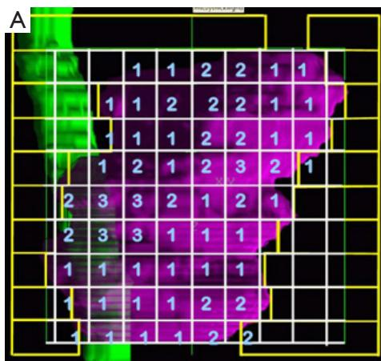

text_image

A
1 1 2 2 1 1
1 1 2 2 2 1 1
1 1 1 2 2 1 1
1 2 1 2 3 2 1
2 3 3 2 1 2 1
2 3 3 1 1 1
1 1 1 1 1 1
1 1 1 1 2 2
1 1 1 1 2 2

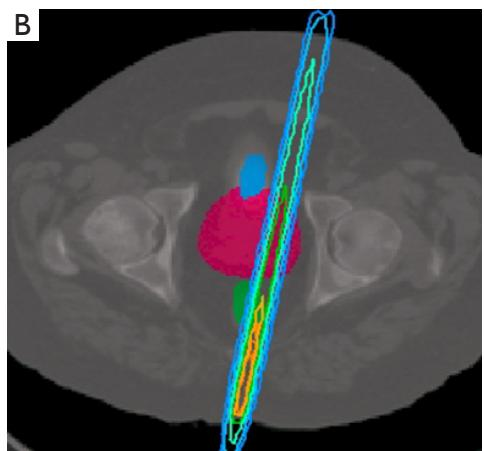

natural_image

Medical scan image showing a cross-sectional view of the pelvic region with color-coded anatomical regions (no text or labels visible)

Figure 1 The fluence map and pencil beam. (A) Illustration of a fluence map of an IMRT field from the beam-eye-view and (B) the dose distribution of a pencil beam through the human body. IMRT, intensity-modulated radiotherapy.

This study was conducted in accordance with the Declaration of Helsinki (as revised in 2013). The ethics committee of the National Cancer Center/Cancer Hospital, Chinese Academy of Medical Sciences and Peking Union Medical College approved this study (No. NCC2018-016). The requirement of written informed consent was waived due to the retrospective design of the study.

# MILP models for the BAO

Below, the MILP model for the BAO of a non-coplanar IMRT plan is formulated.

The objective is defined as follows:

$$
\min _ {\varphi \phi} \left\{ \begin{array}{l} \sum_ {\varphi = 1} ^ {N _ {C}} \sum_ {\phi = 1} ^ {N _ {G}} z ^ {\varphi \phi} + \sum_ {i j k \in V _ {P T V}} H \left(L _ {P T V} - d _ {i j k}\right) + \sum_ {i j k \in V _ {P T V}} H \left(d _ {i j k} - U _ {P T V}\right) \\ + \sum_ {m = 1} ^ {N _ {C O}} \sum_ {i j k \in V _ {C O} ^ {m}} H \left(d _ {i j k} ^ {m} - U _ {C O} ^ {m}\right) + \sum_ {i j k \in V _ {P T V}} H \left(d _ {i j k} - U _ {N T}\right) \end{array} \right\} \tag {[1]}
$$

where $H ( \cdot ) \mathrm { i } s$ the step function and is defined as ( ) H t  =  $H { \big ( } t { \big ) } = { \left\{ \begin{array} { l l } { 0 , t \leq 0 } \\ { t , t \geq 0 } \end{array} \right. } .$

The constraints are defined as follows:

$$
x _ {l s} ^ {\phi \varphi} \geq 0 \tag {2}
$$

$$
d _ {k i j} = \sum_ {\varphi} \sum_ {\phi} \sum_ {l} \sum_ {s} A _ {k i j} ^ {\varphi \phi} x _ {l s} ^ {\varphi \phi} \tag {[3]}
$$

$$
d _ {k i j} \geq L _ {v _ {P T V}}, k i j \in v _ {P T V} \tag {4}
$$

$$
d _ {k i j} \geq U _ {v _ {P T V}}, k i j \in v _ {P T V} \tag {5}
$$

$$
d _ {k i j} \leq U _ {v _ {C O}}, k i j \in v _ {C O} \tag {6}
$$

$$
d _ {k i j} \leq U _ {v _ {N T}}, k i j \in v _ {N T} \tag {7}
$$

$$
I ^ {\varphi \phi} \geq 0 \tag {8}
$$

$$
x _ {l s} ^ {\phi \varphi} \leq I _ {M} b _ {l s} ^ {\phi \varphi} \tag {9}
$$

$$
x _ {l s} ^ {\varphi \phi} \leq I ^ {\varphi \phi} \tag {10}
$$

$$
x _ {l s} ^ {\varphi \phi} \leq I _ {M} \left(- 1 + b _ {l s} ^ {\varphi \phi}\right) + I ^ {\varphi \phi} \tag {11}
$$

$$
b _ {l s} ^ {\phi \varphi} \leq z ^ {\phi \varphi} \tag {12}
$$

$$
z ^ {\varphi \phi} \leq B ^ {\varphi \phi} \tag {13}
$$

The variables are defined as follows:

$z ^ { \phi \varphi }$ : binary variables that indicate the opening/closing of a beam $( \phi - \varphi ) , \varphi \in \big [ 1 , N _ { c } \big ] , \phi \in \big [ 1 , N _ { G } \big ] .$ .

$b _ { l s } ^ { \phi \varphi }$ : b i n a r y v a r i a b l e s t h a t i n d i c a t e t h e o p e n i n g / c l o s i n g o f a b i x e l ( l s ) i n a b e a m $( \phi - \varphi )$ . $\varphi \in [ 1 , N _ { c } ] , \phi \in [ 1 , N _ { G } ] , l \in [ \mathrm { L } _ { l e f t } , \mathrm { L } _ { r i g h t } ] , s \in [ \mathrm { S } _ { l e f t } , \mathrm { S } _ { r i g h t } ] .$

$x _ { l s } ^ { \phi \varphi }$ : t h e f l u e n c e o f a b i x e l ( l s ) a t b e a m $( \phi - \varphi )$ . $\varphi \in [ 1 , N _ { c } ] , \phi \in [ 1 , N _ { G } ] , l \in [ \mathrm { L } _ { l e f t } , \mathrm { L } _ { r i g h t } ] , s \in [ \mathrm { S } _ { l e f t } , \mathrm { S } _ { r i g h t } ] ,$ .

$d _ { k i j } \mathrm { . }$ the dose at voxel (kij), where k is the index of the CT slice, and $i { - } j$ are the pixel’s indexes in the X-Y coordinate on the slice plane.

$I ^ { \varphi \phi }$ : the uniform fluence of a beam $( \phi - \varphi )$ $\varphi \in \big [ 1 , N _ { c } \big ] , \phi \in \big [ 1 , N _ { G } \big ]$

The constants were as follows:

$A _ { k i j } ^ { \phi \varphi }$ : the dose deposition coefficient at voxel (kij) contributed by beam (??-??).

$N _ { c o } \mathrm { : }$ the total number of COs.

$V _ { P T V } , V _ { C O } ^ { m } , V _ { N T } \mathrm { . }$ the volumes of the PTV, m-th $\mathrm { C O } ,$ and NT. m $\in \left[ 1 , N _ { \mathrm { c o } } \right]$ is the index of the CO.

$L _ { \nu _ { P T V } : }$ the minimal dose for the PTV, which is defined as 95% of the prescription dose.

$U _ { \nu _ { P T V } : }$ the maximal dose for the PTV, which is defined as 105% of the prescription dose.

$U _ { \nu _ { c o } : }$ the maximal doses for the $\mathrm { C O s } ,$ which are provided in section “Patient data”.

$U _ { \nu _ { N } ; \ l }$ the maximal dose for the NT, which is provided in section “Patient data”.

$N _ { c } { \mathrm { : } }$ the total number of couch angles, which range from −90° to 90° and are equally spaced at $1 0 ^ { \circ }$ intervals.

$N _ { G } \mathbf { : }$ the total number of gantry angles, which range from −180° to $1 8 0 ^ { \circ }$ and are equally spaced at 10° intervals.

$B ^ { \varphi \phi } \colon$ : the total number of candidate beams (??-??) for a given machine, which are available for patient treatment without safety issue.

$I _ { M } \colon$ the maximal value of uniform fluence for all candidate beams $( \phi { - } \varphi )$ .

The objective function is the total number of beams, and the goal is to determine the least number of beams. Constraints [2,3] require that beam fluence $x _ { l s } ^ { \phi \varphi }$ is nonnegative and meet the equation kij d = ∑∑∑∑ $d _ { \scriptscriptstyle k i j } = \sum \sum \sum \sum \sum A _ { \scriptscriptstyle k i j } ^ { \varphi \phi } x _ { \scriptscriptstyle l s } ^ { \varphi \phi }$ Constraints [4-7] require that the voxel doses in the PTV, CO, and NT meet their tolerance doses. Constraints [8-11] require that the single value of the uniform fluence variable $I ^ { \varphi \phi }$ is non-negative and meet the equation $x _ { l s } ^ { \varphi \phi } = I ^ { \varphi \phi } b _ { l s } ^ { \varphi \phi }$ .It should be noted that the linear Constraints [9-11] are used to replace the nonlinear constraint $x _ { l s } ^ { \varphi \phi } = I ^ { \varphi \phi } b _ { l s } ^ { \varphi \phi }$ . Constraint [12] requires that if a beam is not selected, then its aperture should not be closed. Constraint [13] requires that if a beam is not available, then its beam should not be closed.

Since beam selection in coplanar IMRT planning is mostly used in clinical practice, it was also investigated in this study. Additional constraints are added to force the couch angle to be $0 ^ { \circ }$ as follows:

$$
z ^ {\varphi \phi} = 0, \forall \varphi \neq 0 \tag {14}
$$

Constraint [14] guarantees that if a beam $( \phi - \varphi ) \ d s$ couch angle differs from $0 ^ { \circ }$ , then this beam is closed. The MILP model for the BAO of the non-coplanar IMRT plan is specified by Constraints [1-13]. While the MILP model for the BAO of coplanar IMRT planning is specified by Constraints [1-14]. The optimality of the MILP solution is checked by the gap between the best integer objective and the objective of the best node remaining. If the gap is less than a tolerance, then the optimization is stopped and the feasible solution is found. This tolerance is chosen by the user and is same for all the tested cases. A smaller tolerance value usually results in longer running time and may be unsolvable. If such a situation occurs, the tolerance will be relaxed properly to allow a feasible solution.

# MILP-guided IMRT treatment planning

The BAO problem of the IMRT plan is modeled on a mathematical programming platform (CPLEX, IBM Ilog, Armonk, New York, NY, USA). After the optimal beam angles are solved, the IMRT plan can be created on a commercial planning system (Eclipse, Varian Medical System, Palo Alto, CA, USA) and subsequently the FMO is performed with the built-in optimization engine. Figure 2 illustrates the workflow of MILP-guided IMRT treatment planning, which consists of the following steps:

(I) Contours of regions of interest (ROIs) are exported from the treatment planning system, and the CT images are automatically segmented. To distinguish them, these segmented regions are assigned unique values.   
(II) These segmented CT images are processed by our in-house developed preprocessing software in which dose deposition coefficients and leaf positions of beam apertures are calculated in advance.   
(III) The dose deposition coefficients, leaf positions of

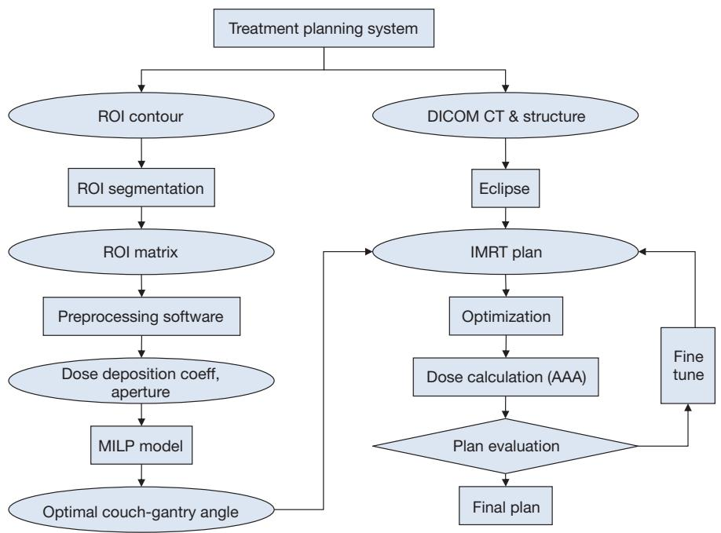

flowchart

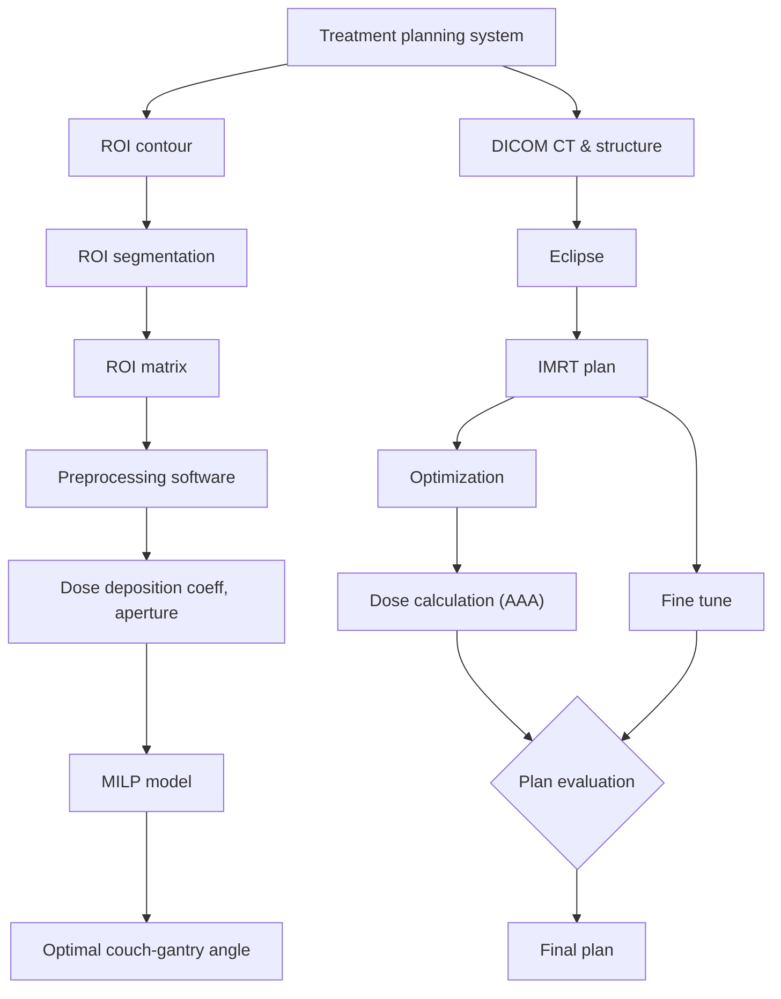

Figure 2 The workflow of MILP-guided IMRT treatment planning. ROI, region of interest; CT, computed tomography; IMRT, intensitymodulated radiotherapy; MILP, mixed-integer linear programming.

beam apertures, and the other relevant parameters are stored in a file specified for the solver of the MILP model.

(IV) After running the MILP solver, the optimal beams are determined, and the IMRT plan with the selected beams is created on a commercial IMRT treatment planning system.   
(V) The FMO is performed under the same sets of dose constraints used in the optimization of the clinically approved IMRT plans.   
(VI) These dose constraints are fine-tuned to maintain a clinically-acceptable dose for PTV and lower doses for COs.   
(VII) The produced IMRT plans are compared to the clinically approved IMRT plans for evaluation.

To solve the proposed MILP models, the CPLEX mixed integer optimizer is used, which is based on a traditional branch-and-cut algorithm. In the algorithm, CPLEX solves a series of continuous relaxation of constraints of the original MILP problem. If the solution to the relaxation of constraints has one or more fractional variables, CPLEX will try to find cuts. Cuts are constraints that cut away areas of the feasible region of the relaxation of constraints that contain fractional solutions. The sub-problems may result in an all-integer solution, an infeasible solution, or another fractional solution. If the solution is fractional, CPLEX repeats the process.

# Evaluations

To compare our MILP model with the other BAO method, the plan geometry optimization (PGO) algorithm was tested in the same clinical plan setting. The PGO algorithm is an integrated tool for beam angle selection in the Eclipse treatment planning system (Varian Medical System, Palo Alto, CA, USA). It selects the suitable beam angles based on the user-defined dose-volume objectives and is designed to be run prior to the Eclipse Dose-Volume Optimization. For both coplanar and non-coplanar IMRT plans, the beams obtained by the MILP model and PGO algorithm are compared.

The IMRT plans of 10 liver cancer patients previously treated at The Cancer Hospital of the Chinese Academy of Medical Sciences were re-planned based on the beam angles obtained by the MILP models. The IMRT plans obtained by the MILP models were also compared with the clinically approved IMRT plans with beam angles selected by human planners. These clinically approved plans consisted of 5–7 coplanar beams with 6 MV. To ensure a fair comparison, the dose-volume constraints used in the clinically approved IMRT plans were also applied to the FMO of the MILP-guided IMRT planning. These dose constraints were fine-tuned during optimization by experienced human planners to maintain a clinically acceptable dose for the PTV and OARs. The plan quality was mainly evaluated by a dose-volume histogram and three-dimensional dose distribution. The paired t-test was used to perform the statistical analysis, and a significance level of P<0.05 (2-tailed) was used.

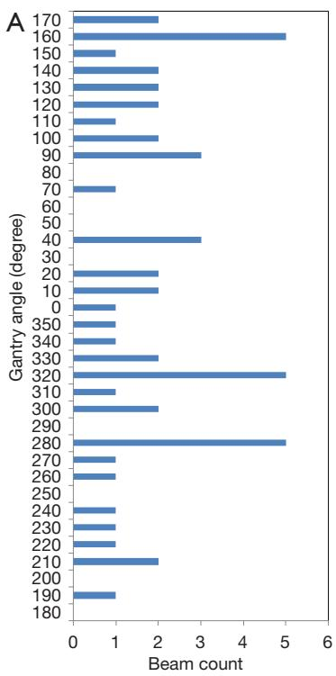

bar

| Gantry angle (degree) | Beam count |
| :--- | :--- |
| 170 | 2 |
| 160 | 5 |
| 150 | 1 |
| 140 | 2 |
| 130 | 2 |
| 120 | 2 |
| 110 | 1 |
| 100 | 2 |
| 90 | 3 |
| 80 | 0 |
| 70 | 1 |
| 60 | 0 |
| 50 | 0 |
| 40 | 3 |
| 30 | 0 |
| 20 | 2 |
| 10 | 2 |
| 0 | 1 |
| 350 | 1 |
| 340 | 1 |
| 330 | 2 |
| 320 | 5 |
| 310 | 1 |
| 300 | 2 |
| 290 | 0 |
| 280 | 5 |
| 270 | 1 |
| 260 | 1 |
| 250 | 0 |
| 240 | 1 |
| 230 | 1 |
| 220 | 1 |
| 210 | 2 |
| 200 | 0 |
| 190 | 1 |
| 180 | 0 |

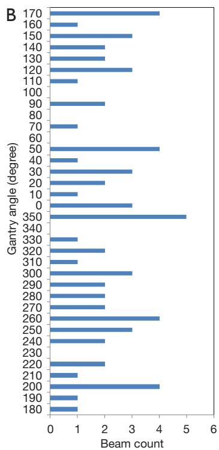

bar

| Gantry angle (degree) | Beam count |
| :--- | :--- |
| 170 | 4 |
| 160 | 1 |
| 150 | 3 |
| 140 | 2 |
| 130 | 2 |
| 120 | 3 |
| 110 | 1 |
| 100 | 0 |
| 90 | 2 |
| 80 | 0 |
| 70 | 1 |
| 60 | 0 |
| 50 | 4 |
| 40 | 1 |
| 30 | 3 |
| 20 | 2 |
| 10 | 1 |
| 0 | 3 |
| 350 | 5 |
| 340 | 0 |
| 330 | 1 |
| 320 | 2 |
| 310 | 1 |
| 300 | 3 |
| 290 | 2 |
| 280 | 2 |
| 270 | 2 |
| 260 | 4 |
| 250 | 3 |
| 240 | 2 |
| 230 | 0 |
| 220 | 2 |
| 210 | 1 |
| 200 | 4 |
| 190 | 1 |
| 180 | 1 |

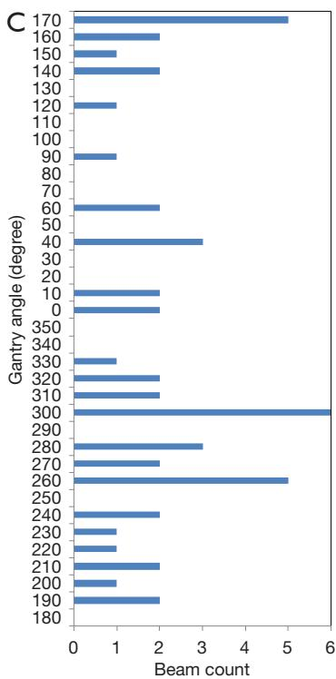

bar

| Gantry angle (degree) | Beam count |
| :--- | :--- |
| 170 | 5 |
| 160 | 2 |
| 150 | 1 |
| 140 | 2 |
| 130 | 0 |
| 120 | 1 |
| 110 | 0 |
| 100 | 0 |
| 90 | 1 |
| 80 | 0 |
| 70 | 0 |
| 60 | 2 |
| 50 | 0 |
| 40 | 3 |
| 30 | 0 |
| 20 | 0 |
| 10 | 2 |
| 0 | 2 |
| 350 | 0 |
| 340 | 0 |
| 330 | 1 |
| 320 | 2 |
| 310 | 2 |
| 300 | 6 |
| 290 | 0 |
| 280 | 3 |
| 270 | 2 |
| 260 | 5 |
| 250 | 0 |
| 240 | 2 |
| 230 | 1 |
| 220 | 1 |
| 210 | 2 |
| 200 | 1 |
| 190 | 0 |
| 180 | 2 |

Figure 3 The beam distributions of the three types of coplanar IMRT plans. (A) The beam distributions of the IMRT plans obtained by the MILP model, (B) PGO algorithm, and (C) human planners. IMRT, intensity-modulated radiotherapy; MILP, mixed-integer linear programming; PGO, plan geometry optimization.

# Results

For the 10 liver cancer patients, the distributions of coplanar beams obtained by the MILP model, PGO algorithm, and human planner are shown in Figure 3A-3C, respectively. The top 5 beam angles obtained by the MILP model were 280°, 320°, 40°, 90°, and 160°. The top 5 beam angles obtained by the PGO algorithm were 200°, 260°, 350°, 50°, and 170°, while those obtained by the human planners were 260°, 280°, 300°, 40°, and 170°. The intersection set between the beams obtained by the MILP model and human planners was {280°, 40°, and 160°/170°}. While the intersection set between the beams obtained by the PGO algorithm and human planners was {260°, 40°/50°, and 170°}, and the intersection set among those beams obtained by the three BAO methods was {40°/50°, 160°/170°}.

The beam distributions of the non-coplanar IMRT plans obtained by the MILP model and PGO algorithm are shown in Figure 4A,4B, respectively. Under each BAO method, the occurrences of each couch-gantry angle combination are counted and the total number of occurrences is represented by a color (blue for 0 occurrences, red for 1 occurrence, green for 2 occurrences, and purple for 3 occurrences) as shown in Figure 4. The top 5 couch-gantry angle combinations obtained by the MILP model were 10°–270°, 30°–290°, 0°–80°, 0°–140°, and 10°–160°, while the combinations obtained by the PGO algorithm were 310°–300°, 10°–310°, 50°–120°, 320°–130°, and 340°–150°. There was no intersection set between the top 5 couch-gantry angle combinations obtained by the two methods. The beams obtained by the MILP model showed uniform distribution of gantry angles and less uniform distribution of couch angles (couch angles of 350°–20° were more frequently used). While the beams obtained by the PGO algorithm showed uniform distribution of both gantry and couch angles. As all clinically approved plans in our study were coplanar IMRT plans, there was no clinically approved non-coplanar IMRT plan for comparison.

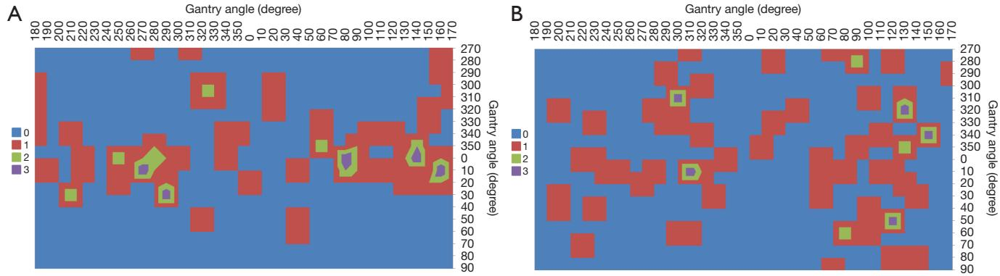  
Figure 4 The beam distributions of the two types of non-coplanar IMRT plans. The beam distributions of the non-coplanar IMRT plans obtained by the (A) MILP model and (B) PGO algorithm. IMRT, intensity-modulated radiotherapy; MILP, mixed-integer linear programming; PGO, plan geometry optimization.

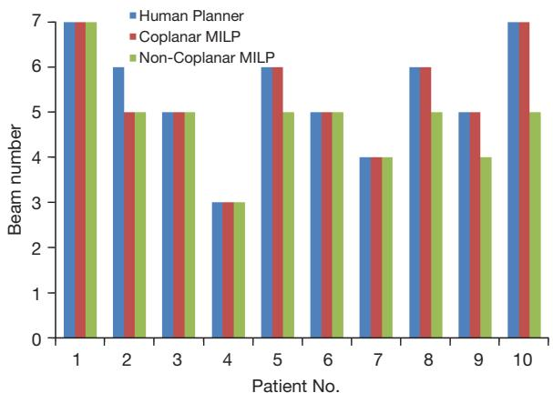

bar

| Patient No. | Human Planner | Coplanar MILP | Non-Coplanar MILP |
| :--- | :--- | :--- | :--- |
| 1 | 7 | 7 | 7 |
| 2 | 6 | 5 | 5 |
| 3 | 5 | 5 | 5 |
| 4 | 3 | 3 | 3 |
| 5 | 6 | 6 | 5 |
| 6 | 5 | 5 | 5 |
| 7 | 4 | 4 | 4 |
| 8 | 6 | 6 | 5 |
| 9 | 5 | 5 | 4 |
| 10 | 7 | 7 | 5 |

Figure 5 The beam number used in the 10 patients’ IMRT plans. MILP, mixed-integer linear programming; IMRT, intensitymodulated radiotherapy.

The numbers of beams used in the 10 patients’ IMRT plans obtained by the three types of BAO methods are shown in Figure 5. Notably, the non-coplanar IMRT plans obtained by the MILP model used the least number of beams.

The average values of the mean doses of the ROIs for the 10 patients’ IMRT plans are shown in Figure 6. The noncoplanar IMRT plans obtained by the MILP model had the best dose quality among the three types of plans, while the coplanar IMRT plans obtained by the MILP model were

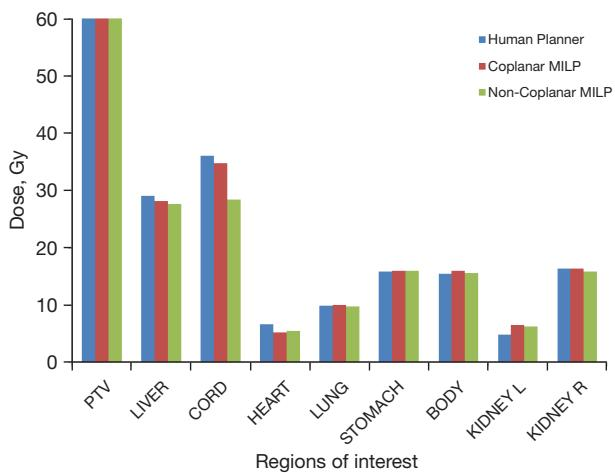

bar

| Regions of interest | Human Planner | Coplanar MILP | Non-Coplanar MILP |
| ------------------- | ------------- | ------------- | ----------------- |
| PTV                 | 60            | 60            | 60                |
| LIVER               | 29            | 28            | 27                |
| CORD                | 36            | 35            | 28                |
| HEART               | 7             | 5             | 5                 |
| LUNG                | 10            | 10            | 10                |
| STOMACH             | 16            | 16            | 16                |
| BODY                | 15            | 16            | 16                |
| KIDNEY L            | 5             | 7             | 6                 |
| KIDNEY R            | 17            | 17            | 16                |

Figure 6 The average of the mean doses of the ROIs for the 10 patients’ IMRT plans. MILP, mixed-integer linear programming; PTV, planning target volume; L, left; R, right; ROI, region of interest; IMRT, intensity-modulated radiotherapy.

secondary.

The mean doses of the ROIs in the 10 liver cancer patients’ IMRT plans are summarized in Table 1. The dose quality of the three IMRT plans for most of the OARs was comparable. Compared with the IMRT plans obtained by the human planners, the doses for the spinal cord (28.5 vs. 36.1, P=0.001<0.05) and liver (27.6 vs. 29.1, P=0.005<0.05) decreased significantly in the non-coplanar IMRT plans obtained by the MILP model. There was a certain dose increase for the left kidney in the coplanar IMRT plans (6.6 vs. 4.9, P=0.002<0.05) and the non-coplanar IMRT plans (6.3 vs. 4.9, P=0.005<0.05) obtained by the MILP models. For the lung, stomach, right kidney and body, the doses were similar across the three types of IMRT plans.

Table 1 The mean doses of the ROIs in the three types of IMRT plans 

<table><tr><td rowspan="2">BAO method</td><td rowspan="2">OARs</td><td colspan="10">Mean dose (Gy)</td></tr><tr><td>1</td><td>2</td><td>3</td><td>4</td><td>5</td><td>6</td><td>7</td><td>8</td><td>9</td><td>10</td></tr><tr><td rowspan="8">Coplanar plans obtained by human planners</td><td>Liver</td><td>34.1</td><td>42.5</td><td>47.9</td><td>18.3</td><td>21.2</td><td>21.5</td><td>15.1</td><td>27</td><td>21.1</td><td>42.6</td></tr><tr><td>Spinal cord</td><td>43.2</td><td>42.7</td><td>45.2</td><td>48.4</td><td>36.4</td><td>23.5</td><td>18.9</td><td>37.9</td><td>20.9</td><td>43.8</td></tr><tr><td>Heart</td><td>9.1</td><td>15.2</td><td>19.1</td><td>4.1</td><td>3.5</td><td>2.7</td><td>1.5</td><td>4.3</td><td>1.1</td><td>6.5</td></tr><tr><td>Lung</td><td>6.3</td><td>11.7</td><td>21</td><td>10.8</td><td>8.7</td><td>2.4</td><td>5.2</td><td>3.3</td><td>17.3</td><td>12.6</td></tr><tr><td>Stomach</td><td>23.2</td><td>36.4</td><td>30</td><td>5.6</td><td>11.4</td><td>7.7</td><td>8.9</td><td>6.8</td><td>2</td><td>26.5</td></tr><tr><td>Body</td><td>16.8</td><td>23.5</td><td>21</td><td>13.5</td><td>12.3</td><td>15.1</td><td>12</td><td>6.9</td><td>12.5</td><td>21.7</td></tr><tr><td>Kidney L</td><td>4.2</td><td>10.1</td><td>1.5</td><td>9.8</td><td>4.2</td><td>1.2</td><td>5.8</td><td>3.5</td><td>0.7</td><td>8.1</td></tr><tr><td>Kidney R</td><td>21.2</td><td>21.9</td><td>20</td><td>14.7</td><td>14</td><td>10.9</td><td>15.4</td><td>1.8</td><td>24.5</td><td>19.1</td></tr><tr><td rowspan="8">Coplanar plans obtained by the MILP model</td><td>Liver</td><td>31.1</td><td>34.4</td><td>48.1</td><td>25.6</td><td>20.7</td><td>21.6</td><td>12.6</td><td>27.8</td><td>18.4</td><td>41.5</td></tr><tr><td>Spinal cord</td><td>42</td><td>59.7</td><td>41.2</td><td>38.6</td><td>34.5</td><td>6.9</td><td>16.2</td><td>42.2</td><td>18.2</td><td>48.4</td></tr><tr><td>Heart</td><td>7.5</td><td>11.7</td><td>12.9</td><td>3.5</td><td>4.6</td><td>1.1</td><td>1.1</td><td>2.1</td><td>1.4</td><td>7.2</td></tr><tr><td>Lung</td><td>7.2</td><td>12.5</td><td>21.5</td><td>11</td><td>6.6</td><td>2.5</td><td>5.4</td><td>3.8</td><td>17.9</td><td>12.5</td></tr><tr><td>Stomach</td><td>20.5</td><td>35.8</td><td>29.7</td><td>6.2</td><td>8.9</td><td>11.1</td><td>13.1</td><td>2.3</td><td>3.1</td><td>29.7</td></tr><tr><td>Body</td><td>16.7</td><td>23.7</td><td>21.3</td><td>11.3</td><td>12.9</td><td>15.9</td><td>14.3</td><td>7.2</td><td>12.4</td><td>24.8</td></tr><tr><td>Kidney L</td><td>3.8</td><td>12.3</td><td>6.2</td><td>7.1</td><td>9.5</td><td>1</td><td>6.6</td><td>3.3</td><td>6.6</td><td>9.4</td></tr><tr><td>Kidney R</td><td>6.7</td><td>29.5</td><td>18.8</td><td>15.2</td><td>14</td><td>5.5</td><td>22.6</td><td>2.1</td><td>29.6</td><td>19.5</td></tr><tr><td rowspan="8">Non-coplanar plans obtained by the MILP model</td><td>Liver</td><td>26.5</td><td>39.7</td><td>42.7</td><td>22.1</td><td>20.1</td><td>16.8</td><td>15.1</td><td>27.8</td><td>24.5</td><td>40.7</td></tr><tr><td>Spinal cord</td><td>49.3</td><td>17.7</td><td>28.3</td><td>41</td><td>28.7</td><td>6.8</td><td>14.5</td><td>32.4</td><td>17.2</td><td>48.9</td></tr><tr><td>Heart</td><td>9.8</td><td>14.1</td><td>15.5</td><td>2.3</td><td>2.9</td><td>0.6</td><td>1.1</td><td>1.6</td><td>1.5</td><td>6</td></tr><tr><td>Lung</td><td>7.6</td><td>13.8</td><td>17</td><td>7</td><td>6.7</td><td>3.2</td><td>6.6</td><td>3.8</td><td>16.3</td><td>16.4</td></tr><tr><td>Stomach</td><td>19.2</td><td>39</td><td>31.2</td><td>11.5</td><td>8.1</td><td>11.4</td><td>3</td><td>5.4</td><td>8.6</td><td>22.4</td></tr><tr><td>Body</td><td>17.2</td><td>22.6</td><td>21.4</td><td>11.2</td><td>12.1</td><td>14.9</td><td>13.4</td><td>6.4</td><td>15.9</td><td>21.6</td></tr><tr><td>Kidney L</td><td>5.6</td><td>14.2</td><td>8.4</td><td>15.4</td><td>0.8</td><td>1</td><td>5.7</td><td>0.3</td><td>10.5</td><td>2.3</td></tr><tr><td>Kidney R</td><td>18.1</td><td>11.1</td><td>13</td><td>10.4</td><td>17.5</td><td>3.6</td><td>20.7</td><td>1.8</td><td>39.6</td><td>22.4</td></tr></table>

ROI, region of interest; IMRT, intensity-modulated radiotherapy; BAO, beam angle optimization; OARs, organs at risk; L, left; R, right; MILP, mixed-integer linear programming.

The DVHs and three-dimensional dose distributions of the three types of IMRT plans for the 10 liver cancer patients were compared. For a typical liver cancer patient, the results of the comparison of the three types of IMRT plans are shown in Figures 7-9. The comparison between the coplanar IMRT plans obtained by the human planners and the MILP model is shown in Figure 7. The low-dose regions of the stomach, liver, and heart were decreased in the IMRT plan obtained by the MILP model. The highdose region of the spinal cord was increased but fell within the tolerance range. The comparison between the coplanar IMRT plan obtained by the human planners and the noncoplanar IMRT plan obtained by the MILP model is shown in Figure 8. The low-dose regions of the stomach and liver were decreased in the IMRT plan obtained by the MILP model. Both the low- and high-dose regions of the spinal cord were increased but fell within the tolerance range. The results of the comparison of the coplanar and non-coplanar IMRT plans obtained by the MILP models is shown in

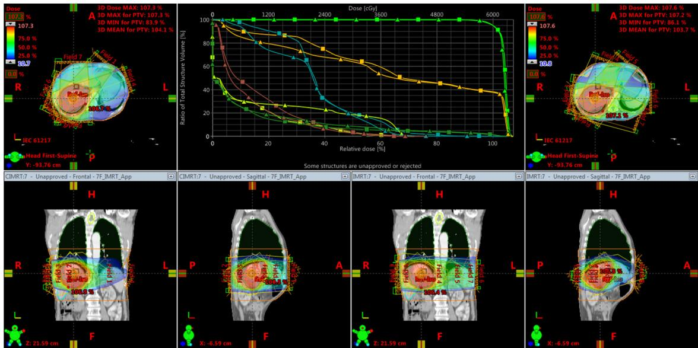  
Figure 7 Comparison between the coplanar IMRT plans obtained by the human planners and the MILP model. 3D, three-dimensional; PTV, planning target volume; R, right; L, left; A, anterior; P, posterior; H, head; F, foot; IEC, international electrotechnical commission; IMRT, intensity-modulated radiotherapy; MILP, mixed-integer linear programming.

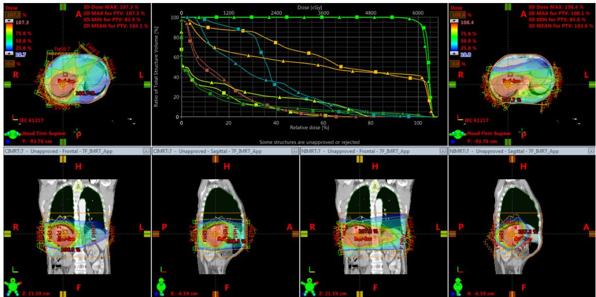  
Figure 8 Comparison between the coplanar IMRT plans obtained by the human planners and the non-coplanar IMRT plans obtained by the MILP model. 3D, three-dimensional; PTV, planning target volume; R, right; L, left; A, anterior; P, posterior; H, head; F, foot; IEC, international electrotechnical commission; IMRT, intensity-modulated radiotherapy; MILP, mixed-integer linear programming.

Figure 9. In the non-coplanar IMRT plan, the low-dose regions of the stomach and liver were decreased, but the low-dose region of the heart was increased. The cord doses were similar in both plans.

The running time for the 10 patients were recorded and are shown in Figure 10. The total time included the time spent creating the root node, and branching and cutting in the optimization. The average running time (mean ± standard deviation) was 11±3 and 43±14 seconds for the MILP model (coplanar beams) with input CT resolutions of 32×32×20 (20 mm × 20 mm × 10 mm) and 64×64×40 (10 mm × 10 mm × 5 mm), respectively. The average running time (mean ± standard deviation) was 34±20 and 214±167 seconds for the MILP model (noncoplanar beams) with input CT resolution of 32×32×20 (20 mm × 20 mm × 10 mm) and 64×64×40 (10 mm × 10 mm × 5 mm), respectively. The model was tested on a DELL T7810 workstation equipped with Intel(R) Xeon(R) CPU E5-2620 V3@ 2.40 GHz (2 processors) and 80 GB of memory (RAM).

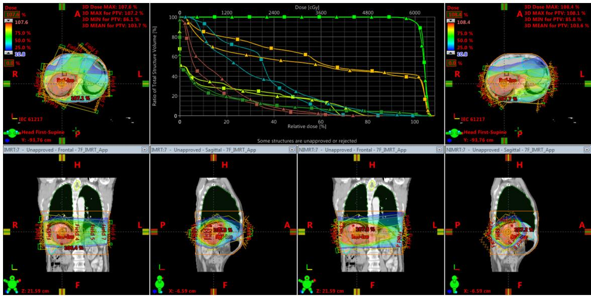  
Figure 9 Comparison between the coplanar and non-coplanar IMRT plans obtained by the MILP models. 3D, three-dimensional; PTV, planning target volume; R, right; L, left; A, anterior; P, posterior; H, head; F, foot; IEC, international electrotechnical commission; IMRT, intensity-modulated radiotherapy; MILP, mixed-integer linear programming.

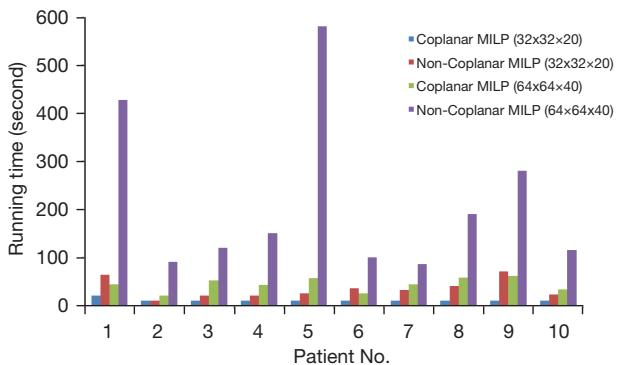

bar

| Patient No. | Coplanar MILP (32x32x20) | Non-Coplanar MILP (32x32x20) | Coplanar MILP (64x64x40) | Non-Coplanar MILP (64x64x40) |
| ----------- | ------------------------ | ---------------------------- | ------------------------ | ---------------------------- |
| 1           | 20                       | 60                           | 40                       | 430                          |
| 2           | 10                       | 10                           | 15                       | 90                           |
| 3           | 10                       | 20                           | 50                       | 120                          |
| 4           | 10                       | 15                           | 40                       | 150                          |
| 5           | 10                       | 20                           | 50                       | 580                          |
| 6           | 10                       | 30                           | 40                       | 100                          |
| 7           | 10                       | 20                           | 40                       | 90                           |
| 8           | 10                       | 40                           | 50                       | 190                          |
| 9           | 10                       | 70                           | 60                       | 280                          |
| 10          | 10                       | 20                           | 30                       | 115                          |

Figure 10 The running time of the MILP models (coplanar and non-coplanar) for 10 patients. MILP, mixed-integer linear programming.

# Discussion

The BAO of non-coplanar IMRT treatment planning represents a large-scale mathematical programming problem. The combinations of couch, gantry, and collimator angles are huge and difficult to resolve in one task. Certain approaches proposed in the literature have accounted for some of these restrictions by either explicitly incorporating them into the treatment plan optimization (13,14) or by modifying the optimized plan into one that satisfies them in a post-processing step (31,36). However, to date, no approach has incorporated all of these constraints explicitly in the FMO of treatment planning. The task needs to be broken into several parts or multiple stages that can be solved separately. In this study, the couch and gantry angles were solved by the MILP model in a deterministic manner, and the other parameters, such as the fluence map parameter, were optimized by FMO provided by a commercial IMRT treatment planning system.

To run a model properly on a personal computer or server, the size of the model data must be controlled; otherwise, it will quickly exhaust the limited memory space. In this study, the CT image (512×512) was down-sampled to the resolution of 32×32 on the plane, and the beam aperture was downsampled to the size of 20×20=400. For a CT volume consisting of 32 slices, the size of the DDC matrix for a single beam was

32×32×32×20×20=13,107,200. For a total of 648 candidate beams (18 couch angles by 36 gantry angles), the size of the DDC matrix was 131,107,200×648=84,957,465,600. It is challenging for most personal computers to store such a huge matrix in memory. The scale of the MILP model is another challenge. For the non-coplanar MILP model, the total number of constraints and variables were 289,716 and 145,969, respectively. For the coplanar model, the total number of constraints and variables were 291,484 and 148,934, respectively. Without the effective handling of the computation resource, searching for a solution would take an enormously long time.

Therefore, there is a trade-off between the precision of the solution and the scale of the problem. For the scale of the problem, it is mainly in proportion with the size of the CT matrix. If the image resolution is increased by a factor of 2, the scale of the problem would increase at least by a factor of 8. In our study, for the input CT resolution 32×32×20 (20 mm × 20 mm × 10 mm), solving the BAO problem of the non-coplanar IMRT planning took 60 seconds. As the input CT resolution was doubled to 64×64×40 (10 mm × 10 mm × 5 mm), the running time was more than 200 seconds. For a few cases, the running time would be about 600 seconds. If the CT resolution was further increased to 128×128×80 (5 mm × 5 mm × 2.5 mm), the running time would be more than a couple of hours. For clinical use, such a running time is not acceptable and prohibited. Therefore, in the current computer setting, the original CT resolution had to be down-sampled to a proper scale to meet the limited capacity of the optimization model. Based on our experiments, CT resolutions of 32×32×20 (20 mm × 20 mm × 10 mm) and 64×64×40 (10 mm × 10 mm × 5 mm) are proper for the optimization of MILP models. These results do not differ significantly from those obtained by a CT resolution of 128×128×80 (5 mm × 5 mm × 2.5 mm).

The constraints for the OARs should be reasonable and feasible in MILP models. For example, ideally, the lower dose constraints on COs would be zero, but this could present an unsolvable problem for a MILP solver. A MILP solver can use tools to relax the constraints that could cause conflicts. However, even with this relaxation, in certain cases, the solution would still not be achievable. In such cases, these constraints must be relaxed further. In another example, the prescribed dose for the PTV cannot be achieved without the enough number of beams. Therefore, the number of beams should not be limited to a small number such as 1–2. The constraints of a MILP model should be carefully selected to avoid the dilemma of infeasible solutions. It is recommended that the model should initially be established with simple and loose constraints. Later, more constraints can be added to the model to tighten the solution space.

Based on the preliminary results of the 10 clinical liver cancer cases, several findings were made. First, the noncoplanar IMRT plans obtained by the MILP model used less beams than the coplanar IMRT plans obtained by the MILP model. This is because the non-coplanar beam is more efficient in delivering a dose in the 4π space (24-26). Second, the beam angles of coplanar IMRT plans obtained by the MILP model shared similar beams to those obtained by human planners. For both sets of top 5 beam angles, only one gantry angle (90°) was not often used by the human planners. Thus, the coplanar MILP model is effective and could be used to automate BAO in treatment planning. Third, the couch angles determined by non-coplanar model were close to 0°. Thus, non-coplanar IMRT plans may not be superior to coplanar IMRT plans in general. For a few complicated cases, non-coplanar IMRT plans are valuable and necessary. In clinical practice, coplanar an IMRT plan is still the first and best choice in terms of the radiotherapy treatment modality.

# Conclusions

A MILP model was developed for the BAO of non-coplanar IMRT treatment planning. Our approach incorporated general dose constraints and specific patient anatomical structures to determine the optimal couch-gantry angles. The preliminary results showed that the MILP model was capable of generating high-quality coplanar and noncoplanar IMRT treatment plans for liver cancer patients. Thus, the MILP model provides a valuable BAO method for the IMRT treatment planning of high-precision radiotherapy.

# Acknowledgments

Funding: This work was supported by research grants from Varian Medical System, the Special Research Fund for Central Universities, Peking Union Medical College, CAMS Innovation Fund for Medical Sciences (CIFMS) (No. 2022-I2M-C&T-B-075); the Beijing Hope Run Special Fund of Cancer Foundation of China (No. LC2021B01); the National Natural Science Foundation of China (No. 11975312); Beijing Municipal Natural Science Foundation (No. 7202170); Joint Funds for the Innovation of Science and Technology, Fujian Province (No. 2023Y9442); and the Fujian Provincial Health Technology Project (No. 2023GGA052).

# Footnote

Conflicts of Interest: All authors have completed the ICMJE uniform disclosure form (available at https://qims. amegroups.com/article/view/10.21037/qims-24-296/coif). The authors have no conflicts of interest to declare.

Ethical Statement: The authors are accountable for all aspects of the work in ensuring that questions related to the accuracy or integrity of any part of the work are appropriately investigated and resolved. This study was conducted in accordance with the Declaration of Helsinki (as revised in 2013). The ethics committee of the National Cancer Center/Cancer Hospital, Chinese Academy of Medical Sciences and Peking Union Medical College approved this study (No. NCC2018-016). The requirement of written informed consent was waived due to the retrospective design of the study.

Open Access Statement: This is an Open Access article distributed in accordance with the Creative Commons Attribution-NonCommercial-NoDerivs 4.0 International License (CC BY-NC-ND 4.0), which permits the noncommercial replication and distribution of the article with the strict proviso that no changes or edits are made and the original work is properly cited (including links to both the formal publication through the relevant DOI and the license). See: https://creativecommons.org/licenses/by-nc-nd/4.0/.

# References

1. Bortfeld T, Schlegel W. Optimization of beam orientations in radiation therapy: some theoretical considerations. Phys Med Biol 1993;38:291-304.   
2. Crooks SM, Pugachev A, King C, Xing L. Examination of the effect of increasing the number of radiation beams on a radiation treatment plan. Phys Med Biol 2002;47:3485-501.   
3. Potrebko PS, McCurdy BM, Butler JB, El-Gubtan AS. Improving intensity-modulated radiation therapy using the anatomic beam orientation optimization algorithm. Med Phys 2008;35:2170-9.   
4. Djajaputra D, Wu Q, Wu Y, Mohan R. Algorithm and performance of a clinical IMRT beam-angle optimization

system. Phys Med Biol 2003;48:3191-212.   
5. Chuang KS, Chen TJ, Kuo SC, Jan ML, Hwang IM, Chen S, Lin YC, Wu J. Determination of beam intensity in a single step for IMRT inverse planning. Phys Med Biol 2003;48:293-306.   
6. Das IJ, Cheng EC, Anderson PR, Movsas B. Optimum beam angles for the conformal treatment of lung cancer: a CT simulation study. Int J Cancer 2000;90:359-65.   
7. Rowbottom CG, Webb S, Oldham M. Improvements in prostate radiotherapy from the customization of beam directions. Med Phys 1998;25:1171-9.   
8. Das S, Cullip T, Tracton G, Chang S, Marks L, Anscher M, Rosenman J. Beam orientation selection for intensitymodulated radiation therapy based on target equivalent uniform dose maximization. Int J Radiat Oncol Biol Phys 2003;55:215-24.   
9. Das SK, Marks LB. Selection of coplanar or noncoplanar beams using three-dimensional optimization based on maximum beam separation and minimized nontarget irradiation. Int J Radiat Oncol Biol Phys 1997;38:643-55.   
10. Saher A, Sultan A. Optimization of beam orientations in intensity modulated radiation therapy planning. Technische Universität Kaiserslautern, 2006.   
11. Yan H, Dai JR. Intelligence-guided beam angle optimization in treatment planning of intensity-modulated radiation therapy. Phys Med 2016;32:1292-301.   
12. Wang X, Zhang X, Dong L, Liu H, Wu Q, Mohan R. Development of methods for beam angle optimization for IMRT using an accelerated exhaustive search strategy. Int J Radiat Oncol Biol Phys 2004;60:1325-37.   
13. Bangert M, Ziegenhein P, Oelfke U. Comparison of beam angle selection strategies for intracranial IMRT. Med Phys 2013;40:011716.   
14. Liu H, Dong P, Xing L. A new sparse optimization scheme for simultaneous beam angle and fluence map optimization in radiotherapy planning. Phys Med Biol 2017;62:6428-45.   
15. Bangert M, Unkelbach J. Accelerated iterative beam angle selection in IMRT. Med Phys 2016;43:1073-82.   
16. Pugachev AB, Boyer AL, Xing L. Beam orientation optimization in intensity-modulated radiation treatment planning. Med Phys 2000;27:1238-45.   
17. Rowbottom CG, Khoo VS, Webb S. Simultaneous optimization of beam orientations and beam weights in conformal radiotherapy. Med Phys 2001;28:1696-702.   
18. Stein J, Mohan R, Wang XH, Bortfeld T, Wu Q, Preiser K, Ling CC, Schlegel W. Number and orientations of beams in intensity-modulated radiation treatments. Med Phys 1997;24:149-60.

19. Haas OC, Burnham KJ, Mills JA. Optimization of beam orientation in radiotherapy using planar geometry. Phys Med Biol 1998;43:2179-93.   
20. Lei J, Li Y. An approaching genetic algorithm for automatic beam angle selection in IMRT planning. Comput Methods Programs Biomed 2009;93:257-65.   
21. Amit G, Purdie TG, Levinshtein A, Hope AJ, Lindsay P, Marshall A, Jaffray DA, Pekar V. Automatic learningbased beam angle selection for thoracic IMRT. Med Phys 2015;42:1992-2005.   
22. Kaderka R, Liu KC, Liu L, VanderStraeten R, Liu TL, Lee KM, Tu YE, MacEwan I, Simpson D, Urbanic J, Chang C. Toward automatic beam angle selection for pencil-beam scanning proton liver treatments: A deep learning-based approach. Med Phys 2022;49:4293-304.   
23. Wild E, Bangert M, Nill S, Oelfke U. Noncoplanar VMAT for nasopharyngeal tumors: Plan quality versus treatment time. Med Phys 2015;42:2157-68.   
24. Dong P, Lee P, Ruan D, Long T, Romeijn E, Yang Y, Low D, Kupelian P, Sheng K. 4π non-coplanar liver SBRT: a novel delivery technique. Int J Radiat Oncol Biol Phys 2013;85:1360-6.   
25. Dong P, Lee P, Ruan D, Long T, Romeijn E, Low DA, Kupelian P, Abraham J, Yang Y, Sheng K. 4π noncoplanar stereotactic body radiation therapy for centrally located or larger lung tumors. Int J Radiat Oncol Biol Phys 2013;86:407-13.   
26. Rwigema JC, Nguyen D, Heron DE, Chen AM, Lee P, Wang PC, Vargo JA, Low DA, Huq MS, Tenn S, Steinberg ML, Kupelian P, Sheng K. 4π noncoplanar stereotactic body radiation therapy for head-and-neck cancer: potential to improve tumor control and late toxicity. Int J Radiat Oncol Biol Phys 2015;91:401-9.   
27. D'Souza WD, Zhang HH, Nazareth DP, Shi L, Meyer RR. A nested partitions framework for beam angle optimization in intensity-modulated radiation therapy.

Cite this article as: Huang P, Shang J, Xie X, Hu Z, Liu Z, Yan H. Applying mixed-integer linear programming to the non-coplanar beam angle optimization of intensity-modulated radiotherapy for liver cancer. Quant Imaging Med Surg 2024;14(8):5789-5802. doi: 10.21037/qims-24-296

Phys Med Biol 2008;53:3293-307.   
28. Romeijn HE, Ahuja RK, Dempsey JF, Kumar A. A column generation approach to radiation therapy treatment planning using aperture modulation. SIAM J Optim 2005;15:838-62.   
29. Men C, Romeijn HE, Jia X, Jiang SB. Ultrafast treatment plan optimization for volumetric modulated arc therapy (VMAT). Med Phys 2010;37:5787-91.   
30. Peng F, Jia X, Gu X, Epelman MA, Romeijn HE, Jiang SB. A new column-generation-based algorithm for VMAT treatment plan optimization. Phys Med Biol 2012;57:4569-88.   
31. D'Souza WD, Meyer RR, Shi L. Selection of beam orientations in intensity-modulated radiation therapy using single-beam indices and integer programming. Phys Med Biol 2004;49:3465-81.   
32. Wang C, Dai J, Hu Y. Optimization of beam orientations and beam weights for conformal radiotherapy using mixed integer programming. Phys Med Biol 2003;48:4065-76.   
33. Yang R, Dai J, Yang Y, Hu Y. Beam orientation optimization for intensity-modulated radiation therapy using mixed integer programming. Phys Med Biol 2006;51:3653-66.   
34. Lee EK, Fox T, Crocker I. Simultaneous beam geometry and intensity map optimization in intensity-modulated radiation therapy. Int J Radiat Oncol Biol Phys 2006;64:301-20.   
35. Ferris MC, Meyer RR, D'Souza D. Radiation Treatment Planning: Mixed Integer Programming Formulations and Approaches. In: Appa G, Pitsoulis L, Williams HP. editors. Handbook on Modelling for Discrete Optimization. International Series in Operations Research & Management Science, Springer, Boston, MA, 2006;88:317-40.   
36. Gözbasi H, Optimization approaches for planning external beam radiotherapy. Georgia Institute of Technology, 2010.