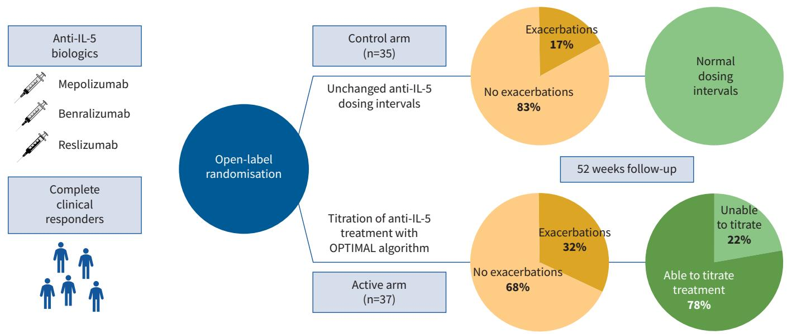
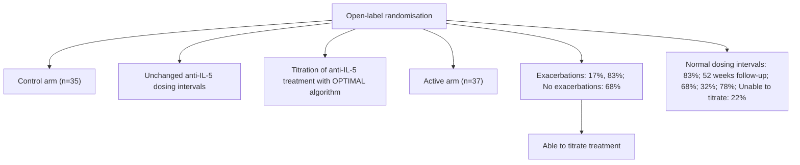
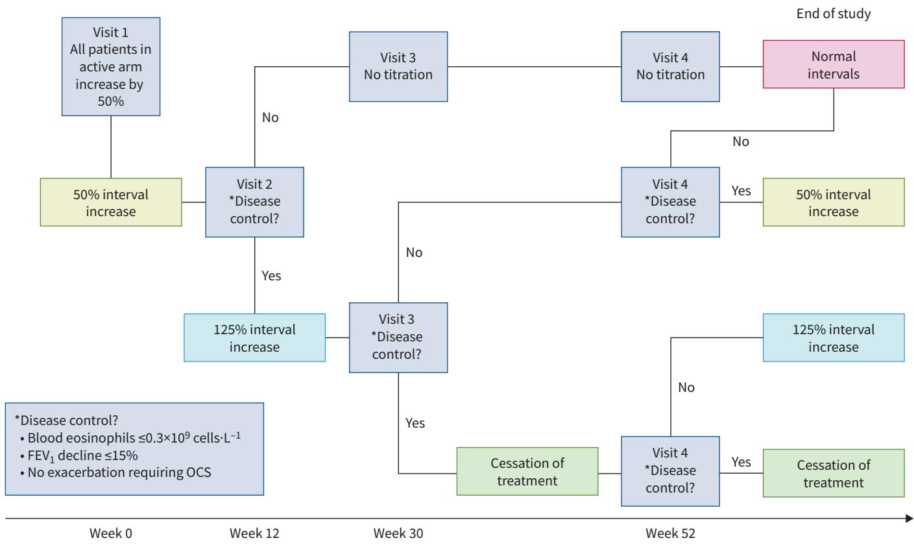
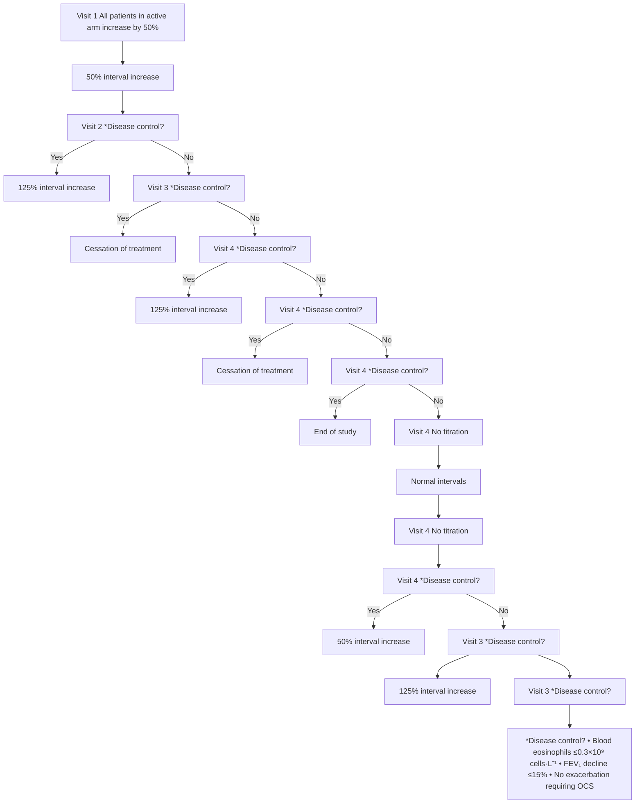
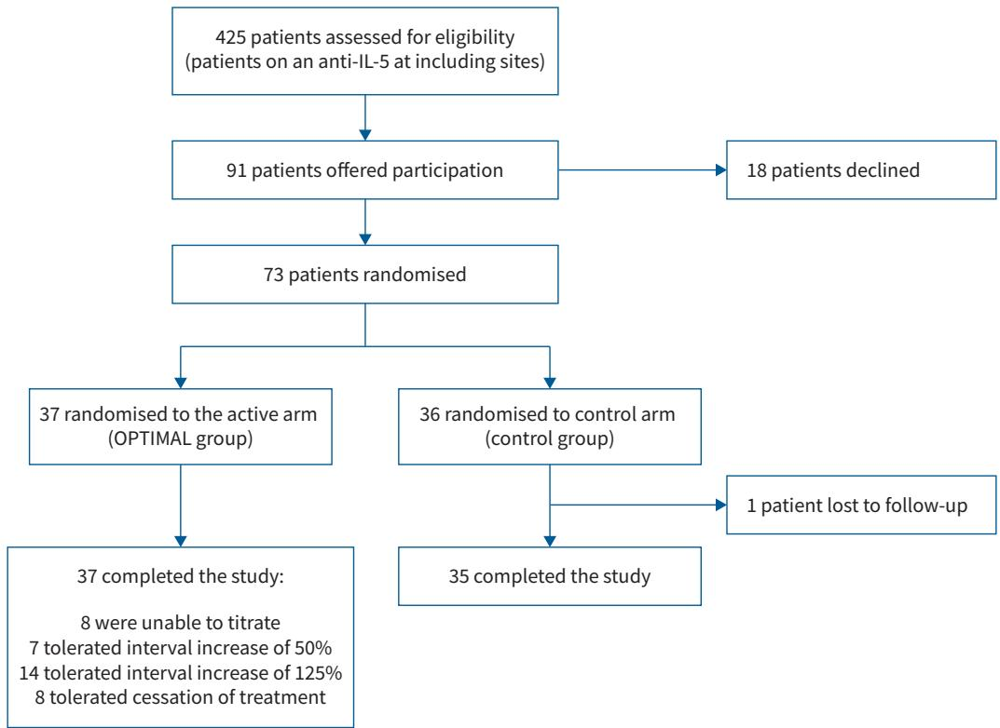
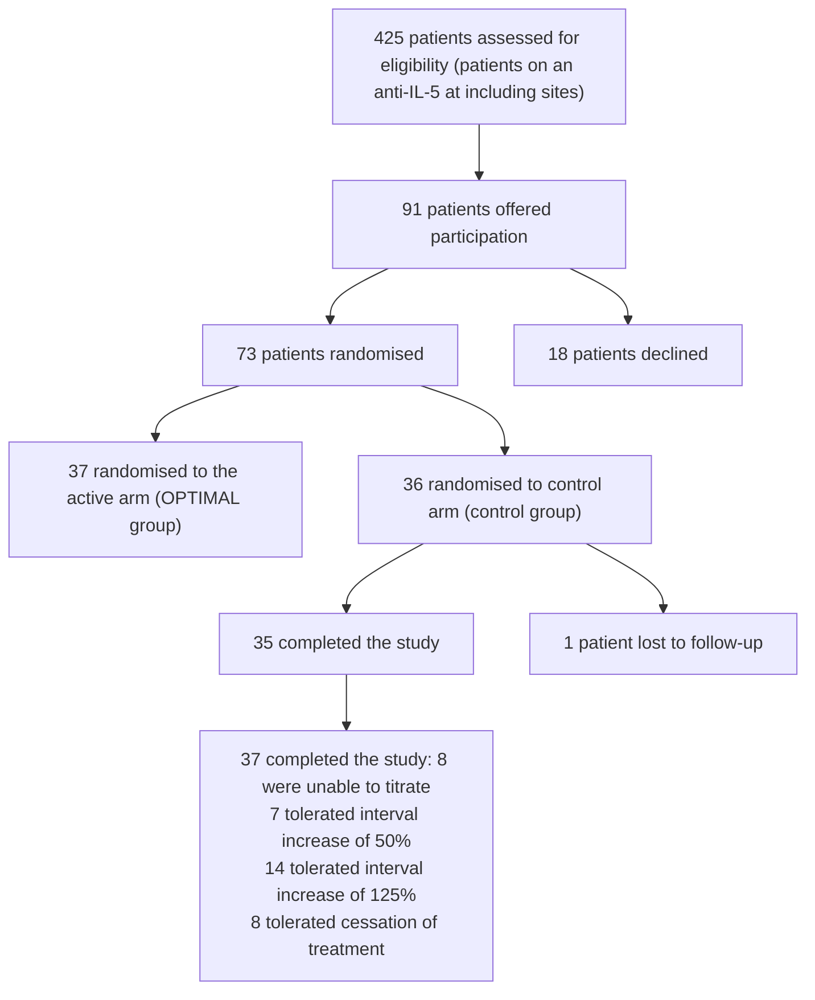
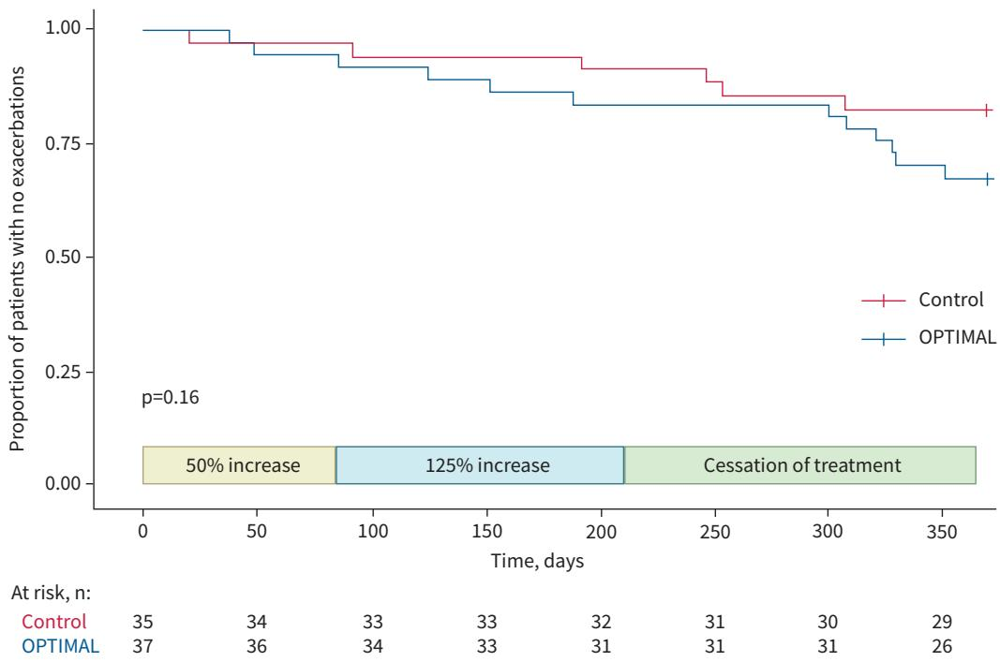
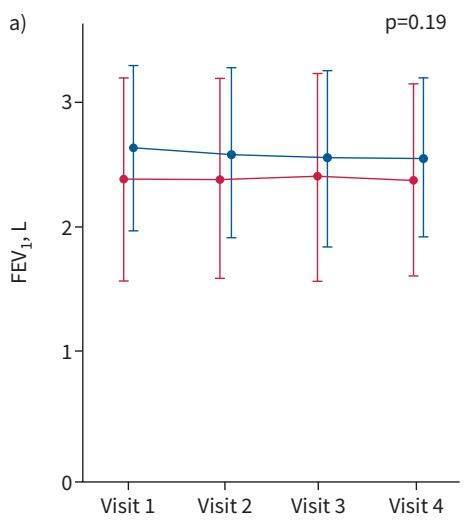
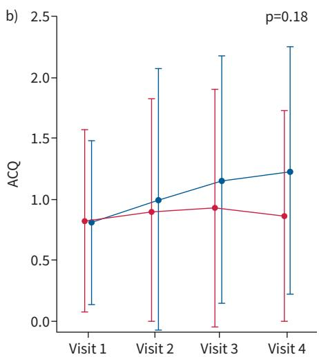
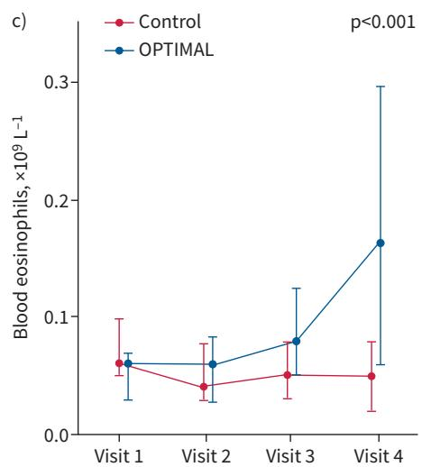

# Titration of anti-IL-5 biologics in severe asthma: an open-label randomised controlled trial (the OPTIMAL study)

Marianne Baastrup Soendergaard , Anne-Sofie Bjerrum, Linda Makowska Rasmussen, Sofie Lock-Johansson, Ole Hilberg , Susanne Hansen , Anna von Bulow and Celeste Porsbjerg

The OPTIMAL study   

flowchart

GRAPHICAL ABSTRACT Overview of the OPTIMAL study. IL: interleukin.

# Titration of anti-IL-5 biologics in severe asthma: an open-label randomised controlled trial (the OPTIMAL study)

Marianne Baastrup Soendergaard 1 , Anne-Sofie Bjerrum2 , Linda Makowska Rasmussen3 , Sofie Lock-Johansson4 , Ole Hilberg 5 , Susanne Hansen 1,6, Anna von Bulow1 and Celeste Porsbjerg1

1 Department of Respiratory Medicine, Copenhagen University Hospital – Bispebjerg, Copenhagen, Denmark. 2 Department of Respiratory Diseases and Allergy, Aarhus University Hospital, Aarhus, Denmark. 3 Allergy Clinic, Gentofte University Hospital, Hellerup, Denmark. 4 Department of Respiratory Medicine, Odense University Hospital, Odense, Denmark. 5 Department of Respiratory Medicine, Sygehus Lillebaelt – Vejle Sygehus, Vejle, Denmark. 6 Centre for Clinical Research and Prevention, Frederiksberg Hospital, Copenhagen, Denmark.

Corresponding author: Marianne Baastrup Soendergaard (marianne.baastrup.soendergaard@regionh.dk)

<table><tr><td rowspan="2"></td><td>Shareable abstract (@ERSpublications)Titration of anti-IL-5 biologics is possible in most patients with severe asthma who have achieved clinical control on biological treatment. Further studies are needed to optimise titration strategies and determine the long-term prognosis of titration. https://bit.ly/4awOzar</td></tr><tr><td>Cite this article as: Soendergaard MB, Bjerrum A-S, Rasmussen LM, et al. Titration of anti-IL-5 biologics in severe asthma: an open-label randomised controlled trial (the OPTIMAL study). Eur Respir J 2024; 64: 2400404 [DOI: 10.1183/13993003.00404-2024].</td></tr></table>

Copyright ©The authors 2024.

This version is distributed under the terms of the Creative Commons Attribution Non-Commercial Licence 4.0. For commercial reproduction rights and permissions contact permissions@ersnet.org

This article has an editorial commentary: https://doi.org/10.1183/ 13993003.01168-2024

Received: 27 Feb 2024 Accepted: 14 May 2024

# Abstract

Background Anti-interleukin (IL)-5 biologics effectively reduce exacerbations and the need for maintenance oral corticosteroids (mOCS) in severe eosinophilic asthma. However, it is unknown how long anti-IL-5 treatment should be continued. Data from clinical trials indicate a gradual but variable loss of control after treatment cessation. In this pilot study of titration, we evaluated a dose-titration algorithm in patients who had achieved clinical control on an anti-IL-5 biologic.

Methods In this open-label randomised controlled trial conducted over 52 weeks, patients with clinical control (no exacerbations or mOCS) on anti-IL-5 treatment were randomised to continue with unchanged intervals or have dosing intervals adjusted according to a titration algorithm that gradually extended dosing intervals and reduced them again at signs of loss of disease control. The OPTIMAL algorithm was designed to down-titrate dosing until signs of loss of control, to enable assessment of the longest dosing interval possible.

Results Among 73 patients enrolled, 37 patients were randomised to the OPTIMAL titration arm; 78% of patients tolerated down-titration of treatment. Compared to the control arm, the OPTIMAL arm tended to have more exacerbations during the study (32% 17%; p=0.13). There were no severe adverse events versusrelated to titration, and lung function and symptoms scores remained stable and comparable in both study arms throughout.

Conclusion This study serves as a proof of concept for titration of anti-IL-5 biologics in patients with severe asthma with clinical control on treatment, and the OPTIMAL algorithm provides a potential framework for individualising dosing intervals in the future.

# Introduction

The treatment of severe eosinophilic asthma has been revolutionised with the introduction of anti-interleukin (IL)-5 biological treatment. Anti-IL-5 biologics include mepolizumab, benralizumab and reslizumab, all of which target the IL-5 pathway; regulatory randomised controlled trials (RCTs) have shown that they are efficient in reducing exacerbation rates and the need for maintenance oral corticosteroids (mOCS) [1–6]. Real-life results from the use of anti-IL-5 biologics suggest that they have exceeded the expectations set by RCTs. Data from the nationwide Danish Severe Asthma Register (DSAR) showed that 58% of patients achieved a complete response with complete abrogation of the outcomes that set the indication for treatment: exacerbations and need for mOCS [7].

Anti-IL-5 biologics are considered safe and efficient long term [8–15]; however, they are costly, and it is unknown how long patients should continue treatment. Most patients return to the baseline level of blood eosinophils and exacerbations 3–6 months after stopping mepolizumab [16–18]. Results from the COMET study, in which patients were randomised to either continue mepolizumab or switch to placebo, demonstrated an increased risk of exacerbation in the placebo group 16 weeks after the final dose of mepolizumab [18]. It seems that sudden cessation of treatment may lead to loss of disease control after a few months, suggesting that gradual down-titration may be a more appropriate approach to evaluate whether patients can reduce or stop treatment. In rheumatology, where biological treatments have been available far longer than in respiratory medicine, down-titration of biological treatment after stabilisation of disease is the standard treatment strategy [19] and most patients with rheumatoid arthritis tolerate down-titration of their biological treatment [20]. A small observational study of patients with severe asthma well controlled on mepolizumab showed that dose extension up to 8 weeks was well tolerated, with no exacerbations or loss of lung function [21]. However, further down-titration or up-titration in case of loss of disease control was not examined. We hypothesised that by using a dose-titration algorithm, dosing could be individualised to the lowest required level by tapering biological treatment until signs of loss of disease control and subsequently escalating treatment again.

To conduct this pilot study on the titration of anti-IL-5 biologics in patients with clinical control on treatment, we proposed the OPTIMAL titration algorithm, that adjusts the dosing intervals of anti-IL-5 biologics, based on blood eosinophils, lung function and exacerbations. To evaluate this method of titration of anti-IL-5 biologics, we conducted an open-label RCT using a non-inferiority approach to compare the OPTIMAL titration algorithm against unaltered regular dosing intervals in a population of severe asthma patients with clinical control on an anti-IL-5 biologic.

# Methods

# Study design

OPTIMAL is a randomised, controlled, multicentre clinical trial. The study was conducted at five centres in Denmark: Bispebjerg University Hospital in Copenhagen, Gentofte University Hospital in Copenhagen, Odense University Hospital in Odense, Sygehus Lillebaelt in Vejle and Aarhus University Hospital in Aarhus. After providing written informed consent, patients were randomised 1:1  RedCAP to the active viaarm and control arm stratified by the type of anti-IL-5. The active arm had their dosing of anti-IL-5 adjusted using the OPTIMAL algorithm and the control arm continued with normal dosing throughout the study. The study was open label, and the allocated groups were open to both the patients and investigators. Upon entering the study, all patients not already on high-dose inhaled corticosteroids (ICS) ( had ICS i.e.reduced while on a biologic) had ICS treatment adjusted so that they were on high-dose ICS according to the European Respiratory Society/American Thoracic Society guidelines [22].

The OPTIMAL study was approved by the National Ethics Committee (H-20052529) and the Danish Medicines Agency (2020-003358-63) and monitored by the Danish Good Clinical Practice Unit. The OPTIMAL study was registered at ClinicalTrials.gov (NCT04648761).

# Study population

Eligible patients were adults aged >18 years who had received anti-IL-5 biological treatment (mepolizumab, benralizumab or reslizumab) for at least 12 months. Patients eligible for this study had to be free from exacerbations and need for mOCS 12 months before inclusion, and blood eosinophils had to be ⩽0.3×109 cells·L−1 . There were no requirements on lung function or symptoms scores as these are not significantly improved by anti-IL-5 biologics when compared to placebo [4–6, 23]; hence, they are not part of the criteria for commencing a biologic.

# OPTIMAL algorithm

The OPTIMAL algorithm was designed as a tool to determine the optimal dosage of anti-IL-5 for individual patients by adjusting the intervals between the administration of treatments (figure 1). The dose remained the same at each administration; however, intervals were prolonged (down-titration) when there were no signs of loss of disease control and shortened again (up-titration) if there were signs of loss of disease control. Intervals were prolonged by 50% from normal at first and, if well tolerated, then by a further 50% from the first interval increase, 125% from normal intervals. If intervals prolonged by i.e.125% were well tolerated, the patient entered a trial period with cessation of treatment. This meant that patients on mepolizumab or reslizumab first had dosing intervals increased to 6 weeks and then to 9 weeks before possible cessation, and patients on benralizumab first had dosing intervals increased to 12 weeks and then to 18 weeks before possible cessation. We defined signs of loss of disease control as either 1) a reduction in FEV ⩾15% from baseline, 2) blood eosinophils ⩾0.3×109 cells·L−1 or 3) an exacerbation requiring OCS. These criteria most likely indicate a surge in inflammation that would otherwise be controlled by anti-IL-5 treatment. If one or more of the three occurred, the intervals were shortened to the previous step and no further down-titration was attempted.

flowchart

FIGURE 1 The OPTIMAL titration algorithm with assessment of titration ability over 52 weeks. FEV1: forced expiratory volume in 1 s; OCS: oral corticosteroids.

# Visits

Patients were followed for 52 weeks, with four scheduled visits. In case of asthma worsening, an extra visit was scheduled if possible. Visit 1 (baseline, week 0) was scheduled on the day the patient had their anti-IL-5 biologic administered. Visit 2 was scheduled at week 12, visit 3 at week 30 and visit 4 (end of the study) at week 52. The timing of the visits was designed such that they fit the administration times for the biologics in the prolonged interval progression according to the OPTIMAL algorithm. All patients randomised to the active arm had their intervals prolonged by 50% at visit 1 and then had intervals adjusted according to the OPTIMAL algorithm at the following visits, including any extra visits. At visit 4, patients in the active arm were assigned a final treatment interval according to the OPTIMAL algorithm. Patients in the control arm attended the same visits as patients in the active arm.

# Statistical analyses

The OPTIMAL study was designed as a non-inferiority trial with the proportion of patients experiencing exacerbations in each randomised group as the primary outcome. We estimated a risk of exacerbation of approximately 30% in both the OPTIMAL and control groups, and originally chose a non-inferiority limit of 20%. Owing to difficulty in recruiting patients, an unscheduled interim analysis of the first 34 patients to complete the study was performed, and the non-inferiority limit was increased to 25%. With power set at 80% and a significance level of 5% and the risk of exacerbations in each group at the time of the interim analysis (31% and 33%, respectively), we needed to include 37 patients in each group to show non-inferiority.

The baseline characteristics of the two randomised groups and the final assigned treatment interval in the active arm were compared using descriptive statistics. No assumptions were made regarding missing values. For categorical variables, we applied the Chi-squared test or Fisher’s exact test when there were five or fewer patients in a group. For continuous variables, we used the t-test for parametric data and the

Mann–Whitney U-test for non-parametric data. Changes in forced expiratory volume in 1 s (FEV1), blood eosinophils and Asthma Control Questionnaire (ACQ) over time between groups were analysed using a mixed model including randomised group and visit with an unstructured covariance. To test the significance of the randomised group on the outcomes, we applied an ANOVA test to the models. These models were employed to account for potential within-subject correlations due to repeated measurements over time. Log-transformation was applied to blood eosinophil counts. We used Kaplan–Meier analysis to compare the time to the first exacerbation between the two groups. To identify predictors of titration ability, we evaluated univariate factors with a p-value <0.20 using a multivariate logistic regression model adjusted for age and sex.

All data analyses and statistical procedures were performed using R version 4.3.0 (www.r-project.org).

# Results

Between 13 January 2021 and 27 September 2022, 73 patients were randomised to either have intervals between the administration of their anti-IL-5 biologic controlled by the OPTIMAL algorithm (active arm) or to continue with unchanged intervals (control arm). 37 patients were randomised to the active arm and 36 to the control arm (figure 2 and table 1). One patient was lost to follow-up after the first visit; therefore, 72 patients were included in the analyses. Most patients in both arms remained free from exacerbations; however, in the active arm, 12 patients (32%) experienced an exacerbation, while in the control arm, six patients (17%) experienced an exacerbation ( p=0.13). None of the exacerbations that occurred during the study required hospitalisation.

At the end of the trial, most patients had tolerated down-titration: eight of the 37 patients (22%) in the active arm were able to completely come off their anti-IL-5 biologic according to the OPTIMAL algorithm. At the final visit, 22 weeks after their last dose of anti-IL-5, they still had no exacerbations, no FEV decline and blood eosinophils were <0.3×109 cells·L−1 . 14 patients (38%) tolerated intervals increased by 125% and seven patients (18%) tolerated intervals increased by 50%. The remaining eight patients (22%) in the active arm were unable to titrate their anti-IL-5 biologic according to the OPTIMAL algorithm.

Kaplan–Meier analysis of time to first exacerbation revealed no significant difference between the active and control arms (p=0.16) (figure 3). We observed no significant difference in ACQ or FEV between the

flowchart

FIGURE 2 Flowchart of patients in the OPTIMAL study. IL: interleukin.

TABLE 1 Baseline characteristics 

<table><tr><td></td><td>OPTIMAL (n=37)</td><td>Control (n=35)</td><td>p-value</td></tr><tr><td>Age, years</td><td>61±10</td><td>59±13</td><td>0.65</td></tr><tr><td>Female</td><td>13 (35)</td><td>15 (43)</td><td>0.66</td></tr><tr><td>BMI, kg·m-2</td><td>27.9±5.8</td><td>28.1±6.9</td><td>0.91</td></tr><tr><td>Duration of disease, years</td><td>19±15</td><td>27±22</td><td>0.08</td></tr><tr><td>Duration of disease &gt;10 years</td><td>21 (57)</td><td>21 (60)</td><td>0.83</td></tr><tr><td>Age at onset, years</td><td>41±17</td><td>32±24</td><td>0.10</td></tr><tr><td>Onset during childhood ≤18 years</td><td>3 (8)</td><td>15 (43)</td><td>0.001</td></tr><tr><td>Late onset ≥40 years</td><td>21 (57)</td><td>14 (40)</td><td>0.28</td></tr><tr><td>Exacerbations in year before biologic, n</td><td>2.97±2.1</td><td>3.03±2.7</td><td>0.91</td></tr><tr><td>ACQ</td><td>0.80±0.67</td><td>0.82±0.75</td><td>0.91</td></tr><tr><td>FEV1, L</td><td>2.62±0.65</td><td>2.37±0.81</td><td>0.15</td></tr><tr><td>FEV1, % pred</td><td>80±16</td><td>75±18</td><td>0.15</td></tr><tr><td>FEV1/FVC</td><td>0.66±0.08</td><td>0.65±0.12</td><td>0.84</td></tr><tr><td>Budesonide equivalent dose, μg</td><td>1600 (1600–1600)</td><td>1600 (1600–1600)</td><td>0.35</td></tr><tr><td>LABA</td><td>34 (92)</td><td>32 (91)</td><td>1</td></tr><tr><td>LAMA</td><td>14 (38)</td><td>15 (43)</td><td>0.81</td></tr><tr><td>LTRA</td><td>10 (27)</td><td>17 (49)</td><td>0.09</td></tr><tr><td>mOCS before biologic</td><td>16 (43)</td><td>14 (40)</td><td>0.57</td></tr><tr><td>Biologic</td><td></td><td></td><td>0.58</td></tr><tr><td>Mepolizumab</td><td>29 (78)</td><td>27 (77)</td><td></td></tr><tr><td>Reslizumab</td><td>0 (0)</td><td>1 (3)</td><td></td></tr><tr><td>Benralizumab</td><td>8 (22)</td><td>7 (20)</td><td></td></tr><tr><td>Switch from another biologic</td><td>5 (14)</td><td>3 (9)</td><td>0.77</td></tr><tr><td>Time on biologic, weeks</td><td>146.7±46.3</td><td>161.3±56.2</td><td>0.22</td></tr><tr><td>Blood eosinophils at baseline, ×109L-1</td><td>0.06 (0.03–0.07)</td><td>0.06 (0.05–0.1)</td><td>0.34</td></tr><tr><td>Blood eosinophils before anti-IL-5, ×109L-1</td><td>0.49 (0.35–0.97)</td><td>0.46 (0.32–0.67)</td><td>0.52</td></tr><tr><td>IgE, IU·mL-1</td><td>119 (77–281)</td><td>168 (47–356)</td><td>0.69</td></tr><tr><td>FENO, ppb</td><td>24 (19–43)</td><td>31 (19–53)</td><td>0.29</td></tr><tr><td>Allergic sensitisation</td><td>13 (35)</td><td>19 (54)</td><td>0.12</td></tr><tr><td>Smoking status</td><td></td><td></td><td>0.52</td></tr><tr><td>Never</td><td>19 (51)</td><td>16 (46)</td><td></td></tr><tr><td>Former</td><td>17 (47)</td><td>19 (54)</td><td></td></tr><tr><td>Current</td><td>1 (2)</td><td>0 (0)</td><td></td></tr><tr><td>Pack-years</td><td>18.4±13.2</td><td>19.2±28.1</td><td>0.91</td></tr><tr><td>Allergic rhinitis</td><td>13 (35)</td><td>16 (44)</td><td>0.43</td></tr><tr><td>Atopic dermatitis</td><td>4 (11)</td><td>4 (11)</td><td>1</td></tr><tr><td>Chronic rhinosinusitis</td><td>22 (59)</td><td>22 (63)</td><td>0.83</td></tr><tr><td>Nasal polyps</td><td>17 (46)</td><td>17 (49)</td><td>0.72</td></tr><tr><td>Aspirin sensitivity</td><td>3 (8)</td><td>4 (11)</td><td>0.90</td></tr><tr><td>Bronchiectasis</td><td>10 (27)</td><td>7 (20)</td><td>0.72</td></tr><tr><td>Vocal cord dysfunction</td><td>2 (5)</td><td>0 (0)</td><td>0.51</td></tr><tr><td>Dysfunctional breathing</td><td>2 (5)</td><td>4 (11)</td><td>0.59</td></tr><tr><td>COPD</td><td>8 (22)</td><td>3 (9)</td><td>0.25</td></tr><tr><td>GORD</td><td>15 (41)</td><td>13 (37)</td><td>1</td></tr><tr><td>Cardiovascular disease</td><td>7 (19)</td><td>12 (334)</td><td>0.20</td></tr><tr><td>Diabetes</td><td>2 (5)</td><td>2 (6)</td><td>1</td></tr><tr><td>OSA</td><td>7 (19)</td><td>3 (9)</td><td>0.38</td></tr></table>

Data are presented as mean±SD, n (%) or median (interquartile range), unless otherwise stated. BMI: body mass index; ACQ: Asthma Control Questionnaire; FEV1: forced expiratory volume in 1 s; FVC: forced vital capacity; LAMA: long-acting muscarinic antagonist; LABA: long-acting β2-agonist; LTRA: leukotriene receptor antagonist; mOCS: maintenance oral corticosteroids; IL: interleukin; FENO: exhaled nitric oxide fraction; GORD: gastro-oesophageal reflux disease; OSA: obstructive sleep apnoea.

randomised groups during the trial; however, we observed a significant increase in blood eosinophils in the active arm towards the end of the study ( p<0.001) (figure 4).

The reasons for up-titration (shortened intervals) are summarised in supplementary figure S1. On two occasions, the cause of up-titration was listed as “other”. On both occasions, participants were unwilling to titrate the treatment further. The dosing was up-titrated because of a decline in $\mathrm { F E V _ { 1 } }$ 15 times during the study. In four patients the decline was observed at visit 4; therefore, we did not have follow-up data. However, the 11 other patients regained their baseline lung function by the end of the study. They had a mean $\mathrm { F E V _ { 1 } }$ of 2.64 L at baseline, and a mean of 2.09 L at their lowest point, but at the end of the study, they had a mean $\mathrm { F E V _ { 1 } }$ of 2.54 L. The need for up-titration increased with extending intervals, occurring 16 times during the period of cessation of treatment, while only seven times during intervals increased by 50%. The progression of patients in the active arm is illustrated in supplementary figure S2.

line

| Time, days | Control | OPTIMAL |
| ---------- | ------- | ------- |
| 0          | 35      | 37      |
| 50         | 34      | 36      |
| 100        | 33      | 34      |
| 150        | 33      | 33      |
| 200        | 32      | 31      |
| 250        | 31      | 31      |
| 300        | 30      | 31      |
| 350        | 29      | 26      |

FIGURE 3 Kaplan–Meier plot of time to first exacerbation in the active and control arms. Boxes indicate timing of dosing interval increase of interleukin (IL)-5 treatment for patients in the active arm.

The baseline characteristics of patients titrated to different intervals by the OPTIMAL algorithm are summarised in table 2. We observed a trend towards patients who were unable to titrate, having a higher

line

| Visit   | FEV₁, L (Blue) | FEV₁, L (Red) |
| ------- | -------------- | ------------- |
| Visit 1 | 2.6            | 2.4           |
| Visit 2 | 2.5            | 2.4           |
| Visit 3 | 2.5            | 2.4           |
| Visit 4 | 2.5            | 2.4           |

line

| Visit   | Blue Line | Red Line |
| ------- | --------- | -------- |
| Visit 1 | 0.8       | 0.8      |
| Visit 2 | 1.0       | 0.9      |
| Visit 3 | 1.2       | 0.9      |
| Visit 4 | 1.2       | 0.8      |

line

| Visit | Control (Blood eosinophils, ×10⁹ L⁻¹) | OPTIMAL (Blood eosinophils, ×10⁹ L⁻¹) |
|-------|----------------------------------------|----------------------------------------|
| Visit 1 | 0.06 | 0.06 |
| Visit 2 | 0.04 | 0.06 |
| Visit 3 | 0.05 | 0.08 |
| Visit 4 | 0.05 | 0.17 |

FIGURE 4 a) Forced expiratory volume in $\mathsf { 1 } \mathsf { s } \left( \mathsf { F E V } _ { \mathrm { 1 } } \right)$ , b) Asthma Control Questionnaire (ACQ) and c) blood eosinophils in the active and control arms during the OPTIMAL study.

TABLE 2 Baseline characteristics according to ability to titrate 

<table><tr><td rowspan="2"></td><td rowspan="2">Unable to titrate (A) (n=8)</td><td rowspan="2">Interval increase of 50% (B) (n=7)</td><td rowspan="2">Interval increase of 125% (C) (n=14)</td><td rowspan="2">Cessation of treatment (D) (n=8)</td><td colspan="2">p-value</td></tr><tr><td>A versus B+C+D</td><td>D versus B+C</td></tr><tr><td>Age, years</td><td>61.4±9.7</td><td>64±9.4</td><td>59.9±8.8</td><td>58.6±12.4</td><td>0.82</td><td>0.60</td></tr><tr><td>Female</td><td>3 (38)</td><td>2 (29)</td><td>5 (36)</td><td>3 (38)</td><td>1</td><td>1</td></tr><tr><td>BMI, kg·m-2</td><td>28.3±5.9</td><td>27.1±4.3</td><td>27.9±6.2</td><td>28.3±6.9</td><td>0.82</td><td>0.82</td></tr><tr><td>Duration of disease, years</td><td>21.9±18.3</td><td>20.1±10.6</td><td>19±17.7</td><td>14.4±11</td><td>0.62</td><td>0.35</td></tr><tr><td>Duration of disease &gt;10 years</td><td>5 (63)</td><td>6 (86)</td><td>7 (50)</td><td>3 (38)</td><td>1</td><td>0.41</td></tr><tr><td>Age at onset, years</td><td>39.5±23.2</td><td>43.1±15.9</td><td>40.9±16.6</td><td>41.6±15.4</td><td>0.81</td><td>0.99</td></tr><tr><td>Onset during childhood ≤18 years</td><td>2 (25)</td><td>0</td><td>1 (7)</td><td>0</td><td>0.12</td><td>0.28</td></tr><tr><td>Late onset ≥40 years</td><td>5 (50)</td><td>4 (57)</td><td>9 (64)</td><td>4 (50)</td><td>0.69</td><td>0.68</td></tr><tr><td>Exacerbations in year before biologic, n</td><td>2±2.6</td><td>3±1.63</td><td>3.36±2</td><td>3±2.65</td><td>0.33</td><td>0.85</td></tr><tr><td>ACQ</td><td>1.31±1</td><td>0.52±0.4</td><td>0.63±0.48</td><td>0.85±0.57</td><td>0.11</td><td>0.27</td></tr><tr><td>FEV1, L</td><td>2.50±0.27</td><td>2.49±0.48</td><td>2.75±0.81</td><td>2.68±0.79</td><td>0.30</td><td>0.95</td></tr><tr><td>FEV1, % pred</td><td>78±15</td><td>80±14</td><td>80±14</td><td>84±23</td><td>0.59</td><td>0.62</td></tr><tr><td>FEV1/FVC</td><td>0.69±0.08</td><td>0.66±0.05</td><td>0.64±0.08</td><td>0.66±0.09</td><td>0.28</td><td>0.71</td></tr><tr><td>Budesonide equivalent dose, μg</td><td>1600 (1600–1600)</td><td>1600 (1200–2000)</td><td>1600 (1600–2400)</td><td>1600 (1600–1600)</td><td>1</td><td>1</td></tr><tr><td>LABA</td><td>7 (88)</td><td>7 (100)</td><td>12 (86)</td><td>8 (100)</td><td>0.52</td><td>1</td></tr><tr><td>LAMA</td><td>4 (50)</td><td>2 (29)</td><td>4 (29)</td><td>4 (50)</td><td>0.44</td><td>0.39</td></tr><tr><td>LTRA</td><td>3 (38)</td><td>2 (29)</td><td>2 (14)</td><td>3 (38)</td><td>0.65</td><td>0.35</td></tr><tr><td>mOCS before biologic</td><td>4 (50)</td><td>4 (57)</td><td>7 (50)</td><td>1 (13)</td><td>0.70</td><td>0.09</td></tr><tr><td>Biologic</td><td></td><td></td><td></td><td></td><td>0.33</td><td>0.59</td></tr><tr><td>Mepolizumab</td><td>5 (62)</td><td>5 (71)</td><td>13 (93)</td><td>6 (75)</td><td></td><td></td></tr><tr><td>Reslizumab</td><td>0</td><td>0</td><td>0</td><td>0</td><td></td><td></td></tr><tr><td>Benralizumab</td><td>3 (38)</td><td>2 (29)</td><td>1 (7)</td><td>2 (25)</td><td></td><td></td></tr><tr><td>Switch from another biologic</td><td>2 (25)</td><td>1 (14)</td><td>2 (14)</td><td>0</td><td>0.29</td><td>0.54</td></tr><tr><td>Time on biologic, weeks</td><td>128±51</td><td>145±42</td><td>159±48</td><td>145±42</td><td>0.25</td><td>0.63</td></tr><tr><td>Blood eosinophils at baseline, ×109L-1</td><td>0.09 (0.06–0.12)</td><td>0.06 (0.02–0.06)</td><td>0.06 (0.04–0.08)</td><td>0.05 (0.02–0.06)</td><td>0.09</td><td>0.50</td></tr><tr><td>Blood eosinophils before anti-IL-5, ×109L-1</td><td>0.43 (0.33–0.66)</td><td>0.54 (0.47–0.65)</td><td>0.48 (0.25–0.65)</td><td>0.42 (0.23–0.59)</td><td>0.88</td><td>0.50</td></tr><tr><td>IgE, IU·mL-1</td><td>211 (123–291)</td><td>76 (20–108)</td><td>144 (87–320)</td><td>112 (70–224)</td><td>0.21</td><td>0.85</td></tr><tr><td>FENO, ppb</td><td>22 (19–31)</td><td>22 (15–40)</td><td>28 (20–43)</td><td>25 (16–44)</td><td>0.69</td><td>0.82</td></tr><tr><td>Allergic sensitisation</td><td>3 (38)</td><td>3 (43)</td><td>5 (36)</td><td>2 (25)</td><td>0.65</td><td>0.86</td></tr><tr><td>Smoking status</td><td></td><td></td><td></td><td></td><td>0.31</td><td>1</td></tr><tr><td>Never</td><td>4 (50)</td><td>4 (57)</td><td>7 (50)</td><td>4 (50)</td><td></td><td></td></tr><tr><td>Former</td><td>3 (38)</td><td>3 (43)</td><td>7 (50)</td><td>4 (50)</td><td></td><td></td></tr><tr><td>Current</td><td>1 (12)</td><td>0</td><td>0</td><td>0</td><td></td><td></td></tr><tr><td>Pack-years</td><td>27 (21)</td><td>17 (15)</td><td>20 (8)</td><td>8 (5)</td><td>0.37</td><td>0.02</td></tr><tr><td>Allergic rhinitis</td><td>2 (25)</td><td>2 (29)</td><td>7 (50)</td><td>2 (25)</td><td>0.68</td><td>0.67</td></tr><tr><td>Atopic dermatitis</td><td>0</td><td>3 (43)</td><td>1 (7)</td><td>0</td><td>0.55</td><td>0.55</td></tr><tr><td>Chronic rhinosinusitis</td><td>5 (63)</td><td>6 (86)</td><td>8 (57)</td><td>3 (38)</td><td>1</td><td>0.21</td></tr><tr><td>Nasal polyps</td><td>2 (25)</td><td>5 (71)</td><td>8 (57)</td><td>2 (25)</td><td>0.24</td><td>0.10</td></tr><tr><td>Aspirin sensitivity</td><td>0</td><td>0</td><td>3 (21)</td><td>0</td><td>1</td><td>0.54</td></tr><tr><td>Bronchiectasis</td><td>3 (38)</td><td>2 (29)</td><td>4 (29)</td><td>1 (13)</td><td>0.65</td><td>0.63</td></tr><tr><td>Vocal cord dysfunction</td><td>0</td><td>1 (14)</td><td>1 (7)</td><td>0</td><td>0.65</td><td>0.63</td></tr><tr><td>Dysfunctional breathing</td><td>0</td><td>1 (14)</td><td>0</td><td>1 (13)</td><td>1</td><td>0.48</td></tr><tr><td>COPD</td><td>1 (12)</td><td>0</td><td>5 (36)</td><td>2 (25)</td><td>0.65</td><td>1</td></tr><tr><td>GORD</td><td>3 (38)</td><td>5 (71)</td><td>3 (21)</td><td>4 (50)</td><td>1</td><td>0.68</td></tr><tr><td>Cardiovascular disease</td><td>1 (12)</td><td>2 (29)</td><td>2 (14)</td><td>2 (25)</td><td>1</td><td>1</td></tr><tr><td>Diabetes</td><td>0</td><td>2 (29)</td><td>0</td><td>0</td><td>1</td><td>1</td></tr><tr><td>OSA</td><td>3 (38)</td><td>1 (14)</td><td>1 (7)</td><td>2 (25)</td><td>0.15</td><td>0.3</td></tr></table>

Data are presented as mean±SD, n (%) or median (interquartile range), unless otherwise stated. BMI: body mass index; ACQ: Asthma Control Questionnaire; FEV1: forced expiratory volume in 1 s; FVC: forced vital capacity; LAMA: long-acting muscarinic antagonist; LABA: long-acting β2-agonist; LTRA: leukotriene receptor antagonist; mOCS: maintenance oral corticosteroids; IL: interleukin; FENO: exhaled nitric oxide fraction; GORD: gastro-oesophageal reflux disease; OSA: obstructive sleep apnoea.

ACQ at baseline (1.31  0.66; p=0.11) and slightly less suppressed blood eosinophils (0.09 versus versus0.05×109 cells·L−1 ; p=0.09). We also compared the baseline characteristics of patients who were able to completely come off anti-IL-5 biologics to those of patients who tolerated increased intervals. A smaller proportion of patients who were able to come off anti-IL-5 had been on mOCS prior to the initiation of biological therapy (13%  52%; p=0.09). They also tended to be less likely to have nasal polyposis versus( p=0.10) and had significantly fewer pack-years of tobacco exposure (8  19; p=0.02). Potential versuspredictors of titration ability were tested in multivariate models (supplementary table S1) and no predictors were statistically significant.

Six serious adverse events were reported during the trial, three in each randomised arm. One patient was diagnosed with cancer, one with stenosis in the cervical spine, one with pulmonary embolism, one with pneumonia, one had an operation due to newly diagnosed aortic valve stenosis and one had facial nerve paralysis due to  infection. None was suspected to be related to anti-IL-5 biologics or titration.

# Discussion

In this pilot study on the titration of anti-IL-5 biologics in patients with severe asthma who had achieved clinical control, we demonstrated that the majority were able to down-titrate treatment by applying a dose-titration algorithm, where the intervals between administrations of anti-IL-5 were titrated until signs of loss of disease control. Compared with the control group of patients who remained on regular dosing intervals, there was no permanent decline in lung function or severe adverse events related to titration in the active arm. The proportion of patients with exacerbations was higher in the active arm, although this difference was not statistically significant.

Our study is the first to evaluate a down-titration algorithm for anti-IL-5 biological treatment in a randomised controlled setting. Previously, two small observational studies evaluated the extension of dosing intervals in patients with asthma on biologics. One retrospective German study evaluated the effects of self-chosen prolonged intervals of mepolizumab administration for up to 8 weeks in 18 well-controlled patients. None had exacerbations on prolonged intervals, and lung function remained stable [21]. The same group performed a retrospective study comparing extended intervals with dose reduction in a small number of patients on omalizumab, where the extension of intervals was superior in sustaining asthma control [24]. A Spanish group evaluated a step-down protocol for omalizumab in 35 patients and found that a quarter of the patients could tolerate a reduced dose, and one-third of the patients could withdraw completely from treatment [25].

By comparing dose titration to a control group remaining on normal dosing intervals, we were able to demonstrate that dose titration can be performed in most patients without inducing worsening of symptoms, permanent loss of lung function or severe adverse events related to titration. The OPTIMAL algorithm included up-titration of dosing, and our results showed that this approach ensured that lung function was restored in patients who experienced a decline in FEV1 during down-titration. Furthermore, our study was conducted in a real-life setting in multiple severe asthma centres across Denmark, with pragmatic exclusion and inclusion criteria and without blinding, which provides powerful external validity. However, the study also had limitations: the number of potential participants was restricted to those fulfilling the criteria in our real-life population; hence, due to the difficulty in recruiting patients, we had to perform an unscheduled interim analysis with adjustments of the power calculation. To ensure the feasibility of our study, the non-inferiority limit was increased from 20% to 25%, thereby reducing the required number of participants. Hence, the lack of statistical significance in the larger proportion of exacerbations in the active arm may reflect a power issue as the proportion of patients with exacerbations in the active arm exceeds our set non-inferiority limit. Our Kaplan–Meier analysis of the time to first exacerbation indicated that the difference in exacerbations between the two groups occurred towards the end of the study, during the trial period of cessation of anti-IL-5 for patients in the active arm. This observation suggests that while partial down-titration may be feasible in a large proportion of patients, fewer will tolerate cessation, highlighting the need for close monitoring if this is considered. We do not have data on ICS adherence during the trial and we cannot rule out that non-adherence played a part in exacerbations for some patients. Another potential limitation is the use of an open-label design. This was the more feasible option in the real-life setting, and it lends itself to the external validity of our study; however, it introduces the risk of bias. Awareness of extended intervals could lead to an expectation of poor outcomes both in patients and clinicians. We tried to accommodate this in our titration algorithm by including factors that are less likely to be affected by expectations,  blood eosinophils and FEV1. e.g.Finally, the main limitation is the relatively short duration of our study, which precludes drawing conclusions on the long-term prognosis of titration.

In our study, 78% of patients in the active arm tolerated down-titration according to the OPTIMAL algorithm. It may be speculated that patients who achieve complete asthma control experience some form of “immunological remission” while on biological treatment, and therefore can down-titrate as a result. We observed a trend towards not being on mOCS prior to the initiation of biological treatment, predicting being able to come completely off it. We previously reported that patients in the DSAR on mOCS prior to initiation are less likely to achieve a complete response [7], and it is possible that early intervention with biologics could result in patients achieving a complete response to treatment and being able to down-titrate or come off it again with sustained disease control. There was a trend towards patients who were unable to titrate biologics having slightly higher eosinophils and ACQ at baseline,  when stable on normal i.e.intervals of anti-IL-5 biologics. This could be due to a relatively higher IL-5 drive in these patients, causing them to lose disease control when IL-5 suppression is titrated and have more symptoms even at baseline. It could also be that they were unable to titrate due to other pathways driving inflammation. Further studies are needed to explore the immunological mechanisms at play during titration of anti-IL-5.

# Clinical implications

The OPTIMAL study serves as a proof of concept for the titration of anti-IL-5 biological treatments in severe asthma. The OPTIMAL algorithm tapers anti-IL-5 biologics until signs of loss of disease control, which has shown that the majority of patients tolerate intervals prolonged by 50%, a large part tolerates intervals prolonged by 125% and that relatively few patients tolerate cessation, just as relatively few patients do not tolerate tapering at all. These results suggest that future clinical implementation of the OPTIMAL algorithm should mainly aim towards partial dose titration. Furthermore, the relatively short follow-up period also calls for long-term observations of the effects and safety of titration. Hence, our results call for a clinical implementation study to safely implement dose titration of anti-IL-5 biologics as a treatment strategy. Dose titration is a step towards ensuring rational pharmacotherapy in biological treatment for severe asthma by minimising the amount of medicine for the individual patient while sustaining disease control, and titration of biological treatments has the potential to optimise the utilisation of expensive treatments. Hence, dose titration is a topic of key clinical relevance to patients, healthcare providers and healthcare payers.

# Conclusion

Our study is the first of its kind and offers a proof of concept that titration of anti-IL-5 biologics is possible in patients who have become stable on treatment. Further studies on the long-term prognosis of titration and potential adjustments to the OPTIMAL titration algorithm are now required, to enable clinical implementation of dose titration of biologics in severe asthma.

Data availability: Data can be shared upon reasonable request.

Ethics statement: The OPTIMAL study was approved by the National Ethics Committee (H-20052529) and the Danish Medicines Agency (2020-003358-63) and monitored by the Danish Good Clinical Practice Unit.

This clinical trial was prospectively registered at EudraCT with identifier number 2020-003358-63 and ClinicalTrials. gov with identifier number NCT04648761.

Author contributions: M.B. Soendergaard contributed to conceptualisation, data curation, formal analysis, funding acquisition, investigation, methodology, project administration and writing. A-S. Bjerrum, L.M. Rasmussen, S. Lock-Johansson and O. Hilberg were involved in conceptualisation, investigation and writing. A. von Bulow contributed to conceptualisation and writing, while S. Hansen contributed to conceptualisation, data curation, formal analysis and writing. C. Porsbjerg oversaw conceptualisation, supervision, funding acquisition and writing.

Conflict of interest: M.B. Soendergaard reports payment or honoraria for lectures, presentations, manuscript writing or educational events from GSK and AstraZeneca, and participation on a data safety monitoring board or advisory board with AstraZeneca. A-S. Bjerrum reports payment or honoraria for lectures, presentations, manuscript writing or educational events from GSK and AstraZeneca. L.M. Rasmussen reports payment or honoraria for lectures, presentations, manuscript writing or educational events from AstraZeneca, GSK, Teva and ALK, support for attending meetings from AstraZeneca and Chiesi, and participation on a data safety monitoring board or advisory board with AstraZeneca, GSK, Teva and Sanofi. A. von Bulow reports consultancy fees from Novartis, payment or honoraria for lectures, presentations, manuscript writing or educational events from AstraZeneca, Novartis and GSK, and participation on a data safety monitoring board or advisory board with AstraZeneca and Novartis. C. Porsbjerg reports grants paid to their institution from AstraZeneca, GSK, Novartis, Teva, Sanofi, Chiesi and ALK, consultancy fees (paid both to institution and as personal honoraria) from AstraZeneca, GSK, Novartis, Teva, Sanofi, Chiesi and ALK, payment or honoraria for lectures, presentations, manuscript writing or educational events (paid both to institution and as personal honoraria) from AstraZeneca, GSK, Novartis, Teva, Sanofi, Chiesi and ALK, and participation on a data safety monitoring board or advisory board (fees paid both to institution and as personal honoraria) with AstraZeneca, Novartis, Teva, Sanofi and ALK. The remaining authors have no potential conflicts of interest to disclose.

Support statement: The study was funded by the Danish Regions Medicines Fund and the Lung Association’s research fund. Funding information for this article has been deposited with the Crossref Funder Registry.

# References

1 Nair P, Pizzichini MM, Kjarsgaard M, et al. Mepolizumab for prednisone-dependent asthma with sputum eosinophilia. N Engl J Med 2009; 360: 985–993.   
2 Bel EH, Wenzel SE, Thompson PJ, et al. Oral glucocorticoid-sparing effect of mepolizumab in eosinophilic asthma. N Engl J Med 2014; 371: 1189–1197.   
3 Bleecker ER, FitzGerald JM, Chanez P, et al. Efficacy and safety of benralizumab for patients with severe asthma uncontrolled with high-dosage inhaled corticosteroids and long-acting β2-agonists (SIROCCO): a randomised, multicentre, placebo-controlled phase 3 trial. Lancet 2016; 388: 2115–2127.   
4 Nair P, Wenzel S, Rabe KF, et al. Oral glucocorticoid-sparing effect of benralizumab in severe asthma. N Engl J Med 2017; 376: 2448–2458.   
5 Pavord ID, Korn S, Howarth P, et al. Mepolizumab for severe eosinophilic asthma (DREAM): a multicentre, double-blind, placebo-controlled trial. Lancet 2012; 380: 651–659.   
6 Castro M, Zangrilli J, Wechsler ME, et al. Reslizumab for inadequately controlled asthma with elevated blood eosinophil counts: results from two multicentre, parallel, double-blind, randomised, placebo-controlled, phase 3 trials. Lancet Respir Med 2015; 3: 355–366.   
7 Soendergaard MB, Hansen S, Bjerrum AS, et al. Complete response to anti-interleukin-5 biologics in a real-life setting: results from the nationwide Danish Severe Asthma Register. ERJ Open Res 2022; 8: 00238-2022.   
8 Fyles F, Nuttall A, Joplin H, et al. Long-term real-world outcomes of mepolizumab and benralizumab among biologic-naive patients with severe eosinophilic asthma: experience of 3 years’ therapy. J Allergy Clin Immunol Pract 2023; 11: 2715–2723.   
9 Matucci A, Vivarelli E, Bormioli S, et al. Long-term retention rate of mepolizumab treatment in severe asthma: a 36-months real-life experience. J Asthma 2023; 60: 158–166.   
10 Numata T, Araya J, Okuda K, et al. Long-term efficacy and clinical remission after benralizumab treatment in patients with severe eosinophilic asthma: a retrospective study. J Asthma Allergy 2022; 15: 1731–1741.   
11 Bjerrum AS, Skjold T, Schmid JM. Oral corticosteroid sparing effects of anti-IL5/anti-IL5 receptor treatment after 2 years of treatment. Respir Med 2021; 176: 106260.   
12 Eger K, Kroes JA, ten Brinke A, et al. Long-term therapy response to anti-IL-5 biologics in severe asthma – a real-life evaluation. J Allergy Clin Immunol Pract 2021; 9: 1194–1200.   
13 Khurana S, Brusselle GG, Bel EH, et al. Long-term safety and clinical benefit of mepolizumab in patients with the most severe eosinophilic asthma: the COSMEX study. Clin Ther 2019; 41: 2041–2056.   
14 Vitale C, Maglio A, Pelaia C, et al. Effectiveness of benralizumab in OCS-dependent severe asthma: the impact of 2 years of therapy in a real-life setting. J Clin Med 2023; 12: 985.   
15 Vultaggio A, Aliani M, Altieri E, et al. Long-term effectiveness of benralizumab in severe eosinophilic asthma patients treated for 96-weeks: data from the ANANKE study. Respir Res 2023; 24: 135.   
16 Haldar P, Brightling CE, Singapuri A, et al. Outcomes after cessation of mepolizumab therapy in severe eosinophilic asthma: a 12-month follow-up analysis. J Allergy Clin Immunol 2014; 133: 921–923.   
17 Ortega H, Lemiere C, Llanos JP, et al. Outcomes following mepolizumab treatment discontinuation: real-world experience from an open-label trial. Allergy Asthma Clin Immunol 2019; 15: 37.   
18 Moore WC, Kornmann O, Humbert M, et al. Stopping versus continuing long-term mepolizumab treatment in severe eosinophilic asthma (COMET study). Eur Respir J 2022; 59: 2100396.   
19 Smolen JS, Landewé RBM, Bergstra SA, et al. EULAR recommendations for the management of rheumatoid arthritis with synthetic and biological disease-modifying antirheumatic drugs: 2022 update. Ann Rheum Dis 2023; 82: 3–18.   
20 Brahe CH, Krabbe S, Østergaard M, et al. Dose tapering and discontinuation of biological therapy in rheumatoid arthritis patients in routine care – 2-year outcomes and predictors. Rheumatology 2019; 58: 110–119.   
21 Bölke G, Tong X, Zuberbier T, et al. Extension of mepolizumab injection intervals as potential of saving costs in well controlled patients with severe eosinophilic asthma. World Allergy Organ J 2022; 15: 100703.   
22 Chung KF, Wenzel SE, Brozek JL, et al. International ERS/ATS guidelines on definition, evaluation and treatment of severe asthma. Eur Respir J 2014; 43: 343–373.   
23 FitzGerald JM, Bleecker ER, Nair P, et al. Benralizumab, an anti-interleukin-5 receptor α monoclonal antibody, as add-on treatment for patients with severe, uncontrolled, eosinophilic asthma (CALIMA): a randomised, double-blind, placebo-controlled phase 3 trial. Lancet 2016; 388: 2128–2141.

24 Bölke G, Church MK, Bergmann K-C. Comparison of extended intervals and dose reduction of omalizumab for asthma control. Allergo J Int 2019; 28: 1–4.   
25 Domingo C, Pomares X, Navarro A, et al. A step-down protocol for omalizumab treatment in oral corticosteroid-dependent allergic asthma patients. Br J Clin Pharmacol 2018; 84: 339–348.