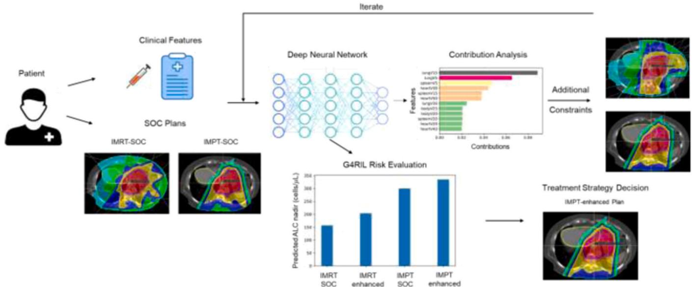
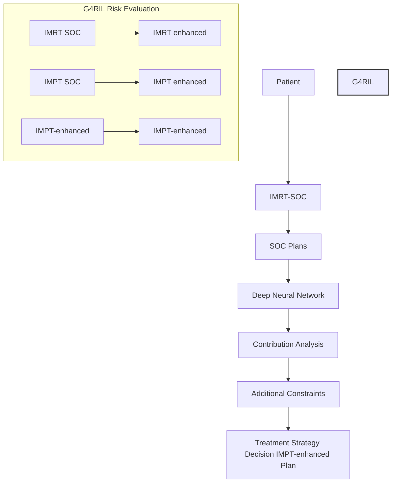
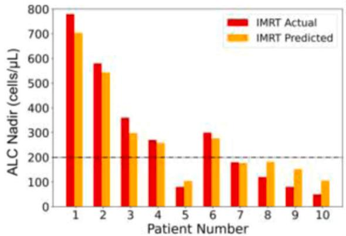
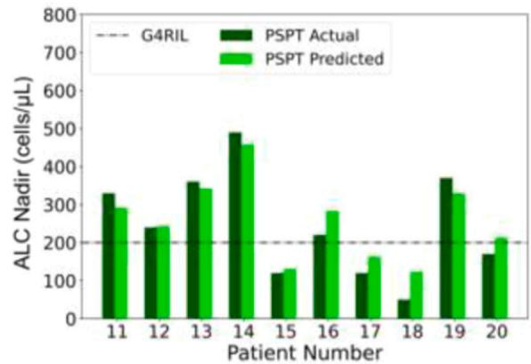
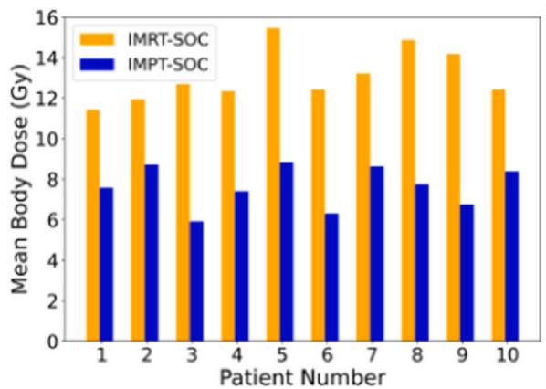
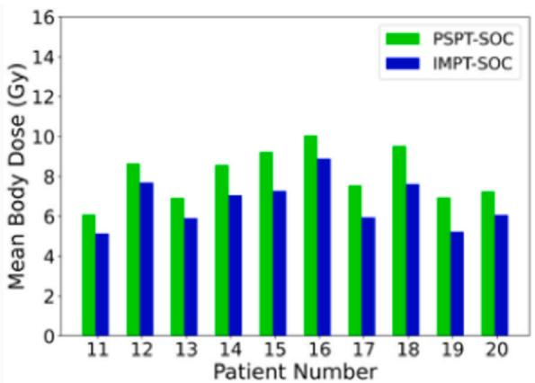
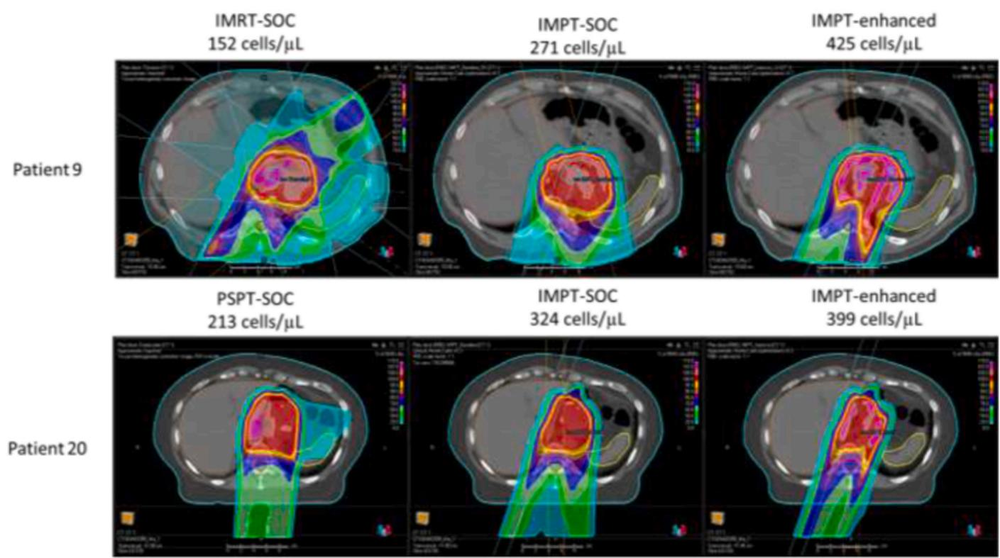
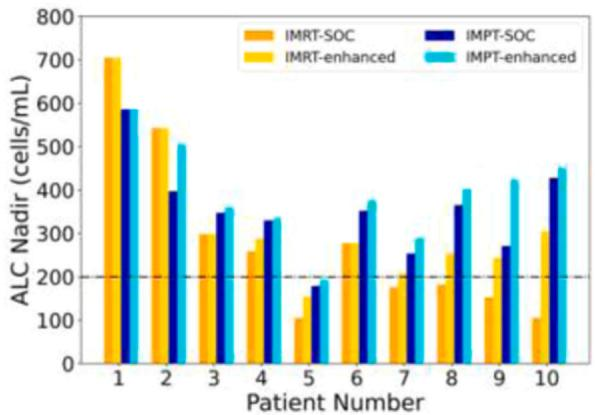
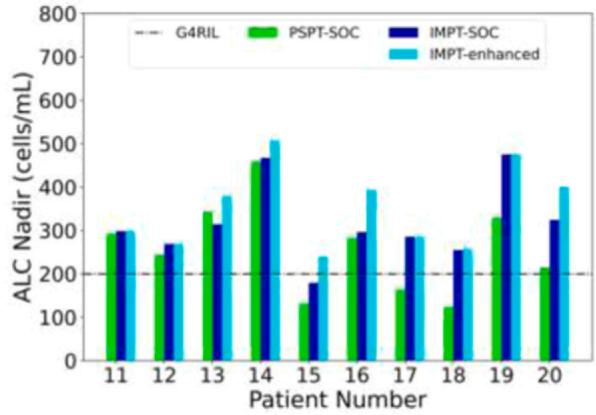

# Clinical Translation of a Deep Learning Model of Radiation-Induced Lymphopenia for Esophageal Cancer

Zongsheng Hu (MSc)1 , Radhe Mohan (PhD)1 , Yan Chu (PhD)1,2 , Xiaochun Wang (PhD)1 , Peter S.N. van Rossum (MD, PhD)3 , Yiqing Chen (MSc)1,2 , Madison E. Grayson (BSc)1 , Angela G. Gearhardt (MSc)1 , Clemens Grassberger (PhD)4 , Degui Zhi (PhD)2 , Brian P. Hobbs (PhD)5 , Steven H. Lin (MD, PhD)6 , Wenhua Cao (PhD)1,⁎

1 Department of Radiation Physics, The University of Texas MD Anderson Cancer Center, Houston, Texas, USA   
2 The University of Texas Health Science Center at Houston, Houston, Texas, USA   
3 Amsterdam UMC, Amsterdam, the Netherlands   
4 Department of Radiation Oncology, University of Washington, Seattle, Washington, USA   
5 Department of Population Health, The University of Texas at Austin, Austin, Texas, USA   
6 Department of Radiation Oncology, The University of Texas MD Anderson Cancer Center, Houston, Texas, USA

# ARTICLEINFO

Keywords:

Deep learning

Radiation-induced lymphopenia

Esophageal cancer

Proton therapy

# A B S T R A C T

Purpose: Radiation-induced lymphopenia is a common immune toxicity that adversely impacts treatment outcomes. We report here our approach to translate a deep-learning (DL) model developed to predict severe lymphopenia risk among esophageal cancer into a strategy for incorporating the immune system as an organ-at-risk (iOAR) to mitigate the risk.

Materials and Methods: We conducted “virtual clinical trials” utilizing retrospective data for 10 intensitymodulated radiation therapy (IMRT) and 10 passively-scattered proton therapy (PSPT) esophageal cancer patients. For each patient, additional treatment plans of the modality other than the original were created employing standard-of-care (SOC) dose constraints. Predicted values of absolute lymphocyte count (ALC) nadir for all plans were estimated using a previously-developed DL model. The model also yielded the relative magnitudes of contributions of iOARs dosimetric factors to ALC nadir, which were used to compute iOARs dose-volume constraints, which were incorporated into optimization criteria to produce “IMRT-enhanced” and “intensitymodulated proton therapy (IMPT)-enhanced” plans.

Results: Model-predicted ALC nadir for the original IMRT (IMRT-SOC) and PSPT plans agreed well with actual values. IMPT-SOC showed greater immune sparing vs IMRT and PSPT. The average mean body doses were 13.10 Gy vs 7.62 Gy for IMRT-SOC vs IMPT-SOC for patients treated with IMRT-SOC; and 8.08 Gy vs 6.68 Gy for PSPT vs IMPT-SOC for patients treated with PSPT. For IMRT patients, the average predicted ALC nadir of IMRT-SOC, IMRT-enhanced, IMPT-SOC, and IMPT-enhanced was 281, 327, 351, and 392 cells/µL, respectively. For PSPT patients, the average predicted ALC nadir of PSPT, IMPT-SOC, and IMPT-enhanced was 258, 316, and 350 cells/µL, respectively. Enhanced plans achieved higher predicted ALC nadir, with an average improvement of 40.8 cells/µL (20.6%).

Conclusion: The proposed DL model-guided strategy to incorporate the immune system as iOAR in IMRT and IMPT optimization has the potential for radiation-induced lymphopenia mitigation. A prospective clinical trial is planned.

# Introduction

Radiation-induced lymphopenia (RIL), that is, immune suppression, is a common complication of radiation therapy.1-8 Lymphocytes are highly radiosensitive4,9,1 0 and are more likely to be killed than other cells even at low and intermediate doses. Previous research has shown that severe RIL is strongly associated with poor treatment outcomes and decreased overall survival.11-16 Additionally, a recent study has suggested that severe RIL may also abrogate the benefits of radioimmunotherapy.17 Therefore, sparing lymphocytes is crucial to optimizing the effectiveness of radiation therapy and enhancing its benefits in combination with immunotherapy.

Our recent studies, mainly for esophageal cancers (ECs),7,12,18-25 have also shown that proton therapy, ostensibly because of its compact dose distributions (smaller low and intermediate “dose bath”) spares lymphocytes in various immune-relevant structures and circulating in the body, leads to improved survival. We have also demonstrated that a statistically significant improvement in survival is mediated through the reduction in RIL with proton therapy.26 Our past studies have been based on data from patients treated with either intensity-modulated radiation therapy (IMRT) or passively scattered proton therapy (PSPT). The goal of this study was to develop a strategy for mitigating severe (grade 4) RIL among EC patients treated with IMRT and intensitymodulated proton therapy (IMPT). To achieve this goal, we devised approaches to apply a personalized deep learning (DL) RIL prediction model, developed previously, to incorporate the immune system as an organ-at-risk (iOAR) in IMRT and IMPT criteria optimization. This personalized model is able to predict an individual’s risk based on their baseline clinical characteristics, biomarkers, and dose distribution. We plan to implement this strategy into a clinical trial and eventually in routine clinical practice.

We adopted an attentive interpretable tabular learning neural network (TabNet) architecture that was previously trained (as described in27) on a data set of a large retrospective cohort of IMRT and PSPT patients to understand and model RIL risk as a function of patients' baseline clinical and dosimetric factors. The key innovation in this work is the approach to derive dosimetric constraints on iOARs from the predictions of the DL model. Such constraints supplemented the standard of care (SOC) constraints to guide IMRT and IMPT optimization to determine if such a strategy could significantly reduce the risk of G4RIL. Our study’s objectives were to address the following questions:

1. Can IMPT or IMRT optimization, with the explicit incorporation of the immune system as an iOAR, mitigate immune suppression compared to SOC plans while still preserving SOC requirements for the target coverage and the sparing of normal tissues?

2. How well do the model-predicted absolute lymphocyte count (ALC) nadirs agree with the actual measured values?   
3. Would IMPT be able to spare lymphocytes to a greater degree compared to IMRT and PSPT?

The motivation for this study, which is a “virtual clinical trial,” was to generate a hypothesis to test in a prospective clinical trial whether the answer to question posed in item 1 above is true.

# Methods and materials

# Patient data

The virtual clinical trial was conducted for 10 IMRT patients and 10 PSPT patients selected from a large cohort of patients, which were used in the development of an RIL predictive model in a separate study.28 The use of these data was approved by The University of Texas MD Anderson Cancer Center Institutional Review Board. For completeness, we describe the model briefly in the next section. The IMRT vs PSPT patients were selected to have similar age, planning target volume size, clinical stage, chemotherapy scheme, tumor location, etc., but not baseline ALC. Detailed characteristics of the 20 selected patients can be found in the Supplementary Material (Table S1).

# Radiation-induced lymphopenia prediction model

The model developed previously27,28 and described briefly here for completeness used retrospective clinical and dosimetric data derived from medical records of 860 EC patients who received concurrent chemoradiotherapy for biopsy-proven EC at our tertiary care cancer center between January 2004 and November 2017. After excluding patients with missing data elements, 734 patients were found to be eligible for model training. The cohort includes both photon (N = 469) and proton (N = 265) patients. Almost all proton patients were treated with PSPT and a very small number with IMPT. The data for these patients include ALCs at baseline (before RT), during the course of RT, and post RT. The minimum (nadir) ALC, typically reached at or near the end of the RT course, has been found to be associated with outcomes.7,13,18

flowchart

Figure 1. Flowchart of the proposed deep learning guided lymphopenia mitigation strategy. For each patient, treatment plans of different modalities and techniques are created employing SOC dose constraints criteria. The post-treatment ALC nadir values of treatment plans were estimated based on the DL model, and the contributions of each dosimetric factor to ALC nadir were determined. Then, additional dose constraints on important dosimetric factors are added, and the SOC treatment plans are reoptimized to generate enhanced IMRT and IMPT plans. Abbreviations: ALC, absolute lymphocyte count; IMPT, intensity-modulated proton therapy; IMRT, intensity-modulated radiation therapy; and SOC, standard of care.

bar

| Patient Number | IMRT Actual (cells/μL) | IMRT Predicted (cells/μL) |
| :--- | :--- | :--- |
| 1 | 780 | 705 |
| 2 | 580 | 540 |
| 3 | 360 | 300 |
| 4 | 270 | 260 |
| 5 | 80 | 105 |
| 6 | 305 | 275 |
| 7 | 185 | 175 |
| 8 | 120 | 180 |
| 9 | 80 | 155 |
| 10 | 50 | 105 |

bar

| Patient Number | PSPT Actual (cells/μL) | PSPT Predicted (cells/μL) |
| :--- | :--- | :--- |
| 11 | 330 | 290 |
| 12 | 240 | 250 |
| 13 | 360 | 340 |
| 14 | 490 | 460 |
| 15 | 120 | 130 |
| 16 | 220 | 280 |
| 17 | 120 | 160 |
| 18 | 50 | 120 |
| 19 | 370 | 330 |
| 20 | 170 | 210 |
G4RIL (dashed line) indicates baseline threshold.

Figure 2. The TabNet model-predicted vs the actual measured post-treatment ALC nadir for (left) IMRT and (right) PSPT patients. Values below the dashed horizontal line correspond to grade 4 lymphopenia. Abbreviations: ALC, absolute lymphocyte count; IMRT, intensity-modulated radiation therapy; and PSPT, passively-scattered proton therapy.

The dose volume histograms (DVHs) of the lung, heart, and spleen, which, for simplicity, we considered to be the main lymphocyte-rich structures, were abstracted from treatment plans used for RT. These are certainly not the only structures that may contribute to RIL. Lymph nodes, bone marrow, circulating blood, and many other tissues harbor large numbers of lymphocytes. However, these tissues are not typically contoured as a part of the standard of practice. To approximately make up for this limitation, we used body, meaning (whole body excluding heart, lungs and speen), as a surrogate for all other lymphocyte-bearing structures. This is a simplifying assumption to make the development of the model and its clinical applications tractable; however, its validity needs to be tested.

All patients were prescribed target biologically effective dose of 50.4 Gy. Using dosimetric (dose-volume [DV] indices) and pretreatment clinical features as input, end-to-end interpretable DL architecture was trained to predict post-treatment absolute lymphocyte count nadir (ALC nadir). To address complex relationships among predictive features, the Attentive Interpretable Tabular Learning neural network (TabNet) was employed in a self-supervised learning manner to conduct pretraining on larger cohort while fine-tuning on specific subset to enhance its generalizability and robustness. In internal validation, the predictive model surpassed other machine learning models, including logistic regression, elastic-net, random forest, support vector machine, XGBoost, and CatBoost, in terms of root mean square error of predicted values of post-treatment ALC nadir, and achieved mean absolute error of 37.4 cells/µL in the test set.

Building upon the foundation of our interpretable DL pipeline, calculation of SHapley Additive exPlanations (SHAP) values was integrated to further elucidate the influence of individual predictive features on the risk of severe lymphopenia. SHAP values provide a rigorous, consistent measure of feature importance by computing the marginal contribution of each feature to the prediction across all possible combinations. This is achieved through the construction of a coalition of features, where the SHAP value is the average marginal contribution of a feature across all permutations of the data set. The incorporation of SHAP values in the model offers an explicit quantification of input feature impact, facilitating a more nuanced understanding of model predictions. Considering that we can manipulate only the dose distributions in radiation treatments, knowledge of SHAP values (ie, quantitative importance) of dosimetric is crucial for determining the defining optimization constraints or modifying their current values to achieve our objectives.

# Lymphopenia mitigation strategy

Figure 1 shows the flowchart of the proposed DL model-guided lymphopenia mitigation strategy. The SOC IMRT and PSPT plans, used to originally treat the patients, were obtained from the treatment planning database. Additional IMRT-SOC plans for the 10 patients treated with PSPT were created. For each of the 20 patients, IMPT-SOC plans were created employing dose constraints criteria according to standard esophagus planning protocol. SOC constraints are given in the Supplementary Materials (Table S2). The DVHs of lymphopenia-relevant structures (lung, heart, spleen, and body) were calculated for each plan. The post-treatment ALC nadir values of treatment plans were estimated based on the TabNet model described above, and the magnitudes of contributions of each dosimetric factor to ALC nadir were determined by calculating the SHAP values. For each lymphopenia-relevant structures, 3 DVH indices with the highest contributions to ALC nadirs were selected. Additional dosimetric constraints were imposed for the selected DVH indices.

IMRT-SOC and IMPT-SOC treatment plans were then reoptimized to generate new plans called IMRT-enhanced and IMPT-enhanced plans. The weight of each constraint was set and adjusted by trial and error, with the general principle of giving higher priority to the dosimetric feature with higher contributions to the G4RIL risk. In addition, we ensured that the reoptimization process was done without sacrificing SOC constraints for other structures. The optimization process was iterated several times until the ALC nadir was maximized.

This procedure was applied to all 10 IMRT patients and 10 PSPT patients. For each IMRT patient, we created an enhanced IMRT plan, an SOC IMPT plan, and an enhanced IMPT plan. For each PSPT patient, we created an SOC IMPT plan and an enhanced IMPT plan. To ensure the IMPT plans’ robustness over respiratory motions, 2 posterior beam configurations were adopted. The body dose has been found to be highly relevant to lymphopenia since its potential to represent the dose to the circulating blood and other lymphocyte rich structures not explicitly incorporated.29 We, therefore, calculated and compared the mean body dose for different modalities to investigate the possible lymphocyte-sparing advantage of IMPT. In addition, predicted ALC nadir values of SOC and enhanced plans were compared. The statistical significance of all comparisons is assessed using Wilcoxon signed rank tests at the level of 0.05.

# Results

Results of model performance are shown in Figure 2. The TabNet model seems to have achieved good performance in predicting the posttreatment ALC nadir for both IMRT and PSPT patients. The mean absolute difference between of predicted ALC nadir and actual measured ALC nadir is 42.6 ± 24.6 and 36.5 ± 20.7 cells/µL for IMRT and PSPT cohorts, respectively.

The average measured baseline ALCs for IMRT and PSPT patients were $1 . 9 \times 1 0 ^ { 3 }$ and $1 . 4 \times 1 0 ^ { 3 }$ cells/µL, respectively. The average measured ALC nadir values for IMRT and PSPT patients were 280 and

Table Mean dose (Gy) analysis for body, lung, heart, and spleen for 10 IMRT and 10 PSPT patients comparing original plans with IMPT plans. 

<table><tr><td>Volume of interest</td><td>IMRT original (min-max)</td><td>IMPT baseline (min-max)</td><td>P (IMRT-IMPT)</td><td>PSPT original (min-max)</td><td>IMPT baseline (min-max)</td><td>P (PSPT-IMPT)</td></tr><tr><td>Body</td><td>13.1 (11.4-15.5)</td><td>7.6 (5.9-8.8)</td><td>.002</td><td>8.1 (6.1-10.0)</td><td>6.7 (5.1-8.9)</td><td>.002</td></tr><tr><td>Lung</td><td>9.6 (5.3-15.3)</td><td>4.6 (2.5-7.9)</td><td>.002</td><td>6.9 (1.9-10.3)</td><td>4.6 (1.6-7.2)</td><td>.002</td></tr><tr><td>Heart</td><td>20.5 (3.9-30.3)</td><td>10.7 (2.0-20.0)</td><td>.002</td><td>20.5 (3.9-30.3)</td><td>10.7 (2.0-20.1)</td><td>.002</td></tr><tr><td>Spleen</td><td>15.4 (0.3-17.3)</td><td>10.9 (0-24.7)</td><td>.064</td><td>10.8 (0.3-23.2)</td><td>7.8 (0.2-23.4)</td><td>.014</td></tr></table>

Abbreviations: IMRT, intensity-modulated radiation therapy; PSPT, passively-scattered proton therapy; and IMPT, intensity-modulated proton therapy.

bar

| Patient Number | IMRT-SOC (Gy) | IMPT-SOC (Gy) |
| :--- | :--- | :--- |
| 1 | 11.5 | 7.6 |
| 2 | 12.0 | 8.7 |
| 3 | 12.7 | 5.9 |
| 4 | 12.3 | 7.4 |
| 5 | 15.5 | 8.9 |
| 6 | 12.4 | 6.3 |
| 7 | 13.3 | 8.6 |
| 8 | 14.9 | 7.8 |
| 9 | 14.2 | 6.8 |
| 10 | 12.4 | 8.4 |

bar

| Patient Number | PSPT-SOC (Gy) | IMPT-SOC (Gy) |
| :--- | :--- | :--- |
| 11 | 6.2 | 5.2 |
| 12 | 8.7 | 7.7 |
| 13 | 7.0 | 5.9 |
| 14 | 8.6 | 7.1 |
| 15 | 9.3 | 7.3 |
| 16 | 10.1 | 8.9 |
| 17 | 7.6 | 6.0 |
| 18 | 9.6 | 7.6 |
| 19 | 7.0 | 5.3 |
| 20 | 7.3 | 6.1 |

Figure 3. Mean body doses for esophagus patients: (Left) The original IMRT (same as IMRT-SOC) plans vs IMPT-SOC plans. (Right) PSPT plans vs IMPT-SOC plans. Abbreviations: IMPT, intensity-modulated proton therapy; IMRT, intensity-modulated radiation therapy; and SOC, standard of care.

247 cells/µL, respectively. The corresponding predicted averages for the original treatment plans were 281 and 258 cells/µL, respectively. The lower average value for PSPT may seem unexpected but is presumably due to the differences in baseline ALC and age between the 2 cohorts (see Table S1 in the Supplementary Materials). The selected proton patients were older and had lower baseline ALCs.

The Table lists the mean dose statistics for body, lung, heart, and spleen for the IMRT and PSPT patient cohorts compared to IMPT plans. The IMPT plans show statistically significant improvement of sparing on almost all of these structures over original IMRT or PSPT plans, except IMPT vs IMRT on spleen sparing is not statistically significant. Figure 3 compares the mean body dose among different modalities for individual patients. Compared to both IMRT and PSPT plans, the IMPT plans showed a significant reduction in mean body doses. For the 10 IMRT patients, the average mean body doses for the original IMRT (IMRT-SOC) plans and newly created IMPT-SOC plans were 13.10 and 7.62 Gy, respectively. For the 10 PSPT patients, the average mean body doses for the original PSPT and IMPT-SOC plans were 8.08 and 6.68 Gy, respectively.

heatmap

| Patient | IMRT-SOC (cells/μL) | PSPT-SOC (cells/μL) | IMPT-SOC (cells/μL) | IMPT-enhanced (cells/μL) |
|---------|---------------------|---------------------|---------------------|--------------------------|
| Patient 9 | 152 | 213 | 324 | 425 |
| Patient 20 | - | - | - | - |

Figure 4. Dose map comparison of 2 example cases over different treatment plans. Abbreviations: IMPT, intensity-modulated proton therapy; IMRT, intensitymodulated radiation therapy; PSPT, passively-scattered proton therapy; and SOC, standard of care.

bar

| Patient Number | IMRT-SOC (cells/mL) | IMPT-SOC (cells/mL) | IMRT-enhanced (cells/mL) | IMPT-enhanced (cells/mL) |
| :--- | :--- | :--- | :--- | :--- |
| 1 | 700 | 580 | 700 | 580 |
| 2 | 540 | 390 | 540 | 500 |
| 3 | 300 | 340 | 300 | 360 |
| 4 | 260 | 330 | 280 | 330 |
| 5 | 100 | 180 | 100 | 180 |
| 6 | 280 | 350 | 280 | 370 |
| 7 | 170 | 250 | 170 | 290 |
| 8 | 180 | 360 | 180 | 400 |
| 9 | 150 | 270 | 150 | 420 |
| 10 | 100 | 420 | 100 | 450 |

bar

| Patient Number | G4RIL | PSPT-SOC | IMPT-SOC | IMPT-enhanced |
| -------------- | ----- | -------- | -------- | ------------- |
| 11             | 200   | 300      | 300      | 300           |
| 12             | 200   | 250      | 270      | 270           |
| 13             | 200   | 350      | 320      | 380           |
| 14             | 200   | 470      | 470      | 510           |
| 15             | 200   | 130      | 180      | 240           |
| 16             | 200   | 280      | 300      | 390           |
| 17             | 200   | 160      | 290      | 290           |
| 18             | 200   | 120      | 250      | 260           |
| 19             | 200   | 330      | 480      | 480           |
| 20             | 200   | 210      | 320      | 400           |

Figure 5. Post-treatment ALC nadir comparison over different treatment plans of 10 IMRT patients (left) and 10 PSPT patients (right). Abbreviations: ALC, absolute lymphocyte count; IMPT, intensity-modulated proton therapy; IMRT, intensity-modulated radiation therapy; PSPT, passively-scattered proton therapy; and SOC, standard of care.

Figure 4 shows dose maps of one case each of IMRT and PSPT patients. IMPT achieved a dosimetric superiority over IMRT as well as PSPT. The predicted ALC nadir for these patients improved from 152 to 271 cells/µL for IMRT to IMPT and from 213 to 324 cells/µL for PSPT to IMPT. After the DL model-guided reoptimization, ALC nadir values further increased to 425 and 399 cells/µL for IMRT and PSPT cases.

Figure 5 compares predicated ALC nadir values for different modalities and techniques for all 20 cases. For the 10 IMRT patients, the average predicted post-treatment ALC nadir of IMRT original vs IMPT SOC was 281 and 351 cells/µL, respectively. For the 10 PSPT patient, the average predicted ALC nadir of PSPT original and IMPT SOC was 258 and 316 cells/µL, respectively. After DL model-guided reoptimization, the average predicted post-treatment ALC nadir of reoptimized IMRT plan (IMRT-enhanced) improved from 281 to 327 cells/µL. For the IMPT reoptimized plan (IMPT-enhanced), the ALC nadir improved from 351 to 392 cells/µL and 316 to 350 cells/µL for IMRT and IMPT patient cohorts, respectively. Compared to original IMRT or PSPT plans, 90% (18 out of 20) of enhanced plans could achieve higher predicted post-treatment ALC nadir, with the average improvement of 40.8 cells/µL (20.6%). For 35% (7 out of 20) of the patients, G4RIL (ALC nadir < 200 cells/µL) can be improved to G3RIL (ALC nadir between 500 and 200 cells/µL). These results suggest there is potential of the proposed strategy in sparing the immune system. Figure 5 also shows advantages of IMPT compared to IMRT and PSPT in terms of higher post-treatment ALC nadir values in almost all selected cases.

# Discussion

The main goal of this study was to develop a personalized treatment optimization strategy for mitigating severe RIL among EC patients treated with IMRT or IMPT. Our plan is to evaluate such a strategy in a future clinical trial. Specific objectives included1 determining whether IMRT and IMPT, optimized incorporating the immune system as an organ at risk and guided by an RIL prediction model, can enhance immune system sparing without compromising the SOC requirements2 ; evaluating the performance of the machine learning-based RIL predictive model of lymphocyte depletion based on personal clinical characteristics of the patient and dosimetric features of the treatment plan3 ; and assessing whether the SOC IMPT, compared to SOC IMRT and PSPT, has greater potential to improve immune system sparing. To achieve these objectives, we conducted a virtual clinical trial, involving 20 esophagus cancer patients treated previously with IMRT and PSPT (10 each). We found that the model-predicted values of ALC nadir are in reasonable agreement with the actual values. Moreover, compact dose distributions of SOC-IMPT, compared to SOC-IMRT, led to a considerable reduction in mean body dose (dose bath), which is likely a major factor in the killing of highly radiosensitive lymphocytes circulating in the body. Model predictions also showed that the SOC IMPT may lead to greater immune sparing compared to SOC IMRT and PSPT.

The translation of the model predictions into quantities that can be incorporated into the criteria of IMRT or IMPT optimization employed the SHAP values of dosimetric features (DV indices) of the individual patient’s SOC IMRT/IMPT plan. The SHAP values indicate the relative contribution of each feature to the risk and were used to determine the changes in weights of dosimetric constraints or to impose new constraints. The incorporation of additional dosimetric constraints on heart, lungs, spleen, and body, suggested by the model based on the importance factors of dosimetric features, led to further improvement in sparing for most of the patients.

The present study also showed the potential of using DL-based RIL prediction to select radiation modality for individual patients. Eight out of the 20 patients in the cohort, that is, patients 5, 7, 8, 9, 10, 15, 17, and 18, were predicted to develop G4RIL (Figure 2) if treated with SOC-IMRT or PSPT plans. All of them, in fact, did develop G4RIL. In addition, although the predicted ALC nadir for patient 20 was slightly above the G4RIL risk threshold, the actual value was slightly below the threshold. Based on RIL predictions (Figure 5), G4RIL might be avoided for all of these patients if they were treated with IMPT-SOC or IMPTenhanced plans. On the other hand, for patients with a low predicted risk of G4RIL with IMRT, such as patients 1 and 2 (Figure 2), there was no improvement in predicted ALC nadir with IMPT (Figure 5). In fact, SOC-IMPT and enhanced IMPT actually worsened the sparing of the immune system. Considering the small sample size, it is not obvious why some patients benefit from SOC-IMPT or enhanced IMPT whereas others do not. One hint lies in Figure 3 where the use of IMPT for some patients treated with IMRT led to a smaller change in mean body dose compared to others. Larger penumbrae and uncertainty margins for proton beams may negate the benefit of smaller dose baths for a subset of patients, for example, patients 1 and 2.

The study has several limitations. One of them is that we used only 20 patients. One justification for the small number is the fact that such studies are intended to compare alternate techniques for the same patient. In other words, there is perfect equipoise in patient characteristics. Another factor is limited resources. We should note that the number of patients in our study is larger than 5 to 10 typically used in most published treatment planning studies. Small sizes for such studies are considered adequate, provided the patients are selected to represent the widest spectrum of clinical characteristics (eg, ones listed in Table S1 of the Supplemental Materials). Nevertheless, in the future, we plan to expand this study to at least double the cohort size.

Secondly, while the data-driven model we used is more comprehensive compared to other models in the literature, as any other model, it makes some simplifying assumptions. As mentioned above, for practical reasons, it considers only heart, lungs, and spleen explicitly and assumes that all other lymphocyte-bearing tissues are uniformly distributed in rest of the body. We anticipate that future models will be able to explicitly incorporate additional structures relevant to lymphopenia. In addition, the model is based on full DVHs, whereas the planning study is based on one, or a small subset of, DV indices to define optimization constraints. DVHs and DV indices have well-known limitations. For instance, the DVHs do not account for the spatial distribution of dose. Moreover, a single or a small number of DV constraints do not represent the clinical effect of the entire DVH. We are exploring the use of differential DVHs or the features of dose distributions obtained from voxel-based analysis to overcome this limitation.

Another limitation may be that reoptimization to maximize immune sparing, though carried out while ensuring that the SOC constraints continue to be met, would, in general, lead to redistribution of dose. For instance, dose to volumes and tissues not constrained by the DV indices may increase and may not always be acceptable. The clinical team may then have to make appropriate compromises.

Such limitations indicate that, while the results of the study are encouraging, it is important to assess the validity of the model and evaluate effectiveness and utility of the RIL mitigation strategy prospectively in a clinical trial. We plan to do so and expect that feedback from the trial and from the eventual implementation in clinical practice will lead to improvement in the resolution and fidelity of the model.

# Conclusions

Our virtual clinical trial for esophagus patients suggests that IMPT has the potential to significantly mitigate RIL, an important toxicity contributing to poor outcomes. Furthermore, the explicit incorporation of personalized dosimetric constraints derived from an RIL prediction model in the IMPT and IMRT optimization criteria may further mitigate RIL. However, there is a need to prospectively test the validity of the model and the potential of the RIL mitigation strategy clinically. There is also a need to continually improve the performance of the predictive model.

# Funding

This work is supported by the National Cancer Institute of National Institutes of Health (grant numbers: P01CA261669 and P30CA016672).

# Author contribution

Zongsheng Hu, Radhe Mohan, and Wenhua Cao conceptualized the study. Zongsheng Hu conducted the study and wrote the manuscript. Yan Chu, Xiaochun Wang, Peter S.N. van Rossum, Yiqing Chen , and Wenhua Cao assisted in data curation and analysis. Clemens Grassberger, Degui Zhi, Brian P. Hobbs, and Steven H. Lin provided statistical and clinical inputs to the study and manuscript. Angela G. Gearhardt, Madison E. Grayson, Radhe Mohan, and Wenhua Cao helped edit the manuscript. All authors contributed to this study and approved the submitted manuscript.

# Data Availability Statement

The access to patient data, including clinical treatments and images used in this study, is restricted by the University of Texas MD Anderson Cancer Center. Research data are available upon reasonable request.

# Declaration of Conflicts of Interest

Wenhua Cao reports financial support was provided by the National Institutes of Health. Radhe Mohan reports financial support was provided by the National Institutes of Health. If there are other authors, they declare that they have no known competing financial interests or personal relationships that could have appeared to influence the work reported in this paper.

# Supplementary material

Supplementary material associated with this article can be found in the online version at doi:10.1016/j.ijpt.2024.100624.

# References

1. Carr BI, Metes DM. Peripheral blood lymphocyte depletion after hepatic arterial 90Yttrium microsphere therapy for hepatocellular carcinoma. Int J Radiat Oncol Biol Phys. 2012;82:1179–1184.   
2. Glas U, Wasserman J, Blomgren H, et al. Lymphopenia and metastatic breast cancer patients with and without radiation therapy. Int J Radiat Oncol Biol Phys. 1976;1:189–195.   
3. O'Toole C, Unsgaard B. Clinical status and rate of recovery of blood lymphocyte levels after radiotherapy for bladder cancer. Cancer Res. 1979;39:840–843.   
4. Yovino S, Grossman SA. Severity, etiology and possible consequences of treatmentrelated lymphopenia in patients with newly diagnosed high-grade gliomas. CNS Oncol. 2012;1:149–154.   
5. Ahmed MM, Hodge JW, Guha C, et al. Harnessing the potential of radiation-induced immune modulation for cancer therapy. Cancer Immunol Res. 2013;1:280–284.   
6. Liu J, Zhao Q, Deng W, Lu J, Xu X, Wang R, Li X, Yue J, et al. Radiation-related lymphopenia is associated with spleen irradiation dose during radiotherapy in patients with hepatocellular carcinoma. Radiat Oncol. 2017;12:90.   
7. Shiraishi Y, Fang P, Xu C, Song J, Krishnan S, Koay EJ, Mehran RJ, Hofstetter WL, Blum-Murphy M, Ajani JA, Komaki R, Minsky B, Mohan R, Hsu CC, Hobbs BP, Lin SH, et al. Severe lymphopenia during neoadjuvant chemoradiation for esophageal cancer: a propensity matched analysis of the relative risk of proton versus photon-based radiation therapy. Radiother Oncol. 2018;128:154–160.   
8. Tang C, Liao Z, Gomez D, et al. Lymphopenia association with gross tumor volume and lung V5 and its effects on non-small cell lung cancer patient outcomes. Int J Radiat Oncol Biol Phys. 2014;89:1084–1091.   
9. Trowell OA. The sensitivity of lymphocytes to ionising radiation. J Pathol Bacteriol. 1952:64:687-704.   
10. Dunst J, Neubauer S, Becker A, et al. Chromosomal in-vitro radiosensitivity of lymphocytes in radiotherapy patients and at-homozygotes. Strahlenther Onkol. 1998;174:510–516.   
11. Fumagalli LA, Vinke J, Hoff W, et al. Lymphocyte counts independently predict overall survival in advanced cancer patients: a biomarker for IL-2 immunotherapy. J Immunother. 2003;26:394–402.   
12. Grassberger C, Hong TS, Hato T, et al. Differential association between circulating lymphocyte populations with outcome after radiation therapy in subtypes of liver cancer. Int J Radiat Oncol. 2018;101:1222–1225.   
13. Grossman SA, Ellsworth S, Campian J, et al. Survival in patients with severe lymphopenia following treatment with radiation and chemotherapy for newly diagnosed solid tumors. J Natl Compr Canc Netw. 2015;13:1225–1231.   
14. Ku GY, Yuan J, Page DB, et al. Single-institution experience with ipilimumab in advanced melanoma patients in the compassionate use setting: lymphocyte count after 2 doses correlates with survival. Cancer. 2010;116:1767–1775.   
15. Ménétrier-Caux C, Ray-Coquard I, Blay JY, Caux C, et al. Lymphopenia in cancer patients and its effects on response to immunotherapy: an opportunity for combination with cytokines? J Immunother Cancer. 2019;7:85.   
16. Wild AT, Herman JM, Dholakia AS, et al. Lymphocyte-sparing effect of stereotactic body radiation therapy in patients with unresectable pancreatic cancer. Int J Radiat Oncol Biol Phys. 2016;94:571–579.   
17. Jing W, Xu T, Wu L, et al. Severe radiation-induced lymphopenia attenuates the benefit of durvalumab after concurrent chemoradiotherapy for NSCLC. JTO Clin Res   
18. Davuluri R, Jiang W, Fang P, et al. Lymphocyte nadir and esophageal cancer survival outcomes after chemoradiation therapy. Int J Radiat Oncol Biol Phys. 2017;99:128–135.   
19. Ebrahimi S, Cao W, Liu A, et al. Assessment of radiation-induced lymphopenia risks for esophageal patients - planning study comparing proton and photon therapy. Medical Physics. 2019;46 E594-E594.   
20. Ebrahimi S, Lim G, Liu A, et al. Radiation-induced lymphopenia risks of photon versus proton therapy for esophageal cancer patients. Int J Part Ther. 2021;8:17–27.   
21. Fang P, Shiraishi Y, Jiang W, et al. Lymphocyte-sparing effect of proton therapy in patients with esophageal cancer. Int J Radiat Oncol. 2017;98 E6-E6.   
22. Mohan R, Liu AY, Brown PD, et al. Proton therapy reduces the likelihood of highgrade radiation-induced lymphopenia in glioblastoma patients: phase II randomized study of protons vs photons. Neuro-Oncology. 2021;23:284–294.   
23. van Rossum PSN, Deng W, Routman DM, et al. Prediction of severe lymphopenia during chemoradiation therapy for esophageal cancer: development and validation of a pretreatment nomogram. Pract Radiat Oncol. 2020;10:e16–e26.

24. Wang X, van Rossum PSN, Chu Y, et al. Severe lymphopenia during chemoradiation therapy for esophageal cancer: comprehensive analysis of randomized phase 2B trial of proton beam therapy versus intensity modulated radiation therapy. Int J Radiat Oncol Biol Phys. 2024;118:368–377.   
25. Zhu C, Mohan R, Lin SH, et al. Identifying individualized risk profiles for radiotherapy-induced lymphopenia among patients with esophageal cancer using machine learning. JCO Clin Cancer Inform. 2021;5:1044–1053.   
26. Chen Y, Chu Y, van Rossum PS, et al. Causal survival mediation analysis of the impact of radiation-induced immunosuppression on cancer survivorship. AAPM 65th Annual Meeting & Exhibition. AAPM; 2023.

27. Chu Y, Zhu C, Hobbs BP, et al. Personalized composite dosimetric score-based machine learning model of severe radiation-induced lymphopenia among esophageal cancer patients. Int J Radiat Oncol Biol Phys. 2024 In press.   
28. Zhu C, Lin SH, Jiang X, et al. A novel deep learning model using dosimetric and clinical information for grade 4 radiotherapy-induced lymphopenia prediction. Phys Med Biol. 2020;65:035014.   
29. Ellsworth SG, Yalamanchali A, Lautenschlaeger T, et al. Lymphocyte depletion rate as a biomarker of radiation dose to circulating lymphocytes during fractionated partial-body radiation therapy. Adv Radiat Oncol. 2022;7:100959.