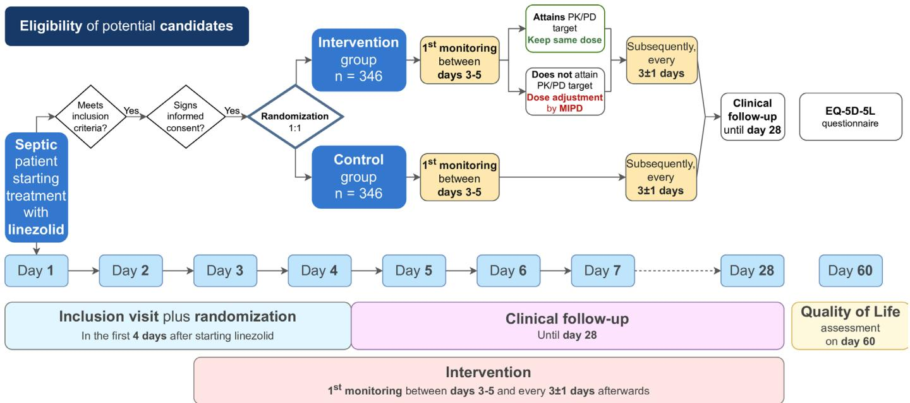
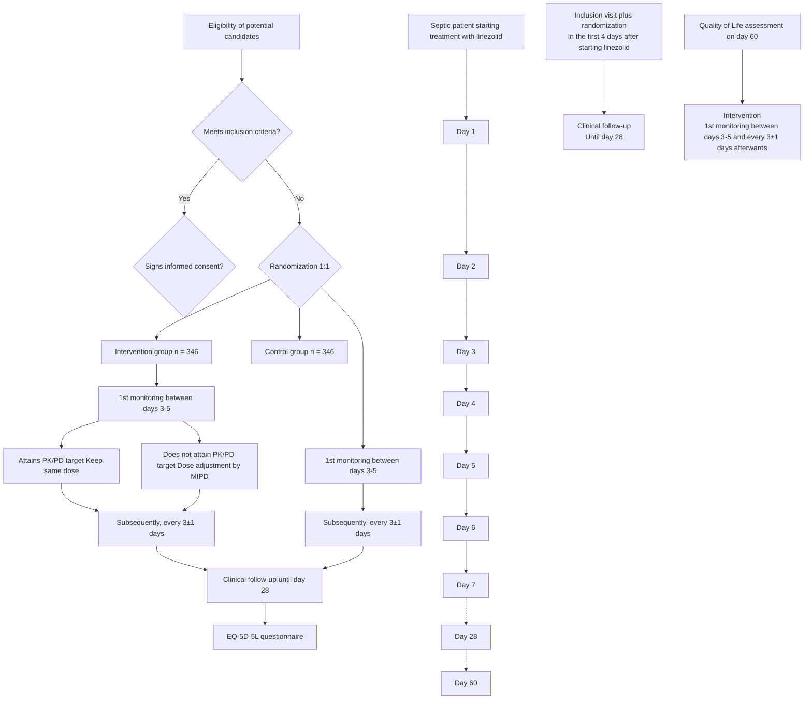

# BMJ Open

# Safety and efficacy of personalised versus standard dosing of linezolid in patients with sepsis (SePkLin): a pragmatic, multicentre, randomised, controlled and superiority clinical trial protocol

Enrique Bandín-Vilar,1,2 Ana Estany-Gestal,3 Teresa Cabaleiro,3 Eva Rial-Pensado,3 Ana Castro-Balado,1,2 Iria Varela-Rey,1,2 Cristina Mondelo-García,1,2 Francisco Cajade-Pascual ,1,2 María Teresa Rodríguez-Jato,2 Irene Zarra-Ferro,1,2 María Teresa Rey-Rilo,4 Jorge Arca-Suárez,5,6 María Sandra Albiñana-Pérez,7 Pedro Rascado-Sedes,8 Antonio Pose-Reino,9 Luis Valdés,10 Manuel Taboada-Muñiz,11 Gema Barbeito-Castiñeiras,12 Álvaro Mena de Cea,13 Enrique Alemparte-Pardavila,14 Anxo Fernández-Ferreiro,1,3 SePkLin Study Group15

To cite: Bandín-Vilar E, Estany-Gestal A, Cabaleiro T, et al. Safety and efficacy of personalised versus standard dosing of linezolid in patients with sepsis (SePkLin): a pragmatic, multicentre, randomised, controlled and superiority clinical trial protocol. BMJ Open 2024;14:e087465. doi:10.1136/ bmjopen-2024-087465

D Prepublication history and additional supplemental material for this paper are available online. To view these files, please visit the journal online (https://doi.org/10.1136/ bmjopen-2024-087465).

Received 10 April 2024

Accepted 30 September 2024

# Check for updates

© Author(s) (or their

employer(s)) 2024. Re-use permitted under CC BY-NC. No commercial re-use. See rights and permissions. Published by BMJ.

For numbered affiliations see end of article.

Correspondence to

Dr Anxo Fernández-Ferreiro; anxordes@gmail.com

# ABSTRACT

Introduction Linezolid is a broadly used antibiotic to treat complicated infections caused by gram-positive bacteria. Therapeutic drug monitoring of linezolid concentrations is recommended to maximise its efficacy and safety, mainly haematological toxicity. Different pharmacokinetic/pharmacodynamic targets have been proposed to improve linezolid exposure: the ratio of the area under the concentration–time curve during a 24-hour period to minimum inhibitory concentration (MIC) between 80 and 120; percentage of time that the drug concentration remains above the MIC during a dosing interval greater than 85% and the trough concentration between 2 and 7 mg/L. This clinical trial aims to evaluate the safety, efficacy and the clinical and economic utility of personalised dosing of linezolid using Bayesian forecasting methods to attain pharmacokinetic/ pharmacodynamic targets, known as model-informed precision dosing.

Methods and analysis This is a pragmatic, multicentre, randomised, parallel, controlled, phase IV and low intervention trial. Participants will be randomly assigned 1:1 to each group (n=346 per group). Control group will receive the standard dose of linezolid. Intervention group will receive personalised dosage of linezolid based on pharmacokinetic–pharmacodynamic adjustments. The primary outcome will be the incidence of thrombocytopenia in both groups.

Ethics and dissemination This protocol was approved by the Ethical Committee of the Investigation with Medicines of Galicia (code 2022/140) and authorised by the Spanish Agency for Medicines and Medical Devices. The trial is implemented in accordance with the Declaration of Helsinki and the international ethical and scientific quality

# STRENGTHS AND LIMITATIONS OF THIS STUDY

⇒ This is a trial in which personalisation is carried out using model-informed precision dosing.   
⇒ It is a pragmatic clinical trial within routine clinical practice that reliably reflects the actual conditions under which the intervention will be applied.   
⇒ One of the limitations is the fact that the number of days of linezolid treatment on the day of first monitoring is variable according to clinical practice, which may affect the results.   
⇒ Another limitation is that it is difficult to obtain meaningful results on raw variables such as mortality because of the many factors that influence these data.

standard, the Good Clinical Practice. The results will be published in peer-reviewed journals.

Trial registration number EudraCT registration code: 2022-000144-30.

# INTRODUCTION

Linezolid is an oxazolidinone antibiotic used to treat serious resistant gram-positive bacterial infections. Recent studies have shown that the one-size-fits-all labelled dosing of 600 mg every 12 hours could lead to therapeutic failure and/or toxicity due to its large interindividual variability in populations such as renal or hepatic impairment, underweight or obese patients and, especially, in critically ill patients.1

The study hypothesis arises from the need to prevent toxicity of systemic exposure to antimicrobials and to maximise their efficacy in infectious diseases. According to the latest recommendations from different scientific societies, linezolid is considered one of the antibiotics for which model-informed precision dosing (MIPD) is recommended, in order to identify the personalised dosing that maximises efficacy and decreases adverse effects in patients with sepsis.2 Different pharmacokinetic/pharmacodynamic (PK/PD) targets have been proposed to improve linezolid exposure: the ratio of the area under the concentration–time curve during a 24-hour period to minimum inhibitory concentration, $\mathrm { A U C _ { 0 - > 2 4 h } ^ { - } / M I C = 8 0 - 1 2 0 }$ ; the percentage of time that the drug concentration remains above the MIC during a dosing interval, %T>MIC≥85% and the trough drug concentration $( \mathbf { C _ { \mathrm { t r o u g h } } } )$ between 2 and 7 mg/L.3 4 However, these recommendations are based fundamentally on observational studies, so to provide solid scientific evidence to propose a personalised dosage for this antibiotic it is necessary to carry out a randomised clinical trial to evaluate the efficacy and the clinical and economic utility of the Bayesian forecasting methods that support the personalised medicine based on PK/PD, known as MIPD.5

In critically ill patients, the importance of optimising antibiotic doses is even greater, considering the high morbidity and mortality caused by infections in this population, together with their larger interindividual variability in drug exposure, which can compromise the satisfactory outcome of antibiotic therapy. The pathophysiological alterations that occur in this group of patients produce modifications in pharmacokinetic parameters such as volume of distribution (due to cardiovascular alterations, intensive fluid therapy or increased capillary permeability) and clearance (due to hepatic and renal dysfunction and the use of extracorporeal devices) greatly compromising the selection of the optimal antibiotic dose in this population.

On the other hand, despite the fact that dosing adjustments based on drug concentrations have been performed for several decades, there is still a lack of studies with a high level of evidence, such as clinical trials, to be able to continue advancing towards the broad and real implementation of MIPD.6 7

Furthermore, it is important to highlight the importance of using externally validated models in the target population to evaluate their predictive capacity, an aspect that has already been carried out prior to the clinical trial. In addition, to reduce the particularity of traditional clinical trials of overselecting the sample and diminishing the external validity of the results, a pragmatic trial is proposed to determine its efficacy and safety in real life.

The aim of this trial is to evaluate the safety, efficacy and cost–utility of the application of personalised medicine based on PK/PD targets in patients with sepsis receiving treatment with linezolid.

# METHODS AND ANALYSIS

# Study design and settings

A pragmatic, multicentre, randomised, parallel, controlled and phase IV clinical trial, which aims to demonstrate the superiority of individualised dosing of PK/PD-based linezolid versus standard dosing. A 28-day follow-up will be carried out per patient recruited.

The trial was designed following the Standard Protocol Items: Recommendations for Interventional Trials Statement (SPIRIT). SPIRIT checklist appendices are included in online supplemental file 1.8 EudraCT registration code is 2022-000144-30. In accordance with current regulations ((1) Regulation (EU) No 536/2014 of the European Parliament and of the Council of 16 April 2014 on clinical trials on medicinal products for human use and repealing Directive 2001/20/EC and (2) Royal Decree 1090/2015, of December 4, which regulates clinical trials with medicines, the Ethics Committees for Research with medicines and the Spanish Registry of Clinical Studies), the proposal meets the requirements to be considered a low-intervention clinical trial. The study will be carried out in two hospitals in the northwest of Spain: University Clinical Hospital of Santiago de Compostela and University Clinical Hospital of A Coruña.

# Participants

Eligible patients are defined as individuals admitted to participating centres with diagnosis of sepsis and who require antibiotic therapy with linezolid.

Additionally, the following selection criteria have been defined: (a) Inclusion criteria: (1) adults, (2) sepsis defined as Sequential Organ Failure Assessment (SOFA) score ≥2 points or an increase of 2 points with respect to the baseline score in the case of chronic organ dysfunction and (3) patients who have started antibiotic treatment with linezolid according to clinical practice; (b) Exclusion criteria: (1) pregnant or breastfeeding women, (2) interruption of treatment before obtaining the first blood sample, (3) allergy or hypersensitivity to linezolid and (4) inclusion in another intervention clinical trial. These criteria are summarised in table 1.

# Sample size

Based on data from different publications, 19.7% of patients treated with conventional dosing of linezolid are at risk of thrombocytopenia.9 On the other hand, it is estimated that this percentage will decrease to 3.3% in patients who receive personalised dosing of linezolid.3 A randomised trial was designed with two balanced groups and a superiority limit of 10%. It will be necessary to include 294 patients per group to ensure a power of 80.84% in order to conclude superiority with a significance level of 5%. Considering a percentage of dropouts around 15%, it will be necessary to recruit 346 individuals in each group, calculating a final sample size of 692 individuals.

# Recruitment

The identification of eligible patients will be carried out daily by the pharmacists associated with each clinical service to detect the initiation of treatment with linezolid, who will contact the researchers of the clinical services involved. These researchers will proceed to the possible recruitment with the selection visit. Before starting any procedure, informed consent will be obtained. Patients who have been on treatment with linezolid for a maximum of 4 days may be selected. Recruitment will extend over 36 months.

Table 1 Summary of the patient’s inclusion and exclusion criteria 

<table><tr><td>Inclusion criteria</td><td>Exclusion criteria</td></tr><tr><td>Age ≥18 years old</td><td>Discontinuation of treatment before the first blood sample</td></tr><tr><td>Diagnosis of sepsis (SOFA score ≥2 points or increase of 2 points from the baseline score in case of chronic organ dysfunction)</td><td>Pregnant or breastfeeding women.</td></tr><tr><td>Treatment with linezolid started according to standard clinical practice</td><td>Known allergy or hypersensitivity to linezolid</td></tr><tr><td></td><td>Inclusion in another intervention trial</td></tr><tr><td colspan="2">SOFA, Sequential Organ Failure Assessment.</td></tr></table>

# Allocation

All subjects entering the study will be randomised at the inclusion visit in a 1:1 ratio. The allocation sequence will consist of a computer-generated random number list. The random number list will be implemented and hosted in the electronic case report database (eCRD) designed specifically for this purpose, where study data will be collected and managed. There are no masking techniques since it is an open study. Therefore, no blinding breaking procedure is applicable.

# Planned start and end dates

Start date: 2 April 2024 (ongoing).

Planned End date: 30 April 2027.

# Intervention

Patients assigned to the control group will receive the standard linezolid dose (600 mg every 12 hours) throughout the treatment, established by the prescribing information of linezolid and clinical practice guidelines.

Patients assigned to the intervention group will receive the standard dose for at least four administrations, in order to achieve steady-state concentrations of linezolid and enable to perform personalised adjustments. The first monitoring will be performed, at the latest, on the fifth day of treatment. Two blood samples will be drawn, a trough before the administration of the next dose and a peak 30 min after the end of the perfusion. A previously validated population pharmacokinetic model10 implemented in a NONMEM® (ICON, Ireland) based platform will be used to carry out dosage recommendations through Bayesian forecasting algorithms.11

Subsequently, pharmacokinetic determinations will be made every 3±1 days until the end of treatment in each arm. Figure 1 provides an overview of the study timeline and interventions. Enrolment, interventions and assessments are summarised in table 2.

# Objectives and outcome variables

Primary objective and outcome

The primary objective is to determine the superiority of the personalised dosing of linezolid based on PK/PD, comparing the incidence of thrombocytopenia in both treatment groups. Thrombocytopenia is defined as a

flowchart

Figure 1 Overview of the study schedule, data collection and interventions. EQ-5D-5L, EuroQoL 5-Dimension 5-Level; MIPD, model-informed precision dosing; PK/PD, pharmacokinetic/pharmacodynamic.

Table 2 Schedule of enrolment, interventions and assessments 

<table><tr><td>Study period</td><td>Screening</td><td>Visit 1</td><td>Visit 2</td><td>Visit 3</td><td>Visit 4</td><td>Visit 5</td><td>Visit 6</td><td>Visit 7</td><td>Visit 8</td><td>Day *</td><td>Day 60</td></tr><tr><td colspan="12">Enrolment</td></tr><tr><td>Inclusion criteria</td><td>X</td><td></td><td></td><td></td><td></td><td></td><td></td><td></td><td></td><td></td><td></td></tr><tr><td>Exclusion criteria</td><td>X</td><td></td><td></td><td></td><td></td><td></td><td></td><td></td><td></td><td></td><td></td></tr><tr><td>Informed consent</td><td>X</td><td></td><td></td><td></td><td></td><td></td><td></td><td></td><td></td><td></td><td></td></tr><tr><td>Randomisation</td><td>X</td><td></td><td></td><td></td><td></td><td></td><td></td><td></td><td></td><td></td><td></td></tr><tr><td colspan="12">Interventions</td></tr><tr><td>Intervention group</td><td></td><td>X</td><td>X</td><td>X</td><td>X</td><td>X</td><td>X</td><td>X</td><td>X</td><td></td><td></td></tr><tr><td>Control group</td><td></td><td></td><td></td><td></td><td></td><td></td><td></td><td></td><td></td><td></td><td></td></tr><tr><td colspan="12">Assessments</td></tr><tr><td>Age, sex, race, height</td><td></td><td>X</td><td></td><td></td><td></td><td></td><td></td><td></td><td></td><td></td><td></td></tr><tr><td>Weight</td><td></td><td>X</td><td>X</td><td>X</td><td>X</td><td>X</td><td>X</td><td>X</td><td>X</td><td></td><td></td></tr><tr><td>Charlson, APACHE II</td><td></td><td>X</td><td></td><td></td><td></td><td></td><td></td><td></td><td></td><td></td><td></td></tr><tr><td>Glasgow, SOFA</td><td></td><td>X</td><td>X</td><td>X</td><td>X</td><td>X</td><td>X</td><td>X</td><td>X</td><td></td><td></td></tr><tr><td>T, BP, FB</td><td></td><td>X</td><td>X</td><td>X</td><td>X</td><td>X</td><td>X</td><td>X</td><td>X</td><td></td><td></td></tr><tr><td>Concomitant medication</td><td></td><td>X</td><td>X</td><td>X</td><td>X</td><td>X</td><td>X</td><td>X</td><td>X</td><td></td><td></td></tr><tr><td>Supportive therapies (VA, MV, RRT, ECMO)</td><td></td><td>X</td><td>X</td><td>X</td><td>X</td><td>X</td><td>X</td><td>X</td><td>X</td><td></td><td></td></tr><tr><td colspan="12">Sample extraction</td></tr><tr><td>Genetics</td><td></td><td>X</td><td></td><td></td><td></td><td></td><td></td><td></td><td></td><td></td><td></td></tr><tr><td>Blood analysis</td><td></td><td>X</td><td>X</td><td>X</td><td>X</td><td>X</td><td>X</td><td>X</td><td>X</td><td></td><td></td></tr><tr><td>Linezolid determination</td><td></td><td>X</td><td>X</td><td>X</td><td>X</td><td>X</td><td>X</td><td>X</td><td>X</td><td></td><td></td></tr><tr><td>Microbiology</td><td></td><td>X</td><td>X</td><td>X</td><td>X</td><td>X</td><td>X</td><td>X</td><td>X</td><td>X</td><td></td></tr><tr><td colspan="12">Security</td></tr><tr><td>Physical examination</td><td></td><td>X</td><td>X</td><td>X</td><td>X</td><td>X</td><td>X</td><td>X</td><td>X</td><td></td><td></td></tr><tr><td>Analytical parameters</td><td></td><td>X</td><td>X</td><td>X</td><td>X</td><td>X</td><td>X</td><td>X</td><td>X</td><td></td><td></td></tr><tr><td colspan="12">Clinical cure</td></tr><tr><td>Day+7*</td><td></td><td></td><td></td><td></td><td></td><td></td><td></td><td></td><td></td><td>X</td><td></td></tr><tr><td>End-of-Treatment (EOT)†</td><td></td><td></td><td></td><td></td><td></td><td></td><td></td><td></td><td></td><td>X</td><td></td></tr><tr><td>Test-of-Cure (TOC)†</td><td></td><td></td><td></td><td></td><td></td><td></td><td></td><td></td><td></td><td>X</td><td></td></tr><tr><td colspan="12">Quality of Life</td></tr><tr><td>EQ-5D-5L questionnaire</td><td></td><td></td><td></td><td></td><td></td><td></td><td></td><td></td><td></td><td></td><td>X</td></tr></table>

\*The assessment of clinical cure at day +7 cannot be reported exactly at any visit because it depends on the day and time of the treatment start date.   
†The EOT and TOC visits cannot be reported exactly at any visit because they depend on the date of completion of treatment, so the days to which they correspond are not specified in the table.   
APACHE II, Acute Physiology and Chronic Health disease Classification System II; BP, blood pressure; ECMO, extracorporeal membrane oxygenation; EOT, end-of-treatment; EQ-5D-5L, EuroQoL 5-Dimension 5-Level; FB, fluid balance; MV, mechanical ventilation; RRT, renal replacement therapies; SOFA, Sequential Organ Failure Assessment; T, temperature; VA, vasopressor agent.

platelet count below 75% of the patient’s baseline value. Thrombocytopenia will be assessed every 3±1 days in blood tests drawn for each study visit along with treatment with linezolid up to a maximum of 28 days of follow-up.

# Secondary objectives and outcomes

# Secondary efficacy objective and outcome

To demonstrate the efficacy of personalised dosing in terms of survival rate and clinical and microbiological cure rate, as well as the duration of admission days and days free of supportive therapies, in comparison with conventional dosing.

To analyse the percentage of patients in each arm who reach the PK/PD parameters, the outcomes will include target trough concentrations $( \mathrm { C _ { \mathrm { t r o u g h } } } ) , ~ \mathrm { A U C _ { \mathrm { 0 - 2 4 h } } / M I C }$ ratio and the %T>MIC.

# Secondary safety objectives and outcomes

To assess the severity of haematological toxicity episodes, the outcome measures will include the need for platelet

# Box 1 Summary of the primary, secondary, technical and exploratory endpoints

Primary endpoint

Incidence of thrombocytopenia.

A platelet count below 75% of the patient’s baseline value, at any time during the follow-up period, will be considered thrombocytopenia.

Secondary endpoints

Safety endpoints

⇒ Thrombocytopenia severity based on Common Terminology Criteria for Adverse Events V.6.0.

⇒ Number of platelet’s transfusions.

⇒ Incidence of anaemia.

⇒ Severity of anaemia.

⇒ Number of blood cell transfusions.

Efficacy endpoints

⇒ Clinical cure.

⇒ Microbiological cure.

Pharmacokinetic/pharmacodynamic endpoints

⇒ Percentage of patients who attain the $\complement _ { \mathrm { t r o u g h } }$ between 2 and 7 mg/L.   
⇒ Percentage of patients who attain area under the concentration– time curve during a 24-hour/minimum inhibitory concentration, $\mathsf { A U C } _ { 0 \to 2 4 \mathsf { n } } / \mathsf { M I C }$ between 80 and 120.   
⇒ Percentage of patients who attain %T>MIC over 85%.  
Other efficacy endpoints   
⇒ Recurrence rate (relapses and reinfections) up to day 28.   
⇒ Every cause 28-day mortality.   
⇒ Changes in SOFA values.  
⇒ Days of intensive care unit admission.   
⇒ Days of hospital admission.  
⇒ Free days of vasopressor drugs.  
⇒ Free days of mechanical ventilation.   
⇒ Free days of renal replacement techniques.   
⇒ Free days of extracorporeal membrane oxygenation.

transfusions and concentrates of red blood cells in each group. A classification of the severity of thrombocytopenia will be carried out according to Common Terminology Criteria for Adverse Events (CTCAE).12

# Secondary cost–utility objectives and outcome

To study the cost–utility of personalised dosing, a validated quality of life questionnaire, the EQ-5D-5L, will be used,13 as well as length of stay, bleeding events and transfusions.

In addition, a secondary objective that encompasses both variables is to validate pharmacogenetic biomarkers that may be associated with drug exposure, efficacy, safety and response to treatment.

Endpoints are summarised in box 1.

# Description of the sample

Descriptive statistics will be estimated for the baseline characteristics of the patients. The difference between groups at baseline will be calculated using Fisher’s exact test or the $\chi ^ { 2 }$ test when variables are categorical and they will be described as absolute numbers and percentages. Student’s t-test or the Mann-Whitney U test will be used in case of continuous variables, and they will be reported as mean (±SD) or median (IQR). Normality will be calculated with Kolmogorov-Smirnov test with Lilliefors correction.

# Main analysis

The primary analysis will be an unadjusted intention-totreat comparison of incidence of thrombocytopenia in patients receiving the standard dosage of linezolid, with patients receiving a personalised dosage based on PK/PD adjustments. A $\cdot \chi ^ { 2 }$ test will be used to compare the primary outcome between the two groups. In addition, relative risk (RR), risk differences and 95% confidence intervals (CIs) will be calculated.

# Secondary analysis

# Safety analysis

Adverse events (AEs) will be assessed since the inclusion of the patient, at each study visit and until the end of the follow-up. AE will be analysed by a treatment group using descriptive statistical techniques. In addition, summaries will be made by severity and relationship with the study drug. Serious AEs leading to premature discontinuation of treatment will be described in detail.

To identify the significant determinants of safety and to identify safety profiles, a multivariate analysis will be performed. Crude and adjusted RR with their CI will be calculated (RR (95% CI)).

# Efficacy analysis

Efficacy variables will be summarised in each treatment group using descriptive statistics. Both arms will be compared based on the two main efficacy variables, clinical and microbiological cure. Covariates, such as gender, age or others that could be relevant, will be screened in bivariate analysis and included in multivariable analysis when related to outcomes p<0.20. Crude and adjusted RR with their CI will be calculated (RR (95% CI)).

# Per-protocol analysis

We will perform a per-protocol analysis comparing patients in the standard dose of linezolid group to patients in the personalised dosage group (regardless of group assignment).

# Subgroup analysis

We will investigate if predetermined baseline variables influence the effect of the study group on the primary outcome. To assess this, we will use a logistic regression model focused on the primary outcome of thrombocytopenia incidence. The independent variables in the model will consist of the study group assignment, the potential effect modifier of interest and the interaction between these two factors. Significance will be assessed by the p-value for the interaction term, with values under 0.10 indicating a possible interaction and values under 0.05 confirming an interaction.

Table 3 Trial registration and protocol summary 

<table><tr><td>Category</td><td>Information</td></tr><tr><td>Primary registry and trial identifying number</td><td>EudraCT 2022-000144-30</td></tr><tr><td>Date of registration in primary registry</td><td>15 June 2022</td></tr><tr><td>Secondary identifying registry</td><td>Spanish registry of clinical studies (ReEC)</td></tr><tr><td>Source of monetary</td><td>Carlos III Health Institute (ISCIII) with funding from Next Generation EU (ICI21/00043)</td></tr><tr><td>Sponsor</td><td>FIDIS</td></tr><tr><td>Public title</td><td>SePkLin</td></tr><tr><td>Scientific title</td><td>Safety and efficacy of personalised pharmacokinetic-pharmacodynamic dosing of linezolid vs standard dosing in patients with sepsis. Protocol of SePkLin: a pragmatic, multicentre, randomised, controlled and superiority clinical trial</td></tr><tr><td>Health condition</td><td>Sepsis</td></tr><tr><td>Country of recruitment</td><td>Spain</td></tr><tr><td>Trial phase</td><td>Phase IV (Low-intervention clinical trial)</td></tr><tr><td>Data of first enrolment</td><td>2 April 2024</td></tr><tr><td>Sample size</td><td>692 (346 per arm)</td></tr><tr><td>Recruitment status</td><td>Already recruiting</td></tr><tr><td>Primary outcome</td><td>Safety</td></tr><tr><td>Secondary outcomes</td><td>Efficacy and cost utility</td></tr></table>

# Economic evaluation

Economic evaluation will be done through a cost– utility analysis. Health costs will be calculated according to a local Decree, which establishes the rates of health services provided in centres dependent on the Galician Health Service and in public health foundations (Decreto 221/2012) officially released in the Diario Oficial de Galicia. To assess the cost–utility of the intervention, the quality of life of the patients will be determined using the EuroQoL 5-Dimension 5-Level (EQ-5D-5L) validated questionnaire.13

Statistically significant values will be considered those whose p-value is lower than 0.05. All data analyses will be performed using R package V.4.3.0 (R Foundation for Statistical Computing, Austria) and SPSS V.19.0 software (IBM SPSS Statistics for Windows, Version 19.0. Armonk, NY: IBM Corp.).

# Pharmacovigilance

As this is a low-intervention trial, this study does not anticipate the occurrence of any adverse effects other than those listed in the drug label. AEs that may occur as part of routine clinical practice will be recorded in the medical records of each patient. If an adverse reaction is detected, it shall be recorded and reported. AEs shall be collected from careful clinical observation of the patient, laboratory tests, spontaneous communication from the patient or his/her legal representative and also by open questioning.

For each event, the intensity, duration (onset and remission), temporal relationship with drug administration, need for treatment or therapeutic measures taken (no treatment, discontinuation of treatment, specific treatment), evolution (complete remission, sequelae, persistence or non-persistence after discontinuation of administration or recurrence with readministration of the product) and possible alternative causes will be recorded. The principal investigator will report AEs to the study sponsor, who in turn will inform the health authorities within a maximum of 15 days. AEs occurring during the observation period, whether or not they are considered to be related to the trial medication, should be reported to the sponsor/study coordinator within 24 hours. The sponsor will report all suspected serious unexpected adverse reactions to the Spanish Agency for Medicines and Medical Devices (AEMPS), to the Ethical Committee of the Investigation with medicines of Galicia and to the Autonomous Community of Galicia in accordance with the current regulations on clinical trials in Spain. In the case of AEs that are not serious or unexpected, the information concerning them will be collected in tabulated form at the end of the clinical trial. If the investigator becomes aware of the existence of a serious or unexpected AE that a patient has presented at any time during the study or follow-up, he/she should report it within 24 hours (working days).

# Monitoring

The monitoring plan has been designed in collaboration with the Support Platform for Clinical Research of Spain (SCReN). Despite being a low-intervention clinical trial, the study will be supervised by a monitor not related to the research team, in order to ensure compliance with the protocol and the Good Clinical Practice (GCP) Standards. The external monitor will carry out periodic follow-up visits while the trial is open. Source documents will be reviewed to confirm that the data collected in the eCRDs is accurate and consistent. The coordinating investigator and the institution guarantee direct access to the source documents to the monitor as well as the regulatory authorities.

# Patient and public involvement

Patients and the public were not involved in the design of this study.

# Ethics and dissemination

The protocol (V.0.8, 12 May 2022), annexes and informed consent (V.0.3, 3 May 2022) have been approved by the

Ethical Committee of the Investigation with medicines of Galicia (code 2022/140) and authorised by the AEMPS. Local approvals corresponding to the participating centres have been obtained and documented before starting the study in each centre. Any relevant modification to the protocol must receive express approval from the ethical committee and AEMPS. The trial is implemented in accordance with the Declaration of Helsinki and the international ethical and scientific quality standard, the GCP. In accordance with current regulations, the study meets the requirements to be considered a low-intervention clinical trial, so that the intervention poses only very limited additional risk to the subjects compared with normal clinical practice. However, participants will freely exit the study if they want to. No studyrelated activities will be carried out before obtaining a written informed consent from the patient. All data will be treated confidentially at any time: data will be pseudonymised, the paper forms will be kept in locked cabinets, the eCRD will be located in a secure server and the person in charge of the analysis will not be able to access identification data of the subjects. Table 3 summarises the trial information. The final results will be published in peer-reviewed journals along with major conferences and regional workshops. Although no protocol amendments are expected due to the low level of intervention, if any modification is necessary, it will be requested by the competent authorities within the established time frame and approval will be awaited before implementation. In accordance with the call for funding, when the results are not subject to protection of industrial or intellectual property rights, the scientific publications resulting from the funding granted must be made available in open access, either by publication in open-access journals or by self-archiving in institutional or thematic open-access repositories the scientific papers that have been accepted for publication in serial or periodical publications. In the case of Health Research Projects, human genomic data, as well as relevant associated data (phenotype and exposure data) generated, shall be made publicly available using an open-access repository.

# Author affiliations

1 FarmaCHUSLab Group, Health Research Institute of Santiago de Compostela, Santiago de Compostela, Spain   
2 Pharmacy Department, University Clinical Hospital of Santiago de Compostela, Santiago de Compostela, Spain   
3 Research Methodology Unit, Health Research Institute of Santiago de Compostela, Santiago de Compostela, Spain   
4 Department of Anaesthesiology and Perioperative Care, University Clinical Hospital of A Coruña (CHUAC), A Coruña, Spain   
5 Microbiology Department and Health Research Insitute A Coruña (INIBIC), University Clinical Hospital of A Coruña (CHUAC), A Coruña, Spain   
6 CIBER de Enfermedades Infecciosas, CIBERINFEC, Health Research Institute Carlos III, Madrid, Spain   
7 Pharmacy Department, University Clinical Hospital of A Coruña (CHUAC), A Coruña, Spain   
8 Intensive Care Department, University Clinical Hospital of Santiago de Compostela (CHUS), Santiago de Compostela, Spain   
9 Internal Medicine Department, University Clinical Hospital of Santiago de Compostela (CHUS), Santiago de Compostela, Spain

10Pneumology Department, University Clinical Hospital of Santiago de Compostela (CHUS), Santiago de Compostela, Spain   
11Department of Anaesthesia and Critical Care, University Clinical Hospital of Santiago de Compostela, Santiago de Compostela, Spain   
12Department of Microbiology, University Clinical Hospital of Santiago de Compostela, Santiago de Compostela, Spain   
13Service of Infectious Internal Medicine, University Clinical Hospital of A Coruña, A Coruña, Spain   
14Intensive Care Unit, University Clinical Hospital of A Coruña (CHUAC), A Coruña, Spain   
15Consellería de Sanidade e o Servizo Galego de Saúde, Santiago de Compostela, Spain

# X Enrique Bandín-Vilar @KikeBandin

Collaborators SePkLin Study Group: José Antonio Díaz Peromingo, Elena Losada Arias, Pablo Manuel García Varela, Néstor Vázquez Agra, Ignacio Novo Veleiro, María Jesús Domínguez Santalla, José Luis García Allut, Emilio Rodríguez Ruiz, Beatriz Lence Massa, María Elena Toubes Navarro, Uxío Calvo Álvarez, Jorge Ricoy Gabaldón, Alberto Naveira Castelo, Pablo Otero Castro, Valentín Caruezo Rodríguez, Rocio Trastoy Pena, Beatriz Mejuto Pérez del Molino, Laura García Quintanilla, Helena Esteban Cartelle, Berta Pernas Souto, Enrique Míguez Rey, Lucía Ramos Merino, Joaquín Serrano Arreba, Pablo Rama Maceiras, Marina Oviaño García, Alejandro Seoane Estévez, Isabel Martín Herranz, José María Gutiérrez Urbón, Olalla Maroñas Amigo, Almudena Gil Rodríguez, Adolfo Figueiras Guzmán, Víctor Mangas Sanjuan, Alicia Rodríguez Gascón, Arantxazu Isla Ruiz, Helena Barrasa González, Rebeca Álvarez Lata.

Contributors EBV (guarantor): writing–original draft, methodology, investigation. AEG: conceptualisation, writing–original draft, methodology. TC: writing–original draft, methodology, supervision. ERP: methodology, investigation, supervision. ACB: visualisation, writing–review and editing, investigation. IVR: visualisation, writing–review and editing, investigation. CMG: conceptualisation, supervision, project administration, writing–review and editing. FCP: methodology, investigation, visualisation. MTRJ: methodology, supervision, writing–review and editing. IZF: supervision, project administration, writing–review and editing. MTRR: resources, investigation, methodology. JAS: resources, investigation, methodology. MSAP: resources, investigation, methodology. PRS: resources, investigation, supervision. APR: resources, investigation, supervision. LV: resources, supervision, writing– review and editing. MTM: resources, supervision, writing–review and editing. GBC: resources, investigation, methodology. AMdC: resources, supervision, writing– review and editing. EAP: resources, supervision, writing–review and editing. AFF: conceptualisation, funding acquisition, supervision, project administration.

Funding This work was supported by Instituto de Salud Carlos III (ISCIII) with funding from NextGenerationEU, grant number (ICI21/00043), charged to the European funds of the Recovery, Transformation and Resilience Plan, and Xunta de Galicia grant number (IN607A2023/04). Also, it is partially supported by the Spanish Clinical Research Network, a public network funded by Instituto de Salud Carlos III (PT20/00043) and co-funded by the European Union. AFF, CMG, EBV, ACB and IVR are grateful to the ISCIII for financing their personnel contracts: JR18/00014, JR20/00026, CM20/00135, CM21/00114 and CM22/00055 cofunded by the European Union–ESF, 'Investing in your future'.

# Competing interests None declared.

Patient and public involvement Patients and/or the public were not involved in the design, or conduct, or reporting, or dissemination plans of this research.

# Patient consent for publication Not applicable.

Provenance and peer review Not commissioned; externally peer reviewed.

Supplemental material This content has been supplied by the author(s). It has not been vetted by BMJ Publishing Group Limited (BMJ) and may not have been peer-reviewed. Any opinions or recommendations discussed are solely those of the author(s) and are not endorsed by BMJ. BMJ disclaims all liability and responsibility arising from any reliance placed on the content. Where the content includes any translated material, BMJ does not warrant the accuracy and reliability of the translations (including but not limited to local regulations, clinical guidelines, terminology, drug names and drug dosages), and is not responsible for any error and/or omissions arising from translation and adaptation or otherwise.

Open access This is an open access article distributed in accordance with the Creative Commons Attribution Non Commercial (CC BY-NC 4.0) license, which permits others to distribute, remix, adapt, build upon this work non-commercially, and license their derivative works on different terms, provided the original work is properly cited, appropriate credit is given, any changes made indicated, and the use is non-commercial. See: http://creativecommons.org/licenses/by-nc/4.0/.

# ORCID iD

Francisco Cajade-Pascual http://orcid.org/0009-0002-2996-8405

# REFERENCES

1 Cattaneo D, Gervasoni C, Cozzi V, et al. Therapeutic drug management of linezolid: a missed opportunity for clinicians. Int J Antimicrob Agents 2016;48:728–31.   
2 Abdul-Aziz MH, Alffenaar J-WC, Bassetti M, et al. Antimicrobial therapeutic drug monitoring in critically ill adult patients: a Position Paper#. Intensive Care Med 2020;46:1127–53.   
3 Rayner CR, Forrest A, Meagher AK, et al. Clinical pharmacodynamics of linezolid in seriously ill patients treated in a compassionate use programme. Clin Pharmacokinet 2003;42:1411–23.   
4 Andes D, van Ogtrop ML, Peng J, et al. In vivo pharmacodynamics of a new oxazolidinone (linezolid). Antimicrob Agents Chemother 2002;46:3484–9.   
5 Wicha SG, Märtson A-G, Nielsen EI, et al. From Therapeutic Drug Monitoring to Model-Informed Precision Dosing for Antibiotics. Clin Pharmacol Ther 2021;109:928–41.   
6 Abdulla A, Ewoldt TMJ, Hunfeld NGM, et al. The effect of therapeutic drug monitoring of beta-lactam and fluoroquinolones on clinical

outcome in critically ill patients: the DOLPHIN trial protocol of a multi-centre randomised controlled trial. BMC Infect Dis 2020;20:57.   
7 Ewoldt TMJ, Abdulla A, Rietdijk WJR, et al. Model-informed precision dosing of beta-lactam antibiotics and ciprofloxacin in critically ill patients: a multicentre randomised clinical trial. Intensive Care Med 2022;48:1760–71.   
8 Chan A-W, Tetzlaff JM, Altman DG, et al. SPIRIT 2013 statement: defining standard protocol items for clinical trials. Ann Intern Med 2013;158:200–7.   
9 Bandín-Vilar E, García-Quintanilla L, Castro-Balado A, et al. A Review of Population Pharmacokinetic Analyses of Linezolid. Clin Pharmacokinet 2022;61:789–817.   
10 Soraluce A, Barrasa H, Asín-Prieto E, et al. Novel Population Pharmacokinetic Model for Linezolid in Critically Ill Patients and Evaluation of the Adequacy of the Current Dosing Recommendation. Pharmaceutics 2020;12:54.   
11 Bauer RJ. NONMEM Tutorial Part I: Description of Commands and Options, With Simple Examples of Population Analysis. CPT Pharmacometrics Syst Pharmacol 2019;8:525–37.   
12 Freites-Martinez A, Santana N, Arias-Santiago S, et al. Using the Common Terminology Criteria for Adverse Events (CTCAE – Version 5.0) to Evaluate the Severity of Adverse Events of Anticancer Therapies. Actas Dermatol Sifilogr (Eng Ed) 2021;112:90–2.   
13 Devlin N, Pickard S, Busschbach J. The development of the eq-5d-5l and its value sets. In: Devlin N, Roudijk B, Ludwig K, eds. Value Sets for EQ-5D-5L: A Compendium, Comparative Review & User Guide. Cham (CH): Springer, 2022.