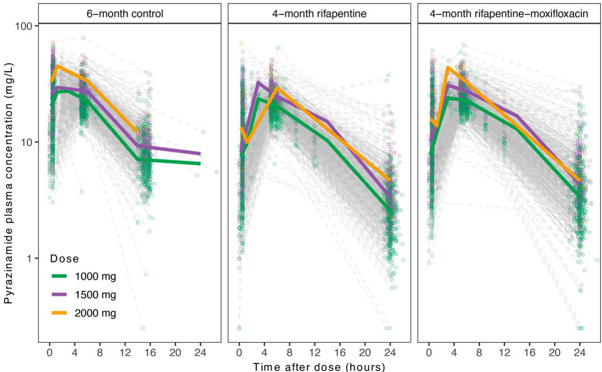
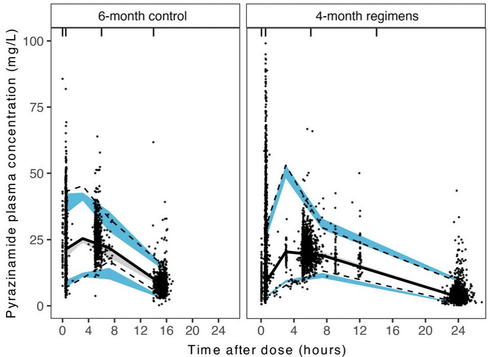
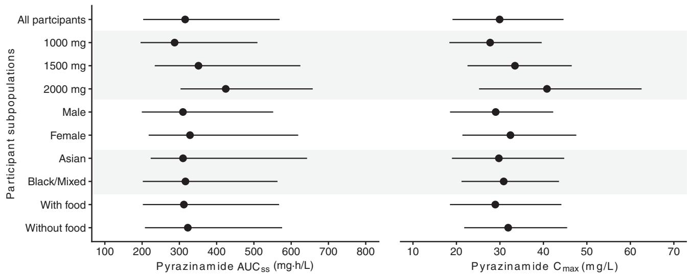
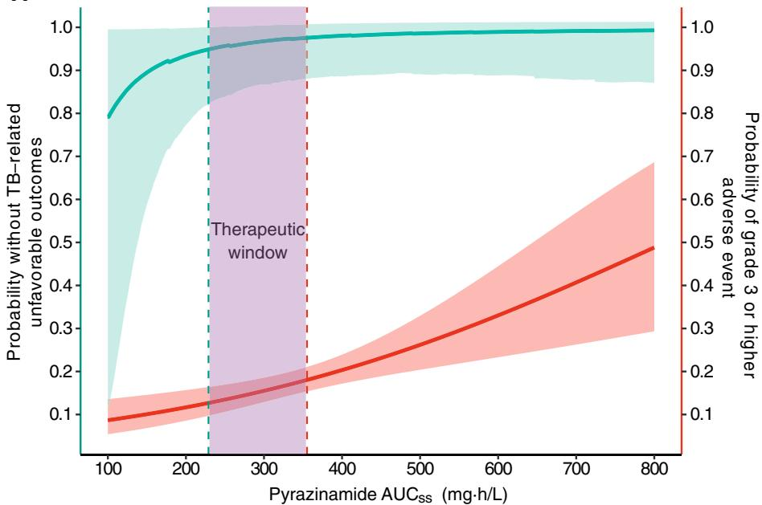
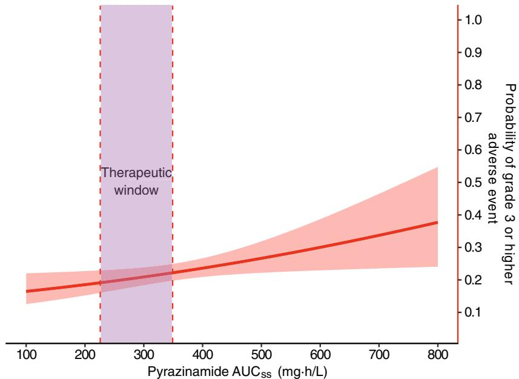
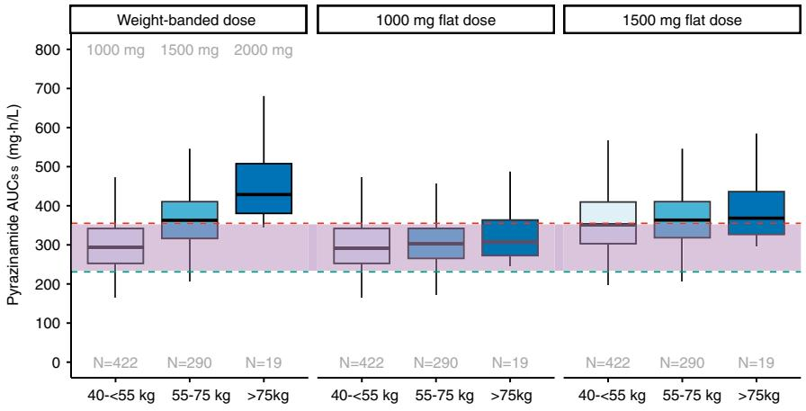
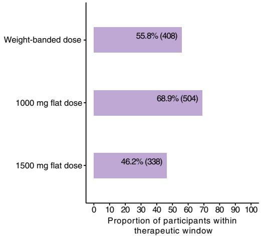
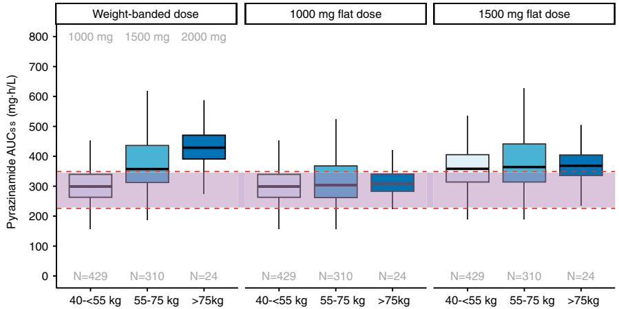
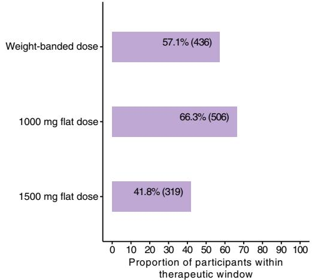

# Pyrazinamide Safety, Efficacy, and Dosing for Treating Drug-Susceptible Pulmonary Tuberculosis

A Phase 3, Randomized Controlled Clinical Trial

Ava Y. Xu1,2, Gustavo E. Velasquez  3,4, Nan Zhang1,3, Vincent K. Chang1,3, Patrick P. J. Phillips3,5, Payam Nahid3,5, Susan E. Dorman6 , Ekaterina V. Kurbatova7 , William C. Whitworth7 , Erin Sizemore7 , Kia Bryant7 , Wendy Carr7 , Nicole E. Brown7 , Melissa L. Engle8 , Nguyen Viet Nhung9,10, Pheona Nsubuga11, Andreas Diacon12, Kelly E. Dooley13, Richard E. Chaisson14, Susan Swindells15, and Radojka M. Savic1,3; Tuberculosis Trials Consortium (TBTC) Study 31/AIDS Clinical Trials Group (ACTG) A5349 Study Team

1 Department of Bioengineering and Therapeutic Sciences, 2 Bakar Computational Health Sciences Institute, 3 UCSF Center for Tuberculosis, 4 Division of HIV, Infectious Diseases, and Global Medicine, and 5 Division of Pulmonary and Critical Care Medicine, University of California, San Francisco, San Francisco, California; 6 Medical University of South Carolina, Charleston, South Carolina; 7 CDC, Atlanta, Georgia; 8 University of Texas Health Science Center at San Antonio and the South Texas Veterans Health Care System, San Antonio, Texas; 9 Vietnam National Tuberculosis Program–University of California, San Francisco Research Collaboration Unit, Hanoi, Vietnam; 10University of Medicine and Pharmacy, Vietnam National University, Hanoi, Vietnam; 11Uganda–Case Western Reserve University Research Collaboration, Kampala, Uganda; 12TASK, Cape Town, South Africa; 13Division of Infectious Diseases, Vanderbilt University Medical Center, Nashville, Tennessee; 14School of Medicine, John Hopkins University, Baltimore, Maryland; and 15University of Nebraska Medical Center, Omaha, Nebraska

ORCID IDs: 0000-0002-9222-1227 (A.Y.X.); 0000-0003-1438-0692 (G.E.V.); 0000-0002-6336-7024 (P.P.J.P.); 0000-0003-2811-1311 (P.N.); 0000-0001-6882-9470 (S.E.D.); 0000-0001-5306-548X (W.C.W.); 0000-0003-3232-0546 (E.S.); 0000-0002-3184-0550 (N.E.B.); 0000-0001-9013-5256 (K.E.D.).

# Abstract

Rationale: Optimizing pyrazinamide dosing is critical to improve treatment efficacy while minimizing toxicity during tuberculosis treatment. Study 31/AIDS Clinical Trials Group A5349 represents the largest phase 3 randomized controlled therapeutic trial to date for such an investigation.

Objectives: We sought to report pyrazinamide pharmacokinetic parameters, risk factors for lower pyrazinamide exposure, and relationships between pyrazinamide exposure and efficacy and safety outcomes. We aimed to determine pyrazinamide dosing strategies that optimize risks and benefits.

Methods: We analyzed pyrazinamide steady-state pharmacokinetic data using population nonlinear mixed-effects models. We evaluated the contribution of pyrazinamide exposure to long-term efficacy using parametric time-to-event models and safety outcomes using logistic regression. We evaluated optimal dosing with therapeutic windows targeting >95% durable cure and safety within the observed proportion of the primary safety outcome.

Measurements and Main Results: Among 2,255 participants with 6,978 plasma samples, pyrazinamide displayed sevenfold exposure variability (151–1,053 mgh/L). Body weight was not a clinically relevant predictor of drug clearance and thus did not justify the need for weight-banded dosing. Both clinical and safety outcomes were associated with pyrazinamide exposure, resulting in therapeutic windows of 231–355 mg h/L for the control and 226–349 mg h/L for the rifapentine–moxifloxacin regimen. Flat dosing of pyrazinamide at 1,000 mg would have permitted an additional 13.1% (n = 96) of participants allocated to the control and 9.2% (n = 70) to the rifapentine–moxifloxacin regimen dosed within the therapeutic window, compared with the current weight-banded dosing.

Conclusions: Flat dosing of pyrazinamide at 1,000 mg/d would be readily implementable and could optimize treatment outcomes in drug-susceptible tuberculosis.

Clinical trial registered with www.clinicaltrials.gov (NCT 02410772).

Keywords: tuberculosis; pyrazinamide; population pharmacokinetics; dose–response; exposure–response

(Received in original form January 18, 2024; accepted in final form July 12, 2024)

This article is open access and distributed under the terms of the Creative Commons Attribution Non-Commercial No Derivatives License 4.0. For commercial usage and reprints, please e-mail Diane Gern (dgern@thoracic.org).

Am J Respir Crit Care Med Vol 210, Iss 11, pp 1358–1369, Dec 1, 2024

Copyright © 2024 by the American Thoracic Society

Originally Published in Press as DOI: 10.1164/rccm.202401-0165OC on July 16, 2024

Internet address: www:atsjournals:org

# At a Glance Commentary

# Scientific Knowledge on the

Subject: The current pyrazinamide weight-banded dosing strategy for drug-susceptible tuberculosis evolved because of concerns about high-dose pyrazinamide’s role in hepatoxicity. Balancing efficacy and safety for pyrazinamide use remains challenging because of pharmacokinetic variability and unclear exposure–response relationships.

# What This Study Adds to the

Field: We performed the largest pyrazinamide exposure–response and safety analysis to date in relation to participant factors and clinically relevant treatment outcomes. Our evidence shows that flat dosing of pyrazinamide at 1,000 mg/d provides a better balance of risks and benefits over the current weight-banded dosing.

Tuberculosis (TB) remains a significant global health challenge, with 10.6 million new cases and 1.3 million deaths reported by the World Health Organization in 2022 (1). Pyrazinamide plays a crucial role in the treatment of TB by killing nonreplicating persisters that other companion drugs fail to kill (2–4). The current pyrazinamide dose was determined from historic clinical trials, but the rationale behind it remains a subject of ongoing debate. Before 1970, high daily doses (3,000 mg) and prolonged use of pyrazinamide were believed to lead to hepatotoxicity, limiting its use as a firstline agent for TB treatment (5, 6). Subsequent trials explored lower daily doses (1,000–2,000 mg or 16–34 mg/kg) in combination with rifampicin, shortening treatment duration to 6 months with acceptable toxicity (7–10). These findings led to the adoption of the standard 6-month treatment with pyrazinamide for the initial 2 months. Currently, the World Health Organization and U.S. treatment guidelines recommend a daily dose of 20–30 mg/kg for most persons, with a maximum of 2,000 mg for drug-susceptible TB (11, 12).

Achieving a balance between efficacy and safety in pyrazinamide dosing has been challenging because of interindividual pharmacokinetic (PK) variability and the lack of a clear relationship between exposure and treatment outcomes. Previous studies suggested that various factors, including sex (13–15), body weight (13, 14, 16–20), food intake (21–26), and immune function changes (14, 15, 27), are associated with interindividual PK variability of pyrazinamide, but these findings have been inconsistent across studies. Furthermore, PK–pharmacodynamic (PKPD) and simulation studies suggest higher doses might achieve increased efficacy (28, 29). However, increasing pyrazinamide dose raises concerns about potential drug-related toxicities.

The TB Trials Consortium (TBTC) and the AIDS Clinical Trials Group (ACTG) conducted a landmark international, multicenter, phase 3 trial, TBTC Study 31/ACTG A5349 (S31/A5349; NCT 02410772), which demonstrated the noninferiority of a 4-month rifapentine–moxifloxacin–containing regimen compared with the 6-month control (30, 31). This trial collected the most diverse and robust PK dataset to date with long-term clinically relevant outcomes. The objectives of our analysis were to 1) develop a nonlinear population PK model that can describe pyrazinamide plasma concentration–time trajectories, 2) identify covariates predisposing subpopulations at risk for pyrazinamide underexposure, 3) understand the contribution of pyrazinamide exposure on efficacy and safety outcomes, and 4) evaluate an alternative dosing strategy in comparison with current weight-banded dosing.

# Methods

# Study Design and PK Sampling

The trial was approved by the CDC Institutional Review Board (IRB). Each participating institution provided for the review and approval of this protocol and its

Supported by CDC, National Center for HIV/AIDS, Viral Hepatitis, STD, and Tuberculosis Prevention, Division of Tuberculosis Elimination contracts 200-2009-32582, 200-2009-32593, 200-2009-32594, 200-2009-32589, 200-2009-32597, 200-2009-32598, 75D30119C06702, 75D30119C06701, 75D30119C06703, 75D30119C06222, 75D30119C06225, and 75D30119C06010; National Institute of Allergy and Infectious Diseases, NIH, awards UM1 AI068634, UM1 AI068636, and UM1 AI106701; National Institute of Allergy and Infectious Diseases, NIH, grants K08 AI141740 (G.E.V.); grants K24 AI150349 (K.E.D.), and R01 AI126788 and R01 AI135124 (R.M.S). Sanofi donated all the study drugs in this trial, supported shipping of study drugs to all sites, and provided funding support for pharmacokinetic testing and preparation of the final clinical study report in this collaborative study. The study sponsors had no role in the study design, data collection, data analysis, data interpretation, or writing of the paper. The findings and conclusions in this report are those of the authors and do not necessarily represent the official position of the CDC, the National Institute of Allergy and Infectious Diseases, or the U.S. Department of Health and Human Services.

Author Contributions: Substantial contributions to the conception or design of the S31/A5349 trial and pharmacokinetic study designs: P.P.J.P., P.N., S.E.D., K.E.D., R.E.C., S.S., and R.M.S. Substantial contribution to conception or design of the work: A.Y.X., G.E.V., N.Z., V.K.C., and R.M.S. Data acquisition: E.V.K., W.C.W., E.S., K.B., W.C., N.E.B., M.L.E., N.V.N., P.N., and A.D. Data analysis: A.Y.X. Data interpretation: A.Y.X., G.E.V., P.P.J.P., E.V.K., P.N., S.S., N.E.B., K.E.D., and R.M.S. All authors contributed to the intellectual content of the manuscript and approved the manuscript version submitted for publication.

Data Sharing Statement: The standardized, individual data for the S31/A5349 trial (NCT 02410772) that support the development of this study are currently in the preparation of data deidentification. Once deidentified data are ready, the full dataset, including data dictionaries, will be made available, likely in a data repository format with specific access rules. Please note that no time estimates for the release of the full dataset are available at present.

Correspondence and requests for reprints should be addressed to Radojka M. Savic, Ph.D., Department of Bioengineering and Therapeutic Sciences, University of California, San Francisco, 1700 Fourth Street, Room 503C, UCSF Box 2552, San Francisco, CA 94158. E-mail: rada.savic@ucsf.edu.

This article has a related editorial.

A data supplement for this article is available via the Supplements tab at the top of the online article.

informed consent documents by a local IRB or ethics committee or relied formally on the CDC IRB approval.

S31/A5349 enrolled participants >12 years of age with drug-susceptible pulmonary TB. Participants were randomly assigned to one of three regimens, all containing pyrazinamide: a 6-month control regimen comprising isoniazid, rifampicin, pyrazinamide, and ethambutol (control regimen); a 4-month regimen comprising isoniazid, rifapentine, pyrazinamide, and ethambutol (rifapentine regimen); and a 4-month regimen comprising isoniazid, rifapentine, pyrazinamide, and moxifloxacin (rifapentine–moxifloxacin regimen). Pyrazinamide was administered once daily for 7 days per week during the initial 2 months according to weight bands at 1,000 mg for 40 to ,55 kg, 1,500 mg for 55–75 kg, and 2,000 mg for .75 kg. The two 4-month regimens were administered within 1 hour after food intake, and the 6-month control regimen was administered without food.

Plasma samples were collected during visits from Weeks 2–8. Intensive sampling was performed on a small subset of participants allocated to 4-month regimens at 0.5, 3, 5, 9, 12, and 24 hours after dosing. All other participants underwent sparse sampling at 0.5 and 5–8 hours after dosing for 4-month regimens and at 0.5, 5–8, and 16 hours after dosing for the 6-month control. Plasma concentrations were measured using validated HPLC assays.

# Modeling Software and Methods

We randomly divided PK data into analysis dataset (two-thirds) for model development and a validation dataset (one-third) for model validation. We analyzed PK data using nonlinear mixed-effects modeling with NONMEM version 7.5 (ICON Development Solutions), followed standard procedures, and included covariates in the final PK model on the basis of statistical significance, scientific plausibility, and clinical relevance.

# PK Efficacy and PK Safety Analysis

We used steady-state area under the concentration–time curve $( \mathrm { A U C } _ { \mathrm { s s } } )$ and peak concentration $\mathrm { ( C _ { m a x } ) }$ as the markers of pyrazinamide exposure in efficacy and safety analyses. The primary efficacy outcome was time to TB-related unfavorable outcomes over 12 months of follow-up after randomization, while the primary safety outcome was any grade 3 or higher adverse event during the on-treatment period. We defined the therapeutic window for pyrazinamide by examining the relationship between exposure markers and primary efficacy and safety outcomes, which served as a close representation of treatment response. We bounded the therapeutic window such that >95% of participants would achieve durable cure and <18% would have grade 3 or higher adverse events, reflecting the observed performance of the noninferior 4-month rifapentine–moxifloxacin regimen (31). Additional safety outcomes used were aligned with the original trial publication by Dorman and colleagues (31). We evaluated the contribution of pyrazinamide exposure to the primary efficacy outcome using parametric time-to-event models. We performed safety analyses controlling for age using logistic regression and considered tests with two-sided P , 0.05 as statistically significant. We also conducted a sensitivity analysis assessing adverse events 2 months after treatment initiation when pyrazinamide was discontinued.

# Dosing Simulations

We performed Monte Carlo simulations with the final PK model to compare the current weight-banded and proposed flat dosing strategies at 1,000 and 1,500 mg/d, regardless of body weight. Further methodologic details are available in the data supplement.

# Results

# Data Characteristics

A total of 2,255 participants in S31/A5349 had pyrazinamide PK data available and were included in the analysis. The final dataset included 6,978 evaluable PK samples (Table 1). Table 1 includes the baseline demographic and clinical characteristics of the study participants in cohorts for PK modeling (e.g., analysis, validation, and full). Figure 1 shows plasma pyrazinamide concentration–time profiles stratified by treatment regimens and doses. In each treatment arm, dose-dependent exposure and linear elimination were observed across all dose levels. The time to reach pyrazinamide $\mathrm { C } _ { \mathrm { m a x } }$ appeared to be delayed in the 4-month regimens compared with the 6-month control.

# Pyrazinamide Population PK Model

Pyrazinamide’s PK profile was best described with a one-compartment disposition with first-order linear elimination and first-order absorption with one absorption transit compartment (see Figure E1 in the data supplement). The apparent clearance of pyrazinamide was 3.53 L/h, and the apparent volume of distribution in the central compartment was 33.4 L, resulting in a terminal half-life of 6.6 hours (Table 2). As only nine (0.1%) evaluable PK samples were below the limit of quantification at 0.5 mg/L, we used half of the limit of quantification at 0.25 mg/L as the concentration for these samples in modeling. The final PK model demonstrated a moderate fit to the observed data (Figures 2 and E2). The reestimated PK parameters for the full cohort (analysis and validation cohort) were not substantially different from the parameter estimates from the analysis cohort for model development (see Table E1).

# Impact of Covariates on Pyrazinamide’s PK Profile

Higher pyrazinamide doses at 1,500 and 2,000 mg resulted in lower apparent bioavailability at 80% and 70% relative to 1,000 mg, respectively (Table 2). Women had 16.3% higher apparent bioavailability compared with men. Participants who selfreported Asian race showed a 41.8% lower absorption mean transit time compared with those who self-reported Black or mixed race. The differences observed in the absorption of pyrazinamide were further explained by food effects. The 6-month control regimen was administered on an empty stomach to maximize rifampicin absorption (22, 25), whereas the 4-month regimens were administered with food to maximize rifapentine absorption (32). Receipt of the treatment regimen while fasting decreased pyrazinamide absorption mean transit time by 51.9%.

We evaluated pyrazinamide $\mathrm { A U C } _ { \mathrm { s s } }$ and $\mathrm { C } _ { \mathrm { m a x } }$ distributions stratified by covariates associated with interindividual PK variability of pyrazinamide, including dose, sex, race, and food effects (Figure 3). Notably, the median (2.5th to 97.5th percentile range) of $\mathrm { A U C } _ { \mathrm { s s } }$ was 351 (234–625) mg h/L for the 1,500-mg group and 424 (303–658) mg h/L for the 2,000-mg group, both higher than 287 (196–510) mgh/L in the 1,000-mg group. Similarly, the median (2.5th to 97.5th percentile range) of $\mathrm { C } _ { \mathrm { m a x } }$ was 33.5 (22.5–46.5) mg/L for the 1,500-mg group and 40.8 (25.2–62.6) mg/L for the 2,000-mg group, both higher than 27.8 (18.4–39.6) mg/L in the 1,000-mg group.

Table 1. Participant Characteristics 

<table><tr><td></td><td>Analysis Cohort (n = 1,503)</td><td>Validation Cohort (n = 752)</td><td>Full Cohort (n = 2,255)</td></tr><tr><td colspan="4">Demographics</td></tr><tr><td colspan="4">Arm</td></tr><tr><td>6-mo control</td><td>489 (33)</td><td>242 (32)</td><td>731 (32)</td></tr><tr><td>4-mo rifapentine</td><td>515 (34)</td><td>246 (33)</td><td>761 (34)</td></tr><tr><td>4-mo rifapentine-moxifloxacin</td><td>499 (33)</td><td>264 (35)</td><td>763 (34)</td></tr><tr><td colspan="4">Pyrazinamide daily dose</td></tr><tr><td>1,000 mg</td><td>875 (58)</td><td>447 (59)</td><td>1,322 (59)</td></tr><tr><td>1,500 mg</td><td>587 (39)</td><td>277 (37)</td><td>864 (38)</td></tr><tr><td>2,000 mg</td><td>41 (3)</td><td>28 (4)</td><td>69 (3)</td></tr><tr><td>Age, yr</td><td>31 (13–77)</td><td>31 (14–81)</td><td>31 (13–81)</td></tr><tr><td>Male sex</td><td>1,068 (71)</td><td>532 (71)</td><td>1,600 (71)</td></tr><tr><td>Height, cm</td><td>167 (140–200)</td><td>167 (140–194)</td><td>167 (140–200)</td></tr><tr><td>Weight, kg</td><td>53 (40–118)</td><td>53 (40–122)</td><td>53 (40–122)</td></tr><tr><td>BMI, kg/m2</td><td>19.0 (13.4–40.9)</td><td>19.1 (12.8–45.4)</td><td>19.0 (12.8–45.4)</td></tr><tr><td colspan="4">Race</td></tr><tr><td>Black</td><td>1,057 (70)</td><td>544 (72)</td><td>1,601 (71)</td></tr><tr><td>Asian</td><td>176 (12)</td><td>88 (12)</td><td>264 (12)</td></tr><tr><td>Mixed/multiracial</td><td>248 (17)</td><td>111 (15)</td><td>359 (16)</td></tr><tr><td>White</td><td>22 (1)</td><td>9 (1)</td><td>31 (1)</td></tr><tr><td>Sub-Saharan African site</td><td>1,120 (75)</td><td>562 (75)</td><td>1,682 (75)</td></tr><tr><td colspan="4">Clinical factors</td></tr><tr><td colspan="4">Cavitation on chest radiograph*</td></tr><tr><td>Absent</td><td>392 (26)</td><td>186 (25)</td><td>578 (26)</td></tr><tr><td>&lt;4 cm</td><td>509 (34)</td><td>240 (32)</td><td>749 (33)</td></tr><tr><td>≥4 cm</td><td>595 (40)</td><td>317 (42)</td><td>912 (40)</td></tr><tr><td colspan="4">Extent of disease on chest radiograph*</td></tr><tr><td>Lesions &lt;25% thoracic area</td><td>263 (18)</td><td>128 (17)</td><td>391(17)</td></tr><tr><td>Lesions 25% to &lt;50% thoracic area</td><td>657 (44)</td><td>342 (46)</td><td>999 (44)</td></tr><tr><td>Lesions ≥50% thoracic area</td><td>576 (38)</td><td>273 (36)</td><td>849 (38)</td></tr><tr><td colspan="4">WHO smear grade†</td></tr><tr><td>Negative</td><td>53 (4)</td><td>27 (4)</td><td>80 (4)</td></tr><tr><td>Scanty or 1–9 acid-fast bacilli</td><td>254 (17)</td><td>137 (18)</td><td>391 (17)</td></tr><tr><td>1+</td><td>347 (23)</td><td>167 (22)</td><td>514 (23)</td></tr><tr><td>2+</td><td>456 (30)</td><td>212 (28)</td><td>668 (30)</td></tr><tr><td>3+</td><td>392 (26)</td><td>207 (28)</td><td>599 (27)</td></tr><tr><td>Karnofsky score</td><td>90 (60–100)</td><td>90 (60–100)</td><td>90 (60–100)</td></tr><tr><td>Living with HIV‡</td><td>124 (8)</td><td>61 (8)</td><td>185 (8)</td></tr><tr><td>History of diabetes</td><td>44 (3)</td><td>25 (3)</td><td>69 (3)</td></tr><tr><td colspan="4">Evaluable PK samples</td></tr><tr><td>Total evaluable</td><td>4,633</td><td>2,345</td><td>6,978</td></tr><tr><td>Intensive sampling (&gt;6 samples)</td><td>266 (6)</td><td>171 (7)</td><td>437 (6)</td></tr><tr><td>Below limit of quantification</td><td>4 (0.09)</td><td>5 (0.2)</td><td>9 (0.1)</td></tr></table>

Definition of abbreviations: BMI = body mass index; PK = pharmacokinetic; WHO = World Health Organization.   
Data are expressed as n (%); continuous variables are expressed as median (range). The entire PK dataset was split into model analysis and validation cohorts. The split was performed by randomly stratifying participants on the basis of clinical site and HIV status, which aligned with the original trial design.   
\*Sixteen participants were missing chest X-ray readouts.   
† Three participants were missing WHO smear grade.   
‡ One participant had unknown HIV status.

# Pyrazinamide PK Efficacy and PK Safety

All participants with PK data (n = 2,255) were included in the safety analysis, and those in the microbiologically eligible population (n = 2,136) were included in the efficacy and tolerability analyses. $\mathrm { A s } \mathrm { C } _ { \mathrm { m a x } }$ was more variable and less sensitive than $\mathrm { A U C } _ { \mathrm { s s } }$ in predicting treatment response, we chose $\mathrm { A U C } _ { \mathrm { s s } }$ as the PK exposure of choice in the subsequent analyses (see the data supplement for more details). From our PKPD analysis, we found that decreasing pyrazinamide $\mathrm { A U C } _ { \mathrm { s s } }$ lower Xpert MTB/RIF (Cepheid) cycle threshold, and older age were associated with an increased hazard of TB-related unfavorable outcomes in the 6-month control (see Tables E2 and E3). In contrast, in the 4-month regimens, rifapentine exposure was the most important factor influencing the hazard of TB-related unfavorable outcomes. After accounting for

rifapentine exposure, adding pyrazinamide exposure did not improve prediction in the 4-month regimens.

After controlling for age, increasing pyrazinamide $\mathrm { A U C } _ { \mathrm { s s } }$ was associated with multiple safety outcomes in the 6-month control and 4-month rifapentine–moxifloxacin regimen (Figure 4; see Tables E4–E8). For the 6-month control, after adjustment for age, each 100 mg h/L increase in pyrazinamide $\mathrm { A U C } _ { \mathrm { s s } }$ was associated with increased risk of

  
Figure 1. Observed pyrazinamide plasma concentration with respect to time after dose. Circles represent individual samples, and solid lines represent medians. Data are stratified by treatment regimens (left, 6-month control; middle, 4-month rifapentine-containing regimen; right, 4-month rifapentine–moxifloxacin–containing regimen) and by dose (green, 1,000 mg; purple, 1,500 mg; yellow, 2,000 mg).

Table 2. Bootstrap of Final Pyrazinamide Population Pharmacokinetic Model 

<table><tr><td rowspan="2">Parameter</td><td colspan="3">Final Full Model</td></tr><tr><td>Estimate</td><td>95% CI</td><td>RSE (%)</td></tr><tr><td colspan="4">Typical values</td></tr><tr><td>CL/F, L/h</td><td>3.53</td><td>3.47–3.58</td><td>0.8</td></tr><tr><td>Vc/F, L</td><td>33.4</td><td>32.9–33.9</td><td>0.8</td></tr><tr><td>DOSE $_F$  (1,500 mg)</td><td>0.80</td><td>0.78–0.81</td><td>0.9</td></tr><tr><td>DOSE $_F$  (2,000 mg)</td><td>0.70</td><td>0.66–0.73</td><td>2.4</td></tr><tr><td>MTT, h</td><td>1.31</td><td>1.24–1.36</td><td>2.0</td></tr><tr><td colspan="4">Covariate effects</td></tr><tr><td>% Increase in FEMALE $_F$ </td><td>16.3</td><td>13.8–18.7</td><td>6.3</td></tr><tr><td>% Decrease in RACE $_{MTT}$ </td><td>41.8</td><td>28.9–49.2</td><td>8.4</td></tr><tr><td>% Decrease in FOOD $_{MTT}$ </td><td>51.9</td><td>47.0–55.9</td><td>3.7</td></tr><tr><td colspan="4">IIV</td></tr><tr><td>%CV* for IIV CL/F</td><td>25.1</td><td>23.8–26.3</td><td>2.1</td></tr><tr><td>%CV* for IIV of MTT</td><td>95.8</td><td>91.7–98.6</td><td>1.7</td></tr><tr><td colspan="4">Residual variability</td></tr><tr><td>SD of additive residual error</td><td>0.47</td><td>0.38–0.56</td><td>8.6</td></tr><tr><td>% Increase in residual error</td><td>17.5</td><td>16.3–18.6</td><td>3.2</td></tr></table>

Definition of abbreviations: CI = confidence interval; CL/F = apparent clearance; CV = coefficient of variation; $\mathsf { D O S E } _ { \mathsf { F } } \left( 1 , 5 0 0 \mathrm { \ m g } \right) = \mathsf { a p p a r e n t }$ bioavailability of 1,500-mg dose; DOSEF (2,000 mg) = apparent bioavailability of 2,000-mg dose; FEMALEF = bioavailability for female sex; $\mathsf { F O O D } _ { \mathsf { M T } } = \dot { \mathsf { m e a n } }$ transit time at fasting state; IIV = interindividual variability; MTT = mean transit time; ${ \mathsf { R A C E } } _ { { \mathrm { M T T } } } = { \mathsf { m e a n } }$ transit time for Asian relative to Black and mixed race; RSE = relative SE; Vc/F = apparent volume of distribution of central compartment. $\mathsf { M } \mathsf { T } \tau = ( 1 + \mathsf { F O } \mathsf { O } \mathsf { D } _ { \mathsf { M } \mathsf { T } } \times \mathsf { F O } \mathsf { O } \mathsf { D } ) \times ( 1 + \mathsf { R } \mathsf { A } \mathsf { C } \mathsf { E } _ { \mathsf { M } \mathsf { T } } \times \mathsf { R } \mathsf { A } \mathsf { C } \mathsf { E } )$ , where $\mathsf { F O O D } = 0 \ \mathrm { o r } \ $ 1 for 6-month control or two 4-month regimens, respectively; ${ \mathsf { R A C E } } = 0 ~ { \mathsf { O r } } ~ 1$ for Black/mixed race or Asian race. F = (1 1 FEMALEF 3 FEMALE) 3 (DOSEF), where FEMALE = 0 or 1 for male or female; DOSEF was estimated separately for higher doses (e.g., 1,500 or 2,000 mg) assuming reference 1,000 mg with apparent bioavailability of 1. \*Defined as $\% 0 \% = 1 0 0 \times 8 0 \mathsf { r t } [ \mathsf { e x p } ( \boldsymbol { \omega } ^ { 2 } ) - 1 ]$ , where $\omega ^ { 2 }$ is the variation of the interindividual random effects.

line

| Time after dose (hours) | 6-month control (mg/L) | 4-month regimens (mg/L) |
| ----------------------- | ---------------------- | ------------------------ |
| 0                       | ~100                   | ~100                     |
| 4                       | ~40                    | ~50                      |
| 8                       | ~25                    | ~30                      |
| 12                      | ~15                    | ~20                      |
| 16                      | ~10                    | ~10                      |
| 20                      | ~5                     | ~5                       |
| 24                      | ~2                     | ~2                       |

Figure 2. Prediction-corrected visual predictive checks for the full cohort. Visual predictive checks for data are stratified by 6-month control and 4-month investigational regimens. Dots show observed pyrazinamide plasma concentration, solid lines show the median of the observed data, dashed lines show the 5th and 95th percentiles of the observed data, and shaded areas show 95% confidence intervals of the 5th percentile (blue), median (gray), and 95th percentile (blue) of model predicted simulations.

grade 3 or higher adverse events (adjusted odds ratio [aOR], 1.39 [95% confidence interval (CI), 1.16–1.67]), grade 3 or higher treatment-related adverse events (aOR, 1.45 [95% CI, 1.16–1.80]), discontinuation of assigned treatment for any adverse event (aOR, 2.40 [95% CI, 1.19–4.80]), total bilirubin 3 times or above the upper limit of the normal range (ULN) (aOR, 2.21 [95% CI, 1.31–3.76]), alanine aminotransferase or aspartate aminotransferase >5 times ULN (aOR, 1.66 [95%, 1.14–2.35]), serious adverse events (aOR, 1.54 [95% CI, 1.18–1.99]), and Hy’s law (aOR, 2.01 [95% CI, 1.07–3.46]). For the 4-month rifapentine–moxifloxacin regimen, after adjusting for age, each 100 mg h/L increase in pyrazinamide $\mathrm { \ A U C _ { \mathrm { s s } } }$ was associated with increased risk of grade 3 or higher adverse events (aOR, 1.22 [95% CI, 1.03–1.43]), grade 3 or higher treatmentrelated adverse events (aOR, 1.36 [95% CI,

scatter

| Participant subpopulations | Pyrazinamide AUCss (mg·h/L) | Pyrazinamide Cmax (mg/L) |
| -------------------------- | ---------------------------- | ------------------------ |
| All participants            | 300                          | 30                       |
| 1000 mg                    | 280                          | 28                       |
| 1500 mg                    | 350                          | 33                       |
| 2000 mg                    | 420                          | 41                       |
| Male                       | 300                          | 29                       |
| Female                     | 320                          | 32                       |
| Asian                      | 300                          | 29                       |
| Black/Mixed                | 300                          | 31                       |
| With food                  | 300                          | 29                       |
| Without food               | 320                          | 31                       |

Figure 3. Dose stratification with respect to PK metrics. Model-derived PK metrics are depicted, stratified by covariates associated with interindividual PK variability of pyrazinamide (dose, sex, race, and food effects). Black lines show the 2.5th percentile to 97.5th percentile range of pyrazinamide $\mathsf { A U C } _ { \mathsf { s s } }$ and $\complement _ { \mathrm { { m a x } } }$ distributions. Dots show stratified median values for each respective group with alternating shades. $\mathsf { A U C } _ { \mathsf { s s } } = \mathsf { s t e a d y }$ -state area under the concentration–time curve; $\mathsf { C } _ { \mathsf { m a x } } = \mathsf { p e a k }$ concentration; PK = pharmacokinetic.

A 

<table><tr><td>6-month control</td><td colspan="2">Event rate (%, n/N)</td><td>Odds ratio (95% CI)</td></tr><tr><td>Primary safety outcome</td><td></td><td></td><td></td></tr><tr><td>Grade ≥3 adverse event</td><td>17.65 (129/731)</td><td>1.39 (1.16–1.67)</td><td></td></tr><tr><td>Secondary safety outcome</td><td></td><td></td><td></td></tr><tr><td>Grade ≥3 treatment-related adverse event</td><td>9.58 (70/731)</td><td>1.45 (1.16–1.80)</td><td></td></tr><tr><td>Other safety outcomes</td><td></td><td></td><td></td></tr><tr><td>Discontinuation of assigned treatment for any adverse event</td><td>0.27 (2/731)</td><td>2.40 (1.19–4.80)</td><td></td></tr><tr><td>Serum total bilirubin ≥3xULN</td><td>0.68 (5/731)</td><td>2.21 (1.31–3.76)</td><td></td></tr><tr><td>ALT or AST ≥5xULN</td><td>2.05 (15/731)</td><td>1.66 (1.14–2.35)</td><td></td></tr><tr><td>ALT or AST ≥10xULN</td><td>0.68 (5/731)</td><td>1.51 (0.73–2.51)</td><td></td></tr><tr><td>Serious adverse event</td><td>5.47 (40/731)</td><td>1.54 (1.18–1.99)</td><td></td></tr><tr><td>Hy&#x27;s law</td><td>0.55 (4/731)</td><td>2.01 (1.07–3.46)</td><td></td></tr><tr><td>Death</td><td>0.55 (4/731)</td><td>1.06 (0.32–2.17)</td><td></td></tr><tr><td>Premature discontinuation of assigned regimen in the microbiologically eligible population</td><td></td><td></td><td></td></tr><tr><td>Discontinuation of assigned regimen for any reason</td><td>5.23 (36/688)</td><td>1.00 (0.68–1.41)</td><td></td></tr></table>

B 

<table><tr><td>4-month rifapentine regimen</td><td>Event rate (%, n/N)</td><td>Odds ratio (95% CI)</td></tr><tr><td colspan="3">Primary safety outcome</td></tr><tr><td>Grade ≥3 adverse event</td><td>14.06 (107/761)</td><td>1.16 (0.90–1.47)</td></tr><tr><td colspan="3">Secondary safety outcome</td></tr><tr><td>Grade ≥3 treatment-related adverse event</td><td>7.23 (55/761)</td><td>0.95 (0.65–1.33)</td></tr><tr><td colspan="3">Other safety outcomes</td></tr><tr><td>Discontinuation of assigned treatment for any adverse event</td><td>0.92 (7/761)</td><td>1.16 (0.41–2.41)</td></tr><tr><td>Grade ≥3 adverse event within 28 weeks post-randomization</td><td>16.29 (124/761)</td><td>1.10 (0.86–1.39)</td></tr><tr><td>Serum total bilirubin ≥3xULN</td><td>1.97 (15/761)</td><td>1.46 (0.81–2.38)</td></tr><tr><td>ALT or AST ≥5xULN</td><td>1.45 (11/761)</td><td>1.17 (0.54–2.15)</td></tr><tr><td>ALT or AST ≥10xULN</td><td>0.39 (3/761)</td><td>1.11 (0.21–3.37)</td></tr><tr><td>Serious adverse event</td><td>4.20 (32/761)</td><td>1.27 (0.83–1.84)</td></tr><tr><td>Hy&#x27;s law</td><td>0.66 (5/761)</td><td>0.81 (0.20–2.27)</td></tr><tr><td>Death</td><td>0.39 (3/761)</td><td>1.42 (0.33–3.71)</td></tr><tr><td colspan="3">Premature discontinuation of assigned regimen in the microbiologically eligible population</td></tr><tr><td>Discontinuation of assigned regimen for any reason</td><td>2.07 (15/726)</td><td>0.98 (0.47–1.76)</td></tr></table>

C 

<table><tr><td>4-month rifapentine-moxifloxacin regimen</td><td colspan="2">Event rate (% , n/N)</td><td>Odds ratio (95% CI)</td></tr><tr><td>Primary safety outcome</td><td></td><td></td><td></td></tr><tr><td>Grade ≥3 adverse event</td><td>18.22 (139/763)</td><td>1.22 (1.03–1.43)</td><td></td></tr><tr><td>Secondary safety outcome</td><td></td><td></td><td></td></tr><tr><td>Grade ≥3 treatment-related adverse event</td><td>12.19 (93/763)</td><td>1.36 (1.13–1.63)</td><td></td></tr><tr><td>Other safety outcomes</td><td></td><td></td><td></td></tr><tr><td>Discontinuation of assigned treatment for any adverse event</td><td>0.66 (5/763)</td><td>1.97 (1.17–3.12)</td><td></td></tr><tr><td>Grade ≥3 adverse event within 28 weeks post-randomization</td><td>22.67 (173/763)</td><td>1.16 (0.99–1.35)</td><td></td></tr><tr><td>Serum total bilirubin ≥3xULN</td><td>2.49 (19/763)</td><td>1.82 (1.35–2.42)</td><td></td></tr><tr><td>ALT or AST ≥5xULN</td><td>1.70 (13/763)</td><td>1.38 (0.88–1.98)</td><td></td></tr><tr><td>ALT or AST ≥10xULN</td><td>0.39 (3/763)</td><td>1.43 (0.53–2.72)</td><td></td></tr><tr><td>Serious adverse event</td><td>4.19 (32/763)</td><td>1.19 (0.86–1.57)</td><td></td></tr><tr><td>Hy&#x27;s law</td><td>0.92 (7/763)</td><td>1.70 (1.02–2.57)</td><td></td></tr><tr><td>Death</td><td>0.13 (1/763)</td><td>0.87 (0.06–3.33)</td><td></td></tr><tr><td>Premature discontinuation of assigned regimen in the microbiologically eligible population</td><td></td><td></td><td></td></tr><tr><td>Discontinuation of assigned regimen for any reason</td><td>2.91 (21/722)</td><td>1.41 (0.97–1.95)</td><td></td></tr></table>

Figure 4. (A–C) Adjusted odds ratios of safety outcomes for increase with pyrazinamide steady-state area under the concentration–time curve $( \bar { \mathsf { A U C } } _ { \mathbb { s } \mathbb { s } } )$ in the 6-month control (A), 4-month rifapentine (B), and 4-month rifapentine–moxifloxacin (C) regimens in the primary analysis cohort with safety and tolerability outcomes during treatment and up to 14 days after treatment discontinuation. As regimens B and C had a treatment duration of 4 months, grade 3 or higher adverse event within 28 weeks after randomization was used to compare with the 6-month control. Odds ratios were adjusted by age and calculated per 100 mgh/L increase in pyrazinamide ${ \sf A U C } _ { \sf S S } .$ . Outcome is highlighted in red if it was found to be statistically significant at $\bar { P } { < } 0 . 0 5$ . ALT = alanine aminotransferase; AST = aspartate aminotransferase; CI = confidence interval; n/N = number of participants reported for each safety outcome out of the total number of participants in the safety cohort; ULN = upper limit of the normal range.

1.13–1.63]), discontinuation of assigned treatment for any adverse event (aOR, 1.97 [95% CI, 1.17–3.12]), total bilirubin >3 times ULN (aOR, 1.82 [95% CI, 1.35–2.42]), and Hy’s law (aOR, 1.70 [95% CI, 1.02–2.57]). In our sensitivity analysis excluding adverse events occurring after pyrazinamide had been stopped, the associations between pyrazinamide exposure and trial-defined safety outcomes remained consistent (see Table E9).

On the basis of the exposure–response relationships described above, we constructed therapeutic windows: 231–355 mg h/L for the 6-month control and 226–349 mg h/L for the 4-month rifapentine–moxifloxacin regimen. As shown in Figure 5, in the 6-month control, pyrazinamide $\mathrm { \ A U C _ { \mathrm { s s } } }$ at 231 mg h/L (95% CI, 201–239 mg h/L) was associated with 95% durable cure, and pyrazinamide $\mathrm { A U C } _ { \mathrm { s s } }$ at 355 mgh/L (95% CI, 303–414 mgh/L) was associated with 18% probability of grade 3 or higher adverse events. In the 4-month rifapentine–moxifloxacin regimen, pyrazinamide $\mathrm { A U C } _ { \mathrm { s s } }$ at 349 mgh/L (95% CI, 299–405 mg h/L) was associated with 18% probability of grade 3 or higher adverse events and the fifth percentile of the pyrazinamide $\mathrm { \ A U C _ { \mathrm { s s } } }$ used for the lower bound of the therapeutic window.

# Pyrazinamide Weight-Banded Dosing versus Flat Dosing

Pyrazinamide exhibited dose-dependent bioavailability, and body weight did not significantly modulate pyrazinamide clearance (see Figures E1 and E3). We compared simulated pyrazinamide exposure distributions in the current weight-banded dosing and proposed flat dosing strategies, then calculated the proportion of participants within the respective therapeutic window (Figure 6). In the 6-month control, flat dosing of pyrazinamide at 1,000 mg achieved 68.9% (n = 504) participants within the therapeutic window, while weight-banded dosing reached 55.8% (n = 408) and flat dosing at 1,500 mg reached 46.2% (n = 338). In the 4-month rifapentine–moxifloxacin regimen, the pyrazinamide 1,000-mg flat dosing strategy achieved 66.3% (n = 506) participants within the therapeutic window, compared with 57.1% (n = 436) with weight-banded dosing and 41.8% (n = 319) with 1,500-mg flat dosing.

# Discussion

We present the largest single-trial analysis of pyrazinamide’s population PK profile to date and its relationship to treatment efficacy and safety in S31/A5349. In our analysis, pyrazinamide had sevenfold variability in $\mathrm { A U C } _ { \mathrm { s s } }$ among participants receiving weightbanded doses. The wide variability of pyrazinamide exposure poses challenges for understanding its current and future dosing in TB regimens. Our results established several findings to guide pyrazinamide dosing strategies: 1) pyrazinamide exhibits dose-related bioavailability, which does not support weight-banded dosing; 2) exposure–response relationships are likely regimen specific; and 3) flat dosing of pyrazinamide at 1,000 mg/d would be readily implementable for optimizing treatment efficacy and safety for persons receiving the 6-month control and 4-month rifapentine–moxifloxacin regimens.

Although pyrazinamide clearance is linear, we observed lower-than-doseproportional exposure with all treatment regimens. This suggests that as the pyrazinamide dose increases, either clearance increases from increasing body weight or the bioavailability of pyrazinamide decreases. We found that pyrazinamide clearance was not dependent on body weight; instead, bioavailability explained pyrazinamide clearance in a dose-dependent fashion. Higher pyrazinamide doses displayed lowerthan-dose-proportional increases in both $\mathrm { A U C } _ { \mathrm { s s } }$ and $\mathrm { C } _ { \mathrm { m a x } } .$ As sex, race, and food effects largely explained variability in absorption, $\mathrm { C } _ { \mathrm { m a x } }$ distributions were more variable across subgroups of these covariates compared with $\mathrm { \sf A U C } _ { \mathrm { s s } } .$ Genetic polymorphisms in xanthine oxidase, a major metabolizer of pyrazinamide, might account for PK differences in sex and race (33). We also considered food effects to explain delayed absorption patterns in 4-month regimens, confirming that food reduces pyrazinamide $\mathrm { C } _ { \mathrm { m a x } }$ without affecting overall exposure (21, 24, 26).

Low pyrazinamide exposure has been consistently associated with lower sputum culture conversion rates and unfavorable outcomes (treatment failure, recurrence, or death) (29, 34, 35). Our PKPD modeling confirmed that adequate pyrazinamide exposure was an important factor in ensuring relapse-free cure 12 months after randomization in the 6-month control. The contribution of pyrazinamide to treatment efficacy is likely to be regimen/duration specific and highly dependent on other drugs in the respective regimen. In two phase 2 trials, TBTC Study 27 (moxifloxacin substituted for ethambutol) and TBTC Study 28 (moxifloxacin substituted for isoniazid), pyrazinamide PK parameters were the only significant predictors of time to culture conversion (28). In another phase 2 multiarm, multistage trial (Pan African Consortium for the Evaluation of Antituberculosis Antibiotics MAMS-TB [Evaluation of SQ109, High-Dose Rifampicin, and Moxifloxacin in Adults with Smear-Positive Pulmonary TB in a MAMS Design]) assessing combinations with higher dose rifampicin, moxifloxacin, and SQ-109, a significant exposure–efficacy relationship for pyrazinamide was more prominent with higher rifampicin exposure (28, 36). Furthermore, in the 4-month rifapentinebased regimens in S31/A5349, rifapentine exposure was the most important predictor of treatment efficacy. Here, we confirmed that higher pyrazinamide exposure was associated with improved efficacy for the 6-month control but not for the 4-month rifapentine-based regimens.

We found significant pyrazinamide exposure–toxicity relationships in the 6-month control and 4-month rifapentine–moxifloxacin regimens. The effect of pyrazinamide exposure on toxicity was modest; for each 100 mg h/L increase in exposure, the point estimates for the primary safety outcome were 1.39 for the 6-month control regimen and 1.22 for the 4-month rifapentine–moxifloxacin regimen. Because of relatively low event rates overall, we could not make strong conclusions about associations found in nonprimary and secondary safety outcomes in these arms. On the contrary, pyrazinamide exposure in the 4-month rifapentine regimen was not associated with any safety outcomes evaluated. The fewer grade 3 or higher adverse events in the 4-month rifapentine regimen reduced the power to detect a relationship between pyrazinamide exposure and safety.

Hepatotoxicity has traditionally been the most concerning adverse event with pyrazinamide. For instance, when dosed above 40 mg/kg, a high incidence (5–10%) of hepatotoxicity was reported, almost leading to abandonment of the dose (37). Pyrazinamide is associated with transient and asymptomatic elevations in liver enzyme concentrations and is a well-known cause of clinically apparent acute liver injury that can be severe and even fatal. In our study, 39 of 2,255 (2%) participants experienced hepatotoxicity, defined as

A   

line

| Pyrazinamide AUCss (mg·h/L) | Probability without TB-related unfavorable outcomes | Probability of grade 3 or higher adverse event |
| --------------------------- | ------------------------------------------------------ | ----------------------------------------------- |
| 100                         | 0.8                                                    | 0.1                                             |
| 200                         | 0.9                                                    | 0.2                                             |
| 300                         | 0.95                                                   | 0.3                                             |
| 400                         | 0.98                                                   | 0.4                                             |
| 500                         | 0.99                                                   | 0.5                                             |
| 600                         | 0.995                                                  | 0.6                                             |
| 700                         | 0.998                                                  | 0.7                                             |
| 800                         | 1.0                                                    | 0.8                                             |

B

line

| Pyrazinamide AUCss (mg·h/L) | Probability of grade 3 or higher adverse event |
| --------------------------- | ----------------------------------------------- |
| 100                         | 0.15                                            |
| 200                         | 0.18                                            |
| 300                         | 0.22                                            |
| 400                         | 0.28                                            |
| 500                         | 0.35                                            |
| 600                         | 0.42                                            |
| 700                         | 0.50                                            |
| 800                         | 0.58                                            |

Figure 5. Pyrazinamide steady-state area under the concentration–time curve $( \mathsf { A U C } _ { \mathtt { s s } } )$ associated with primary efficacy and safety outcomes. (A) In the 6-month standard regimen, the therapeutic window of pyrazinamide $\mathsf { A U C } _ { \mathsf { s s } }$ between 231 and 355 mg h/L was associated with <18% observed grade 3 or higher adverse event while maintaining 95% durable cure at 12 months after treatment initiation. (B) In the 4-month rifapentine–moxifloxacin regimen, therapeutic window of pyrazinamide $\mathsf { A U C } _ { \mathsf { s s } }$ between 226 and 349 was associated with <18% observed grade 3 or higher adverse event. The solid teal line indicates the median probability without tuberculosis (TB)–related unfavorable outcomes at given pyrazinamide $\mathsf { A U C } _ { \mathsf { s s } } ,$ and teal-shaded areas indicate the 95% CI. The solid red lines indicate the median probability of grade 3 or higher adverse event at given pyrazinamide $\mathsf { A U C } _ { \mathsf { s s } } ,$ and red-shaded areas indicate the 95% CI. A solid teal line with shaded areas is not pictured in B, because pyrazinamide $\mathsf { A U C } _ { \mathsf { s s } }$ was not associated with TB-related unfavorable outcomes for the 4-month rifapentine–moxifloxacin regimen. The teal dotted line shows the pyrazinamide $\mathsf { A U C } _ { \mathsf { s s } }$ predicted to achieve the targeted primary efficacy outcome threshold. The red dotted line at the upper boundary of the therapeutic window shows the pyrazinamide $\mathsf { A U C } _ { \mathsf { s s } }$ predicted to achieve the observed primary safety outcome. The red dotted line at the lower boundary of the therapeutic window in B shows the fifth percentile of the pyrazinamide $\mathsf { A U C } _ { \mathsf { s s } }$ used to predict the primary safety outcome. The purple shade shows the therapeutic window constructed on the basis of the exposure and response relationship described above.

A   

B   

bar

| Treatment | Proportion (%) | Count (n) |
| :--- | :--- | :--- |
| Weight-banded dose | 55.8 | 408 |
| 1000 mg flat dose | 68.9 | 504 |
| 1500 mg flat dose | 46.2 | 338 |

boxplot

| Weight-based dose | 1000 mg | 1500 mg | 2000 mg |
| ----------------- | ------- | ------- | ------- |
| 40-<55 kg         | N=429   |         |         |
| 55-75 kg          |         |         |         |
| >75kg             |         |         |         |
| 1000 mg flat dose |         |         |         |
| 1500 mg flat dose |         |         |         |

D   

bar

| Treatment | Proportion (%) | Count (n) |
| :--- | :--- | :--- |
| Weight-banded dose | 57.1 | 436 |
| 1000 mg flat dose | 66.3 | 506 |
| 1500 mg flat dose | 41.8 | 319 |

Figure 6. Optimizing regimens with proposed 1,000-mg flat dose. (A–D) We simulated pyrazinamide exposures in Tuberculosis Trials Consortium Study 31/AIDS Clinical Trials Group A5349 participants using currently endorsed weight-banded dosing at 1,000, 1,500, or 2,000 mg/d, in comparison with daily 1,000- or 1,500-mg flat doses for (A and B) 6-month control and (C and D) 4-month rifapentine–moxifloxacin regimens. Therapeutic window in purple shade for 6-month control were below 355 mg h/L (red dotted line) and above 231 mg h/L (teal dotted line) and for 4-month rifapentine–moxifloxacin regimen were below 349 mg h/L and above 226 mg h/L (red dotted lines). The teal dotted line shows the pyrazinamide steady-state area under the concentration–time curve $( \mathsf { A U C } _ { \mathsf { s s } } )$ predicted to achieve the target efficacy outcome of 95% durable cure at 12 months after treatment initiation. The top red dotted line shows the pyrazinamide $\mathsf { A U C } _ { \mathsf { s s } }$ predicted to achieve the observed primary safety outcome, an 18% probability of grade 3 or higher adverse event. The bottom red dotted line in C shows the fifth percentile of the pyrazinamide $\mathsf { A U C } _ { \mathtt { s s } }$ used to predict the primary safety outcome.

aspartate aminotransferase or alanine aminotransferase concentrations >5 times ULN. Among those 2%, pyrazinamide exposure was associated with hepatotoxicity on the basis of events in very few participants in the 6-month control arm (n = 15).

Clinically apparent liver disease has been observed with pyrazinamide in other contexts. The use of a short, 2-month course of combination therapy with rifampicin and pyrazinamide for latent TB was abandoned because of the frequency of severe liver injury that was occasionally fatal (38, 39). Hepatic adverse events have been observed in trials with the administration of pretomanid in combination with pyrazinamide (40, 41). The underlying mechanism of pyrazinamide on hepatotoxicity is unknown, in part because the drug is used only in combination with other TB drugs that might be hepatotoxic (42). The impact of pyrazinamide on hepatotoxicity might exhibit both dosedependent and idiosyncratic effects. Although one study reported minimal to no increase in hepatotoxicity at higher doses (43), another indicated a potential association between pyrazinamide dose and increase incidence and severity of hepatotoxicity (44).

We found that pyrazinamide’s role in modulating treatment response is highly dependent on other companion agents. In scenarios in which the regimen includes a more potent drug, the clinical efficacy of pyrazinamide might be less pronounced, but its safety concerns persist. Our dosing recommendation deviates from those of previous studies, and we hypothesize that the difference could stem from the selection of regimen and efficacy outcomes. Zhang and colleagues (28) proposed increasing pyrazinamide doses using time-to-culture conversion as an efficacy outcome. Pasipanodya and colleagues (29) showed

that pyrazinamide AUCss below 363 mg  h/L was associated with poor treatment efficacy, leading to subsequent studies’ recommending higher pyrazinamide doses (13, 18). Our therapeutic window contributes to previously proposed dosing targets by using both longterm treatment efficacy and safety outcomes, thus enhancing clinical relevance and generalizability. Further information will come from an ongoing phase 2C randomized controlled trial conducted by the Pan African Consortium for the Evaluation of Antituberculosis Antibiotics, which is prospectively evaluating higher doses of pyrazinamide (NCT 05807399).

We found that flat dosing of pyrazinamide at 1,000 mg achieved a higher proportion of participants within the therapeutic window compared with weightbanded dosing and flat dosing at 1,500 mg. This therapeutic optimization was driven primarily by mitigating the risk of overdosing participants in higher weight bands, who are more prone to experiencing toxicity. As we derived therapeutic windows, we considered the potential impact of therapeutic drug monitoring for pyrazinamide. Currently, guidelines recommend the targeted use of therapeutic drug monitoring, in certain clinical scenarios, for the treatment of drug-susceptible TB (12). Compared with current weight-banded dosing, flat dosing of pyrazinamide at 1,000 mg would be easily implementable and more convenient for both patients and healthcare providers.

Our study has limitations. First, we evaluated the effect of pyrazinamide exposure on clinical outcomes in combination regimens. We are thus only observing associations and not establishing causality. Second, despite demonstrating an association between pyrazinamide exposure and several safety outcomes, this study was not able to elucidate the underlying mechanism of pyrazinamide-induced toxicity. These toxicities were also likely confounded by rifampicin and/or isoniazidinduced toxicity. Third, no pyrazinamide metabolite PK profiles were collected in the S31/A5349 trial. Thus, we were not able to study the relationship between metabolite exposure and clinical outcomes. Fourth, the strong association between rifapentine exposure and efficacy might have masked an association between pyrazinamide exposure and efficacy in the 4-month rifapentine regimens. Fifth, the fewer grade 3 or higher adverse events in the 4-month rifapentine regimen reduced our power to detect a relationship between pyrazinamide exposure and safety in that arm.

Our study also has many strengths. First, we comprehensively evaluated an abundance of relevant covariates that could affect pyrazinamide PK and treatment outcomes in the largest and most diverse single-trial cohort of drug-susceptible TB. Second, we have developed regimen-specific therapeutic windows for two regimens that are currently endorsed for treating drug-susceptible TB. Third, our dose recommendations were formulated on the basis of the balance of treatment efficacy and safety, which might simplify regimens with a goal to reduce patient, healthcare providers, and healthcare system burden.

# Conclusions

In summary, flat dosing of pyrazinamide at 1,000 mg/d can bring additional benefits in treating drug-susceptible TB. This finding enables further evaluation of fixeddose combinations with pyrazinamide while making these combinations safer, more effective, and more convenient for patients. 

Author disclosures are available with the text of this article at www.atsjournals.org.

Acknowledgment: The authors especially thank the study participants who contributed their time to this trial and local TB program staff members who assisted in the clinical management of some study participants.

# References

1. World Health Organization. Global tuberculosis report 2023. Geneva, Switzerland: World Health Organization; 2023.   
2. Hu Y, Coates AR, Mitchison DA. Sterilising action of pyrazinamide in models of dormant and rifampicin-tolerant Mycobacterium tuberculosis. Int J Tuberc Lung Dis 2006;10:317–322.   
3. Mccune RM, Feldmann FM, Lambert HP, Mcdermott W. Microbial persistence: I. The capacity of tubercle bacilli to survive sterilization in mouse tissues. J Exp Med 1966;123:445–468.   
4. McCune RM Jr, Tompsett R. Fate of Mycobacterium tuberculosis in mouse tissues as determined by the microbial enumeration technique: I. The persistence of drug-susceptible tubercle bacilli in the tissues despite prolonged antimicrobial therapy. J Exp Med 1956;104:737–762.   
5. Phillips S, Larkin JC Jr, Litzenberger WL, Horton GE, Haimsohn JS. Observations on pyrazinamide (Aldinamide) in pulmonary tuberculosis. Am Rev Tuberc 1954;69:443–450.   
6. Schwartz WS, Moyer RE. The chemotherapy of pulmonary tuberculosis with pyrazinamide used alone and in combination with streptomycin, para-aminosalicylic acid, or isoniazid. Am Rev Tuberc 1954;70: 413–422.   
7. Hong Kong Chest Service/British Medical Research Council. Controlled trial of 6-month and 9-month regimens of daily and intermittent streptomycin plus isoniazid plus pyrazinamide for pulmonary tuberculosis in Hong Kong: the results up to 30 months. Am Rev Respir Dis 1977;115:727–735.   
8. Hong Kong Chest Service/British Medical Research Council. Controlled trial of four thrice-weekly regimens and a daily regimen all given for 6 months for pulmonary tuberculosis. Lancet 1981;1:171–174.

9. Hong Kong Chest Service/British Medical Research Council. Controlled trial of 2, 4, and 6 months of pyrazinamide in 6-month, three-timesweekly regimens for smear-positive pulmonary tuberculosis, including an assessment of a combined preparation of isoniazid, rifampin, and pyrazinamide: results at 30 months. Am Rev Respir Dis 1991;143: 700–706.   
10. British Thoracic Association. A controlled trial of six months chemotherapy in pulmonary tuberculosis: first report. Results during chemotherapy. Br J Dis Chest 1981;75:141–153.   
11. World Health Organization. WHO consolidated guidelines on tuberculosis: module 4, treatment. Drug-susceptible tuberculosis treatment. Geneva, Switzerland: World Health Organization; 2022.   
12. Nahid P, Dorman SE, Alipanah N, Barry PM, Brozek JL, Cattamanchi A, et al. Official American Thoracic Society/Centers for Disease Control and Prevention/Infectious Diseases Society of America clinical practice guidelines: treatment of drug-susceptible tuberculosis. Clin Infect Dis 2016;63:e147–e195.   
13. Alsultan A, Savic R, Dooley KE, Weiner M, Whitworth W, Mac Kenzie WR, et al.; Tuberculosis Trials Consortium. Population pharmacokinetics of pyrazinamide in patients with tuberculosis. Antimicrob Agents Chemother 2017;61:e02625-16.   
14. Vinnard C, Ravimohan S, Tamuhla N, Pasipanodya J, Srivastava S, Modongo C, et al. Pyrazinamide clearance is impaired among HIV/tuberculosis patients with high levels of systemic immune activation. PLoS One 2017;12:e0187624.   
15. Sundell J, Wijk M, Bienvenu E, Abel € o A, Hoffmann KJ, Ashton M. Factors € affecting the pharmacokinetics of pyrazinamide and its metabolites in patients coinfected with HIV and implications for individualized dosing. Antimicrob Agents Chemother 2021;65:e0004621.

16. Zhu M, Starke JR, Burman WJ, Steiner P, Stambaugh JJ, Ashkin D, et al. Population pharmacokinetic modeling of pyrazinamide in children and adults with tuberculosis. Pharmacotherapy 2002;22:686–695.   
17. Wilkins JJ, Langdon G, McIlleron H, Pillai G, Smith PJ, Simonsson USH. Variability in the population pharmacokinetics of pyrazinamide in South African tuberculosis patients. Eur J Clin Pharmacol 2006;62:727–735.   
18. Chirehwa MT, McIlleron H, Rustomjee R, Mthiyane T, Onyebujoh P, Smith P, et al. Pharmacokinetics of pyrazinamide and optimal dosing regimens for drug-sensitive and -resistant tuberculosis. Antimicrob Agents Chemother 2017;61:e00490-17.   
19. Mugabo P, Mulubwa M. Population pharmacokinetic modelling of pyrazinamide and pyrazinoic acid in patients with multi-drug resistant tuberculosis. Eur J Drug Metab Pharmacokinet 2019;44:519–530.   
20. Gao Y, Davies Forsman L, Ren W, Zheng X, Bao Z, Hu Y, et al. Drug exposure of first-line anti-tuberculosis drugs in China: a prospective pharmacological cohort study. Br J Clin Pharmacol 2021;87: 1347–1358.   
21. Abolhassani-Chimeh R, Akkerman OW, Saktiawati AMI, Punt NC, Bolhuis MS, Subronto YW, et al. Population pharmacokinetic modelling and limited sampling strategies for therapeutic drug monitoring of pyrazinamide in patients with tuberculosis. Antimicrob Agents Chemother 2022;66:e0000322.   
22. Peloquin CA, Namdar R, Singleton MD, Nix DE. Pharmacokinetics of rifampin under fasting conditions, with food, and with antacids. Chest 1999;115:12–18.   
23. Lin M-Y, Lin S-J, Chan L-C, Lu Y-C. Impact of food and antacids on the pharmacokinetics of anti-tuberculosis drugs: systematic review and meta-analysis. Int J Tuberc Lung Dis 2010;14:806–818.   
24. Saktiawati AMI, Sturkenboom MGG, Stienstra Y, Subronto YW, Kosterink JGW, van der Werf TS, et al. Impact of food on the pharmacokinetics of first-line anti-TB drugs in treatment-naive TB patients: a randomized cross-over trial. J Antimicrob Chemother 2016;71:703–710.   
25. Zent C, Smith P. Study of the effect of concomitant food on the bioavailability of rifampicin, isoniazid and pyrazinamide. Tuber Lung Dis 1995;76:109–113.   
26. Peloquin CA, Bulpitt AE, Jaresko GS, Jelliffe RW, James GT, Nix DE. Pharmacokinetics of pyrazinamide under fasting conditions, with food, and with antacids. Pharmacotherapy 1998;18:1205–1211.   
27. Kim R, Jayanti RP, Lee H, Kim HK, Kang J, Park IN, et al. Development of a population pharmacokinetic model of pyrazinamide to guide personalized therapy: impacts of geriatric and diabetes mellitus on clearance. Front Pharmacol 2023;14:e1116226.   
28. Zhang N, Savic RM, Boeree MJ, Peloquin CA, Weiner M, Heinrich N, et al.; Tuberculosis Trials Consortium (TBTC) and Pan African Consortium for the Evaluation of Antituberculosis Antibiotics (PanACEA) Networks. Optimising pyrazinamide for the treatment of tuberculosis. Eur Respir J 2021;58:e2002013.   
29. Pasipanodya JG, McIlleron H, Burger A, Wash PA, Smith P, Gumbo T. Serum drug concentrations predictive of pulmonary tuberculosis outcomes. J Infect Dis 2013;208:1464–1473.   
30. Dorman SE, Nahid P, Kurbatova EV, Goldberg SV, Bozeman L, Burman WJ, et al.; AIDS Clinical Trials Group and the Tuberculosis Trials Consortium. High-dose rifapentine with or without moxifloxacin for shortening treatment of pulmonary tuberculosis: study protocol for TBTC study 31/ACTG A5349 phase 3 clinical trial. Contemp Clin Trials 2020;90:e105938.

31. Dorman SE, Nahid P, Kurbatova EV, Phillips PPJ, Bryant K, Dooley KE, et al.; Tuberculosis Trials Consortium. Four-month rifapentine regimens with or without moxifloxacin for tuberculosis. N Engl J Med 2021;384: 1705–1718.   
32. Zvada SP, Van Der Walt JS, Smith PJ, Fourie PB, Roscigno G, Mitchison D, et al. Effects of four different meal types on the population pharmacokinetics of single-dose rifapentine in healthy male volunteers. Antimicrob Agents Chemother 2010;54:3390–3394.   
33. Kudo M, Moteki T, Sasaki T, Konno Y, Ujiie S, Onose A, et al. Functional characterization of human xanthine oxidase allelic variants. Pharmacogenet Genomics 2008;18:243–251.   
34. Chideya S, Winston CA, Peloquin CA, Bradford WZ, Hopewell PC, Wells CD, et al. Isoniazid, rifampin, ethambutol, and pyrazinamide pharmacokinetics and treatment outcomes among a predominantly HIV-infected cohort of adults with tuberculosis from Botswana. Clin Infect Dis 2009;48:1685–1694.   
35. Perumal R, Naidoo K, Naidoo A, Ramachandran G, Requena-Mendez A, Sekaggya-Wiltshire C, et al. A systematic review and meta-analysis of first-line tuberculosis drug concentrations and treatment outcomes. Int J Tuberc Lung Dis 2020;24:48–64.   
36. Boeree MJ, Heinrich N, Aarnoutse R, Diacon AH, Dawson R, Rehal S, et al.; PanACEA consortium. High-dose rifampicin, moxifloxacin, and SQ109 for treating tuberculosis: a multi-arm, multi-stage randomized controlled trial. Lancet Infect Dis 2017;17:39–49.   
37. Mount F, Wunderlich G, Murray S, Ferebee S. Hepatic toxicity of pyrazinamide used with isoniazid in tuberculous patients: a United States Public Health Service tuberculosis therapy trial. Am Rev Respir Dis 1959;149:371–387.   
38. Stout JE, Engemann JJ, Cheng AC, Fortenberry ER, Hamilton CD. Safety of 2 months of rifampin and pyrazinamide for treatment of latent tuberculosis. Am J Respir Crit Care Med 2003;167:824–827.   
39. Centers for Disease Control and Prevention. Morbidity and mortality weekly report: update fatal and severe liver injuries associated with rifampin and pyrazinamide for latent tuberculosis infection, and revisions in American Thoracic Society/CDC recommendations— United States. 2001;50:733–735.   
40. Tweed CD, Wills GH, Crook AM, Amukoye E, Balanag V, Ban AYL, et al. A partially randomised trial of pretomanid, moxifloxacin and pyrazinamide for pulmonary TB. Int J Tuberc Lung Dis 2021;25:305–314.   
41. Dooley KE, Hendricks B, Gupte N, Barnes G, Narunsky K, Whitelaw C, et al.; Assessing Pretomanid for Tuberculosis (APT) Study Team. Assessing pretomanid for tuberculosis (APT), a randomized phase 2 trial of pretomanid-containing regimens for drug-sensitive tuberculosis: 12-week results. Am J Respir Crit Care Med 2023;207:929–935.   
42. Saukkonen JJ, Cohn DL, Jasmer RM, Schenker S, Jereb JA, Nolan CM, et al.; ATS (American Thoracic Society) Hepatotoxicity of Antituberculosis Therapy Subcommittee. An official ATS statement: hepatotoxicity of antituberculosis therapy. Am J Respir Crit Care Med 2006;174:935–952.   
43. Pasipanodya JG, Gumbo T. Clinical and toxicodynamic evidence that high-dose pyrazinamide is not more hepatotoxic than the low doses currently used. Antimicrob Agents Chemother 2010;54:2847–2854.   
44. Yee D, Valiquette C, Pelletier M, Parisien I, Rocher I, Menzies D. Incidence of serious side effects from first-line antituberculosis drugs among patients treated for active tuberculosis. Am J Respir Crit Care Med 2003;167:1472–1477.