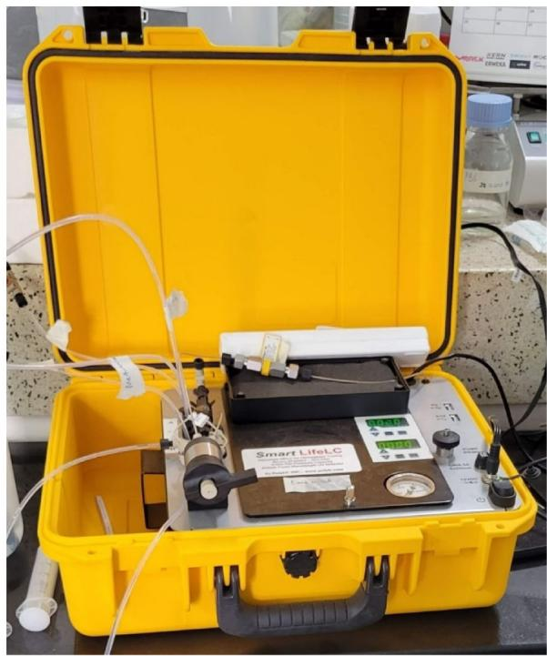
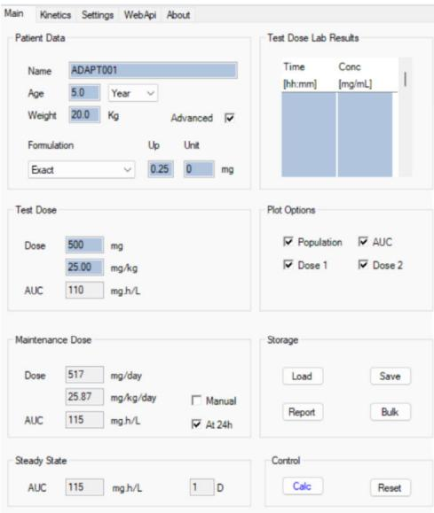
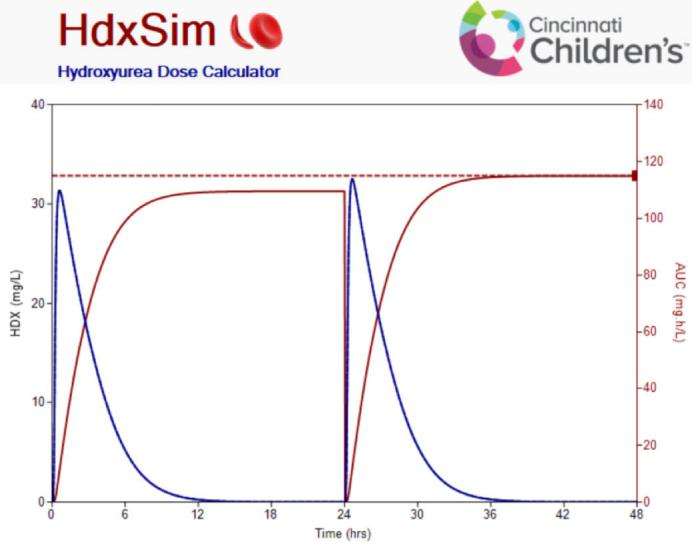
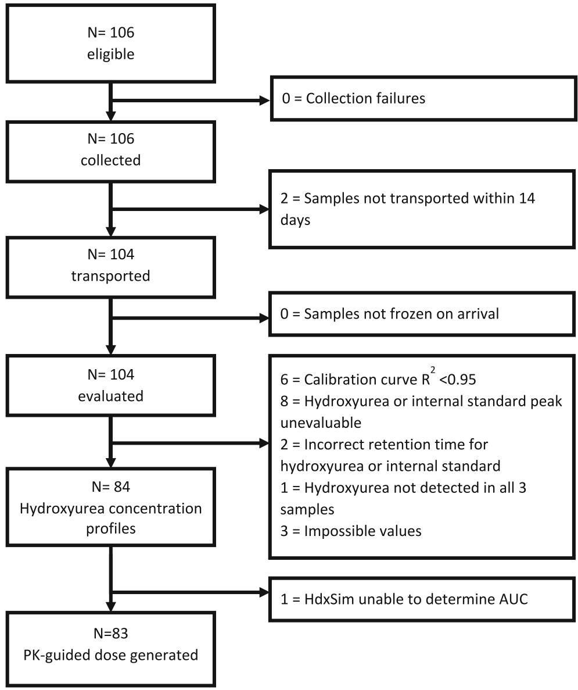
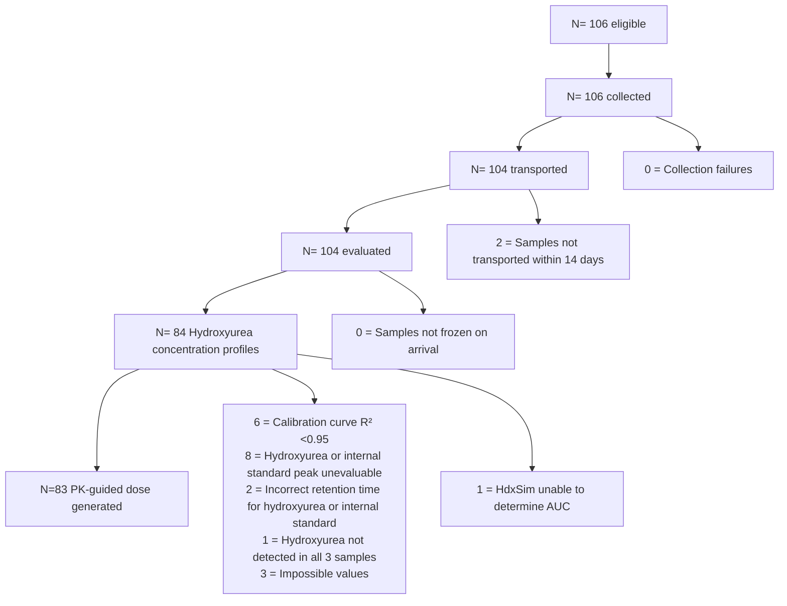

# The feasibility of pharmacokinetic-based dosing of hydroxyurea for children with sickle cell anaemia in Uganda: Baseline results of the alternative dosing and prevention of transfusions trial

Alexandra Power-Hays1,2 | Ruth Namazzi3,4 | Min Dong1 1

Caroline Kazinga4 | Charles Kato4 | Sadat Aliwuya4 | Kathryn McElhinney1 |

Andrea L. Conroy4,5 | Adam Lane1 | Chandy John5 | Alexander A. Vinks2,6 |

Teresa Latham1 | Robert O. Opoka7 | Russell E. Ware1,2

1 Division of Hematology, Cincinnati Children's Hospital Medical Center, Cincinnati, Ohio, USA   
2 Department of Pediatrics, University of Cincinnati, Cincinnati, Ohio, USA   
3 Department of Paediatrics and Child Health, Makerere School of Medicine, Kampala, Uganda   
4 Global Health Uganda, Kampala, Uganda   
5 Division of Pediatric Infectious Disease, Indiana University School of Medicine, Indianapolis, Indiana, USA   
6 NDA Partners, Washington, DC, USA   
7 Department of Paediatrics, Aga Khan University, Nairobi, Kenya

# Funding information

Dr. Power-Hays receives support from a T32 training grant from the National Institute of Child Health and Human Development (3T32HD069054-12S1) and has funding from the Doris Duke Charitable Foundation Physician-Scientist Award (2021097), the American Society of Haematology Minority Haematology Fellow Award and the Cincinnati Children's Research Foundation. Dr. Ware receives support from the National Heart, Lung, and Blood Institute (U01 HL133883) and the Cincinnati Children's Research Foundation. The funders had no role in the design, data collection, data analysis and reporting of this study.

# Abstract

Pharmacokinetic (PK)-guided dosing of hydroxyurea for children with sickle cell anaemia (SCA) could optimize dosing and improve outcomes, but its feasibility has not been demonstrated in low-resource settings where the majority of affected children live. Alternative Dosing And Prevention of Transfusions (ADAPT) is a prospective trial evaluating blood transfusions and the feasibility of determining PK-guided, hydroxyurea maximum tolerated doses (MTD) for children with SCA in Uganda, using portable high-performance liquid chromatography (HPLC) and a novel PK software programme (HdxSim). ADAPT enrolled 106 participants, and 100% completed PK testing. PK-guided doses were generated for 78%, of which 38% were within the protocol-defined range. Accurately, measuring serum hydroxyurea concentrations via HPLC and the potential for hydroxyurea degradation impacted the feasibility. Ensuring that people with SCA globally have access to hydroxyurea is imperative, and improving treatment strategies requires ongoing innovation including PK-guided dosing. ADAPT is registered at ClinicalTrials.gov (NCT05662098).

# K E Y W O R D S

clinical pharmacology, haematology, HPLC < drug analysis, paediatrics, pharmacokinetics

The authors confirm that the local principal investigator for this trial is Ruth Namazzi, MD MMED and that she had direct clinical responsibility for patients.

This is an open access article under the terms of the Creative Commons Attribution-NonCommercial-NoDerivs License, which permits use and distribution in any medium, provided the original work is properly cited, the use is non-commercial and no modifications or adaptations are made.

© 2025 The Author(s). British Journal of Clinical Pharmacology published by John Wiley & Sons Ltd on behalf of British Pharmacological Society.

# 1 | INTRODUCTION

Sickle cell anaemia (SCA) is an inherited, life-threatening blood disease.1 Nearly 400 000 infants are born with SCA annually, and 79% of the 7.7 million people with sickle cell disease live in Africa.2 Despite recognition of SCA as a global health priority by the United Nations and World Health Organization, there is little funding or guidance for SCA treatment—particularly in comparison to the malaria, tuberculosis, HIV/AIDS and other ‘Neglected Tropical Diseases’. 3,4 Consequently, sickle cell disease is the 12th leading cause of under-5 mortality worldwide.2,5

Hydroxyurea is an effective, oral disease-modifying treatment for SCA that promotes fetal haemoglobin (HbF) production to inhibit polymerization of sickle haemoglobin.6,7 Hydroxyurea decreases strokes, acute chest syndrome, pain, transfusions, hospitalization and death in people with SCA and is safe and beneficial in high- and low-resource settings globally.8–13 Hydroxyurea is most effective at maximum tolerated dose (MTD), which is the dose that provides maximal HbF induction without myelotoxicity.14,15 However, there is wide interpatient variability in hydroxyurea MTD due to pharmacokinetic (PK) differences.16,17 Traditional MTD determination requires 6–12 months of clinic appointments with incremental dose adjustments based on haematologic parameters.18,19

In 2016, we developed a PK model-based, individualized hydroxyurea dosing strategy for children with SCA published in the British Journal of Clinical Pharmacology. 20 Prospective use of this approach reduced the mean time to MTD to 4.8 months and led to improved HbF response without increased toxicities (TREAT, NCT02286154).18,21 Traditional hydroxyurea dose escalation can be challenging anywhere, but in low–middle-income countries (LMIC), the logistical barriers, cost of travel and laboratory tests and burden on families and healthcare providers are prohibitive to optimized hydroxyurea dosing.19,22–25 If feasible in Africa, a PK-guided approach might improve hydroxyurea dosing where the majority of SCA patients live.

To facilitate PK-guided hydroxyurea dosing in low-resource settings, adaptations to serum hydroxyurea quantification and modelinformed precision dosing were made.26,27 The Alternative Dosing And Prevention of Transfusions (ADAPT, NCT05662098) trial is a pilot study to evaluate the feasibility of this PK-guided dosing approach in order to provide individualized hydroxyurea doses to children with SCA in Uganda.28 Our hypothesis was that PK-guided hydroxyurea starting doses would be generated for 80% of participants with our adapted approach. Here, we present the baseline PK data and feasibility results of the ADAPT trial.

# 2 | METHODS

# 2.1 | Study design

ADAPT is a prospective trial of hydroxyurea treatment for children with SCA in Jinja, Uganda.28 Children aged 1–10 years old with SCA were eligible for inclusion. Those with other serious medical conditions, including HIV, tuberculosis or cancer were excluded, and those who received a blood transfusion within 30 days were temporarily excluded. The primary study end-point is the incidence rate ratio of blood transfusions administered during a 3-month, pretreatment, screening period compared with a 12-month hydroxyurea treatment period.

An important secondary end-point is the percentage of successful, PK-guided starting doses generated. During the screening period, all participants underwent PK testing. Participants with successful PK testing (see Hydroxyurea PK Testing below) and a hydroxyurea dose generated within 15–35 mg per kilogram per day (mg/kg/day),29 started on their individual hydroxyurea dose. If a participant's PK testing was unsuccessful or the dose generated was outside of the protocol-defined range, the participant started on a default dose (20 mg/kg/day) in accordance with Ugandan national guidelines. All participants started hydroxyurea and will complete 12 months of treatment following the same laboratory-based dose adjustment criteria to achieve MTD targeting absolute neutrophil counts between 2.0 and 3.0 109 /L.19,28

Parents or guardians of participants signed written, informed consent prior to study enrollment. ADAPT was approved by the Institutional Review Boards of Makerere University School of Medicine and Cincinnati Children's Hospital Medical Center, the Ugandan National Council of Science and Technology and the Ugandan National Drug Authority.

# 2.2 | Setting

The clinical site of ADAPT is the paediatric campus of the Jinja Regional Referral Hospital (JRRH), a government hospital in Jinja, Uganda. The sickle cell clinic has over 1500 children registered. Jinja is located on the shores of Lake Victoria and the Nile River, with a high burden of malaria and SCA. The research laboratory for ADAPT is the Global Health Uganda CHILD Lab, located in Kampala, Uganda.

# 2.3 | Hydroxyurea PK testing

ADAPT participants underwent first-dose PK testing during the screening period. They chewed or swallowed a 500-mg hydroxyurea capsule at time zero. Sparse sampling was collected via venipuncture at 20, 60 and 180 min after the test dose.20 Whole blood was separated into serum, which was stored at 20C for up to 2 weeks until transportation to the CHILD lab in a portable car freezer (VEVOR). The commute between Jinja and Kampala is approximately 80 km but may take 2–5 h to traverse.

Serum hydroxyurea was transformed to a detectable substance through a colorimetric Fearon assay taking between 3 and 4 h.30,31 Hydroxyurea concentrations were then determined via portable high-performance liquid chromatography (HPLC,

natural_image

Yellow laboratory case with open lid containing a Smart LifeLC device and tubing, no visible text or symbols on main components.

(B)   

text_image

Main
Kinetics
Settings
WebApi
About
Patient Data
Name ADAPT001
Age 5.0 Year
Weight 20.0 Kg Advanced ✓
Formulation Up Unit
Exact 0.25 0 mg
Test Dose Lab Results
Time Conc
[hh:mm] [mg/mL]
Test Dose
Dose 500 mg
25.00 mg/kg
AUC 110 mg.h/L
Plot Options
✓ Population ✓ AUC
✓ Dose 1 ✓ Dose 2
Maintenance Dose
Dose 517 mg/day
25.87 mg/kg/day □ Manual
AUC 115 mg.h/L ✓ At 24h
Storage
Load Save
Report Bulk
Steady State
AUC 115 mg.h/L 1 D
Control
Calc Reset

line

| Time (hrs) | HDX (mg/L) | AUC (mg h/L) |
| ---------- | ---------- | ------------ |
| 0          | 0          | 0            |
| 6          | 10         | 80           |
| 12         | 0          | 100          |
| 18         | 0          | 110          |
| 24         | 33         | 115          |
| 30         | 0          | 115          |
| 36         | 0          | 115          |
| 42         | 0          | 115          |
| 48         | 0          | 115          |

F I G U R E 1 (A) Hydroxyurea concentrations for ADAPT were determined via a portable high-performance liquid chromatography machine (HPLC, SmartLife) capable of performing haemoglobin electrophoresis testing or determining hydroxyurea concentration depending on column and mobile phases. Figure 1B. Hydroxyurea pharmacokinetic (PK)-guided doses were determined via a clinical decision support tool for modelinformed precision dosing (HdxSim) for children with sickle cell anaemia.

SmartLife, Figure 1A) machine with a reversed-phase C18 column.26,30 N-methylurea serves as the internal control, and concentrations are calculated from a calibration curve that must have an $\boldsymbol { \mathsf { r } } ^ { 2 }$ greater than 0.95.

When a hydroxyurea concentration was determined for all three time points, they were entered into hydroxyurea model-informed precision dosing software (HdxSim, Figure 1B).27 Using participant data and Bayesian estimation, area-under-the-time-concentration-curves

(AUC) were generated for each participant. The dose required to achieve target exposure was then calculated. The target exposure of 115 mg\*h/L was the mean exposure in American children with SCA clinically escalated to MTD (HUSTLE, NCT00305175) and was used in the prospective trial (TREAT).16,18,20 Participants for whom all steps of this process were completed in entirety resulting in the generation of an individualized dose were considered to have successful PK testing.

# 2.4 | Nomenclature of targets and ligands

Key protein targets and ligands in this article are hyperlinked to corresponding entries in http://www.guidetopharmacology.org and are permanently archived in the Concise Guide to PHARMACOLOGY 2019/20 (Alexander et al., 2019 a,b).

# 3 | RESULTS

From June 2022 to January 2023, 106 participants enrolled in ADAPT (Table 1).32 Most had prior episodes of pain (86%), dactylitis (74%) and malaria (79%). According to parental history, the majority had received at least one lifetime blood transfusion (78%), and many had received greater than 3 (35%). Only two participants had previously taken hydroxyurea. Some participants had mild stunting.

Participants were anaemic at baseline with mean Hb 7.7 ± 1.3 g/ dL and HbF 10.3% ± 7.1%. The baseline serum creatinine was low at 0.2 ± 0.1 mg/dL. Genetic testing confirmed 100% of participants had HbSS genotype.

# 3.1 | Feasibility of adapted PK approach

Of 106 participants enrolled, all completed hydroxyurea PK collection with three time points collected (Figure 2). Three samples per participant were transported from Jinja to Kampala, Uganda within 14 days for 104 participants (98%), all arriving frozen. After the colorimetric assay, all three samples from these 104 participants visibly turned pink.

There were several potential failed steps during determination of the hydroxyurea serum concentrations. Reasons for undetermined concentrations included inadequate calibration curve linearity (6%), chopped or unevaluable peaks for hydroxyurea or the internal standard (8%), incorrect hydroxyurea or internal standard retention times (2%), hydroxyurea not detected in all three samples (1%) or implausible second time point (3%), with the concentration at the second time point lower than the first and third time points. All three hydroxyurea concentrations were determined from 84 participants (79%). HdxSim could not generate a hydroxyurea dose for one participant. Overall, an individualized PK-guided hydroxyurea dose was determined for 83 participants (78%).

# 3.2 | PK parameters of ADAPT cohort

Based on participant body weight, the 500-mg hydroxyurea test dose provided 31.2 ± 12.8 mg/kg (median, interquartile range, Table 2). The median AUC achieved with this dose was 87 ± 65 mg\*h/L. To achieve the target hydroxyurea exposure, the median dose recommended was 38.7 ± 15.0 mg/kg/day. Of the 83 participants with a dose generated, the PK-recommended dose was within the protocol-specified range of 15–35 mg/kg/day for 32 participants (38.5%).

T A B L E 1 Enrollment characteristics of the ADAPT cohort. 

<table><tr><td colspan="2">Demographics</td></tr><tr><td>Female, n (%)</td><td>53 (50%)</td></tr><tr><td>Age in years</td><td>4.3 (2.3)</td></tr><tr><td colspan="2">Physical exam</td></tr><tr><td>Weight-for-height/BMI z-score</td><td>-0.29 (1.10)</td></tr><tr><td>Height-for-age z-score</td><td>-0.96 (1.11)</td></tr><tr><td>Spleen palpable, n (%)</td><td>21 (20%)</td></tr><tr><td colspan="2">Past medical history, n (%)</td></tr><tr><td>Episode of vaso-occlusive pain</td><td>91 (86%)</td></tr><tr><td>Dactylitis</td><td>78 (74%)</td></tr><tr><td>Acute chest syndrome/pneumonia</td><td>50 (47%)</td></tr><tr><td>Splenic sequestration</td><td>30 (28%)</td></tr><tr><td>Hydroxyurea use</td><td>2 (2%)</td></tr><tr><td>Any prior transfusion</td><td>83 (78%)</td></tr><tr><td>Greater than three prior transfusions</td><td>37 (35%)</td></tr><tr><td colspan="2">Imaging, n (%)</td></tr><tr><td>Detectable spleen on ultrasound</td><td>79 (75%)</td></tr><tr><td>Conditional velocity on TCD</td><td>14 (13%)</td></tr><tr><td>Abnormal velocity on TCD</td><td>6 (6%)</td></tr><tr><td colspan="2">Laboratory parameters</td></tr><tr><td>Haemoglobin (g/dL)</td><td>7.7 ± 1.3</td></tr><tr><td>Fetal haemoglobin (%)</td><td>10.3 ± 7.1</td></tr><tr><td>Absolute neutrophil count (x10^9/L)</td><td>5.7 ± 2.5</td></tr><tr><td>Creatinine (mg/dL)</td><td>0.2 ± 0.1</td></tr><tr><td colspan="2">Genetic results, n (%)</td></tr><tr><td>HbSS</td><td>106 (100%)</td></tr><tr><td colspan="2">Alpha thalassaemia trait</td></tr><tr><td>Wild type</td><td>36 (34.0%)</td></tr><tr><td>1 Gene Deletion</td><td>54 (50.9%)</td></tr><tr><td>2 Gene Deletion</td><td>16 (15.1%)</td></tr><tr><td colspan="2">G6PD deficiency (A-variant)</td></tr><tr><td>Wild type</td><td>77 (72.6%)</td></tr><tr><td>G6PD-deficient male</td><td>9 (8.5%)</td></tr><tr><td>Female carrier for G6PD deficiency</td><td>20 (18.9%)</td></tr><tr><td>G6PD-deficient female</td><td>0 (0%)</td></tr></table>

Note: Results are mean (SD) unless otherwise indicated.   
Abbreviations: BMI, body mass index; dL, deciliter; g, grams; L, litre; mg, milligrams; n, number; SD: standard deviation; TCD, transcranial Doppler ultrasound.

# 4 | DISCUSSION

ADAPT is the first trial to evaluate the feasibility of prospective, PK-guided hydroxyurea dosing to treat children with SCA in Africa, where over 75% of patients with the disease live. With our approach, a PK-guided hydroxyurea dose was generated for 78% of ADAPT participants. Some of these doses were above the protocol-specified range, potentially due to analytical challenges; however, our pilot study identified areas of success and opportunities for improvement for future prospective hydroxyurea PK research in limited resource settings.

F I G U RE 2 Hydroxyurea pharmacokinetic feasibility chart for the ADAPT cohort.   

flowchart

T A B L E 2 First-dose hydroxyurea pharmacokinetic (PK) parameters. 

<table><tr><td></td><td>Median (Q1, Q3)</td></tr><tr><td>Weight (kg)</td><td>16.0 (13.2, 20.0)</td></tr><tr><td>Test dose (mg/kg)</td><td>31.2 (25.0, 37.8)</td></tr><tr><td>AUC (mg*h/L)</td><td>87 (61, 126)</td></tr><tr><td>PK-recommended dose (mg/kg/day)</td><td>38.7 (32.0, 47.0)</td></tr><tr><td>Absorption (1/h)</td><td>4.5 (1.4, 7.3)</td></tr><tr><td>VD (L/70 kg)</td><td>57.8 (51.3, 70.2)</td></tr><tr><td>Clearance (L/h/70 kg)</td><td>29.3 (21.8, 35.9)</td></tr></table>

Abbreviations: AUC, area-under-the-curve; h, hour; kg, kilograms; L, litre; mg/kg, milligrams per kilogram; Q1, quartile 1; Q3, quartile 3.

Most steps of the adapted approach were completed successfully. Patients, parents and providers accepted the venipunctures required for sparse sampling, and samples were transported frozen to a central location for testing within the defined time frame for most samples. Skilled laboratory technicians completed the time-consuming, colorimetric assay on all received samples. All three hydroxyurea concentrations were determined for 79% of participants. Because this was a feasibility study, the laboratory technicians were not asked to repeat analyses on uninterpretable samples in this pilot.

Previously, we documented that both intra-day precision (2.5% coefficient of variance, CV) and accuracy (<15% different from nominal values), as well as inter-day precision (1.6%–5.8% CV) and accuracy (<10% difference from nominal values), were excellent using this analytical method.26 The limit of detection is 0.5 μg/mL,29 below the concentration deemed necessary to impact hydroxyurea PK in vivo.33 When tested in Tanzania, we documented good inter-day precision (CV 2%–17.5%) and accuracy (<15% difference from nominal values) as well.26 The benefits of this portable HPLC device include its portability, small footprint and that by being an open system; it can be manually repaired with basic tools. Potential downsides include that because it is an open system, it may be more exposed to dust and fluctuations in temperature or pressure that could affect the analyses. Since particulates in the mobile phase can interfere with the column, for future studies, we recommend adding an in-line filter.

The majority of generated doses were above the protocol-defined range, due to lower-than-expected AUC from the test dose and higher volumes of distribution compared with other hydroxyurea PK studies.20,27 I n a cross-sectional comparison of children with SCA in North America (USA and Jamaica) and Africa (Uganda and Kenya), there were no clinically significant differences in PK profiles.34 Therefore, the differences across continents do not appear to impact hydroxyurea PKs, and the doses predicted in ADAPT are more likely due to analytic challenges than to patient-related differences.

Hydroxyurea degrades with exposure to light and heat.30,35 Stability studies prior to the ADAPT trial demonstrated hydroxyurea in serum degrades completely within 24 h at room temperature and by 8%–15% after 24 h at 4C; in contrast, it is stable for 14 days at 20C and over 6 months at 80C. Although samples in ADAPT were wrapped in foil and promptly frozen, some degradation may have occurred prior to freezing if samples were left at room temperature, during the lengthy transport between Jinja and Kampala, or during repeated freezing and thawing while troubleshooting the HPLC method. Based on the experiences in ADAPT, we recommend extremely close attention to the cold chain, dividing stored serum into aliquots to limit freeze-thaws, and eliminating lag time between collection and analysis, as well as any prolonged sample transport.

Derivatized hydroxyurea and n-methylurea have also been shown to decay by 25%–28% over 6 h, but at a symmetrical rate so that the ratio remains reliable31; with the manual injections and troubleshooting the machine, some samples may have been analysed greater than 6 h from preparation. If this colorimetric Fearon assay is used in the future, further analyses to demonstrate ongoing symmetrical decay after 6 h is necessary. The time-consuming, colorimetric Fearon assay may not be amenable to real-world settings, so we recently adopted a simplified, xanthydrol-based hydroxyurea assay that takes minutes to complete.36,37 Further, derivatized xanthydrolhydroxyurea products are stable for 24 h at 4C.37 This will be trialled in future PK studies.

Even in high-income countries, many patients do not have access to a clinical pharmacologist. To increase access to the benefits of individualized dosing, HdxSim was developed27; this software uses the population PK model we developed best described by a one compartment model with Michaelis–Menten elimination and a transit compartment.20 ADAPT is the first study to prospectively use HdxSim to determine an individualized dose for children with SCA.

Participants for whom a dose was not generated or for whom the dose was outside of the protocol-defined range start on the default dose followed by traditional dose escalation to achieve MTD. The protocol-defined range of 15–35 mg/kg/day is in accordance with the US-FDA dosing range, and this ADAPT protocol range buffers participants from erroneous PK doses due to the aforementioned analytic challenges during this feasibility study. Some SCA studies have allowed up to 40–50 mg/kg/day.29,38 Furthermore, regardless of PK or default dosing, all participants undergo close complete blood count monitoring for myelotoxicity at Months 1, 2, and then every 2 months for the first 12 months to ensure participant safety and dose adjustments towards target myelosuppression.15,19,28 This is closer monitoring in this feasibility trial than is conducted in the real-world with weight-based dosing.19,39,40 After 12 months of treatment, the safety, number of dose adjustments and benefits of PK-guided dosing will be analysed as secondary end-points.

# 5 | CONCLUSION

The potential benefits of personalized medicine should not only be accessible to those in high-resource settings. Hydroxyurea is a lifesaving medication for SCA with the most benefits at optimal dosing, which can be effectively achieved through PK-guided dosing. To expand access to this dosing approach to low-resource settings, the ADAPT trial evaluated the feasibility of sparse sampling, a colorimetric assay and portable HPLC and a novel model-informed precision dosing software to complete PK-guided dosing of hydroxyurea for children with SCA in Uganda. This pilot study highlighted the overall acceptability and successful aspects of the approach as well as areas for further improvement. As new SCA treatments and curative options are in development for this historically neglected population, it is imperative that progress also continues in low-resource settings where the majority of patients with SCA live.

# AUTHOR CONTRIBUTIONS

Alexandra Power-Hays and Russell E. Ware conceptualized the trial and drafted the manuscript. Ruth Namazzi and Robert O. Opoka led the trial in Uganda. Teresa Latham, Andrea L. Conroy and Chandy John helped execute the trial. Caroline Kazinga, Charles Kato, Sadat Aliwuya, Kathryn McElhinney and Andrea L. Conroy managed the sample collection and analysis. Min Dong and Alexander A. Vinks developed the PK process. Adam Lane conducted statistical analysis. Teresa Latham curated the data. All authors reviewed and contributed to the manuscript.

# ACKNOWLEDGMENTS

The authors would like to acknowledge the ADAPT study teams in Uganda and Cincinnati. The authors would like to specifically thank the data coordinating centre within the division of haematology at CCHMC for assistance conducting the trial; Nieko Punt for developing the pharmacokinetic software; Thad Howard, MS and Anu Marahatta, PhD for contributions to methods for measuring hydroxyurea concentrations; Susan Stuber and Global Health Uganda for research infrastructure support; Heather Hume, MD for advice about transfusion support; and Luke Smart, MD for advice about technology transfer. Lastly, we thank the patients and families for contributing to the advancement of knowledge in the care of people with sickle cell anaemia.

# CONFLICT OF INTEREST STATEMENT

APH and REW were formerly on a Health Equity Advisory board for Novo Nordisk, which does not make hydroxyurea. REW serves as a Medical Advisor to Nova Laboratories, Theravia, and Merck Pharmaceuticals, and serves on a Data Safety Monitoring Board for clinical trials sponsored by Novartis and Vaxart. AAV works at NDA Partners. The other authors have no conflicts of interest to disclose.

# DATA AVAILABILITY STATEMENT

The data that will be generated and analysed during this study will be included in published articles and Supporting information. Further enquiries can be directed to the corresponding author.

# ORCID

Alexandra Power-Hays https://orcid.org/0000-0002-5823-0218

Min Dong https://orcid.org/0000-0002-8552-8298

Sadat Aliwuya https://orcid.org/0009-0007-0334-4449

Alexander A. Vinks https://orcid.org/0000-0003-4224-2967

# REFERENCES

1. Ware RE, de Montalembert M, Tshilolo L, Abboud MR. Sickle cell disease. Lancet. 2017;390(10091):311-323. doi:10.1016/S0140-6736 (17)30193-9   
2. Thomson AM, McHugh TA, Oron AP, et al. Global, regional, and national prevalence and mortality burden of sickle cell disease, 2000– 2021: a systematic analysis from the global burden of disease study 2021. Lancet Haematol. 2023;3026(23):e585-e599. doi:10.1016/ S2352-3026(23)00118-7   
3. Ware RE. Is sickle cell anemia a neglected tropical disease? PLoS Negl Trop Dis. 2013;7(5):e2120. doi:10.1371/journal.pntd.0002120   
4. Grosse SD, Odame I, Atrash HK, Amendah DD, Piel FB, Williams TN. Sickle cell disease in Africa: a neglected cause of early childhood mortality. Am J Prev Med. 2011;41(6 SUPPL.4):S398-S405. doi:10.1016/j. amepre.2011.09.013   
5. World Health Organization. Sickle Cell Anemia. In: WHA59.20: Sickle Cell Anemia. 2006. https://apps.who.int/gb/ebwha/pdf\_files/ WHA59/A59\_R20-en.pdf   
6. Platt OS. Hydroxyurea for the treatment of sickle cell anemia. N Engl J Med. 2008;358(13):1362-1369. doi:10.1056/NEJMct0708272   
7. McGann PT, Ware RE. Hydroxyurea for sickle cell anemia: what have we learned and what questions still remain? Curr Opin Hematol. 2011; 18(3):158-165. doi:10.1097/MOH.0b013e32834521dd   
8. Charache S, Terrin M, Moore R, et al. Effect of hydroxyurea on the frequency of painful crises in sickle cell. Anemia. 1995;332(20):1317- 1322. doi:10.1056/NEJM199505183322001   
9. Tshilolo L, Tomlinson G, Williams TN, et al. Hydroxyurea for children with sickle cell anemia in sub-Saharan Africa. N Engl J Med. 2019; 380(2):121-131. doi:10.1056/nejmoa1813598   
10. Thornburg CD, Files BA, Luo Z, et al. Impact of hydroxyurea on clinical events in the BABY HUG trial. Blood. 2012;120(22):4304-4310. doi:10.1182/BLOOD-2012-03-419879   
11. De Montalembert M, Brousse V, Elie C, Bernaudin F, Shi J, Landais P. Long-term hydroxyurea treatment in children with sickle cell disease: tolerance and clinical outcomes. Haematologica. 2006;91(1):125-128.   
12. Silva-Pinto AC, Angulo IL, Brunetta DM, et al. Clinical and hematological effects of hydroxyurea therapy in sickle cell patients: a singlecenter experience in Brazil. Sao Paulo Med J. 2013;131(4):238-243. doi:10.1590/1516-3180.2013.1314467   
13. Deshpande SV, Bhatwadekar SS, Desai P, et al. Hydroxyurea in sickle cell disease: our experience in Western India. Indian J

Hematol Blood Transfus. 2016;32(2):215-220. doi:10.1007/s12288- 015-0542-1   
14. John CC, Opoka RO, Latham TS, et al. Hydroxyurea dose escalation for sickle cell anemia in sub-Saharan Africa. N Engl J Med. 2020; 382(26):2524-2533. doi:10.1056/nejmoa2000146   
15. Ware RE. How I use hydroxyurea to treat young patients with sickle cell anemia. Blood. 2010;115(26):5300-5311. doi:10.1182/blood-2009-04-146852   
16. Ware RE, Despotovic JM, Mortier NA, et al. Pharmacokinetics, pharmacodynamics, and pharmacogenetics of hydroxyurea treatment for children with sickle cell anemia. Blood. 2011;118(18):4985-4991. doi: 10.1182/blood-2011-07-364190   
17. de Montalembert M, Bachir D, Hulin A, et al. Pharmacokinetics of hydroxyurea 1,000 mg coated breakable tablets and 500 mg capsules in pediatric and adult patients with sickle cell disease. Haematologica. 2006;91(12):1685-1688.   
18. McGann PT, Niss O, Dong M, et al. Robust clinical and laboratory response to hydroxyurea using pharmacokinetically guided dosing for young children with sickle cell anemia. Am J Hematol. 2019;94(8): 871-879. doi:10.1002/ajh.25510   
19. Power-Hays A, Ware RE. Effective use of hydroxyurea for sickle cell anemia in low-resource countries. Curr Opin Hematol. 2020;27(3): 172-180. doi:10.1097/MOH.0000000000000582   
20. Dong M, McGann PT, Mizuno T, Ware RE, Vinks AA. Development of a dose individualization strategy for hydroxyurea treatment in children with sickle cell anaemia. Br J Clin Pharmacol. 2016;81(4):742- 752. doi:10.1111/bcp.12851   
21. Quinn CT, Niss O, Dong M, et al. Early initiation of hydroxyurea (hydroxycarbamide) using individualised, pharmacokinetics-guided dosing can produce sustained and nearly pancellular expression of fetal haemoglobin in children with sickle cell anaemia. Br J Haematol. 2021;194(3):617-625. doi:10.1111/bjh.17663   
22. Tayo BO, Akingbola TS, Saraf SL, et al. Fixed low-dose hydroxyurea for the treatment of adults with sickle cell anemia in Nigeria. Am J Hematol. 2018;93(8):E193-E196. doi:10.1002/ajh.25143   
23. Okocha EC, Gyamfi J, Ryan N, et al. Barriers to therapeutic use of hydroxyurea for sickle cell disease in Nigeria: a cross-sectional survey. Front Genet. 2022;12(January):1-7. doi:10.3389/fgene.2021.765958   
24. Oron AP, Chao DL, Ezeanolue EE, et al. Caring for Africa's sickle cell children: will we rise to the challenge? BMC Med. 2020;18(1):1-8. doi: 10.1186/s12916-020-01557-2   
25. Dong M, McGann PT. Changing the clinical paradigm of hydroxyurea treatment for sickle cell anemia through precision medicine. Clin Pharmacol Ther. 2021;109(1):73-81. doi:10.1002/cpt.2028   
26. Smart LR, Charles M, McElhinney KE, et al. Hydroxyurea pharmacokinetics and precision dosing in low-resource settings. Front Mol Biosci. 2023;10:1130206. doi:10.3389/FMOLB.2023.1130206/BIBTEX   
27. Power-Hays A, Dong M, Punt N, et al. Rationale, development, and validation of HdxSim, a clinical decision support tool for modelinformed precision dosing (MIPD) of hydroxyurea for children with sickle cell anemia. Clin Pharmacol Ther. 2023;28(3):670-677. doi:10. 1002/cpt.3119   
28. Power-Hays A, Namazzi R, Kato C, et al. Pharmacokinetic-guided hydroxyurea to reduce transfusions in Ugandan children with sickle cell anemia: study design of the alternative dosing and prevention of transfusions (ADAPT) trial. Acta Haematol. 2024;1(2):208-219. doi: 10.1159/000539541   
29. Kinney TR, Helms RW, O'branski EE, et al. Safety of Hydroxyurea in Children With Sickle Cell Anemia: Results of the HUG-KIDS Study, a Phase I/II Trial.   
30. Marahatta A, Ware RE. Hydroxyurea: analytical techniques and quantitative analysis. Blood Cells Mol Dis. 2017;67:135-142. doi:10.1016/j. bcmd.2017.08.009   
31. Manouilov KK, Mcguire TR, Gwilt PR. Colorimetric determination of hydroxyurea in human serum using high-performance liquid

chromatography. J Chromatogr B. 1998;708(1-2):321-324. doi:10.1016/S0378-4347(97)00634-8  
32. Power-Hays A, Namazzi R, Kato C, et al. Pharmacokinetic-guided hydroxyurea to reduce transfusion requirements in Ugandan children with sickle cell anemia: baseline data from the alternative dosing and prevention of transfusions (ADAPT) trial. Blood. 2023;142- (Supplement 1):1156. doi:10.1182/blood-2023-181058   
33. Gwilt PR, Tracewell WG. Pharmacokinetics and Pharmacodynamics of Hydroxyurea.   
34. Power-Hays A, McElhinney KE, Latham TS, et al. Hydroxyurea pharmacokinetics in children with sickle cell anemia: comparison of global cohorts. Blood. 2024;144(Supplement 1):542. doi:10.1182/blood-2024-201577   
35. Heeney MM, Whorton MR, Howard TA, Johnson CA, Ware RE. Chemical and functional analysis of hydroxyurea Oral solutions. Pediatr Hematol Oncol. 2004;26(3):179-184. doi:10.1097/ 00043426-200403000-00007   
36. McElhinney K, Smart LR, Howard TA, Power-Hays A, Ware RE. A novel, rapid, and accurate quantitative hydroxyurea assay. Blood. 2023;142(Supplement 1):2530. doi:10.1182/blood-2023-190100   
37. Legrand T, Rakotoson MG, Galactéros F, Bartolucci P, Hulin A. Determination of hydroxyurea in human plasma by HPLC-UV using derivatization with xanthydrol. J Chromatogr B Analyt Technol Biomed Life Sci. 2017;1064:85-91. doi:10.1016/j.jchromb.2017.09.008

38. Quinn CT, Ware RE. The modern use of hydroxyurea for children with sickle cell anemia. Haematologica. 2025;9. doi:10.3324/ haematol.2023.284633   
39. McGann PT, Briscoe C, Muhongo M, et al. Optimizing dose and limiting laboratory monitoring of hydroxyurea in Africa: Design of the promoting utilization and safety of hydroxyurea using precision in Africa (PUSH-UP) trial. Blood. 2022;140(Supplement 1):5422-5423. doi:10. 1182/blood-2022-163202   
40. Galadanci NA, Abdullahi SU, Ali Abubakar S, et al. Moderate fixed-dose hydroxyurea for primary prevention of strokes in Nigerian children with sickle cell disease: final results of the SPIN trial. Am J Hematol. 2020;95(9):E247-E250. doi:10.1002/ajh.25900

How to cite this article: Power-Hays A, Namazzi R, Dong M, et al. The feasibility of pharmacokinetic-based dosing of hydroxyurea for children with sickle cell anaemia in Uganda: Baseline results of the alternative dosing and prevention of transfusions trial. Br J Clin Pharmacol. 2025;91(6):1865‐1872. doi:10.1002/bcp.70071