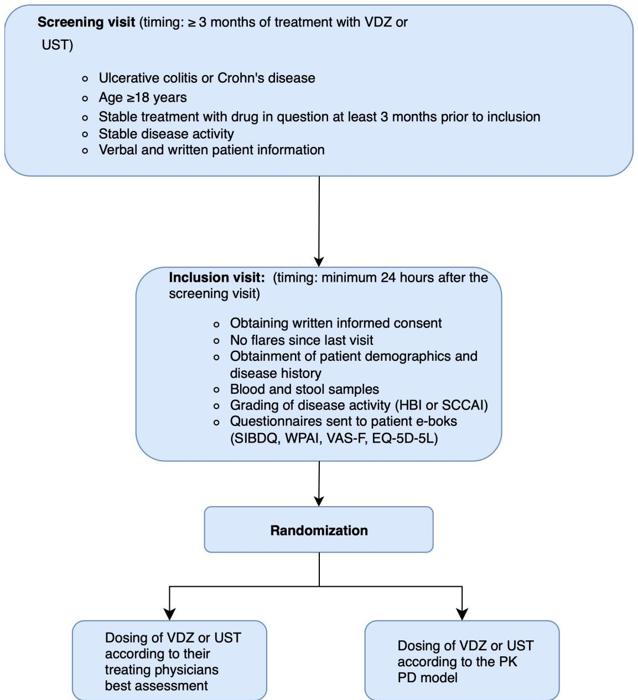

# BMJ

# Open

# Gastroenterology

# MOdel-informed precision dosing (MIPD) of ustekinumab and

# VEdolizumab in inflammatory bowel disease: protocol for an Independent randomised, controlled, multicentre Trial (MOVE-IT)

Camilla Frimor ,1,2 Casper Steenholdt ,1,2

Ella Signe Kassandra Widigson ,3,4 Jens Kjeldsen ,1,2 Lone Larsen,5,6 Johan Burisch,7,8 Maiken Thyregod Joergensen ,9,10 Morten Lee Halling,11 Charlotte Kloft,3 Mark Andrew Ainsworth 1,2

To cite: Frimor C, Steenholdt C, Widigson ESK, et al. MOdelinformed precision dosing (MIPD) of ustekinumab and VEdolizumab in inflammatory bowel disease: protocol for an Independent randomised, controlled, multicentre Trial (MOVE-IT). BMJ Open Gastroenterol 2025;12:e001985. doi:10.1136/ bmjgast-2025-001985

► Additional supplemental material is published online only. To view, please visit the journal online (https://doi. org/10.1136/bmjgast-2025- 001985).

Received 29 July 2025

Accepted 10 October 2025


# Check for updates

© Author(s) (or their

employer(s)) 2025. Re-use permitted under CC BY-NC. No commercial re-use. See rights and permissions. Published by BMJ Group.

For numbered affiliations see end of article.

Correspondence to

Professor Mark Andrew Ainsworth;

mark.ainsworth@rsyd.dk

# ABSTRACT

Introduction Biologic therapies, such as vedolizumab (VDZ) and ustekinumab (UST), offer effective treatment options for inflammatory bowel disease. In spite of limited evidence, it is common practice to escalate the dosing regimen if clinical symptoms or biomarkers give suspicion of loss of response. This study aims to determine whether model-informed precision dosing (MIPD) can provide equal efficacy and possibly superior cost-effectiveness compared with symptombased management.

Methods and analysis This study is an unblinded, randomised controlled trial, conducted at six centres in Denmark. A total of 166 patients diagnosed with Crohn’s disease or ulcerative colitis who have been on stable VDZ or UST therapy for at least 3months will be enrolled. Participants will be randomised to receive either continued symptom and biomarker-based dosing (control group) or dosing guided by therapeutic drug monitor using pharmacokinetic (PK) models together with PK-pharmacodynamic targets (=MIPD; intervention group). The primary endpoint is the fraction of patients in steroid-free remission at the end of the observation period. Secondary endpoints include mucosal healing, clinical remission, biochemical disease control, PK assessment and cost-effectiveness.

Ethics and dissemination The trial has been approved by the Danish Medicines Agency and The Medical Research Ethics Committee. No study-related procedures will take place before patients have signed written informed consent. Results will be published in peer-reviewed journals and presented at international conferences.

Trial registration numbers EUCT, 2024-517123-39-00; NCT06788340.

# INTRODUCTION

Inflammatory bowel diseases (IBD) are chronic, progressive and destructive diseases of the gastrointestinal tract,1 currently

# WHAT IS ALREADY KNOWN ON THIS TOPIC

⇒ Studies have shown that drug monitoring of ustekinumab (UST) is associated with increased drug persistency. Further, there is a known exposure–response relationship for both UST and vedolizumab (VDZ).

# WHAT THIS STUDY ADDS

⇒ This is, to our knowledge, the first randomised controlled trial regarding model-informed precision dosing (MIPD) in treatment with VDZ and UST.

# HOW THIS STUDY MIGHT AFFECT RESEARCH,PRACTICE OR POLICY

⇒ If we find that the MIPD approach is non-inferior with regard to remission, but superior regarding cost-effectiveness, this could have great implications for clinical practice, as well as if an MIPD approach is superior regarding keeping patients in remission.

affecting approximately 0.6%–0.8% of the European population with an increasing incidence.2 Over the past 20 years, there has been a vast development in the treatment of IBD dominated, until recently, by biological agents.3

The first biological agent used for IBD was infliximab, a TNF-α inhibitor. The use of this new biological agent gave hope of achieving disease control and remission in patients who had not been able to achieve this on conventional therapy.4

Unfortunately, up to one-third of all patients who start TNF-inhibitor therapy experience primary treatment failure. Even if patients initially experience good response on treatment, up to 50% of the patients will lose effect of the treatment over time (secondary loss of response).5 6 Later, vedolizumab (VDZ) and ustekinumab (UST) were approved for treatment of IBD and gave patients yet another opportunity to achieve disease control and avoid surgery.

Use of therapeutic drug monitoring (TDM) is becoming common when treating with TNFinhibitors, but more data are needed to support TDM for other biological treatments.8 9 However, managing the dosing regimen of VDZ and UST based on TDM has been suggested as a more effective way to achieve disease control than relying solely on patient symptoms and inflammatory markers.10 Furthermore, it seems that a proactive TDM approach is associated with increased drug persistency in patients treated with UST and VDZ.11 12 Few studies examined proactive VDZ and UST TDM, with disparate findings. More prospective studies are needed to better define its role.1 3

Population pharmacokinetic (PK) and PK-pharmacodynamic (PK/PD) models can, based on dosing history and the identified patient characteristics, allow for a priori predictions of individual serum concentrations of the drugs. These model predictions can be further improved by measurements of individual serum drug concentrations (à posteriori predictions) enabling individual dosing recommendations within the framework of model-informed precision dosing (MIPD).14 Such models have been described and externally evaluated for both VDZ15 and UST.16

Data from several randomised controlled trials (RCTs) show a correlation between the concentration of VDZ and UST, respectively, and clinical and/or endoscopic outcomes. To achieve the best chances of disease control, the maintenance trough level of VDZ should aim for ≥15.0 µg/mL if administered intravenously,17 and ≥34.5 µg/mL if administered subcutaneously.18 For UST, the corresponding concentration is ≥4.5 µg/mL at maintenance of treatment.19 A large part of patients who receive treatment with VDZ or UST are treated with higher doses than approved by the European Medicines Agency, increasing the general cost of treatment of IBD.20 However, the scientific documentation and evidence of the effect (let alone cost-effectiveness) of this practice is sparse,10 21 and some patients do not reach disease control despite dose-intensification.22

Our hypothesis is that the use of a PK model within MIPD to predict the dose and dosing interval for VDZ and UST needed for the individual patient to secure therapeutic drug trough levels will be at least equally efficient in keeping IBD in remission, compared with dosage assessment by clinical evaluation. Further, it might be cost-effective to treat according to MIPD recommendations.

# METHODS AND ANALYSIS

# Study design and patients

This study is an unblinded, multicentre, RCT. The study algorithm is shown in figure 1.

Adult patients (age ≥18 years) diagnosed with Crohn’s disease (CD) or ulcerative colitis (UC), in stable treatment with VDZ or UST for at least 3 months with no changes in medical therapy and no significant disease activity will be invited to participate. After screening and written informed consent, eligible patients are randomised to either dosage management by PK model prediction (interventional group) or through dosage assessment conducted through clinical evaluation (control group). The use of PK models within MIPD14 for individual predictions of serum drug concentrations will be based on the population PK models published by Rosario et al15. and Wang et al.23 for VDZ and Adedokun et al.16 for UST. We have implemented these specified population PK models in an MIPD software. For each patient, we will retrieve the values of the published patient characteristics identified to impact PK in the population PK models: weight, albumin concentration, previous treatment with anti-TNF drugs and anti-drug antibody (ADA) status for both VDZ and UST models. Additionally, age, faecal calprotectin, UC or CD diagnosis, subcutaneous injection site if applicable and concomitant treatment with methotrexate, azathioprine, mercaptopurine and/ or aminosalicylates for VDZ, and finally in addition for UST, C reactive protein, sex and race (Asian vs Caucasian or other). For each patient, we will also retrieve the dosing history as well as the measured serum drug concentration(s).

Providing this patient information to the population PK model, we will obtain individual à posteriori PK parameters. These individual PK parameters we will subsequently use for evaluating the patient’s current and alternative dosing regimen for securing therapeutic drug trough levels. Therapeutic drug trough levels will be based on current literature.18 22 24–39

The MIPD software we will employ for obtaining individual PK parameters and subsequent evaluation of dosing regimen is NONMEM (ICON Development Solutions, Ellicott City, Maryland, USA). Dataset preprocessing and postprocessing will be performed in R (R Core Team 2023, https://www.R-project.org/) and R Studio (RStudio Team 2023, http://www.rstudio.com/).

We will use block randomisation, stratifying for treating sites, with varying block size of 4, 6 or 8, and an allocation ratio of 1:1. The randomisation will be done using REDCap.

A minimum of 20 patients will be included for each intended treatment (UST, intravenous VDZ and subcutaneous VDZ).

It is the principal investigator from each site or a delegated colleague who will enrol participants and assign participants to interventions via REDCap.

Both groups will have blood and stool samples collected every 4th week (±1 week), but in the control group, measurement results will be concealed in order to mimic regular clinical practice as closely as possible.



<details>
<summary>flowchart</summary>

```mermaid
graph TD
    A["Screening visit (timing: ≥ 3 months of treatment with VDZ or UST)<br>    ○ Ulcerative colitis or Crohn's disease<br>    ○ Age ≥18 years<br>    ○ Stable treatment with drug in question at least 3 months prior to inclusion<br>    ○ Stable disease activity<br>    ○ Verbal and written patient information"] --> B["Inclusion visit: (timing: minimum 24 hours after the screening visit)<br>    ○ Obtaining written informed consent<br>    ○ No flares since last visit<br>    ○ Obtainment of patient demographics and disease history<br>    ○ Blood and stool samples<br>    ○ Grading of disease activity (HBI or SCCAI)<br>    ○ Questionnaires sent to patient e-boks (SIBDQ, WPAI, VAS-F, EQ-5D-5L)"]
    ]
    B --> C["Randomization"]
    C --> D["Dosing of VDZ or UST according to their treating physicians best assessment"]
    C --> E["Dosing of VDZ or UST according to the PK PD model"]
```
</details>

Figure 1 Study algorithm. EQ-5D-5L, EuroQol-5 dimensions-5 Levels; HBI, Harvey-Bradshaw Index; PD, pharmacodynamic; PK, pharmacokinetic; SCCAI, Simple Clinical Colitis Activity Index; SIBDQ, Short Inflammatory Bowel Disease Questionnaire; UST, ustekinumab; VAS-F, Visual Analogue Scale to Evaluate Fatigue Severity; VDZ, vedolizumab; WAPI, Work Productivity and Activity Impairment Questionnaire.

This study protocol adheres to the Standard Protocol Items: Recommendations for Interventional Trials (SPIRIT) reporting guidelines. A SPIRIT guideline checklist is provided in online supplemental appendix 1.

# Eligibility criteria

Patients who fulfil the inclusion criteria and do not meet any of the exclusion criteria will qualify for enrolment. Box 1 contains a complete list of the eligibility criteria.

Patients will be enrolled from the participating outpatient clinics. A list of the participating study sites can be found in the European Clinical Trials Information System (CTIS).

# Course of study

The data collection schedule is illustrated in table 1. After obtaining written informed consent and completing the final screening to confirm that all inclusion criteria are met and no exclusion criteria are present, baseline characteristics will be recorded and blood and stool samples will be collected to assess inflammatory markers, drug concentration and ADAs. Every 4 weeks, patients will undergo remote assessments of clinical and biochemical disease activity, including blood samples (routine analyses conducted locally, while drug concentration and ADA measurements (every 12th week or if drug level <1 µg/mL) are performed centrally at Odense University Hospital, Svendborg) and stool samples. At week 24,

# Box 1 Eligibility criteria

# Inclusion criteria

⇒ Ulcerative colitis or Crohn’s disease (CD). Diagnosed, according to universally acknowledged criteria, a minimum of 3 months prior to inclusion   
⇒ Age ≥18.  
⇒ Stable treatment with vedolizumab (VDZ) or ustekinumab (UST) for at least 3 months prior to inclusion.   
⇒ Stable disease activity, mild activity is accepted, defined by faecal calprotectin ≤200, and a weighted Patient-Reported Outcome score of 2 (PRO2) <14 for CD or a PRO2 ≤3 for ulcerative colitis.   
⇒ No change in medical therapy within 3 months prior to inclusion, as concomitant therapy with other immune suppressants is allowed (azathioprine, 6-mercaptopurine, methotrexate, 5-aminosalicylic acid).   
⇒ The patient must be able to understand patient information material.   
⇒ The patient must be able to give informed written consent.

# Exclusion criteria

⇒ Having a diagnosis of indeterminate colitis.   
⇒ Having a stoma or pouch.   
⇒ Fistulising disease being the primary reason for treatment with VDZ or UST.   
⇒ Expected imminent change of therapy.   
⇒ Expected need for surgical intervention within the coming 3 months.   
⇒ Contraindication against continuing treatment with VDZ or UST, including prior acute or delayed infusion reaction to VDZ or UST.   
⇒ Any active infection requiring parenteral treatment, known infection with tuberculosis, HIV or hepatitis virus.   
⇒ Any condition which the responsible physician finds incompatible with participation in the study.   
⇒ Patients unable to participate in the collection of symptom scores.   
⇒ Patients who are pregnant or nursing at the time of inclusion.

the patient will be seen in the outpatient clinic by the investigator, where their disease activity will be registered by Harvey-Bradshaw Index (HBI) (CD) or Simple Clinical Colitis Activity Index (SCCAI) (UC), and changes in concomitant medication will be registered, as well as screening for potential serious adverse events.

In case of insufficient disease control, defined by:

Persistent (2 consecutive scores at least 1 week apart) increase of the Patient-Reported Outcome (PRO2) score of 2 points or more AND

Evidence of inflammation as judged by faecal calprotectin >200mg/kg or CRP >20or endoscopic signs of disease activity or imaging with signs of activity

dosing increase (by shortening infusion/injection intervals) should be considered for patients in the control group. For patients in the interventional group, one extra blood sample will be taken as soon as possible and analysed in the same way as all other samples. The model will be used to make a new dosing recommendation which is to be followed, but if the patient continues to experience insufficient disease control despite the indicated corrective measures, this will be considered treatment failure and the patient will have to withdraw from study medication. If there are missing blood samples, faecal samples or missing answers to questionnaires, the patients will be sent a message in the secure digital mailbox, e-boks, to remind them to complete these.

The observation period of the study is 48 weeks. At the time of the final visit, all patients will have their disease activity assessed using the HBI, SCCAI, PRO2 and biochemical and faecal markers, and by endoscopic examination (Simple Endoscopic Score (SES-CD) or Ulcerative Colitis Endoscopic Index of Severity (UCEIS) or by MRI or capsule endoscopy if the primary disease is not located in the colon.

To assess information about quality of life, work productivity and fatigue, the patients will also be asked to complete the Short Inflammatory Bowel Disease Questionnaire (SIBDQ), Work Productivity and Activity Impairment Questionnaire (WPAI), EuroQol-5 dimensions-5 Levels (EQ-5D-5L) and Visual Analogue Scale to Evaluate Fatigue Severity (VAS-F) regularly (see table 1).

# Endpoints

The primary endpoint of this study is the fraction of patients in steroid-free remission at the end of the observation period. Steroid-free remission, defined as a PRO2 score of ≤4 (pain ≤1 and stool frequency ≤3) for CD or a PRO2 score of 0–1 (bleeding score 0 and stool frequency ≤1) for $\mathrm { U C } ^ { 4 0 \ \mathrm { \dot { 4 } 1 } }$ and a faecal calprotectin ≤200.

Secondary endpoints, assessed at the end of the trial (week 48), are:

Fraction of the observation period where the disease is in steroid-free remission.   
? Financial costs associated with the two treatment strategies over the observational period, including expenditure on medicines (both expenditure on purchase of medicines and expenditure on the administrations of medicines), expenses for visits to healthcare professionals, expenses for surgery, expenses for hospitalisation, expenses for sick leave and expenses for early retirement.   
Endoscopic healing of the mucosa assessed after 48 weeks (for CD assessed by SES-CD)<3; and for UC assessed on the basis of the UCEIS≤1.40 If disease is primarily located in the small intestine, MRI or capsule endoscopy will be used instead, and assessed by the simplified MaRIA score or Lewis score respectively. Endoscopic healing is defined as a simplified MaRIA score ${ \dot { < } } 1 ^ { 4 2 }$ or Lewis score ≤135.43 This will be done by a clinician blinded for the course of the disease.   
► Quality of life assessed by SIBDQ.   
Quality of life assessed by EQ-5D-5L, differences in QALY and the price of QALYs.   
The portion of the observational period wherein the patient’s disease is in clinical remission, assessed as the portion of the observational period in which

Table 1 Course of study and data collection schedule in the intervention and control groups 

<table><tr><td>Visit number</td><td>1 Screening</td><td>2 Inclusion</td><td>3</td><td>4</td><td>5</td><td>6</td><td>7</td><td>8</td><td>9</td><td>10</td><td>11</td><td>12</td><td>13</td><td>14</td></tr><tr><td>Week from inclusion (±1 week)</td><td>-</td><td>0</td><td>4</td><td>8</td><td>12</td><td>16</td><td>20</td><td>24</td><td>28</td><td>32</td><td>36</td><td>40</td><td>44</td><td>48</td></tr><tr><td>Informed consent</td><td></td><td>X</td><td></td><td></td><td></td><td></td><td></td><td></td><td></td><td></td><td></td><td></td><td></td><td></td></tr><tr><td>Registration of demographics and medical history</td><td></td><td>X</td><td></td><td></td><td></td><td></td><td></td><td></td><td></td><td></td><td></td><td></td><td></td><td></td></tr><tr><td>Pregnancy testing in fertile women</td><td></td><td>X</td><td></td><td></td><td></td><td></td><td></td><td></td><td></td><td></td><td></td><td></td><td></td><td></td></tr><tr><td>Colonoscopy and/or MRI and/or capsule endoscopy</td><td></td><td>X (only if included in subprotocol 1)</td><td></td><td></td><td></td><td></td><td></td><td></td><td></td><td></td><td></td><td></td><td></td><td>X</td></tr><tr><td>HBI or SCCAI score</td><td></td><td>X</td><td></td><td></td><td></td><td></td><td></td><td>X</td><td></td><td></td><td></td><td></td><td></td><td>X</td></tr><tr><td>PRO2 score</td><td></td><td>X</td><td>X</td><td>X</td><td>X</td><td>X</td><td>X</td><td>X</td><td>X</td><td>X</td><td>X</td><td>X</td><td>X</td><td>X</td></tr><tr><td>EQ-5D-5L</td><td></td><td>X</td><td></td><td>X</td><td></td><td>X</td><td></td><td>X</td><td></td><td>X</td><td></td><td>X</td><td></td><td>X</td></tr><tr><td>VAS-F</td><td></td><td>X</td><td>X</td><td>X</td><td>X</td><td>X</td><td>X</td><td>X</td><td>X</td><td>X</td><td>X</td><td>X</td><td>X</td><td>X</td></tr><tr><td>SIBDQ</td><td></td><td>X</td><td></td><td></td><td></td><td></td><td></td><td>X</td><td></td><td></td><td></td><td></td><td></td><td>X</td></tr><tr><td>WPAI</td><td></td><td>X</td><td></td><td></td><td></td><td></td><td></td><td>X</td><td></td><td></td><td></td><td></td><td></td><td>X</td></tr><tr><td>Blood and faecal samples</td><td></td><td>X</td><td>X</td><td>X</td><td>X</td><td>X</td><td>X</td><td>X</td><td>X</td><td>X</td><td>X</td><td>X</td><td>X</td><td>X</td></tr><tr><td>PK-model assessment and suggestion of changed dosing interval If needed</td><td></td><td></td><td></td><td>X</td><td>X</td><td>X</td><td>X</td><td>X</td><td>X</td><td>X</td><td>X</td><td>X</td><td>X</td><td>X</td></tr><tr><td>Ultrasonography (only if included in subprotocol 2)</td><td></td><td>X</td><td></td><td></td><td></td><td></td><td></td><td></td><td></td><td></td><td></td><td></td><td></td><td>X</td></tr><tr><td>Registration of SUSARs and changes in concomitant medication</td><td></td><td>X</td><td></td><td></td><td></td><td></td><td></td><td>X</td><td></td><td></td><td></td><td></td><td></td><td>X</td></tr></table>

EQ-5D-5L, EuroQol-5 dimensions-5 Level; HBI, Harvey-Bradshaw-Index; PRO2, Patient-Reported Outcome score of 2; SCCAI, Simple Clinical Colitis Activity Index; SIBDQ, Short Inflammatory Bowel Disease Questionnaire; SUSARs, suspected unexpected serious adverse reactions; VAS-F, Visual Analogue Scale to Evaluate Fatigue Severity; WPAI, Work Productivity and Activity Impairment.

the disease is in steroid-free remission according to SCCAI ≤2 for UC, and HBI-score <5 for CD.40 41

? The inflammatory burden during the observational period, assessed by CRP, albumin, haemoglobin, leucocyte measurements and faecal calprotectin.   
► Drug concentration and ADA analysis expenses.   
► Drug expenses.   
The proportion of patients switching to another drug during the study period.   
? Use of glucocorticoids, defined as redeemed prescriptions from the pharmacy, and surgery related to IBD.   
► Fatigue assessed by VAS-F difference between patients in the intervention and control group.

The disease’s impact on work productivity and performance of daily activities is assessed by differences in WPAI scores and changes in scores between patients in the two groups, as well as registration of surgeries and hospitalisation.

# Patient and public involvement

Individual patients have not been involved in the design of our study. However, previous patient surveys conducted by our research group have described patient concerns and preferences regarding methods for evaluating disease activity.44 These data have been taken into consideration when designing the study.

Frequent reporting of clinical activity by PRO2 is also found to be well accepted by patients. Patients did not find it took up too much of their time and thought reporting online would have a positive impact on their health. 45

# Sample size

Based on real life studies,46–48 remission rates of patients in UST are approximately 60% after 12 months of treatment.

On the basis of this, a non-inferiority limit of 20% has been selected, based on general scientific practice, which considers a deviation of up to one-third of the expected efficacy as acceptable.49 This, combined with a selected alpha of 0.05 and power (1-beta) of 80%, a sample size of 150 (75 in each arm) is required. To account for dropouts, an additional 10% of patients will be included.

Similarly, real-world studies report remission rates of VDZ-treated patients, ranging from 28% to 65% at 12 months, depending on patient subpopulation.50–52

Applying the same alpha and power assumptions:

► A remission rate of 28% yields a required sample size of 126 patients.   
► A rate of 65% yields a sample size of 142 patients.   
► A rate of 50%—which results in the largest required sample size—yields a sample size of 156 patients.

Even in the most conservative scenario, our adjusted sample size—including 10% to cover potential dropouts—remains adequate, thus accounting for the uncertainty in remission rates.

The anticipated accrual rate is approximately 2 years, and patients will be enrolled from multiple centres consisting of gastroenterology outpatient clinics. Potential participants will be identified by our day-to-day contact with patients at their scheduled visits to the outpatient clinics.

We expect at least eight patients included from each study site, but have not set a specific number of patients to be included from each site.

The coordinating investigator will visit the different sites to advertise the study and will send monthly updates on recruiting status. Furthermore, there is a minimum number of patients needed to be recruited from a site to apply for authorship, and each site will be rewarded with a minor monetary compensation per patient included.

# Withdrawal criteria

If a patient has persistent signs of flare despite the drug concentration being sufficiently high, or the patient has persistently low drug concentrations and positive ADA, patients will be withdrawn from study medication, but will continue registration of disease activity (HBI, SCCAI and PRO2) as well as blood and stool samples. The same procedure is followed if a participant becomes pregnant or changes primary therapy.

This is done to be able to do an ‘as-treated’ analysis of the dataset to assess the impact of the actual treatment administered on the outcomes.

Patients are free to withdraw from the study at any time, and without any consequences for their future medical care. Further, investigators must withdraw patients from the trial if the patient’s clinical condition necessitates it, if the patient has a major protocol violation, withdrawal of consent or change of address necessitating change in treating outpatient clinic, to a site not participating in the study. If patients are withdrawn, they will be asked if they wish to complete an endoscopy at withdrawal, and HBI or SCCAI and PRO2 as relevant will be obtained. They will also be asked to complete the SIBDQ and WPAI. In case of withdrawal, patients will not be replaced, but the data collected until withdrawal will be used in further data processing.

# Data analysis plan

The inclusion period extends from December 2025 to December 2027. The study completion is scheduled for December 2028. Thereafter, we will analyse the data and present results for scientific publications. To ensure adequate participant enrolment, the study is conducted across multiple centres. The list of study sites can be viewed at ClinicalTrials.gov and CTIS.

The primary endpoint is assessed for non-inferiority, while secondary endpoints are tested for superiority, as non-inferior remission combined with superior secondary outcomes—such as cost-effectiveness—would have significant clinical and economic relevance.

# Statistical analysis plan

Descriptive statistics will be calculated as percentages for discrete variables, and median with IQR or mean with SE of the mean for continuous variables, as appropriate.

Continuous outcome measures will be analysed using unpaired t-tests. Regression analysis will be used for a closer examination of the significance of various factors on the outcome measure. Binary outcome measures will be analysed using Fisher’s exact test. For PK analysis and dosing recommendations, a non-linear mixed-effects modelling and simulation approach will be used.53 54

Data are analysed as both per-protocol (PP) and intention to treat (ITT). For our primary endpoint, we will primarily analyse our data as PP, as it is a non-inferiority endpoint. This is done to minimise dilution of treatment effects caused by non-adherence, which could otherwise bias the results toward finding non-inferiority. Further, the PP analysis provides a clearer view of the true pharmacological effect of the model, by excluding data from patients whose outcomes were potentially confounded by factors unrelated to the model itself. ITT analysis will also be done, as the ITT analysis assesses the real-world effectiveness of a treatment and demonstrates the practical applicability.

Regarding secondary endpoints, these will be tested for superiority compared with the control group. Accordingly, the ITT analysis will serve as the primary analysis for the secondary endpoints.

The statistical analyses are done in hierarchical order. We start with the analysis of the primary endpoint, and only if this shows a significant difference between the two strategies used, the next endpoint in the hierarchy is tested, and so on. Correction for multiplicity is therefore unnecessary. P values <0.05 are considered significant.

Missing values: Missing values will be replaced by the average of the available values just before and after the missing values. If no values are available after the missing values, the last-observation-carried-forward method will be used for imputation of missing values. However, methods for inputting missing values will be applied in several sensitivity analyses.

An extensive statistical analysis plan will be completed prior to any statistical analysis.

# Explorative analysis

The drug concentration of the two groups will be compared to assess if there is a significant difference in drug concentration between the two groups, and if there is a correlation between disease activity and drug concentrations.

We will also analyse the individual patient’s drug clearance as a quantitative parameter for elimination processes, which is part of the PK model we use. The objective of this is to assess if drug clearance can predict flares and compare if drug clearance is better at predicting therapeutic outcomes than drug concentration.

# Monitoring

The study will be monitored according to Good Clinical Practice (GCP), including quality control and quality assurance.

Clinical site monitoring is conducted to ensure that the rights and well-being of trial participants are protected, that the reported trial data are accurate, complete and verifiable, and that the conduct of the trial is in compliance with the currently approved protocol/amendment(s), GCP and relevant legislation.

On-site monitoring visits will be performed frequently during the study. The overall monitoring will be done by the sponsor and/or coordinating investigator. The GCP unit will carry out the on-site monitoring.

# Dissemination

It is our intention that all results will be published, positive, negative or inconclusive, in a relevant Englishlanguage scientific journal/conference. In addition, a plain-language summary of the clinical trial results will be prepared and published in CTIS. Furthermore, information about the study will be available in the international public database for clinical studies at https://clinicaltrials.gov/study/NCT06788340

A summary of results will be accessible in CTIS no later than 1 year after the trial is ended.

# Data deposition and curation

We will store biological material in the form of blood and stool samples from patients in a biobank for future research. The blood samples are stored in the form of serum, plasma and buffy coat and will be pseudo-anonymised.

The samples will be stored for up to 10 years after the termination of the study, after which all samples and leftover material will be destroyed immediately.

If additional or alternative studies involving biological material are required, they will only be conducted following a new application and approval from the national ethics committee.

Patient identifiable information (eg, name) will be treated as strictly confidential and will not be made publicly available. All information about the patients, including non-clinical data, protocols, case report forms and verbal and written information, is protected under the act concerning the processing of personal data and the Danish health law, though it will be kept for 25 years and can be deidentified and shared on relevant request. Investigators will have access to the final trial data set. The study will comply with the International Council for Harmonisations Guideline for Good Clinical Practice (ICH-GCP) rules and be performed in accordance with the protocol and relevant regulatory requirements.

# Author affiliations

1 Department of Medical Gastrointestinal Diseases, Odense University Hospital, Odense, Denmark

2 Department of Clinical Research, University of Southern Denmark Faculty of Health Sciences, Odense, Denmark

3 Department of Clinical Pharmacy and Biochemistry, Freie Universität Berlin Institut für Pharmazie, Berlin, Germany

4 Graduate Research Training Program PharMetrX (Pharmacometrics and Computational Disease Modelling), Freie Universität Berlin, Berlin, Germany

5 Department of Gastroenterology and Hepatology, Aalborg Universitetshospital, Aalborg, Denmark

6 Center of Molecular Prediction of Inflammatory Bowel Disease (PREDICT), Aalborg Universitet, Copenhagen, Denmark

7 Gastro Unit Medical Division, Hvidovre Hospital Gastro Unit, Hvidovre, Denmark

8 Department of Clinical Medicine, University of Copenhagen Faculty of Health and Medical Sciences, Copenhagen, Denmark

9 Department of Internal Medicine, Vejle Hospital, Vejle, Region Syddanmark, Denmark

10Department of Clinical Medicine, University of Southern Denmark Faculty of Health Sciences, Odense, Denmark

11Department of Internal Medicine, Esbjerg Central Hospital, Esbjerg, Denmark

Acknowledgements OPEN, Open Patient data Explorative Network, Odense University Hospital, Region of Southern Denmark (www.sdu.dk/ki/open) has assisted in evolving the protocol with regards to ethical and legislation issues. Their facilities, such as REDCap and STATA licences, as well as biobank facilities, will be used in the RCT.

Contributors All authors contributed to the conceptualisation and design of the study. All authors contributed to the refinement of the study protocol. CF has performed the drafting of the protocol manuscript. All authors have been involved in the revision of the manuscript. All authors approved the final manuscript and agree to be accountable for all aspects of the work in ensuring that questions related to the accuracy or integrity of any part of the work will be appropriately investigated and resolved. CF is the guarantor. AI has been used as a dictionary and to help word the cover letter.

Funding This study is supported by The Regions of Denmark Medicine- and Treatment Fund, The Research Fund of the Region of Southern Denmark, The Independent Research Fund Denmark and The PhD Fund of the Region of Southern Denmark.

Disclaimer The funders have no role in the study design, nor in the collection, management, analysis or interpretation of the data. They will not have any role in writing the results report nor the decision to submit the report for publication.

Competing interests CF has nothing to declare. ESKW has nothing to declare. CS has given lectures for MSD and Janssen-Cilag and accepted a research grant from Takeda. JK has nothing to declare. LL reports speaker fee from Takeda and has served as an advisory board member for Tillots and AbbVie. JB reports grants from AbbVie, Janssen-Cilag, MSD, Takeda, Tillots Pharma, Bistrol Myers Squibb and Novo Nordisk Foundation; personal fees from AbbVie, Janssen-Cilag, Celgene, MSD, Pfizer, Takeda, Tillots Pharma, Bistrol Myers Squibb, Samsung Bioepis, Pharmacosmos, Ferring, Galapagos, Eli Lilly, Dr Falk Pharma and Orion Pharma. MTJ has nothing to declare. MLH reports personal fee from TAKEDA. CK reports grants from an industry consortium (AbbVie, Astra Zeneca, Boehringer Ingelheim, F. Hoffmann-La Roche, Merck, Novo Nordisk and Sanofi) for the PharMetrX PhD programme and from the European Commission within the Horizon 2020 framework programme ('FAIR'), all outside the submitted work. MAA has served as a consultant/given a lecture for Janssen Pharmaceuticals, AbbVie and Takeda.

# Patient consent for publication Not applicable.

Ethics approval Ethical approval for this mono-national study was granted by the Danish Medical Agency and the Medical Research Ethics Committee through the Clinical Trials Information System (CTIS) under EU CT number: 2024-517123- 39-00, approved on 11 April 2025. The study will be conducted in accordance with the principles of the Declaration of Helsinki as well as all applicable national and international regulations regarding research involving human participants. All participants will receive comprehensive written information about the study, including its purpose, procedures, potential risks and benefits. Informed consent will be obtained from each participant prior to their enrolment in the study, ensuring that participants are fully aware of their rights and can voluntarily decide to participate. Participant confidentiality will be strictly maintained. Data will be anonymised and stored securely in compliance with Regulation (EC) No 45/2001 and national data protection legislation implementing Regulation (EU) 2016/679. Consent forms describing in detail the study intervention, study procedures and risks are given to the participant. Written documentation of informed consent is required prior to starting study-related procedures. It is required that the Investigator obtains this. The patient information sheet and consent form are provided in online supplemental appendix 2 and online supplemental appendix 3, respectively. In this study, the drugs used are all licensed and prescribed for approved indications, the doses applied are commonly used in clinical practice. As we find this to be a low-risk study, only suspected unexpected serious adverse reactions will be registered and reported. Patients will be informed if there are major changes to the trial. Investigators will be informed if there are important protocol modifications. All patients are covered by the Danish Patient Compensation. The study will provide new knowledge regarding the use of an MIPD strategy when dosing VDZ and UST in CD and UC patients. UST is also used for treatment of other inflammatory diseases such as psoriasis and psoriatic arthritis. As with IBD patients, these patients might also benefit from a MIPD approach like the one tested in our study.

Provenance and peer review Not commissioned; externally peer reviewed.

Data availability statement Data are available on reasonable request.

Supplemental material This content has been supplied by the author(s). It has not been vetted by BMJ Publishing Group Limited (BMJ) and may not have been peer-reviewed. Any opinions or recommendations discussed are solely those of the author(s) and are not endorsed by BMJ. BMJ disclaims all liability and responsibility arising from any reliance placed on the content. Where the content includes any translated material, BMJ does not warrant the accuracy and reliability of the translations (including but not limited to local regulations, clinical guidelines, terminology, drug names and drug dosages), and is not responsible for any error and/or omissions arising from translation and adaptation or otherwise.

Open access This is an open access article distributed in accordance with the Creative Commons Attribution Non Commercial (CC BY-NC 4.0) license, which permits others to distribute, remix, adapt, build upon this work non-commercially, and license their derivative works on different terms, provided the original work is properly cited, appropriate credit is given, any changes made indicated, and the use is non-commercial. See: https://creativecommons.org/licenses/by-nc/4.0/.

# ORCID iDs

Camilla Frimor https://orcid.org/0009-0007-6639-0979

Casper Steenholdt https://orcid.org/0000-0003-3898-4212

Ella Signe Kassandra Widigson https://orcid.org/0009-0005-7069-3863

Jens Kjeldsen https://orcid.org/0000-0001-8148-6572

Maiken Thyregod Joergensen https://orcid.org/0009-0004-1874-0012

Mark Andrew Ainsworth https://orcid.org/0000-0002-4899-1048

# REFERENCES

1 Zallot C, Peyrin-Biroulet L. Deep remission in inflammatory bowel disease: looking beyond symptoms. Curr Gastroenterol Rep 2013;15:315.   
2 Zhao M, Gönczi L, Lakatos PL, et al. The Burden of Inflammatory Bowel Disease in Europe in 2020. J Crohns Colitis 2021;15:1573–87.   
3 Noor NM, Bourke A, Subramanian S. Review article: Novel therapies in inflammatory bowel disease - An update for clinicians. Aliment Pharmacol Ther 2024;60:1244–60.   
4 Baumgart DC, Le Berre C. Newer Biologic and Small-Molecule Therapies for Inflammatory Bowel Disease. N Engl J Med 2021;385:1302–15.   
5 Nielsen OH, Ainsworth MA. Tumor necrosis factor inhibitors for inflammatory bowel disease. N Engl J Med 2013;369:754–62.   
6 Zhao M, Larsen L, Dige A, et al. Clinical Outcomes After First-Line Anti- Tumor-Necrosis-Factor Treatment of Patients With Inflammatory Bowel Disease—A Prospective Multicenter Cohort Study. J Crohns Colitis 2025;19.   
7 Talathi S, Baig KRKK. Biosimilars in inflammatory bowel disease. J Dig Dis 2020;21:610–20.   
8 Cheifetz AS, Abreu MT, Afif W, et al. A Comprehensive Literature Review and Expert Consensus Statement on Therapeutic Drug Monitoring of Biologics in Inflammatory Bowel Disease. Am J Gastroenterol 2021;116:2014–25.   
9 Vootukuru N, Vasudevan A. Approach to loss of response to advanced therapies in inflammatory bowel disease. World J Gastroenterol 2024;30:2902–19.   
10 Ollech JE, Normatov I, Peleg N, et al. Effectiveness of Ustekinumab Dose Escalation in Patients With Crohn’s Disease. Clin Gastroenterol Hepatol 2021;19:104–10.   
11 Porth R, Deyhim T, Zullow S, et al. Proactive Therapeutic Drug Monitoring Is Associated With Increased Drug Persistence in Patients With Inflammatory Bowel Disease Treated With Intravenous Vedolizumab. Inflamm Bowel Dis 2025;31:485–91.   
12 Porth R, Deyhim T, Geeganage G, et al. Proactive Therapeutic Drug Monitoring of Ustekinumab Is Associated With Increased Drug Persistence in Patients With Inflammatory Bowel Disease. Inflamm Bowel Dis 2025;31:1806–10.   
13 Roblin X, Little RD, Mathieu N, et al. Therapeutic drug monitoring in inflammatory bowel disease: recent developments. Expert Rev Gastroenterol Hepatol 2024;18:575–86.   
14 Kluwe F, Michelet R, Mueller-Schoell A, et al. Perspectives on Model-Informed Precision Dosing in the Digital Health Era: Challenges, Opportunities, and Recommendations. Clin Pharmacol Ther 2021;109:29–36.   
15 Rosario M, Dirks NL, Gastonguay MR, et al. Population pharmacokinetics-pharmacodynamics of vedolizumab in patients with ulcerative colitis and Crohn’s disease. Aliment Pharmacol Ther 2015;42:188–202.   
16 Adedokun OJ, Xu Z, Gasink C, et al. Population Pharmacokinetics and Exposure-Response Analyses of Ustekinumab in Patients With Moderately to Severely Active Crohn’s Disease. Clin Ther 2022;44:1336–55.   
17 Singh S, Dulai PS, Vande Casteele N, et al. Systematic review with meta-analysis: association between vedolizumab trough concentration and clinical outcomes in patients with inflammatory bowel diseases. Aliment Pharmacol Ther 2019;50:848–57.   
18 Steenholdt C, Lorentsen RD, Petersen PN, et al. Therapeutic drug monitoring of vedolizumab therapy in inflammatory bowel disease. J Gastroenterol Hepatol 2024;39:1088–98.   
19 Battat R, Kopylov U, Bessissow T, et al. Association Between Ustekinumab Trough Concentrations and Clinical, Biomarker, and Endoscopic Outcomes in Patients With Crohn’s Disease. Clin Gastroenterol Hepatol 2017;15:1427–34.   
20 Ehrenberg R, Griffith J, Theigs C, et al. Dose Escalation Assessment Among Targeted Immunomodulators in the Management of Inflammatory Bowel Disease. J Manag Care Spec Pharm 2020;26:758–65.   
21 Fumery M, Peyrin-Biroulet L, Nancey S, et al. Effectiveness And Safety Of Ustekinumab Intensification At 90 Mg Every Four Weeks In Crohn’s Disease: A Multicenter Study. J Crohns Colitis 2021;15:jjaa177.   
22 Alsoud D, Vermeire S, Verstockt B. Monitoring vedolizumab and ustekinumab drug levels in patients with inflammatory bowel disease: hype or hope? Curr Opin Pharmacol 2020;55:17–30.

23 Wang Z, Verstockt B, Sabino J, et al. Therapeutic Drug Monitoring Can Guide the Intravenous-to-Subcutaneous Switch of Infliximab and Vedolizumab: A Simulation Study. Clin Gastroenterol Hepatol 2023;21:3188–90.   
24 Hanžel J, Zdovc J, Kurent T, et al. Peak Concentrations of Ustekinumab After Intravenous Induction Therapy Identify Patients With Crohn’s Disease Likely to Achieve Endoscopic and Biochemical Remission. Clin Gastroenterol Hepatol 2021;19:111–8.   
25 Adedokun OJ, Xu Z, Marano C, et al. Ustekinumab Pharmacokinetics and Exposure Response in a Phase 3 Randomized Trial of Patients With Ulcerative Colitis. Clin Gastroenterol Hepatol 2020;18:2244–55.   
26 Takenaka K, Kawamoto A, Hibiya S, et al. Higher concentrations of cytokine blockers are needed to obtain small bowel mucosal healing during maintenance therapy in Crohn’s disease. Aliment Pharmacol Ther 2021;54:1052–60.   
27 Yao J-Y, Zhang M, Wang W, et al. Ustekinumab trough concentration affects clinical and endoscopic outcomes in patients with refractory Crohn’s disease: a Chinese real-world study. BMC Gastroenterol 2021;21:380.   
28 Hanžel J, Koželj M, Špes Hlastec A, et al. Ustekinumab concentrations shortly after escalation to monthly dosing may identify endoscopic remission in refractory Crohn’s disease. Eur J Gastroenterol Hepatol 2021;33:e831–6.   
29 Hirayama H, Morita Y, Imai T, et al. Ustekinumab trough levels predicting laboratory and endoscopic remission in patients with Crohn’s disease. BMC Gastroenterol 2022;22:195.   
30 Petrov J, Fine S, Alzahrani R, et al. Ustekinumab Drug Levels and Outcomes in Inflammatory Bowel Disease. J Clin Gastroenterol 2024;59:77–81.   
31 Saleh A, Stading R, Miroballi N, et al. Therapeutic drug monitoring in patients with inflammatory bowel disease on ustekinumab. J Dig Dis 2024;25:214–21.   
32 Dreesen E, Verstockt B, Bian S, et al. Evidence to Support Monitoring of Vedolizumab Trough Concentrations in Patients With Inflammatory Bowel Diseases. Clin Gastroenterol Hepatol 2018;16:1937–46.   
33 Yarur AJ, Bruss A, Naik S, et al. Vedolizumab Concentrations Are Associated with Long-Term Endoscopic Remission in Patients with Inflammatory Bowel Diseases. Dig Dis Sci 2019;64:1651–9.   
34 Yacoub W, Williet N, Pouillon L, et al. Early vedolizumab trough levels predict mucosal healing in inflammatory bowel disease: a multicentre prospective observational study. Aliment Pharmacol Ther 2018;47:906–12.   
35 Hanžel J, Sever N, Ferkolj I, et al. Early vedolizumab trough levels predict combined endoscopic and clinical remission in inflammatory bowel disease. United European Gastroenterol J 2019;7:741–9.   
36 Löwenberg M, Vermeire S, Mostafavi N, et al. Vedolizumab Induces Endoscopic and Histologic Remission in Patients With Crohn’s Disease. Gastroenterology 2019;157:997–1006.   
37 Verstockt B, Mertens E, Dreesen E, et al. Influence of Drug Exposure on Vedolizumab-Induced Endoscopic Remission in Anti-Tumour Necrosis Factor [TNF] Naïve and Anti-TNF Exposed IBD Patients. J Crohns Colitis 2020;14:332–41.   
38 Guidi L, Pugliese D, Panici Tonucci T, et al. Early vedolizumab trough levels predict treatment persistence over the first year in inflammatory bowel disease. United European Gastroenterol J 2019;7:1189–97.   
39 Ungaro RC, Yarur A, Jossen J, et al. Higher Trough Vedolizumab Concentrations During Maintenance Therapy are Associated With Corticosteroid-Free Remission in Inflammatory Bowel Disease. J Crohns Colitis 2019;13:963–9.

40 Turner D, Ricciuto A, Lewis A, et al. STRIDE-II: An Update on the Selecting Therapeutic Targets in Inflammatory Bowel Disease (STRIDE) Initiative of the International Organization for the Study of IBD (IOIBD): Determining Therapeutic Goals for Treat-to-Target strategies in IBD. Gastroenterology 2021;160:1570–83.   
41 Verstockt B, Pouillon L, Ballaux F, et al. Patient-reported Outcomes and Disability Are Associated with Histological Disease Activity in Patients with Ulcerative Colitis: Results from the APOLLO Study. J Crohns Colitis 2023;17:1046–54.   
42 Williet N, Jardin S, Roblin X. The Simplified Magnetic Resonance Index of Activity (MARIA) for Crohn’s Disease Is Strongly Correlated With the MARIA and Clermont Score: An External Validation. Gastroenterology 2020;158:282–3.   
43 Rosa B, Pinho R, de Ferro SM, et al. Endoscopic Scores for Evaluation of Crohn’s Disease Activity at Small Bowel Capsule Endoscopy: General Principles and Current Applications. GE Port J Gastroenterol 2016;23:36–41.   
44 Christensen KR, Steenholdt C, Buhl S, et al. A systematic monitoring approach to biologic therapies in inflammatory bowel disease: patients’ and physicians’ preferences and adherence. Scand J Gastroenterol 2022;57:274–81.   
45 Sebastian S, Roberts J, Waller J, et al. Remote Monitoring of Patient-Reported Outcomes in Ulcerative Colitis: A Prospective Real-World Pilot Study. Pharmacoecon Open 2019;3:359–65.   
46 Johnson AM, Barsky M, Ahmed W, et al. The Real-World Effectiveness and Safety of Ustekinumab in the Treatment of Crohn’s Disease: Results From the SUCCESS Consortium. Am J Gastroenterol 2023;118:317–28.   
47 Sedano R, Guizzetti L, McDonald C, et al. Clinical, Endoscopic, and Radiological Effectiveness of Ustekinumab in Bio-naïve Versus Bioexperienced Patients With Crohn’s Disease: Real-world Experience From a Large Canadian Center. Inflamm Bowel Dis 2023;29:866–74.   
48 Iborra M, Beltrán B, Fernández-Clotet A, et al. Real-world long-term effectiveness of ustekinumab in Crohn’s disease: results from the ENEIDA registry. Aliment Pharmacol Ther 2020;52:1017–30.   
49 use, C.f.m.p.f.h. Guideline on the choice of the non-inferiority margin. 2005. Available: https://www.ema.europa.eu/en/documents/ scientific-guideline/guideline-choice-non-inferiority-margin\_en.pdf   
50 Bressler B, Yarur A, Silverberg MS, et al. Vedolizumab and Anti-Tumour Necrosis Factor α Real-World Outcomes in Biologic-Naïve Inflammatory Bowel Disease Patients: Results from the EVOLVE Study. J Crohns Colitis 2021;15:1694–706.   
51 Schreiber S, Dignass A, Peyrin-Biroulet L, et al. Systematic review with meta-analysis: real-world effectiveness and safety of vedolizumab in patients with inflammatory bowel disease. J Gastroenterol 2018;53:1048–64.   
52 Amiot A, Serrero M, Peyrin-Biroulet L, et al. One-year effectiveness and safety of vedolizumab therapy for inflammatory bowel disease: a prospective multicentre cohort study. Aliment Pharmacol Ther 2017;46:310–21.   
53 Kluwe F, Michelet R, Huisinga W, et al. Towards Model-Informed Precision Dosing of Voriconazole: Challenging Published Voriconazole Nonlinear Mixed-Effects Models with Real-World Clinical Data. Clin Pharmacokinet 2023;62:1461–77.   
54 Grisic A-M, Eser A, Huisinga W, et al. Quantitative relationship between infliximab exposure and inhibition of C-reactive protein synthesis to support inflammatory bowel disease management. Br J Clin Pharmacol 2021;87:2374–84.   
55 Rosario M, Polhamus D, Chen C, et al. P490 A vedolizumab population pharmacokinetic model including intravenous and subcutaneous formulations for patients with ulcerative colitis. Journal of Crohn’s and Colitis 2019;13:S357.