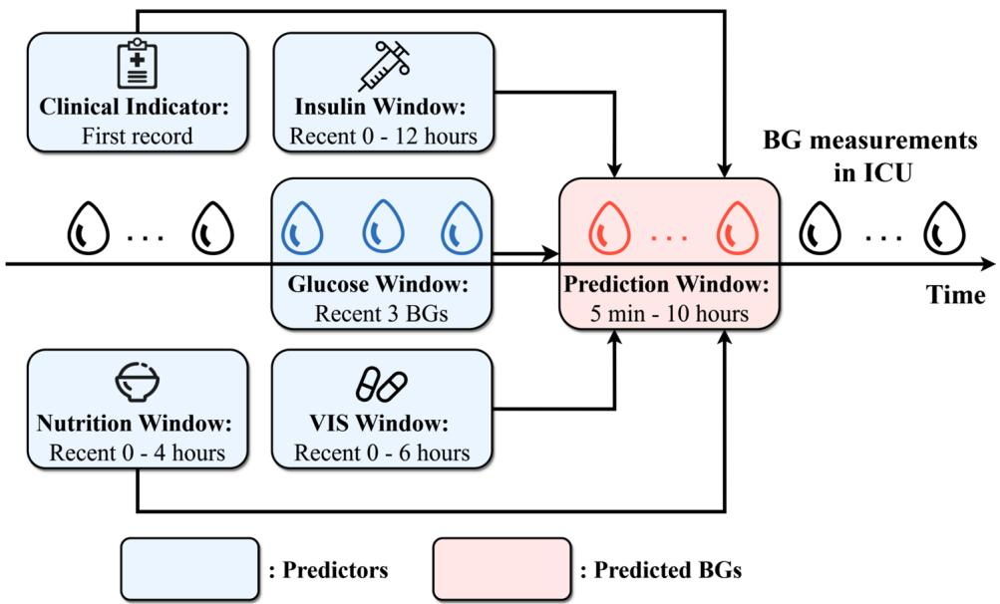
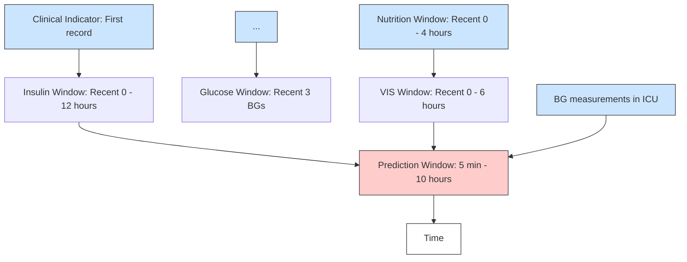
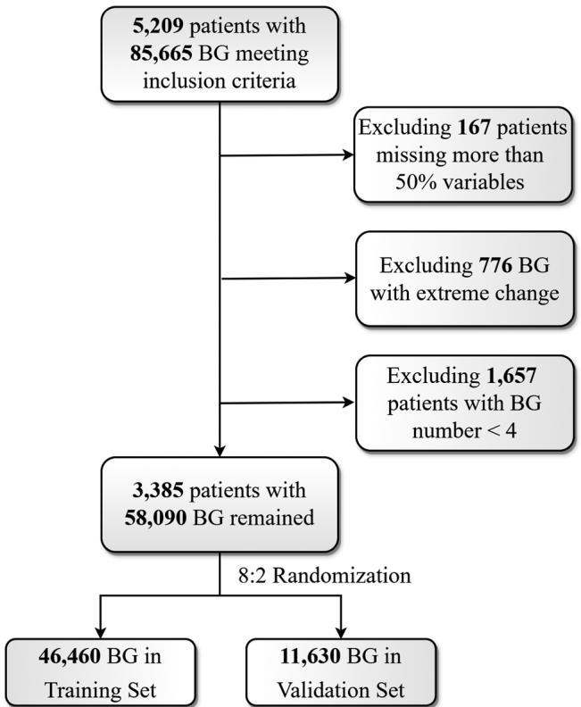
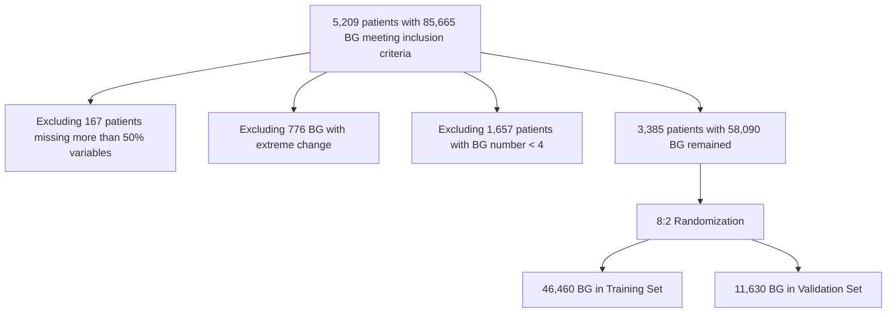
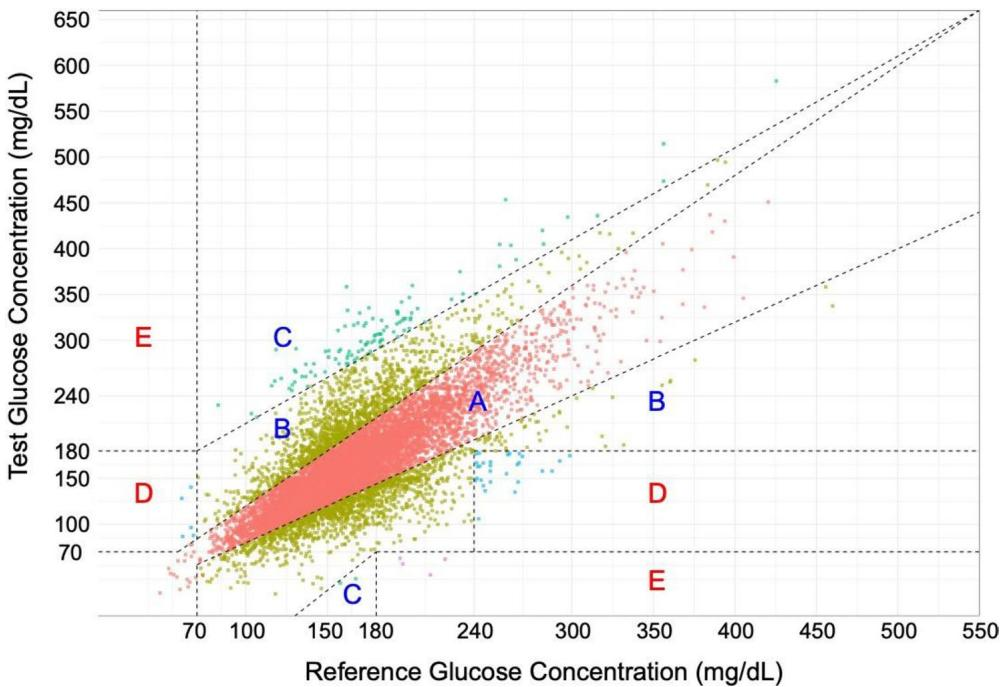
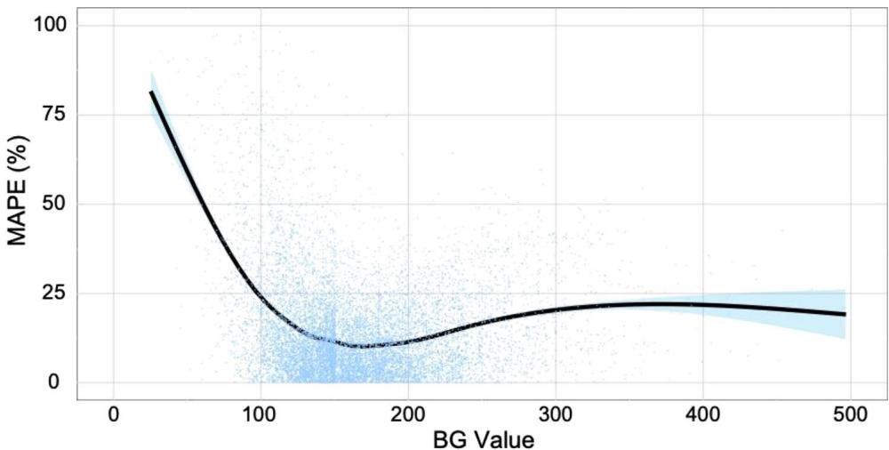
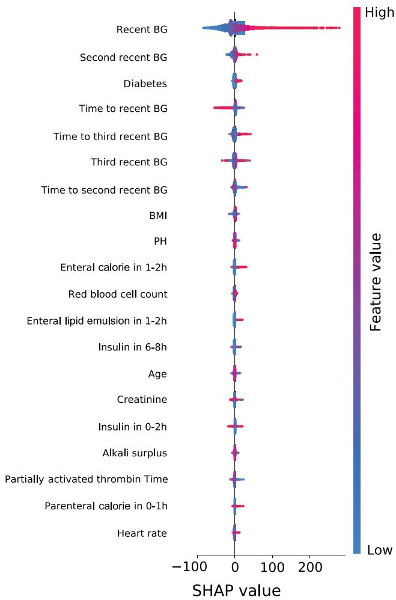
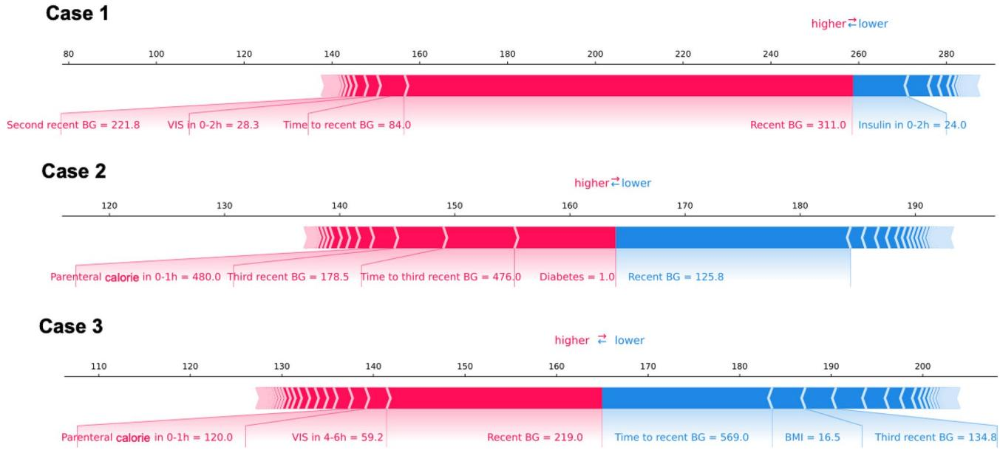

# RESEARCH

# Open Access

# Development and validation of a machine learning model for real-time blood glucose prediction for ICU patients

Shining Cai1,2†, Yundi Hu3†, Yixiang Hong4 , Luheng Qian3 , Shilong Lin2 , Xiaolei Lin3\*, Ming Zhong2\* and Yuxia Zhang1\*

# Abstract

Background Glucose control of ICU patients is complicated due to various diseases, different patient characteristics, and divergent treatment received during ICU stay. To deal with this challenge, machine learning prediction models are emerging to forecast glucose-related events. Our study utilizing the machine learning algorithm to develop a realtime blood glucose (BG) prediction model, which aims to promote the precision insulin therapy.

Methods Electronic medical record data from a tertiary hospital were collected from September 2021 to September 2022. Demographics, comorbidities, vital signs, laboratory results, previous BG measurements, records of insulin injection, nutritional intake, and vasoactive inotropic score (VIS) were included as candidate predictor variables. Four machine learning algorithms including elastic net linear regression, random forest, eXtreme Gradient Boosting (XGBoost), and support vector regression were employed to develop prediction model. Internal validation was performed to select final model, and then was externally validated using MIMIC-IV database. Performance metrics included root mean square error (RMSE), mean absolute percentage error (MAPE), mean absolute deviation (MAD), and Clarke error grid analysis (CEGA). Finally, subgroup analysis detected predictive performance’s heterogeneity, while Shapley additive explanation (SHAP) method enhanced the clinical interpretability.

Results Total of 3,385 ICU patients with 58,090 BG measurements were included, with 80% for training and 20% for validation. XGBoost performed best in internal validation and was selected as final model (RMSE = 33.59mg/ dL, MAPE = 15.39%, MAD = 23.92mg/dL, proportion of type A predictions = 75.67%, and proportion of clinically inappropriate predictions = 0.29%). XGBoost model also showed satisfactory performance in external validation of MIMIC-IV database, underscoring robustness and generalizability. Finally, SHAP method elucidated predictors’ contributions to the predictions from both global and individual perspectives.

† Shining Cai and Yundi Hu should be considered joint first author.

\*Correspondence:

Xiaolei Lin

xiaoleilin@fudan.edu.cn

Ming Zhong

zhong.ming@zs-hospital.sh.cn

Yuxia Zhang

zhang.yuxia@zs-hospital.sh.cn

Full list of author information is available at the end of the article

BMC

© The Author(s) 2025. Open Access This article is licensed under a Creative Commons Attribution-NonCommercial-NoDerivatives 4.0 International License, which permits any non-commercial use, sharing, distribution and reproduction in any medium or format, as long as you give appropriate credit to the original author(s) and the source, provide a link to the Creative Commons licence, and indicate if you modified the licensed material. You do not have permission under this licence to share adapted material derived from this article or parts of it. The images or other third party material in this article are included in the article’s Creative Commons licence, unless indicated otherwise in a credit line to the material. If material is not included in the article’s Creative Commons licence and your intended use is not permitted by statutory regulation or exceeds the permitted use, you will need to obtain permission directly from the copyright holder. To view a copy of this licence, visit http://creati vecommons.org/licenses/by-nc-nd/4.0/.

Conclusions Our study proposes a real-time blood glucose prediction model utilizing the XGBoost machine learning framework in real-world ICU scenarios. The model could facilitate clinicians in understanding the real-time trend of patients’ glucose level and making timely therapeutic decisions.

Clinical trial number Not applicable.

Keywords Machine learning, Blood glucose, Critical care, Real-time, Prediction

# Introduction

Hyperglycemia, which is frequently seen in intensive care units (ICU), can be owing to preexisting diabetes or induced by stress. It is highly associated with poor ICU outcomes [1], especially when the patient has acute coronary syndrome, myocardial infarction, trauma and severe stroke [2–5]. Additionally, hyperglycemia increases the risk of nosocomial infectious morbidity among patients with trauma [2]. In order to manage hyperglycemia in the ICU, insulin therapy is requested when the patient has any of the following situations: type-1 diabetes, stress-induced hyperglycemia and some long-term type-2 diabetes. Nevertheless, insulin overdose during the treatment will result in hypoglycemia, defined as a glucose level below 70 mg/dl, causing a higher risk of inpatient mortality and increased length of hospital stay [6]. A retrospective cohort study among 107,312 admissions demonstrated that hypoglycemia occurred in 20% of hospitalizations receiving insulin treatment, with an inpatient fatality rate of 6.5% among those with hypoglycemia [6]. Currently, the clinical criterion is to keep the blood glucose below 180 mg/dl, which has been shown to be able to reach lower mortality compared with intensive blood glucose in the Nice-Sugar trial [7].

For ICU patients, glucose control is especially complicated due to various diseases, different patient characteristics, and divergent treatment received during ICU stay. In order to deal with these challenges, there has been increasing interest in developing approaches to forecast glucose-related events. Physiologic models, which consist of differential equations illustrating the interaction between blood glucose and insulins, are widely used in traditional predictive models [8, 9]. Based on four compartments, including insulin dynamics, glucose dynamics, exercise models and meal conditions [10], these models can perform well under ideal situations with fixed parameters. However, in the complex environment of ICU, they fail to accurately describe the dynamics of blood glucose since several covariates that could potentially affect the change of glucose are not considered [11]. Meanwhile, the inability to quantify the particular clinical phenomenon and identify the required data to estimate the parameters further reduces the accuracy.

Machine learning (ML) techniques have been introduced to capture complicated patterns associated with the diagnosis, treatment courses and prognosis of various disorders [12]. Current studies have begun to develop data-driven approaches in exploiting glucose evolutional trajectories out of massive and structured electronic medical record (EMR) data. While a large majority of studies focus on predicting hyperglycemia or hypoglycemia as binary events of interests, research that directly aims at forecasting real-time glucose level remains relatively scarce, and few can be applied to patients in ICU setting. As insulin dose adjustments frequently occur in daily ICU scenarios, it is essential to establishing predictive models that could facilitate clinicians in understanding the real-time trend of patients’ glucose level and making timely therapeutic decisions. With this motivation, we propose a data-driven approach to predict blood glucose level in the next time window between 5 minutes to 10 hours using EMR data from a single institutional medical center. In addition, predictive models will be validated externally using MIMIC-IV (Medical Information Mart for Intensive Care IV) database.

# Methods

# Data collection

We retrospectively collected EMR data from ICU patients with complete admission records at a tertiary teaching hospital (Zhongshan Hospital, Fudan University) between September 2021 and September 2022. Blood glucose (BG) measurements were included if they were measured within 5 minutes to 10 hours of the most recent BG measurement. We excluded BG measurements followed by another within 5 minutes, as this could indicate either a spurious reading or the same hypoglycemic/ hyperglycemic episode. The 10-hour upper limit for the prediction window was chosen as it typically represents the longest interval between BG checks in ICU patients (e.g., overnight to morning measurements). Implausible BG measurements were excluded if the glucose level decreased by more than 200 mg/dL without any insulin administration, or increased by more than 200 mg/dL in the absence of nutritional intake. These values were considered physiologically unlikely and potentially due to documentation or measurement errors. Patients with fewer than 4 BG measurements or more than 50% missing vital signs and laboratory indicators were excluded.

# Prediction outcome and predictors

The prediction outcome was to predict the BG levels in real-time within the 5-minute to 10-hour window. Demographics, comorbidities, vital signs, laboratory indicators, previous BG measurements, insulin administration, nutritional intake, and vasoactive inotropic score (VIS) were included as candidate predictors. For vital signs and laboratory indicators, their first measurements at ICU admission were used, and those with more than 30% missing values were excluded to avoid imputation bias Missing values in remaining predictors were addressed via multiple imputation (m = 5). Based on the effective duration, time windows for insulin administration, nutritional intake and VIS were respectively defined as 0-12 h, 0-4 h, and 0-6 h. Figure 1 showed the time windows for the predictors and primary outcome. Table S1 provided the detailed description of all the variables.

# Model setting

Four machine learning algorithms were employed to develop the predictive models, including elastic net linear regression (ENet), random forest (RF), eXtreme Gradient Boosting (XGBoost), and support vector regression (SVR). Hyperparameters for each algorithm were optimized via 5-fold cross-validation. The dataset was randomly partitioned into an 80% training set and a 20% internal validation set. Finally, the model demonstrating the best performance metrics on the internal validation set was selected. To further demonstrate the superiority of machine learning models, we also compared the performance of the four algorithms against a naive prediction that used the most recent BG measurement as the predicted value. External validation was then performed using patient data from the publicly available MIMIC-IV database.

# Subgroup analysis

To evaluate the performance of the prediction model across different patient subgroups, BG were stratified by the most recent BG levels, and patients were categorized through ICU admission type, diabetes status and body mass index (BMI). BG levels were categorized as normal (100–180 mg/dL), elevated ( > 180 mg/dL), or low ( < 100 mg/dL). ICU admission types included cardiac surgery ICU, liver ICU, and surgical ICU. Diabetes status was classified as either diabetic or non-diabetic. BMI was categorized as normal (18.5–24 kg/m2 ), higher (≥24 kg/ m2 ), or lower ( < 18.5 kg/m2 ).

# Model interpretation

Shapley additive explanation (SHAP) method was used to interpret results from the prediction model, which is a unified approach for calculating the contribution and influence of each feature toward the final prediction model. SHAP value is able to measure the contribution of each predictor in terms of effect direction and effect sizes toward the final predicted values.

# Statistical analysis

Data collection and cleaning was performed using MySQL (version 5.7.33), model training and statistical analyses were conducted in R (version 4.0.3), SHAP interpretation was performed by “shap” package (version 0.41.0) in Python (version 3.8). Missing data were imputed using the R package “mice” (version 3.14.0). Prediction models were trained and validated using the R package “caret” (version 6.0.92). Continuous characteristics were described using mean ± standard deviation if normally distributed, or median (interquartile range) if normality was violated. Categorical characteristics were presented using frequency (percentage) per category. Statistical tests were performed using student t test for continuous variables (Wilcoxon rank sum test for skewed distribution), and Chi-square for categorical variables.

flowchart

Fig. 1 Schematic of predictors and prediction outcome. The outcome was defined as blood glucose levels 5 minutes to 10 hours after each measurement. For vital signs and laboratory parameters, the first values recorded at ICU admission were used. Based on their effective duration, time windows for insulin administration, nutritional intake, and vis were set to 0–12 h, 0–4 h, and 0–6 h, respectively. Blue elements represent predictors, and red indicates the target BG value. BG, blood glucose; vis, vasoactive inotropic score

To evaluate the performance of the prediction models relative to the naive model where the most recent BG value was taken as the predicted BG value, we calculated the root mean square error (RMSE), mean absolute percentage error (MAPE) and mean absolute deviation (MAD) associated with each prediction model. Both RMSE and MAD measure the average deviation of the predicted value from the true values. MAPE measures the average deviation relative to the mean. In addition, we applied the Clarke error grid analysis (CEGA), which divides predicted values into 5 categories based on A) predictions within 20% of the true values, B) predictions that are outside of 20% but would not lead to inappropriate treatment, C) predictions leading to unnecessary treatment, D) predictions that fail to identify a potentially dangerous hypoglycemic or hyperglycemic event, and E) predictions that would confuse hypoglycemia for hyperglycemia and vice versa. Among them, Type D and Type E were defined as clinically inappropriate prediction.

flowchart

Fig. 2 Flowchart of patient inclusion. A total of 5,209 ICU patients with 85,665 blood glucose measurements and complete admission records at a tertiary hospital between September 2021 and September 2022 were initially considered. Of these, 167 patients were excluded for having more than 50% missing laboratory indicators and vital signs; 776 BG measurements were removed due to extreme changes (a decrease > 200 mg/dL without insulin administration or an increase > 200 mg/dL without nutritional intake); and 1,657 patients were excluded for having fewer than four BG measurements. The remaining cohort comprised 3,385 patients with 58,090 BG measurements, of which 46,460 were randomly assigned to the training set and 11,630 to the validation set. BG, blood glucose

# Ethics

This study involving human data was conducted in accordance with the principles of the Declaration of Helsinki. The protocol was reviewed and approved by the Ethics Committee of Zhongshan Hospital, Fudan University (approval number: B2024-026, date:1/26/2024). Given the retrospective nature of the study, the requirement for informed consent was waived by the Ethics Committee of Zhongshan Hospital, Fudan University.

# Clinical trial number

Not applicable.

# Results

# Patient characteristics in training, validation, and external validation sets

A total of 5,209 patients with 85,665 BG measurements were firstly included. Of these, 167 patients had more than 50% of missing laboratory indicators and vital signs, 776 BG measurements with extreme changes, and 1,657 patients with fewer than 4 BG measurements were therefore excluded. This left 3,385 patients with 58,090 BG measurements for the final analyses, of which 46,460 BG measurements were randomly assigned to the training set and 11,630 to the validation set (Fig. 2). Baseline characteristics for patients in the training and validation set were summarized in Table 1. Over 30% BG measurements exceeded 180 mg/dL, while fewer than 1% fell below 70 mg/dL. Approximately 25% patients received insulin administration and more than 70% had nutritional intake. In addition, about 20% patients had diabetes, deserving the need for focused clinical attention. Overall, patients in the training and validation set were similar in terms of demographics, glycemic control, clinical signs and comorbidity.

Using a similar procedure, we extracted 29,071 BG measurements from 1,046 ICU patients in the MIMIC-IV database. Baseline characteristics for patients in external validation set were described in Table S2. Compared with the derivation set, there were highly significant differences across nearly all baseline variables (p < 0.001), thereby underscoring the robustness and generalizability of the developed predictive model.

Table 1 Patient characteristics in the training and validation sets 

<table><tr><td></td><td>Training set(n=2,704)</td><td>Validation set(n=681)</td><td>P value</td></tr><tr><td colspan="4">Demographics</td></tr><tr><td>Age (years), median (IQR)</td><td>63 (54 - 70)</td><td>64 (53 - 69)</td><td>0.6714</td></tr><tr><td>BMI, median (IQR)</td><td>23.6 (21.3 - 25.9)</td><td>23.8 (21.7 - 26.4)</td><td>0.0655</td></tr><tr><td>Male, n (%)</td><td>1,796 (66.4%)</td><td>429 (62.9%)</td><td>0.0922</td></tr><tr><td>Cardiac Surgery ICU, n (%)</td><td>2170 (80.3%)</td><td>532 (78.0%)</td><td>0.2106</td></tr><tr><td>Liver ICU, n (%)</td><td>249 (9.2%)</td><td>72 (10.5%)</td><td>0.3112</td></tr><tr><td>Surgical ICU, n (%)</td><td>282 (10.4%)</td><td>75 (11.0%)</td><td>0.7085</td></tr><tr><td colspan="4">Glycemic control, n (%)</td></tr><tr><td>Number of BG measurements</td><td>46,460</td><td>11,630</td><td></td></tr><tr><td>Above 180 mg/dL</td><td>15,055 (32.4%)</td><td>3,859 (33.2%)</td><td>0.1122</td></tr><tr><td>Below 70 mg/dL</td><td>449 (1.0%)</td><td>118 (1.0%)</td><td>0.6744</td></tr><tr><td>Patients with insulin administered</td><td>649 (24.0%)</td><td>173 (25.4%)</td><td>0.4883</td></tr><tr><td>Patients with vasoactive drug administered</td><td>1555 (57.5%)</td><td>374 (54.8%)</td><td>0.2245</td></tr><tr><td>Patients with enteral nutrition</td><td>323 (11.9%)</td><td>94 (13.8%)</td><td>0.2150</td></tr><tr><td>Patients with parenteral nutrition</td><td>1987 (73.5%)</td><td>500 (73.3%)</td><td>0.9671</td></tr><tr><td colspan="4">Clinical signs, median (IQR)</td></tr><tr><td>Respiration rate (bpm)</td><td>15.0 (15.0 - 16.0)</td><td>15.0 (15.0 - 17.0)</td><td>0.2673</td></tr><tr><td>Heart rate (beats/min)</td><td>82.0 (75.0 - 92.0)</td><td>82.0 (74.0 - 92.5)</td><td>0.6864</td></tr><tr><td>Systolic blood pressure (mmHg)</td><td>114.0 (106.0 - 122.0)</td><td>115.0 (107.0 - 122.0)</td><td>0.3181</td></tr><tr><td>Diastolic blood pressure (mmHg)</td><td>59.0 (54.5 - 64.5)</td><td>60.0 (55.0 - 65.0)</td><td>0.1193</td></tr><tr><td>Oxygen saturation (%)</td><td>99.0 (99.0 - 100.0)</td><td>99.0 (99.0 - 100.0)</td><td>0.7433</td></tr><tr><td colspan="4">Comorbidity, n (%)</td></tr><tr><td>Diabetes</td><td>568 (21.0%)</td><td>146 (21.4%)</td><td>0.8593</td></tr><tr><td>High blood pressure</td><td>1278 (47.3%)</td><td>318 (46.6%)</td><td>0.7993</td></tr></table>

\*Patients were randomly divided into the training and testing set using a stratified randomization scheme. p values were obtained using student t test for normally distributed variables, Wilcoxon rank sum test for skewed distributed variables and Chi-square (or Fisher’s exact) test for categorical variables

Table 2 Performance metrics under the four machine learning prediction model and the naive prediction model 

<table><tr><td>Performance Metric</td><td>Naive</td><td>LR</td><td>RF</td><td>SVR</td><td>XGBoost</td></tr><tr><td>RMSE (mg/dL)</td><td>40.74</td><td>34.69</td><td>34.56</td><td>35.51</td><td>33.59</td></tr><tr><td>MAPE (%)</td><td>17.50</td><td>16.55</td><td>16.56</td><td>16.13</td><td>15.39</td></tr><tr><td>MAD (mg/dL)</td><td>32.27</td><td>25.27</td><td>25.61</td><td>25.51</td><td>23.92</td></tr><tr><td>Type A prediction in CEGA (%)</td><td>68.36</td><td>72.37</td><td>73.57</td><td>72.60</td><td>75.67</td></tr><tr><td>Clinically inappropriate prediction in CEGA (%)</td><td>1.88</td><td>0.38</td><td>0.20</td><td>0.56</td><td>0.29</td></tr></table>

\* RMSE, root mean square error; MAPE, mean absolute percentage error; MAD, mean absolute deviation; CEGA, Clarke error grid analysis; LR, linear regression; RF, random forest; SVR, support vector regression. \* Naive prediction model assumes the most recent BG value as the predicted BG value. \* Type A prediction in CEGA refers to predictions within 20% of the true values. \* Clinically inappropriate prediction in CEGA refers to the Type D and Type E predictions, where predictions fail to identify a potentially dangerous hypoglycemic or hyperglycemic event, or predictions would confuse hypoglycemia for hyperglycemia and vice versa

# Robust model performance and final selection of XGBoost

After performing 5-fold cross-validation to identify the optimal hyperparameters for the ENet, RF, SVR, and XGBoost models, and subsequently training each model on the training set (see Text S1 for hyperparameter details), we summarized their performance alongside the naive prediction in Table 2. Among all algorithms, XGBoost achieved the best or near-best results on every metric (RMSE=33.59mg/dL, MAPE=15.39%, MAD=23.92mg/dL, Type A proportion=75.67%), and its rate of clinically inappropriate predictions (0.29%) was second only to RF (0.20%), indicating superior accuracy and stability. Accordingly, we selected XGBoost as our final predictive model. Detailed CEGA classification of XGBoost predictions was presented in Fig. 3.

Compared with the naive predictor, all four machine learning models yielded substantial improvements, particularly in reducing the proportion of clinically inappropriate predictions (1.88% in naive prediction). This demonstrated that these approaches can markedly lower the risk of unsuitable glycemic interventions and enhance patient safety.

# External validation underscoring model’s robustness and generalizability

Finally, data from the publicly available MIMIC-Ⅳ database were harmonized and used as the external validation set. Table 3 showed the performance metrics of XGBoost model in the external validation set. Compared with its performance in the internal validation set, predictive accuracy did not appreciably decline in the external validation set and still remained superior to that of the naive model, particularly with respect to the rate of clinically inappropriate predictions (0.37% for XGBoost vs. 2.17% for the naive model). These results demonstrate that our model sustained clinically acceptable performance even in the highly heterogeneous populations, highlighting its robustness and generalizability.

scatter

| Reference Glucose Concentration (mg/dL) | Test Glucose Concentration (mg/dL) | Label |
| --------------------------------------- | ---------------------------------- | ----- |
| 70                                      | 70                                 | D     |
| 100                                     | 100                                | B     |
| 150                                     | 150                                | C     |
| 240                                     | 240                                | A     |
| 350                                     | 350                                | B     |
| 400                                     | 400                                | A     |
| 500                                     | 500                                | E     |
| 550                                     | 650                                | E     |

Fig. 3 Clarke error grid analysis results for the XGBoost prediction model. Percentages of prediction in each region: type a, 75.67%; type B, 23.13%; type C, 0.91%; type d, 0.26%; type e, 0.03%. Type a: predictions within 20% of the true values; type B: predictions that are outside of 20% but would not lead to inappropriate treatment; type C: predictions leading to unnecessary treatment; type d: predictions that fail to identify a potentially dangerous hypoglycemic or hyperglycemic event; type e: predictions that would confuse hypoglycemia for hyperglycemia and vice versa. Among them, type D and Type E were defined as clinically inappropriate prediction

Table 3 Performance metrics in the MIMIC-IV external validation set 

<table><tr><td>Performance Metric</td><td>XGBoost</td><td>Naive</td></tr><tr><td>RMSE (mg/dL)</td><td>36.97</td><td>39.16</td></tr><tr><td>MAPE (%)</td><td>17.04</td><td>18.22</td></tr><tr><td>MAD (mg/dL)</td><td>22.51</td><td>34.95</td></tr><tr><td>Type A prediction in CEGA (%)</td><td>71.56</td><td>69.49</td></tr><tr><td>Clinically inappropriate prediction in CEGA (%)</td><td>0.37</td><td>2.17</td></tr></table>

\* RMSE, root mean square error; MAPE, mean absolute percentage error; MAD, median absolute deviation; CEGA, Clarke error grid analysis. \* Type A prediction in CEGA refers to predictions within 20% of the true values. \* Clinically inappropriate prediction in CEGA refers to the Type D and Type E predictions, where predictions fail to identify a potentially dangerous hypoglycemic or hyperglycemic event, or predictions would confuse hypoglycemia for hyperglycemia and vice versa

Additionally, because the data was split at the measurement level, there is some overlap of population information between the training and validation sets, which could introduce information leakage and potentially lead to an overestimation of the model performance. To assess this, we re-split the data at the patient-level and evaluated the model performance on the validation set, as shown in Table S3. The results demonstrate that the performance metrics are comparable to those obtained at the measurement level, indicating the robustness of the model (RMSE=33.71mg/dL, MAPE=15.45%, MAD=24.05mg/ dL, Type A proportion = 74.82%, Clinically inappropriate proportion=0.22%).

# Subgroup analysis demonstrating heterogeneity in predictive performance

Following the selection of XGBoost as our final predictive model, we evaluated its performance metrics across subgroups defined by most recent BG values, ICU admission type, diabetes status, and BMI. Table 4 summarizes the subgroup analyses. Among the most recent BG strata, patients in the normal range exhibited the best predictive performance. Although the elevated BG group showed larger absolute errors (RMSE and MAD), its relative error remained acceptable (MAPE = 16.80%), whereas the low BG group displayed the converse pattern. Fig. 4 depicted the distribution of absolute prediction errors across BG levels, demonstrating increased errors at the extremes. Predictive accuracy was markedly poorer for patients admitted to the liver ICU and for those with diabetes, consistent with prior evidence of greater glycemic instability in these populations and underscoring the need for enhanced clinical vigilance. In contrast to the pronounced differences observed for other subgroups, performance across BMI categories varied only modestly. Patients with low BMI experienced a slight reduction in accuracy, which may due to their relatively small proportion.

Table 4
Xgboost performance metrics for subgroup analysis 

<table><tr><td rowspan="2">Performance Metric</td><td colspan="3">Most recent BG</td><td colspan="3">ICU admission type</td></tr><tr><td>Normal(n=7,105)</td><td>Elevated(n=3,807)</td><td>Low(n=718)</td><td>Cardiac Surgery(n=10,398)</td><td>Liver(n=795)</td><td>Surgical(n=437)</td></tr><tr><td>RMSE (mg/dL)</td><td>29.14</td><td>42.03</td><td>29.96</td><td>32.70</td><td>42.94</td><td>32.99</td></tr><tr><td>MAPE (%)</td><td>15.23</td><td>16.80</td><td>22.73</td><td>14.65</td><td>22.37</td><td>19.26</td></tr><tr><td>MAD (mg/dL)</td><td>14.16</td><td>20.40</td><td>12.96</td><td>23.49</td><td>30.54</td><td>24.64</td></tr><tr><td>Type A prediction in CEGA (%)</td><td>77.71</td><td>73.65</td><td>66.16</td><td>76.87</td><td>62.64</td><td>71.02</td></tr><tr><td>Clinically inappropriate prediction in CEGA (%)</td><td>0.01</td><td>0.87</td><td>0.70</td><td>0.32</td><td>0.75</td><td>0</td></tr><tr><td rowspan="2">Performance Metric</td><td colspan="3">Diabetes status</td><td colspan="3">BMI</td></tr><tr><td>Diabetes(n=3,196)</td><td></td><td>No diabetes(n=8,434)</td><td>Normal(n=5,362)</td><td>Higher(n=5,396)</td><td>Lower(n=872)</td></tr><tr><td>RMSE (mg/dL)</td><td>38.10</td><td></td><td>32.11</td><td>35.44</td><td>33.03</td><td>39.12</td></tr><tr><td>MAPE (%)</td><td>16.81</td><td></td><td>15.19</td><td>16.21</td><td>14.30</td><td>19.91</td></tr><tr><td>MAD (mg/dL)</td><td>21.46</td><td></td><td>21.21</td><td>22.97</td><td>24.40</td><td>24.44</td></tr><tr><td>Type A prediction in CEGA (%)</td><td>73.24</td><td></td><td>76.58</td><td>74.24</td><td>77.78</td><td>71.33</td></tr><tr><td>Clinically inappropriate prediction in CEGA (%)</td><td>0.41</td><td></td><td>0.25</td><td>0.45</td><td>0.24</td><td>0.23</td></tr></table>

or low (<18.5kg/m2
) values. \*Clinically inappropriate prediction in CEGA refers to the type D and type E predictions, where predictions fail to identify a potentially dangerous hypoglycemic or hyperglycemic event, or predictions would confuse 
hypoglycemia for hyperglycemia and vice versa. \*BG levels were categorized as normal (100–180mg/dL), elevated (>180mg/dL), or low (<100mg/dL). BMI was categorized as normal (18.5–24kg/m2), elevated (≥24kg/m2), \* RMSE, root mean square error; MAPE, mean absolute percentage error; MAD, mean absolute deviation; CEGA, Clarke error grid analysis. \* Type A prediction in CEGA refers to predictions within 20% of the true

# SHAP enhancing clinical interpretability and predictive credibility

SHAP method was used to access the effect size and effect direction of each predictor under the XGBoost prediction model. Figure 5 showed the predictor importance (SHAP value) of the top 20 predictors, where the horizontal bar showed the amount of contribution for each predictor. Recent BG related predictors contributed the most significantly to the prediction model. Enteral nutrition was more important than parenteral nutrition in the final prediction. Low PH and high red blood cell count (RBC) contributed to higher BG values, while high creatinine (Cr) and high activated partial thromboplastin time (APTT) contributed to lower BG.

Figure 6 presented individual SHAP explanations for 3 selected BG predictions. In Case 1, although the most recent BG measurement was 311 mg/dL, insulin administration within the preceding 0–2 hour window reduced the predicted BG to approximately 260 mg/dL. Similarly, in Case 2, despite a relatively low recent BG, the infusion of 480 kcal of parenteral nutrition within the 0–1 hour window in a diabetic patient drove the predicted value above 160 mg/dL.

# Discussion

Using complex and structured EMR data, our study proposes a real-time blood glucose prediction model utilizing the four machine learning framework. The proposed model was evaluated comprehensively by various model performance metrics, including RMSE, MAPE and MAD that were commonly used in machine learning tasks, and CEGA that were often utilized in medical diagnosis settings. Internal validation confirmed XGBoost as the final prediction model, and external validation highlighting the robustness and generalizability of our model. Subgroup analyses suggested that the prediction model performed better in BGs with normal most recent BG, patients in cardiac surgery ICU as well as surgery ICU, patients without type II diabetes. BG related predictors had the highest contribution to the prediction model, following by diabetes, BMI, enteral nutrition, insulin administration, and some laboratory indicators like RBC, PH, Cr, APTT.

Consistent with existing literature and medical knowledge, we observed the largest contribution of real-time blood glucose prediction from the most recent measured blood glucose level. This is also expected from a technical point of view since most recent blood glucose is strongly associated with the real-time blood glucose due to time-serial correlation. In addition, time gap from the real-time blood glucose to the most recently measured blood glucose value played an important role. This can also be depicted because higher or lower values of recent blood glucose values might call for a shorter time gap, while normal values of recent blood glucose level would call for a longer time gap to the next glucose monitoring time stamp. Further, our model performs better for patients with more stable blood glucose level or for patients with certain characteristics or medical conditions. This can also be explained from a technical perspective since patients within each subgroup are relatively homogenous in terms of health conditions, and therefore tend to have relatively similar patterns in realtime blood glucose trajectories. Although our study primarily focused on postoperative ICU patients, we acknowledge the inherent heterogeneity within the broader ICU population. Patients admitted for other reasons, such as diabetic ketoacidosis, sepsis, or respiratory failure, may exhibit different patterns of glucose regulation and responses to treatment. As such, the performance and clinical utility of our model in non-postoperative ICU populations remain uncertain. Future studies are needed to validate and potentially refine the model in these subgroups. This issue has been highlighted in recent literature emphasizing the importance of accounting for population heterogeneity in predictive modeling [13]. Additionally, while our study was designed to build a predictive model rather than to draw causal conclusions, we recognize that several included variables are modifiable in clinical settings, such as insulin administration and nutritional intake. Future research may consider incorporating causal inference approaches, such as target trial emulation, to examine the potential impact of specific interventions [14].

scatter

| BG Value | MAPE (%) |
| -------- | -------- |
| 0        | 80       |
| 100      | 25       |
| 200      | 10       |
| 300      | 20       |
| 400      | 25       |
| 500      | 20       |

Fig. 4 Distribution of absolute percentage error across true blood glucose values. The model exhibited greater relative error at low BG levels, likely due to the rarity and smaller magnitude of hypoglycemic measurements. Although relative error increased slightly at higher BG values, it remained below 25%. BG, blood glucose; MAPE, mean absolute percentage error

This study employed SHAP to elucidate the blackbox model and enhance clinical interpretability. As shown in Fig. 5, the overall importance ranking of insulin is moderate, which can be attributed to the relatively low proportion of individuals receiving insulin therapy (25%). However, in the insulin-treated subpopulation, it serves as a more pronounced predictor for glucose levels. As illustrated in Fig. S1, insulin administration within a 0–6 hour window significantly contributes to lower predicted glucose values. Beyond 6 hours, its predictive influence shifts toward elevated glucose levels (Fig. S2), likely reflecting the waning therapeutic effect of insulin over its prolonged duration of action. Contrary to clinical intuition, the average SHAP value for enteral nutrition within 1–2 hours exceeds that of parenteral nutrition within 0–1 hour. This may be explained by the common co-administration of insulin with parenteral nutrition to mitigate glucose excursions. Specifically, among patients receiving parenteral nutrition within 0–1 hour, the average calorie dose was 211.09 with concurrent insulin, compared to only 84.87 without insulin. In contrast, for enteral nutrition within 1–2 hours, the average calorie intake was slightly lower with insulin (158.70) than without (176.63). These patterns suggest that insulin moderates the glucose-elevating effect of parenteral nutrition, thereby reducing its apparent predictive contribution.

For ICU patients, the presence of inconsistent parameters results in severe fluctuations in their blood glucose level, causing more frequent occurrences of hyperglycemia and hypoglycemia, which simultaneously increase the difficulty in blood glucose monitoring. Furthermore, unique features of ICU patients, such as large between- and within-patient variations in laboratory indicators and vital signs, bring additional barriers for clinicians to appropriately adjust insulin therapy according to patients’ medical history and real-time physical conditions. Historically, ICU patients with different illness syndromes and therapeutic responses were often treated with the standardized insulin protocols [15]. Precision medicine, on the other hand, suggests that medical decision making should be customized rather than standardized, and has emerged as a transformative approach in ICU setting. In this study, we take a data-driven approach to inform the customization of blood glucose control by predicting real-time blood glucose level dynamically using admission records and EMR data. Since various time-series observations could be obtained for each ICU patient, we adopted a time-varying prediction approach by slicing candidate predictors, such as nutrition intake and insulin injection, into multiple time windows in predicting real-time blood glucose. In addition, time-serial blood glucose measurements are highly unstable and measured at irregular time points for different ICU patients. Our study adopts a relatively flexible prediction window by forecasting the blood glucose level in the next 5 minutes to 10 hours. Although this study focused on predictive accuracy, an important direction for future work is to evaluate how such models can assist in real-time clinical decisionmaking. For instance, the model could help anticipate abnormal glycemic trends and provide timely support for insulin titration or nutritional adjustments. Future studies will explore the integration of our model into clinical decision support systems, aiming to embed real-time predictions into ICU workflows and improve the precision of glycemic management.

bar

| Feature | SHAP value range |
| --- | --- |
| Recent BG | High (up to ~250) |
| Second recent BG | Low (down to ~50) |
| Diabetes | Low (down to ~20) |
| Time to recent BG | Low (down to ~10) |
| Time to third recent BG | Low (down to ~5) |
| Third recent BG | Low (down to ~2) |
| Time to second recent BG | Low (down to ~1) |
| BMI | Low (down to ~5) |
| PH | Low (down to ~2) |
| Enteral calorie in 1-2h | Low (down to ~1) |
| Red blood cell count | Low (down to ~5) |
| Enteral lipid emulsion in 1-2h | Low (down to ~2) |
| Insulin in 6-8h | Low (down to ~1) |
| Age | Low (down to ~5) |
| Creatinine | Low (down to ~2) |
| Insulin in 0-2h | Low (down to ~1) |
| Alkali surplus | Low (down to ~5) |
| Partially activated thrombin Time | Low (down to ~2) |
| Parenteral calorie in 0-1h | Low (down to ~1) |
| Heart rate | Low (down to ~5) |

Fig. 5 Top 20 predictor importance values derived by shap method in the XGBoost model. Red arrows indicate predictors that increase the predicted blood glucose value, while blue arrows indicate predictors that decrease it. Arrow length corresponds to the magnitude of each predictor’s effect. The longer the arrow, the greater its impact on the prediction. shap, Shapley additive explanation

Much of the existing work on developing prediction model of blood glucose for ICU patients relies on the physiology-based systems of ordinary differential equations, which simultaneously considers the interaction between blood glucose level and insulin injections. While machine learning techniques were seldom chosen as the primary analytical strategy, existing machine learning models used for detecting hyperglycemia or hypoglycemia events largely depended on variations of logistic regression models [16, 17], where the outcomes to be predicted are dichotomized binary or multi-category ordinal events. Since logistic regression assumes linear associations between predictor variables and log odds of the probability, which does not usually hold in complicated real-life settings such as glucose control in ICU, most of the existing machine learning models could only achieve moderate predictive performances for glucose-related medical events [18]. Following the initial attempts, alternative predictive methods such as neural networks and decision trees [19–21] are exploited in predicting glucose level with relatively improved discriminative ability. However, neural networks are considered as a black-box method that lacks appropriate model interpretability, which is often desired for prediction tasks in medical setting. Decision tree method is good at modeling interpretation due to its binary splitting strategy, but has relatively low predictive accuracy due to its complex tree structure. Ensemble learning approach, such as boosted tree and random forest models, improves upon the decision tree model by generating series of decision trees and predict according to the aggregated predictive models. Zale et al. developed and validated a random forest model to predict real-time glucose level in hospitalized patients out of a large-scale database containing 184,361 admission records and EMR from 5 hospitals [22]. Their model utilized a short prediction window accounting for time-varying predictors and achieved high sensitivity and specificity in external validation. However, its applicability in ICU patients remain unclear due to drastically different patient characteristics. By focusing on patients in ICU setting, the XGBoost model developed in our study provides good predicting performances by achieving a good balance between model complexity and generalizability. Compared to existing prediction models for ICU glucose control, our model achieved lower percentages of failing to identify potentially dangerous hyperglycemic or hypoglycemic events, which is of paramount importance for the timely diagnosis and prevention of adverse events in medical decision making. In addition, the XGBoost prediction model achieved good performance metrics in the external validation set, supporting its wide applicability and generalizability in the general ICU setting.

  
Fig. 6 Predictor importance values for three individual blood glucose predictions derived by SHAP method. Red arrows indicate predictors that increase the predicted blood glucose value, while blue arrows indicate predictors that decrease it. Arrow length corresponds to the magnitude of each predictor’s effect. The longer the arrow, the greater its impact on the prediction. SHAP, Shapley additive explanation

This study investigates the use of ensemble learning algorithms for blood glucose prediction in ICU patients based on structured EMR data. To obtain more accurate blood glucose prediction and more reliable insulin adjustments, we aimed at real-time continuous blood glucose forecasting, rather than binary hyperglycemic or hypoglycemic events. In addition, our model is able to accommodate dynamic and realtime glucose prediction using dynamic and time-sliced clinical predictors from a personalized medicine perspective. However, we have to admit that there are several limitations associated with this study. Firstly, this is a single-center observational study and results might subject to confounding bias. Although we validated the model using the MIMIC-IV database, which includes patients from a different healthcare system and ethnic background, further validation in more diverse populations across different regions is still needed. Secondly, only traditional machine learning models are considered in constructing the glucose prediction model, models that rely on other techniques, such as deep learning or reinforcement learning, are not investigated. Finally, although the predictive model has been validated in an independent external data set, its applicability and generalizability to other disease populations, or the general healthy population are limited.

# Conclusion

In conclusion, we developed and validated a real-time blood glucose prediction model based on the XGBoost algorithm, leveraging comprehensive clinical data from ICU patients. The model demonstrated robust performance in both internal and external validation cohorts, with low prediction error and high clinical concordance. Importantly, the integration of SHAP analysis enhanced interpretability, offering insights into key predictive factors at both the population and individual levels. This model holds promise for improving glycemic control by supporting timely and personalized insulin therapy decisions in the dynamic ICU environment.

# Abbreviations

ICU Intensive care units

BG Blood glucose

<table><tr><td>VIS</td><td>Vasoactive inotropic score</td></tr><tr><td>XGBoost</td><td>eXtreme Gradient Boosting</td></tr><tr><td>RMSE</td><td>Root mean square error</td></tr><tr><td>MAPE</td><td>Mean absolute percentage error</td></tr><tr><td>MAD</td><td>Mean absolute deviation</td></tr><tr><td>CEGA</td><td>Clarke error grid analysis</td></tr><tr><td>SHAP</td><td>Shapley additive explanation</td></tr><tr><td>ML</td><td>Machine learning</td></tr><tr><td>EMR</td><td>Electronic medical record</td></tr><tr><td>ENet</td><td>Elastic net linear regression</td></tr><tr><td>RF</td><td>Random forest</td></tr><tr><td>SVR</td><td>Support vector regression</td></tr><tr><td>BMI</td><td>Body mass index</td></tr><tr><td>RBC</td><td>Red blood cell count</td></tr><tr><td>Cr</td><td>Creatinine</td></tr><tr><td>APTT</td><td>Activated partial thromboplastin time</td></tr><tr><td>MIMIC-IV</td><td>Medical Information Mart for Intensive Care IV</td></tr></table>

# Supplementary information

The online version contains supplementary material available at https://doi.or g/10.1186/s12911-025-03309-9.

Supplementary Material 1

# Acknowledgements

We would like to thank the department of information and intelligence development (DIID) of Zhongshan Hospital, Fudan University for their assistance with data extraction.

# Author contributions

YZ, MZ and XL contributed to study concept and design. SC and SL contributed to data extraction and assessment, verified the underlying data. XL, YH, SC, LQ and YH contributed to statistical synthesis and analysis, interpretation of data and drafted the manuscript. YZ, MZ and XL contributed to critical revision of the manuscript.

# Funding

This study was supported by Young Scientists Fund of the National Natural Science Foundation of China Grant No. (72204052), Young Scientists Fund of the National Natural Science Foundation of China Grant No. (82304241) and General Projects of Shanghai Science and Technology Commission (21ZR1405000).

# Data availability

The primary data used in this study were derived from electronic medical records of ICU patients at Zhongshan Hospital, Fudan University. These data are not publicly available due to privacy and ethical restrictions but can be accessed upon reasonable request to the corresponding author with appropriate institutional approval. For external validation, the MIMIC-IV database (Medical Information Mart for Intensive Care IV) was utilized, which is a publicly available database. It can be accessed via the following link: https:// physionet.org/content/mimiciv/2.2/.

# Declarations

# Ethics approval and consent to participate

This study involving human data was conducted in accordance with the principles of the Declaration of Helsinki. The protocol was reviewed and approved by the Ethics Committee of Zhongshan Hospital, Fudan University (approval number: B2024-026, date:1/26/2024). Given the retrospective nature of the study, the requirement for informed consent was waived by the Ethics Committee of Zhongshan Hospital, Fudan University.

# Consent for publication

Not applicable.

# Competing interests

The authors declare no competing interests.

# Author details

1 Department of Nursing, Zhongshan Hospital, Fudan University, Shanghai 200032, China

2 Department of Critical Medicine, Zhongshan Hospital, Fudan University, Shanghai 200032, China

3 School of Data Science, Fudan University, Shanghai 200433, China

4 Department of Biostatistics, Emory University, Atlanta GA, USA

# Received: 21 July 2025 / Accepted: 30 November 2025

# Published online: 09 December 2025

# References

1. Falciglia M, Freyberg RW, Almenoff PL, D’Alessio DA, Render ML. Hyperglycemia-related mortality in critically ill patients varies with admission diagnosis. Crit Care Med. 2009;37(12):3001–09.   
2. Bochicchio GV, Sung J, Joshi M, Bochicchio K, Johnson SB, Meyer W, Scalea TM. Persistent hyperglycemia is predictive of outcome in critically ill trauma patients. J Trauma. 2005;58(5):921–24.   
3. Capes SE, Hunt D, Malmberg K, Gerstein HC. Stress hyperglycaemia and increased risk of death after myocardial infarction in patients with and without diabetes: a systematic overview. The Lancet (br Ed). 2000;355(9206):773–78.   
4. Fogelholm R, Murros K, Rissanen A, Avikainen S. Admission blood glucose and short term survival in primary intracerebral haemorrhage: a population based study. J Neurol Neurosurg Psychiatry. 2005;76(3):349–53.   
5. Kamceva G, Vavlukis M, Kitanoski D, Kedev S. Newly diagnosed diabetes and stress glycaemia and its’ association with acute coronary syndrome. Maced J Med Sci. 2015;3(4):607–12.   
6. Brodovicz KG, Mehta V, Zhang Q, Zhao C, Davies MJ, Chen J, Radican L, Engel SS. Association between hypoglycemia and inpatient mortality and length of hospital stay in hospitalized, insulin-treated patients. Curr Med Res Opin. 2013;29(2):101–07.   
7. Finfer S, Bellomo R, Blair D, Su S-S, Foster D, Dhingra V, Cook D, Dodek P, Henderson WR, Hébert PC, et al. Intensive versus conventional glucose control in critically Ill patients. N Engl J Med. 2009;360(13):1283–97.   
8. Bock A, François G, Gillet D. A therapy parameter-based model for predicting blood glucose concentrations in patients with type 1 diabetes. Comput Methods Programs Biomed. 2014;118(2):107–23.   
9. Lin J, Razak NN, Pretty CG, Le Compte A, Docherty P, Parente JD, Shaw GM, Hann CE, Geoffrey Chase J. A physiological Intensive Control Insulin-Nutrition-Glucose (ICING) model validated in critically ill patients. Comput Methods Programs Biomed. 2010;102(2):192–205.   
10. Felizardo V, Garcia NM, Pombo N, Megdiche I. Data-based algorithms and models using diabetics real data for blood glucose and hypoglycaemia prediction - a systematic literature review. Artif Intel Med. 2021;118:102120–102120.   
11. Fitzgerald O, Perez-Concha O, Gallego B, Saxena MK, Rudd L, Metke-Jimenez A, Jorm L. Incorporating real-world evidence into the development of patient blood glucose prediction algorithms for the ICU. J Am Med Inf Assoc: JAMIA. 2021;28(8):1642–50.   
12. Rajkomar A, Dean J, Kohane I. Machine learning in medicine. N Engl J Med. 2019;380(14):1347–58.   
13. Yang J, Zhang B, Hu C, Jiang X, Shui P, Huang J, Hong Y, Ni H, Zhang Z. Identification of clinical subphenotypes of sepsis after laparoscopic surgery. Laparosc, Endosc Rob Surg. 2024;7(1):16–26.   
14. Yang J, Wang L, Chen L, Zhou P, Yang S, Shen H, Xing L, Chen P, Yu Y, Ni H. A comprehensive step-by-step approach for the implementation of target trial emulation: evaluating fluid resuscitation strategies in post-laparoscopic septic shock as an example. Laparosc, Endosc Rob Surg. 2025;8(1):28–44.   
15. Baker L, Maley JH, Arévalo A, DeMichele F 3rd, Mateo-Collado R, Finkelstein S, Celi LA. Real-world characterization of blood glucose control and insulin use in the intensive care unit. Sci Rep. 2020;10(1):10718.   
16. Mathioudakis NN, Everett E, Routh S, Pronovost PJ, Yeh H-C, Golden SH, Saria S. Development and validation of a prediction model for insulin-associated hypoglycemia in non-critically ill hospitalized adults. BMJ Open Diabetes Res Care. 2018;6(1):e000499–000499.   
17. Winterstein AG, Jeon N, Staley B, Xu D, Henriksen C, Lipori GP. Development and validation of an automated algorithm for identifying patients at high risk for drug-induced hypoglycemia. Am J Health-System Pharm. 2018;75(21):1714–28.

18. Zale A, Mathioudakis N. Machine learning models for inpatient glucose prediction. Curr Diabetes Rep. 2022;22(8):353–64.   
19. Pappada SM, Owais MH, Cameron BD, Jaume JC, Mavarez-Martinez A, Tripath RS, Papadimos TJ. An artif neural network-based predictive model to support optim of inpatient glycemic control. Diabetes Technol Ther. 2020;22(5):383.   
20. Ruan Y, Bellot A, Moysova Z, Tan GD, Lumb A, Davies J, van der Schaar M, Rea R. Predicting the risk of inpatient hypoglycemia with machine learning using electronic health records. Diabetes Care. 2020;43(7):1504–11.   
21. Mathioudakis NN, Abusamaan MS, Shakarchi AF, Sokolinsky S, Fayzullin S, McGready J, Zilbermint M, Saria S, Golden SH. Development and validation of a machine learning Model to predict near-term risk of iatrogenic hypoglycemia in hospitalized patients. JAMA Network Open. 2021;4(1):e2030913–2030913.

22. Zale AD, Abusamaan MS, McGready J, Mathioudakis N. Development and validation of a machine learning model for classification of next glucose measurement in hospitalized patients. EClinicalMedicine. 2022;44:101290–101290..

# Publisher’s Note

Springer Nature remains neutral with regard to jurisdictional claims in published maps and institutional affiliations.