# Bioinspired flexible sensing-processing-visualizing integrated system towards tactile-visual signal recognition

Received: 25 February 2025

Accepted: 27 November 2025

Published online: 19 January 2026


Check for updates

Zhen Wang $^{1,5}$ , Jiasong Lin $^{1,5}$ , Yangbin Zhu $^{2,5}$ , Runzhen Sun $^{1}$ , Qinghong Lin $^{1}$ , Xin Hu $^{1}$ , Jiayu Sun $^{1}$ , Yi Jiang $^{1}$ , Kejia You $^{1}$ , Hongyang Fu $^{1}$ , Xuan Guo $^{1}$ , Yue Wang $^{1}$ , Deli Li $^{1}$ , Liangxu Lin $^{1}$ , Fushan Li $^{3}$ , Yang Liu $^{1}$ $\otimes$ , Yi Zhao $^{1}$ $\otimes$ & Wei Huang $^{4}$

The rapid growth of flexible Internet of Things devices and multisensory human-computer interaction necessitates advanced systems capable of multimodal data sensing, processing, and feedback in an intelligent and energy-efficient manner. However, conventional architectures face limitations in energy inefficiency and interface mismatch due to the fragmented architecture of sensing, processing, and feedback units. Inspired by biological sensory systems, we introduce an MXene-based flexible dual-mode sensing-processing-visualizing integrated system into a single wearable device through a hierarchical MXene platform combining piezoelectric nanogenerators (mechanosensation), optoelectronic synapses (visual processing), and color-shifting quantum dot light-emitting diodes (optical feedback) with optimized interfaces. The wearable integrated system demonstrates tactile-visual signal recognition capabilities, biological self-protection behavior to adapt to environmental stimuli, dynamic trajectory recognition, and spatial positioning for motion recognition, which are highly desired in multisensory interaction. The bio-inspired material-architecture-function co-design strategy and integrated system promote the development of wearable neuromorphic hardware, edge computing, and intelligent human-machine interaction.

The proliferation of flexible Internet of Things (IoT) devices and the emergence of multisensory interaction applications have heightened the demand for optical and mechanical data processing to meet the diverse needs across various user scenarios $^{1,2}$ . The acquisition of large volumes of data has further fueled the growing need for integrated edge computing solutions that can facilitate information perception, processing, visualization, and human-computer interaction. However, in traditional von Neumann architecture, the physical separation of multimodal sensing units and computing units presents significant challenges in data transmission efficiency, energy consumption, communication bandwidth, and flexibility $^{3-5}$ .

Highly evolved biological sensory systems enable humans to sense multimodal information and then process and respond to information efficiently and intelligently, which can be attributed to their highly-physical-integrated one-body architecture. Inspired by the biological sensory system, researchers have focused on emulating its functions to enhance the efficiency of information perception and processing. Notable advancements have been achieved in mimicking the fundamental nervous system functions by functionally integrating sensors $^{6-8}$ , neuromorphic devices $^{9-12}$ , actuators $^{13-15}$ , and peripheral circuits $^{16,17}$ . Integration of sensory memory processing devices has been partially achieved to reaching in-sensory/memory computing system relying on the serial connection of peripheral circuits $^{7,18-22}$ . Most existing approaches mainly rely on serial connections between distinct components for multi-mode sensory system, which is limited in complicated system design and flexibility of wearable devices due to device interface mismatch at both mechanical and electrical levels $^{18,23}$ . Integration of tactile and visual sensory modalities and the corresponding processing and feedback systems—with matched mechanical and electrical interfaces between different functional units—remains a key challenge.

Living organisms have effectively addressed these challenges by utilizing shared flexible quasi-two dimensional (2D) cell membranes that not only allow for outstanding mechanical interface matching but also enable efficient ionic-electronic signal transfer and conduction, essential for coordinated sensory processing and feedback. In detail, the cell membranes—as a component-shared universal platform that enhances nutrient utilization and interface compatibility for both mechanical and electrical interfaces—serve multiple roles including tactile sensation via the inserted Piezo2, vision sensation through the inserted rhodopsin, conversion of the sensory stimuli into ion-electron signals, and efficient transportation of these signals for interacting and processing, thereby facilitating diverse physiological processes (Fig. 1a).

The working principle and structure of a quasi-2D multi-functional cell membrane-based multisensory perception-processing-feedback system provide valuable inspiration for designing fused material and architecture in the field of bio-inspired electronics to achieve multimode, wearable and interface-matching functions. Advances in 2D materials, particularly MXenes, may open new avenues for overcoming these challenges. Among them, $Ti_{3}C_{2}T_{x}$ MXene—known for its high electrical conductivity ( $>25000\ S\ cm^{-1}$ ), excellent mechanical flexibility (single-layer thickness of approximately 1 nm), excellent bendability (by sliding the MXene layers to disperse stress), rich and tunable physicochemical properties (by tailoring sizes and surface terminations), solution processability, and high transparency at thin film $^{24-27}$ —outperforms conventional materials (more detailed comparisons can be seen in Supplementary Table 1) and have attracted intensive interests and demonstrated varied applications $^{28-32}$ . Due to these merits, MXene is promising in constructing the bio-inspired integrated multisensory perception-processing-feedback system, yet unexplored.

Here, we present a bioinspired MXene-based flexible sensing-processing-visualizing integrated system (FSPVS) featuring mechanically and electronically matched interfaces towards wearable intelligent sensory systems (Fig. 1b). By tailoring the size and surface states, MXene acts multiple roles including a shared high-efficiency electrical conduction platform, tactile-sensation-enhanced material, visual sensation and synaptic material, and preferable charge-injection layer with minimized energy barrier, thereby achieving the conversion of the sensory stimuli into electron signals and their efficient transportation (Fig. 1b). Large-sized MXene (L-MXene) serves as a shared platform encompassing the following integrated units: mechanosensation via medium-sized MXene (M-MXene) interfacial polarization-locking regulated piezoelectric nanogenerator (PENG); visual sensation and synaptic functionalities through oxidized small-sized MXene (OSMX)-based artificial optoelectronic synapse (AOS); optical feedback by integrated color-shifting quantum dot light-emitting diode (CS-QLED). Through the integration of these functions, the FSPVS demonstrates significant advancements in tactile-visual signal intelligence recognition and its applications in (1) bioinspired self-protection behaviors for environmental adaptation; (2) multimode image recognition task; (3) dynamic strike type and trajectory recognition via dual-mode input reservoir computing (RC) and high-precision spatial positioning for motion recognition–functionalities that are highly desired in the multisensory interaction scenarios. This work shows the potential of MXene in bioinspired flexible electronics and offers a promising solution for next-generation wearable intelligent devices, human-computer interaction, and multisensory interaction applications.

# Results

# Design of MXene-based flexible sensing-processing-visualizing integrated system

After millions of years of natural selection, biological organisms have developed highly matching interfaces between various tissues, optimizing compatibility in terms of material properties, and mechanical and electrical characteristics (Fig. 1a). (1) The cell membrane of biological cells is mainly composed of a quasi-2D phospholipid bilayer (thickness: 5-10 nm) and various transmembrane proteins inserted on it, which is a key structure for maintaining important functions such as cell morphology (mechanical stability) and signal transduction (neural electrical signals). (2) The mechanical properties (e.g., elastic modulus and tensile strength) of cell membranes in different tissues are similar, maintaining tissue structural and functional stability. (3) Neural conduction characteristics are consistent across different sensory perceptions. For example, tactile perception relies on Piezo2 channels that let cations flow into the cell upon pressure, triggering an action potential (Fig. 1a left) $^{33}$ . Visual perception uses rhodopsin; light-induced changes in retinaldehyde conformation alter membrane potential (Fig. 1a center) $^{34}$ . Neural transmission between synapses occurs when neurotransmitters bind to the postsynaptic membrane, causing a potential change (Fig. 1a, center and right). The consistency in material composition, mechanical properties, and ionic transport characteristics allows organisms to synthesize the necessary substances using minimal diversity during physiological processes, thereby significantly enhancing inter-tissue transport efficiency and information transmission.

Inspired by the cell membrane-based biological organisms, a material-architecture-function co-design strategy based on $Ti_{3}C_{2}T_{x}$ MXene (2D material with a thickness of only a few atomic layers) is proposed for constructing a flexible sensing-processing-visualizing integrated system (Fig. 1b) with mechanical and electrical interface compatibility. By tailoring the size and surface states, MXene serves multiple functional roles: (1) a tactile-sensation-enhanced material in PENG through M-MXene with abundant surface -OH terminations that can form hydrogen bonds with the C-F bonds in poly(vinylidene fluoride-co-trifluoroethylene) (P(VDF-TrFE)) to improve piezoelectric phase (Fig. 1b left); (2) a visual sensation and synaptic material in AOS via OSMX photoresponse and defect-mediated charge trapping for synaptic conductance modulation (Fig. 1b center); (3) a preferable charge-injection layer in CS-QLED through L-MXene with engineered energy barriers (Fig. 1b right); and (4) a shared flexible high-efficiency electrical conduction platform in the FSPVS (preparation process and optical images are shown in Supplementary Fig. 1). During the system operation, the piezoelectric potential formed by polarized charges is transmitted through L-MXene to the AOS during the PENG compression process, thereby modulating its conductive state. Meanwhile, light stimulation generates a photocurrent in the AOS. The EPSCs triggered jointly by pressure and light stimulation are subsequently transmitted to the CS-QLED through L-MXene, inducing its luminescence. The use of homogeneous MXene-based materials in system integration not only simplifies the fabrication process but also enhances the mechanical flexibility and electrical contact of individual components (Supplementary Note 1 for a more detailed analysis of interface matching) $^{35}$ .

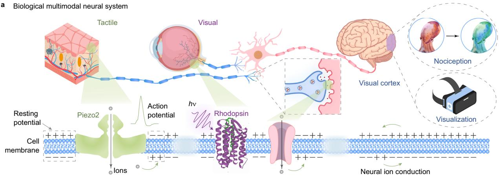

<details>
<summary>flowchart</summary>

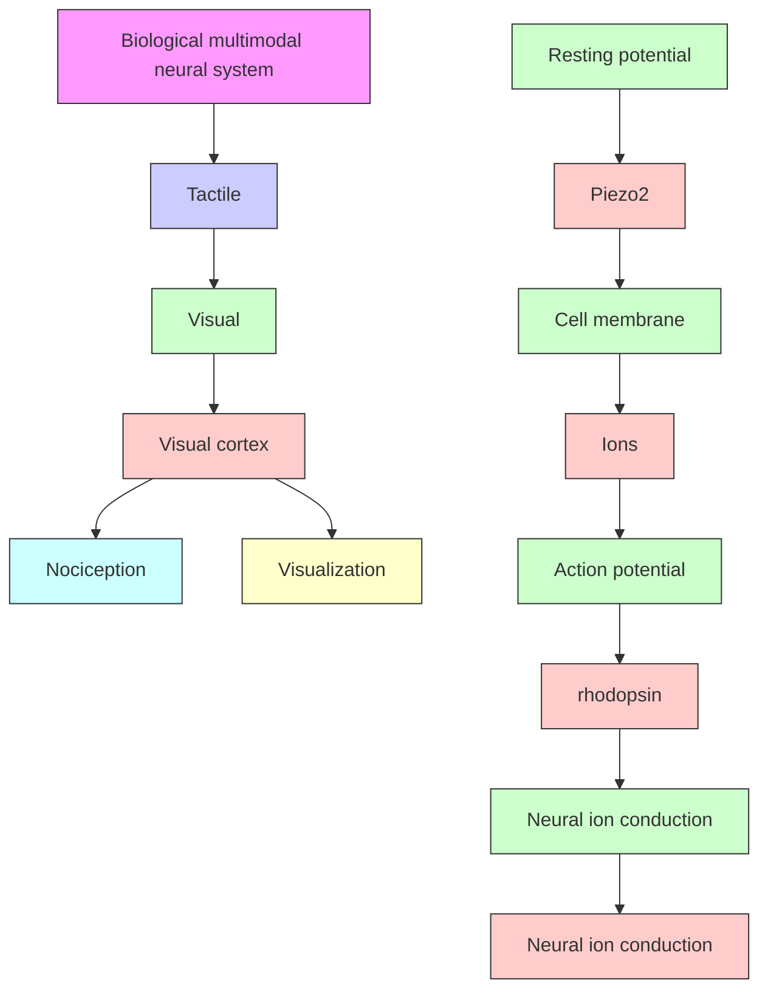
</details>

b Bioinspired flexible MXene-based multisensory neuron system   
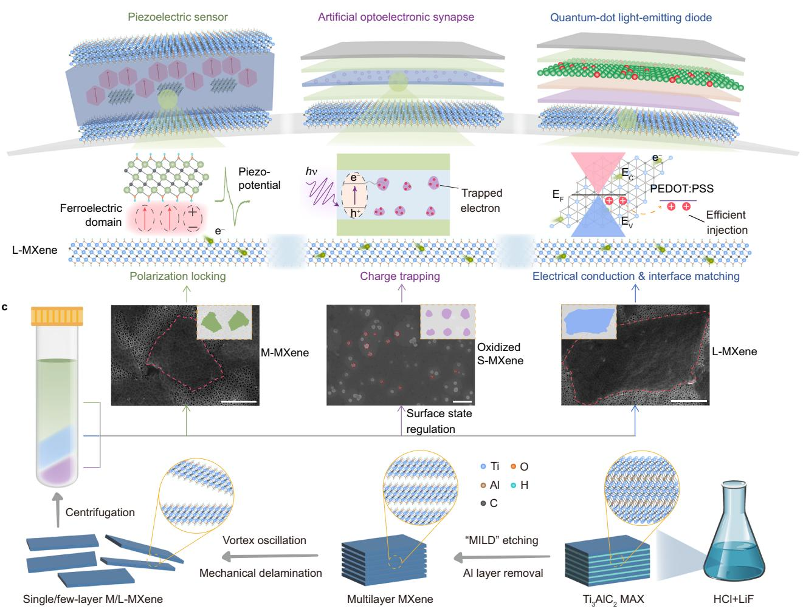

<details>
<summary>flowchart</summary>

```mermaid
graph TD
    A["Piezoelectric sensor"] --> B["Artificial optoelectronic synapse"]
    B --> C["Quantum-dot light-emitting diode"]
    C --> D["Fevered graphene structure"]
    D --> E["L-MXene with Polarization locking"]
    E --> F["Polarization locking"]
    F --> G["M-MXene"]
    G --> H["Charge trapping"]
    H --> I["Electrical conduction & interface matching"]
    I --> J["Oxidized S-MXene"]
    J --> K["L-MXene"]
    K --> L["Surface state regulation"]
    L --> M["Centrifugation"]
    M --> N["Single/few-layer M/L-MXene"]
    N --> O["Vortex oscillation"]
    O --> P["Multilayer MXene"]
    P --> Q["&quot;MILD&quot; etching"]
    Q --> R["Al layer removal"]
    R --> S["Ti₃AlC₂ MAX"]
    S --> T["HCl+LiF"]
    style A fill:#f9f,stroke:#333
    style B fill:#ccf,stroke:#333
    style C fill:#cfc,stroke:#333
    style D fill:#fcc,stroke:#333
    style E fill:#cff,stroke:#333
    style F fill:#ffc,stroke:#333
    style G fill:#cfc,stroke:#333
    style H fill:#fcc,stroke:#333
    style I fill:#cfc,stroke:#333
    style J fill:#fcc,stroke:#333
    style K fill:#cfc,stroke:#333
    style L fill:#fcc,stroke:#333
    style M fill:#ffc,stroke:#333
    style N fill:#cfc,stroke:#333
    style O fill:#fcc,stroke:#333
    style P fill:#cfc,stroke:#333
    style Q fill:#fcc,stroke:#333
    style R fill:#cfc,stroke:#333
    style S fill:#cfc,stroke:#333
    style T fill:#cfc,stroke:#333
```
</details>

Fig. 1 | Design of MXene-based flexible sensing-processing-visualizing integrated system. a Schematic of a biological multimodal neural system connected through neural conduction occurring on the cell membrane. Left: Piezo2 ion channel protein allows ions to pass through the cell membrane and generates action potentials when subjected to pressure. Center: rhodopsin allows ions to pass through and generate an action potential, when exposed to light, due to the detachment of the prosthetic group affected by the conformational change of retinal. Right: nociception and visualization formed in the brain region due to external stimulation. b Schematic of MXene-based flexible sensing-processing   
visualizing integrated system connected through electron conduction occurring on the L-MXene. Left: MXene-dual-functional PENG with M-MXene additives (polarization locking) and L-MXene electrodes. Center: OSMX-based (charge trapping) AOS with L-MXene electrodes. Right: CS-QLED with L-MXene (high electrical conduction). c Top: scanning electron microscopy (SEM) images of M-MXene (left), OSMX (center), and L-MXene (right); scale bars: 1 $\mu$ m. Bottom: schematic of the minimally intensive layer delamination (MILD) etching and mechanical delamination process.

The morphology and phase characterization of these MXene are shown in Fig. 1c top from left to right (corresponding to Fig. 1b) and Supplementary Fig. 2. Fortunately, the above-mentioned MXene can be obtained during our designed single synthesis and post-processing flow (Fig. 1c bottom). Firstly, the Al-rich $\mathrm{Ti}_{3}\mathrm{AlC}_{2}$ MAX (MXene precursor) was etched using the "MILD" method to obtain multilayer-MXene with minimal defects. Subsequently, the multilayer-MXene was exfoliated using the mechanical force generated by vortex oscillation to obtain L-MXene and M-MXene, thereby maintaining the lateral size and minimizing in-plane defects. M-MXene rich in -OH terminations and large-lateral-sized L-MXene with minimal defects were further separated by centrifugal force to respectively match the device applications of PENG, AOS, and CS-QLED. In addition, to address both material utilization and AOS application requirements, the mechanically unexfoliable multilayer-MXene was first ultrasonically fragmented into S-MXene (Supplementary Fig. 3), then subsequently oxidized and surface-functionalized to create photoresponsive OSMX containing abundant defect sites (Supplementary Fig. 4). All the reaction products of MXene precursor can be efficiently utilized in the system, preferable for low-cost environmentally-friendly production.

# MXene-dual-functional PENG

Self-powered MXene-dual-functional PENGs, similar to the tactile sensing unit of Piezo2, are fabricated by depositing M-MXene/P(VDF-TrFE) (MXP) on shared L-MXene conductive layer (Fig. 2a) with exceptional electrical conductivity and mechanical strength. Additionally, MXene, with abundant and tunable surface terminations, facilitates solution-processability, enabling uniform dispersion in various solvents, including water, polar and non-polar organic solvents (N,N-dimethylformamide, dimethyl sulfoxide, chloroform, etc.) $^{36}$ . These characteristics of MXene enable dual-functionalization in PVDF-based ferroelectrics: (1) flexible mechanically-interface-matched conductive channels via solution-processable fabrication, in contrast to conventional Cu/Al tapes (where interfacial adhesion deterioration upon repeated bending cycles causes performance degradation, Supplementary Figs. 5 and 6); (2) enhanced tactile sensing through electroactive phase engineering enabled by interfacial polarization locking, achieved via hydrogen-bond interactions between rich –OH in MXene surfaces (Supplementary Fig. 7) and the C – F dipoles in P(VDF-TrFE) polymer matrices.

Figures 2b and c illustrate the working mechanism of MXene-dual-functional PENG in initial and pressurized states, respectively. The interfacial polarization between the M-MXene and the P(VDF-TrFE) matrix results in a relatively uniform orientation of electric dipoles within the composite material (Fig. 2b). Upon compression, the self-polarization effect, coupled with the formation of deformed dipoles, induces the generation of polarized charges on the surface of the film. These charges are subsequently attracted to and accumulate on the charged surfaces, thereby establishing a piezoelectric potential (Fig. 2c). Consequently, external free charges migrate to the electrodes and accumulate to counterbalance the piezoelectric potential. The impact of MXene with varying flake sizes on the piezoelectric performance of PENG was initially examined (Fig. 2d). When M-MXene with a suitable flake size was used as an additive, the resulting MXene-dual-functional PENG demonstrated the highest output, which can be attributed to efficiently enhanced interface polarization and minimized leak current. Subsequently, the effect of M-MXene content on P(VDF-TrFE) was further investigated (Supplementary Fig. 8 and Supplementary Note 2). X-ray diffraction (XRD) and Fourier transform infrared (FT-IR) spectra analyses revealed that at an M-MXene loading of $0.5\mathrm{wt}\%$ (the optimal sample is labeled MXP-0.5), the $\beta$ -phase content reached its highest level, coinciding with the maximum dielectric constant. The piezoelectric output performance was further evaluated, including measurements of open-circuit voltage and short-circuit current (Supplementary Fig. 9 and Fig. 2e). Both metrics indicated that the output performance of MXene-dual-functional PENG peaked at an MXene content of 0.5 wt%, consistent with the aforementioned characterization results. The enhancement in piezoelectric output can be attributed to the increased β-phase content due to interface polarization locking. Fig. 2f and Supplementary Fig. 10 show that the short-circuit current of MXP-0.5 increases linearly with applied pressure ranging from 1.5 to 13 N, demonstrating a linear relationship between output current and pressure (piezoelectric sensitivity line slope: $0.419 \pm 0.015 \mu A N^{-1}$ ), which allows for precise signal calibration and accurate pressure estimation.

The dual-functional roles of M-MXene as an additive and L-MXene as an electrode in the PENG improved interface contact, significantly enhancing charge collection efficiency (Fig. 2g and Supplementary Table 2). This led to a substantial increase in current density under pressure stimulation, which was notably higher than that observed in piezoelectric films using other electrodes. The prepared MXene-dual-functional PENG exhibits excellent mechanical interface matching and stable output voltage over more than 9900 cycles (as confirmed by the long-term fatigue test in Supplementary Fig. 11), showcasing superior mechanical durability and reliability in practical applications. The results of the COMSOL Multiphysics finite element analysis simulation further supported the experimental data (Fig. 2h).

# Synaptic properties of OSMX-based AOS

Visual sensation and synaptic functionalities are obtained by integrating OSMX-based AOS on a shared flexible and transparent L-MXene thin conductive layer (Fig. 3a). To achieve the light perception capability and the charge trapping ability required for AOS while improving the efficiency of the MXene synthesis process, we implemented a two-step modification procedure: (1) S-MXene obtained via ultrasonic fragmentation of waste multilayer-MXene was controllably oxidized into TiO $_{x}$ -based OSMX (Supplementary Fig. 12), simultaneously enhancing light responsivity and defect density for charge trapping toward synaptic property (Supplementary Fig. 13); (2) Surface functionalization with n-dodecylphosphonic acid (DDPA) improved colloidal stability in organic solvents (verified DDPA successful grafting via the emergence of P 2p peaks in Fig. 3b and Supplementary Fig. 14). Transmission electron microscope (TEM) analysis of solution-processed ZnO nanocrystals (NCs) in Supplementary Fig. 15 confirms their uniform NCs morphology with a narrow size distribution, and atomic force microscopy (AFM) characterization (Supplementary Fig. 16) reveals a smooth surface morphology (RMS = 2.57 nm), ensuring uniform layer formation in the AOS device architecture. Furthermore, the exceptional electrical conductivity, robust mechanical strength, and superior flexibility of L-MXene render it a promising candidate to replace commercial indium tin oxide (ITO). This substitution could potentially address several critical limitations of ITO, including its inherent brittleness, high manufacturing costs, and insufficient electrical conductivity on flexible substrates such as polyethylene terephthalate (PET) $^{37}$ . We investigated the effects of L-MXene concentration on transparency and conductivity by spin-coating solutions with varying concentrations onto PET substrates. In Supplementary Fig. 17, at a concentration of 7 mg mL $^{-1}$ , the film exhibited 80.4% transparency and a sheet resistance of -64 Ω □ $^{-1}$ . Meanwhile, we evaluated the bending resistance performance of the L-MXene/PET and ITO/PET electrodes. The results show that L-MXene/PET demonstrates stable electrical resistance (Supplementary Fig. 18) and superior surface integrity (Supplementary Fig. 19) after 5000 bending cycles compared to ITO/PET, thereby enhancing its potential in flexible electronic devices.

To evaluate the synaptic plasticity of the device, we conducted electrical tests on the AOS. The input voltage pulse, device conductance, and response current were used as analogs for the synaptic pre-spike, synaptic strength, and synaptic post-current, respectively. The analog resistance switching behavior was characterized by measuring the I-V curve, which demonstrated good resistance switching capability (Supplementary Fig. 20). A continuous voltage scanning mode was employed to apply a positive voltage ( $0\ V \rightarrow +1.2\ V \rightarrow 0\ V$ ) to the L-MXene electrode, resulting in a gradual increase in current (Fig. 3c). Conversely, applying a negative voltage ( $0\ V \rightarrow -1.2\ V \rightarrow 0\ V$ ) led to a continuous decrease in current (Supplementary Fig. 21). The progressive change in current induced by electrical signals mimics the alteration of synaptic weight (detailed calculation formula is provided in Supplementary Note 3) triggered by neural impulses. Supplementary Fig. 22 illustrates that 16 electrical pulse patterns, ranging from (0000) to (1111), correspond to 16 distinct response states, highlighting the potential of this approach in RC applications.

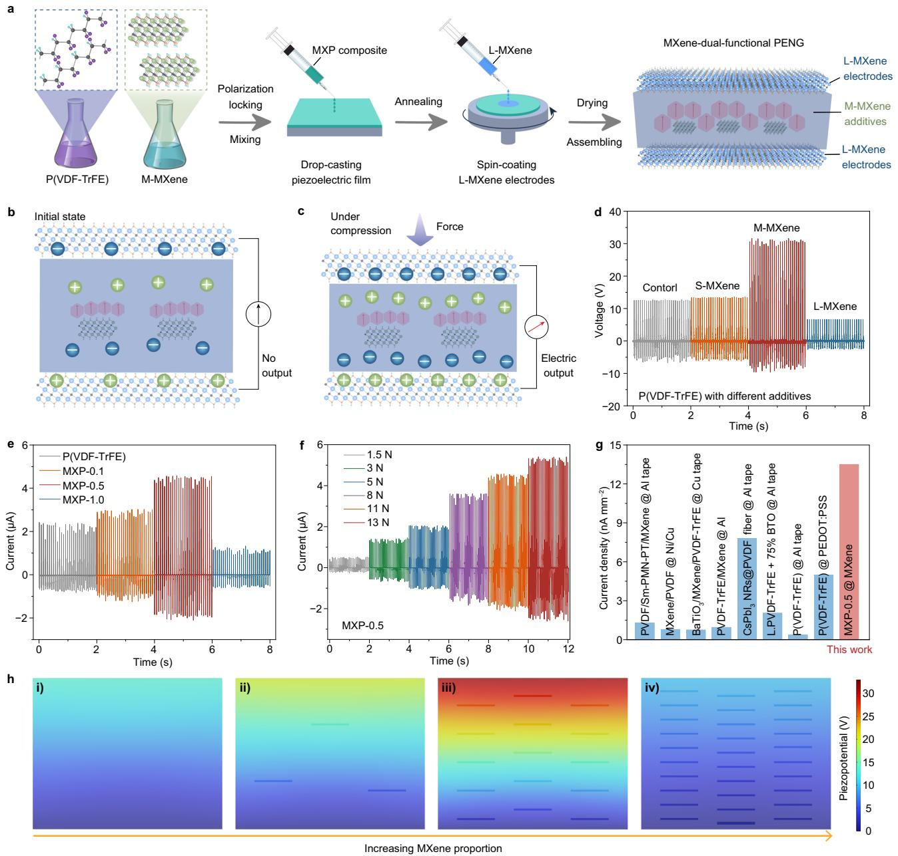  
Fig. 2 | Characterization of MXene-dual-functional PENG. a Schematic of the MXene-dual-functional PENG fabrication process. Schematic illustrating the working principle of the MXene-dual-functional PENG in both b initial and c pressurized states. d Piezoelectric output of MXene-dual-functional PENG at different MXene sizes at 11 N. e Short current of MXene-dual-functional PENG at different M-MXene   
proportions at 11 N. f Short-circuit of MXP-0.5 at different compression forces. g Current density of our work with MXene electrodes versus reported works with other electrodes (Supplementary Table 2). h COMSOL simulation results of piezopotential distribution with varying MXene proportions: i) 0%, ii) 0.1%, iii) 0.5%, iv) 1.0%.

To elucidate the electrical mechanism of AOS, we performed a detailed fitting analysis of the I-V curve (Supplementary Fig. 23). The results demonstrated that the behavior was consistent with the space charge limited current (SCLC) theory $^{38}$ . Figure 3d illustrates the modulation process of device conductance (synaptic weight) via voltage pulse stimulation. By applying fixed-width voltage pulses with varying amplitudes, the device conductance increased with the amplitude of positive pulses. Supplementary Figure 24 further demonstrates that both increasing pulse amplitude and stimulation number lead to an enhancement in current. Precise regulation of the device conductivity can be achieved by deliberately tuning the pulse amplitude and number. As a result, the piezoelectric pulse signal generated by PENG can be utilized to modulate the conductive state of the AOS, thereby enhancing its conductance level. During the testing process, the PENG was directly connected to the AOS. PENG can directly generate electrical pulses with varying amplitudes and pulses through its piezoelectric effect, without using an external pulse power source. When both the number and frequency of the generated electrical pulses increase (Fig. 3e and f, detailed EPSC gain analysis results are presented in Supplementary Note 4), the AOS demonstrates an enhanced current response, mimicking the heightened reactivity of biological systems under external stimulation. From the perspective of the resistance switching mechanism, an increase in the number of pulses leads to further accumulation of charges captured at defect sites, thereby enhancing the electrical

a   
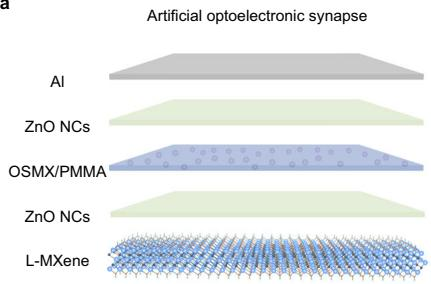

<details>
<summary>text_image</summary>

Artificial optoelectronic synapse
Al
ZnO NCs
OSMX/PMMA
ZnO NCs
L-MXene
</details>

b   
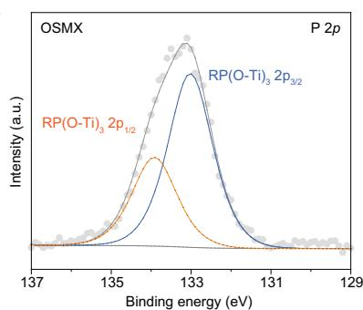

<details>
<summary>line</summary>

| Binding energy (eV) | Intensity (a.u.) |
| ------------------- | ---------------- |
| 137                 | ~0               |
| 135                 | ~0               |
| 133                 | Peak (RP(O-Ti)₃ 2p₁/₂) |
| 131                 | ~0               |
| 129                 | ~0               |
</details>

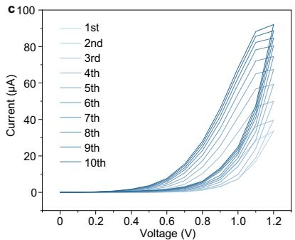

<details>
<summary>line</summary>

| Voltage (V) | 1st   | 2nd   | 3rd   | 4th   | 5th   | 6th   | 7th   | 8th   | 9th   | 10th  |
|-------------|-------|-------|-------|-------|-------|-------|-------|-------|-------|-------|
| 0.0         | 0     | 0     | 0     | 0     | 0     | 0     | 0     | 0     | 0     | 0     |
| 0.2         | ~0    | ~0    | ~0    | ~0    | ~0    | ~0    | ~0    | ~0    | ~0    | ~0    |
| 0.4         | ~0    | ~0    | ~0    | ~0    | ~0    | ~0    | ~0    | ~0    | ~0    | ~0    |
| 0.6         | ~5    | ~5    | ~5    | ~5    | ~5    | ~5    | ~5    | ~5    | ~5    | ~5    |
| 0.8         | ~20   | ~20   | ~20   | ~20   | ~20   | ~20   | ~20   | ~20   | ~20   | ~20   |
| 1.0         | ~60   | ~60   | ~60   | ~60   | ~60   | ~60   | ~60   | ~60   | ~60   | ~60   |
| 1.2         | ~90   | ~90   | ~90   | ~90   | ~90   | ~90   | ~90   | ~90   | ~90   | ~90   |
</details>

d   
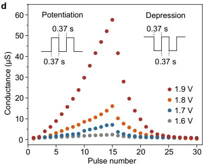

<details>
<summary>line</summary>

| Pulse number | 1.9 V | 1.8 V | 1.7 V | 1.6 V |
| ------------ | ----- | ----- | ----- | ----- |
| 0            | 0     | 0     | 0     | 0     |
| 5            | 5     | 2     | 1     | 0     |
| 10           | 15    | 5     | 3     | 1     |
| 15           | 58    | 15    | 8     | 3     |
| 20           | 20    | 5     | 3     | 1     |
| 25           | 5     | 2     | 1     | 0     |
| 30           | 0     | 0     | 0     | 0     |
</details>

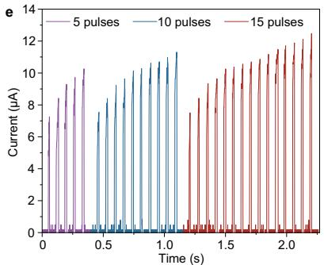

<details>
<summary>line</summary>

| Time (s) | 5 pulses | 10 pulses | 15 pulses |
| -------- | -------- | --------- | --------- |
| 0.0      | 0.0      | 0.0       | 0.0       |
| 0.1      | 7.0      | 0.0       | 0.0       |
| 0.2      | 8.0      | 0.0       | 0.0       |
| 0.3      | 9.0      | 0.0       | 0.0       |
| 0.4      | 10.0     | 0.0       | 0.0       |
| 0.5      | 10.5     | 7.5       | 0.0       |
| 0.6      | 10.0     | 8.0       | 0.0       |
| 0.7      | 9.5      | 9.0       | 0.0       |
| 0.8      | 9.0      | 10.0      | 0.0       |
| 0.9      | 8.5      | 10.5      | 0.0       |
| 1.0      | 8.0      | 11.0      | 0.0       |
| 1.1      | 7.5      | 11.5      | 7.5       |
| 1.2      | 7.0      | 12.0      | 8.0       |
| 1.3      | 6.5      | 12.5      | 9.0       |
| 1.4      | 6.0      | 13.0      | 10.0      |
| 1.5      | 5.5      | 13.5      | 11.0      |
| 1.6      | 5.0      | 14.0      | 12.0      |
| 1.7      | 4.5      | 14.5      | 13.0      |
| 1.8      | 4.0      | 15.0      | 14.0      |
| 1.9      | 3.5      | 15.5      | 15.0      |
| 2.0      | 3.0      | 16.0      | 16.0      |
| 2.1      | 2.5      | 16.5      | 17.0      |
| 2.2      | 2.0      | 17.0      | 18.0      |
| 2.3      | 1.5      | 17.5      | 19.0      |
| 2.4      | 1.0      | 18.0      | 20.0      |
| 2.5      | 0.5      | 18.5      | 21.0      |
| 2.6      | 0.0      | 19.0      | 22.0      |
| 2.7      | 0.0      | 19.5      | 23.0      |
| 2.8      | 0.0      | 20.0      | 24.0      |
| 2.9      | 0.0      | 20.5      | 25.0      |
| 3.0      | 0.0      | 21.0      | 26.0      |
| 3.1      | 0.0      | 21.5      | 27.0      |
| 3.2      | 0.0      | 22.0      | 28.0      |
| 3.3      | 0.0      | 22.5      | 29.0      |
| 3.4      | 0.0      | 23.0      | 30.0      |
| 3.5      | 0.0      | 23.5      | 31.0      |
| 3.6      | 0.0      | 24.0      | 32.0      |
| 3.7      | 0.0      | 24.5      | 33.0      |
| 3.8      | 0.0      | 25.0      | 34.0      |
| 3.9      | 0.0      | 25.5      | 35.0      |
| 4.0      | 0.0      | 26.0      | 36.0      |
| 4.1      | 0.0      | 26.5      | 37.0      |
| 4.2      | 0.0      | 27.0      | 38.0      |
| 4.3      | 0.0      | 27.5      | 39.0      |
| 4.4      | 0.0      | 28.0      | 40.0      |
| 4.5      | 0.0      | 28.5      | 41.0      |
| 4.6      | 0.0      | 29.0      | 42.0      |
| 4.7      | 0.0      | 29.5      | 43.0      |
| 4.8      | 0.0      | 30.0      | 44.0      |
| 4.9      | 0.0      | 30.5      | 45.0      |
| 5.0      | 0.0      | 31.0      | 46.0      |
| ...      | ...      | ...       | ...       |
| ...      | ...      | ...       | ...       |
| ...      | ...      | ...       | ...       |
| ...      | ...      | ...       | ...       |
| ...      | ...      | ...       | ...       |
| ...      | ...      | ...       | ...       |
| ...      | ...      | ...       | ...       |
| ...      | ...      | ...       | ...       |
| ...      | ...      |...       | ...       |
| ...      | ...      | ...       | ...       |
| ...      | ...      | ...       | ...       |
| ...      | ...      | ...       | ...       |
| ...      | ...      | ...       | ...       |
| ...      | ...      | ...       | ...       |
| ...      | ...      | ...       | ...       |
| ...      | ...      | ...       | ...       |
| ...      (repeated) ~ 'a' to 'b' and 'c' to 'd' to 'e' are estimated based on the code execution of the 'a' and 'b' functions.
</details>

f   
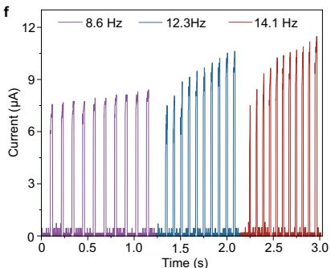

<details>
<summary>line</summary>

| Time (s) | Current (µA) at 8.6 Hz | Current (µA) at 12.3 Hz | Current (µA) at 14.1 Hz |
| -------- | ---------------------- | ----------------------- | ----------------------- |
| 0.0      | 0.0                    | 0.0                     | 0.0                     |
| 0.5      | 7.0                    | 0.0                     | 0.0                     |
| 1.0      | 7.0                    | 0.0                     | 0.0                     |
| 1.5      | 7.0                    | 9.0                     | 0.0                     |
| 2.0      | 7.0                    | 11.0                    | 0.0                     |
| 2.5      | 7.0                    | 9.0                     | 9.0                     |
| 3.0      | 7.0                    | 9.0                     | 12.0                    |
</details>

g   
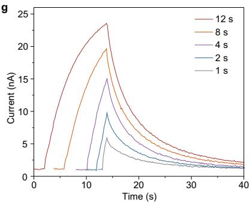

<details>
<summary>line</summary>

| Time (s) | 12 s  | 8 s   | 4 s   | 2 s   | 1 s   |
| -------- | ----- | ----- | ----- | ----- | ----- |
| 0        | 0     | 0     | 0     | 0     | 0     |
| 5        | 10    | 5     | 2     | 1     | 0.5   |
| 10       | 20    | 15    | 10    | 5     | 3     |
| 15       | 24    | 20    | 15    | 10    | 6     |
| 20       | 15    | 10    | 8     | 6     | 4     |
| 25       | 8     | 6     | 5     | 4     | 3     |
| 30       | 5     | 4     | 3     | 2     | 2     |
| 35       | 3     | 2     | 2     | 1     | 1     |
| 40       | 2     | 1     | 1     | 1     | 1     |
</details>

h   
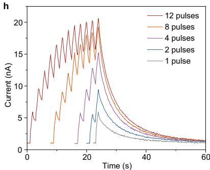

<details>
<summary>line</summary>

| Time (s) | 12 pulses | 8 pulses | 4 pulses | 2 pulses | 1 pulse |
| -------- | --------- | -------- | -------- | -------- | ------- |
| 0        | ~0        | ~0       | ~0       | ~0       | ~0      |
| 10       | ~10       | ~5       | ~3       | ~2       | ~1      |
| 20       | ~20       | ~15      | ~10      | ~8       | ~5      |
| 30       | ~15       | ~10      | ~7       | ~5       | ~3      |
| 40       | ~5        | ~5       | ~3       | ~2       | ~1      |
| 50       | ~2        | ~2       | ~1       | ~1       | ~0.5    |
| 60       | ~1        | ~1       | ~0.5     | ~0.5     | ~0.2    |
</details>

i   
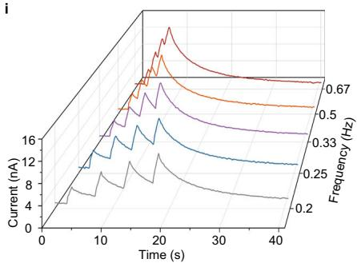

<details>
<summary>line</summary>

| Time (s) | Current (nA) - Line 1 | Current (nA) - Line 2 | Current (nA) - Line 3 | Frequency (Hz) - Line 4 | Frequency (Hz) - Line 5 | Frequency (Hz) - Line 6 |
|----------|------------------------|------------------------|------------------------|--------------------------|--------------------------|--------------------------|
| 0        | 0                      | 0                      | 0                      | 0.67                     | 0.5                      | 0.33                     |
| 10       | ~8                     | ~12                    | ~16                    | ~0.67                    | ~0.5                     | ~0.25                    |
| 20       | ~16                    | ~16                    | ~16                    | ~0.67                    | ~0.5                     | ~0.25                    |
| 30       | ~12                    | ~12                    | ~12                    | ~0.67                    | ~0.5                     | ~0.25                    |
| 40       | ~8                     | ~8                     | ~8                     | ~0.67                    | ~0.5                     | ~0.25                    |
</details>

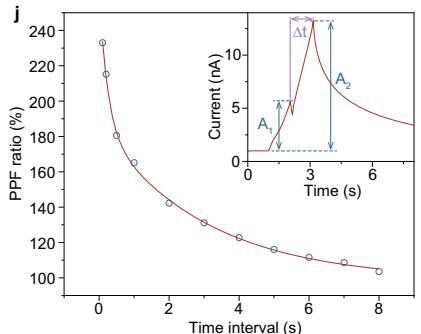

<details>
<summary>line</summary>

| Time interval (s) | PPF ratio (%) |
| ----------------- | ------------- |
| 0                 | 240           |
| 1                 | 180           |
| 2                 | 160           |
| 3                 | 140           |
| 4                 | 120           |
| 5                 | 110           |
| 6                 | 105           |
| 7                 | 102           |
| 8                 | 100           |
</details>

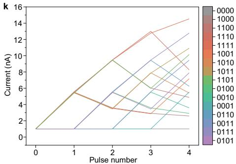

<details>
<summary>line</summary>

| Pulse number | Current (nA) |
| ------------ | ------------ |
| 0            | 1            |
| 1            | 6            |
| 2            | 4            |
| 3            | 3            |
| 4            | 15           |
</details>

|   
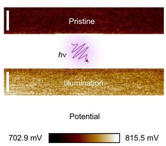

<details>
<summary>text_image</summary>

Pristine
hv
Illumination
Potential
702.9 mV 815.5 mV
</details>

Fig. 3 | Characterization of synaptic properties of OSMX-based AOS.   
a Schematic illustrating the structure of the optoelectronic synapse. b High-resolution X-ray photoelectron spectroscopy (XPS) P 2p spectra of OSMX. c I-V scanning curves of AOS (0 → +1.2 V → 0 V for 10 times). d Continuous conductance modulation by 15 positive electrical pulses with gradually increasing amplitudes (1.6 - 1.9 V) and 15 negative electrical pulses at a fixed amplitude (-0.3 V), with both pulse width and interval set to 0.37 s. EPSC of the AOS triggered by PENG at   
different e pulse numbers and f frequencies. Photoresponse of the AOS under illumination with varied g time, h pulses, and i frequencies at a fixed wavelength of 365 nm. j Variation of the PPF index as a function of different light interval times ( $\Delta t$ ). k Experimental outputs of 16 different 4-bit optical pulse trains, ranging from (0000) to (1111). l Surface potential image of the ZnO NCs/OSMX-PMMA/ZnO NCs thin film before and after illumination; scale bars: 500 nm.

conductivity of the device. Moreover, when the pulse frequency increases, charges trapped during the previous pulse cannot be fully released before subsequent pulses are applied, resulting in a progressive charge accumulation over time. We also evaluated the energy consumption of the OSMX-based AOS under single-pulse stimulation. The results reveal a low energy consumption of 1.094 pJ (Supplementary Fig. 25), indicating high energy efficiency among the existing two-terminal MXene-based neuromorphic devices (Supplementary Table 3).

In the human visual system, the intensity and duration of optical signal irradiation are crucial parameters for image information. The detection and recognition of invisible ultraviolet (UV) light can effectively avoid visible light interference, which is beneficial in artificial visual systems $^{39}$ . The photocurrent response behavior of the AOS under different UV (365 nm) light durations, pulse numbers, and light intensities is presented in Fig. 3g and h, and Supplementary Fig. 26a, respectively, demonstrating the regulatory effect of optical stimulation parameters on EPSC. The alteration of illumination conditions not only directly determines the response amplitude but also effectively modulates the subsequent relaxation process. When a negative bias is applied, AOS shows a similar trend to that under a positive bias at different illumination times (Supplementary Fig. 26b). Figure 3i further illustrates the EPSC when the AOS is subjected to continuous light pulse sequences at varying frequencies. As the spike frequency increases from 0.2 Hz to 0.67 Hz, the cumulative effect becomes increasingly significant, leading to a pronounced EPSC response. To investigate the potential of photo-induced paired-pulse facilitation (PPF) behavior, two consecutive light pulses with a density of 13.2 mW cm $^{-2}$ and a duration of 1 s each were applied to the AOS (Fig. 3j). As shown in the inset of Fig. 3j, the response current to the second light pulse was significantly greater than that of the first pulse. The time constants $\tau_{1}$ and $\tau_{2}$ for the photo-induced PPF were fitted to 0.241 s and 3.059 s, respectively (R $^{2}$ = 0.998, calculation and fitting methods are described in Supplementary Note 5). Notably, $\tau_{2}$ is approximately one order of magnitude larger than $\tau_{1}$ , which aligns well with the characteristics observed in biological synapses $^{40}$ . Furthermore, we fabricated AOS devices with varying OSMX-to-PMMA mass ratios to modulate their photoelectric properties (Supplementary Fig. 27). We also conducted systematic tests under different bending radii to investigate the mechanical flexibility of the AOS. When the bending radius ranged from 10 to 3 mm, the electrical pulse conductance modulation performance (Supplementary Fig. 28a) and the optical pulse response current (Supplementary Fig. 28b) of the AOS did not show significant changes. In addition, at the bending radius of 3 mm, the electrical conductance modulation performance and the optical pulse response maintain stability after 1000 bending cycles (Supplementary Fig. 29), further demonstrating the bending resistance of the device. We further analyzed the overall energy consumption of the PENG and AOS system (Supplementary Fig. 30). The result demonstrated that the PENG and AOS system can operate in a self-powered mode (OJ) under pressure stimulation via PENG, and achieve a single-pulse energy consumption as low as 1.437 fJ under optical stimulation. Compared to existing PENG and memristor integrated systems, our PENG and AOS integrated system exhibits distinct advantages in terms of device integration, multimodal sensing capabilities, and versatility in functional applications (Supplementary Table 4).

To evaluate its capability to incorporate sequential optical inputs, we subjected the memristor to sequences of optical pulses. Each sequence comprised four pulses, with "1" and "0" denoting light pulses of 13.2 and $0\mathrm{mWcm}^{-2}$ intensity, respectively, and each pulse lasting for 1s. In Fig. 3k, single-mode 4-bit optical pulse input varying from (0000) to (1111) yielded 16 distinct states. Moreover, the AOS exhibits multimodal perception capabilities, as demonstrated by processing a 4-bit binary input stream under the "EEOO" stimulation mode, in which the first two pulses were designated as electrical stimuli and the following two as optical stimuli (Supplementary Fig. 31). This dual-mode response facilitates the implementation of a mixed-input RC system. The findings indicate that OSMX-based AOS exhibits rich biomimetic dynamics in response to diverse electrical and optical stimuli, positioning them as a promising component for neuromorphic computing systems.

The nonlinear behavior of the AOS under light can be attributed to the following mechanism: light illumination generates a large number of electron-hole pairs in ZnO NCs and OSMX, thereby enhancing the conductivity of the device. Under an applied voltage, these photogenerated carriers migrate toward the electrodes and may become trapped at the interface between ZnO NCs and OSMX. Upon removal of the light source, the trapped carriers are gradually released, leading to short-term memory effects. This is consistent with the results characterized by Kelvin probe force microscopy (KPFM) (Fig. 3l). Under illumination, the surface potential of the film is higher than in its initial state, indicating charge accumulation at the interface. Meanwhile, the role of OSMX in AOS was investigated through in-situ KPFM characterization (Supplementary Fig. 32). The results demonstrated that OSMX not only significantly enhanced the response to UV light but also facilitated the charge trapping processes at the ZnO NCs/OSMX interface.

# Visualized dual-mode sensory for environment-adaptive application

Sensory feedback functionality is obtained by integrating CS-QLED on the shared L-MXene conductive layer (Fig. 4a). Utilizing CS-QLED as feedback units leverages their high color purity and tunability in the visible spectrum, along with their solution-processability on diverse substrates, thereby facilitating the development of flexible electronic skin $^{41,42}$ . Different wavelengths of light emission can be achieved by mixing red and green quantum dots (R/G QDs). In addition to its excellent electrical conductivity, good transparency, and outstanding bending resistance, L-MXene exhibits a work function of approximately 4.9 eV, which closely matches that of the PEDOT:PSS charge injection layer (approximately 5.1 eV). This alignment facilitates highly efficient charge injection and enables optimal electrical interface matching (Fig. 4b). As the voltage of the CS-QLED increases (2.8 \~ 7.4 V, Fig. 4c), the green emission intensity at \~543 nm gradually increases, while the red emission intensity at \~632 nm gradually decreases. Supplementary Fig. 33 presents the current density–voltage–luminance characteristic curves of the CS-QLED. To investigate the mechanical flexibility of the CS-QLED, we performed bending tests under varying radii and bending cycles (Supplementary Fig. 34). The results demonstrate that the current density–voltage characteristics remain nearly constant as the bending radius decreases from 10 mm to 3 mm (Supplementary Fig. 34a). Furthermore, after 1000 cycles of dynamic bending at a radius of 3 mm (Supplementary Fig. 34b), the current density–voltage characteristics curve does not show marked degradation, indicating preferable mechanical flexibility and bending tolerance.

Inspired by the unique sensory and neural characteristics of octopuses, we developed a flexible bionic tactile-visual-optical feedback neural network system to harness the potential of PENG, AOS, and CS-QLED (Supplementary Fig. 35). The signal acquisition and processing workflow of the system is illustrated in Fig. 4d. Since CS-QLED requires a substantial driving voltage to induce color changes from red to green, a current amplification module was incorporated to fulfill its operational demands. The designed circuit can function adequately when receiving only visual signal input without tactile input. The decision logic of the FSPVS operates as follows: the PENG detects pressure signals, while the AOS receives optical inputs. The combined pressure and light stimuli act synergistically on the AOS to trigger the generation of EPSCs. These EPSCs are then captured by a conversion unit in the peripheral circuit and transformed into voltage with varying amplitudes, which effectively drive the CS-QLED to produce visual output and enable color switching. Furthermore, the light emitted by the CS-QLED is detected by an avalanche photodiode connected to an oscilloscope.

The skin of some organisms possesses unique additional functions that enable them to perform physiological activities efficiently. For example, the skin of an octopus can rapidly change color in response to external stimuli (such as pressure or light stimuli), allowing efficient disguise (Fig. 4e) $^{43}$ . Figure 4f illustrates the schematic of our system, which is designed to mimic the environment-adaptive dual-mode perception and visualization capabilities of the octopus. When light and piezoelectric stimuli are simultaneously applied, photon excitation and piezoelectric regulation synergistically enhance conductivity. Consequently, as the resistance of AOS decreases, an enlarged current is generated and subsequently converted into an enlarged driving voltage, which effectively induces pronounced color changes in the CS-QLED. As shown in Fig. 4g, in the absence of additional light stimulation, increasing pressure can induce a transition (threshold 1 of light emitting intensity) in the emission of the CS-QLED from red light (state 1: non-defense mode) to yellow light (state 2: environmental monitoring mode). Similarly,

a   
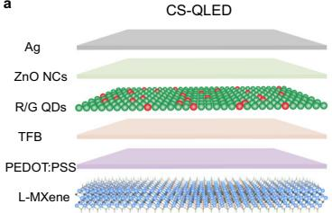

<details>
<summary>text_image</summary>

CS-QLED
Ag
ZnO NCs
R/G QDs
TFB
PEDOT:PSS
L-MXene
</details>

b   
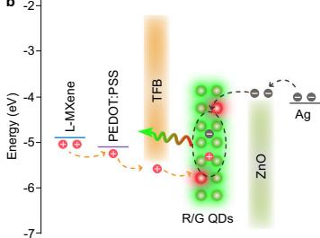

<details>
<summary>line</summary>

| Material     | Energy (eV) |
| ------------ | ----------- |
| L-MXene      | -5.0        |
| PEDOT:PSS    | -5.0        |
| TFB          | -4.5        |
| R/G QDs      | -6.0        |
| ZnO          | -4.5        |
</details>

c   
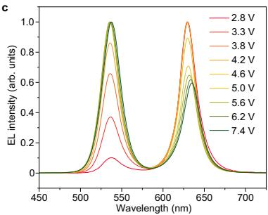

<details>
<summary>line</summary>

| Wavelength (nm) | 2.8 V | 3.3 V | 3.8 V | 4.2 V | 4.6 V | 5.0 V | 5.6 V | 6.2 V | 7.4 V |
| --------------- | ----- | ----- | ----- | ----- | ----- | ----- | ----- | ----- | ----- |
| 450             | 0.0   | 0.0   | 0.0   | 0.0   | 0.0   | 0.0   | 0.0   | 0.0   | 0.0   |
| 500             | 0.0   | 0.0   | 0.0   | 0.0   | 0.0   | 0.0   | 0.0   | 0.0   | 0.0   |
| 550             | 0.4   | 0.6   | 0.8   | 1.0   | 1.0   | 1.0   | 1.0   | 1.0   | 1.0   |
| 600             | 0.0   | 0.0   | 0.0   | 0.0   | 0.0   | 0.0   | 0.0   | 0.0   | 0.0   |
| 650             | 1.0   | 1.0   | 1.0   | 1.0   | 1.0   | 1.0   | 1.0   | 1.0   | 1.0   |
| 700             | 0.0   | 0.0   | 0.0   | 0.0   | 0.0   | 0.0   | 0.0   | 0.0   | 0.0   |
</details>

d   
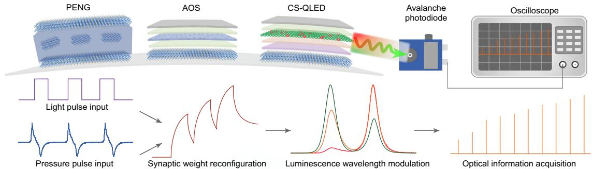

<details>
<summary>flowchart</summary>

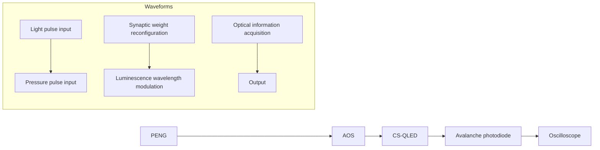
</details>

e   
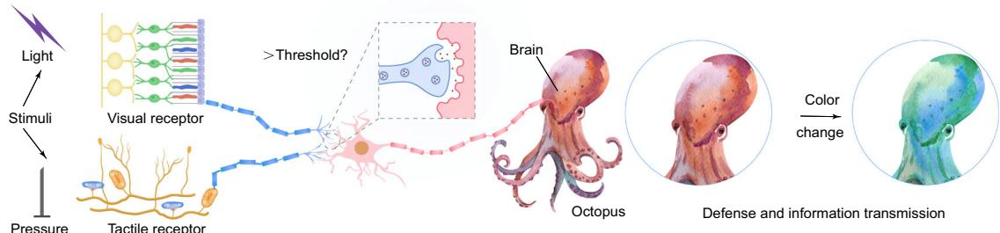

<details>
<summary>flowchart</summary>

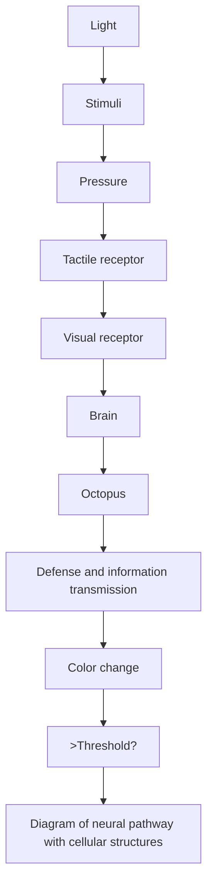
</details>

f   
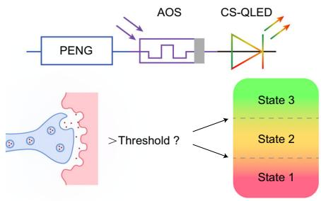

<details>
<summary>flowchart</summary>

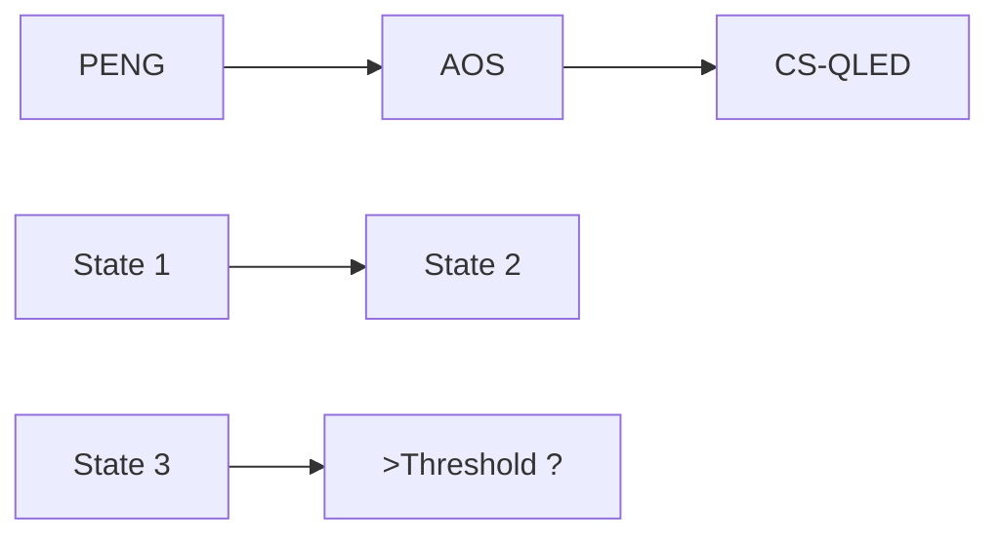
</details>

g   
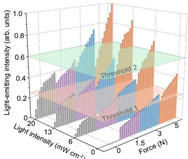

<details>
<summary>area_stacked</summary>

| Light intensity (mW cm⁻²) | Force (N) | Light-emitting intensity (arb. units) |
| -------------------------- | --------- | ------------------------------------- |
| 0                          | 0         | 0                                     |
| 0                          | 1.5       | 0.8                                   |
| 0                          | 3         | 0.6                                   |
| 0                          | 5         | 0.4                                   |
| 1.5                        | 0         | 0.9                                   |
| 1.5                        | 1.5       | 0.7                                   |
| 1.5                        | 3         | 0.5                                   |
| 1.5                        | 5         | 0.3                                   |
| 3                          | 0         | 0.8                                   |
| 3                          | 1.5       | 0.6                                   |
| 3                          | 3         | 0.4                                   |
| 3                          | 5         | 0.2                                   |
| 5                          | 0         | 0.7                                   |
| 5                          | 1.5       | 0.5                                   |
| 5                          | 3         | 0.3                                   |
| 5                          | 5         | 0.1                                   |
The chart includes three horizontal bands labeled 'Threshold 1', 'Threshold 1', and 'Threshold 2' above the boundaries of the shaded regions. There is no explicit numerical data provided in the code.
</details>

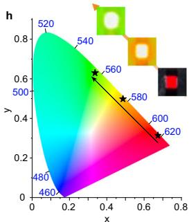

<details>
<summary>heatmap</summary>

| x    | y    |
| ---- | ---- |
| 0.0  | 0.0  |
| 0.2  | 0.2  |
| 0.4  | 0.4  |
| 0.6  | 0.6  |
| 0.8  | 0.8  |
</details>

Fig. 4 | Visualized dual-mode sensory for environment-adaptive application based on FSPVS. a Schematic illustrating the structure of the CS-QLED. b Energy-level diagram and charge carrier transfer process of the CS-QLED. c Normalized electroluminescence (EL) spectrum at various voltages. d Schematic of signal acquisition and processing in an FSPVS. Pressure stimulation from PENG and optical stimulation from AOS can modulate the weighting of AOS, thereby altering the voltage output of CS-QLED, which subsequently enables the avalanche   
photodiode to detect light with varying intensities and wavelengths. e Schematic of the octopus's color change upon light and tactile pressure stimulation. f Schematic of visualized dual-mode sensory for environment-adaptive application. g Light-emitting intensity change of the CS-QLED in response to different pressure and optical intensity stimuli. h Commission Internationale de L'Eclairage (CIE) diagram of CS-QLED at various voltages.

without external pressure stimulation, an increase in light intensity can also trigger the same emission transition. When both light and pressure stimuli are applied simultaneously, with the light input being dominant (20 mW·cm $^{-2}$ light stimulus and 1.5 N pressure stimulus), the CS-QLED emits yellow light that exceeds threshold 1 (state 2). Conversely, when the pressure stimulus dominates (5 N pressure stimulus and 6 mW·cm $^{-2}$ light stimulus), the CS-QLED initially emits yellow light above threshold 1 and gradually transitions to green light surpassing threshold 2 (state 3: alarm mode) as the number of stimuli increases. When moderate pressure and light intensity are concurrently applied, the CS-QLED emits yellow light exceeding threshold 1 (state 2). When both high pressure and high light intensity are simultaneously applied, the CS-QLED exceeds threshold 2 (state 3) and emits green light. The luminescence color of the CS-QLED changes in response to the intensity of stimuli, reflecting the severity of the harmful stimulus, and this variation can be intuitively displayed through visible light-emitting signals (Fig. 4h).

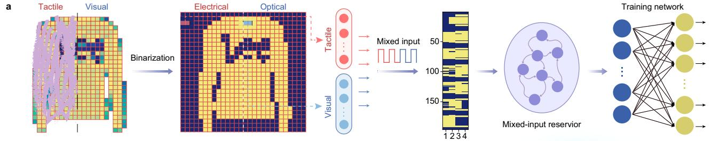

<details>
<summary>flowchart</summary>


</details>

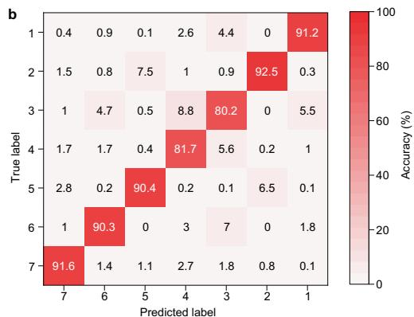

<details>
<summary>heatmap</summary>

| True label \ Predicted label | 7 | 6 | 5 | 4 | 3 | 2 | 1 |
|---|---|---|---|---|---|---|---|
| 1 | 0.4 | 0.9 | 0.1 | 2.6 | 4.4 | 0 | 91.2 |
| 2 | 1.5 | 0.8 | 7.5 | 1 | 0.9 | 92.5 | 0.3 |
| 3 | 1 | 4.7 | 0.5 | 8.8 | 80.2 | 0 | 5.5 |
| 4 | 1.7 | 1.7 | 0.4 | 81.7 | 5.6 | 0.2 | 1 |
| 5 | 2.8 | 0.2 | 90.4 | 0.2 | 0.1 | 6.5 | 0.1 |
| 6 | 1 | 90.3 | 0 | 3 | 7 | 0 | 1.8 |
| 7 | 91.6 | 1.4 | 1.1 | 2.7 | 1.8 | 0.8 | 0.1 |
</details>

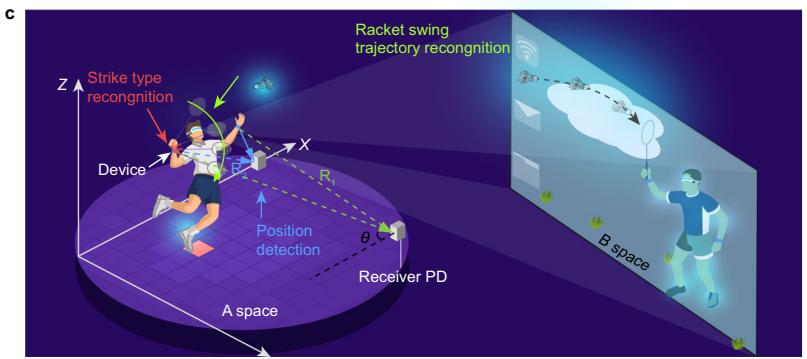

<details>
<summary>text_image</summary>

Racket swing trajectory recognition
Strike type recognition
Device
X
R1
Position detection
Receiver PD
A space
B space
Z
</details>

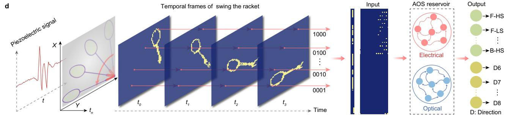

<details>
<summary>flowchart</summary>

```mermaid
graph LR
    A["Input"] --> B["AOS reservoir"]
    B --> C["Output"]
    
    subgraph Temporal Frames
        D1["Time: t₀ to tₙ with oscillating red signal; blue wave pattern on left"]
        D2["Time: t₁ to t₂ with yellow waveform pattern on right"]
        D3["Time: t₃ to t₄ with yellow waveform pattern on left"]
    end
    
    subgraph AOS Reservoir
        E1["Electrical: F-HS, F-LS, ..., D8"]
        E2["Optical: D6, ..., D7, ..."]
        end
    
    D -->|Temporal frames of swing the racket| D1 & D2 & D3
    D3 -->|Temporal frames of swing the racket| D4 & D5 & D6 & D7 & D8
    end
    
    style A fill:#f9f,stroke:#333
    style B fill:#ccf,stroke:#333
    style C fill:#cfc,stroke:#333
    style D fill:#fcc,stroke:#333
```
</details>

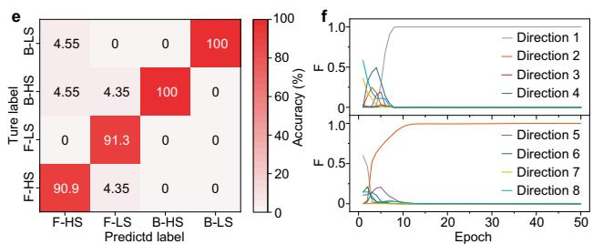

<details>
<summary>bar</summary>

| Ture label | F-HS | F-LS | B-HS | B-LS |
|---|---|---|---|---|
| F-HS | 90.9 | 4.35 | 0 | 0 |
| F-LS | 4.55 | 0 | 100 | 0 |
| B-HS | 4.55 | 4.35 | 100 | 0 |
| B-LS | 0 | 91.3 | 0 | 0 |
e
f
Accuracy (%) vs Epoch
Direction 1
Direction 2
Direction 3
Direction 4
Direction 5
Direction 6
Direction 7
Direction 8
</details>

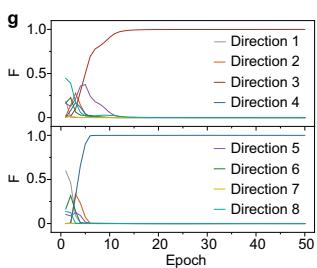

<details>
<summary>line</summary>

| Epoch | Direction 1 | Direction 2 | Direction 3 | Direction 4 | Direction 5 | Direction 6 | Direction 7 | Direction 8 |
|-------|-------------|-------------|-------------|-------------|-------------|-------------|-------------|-------------|
| 0     | 0.0         | 0.0         | 0.0         | 0.0         | 0.0         | 0.0         | 0.0         | 0.0         |
| 5     | 0.5         | 0.3         | 0.8         | 0.1         | 0.1         | 0.2         | 0.1         | 0.1         |
| 10    | 0.8         | 0.5         | 1.0         | 0.1         | 0.1         | 0.3         | 0.1         | 0.1         |
| 15    | 0.9         | 0.6         | 1.0         | 0.1         | 0.1         | 0.4         | 0.1         | 0.1         |
| 20    | 0.95        | 0.7         | 1.0         | 0.1         | 0.1         | 0.5         | 0.1         | 0.1         |
| 25    | 0.98        | 0.8         | 1.0         | 0.1         | 0.1         | 0.6         | 0.1         | 0.1         |
| 30    | 0.99        | 0.9         | 1.0         | 0.1         | 0.1         | 0.7         | 0.1         | 0.1         |
| 35    | 0.995       | 0.95        | 1.0         | 0.1         | 0.1         | 0.8         | 0.1         | 0.1         |
| 40    | 0.998       | 0.98        | 1.0         | 0.1         | 0.1         | 0.9         | 0.1         | 0.1         |
| 45    | 0.999       | 0.99        | 1.0         | 0.1         | 0.1         | 0.95        | 0.1         | 0.1         |
| 50    | 1.0         | 1.0         | 1.0         | 0.1         | 0.1         | 1.0         | 0.1         | 0.1         |
</details>

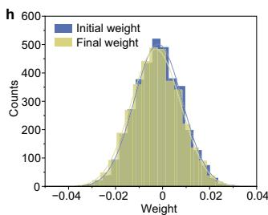

<details>
<summary>histogram</summary>

| Weight Range | Initial weight Counts | Final weight Counts |
| ------------ | --------------------- | ------------------- |
| -0.04 to -0.03 | 0 | 0 |
| -0.03 to -0.02 | 100 | 50 |
| -0.02 to -0.01 | 300 | 200 |
| -0.01 to 0 | 500 | 450 |
| 0 to 0.01 | 350 | 300 |
| 0.01 to 0.02 | 150 | 100 |
| 0.02 to 0.03 | 50 | 25 |
| 0.03 to 0.04 | 10 | 5 |
</details>

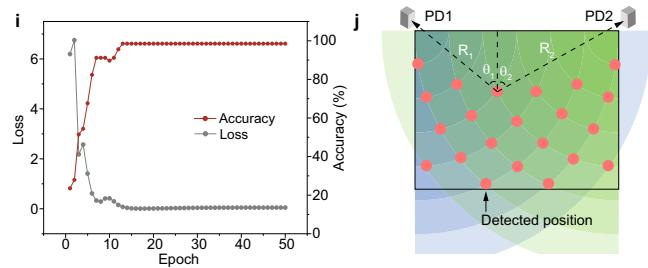

<details>
<summary>line</summary>

| Epoch | Accuracy (%) | Loss (%) |
|-------|--------------|----------|
| 0     | 0            | 100      |
| 5     | 6            | 2        |
| 10    | 7            | 1        |
| 20    | 7            | 0.5      |
| 30    | 7            | 0.2      |
| 40    | 7            | 0.1      |
| 50    | 7            | 0.05     |
</details>

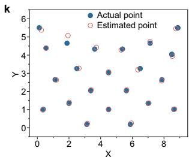

<details>
<summary>scatter</summary>

| x | Actual point | Estimated point |
| --- | --- | --- |
| 0 | 5.5 | 5.5 |
| 1 | 4.5 | 4.5 |
| 2 | 5.0 | 5.0 |
| 3 | 3.5 | 3.5 |
| 4 | 4.5 | 4.5 |
| 5 | 3.0 | 3.0 |
| 6 | 4.5 | 4.5 |
| 7 | 3.5 | 3.5 |
| 8 | 5.5 | 5.5 |
| 9 | 4.0 | 4.0 |
</details>

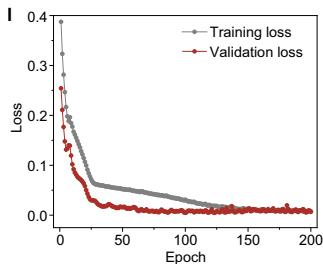

<details>
<summary>line</summary>

| Epoch | Training loss | Validation loss |
|-------|---------------|-----------------|
| 0     | 0.4           | 0.3             |
| 20    | 0.1           | 0.05            |
| 40    | 0.05          | 0.02            |
| 60    | 0.03          | 0.01            |
| 80    | 0.02          | 0.01            |
| 100   | 0.01          | 0.01            |
| 120   | 0.01          | 0.01            |
| 140   | 0.01          | 0.01            |
| 160   | 0.01          | 0.01            |
| 180   | 0.01          | 0.01            |
| 200   | 0.01          | 0.01            |
</details>

Fig. 5 | Multi-mode information perception and recognition. a Schematic of recognizing the multimodal Fashion-MNIST in complex environments. b Confusion matrix for classifying seven categories of images. c Schematic of strike type recognition, dynamic racket swing trajectory recognition, and position recognition implemented by FSPVS in a simple badminton sports scene towards multisensory interaction scenarios (R denotes the distance between the light-emitting point and the receiver detector). d Schematic of the in-sensor RC system for dynamically   
recognizing the strike types and racket swing trajectories. e Confusion matrix for classifying distinct striking types. f and g Readout function (F) value of the unit of the read-out layer, representing the probability of the corresponding trajectory. h Initial and final weight distributions before/after training. i Cross-entropy loss and accuracy for racket swing trajectory recognition. j Schematic of the principle of position detection. k Estimated point coordinates and actual point coordinates. l Training loss and validation loss of position detection.

# Multi-mode information perception and recognition

To exhibit the advantages of our integrated system, we implemented multimodal image recognition tasks. When identifying contaminated images (Fig. 5a), the left side—being covered by opaque materials—can only be perceived through tactile signals (electrical signals), while the right side remains perceivable via visual signals (optical signals). Therefore, a multimodal mixed-input "EEOO" mode (comprising two electrical pulses followed by two light pulses) is employed. This mode demonstrates distinct functional spatial partitioning: the "EE" segment selectively responds to the left half of the image (with the "OO" segment inactive), whereas the "OO" segment specifically responds to the right half (with the "EE" segment inactive). The original 28×28 pixel images were restructured into a 196×4 pixel format. Subsequently, the processed images were read using a mixed-input "EEOO" mode. A total of 196 input channels were fed into corresponding memory units for processing. Supplementary Fig. 36a illustrates the distribution of weights in the fully connected layer. After the training process, the synaptic weights change from a random to a normal distribution, indicating that the neural network has been trained effectively. The confusion matrix (Fig. 5b) and the achieved accuracy of 91% (Supplementary Fig. 36b) show the effectiveness of the mixed-input strategy in multimodal recognition tasks.

In addition to static image recognition, we further evaluated potential of the system in dynamic information perception and recognition by using a simplified badminton scenario as a example (Fig. 5c). In this application scenario where the CS-QLED is only required to emitting light rather than achieving color-changing function (that is, the driving voltage is small), we have designed a highly integrated FSVPS (based on L-MXene-integrated PENG, AOS, and CS-QLED); it can operate effectively without an additional amplification module, merely by providing a turn-on voltage (Supplementary Fig. 37). This wearable system can achieve several key functions including multi-modal perception, integrated perception-processing architecture, trajectory recognition, and accurate spatial positioning (Supplementary Fig. 38), which is highly desired for multisensory interaction applications. Specifically, User A and User B each wore an FSPVS on their wrists. Even when located in different spaces, these two users were able to engage in online interaction (Fig. 5c). For instance, when User A swung the racket to strike the virtual badminton shuttlecock, the FSPVS could accurately detect four fundamental strike types: forehand heavy shot (F-HS), forehand light shot (F-LS), backhand heavy shot (B-HS), and backhand light shot (B-LS). Simultaneously, the FSPVS identified the racket swing trajectories in eight fundamentally different directions. In addition, the induced CS-QLED light-emitting signal was captured by two photodetectors (PD) to determine the positional data. These strike types, trajectory recognition, and spatial positioning enabled User B to respond appropriately and promptly.

During the badminton scenario, joint movements (representing piezoelectric signals) and racket swings (representing optical signals) occur simultaneously and are separately input into the AOSs working in electrical and optical modes (serving as RC units), respectively (Fig. 5d and Supplementary Fig. 39). For strike types recognition, one-dimensional piezoelectric data (2000) was converted into a four-row pixel format (4×500) through cropping and binarization. Subsequently, the strike type data are fed into the AOS reservoir in electrical mode for computation. Finally, a single-layer fully connected neural network is employed to perform the strike type recognition task. For racket swing trajectory recognition, optical pulses are essential for information processing. To integrate the spatial and temporal information from consecutive frames into a compact representation, we divide each frame image into four consecutive subframes ( $t_0$ , $t_1$ , $t_2$ , and $t_3$ ), representing four distinct moments of the racket swing. When the racket (yellow pixels) is detected, an optical pulse is applied to the AOS corresponding to each pixel. When no racket movement (blue pixels) is detected, no optical pulse is applied. For each pixel, its temporal evolution is compressed into a 4-bit sequence s(t), composed of a 16-bit binary vector. The sequence of light pulses (from (0000) to (1111)) is fed as input to the physical reservoir of the memristor, causing changes in the EPSC value of the device. This process embeds the temporal evolution of each pixel into the conductance of individual memristors, thereby characterizing the temporal features of object motion.

The confusion matrix of the target labels and output labels in the test set was verified (dataset can be seen in Supplementary Fig. 40), and the results indicated that the system could effectively identify different strike types (Fig. 5e). In addition, the internal repository of the sensor using custom datasets (Supplementary Fig. 41) accurately recognized racket motion including eight different directions (Fig. 5f and g, and Supplementary Fig. 42). During training, the readout function (F) value for target inputs continuously increases, while the F values for non-target inputs decrease. Fig. 5h shows the initial and final weight distributions before/after training. Cross-entropy loss and accuracy for racket swing trajectory recognition are shown in Fig. 5i.

The generated CS-QLED light-emitting signal can be used for position detection. Two PDs are placed at appropriate positions to ensure they can receive the light information emitted from any point within the plane (Fig. 5j). The light intensity data acquired from two PDs are utilized as feature vectors. These vectors are subsequently processed into input features $(R_{1},\theta_{1},R_{2},\theta_{2})$ and output label coordinates $(X,Y)$ . Figure 5k illustrates the comparison between the estimated position coordinates and the actual positions. The results demonstrate that the average positioning error for each point in the validation set is 0.0048, indicating the high precision of the proposed method (Fig. 5l). These results underscore the significant potential of the FSPVS with multi-parameter information parallel output in multimodal recognition for human-computer interaction.

# Discussion

In summary, a bioinspired flexible sensing-processing-visualizing integrated system has been introduced via a material-architecture-function co-design strategy. Through functionally tailored MXene, the flexible system unifies mechanosensation through a piezoelectric nanogenerator, visual sensation and processing through an artificial optoelectronic synapse, and optical feedback via color-shifting quantum dot light-emitting diodes in a shared flexible platform. Relying on this system, the intelligent integration of tactile and visual signal processing demonstrates its capability in environmental adaptation by emulating bioinspired self-protection behaviors that enable responsive actions to environmental stimuli. This system achieves a classification accuracy of 91% in multimodal image recognition tasks based on the Fashion-MNIST dataset; furthermore, it is capable of identifying dynamic strike types and trajectories, as well as providing high-precision spatial positioning-functionalities that are desired in the multisensory interaction scenarios. The ability to process tactile and visual data efficiently highlights the potential of MXenes in bioinspired function-integrated flexible electronics. Our work demonstrates a promising pathway toward intelligent wearable devices and multisensory human-computer interaction.

# Methods

# Materials

Poly(3,4-ethylenedioxythiophene)/poly(styr-enesulfonate) (PEDOT: PSS, Clevios AI4083) and poly (9,9-dioctylfluorene-alt-N-(4-sec-butylphenyl)-diphenylamine) (TFB) was purchased from Xi'an Polymer Light Technology Co., Ltd. Red and green CdSe/ZnSe QDs were procured from Xingshuo Nano Technology Co., Ltd. N, N-dimethylformamide (DMF, ACS), KOH (AR), methanol (AR), Poly(methyl methacrylate) (PMMA, Mw \~ 350000), n-butanol (AR) and LiF (AR) were purchased from Aladdin. Chloroform (AR), HCl acid (AR, 36-38%), acetone (AR) and absolute ethanol (99.9%) were purchased from Sinopharm Chemical Reagent Co., Ltd. Al-rich Ti $_{3}$ AlC $_{2}$ MAX (400 mesh, Foshan Xinxi Technology Co., Ltd.), zinc acetate dehydrated (99%,

Sigma-Aldrich), n-dodecylphosphonic acid (DDPA, 98.5%, Macklin), P(VDF-TrFE) (80:20, Solvay). All materials were used as received without any purification.

# Preparation of S/M/L-Ti $_3$ C $_2$ T $_x$ MXene aqueous suspension

The MXene suspension is prepared using a minimally intensive layer delamination (MILD) method $^{44}$ . To obtain L-MXene and M-MXene, we centrifuged the MXene dispersion at 240 g for 15 min to remove unetched MAX. The liquid was subsequently centrifuged at 3210 g for 30 min. The resulting supernatant was identified as M-MXene, while the precipitate was designated as L-MXene. To prepare defect-rich S-MXene for subsequent oxidation treatment, multi-layered MXene was ultrasonicated in a water bath for 2 h. The resulting dispersion was then centrifuged at 1300 g for 1 h to isolate the supernatant.

# Preparation of $\mathrm{Ti}_{3}\mathrm{C}_{2}\mathrm{T}_{\mathrm{x}}$ MXene DMF suspension

To replace the solvent in the MXene aqueous dispersion, a solvent substitution method was used. The MXene aqueous dispersion was centrifuged at 10610 g for 30 min to obtain the MXene precipitate. After that, the precipitate was dispersed into 20 mL of DMF. The operation was repeated 3 times to prepare MXene DMF dispersion.

# Preparation of OSMX chloroform suspension

To make OSMX well dispersed in organic solutions, we grafted it with organofunctional groups. First, DDPA was added to chloroform and stirred until completely dissolved. At the same time, the pH of the OSMX aqueous solution (1 mg mL $^{-1}$ ) was adjusted to below 2.5 with HCl. Afterward, the aqueous OSMX solution was added to the DDPA chloroform solution and stirred vigorously for 3 h. At the end of the reaction, the stirring was stopped, and the reaction was allowed to stand and wait for stratification, and the lower organic phase solution was taken. To remove the unreacted DDPA, the solution was centrifuged at 6790 g and washed 3 times with chloroform. Finally, the precipitate was dispersed in an appropriate amount of chloroform to obtain the OSMX dispersion. To enhance the smoothness of the spin-coated film, a small amount of PMMA was added to the OSMX dispersion.

# Preparation of ZnO NCs suspension

The synthesis of ZnO NCs was optimized based on previous reports and dispersed in n-butanol $^{45}$ . Typically, 0.59 g of zinc acetate dehydrated was dissolved in 25 mL of methanol and heated at 65°C in a water bath. Then, 13 mL of 4.6 mmol KOH methanol solution was dropped into the zinc acetate solution with continuous stirring for 2.5 h. The precipitated ZnO NCs were centrifuged, washed with methanol three times, and then dispersed in n-butanol solution.

# Device fabrication

Fabrication of MXene-dual-functional PENG. Piezoelectric films were prepared using a drop-casting method. Firstly, P(VDF-TrFE) powder was added to MXene DMF dispersion containing different mass fractions of MXene and stirred for 12 h to ensure its complete dissolution to obtain the MXene/P(VDF-TrFE)-n (MXP-n, n represents the mass fraction of MXene relative to P(VDF-TrFE)) solution. Afterward, the MXP-n solution was dropped on a clean and flat glass plate placed in a blast oven at 70 °C and heated for 7 h to allow complete drying. Then, the MXP-n films were annealed in a vacuum oven at 130 °C for 1 h to improve the crystallinity. The MXene electrode was spin-coated to the surface of the MXP-n films on both sides. The electrodes were used to lead the wires using silver adhesive and then covered with Kapton tape to complete the encapsulation.

# Fabrication of AOS

The PET substrate was sequentially cleaned in deionized water, acetone, and absolute ethanol for 10 mins each, followed by drying with flowing nitrogen. To enhance surface wettability, the PET substrate underwent plasma treatment. L-MXene was initially deposited onto the PET substrate and allowed to rest for 3 mins. It was then subjected to spin-coating at 2000 rpm for 60 s, followed by an additional spin-coating process at 6000 rpm for 90 s. Subsequently, the L-MXene/PET was annealed at 100 °C in a tube furnace for 12 h to eliminate adsorbed impurities and improve electrical conductivity. The ZnO NCs solution was spin-coated at 2000 rpm for 40 s and heated at 80 °C for 10 min. The OSMX/PMMA solution (mass ratio of 4:6) was spin-coated at 4000 rpm for 40 s and heated at 80 °C for 10 min. After that, another layer of ZnO NCs was spin-coated with the same parameters as before. Finally, the Al electrode with a thickness of 50 nm was thermally evaporated through a mask plate.

# Fabrication of CS-QLED

The preparation of L-MXene/PET was carried out as described above. PEDOT:PSS and TFB layers were deposited onto the substrate via spin-coating at 3000 rpm for 40 s, after which the samples were annealed at 100 °C for 20 min. The red and green QDs are mixed at a mass ratio of 1:15. For the QDs and ZnO layers, the spin-coating parameters were 2000 rpm for 60 s, followed by annealing at 80 °C for 10 min.

# Fabrication of FSPVS

To fabricate the FSPVS, a thin patterned PET mask was first attached to a PET substrate $(3 \times 4.5 \, \text{cm}^{2})$ , and its hydrophilicity was enhanced via oxygen plasma treatment. Subsequently, an L-MXene film was spin-coated on the substrate and annealed at $100^{\circ}C$ for 12 h. Following this, the MXP solution was drop-cast onto the PENG region of the PET substrate, dried at $70^{\circ}C$ for 7 h, and vacuum-annealed at $100^{\circ}C$ for 2 h to improve crystallinity. Then, L-MXene was deposited onto the upper surface of MXP film using a similar procedure. Next, the PENG and AOS regions were masked, and PEDOT:PSS, TFB, R/G QDs, and ZnO layers were sequentially spin-coated onto the CS-QLED region. Afterward, the CS-QLED region was re-masked, and ZnO, OSMX/PMMA, and ZnO layers were sequentially deposited. Finally, the top electrode was thermally evaporated, and the entire device was encapsulated. To ensure an efficient electrical conduction connection between the devices, MXene can be further sprayed in the conduction pathway.

# Device characterization

The sample morphologies were characterized by SEM (Hitachi SU-8600), TEM (JEOL JEM-2100F), AFM, and KPFM (Bruker Multimode 8). Physical phases of samples were characterized by XRD (Bruker D8 advance, Cu Kα radiation, λ = 1.5406 Å), FT-IR (Thermo Fisher Nicolet IS50), and ultraviolet-visible-near infrared absorption spectroscopy (Hitachi UH5700). The surface elemental distribution of the samples was characterized using XPS (Thermo Scientific ESCALAB Xi+) instrumentation provided by eceshi (www.eceshi.com). The output signals of the PENG were measured by an oscilloscope (Siglent SDS1202X-C) and an electrometer (Keithley 6514). The optical and electrical properties of the AOS were characterized using a source meter (Keithley 2400 and Tonghui 1992) by connecting to both ends. The AOS is stimulated by 365 nm UV light sources, and the distance of the UV light source was fixed to ensure consistent light intensity across all generated pulses. The transient electroluminescence characteristics of the CS-QLED were measured using an avalanche photodiode and an oscilloscope (Rigol DS1202Z-E). The luminance and chromaticity of the integrated FSPVS were measured using a specialized radiance colorimeter (Everfine, SRC-600). The overall FSPVS relies on an external power source to ensure the reliable operation of all components. Informed consent was obtained from the human research participant (Zhen Wang). The sheet resistance was measured by the digital four-probe tester (Suzhou Jingge Electronic Co., Ltd., ST-2258C).

# Network training

For multimodal Fashion-MNIST recognition, the original 28×28 pixel images were binarized and restructured into a 196×4 pixel format. Subsequently, the processed images were read by using a mixed-input "EEOO" mode. The covered yellow pixels on the left half could only be sensed via electrical pulses from tactile signals, whereas the purple pixels represent their absence; all pixels on the right half indicate the absence of an electrical pulse. The yellow pixels on the right half correspond to light pulse inputs. A total of 196 input channels were fed into corresponding memory units for processing. Then, a single-layer fully connected neural network is employed to perform the multimodal Fashion-MNIST recognition task.

For strike types recognition: the experimental participant swung the racket with varying types, and raw data was collected. The one-dimensional strike-type data (2000) was converted into a four-row pixel format (4×500) through cropping and binarization. Subsequently, the strike type data are fed into the AOS reservoir in electrical mode for computation. The AOS reservoir in the electrical mode consists of 500 storage devices that serve as reservoir nodes. Then, a single-layer fully connected neural network with 500 input nodes was designed to perform the strike types recognition task. For racket swing trajectory recognition: image sequences of each racket trajectory were captured, and the frame difference method combined with binarization processing was applied to generate image sequences. Each input image (56×56) was divided into four consecutive pixel rows (4×3136), spanning from the leftmost to the rightmost column in a top-down manner. Subsequently, the swing trajectory information was fed into the AOS reservoir in optical mode for computation. The AOS reservoir in the optical mode consists of 3136 storage devices that serve as reservoir nodes. Their conductance values are programmed and calibrated based on experimentally measured data from individual devices. Then, a single-layer fully connected neural network with 3136 input nodes was designed to perform the racket swing trajectory recognition task. The readout layer was implemented in software, and the model was trained using the Adam optimizer's gradient descent algorithm (with an initial learning rate of 0.001) to minimize classification cross-entropy loss. Finally, the data were divided into training and test sets to evaluate the performance of the model.

# Data availability

All data are available from the corresponding authors upon request. Source data are provided with this paper.

# Code availability

The code that supports the theoretical plots within this paper is available from the corresponding author upon request.

# References

1. Mahato, K. et al. Hybrid multimodal wearable sensors for comprehensive health monitoring. Nat. Electron. 7, 735–750 (2024).   
2. Ates, H. C. et al. End-to-end design of wearable sensors. Nat. Rev. Mater. 7, 887–907 (2022).   
3. Shi, T. et al. Memristor-based feature learning for pattern classification. Nat. Commun. 16, 913 (2025).   
4. Liu, Y. et al. Cryogenic in-memory computing using magnetic topological insulators. Nat. Mater. 24, 559–564 (2025).   
5. Aguirre, F. et al. Hardware implementation of memristor-based artificial neural networks. Nat. Commun. 15, 1974 (2024).   
6. Sadaf, M. U. K., Sakib, N. U., Pannone, A., Ravichandran, H. & Das, S. A bio-inspired visuotactile neuron for multisensory integration. Nat. Commun. 14, 5729 (2023).   
7. Li, Z. et al. Crossmodal sensory neurons based on high-performance flexible memristors for human-machine in-sensor computing system. Nat. Commun. 15, 7275 (2024).

8. Nakamura, H. et al. Flexible electronic brush: Real-time multimodal sensing powered by reservoir computing through whisker dynamics. Sci. Adv. 11, eads4388 (2025).   
9. Zhang, W. et al. Edge learning using a fully integrated neuro-inspired memristor chip. Science 381, 1205–1211 (2023).   
10. Yao, P. et al. Fully hardware-implemented memristor convolutional neural network. Nature 577, 641–646 (2020).   
11. Cho, H. et al. Real-time finger motion recognition using skin-conformable electronics. Nat. Electron. 6, 619–629 (2023).   
12. Ouyang, B. et al. Bioinspired in-sensor spectral adaptation for perceiving spectrally distinctive features. Nat. Electron. 7, 705–713 (2024).   
13. Liu, J. et al. Multidimensional free shape-morphing flexible neuromorphic devices with regulation at arbitrary points. Nat. Commun. 16, 756 (2025).   
14. Seong, M. et al. Multifunctional magnetic muscles for soft robotics. Nat. Commun. 15, 7929 (2024).   
15. Zhang, Z. et al. Dual-modal dielectric elastomer system for simultaneous energy harvesting and actuation. Adv Sci 12, 2410724 (2025).   
16. Wei, X. et al. Mechano-gated iontronic piezomemristor for temporal-tactile neuromorphic plasticity. Nat. Commun. 16, 1060 (2025).   
17. Zhong, D. et al. High-speed and large-scale intrinsically stretchable integrated circuits. Nature 627, 313–320 (2024).   
18. He, K., Wang, C., He, Y., Su, J. & Chen, X. Artificial neuron devices. Chem. Rev. 123, 13796–13865 (2023).   
19. Sebastian, A., Le Gallo, M., Khaddam-Aljameh, R. & Eleftheriou, E. Memory devices and applications for in-memory computing. Nat. Nanotechnol. 15, 529–544 (2020).   
20. Dang, B. et al. Reconfigurable in-sensor processing based on a multi-phototransistor-one-memristor array. Nat. Electron. 7, 991–1003 (2024).   
21. Wang, J. et al. Artificial Sense Technology: Emulating and extending biological senses. ACS Nano 15, 18671–18678 (2021).   
22. Li, W., Duan, C., Wei, Y. & Xu, H. Advancements in flexible memristors for neuromorphic computing: Materials, mechanisms, and applications in synaptic emulation. FlexMat 2, 390–419 (2025).   
23. Bag, A. et al. Bio-inspired sensory receptors for artificial-intelligence perception. Adv. Mater. 37, 2403150 (2025).   
24. Ding, H. et al. Chemical scissor-mediated structural editing of layered transition metal carbides. Science 379, 1130–1135 (2023).   
25. Ko, T. Y. et al. Functionalized MXene ink enables environmentally stable printed electronics. Nat. Commun. 15, 3459 (2024).   
26. Rong, C. et al. Elastic properties and tensile strength of 2D $Ti_{3}C_{2}T_{x}$ MXene monolayers. Nat. Commun. 15, 1566 (2024).   
27. VahidMohammadi, A., Rosen, J. & Gogotsi, Y. The world of two-dimensional carbides and nitrides (MXenes). Science 372, eabf1581 (2021).   
28. Yang, J. et al. Water-induced strong isotropic MXene-bridged graphene sheets for electrochemical energy storage. Science 383, 771–777 (2024).   
29. Wang, Z. et al. Coral polyp and spine dual-inspired gradient hierarchical architecture for ultrahigh-rate and long-life sodium storage. Adv. Funct. Mater. 34, 2402178 (2024).   
30. Qin, R. et al. Recent advances in flexible pressure sensors based on mxene materials. Adv. Mater. 36, 2312761 (2024).   
31. Zhao, T. et al. Ultrathin MXene assemblies approach the intrinsic absorption limit in the 0.5–10 THz band. Nat. Photon. 17, 622–628 (2023).   
32. Xu, Y. et al. Reconfigurable flexible thermoelectric generators based on all-inorganic MXene/Bi $_{2}$ Te $_{3}$ composite films. FlexMat 1, 248–257 (2024).   
33. Abraira, V. E. & Ginty, D. D. The Sensory Neurons of Touch. Neuron 79, 618–639 (2013).

34. Smith, S. O. Mechanism of activation of the visual receptor rhodopsin. Annu. Rev. Biophys. 52, 301–317 (2023).   
35. Zhang, Y. et al. Highly stable flexible pressure sensors with a quasi-homogeneous composition and interlinked interfaces. Nat. Commun. 13, 1317 (2022).   
36. Abdolhosseinzadeh, S., Jiang, X., Zhang, H., Qiu, J. & Zhang, C. Perspectives on solution processing of two-dimensional MXenes. Mater. Today 48, 214–240 (2021).   
37. Xu, X., Guo, T., Lanza, M. & Alshareef, H. N. Status and prospects of MXene-based nanoelectronic devices. Matter 6, 800–837 (2023).   
38. Wang, T. Y. et al. Flexible 3D memristor array for binary storage and multi-states neuromorphic computing applications. InfoMat 3, 212–221 (2020).   
39. Zhou, F. et al. Optoelectronic resistive random access memory for neuromorphic vision sensors. Nat. Nanotechnol. 14, 776–782 (2019).   
40. Liu, K. et al. An optoelectronic synapse based on $\alpha$ -In $_{2}$ Se $_{3}$ with controllable temporal dynamics for multimode and multiscale reservoir computing. Nat. Electron. 5, 761–773 (2022).   
41. Lin, Q. et al. Flexible quantum dot light-emitting device for emerging multifunctional and smart applications. Adv. Mater. 35, 2210385 (2023).   
42. Xiang, C. et al. High efficiency and stability of ink-jet printed quantum dot light emitting diodes. Nat. Commun. 11, 1646 (2020).   
43. Ni, Y. et al. Visualized in-sensor computing. Nat. Commun. 15, 3454 (2024).   
44. Alhabeb, M. et al. Guidelines for synthesis and processing of two-dimensional titanium carbide ( $Ti_{3}C_{2}T_{x}$ MXene). Chem. Mater. 29, 7633–7644 (2017).   
45. Qian, L. et al. Electroluminescence from light-emitting polymer/ZnO nanoparticle heterojunctions at sub-bandgap voltages. Nano Today 5, 384–389 (2010).

# Acknowledgements

This work was supported by the National Natural Science Foundation of China (Grant Nos. 52472150, 62205063, 62305254, 22371043), Fujian Province Natural Science Foundation of China (Grant Nos. 2025J09036, 2023J05125, 2022J05042), Zhejiang Provincial Natural Science Foundation of China (Grant No. LQ24F050001), and Fujian Normal University “Young Talent” Start-up Grant (Grant No. Y0720311K13).

# Author contributions

Y.L., Y.Z., and W.H. supervised the project. Y. L. had the idea, and Y.L., Z.W., and Y.Z. designed the experiment. Z.W. and J.L. performed the studies. Z.W. and Y.L. prepared the manuscript. R.Z., Q.L., X.H., J.S., Y.J., K.Y., H.F., X.G., Y.W., D.L., L.L., and F.L. participated in analyzing the results and discussing the manuscript.

# Competing interests

The authors declare no competing interests.

# Additional information

Supplementary information The online version contains supplementary material available at https://doi.org/10.1038/s41467-025-67316-0.

Correspondence and requests for materials should be addressed to Yang Liu, Yi Zhao or Wei Huang.

Peer review information Nature Communications thanks Xiangshui Miao, and the other, anonymous, reviewer(s) for their contribution to the peer review of this work. A peer review file is available.

Reprints and permissions information is available at http://www.nature.com/reprints

Publisher's note Springer Nature remains neutral with regard to jurisdictional claims in published maps and institutional affiliations.

Open Access This article is licensed under a Creative Commons Attribution-NonCommercial-NoDerivatives 4.0 International License, which permits any non-commercial use, sharing, distribution and reproduction in any medium or format, as long as you give appropriate credit to the original author(s) and the source, provide a link to the Creative Commons licence, and indicate if you modified the licensed material. You do not have permission under this licence to share adapted material derived from this article or parts of it. The images or other third party material in this article are included in the article's Creative Commons licence, unless indicated otherwise in a credit line to the material. If material is not included in the article's Creative Commons licence and your intended use is not permitted by statutory regulation or exceeds the permitted use, you will need to obtain permission directly from the copyright holder. To view a copy of this licence, visit http://creativecommons.org/licenses/by-nc-nd/4.0/.

© The Author(s) 2026