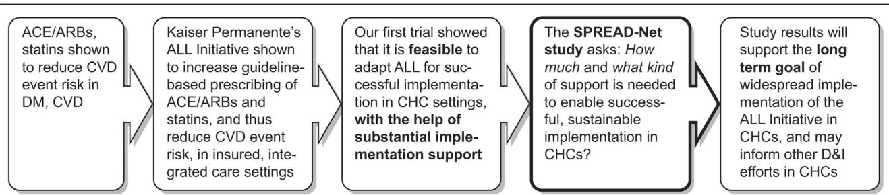
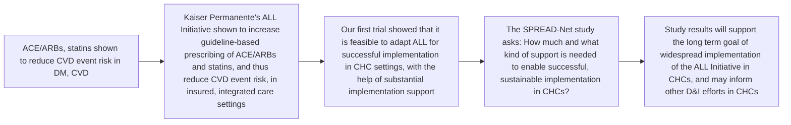
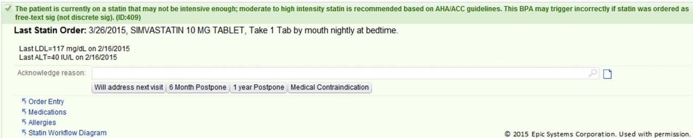
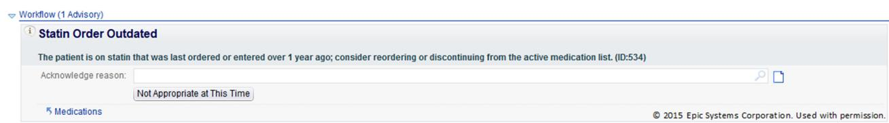
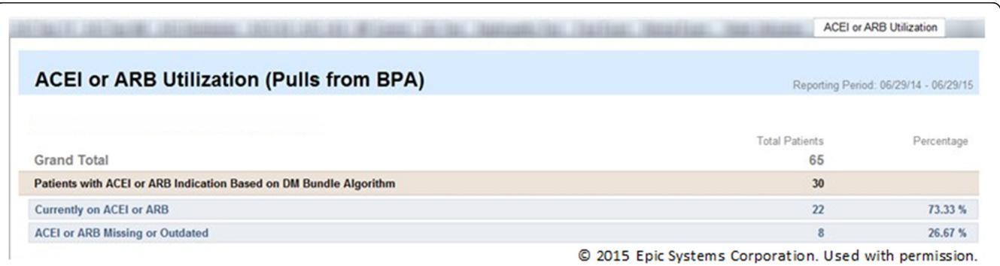

# STUDY PROTOCOL

# Open Access

# Study protocol for “Study of Practices Enabling Implementation and Adaptation in the Safety Net (SPREAD-NET)”: a pragmatic trial comparing implementation strategies

CrossMark

Rachel Gold1,2\*, Celine Hollombe1 , Arwen Bunce1 , Christine Nelson2 , James V. Davis1 , Stuart Cowburn2 , Nancy Perrin1 , Jennifer DeVoe2,3, Ned Mossman2 , Bruce Boles4 , Michael Horberg5 , James W. Dearing6 , Victoria Jaworski7 , Deborah Cohen3 and David Smith1

# Abstract

Background: Little research has directly compared the effectiveness of implementation strategies in any setting, and we know of no prior trials directly comparing how effectively different combinations of strategies support implementation in community health centers. This paper outlines the protocol of the Study of Practices Enabling Implementation and Adaptation in the Safety Net (SPREAD-NET), a trial designed to compare the effectiveness of several common strategies for supporting implementation of an intervention and explore contextual factors that impact the strategies’ effectiveness in the community health center setting.

Methods/design: This cluster-randomized trial compares how three increasingly hands-on implementation strategies support adoption of an evidence-based diabetes quality improvement intervention in 29 community health centers, managed by 12 healthcare organizations. The strategies are as follows: (arm 1) a toolkit, presented in paper and electronic form, which includes a training webinar; (arm 2) toolkit plus in-person training with a focus on practice change and change management strategies; and (arm 3) toolkit, in-person training, plus practice facilitation with on-site visits. We use a mixed methods approach to data collection and analysis: (i) baseline surveys on study clinic characteristics, to explore how these characteristics impact the clinics’ ability to implement the tools and the effectiveness of each implementation strategy; (ii) quantitative data on change in rates of guideline-concordant prescribing; and (iii) qualitative data on the “how” and “why” underlying the quantitative results. The outcomes of interest are clinic-level results, categorized using the Reach, Effectiveness, Adoption, Implementation, Maintenance (RE-AIM) framework, within an interrupted time-series design with segmented regression models. This pragmatic trial will compare how well each implementation strategy works in “real-world” practices.

Discussion: Having a better understanding of how different strategies support implementation efforts could positively impact the field of implementation science, by comparing practical, generalizable methods for implementing clinical innovations in community health centers. Bridging this gap in the literature is a critical step towards the national long-term goal of effectively disseminating and implementing effective interventions into community health centers.

(Continued on next page)

(Continued from previous page)

Trial registration: ClinicalTrials.gov, NCT02325531

Keywords: Diabetes mellitus, Cardiovascular disease, Quality improvement, Community health centers, Evidencebased, Translational medical research

# Background

The adoption and implementation of evidence-based care guidelines and quality improvement (QI) practices into everyday practice is limited; hence, scientific advances rarely reach their population potential in a timely manner [1–12]. One underlying reason is that most prior research focused on developing and evaluating interventions but not on the distinct methods used to support such interventions’ uptake into practice [13–15]. As a result, there is incomplete knowledge about what strategies best support implementing proven innovations [2–9]. Broadly defined, “implementation strategies” may include the following: policies to incentivize intended users to adopt targeted innovations, providing treatment guidelines, decision support, training, consultation, facilitation, and/or feedback data; and using QI approaches such as workflow redesign, Plan-Do-Study-Act cycles, and other change management practices [16–18].

The Study of Practices Enabling Implementation and Adaptation in the Safety Net (SPREAD-NET) builds on existing knowledge on the efficacy of different strategies for implementing interventions that seek to improve clinical outcomes by changing clinician behaviors. Academic detailing (expert consultation)/educational outreach are generally effective at changing provider behaviors, other process measures, and clinical outcomes [19–23]. Interactive small group trainings have a modest positive effect on provider performance [24–26]. In-person training and “train-the-trainer” approaches are supported by substantial evidence [8]. Toolkits can support implementation of guideline-based care [27], but “passive” implementation—i.e., simply providing a toolkit—shows mixed effectiveness [19]. “Auditing” and giving feedback data can change provider behaviors and other process measures but have mixed effects on clinical outcomes [28–38]. Practice facilitation (when skilled individuals help clinic staff implement interventions) [39, 40] can support enhanced care quality—for example, primary care practices are 2.76 (95 % CI, 2.18–3.43) times more likely to adopt guidelines if practice facilitation is used [39] but has mixed effects on clinical outcomes [39–41].

As the most prior research studied one implementation strategy at a time, little is known about the benefits of multiple, concurrent implementation strategies (e.g., training plus technical assistance). Further, little research has directly compared the effectiveness of different implementation strategies in any setting [16, 17, 42, 43], much less in Community Health Centers (CHCs) [2], so it is unknown which individual or combined strategies—even those that work in more controlled research settings or private/academic settings—will work in CHCs. This is problematic, because CHCs serve millions of socioeconomically vulnerable patients in the USA [43–47]. In addition, little research has been conducted on the influence of context on the effectiveness of various implementation strategies [31]—i.e., which strategies are optimal in which settings and why [48, 49]. We believe that the “SPREAD-NET” trial is the first to compare the effectiveness of common strategies for supporting implementation of a proven QI intervention in CHCs. Figure 1 illustrates how this study fits within a line of inquiry on improving care quality in CHCs.

# The original intervention and implementation strategies

Kaiser Permanente (KP), a large integrated health care delivery system, developed the “A.L.L. Initiative” (aspirin, lovastatin (any statin), lisinopril (any angiotensinconverting-enzyme (ACE) inhibitor or angiotensin receptor blocker (ARB)), hereafter called “ALL”). ALL is a system-level QI intervention designed to increase the percentage of patients with cardiovascular disease (CVD)/diabetes mellitus (DM) taking cardioprotective medications according to national treatment guidelines [50]. At KP, the ALL intervention uses electronic health record (EHR) reminders and panel management tools to help providers identify patients indicated for but not taking an ALL medication. The ALL implementation strategies used at KP involve incentivizing providers to appropriately prescribe the ALL medications (via pay bonuses related to overall care quality) and directives identifying it as KP’s standard of care. At KP, ALL led to an estimated > 60 % reduction in CVD events among targeted adults [50].

We demonstrated the feasibility of implementing ALL in CHCs and its effectiveness in this population in our prior trial [NCT02299791], using ALL to test cross-setting translational implementation [42, 51]. As implemented, the intervention improved guidelineconcordant prescribing with relative increases of almost 40 % (previously reported) [42]. We used multiple, concurrent strategies (including staff training, on-site facilitation, and performance reports) to support implementing ALL in 11 CHCs. Some CHCs used more intensive support (e.g., multiple staff trainings, repeated facilitation visits), others less ("just give us the EHR tools"). Though we showed such implementation to be feasible in CHCs, we wanted to understand how much and what type of implementation support would be needed to efficiently obtain similar success in other CHCs. Understanding this is relevant to future dissemination of ALL specifically and also provides general and generalizable knowledge to inform dissemination of other evidence-based interventions in CHCs. This purpose, and the fact that implementation strategies are largely understudied in CHCs, [8, 52–55] underlie the SPREAD-NET trial.

flowchart

Fig. 1 The SPREAD-NET study in the context of a larger line of research on improving cardiovascular outcomes in socioeconomically vulnerable patients with diabetes

SPREAD-NET seeks to identify the specific strategies associated with successfully implementing and sustaining ALL in CHCs and the clinic characteristics associated with implementation success with different levels/ types of support. To that end, its aims are as follows:

Aim 1: Compare the effectiveness of three implementation strategies at supporting CHCs’ implementation of the ALL intervention, through a cluster-randomized trial.   
H1: Clinics randomized to receive more implementation support will be more likely than those randomized to receive less support (high>medium>low) to significantly improve the percent of their patients with (i) guideline-appropriate prescriptions for ACE/ ARBs and statins and (ii) last blood pressure (BP) and low-density lipoprotein (LDL) under control. H1a.   
A minimum amount of support can be identified for effective, sustainable implementation of the intervention. H1b. The minimum support needed will differ between clinics with different characteristics.   
Aim 2: Assess intervention sustainability at 12, 24, and 36 months post-implementation.   
H2: Clinics receiving more implementation support will be more likely to maintain changes.

Aim 3: Identify clinic characteristics associated with the strategies’ effectiveness (e.g., decision-making structures, leadership support, team processes/characteristics, readiness/capacity for change).

# Methods

# Study design

This cluster-randomized trial will compare how three increasingly hands-on strategies support implementation of ALL in “real world” CHCs. We use a concurrent mixed methods approach [56] to identify how and why outcomes are achieved across CHCs, i.e., identifying successful support strategies, users’ perceptions of the strategies, and clinic factors that affect success. This work includes collaborators from the Kaiser Permanente NW Center for Health Research, OCHIN Inc., Oregon Health & Science University, Kaiser Permanente Mid-Atlantic States, Michigan State University, and the participating CHCs. Approval was obtained from the Kaiser Permanente NW Institutional Review Board.

# Study setting

Twenty-nine CHCs, managed by 12 healthcare organizations, are participating. These CHCs share a single instance of the EpicCare© EHR through membership in OCHIN, Inc., a non-profit health information technology organization [57–59]. OCHIN is a national collaborative providing health information technology to CHCs, with >400 member primary care clinics in 19 states. OCHIN members share a single, fully integrated, centrally hosted Epic© EHR wherein patients have an unduplicated, network-wide medical record [60, 61]. OCHIN also develops EHR-based decision support and panel management tools, directed by a member-led advisory group, the Clinical Operations Review Committee (CORC).

# Updating the ALL intervention

We adapted the ALL intervention from how it was presented in our earlier translational study, to align it with updated national guidelines [62–68] and with concurrent QI activities at OCHIN. To that end, ALL-related components were added to a QI “bundle” that OCHIN’s CORC built for their shared EHR. Designed to address multiple aspects of DM/CVD care, this set of clinical decision support (CDS) tools is called the CVD risk management bundle (hereafter, the CVD bundle) and includes the following:

“Best practice alerts” (BPAs) that activate in the EHR when a patient is indicated for an ACE/ARB and/or a statin, per current guidelines, but has no prescription for the medication(s). Per these guidelines, the BPAs also note if patients are prescribed the recommended statin dosage. Figure 2 shows a BPA saying the patient is on statin but is clinically indicated for a higher intensity dose.   
BPAs that promote accurate charting. For example, if a patient has high blood pressure but hypertension is not on their EHR problem list, an alert suggests adding it. If the patient had a relevant prescription that had not been renewed in over a year, an alert recommends updating the prescription or the chart. These “charting alerts” serve a dual purpose because the algorithms underlying the bundle are premised on charting accuracy. Figure 3 shows a BPA which notes that the patient’s statin prescription may be out of date.   
– Roster/panel management tools that enable sorting complex patient population data. For example, they can be used to create lists for “scrubbing” incoming patients (reviewing the chart before patient visits to alert the team to needed care) [69] or for targeted outreach or to create performance feedback reports, as well as longitudinal data useful for QI reporting. Figure 4 shows the roster/panel management tool; Fig. 5 shows what the roster tool’s list for “scrubbing” incoming patients.   
– “Health maintenance alerts” that activate when the chart is opened for a patient who is overdue

for DM-related procedures (e.g., foot exams, HgbA1c screening).

# Timeline overview

In May 2014–July 2015, we updated the ALL intervention to represent current guidelines, helped OCHIN’s CORC to embed the ALL components in the CVD Bundle, developed and fine-tuned the implementation support strategies, randomized the participating CHCs to different study arms (each arm receiving a different level of implementation support), and conducted baseline surveys. In May 2015, the CVD Bundle went live at all OCHIN clinics. In July 2015, the study CHCs began receiving the implementation support to which they were randomized. Follow-up will last 3 years.

# Implementation support strategies

The standard practice when OCHIN implements QI bundles is to activate the associated EHR tools, make brief instructions for their use and explanations of their logic available on the OCHIN member website, and email members to alert them that new tools are in place. In this case, two 90-minute webinars were also offered to orient CHCs to the “bundle.”

This study utilizes three main strategies to further facilitate uptake of the ALL intervention, as embedded in the CVD Bundle. The strategies are described in detail in Table 1. In brief, they are the following:

1) CVD Bundle implementation toolkit (all arms). The toolkit [70] was designed to contain information that a clinic could use to implement the CVD bundle. It emphasizes aspects of the bundle related to cardioprotective prescribing (the content of the original ALL intervention), with instructions on generating feedback data and on how to understand and respond to the bundle’s automated alerts [34, 71–75]. It also includes suggestions for how clinics can encourage uptake of the CVD bundle. Key topics include orienting clinic staff to the CVD bundle’s medication guidelines, testimonials from other clinics that

# Disease Management(2Advisories

text_image

The patient is currently on a statin that may not be intensive enough; moderate to high intensity statin is recommended based on AHA/ACC guidelines. This BPA may trigger incorrectly if statin was ordered as free-text sig (not discrete sig). (ID:409)
Last Statin Order: 3/26/2015, SIMVASTATIN 10 MG TABLET, Take 1 Tab by mouth nightly at bedtime.
Last LDL=117 mg/dL on 2/16/2015
Last ALT=40 IU/L on 2/16/2015
Acknowledge reason:
Will address next visit 6 Month Postpone 1 year Postpone Medical Contraindication
Order Entry
Medications
Allergies
Statin Workflow Diagram © 2015 Epic Systems Corporation. Used with permission.

Fig. 2 Alert noting that the patient’s statin dose is too low

text_image

Workflow (1 Advisory)
i Statin Order Outdated
The patient is on statin that was last ordered or entered over 1 year ago; consider reordering or discontinuing from the active medication list. (ID:534)
Acknowledge reason:
Not Appropriate at This Time
§ Medications © 2015 Epic Systems Corporation. Used with permission.

Fig. 3 Alert noting that the patient’s statin order is outdated

implemented similar guidelines, how to use the CVD bundle (alerts, roster tools, etc.) including pre-recorded webinars, tips on how to implement change, patient education materials (in English and Spanish), staff education materials, and slide decks to be used when training clinic staff.

2) In-person training, quarterly follow-up webinars (arms 2–3). The 2-day in-person training was held in Portland, Oregon; participants’ travel was paid for using study funds. In brief, trainees were taught how to use each aspect of the CVD bundle and the toolkit and how to teach their clinic colleagues about both. The first training day covered why the CVD bundle components were built, the evidence for their content, and a hands-on demonstration of the EHR tools. The second day included a panel session with providers and staff from CHCs that implemented ALL in our prior trial and in-depth hands-on training on change management techniques ( , using the Plan-Do-Study-Act cycle for testing and refining changes and developing sample clinic workflows).

3) On-site practice facilitation (arm 3). A trained practice facilitator will go to the study sites and assist as needed with addressing any identified barriers to implementing the CVD bundle.

To further facilitate uptake of the ALL intervention, participating clinics were asked to identify a study “point person” and a “clinician champion.” We recommended selecting staff members to be point people if they were interested in diabetes care/cardiovascular disease prevention, considered credible/influential by other staff, passionate about care quality, and involved with clinic QI and/or change management activities. As seen in Table 2, clinics selected staff with varied backgrounds (technical, administrative, and clinical) to fill the point person role. Clinic champions will support the point person by serving as a resource for other providers wishing to understand the intervention and as a role model for other providers considering using the tools.

# Study arms

The 29 study CHCs were randomized to one of three arms, each arm receiving a different level of implementation support (Table 1). Randomization was by healthcare organization, to avoid cross-clinic contamination within organizations, and weighted on number of diabetic patients, number of clinics, and urban/rural status.

# Study data, variables, and measurement

# Variable selection

Variable selection was guided by Reach, Effectiveness, Adoption, Implementation, Maintenance (RE-AIM), a widely accepted framework for evaluating implementation of interventions [1, 76–78]. The primary independent variable is study arm. Dependent variables will represent measures of how effectively each strategy supports sustainable implementation of ALL. Our primary dependent variables will be change in rates of guidelineconcordant prescribing of cardioprotective medication (ACE/ARBs, statins) among patients with diabetes. We will also assess process outcomes. Table 3 lists details measures and data sources.

text_image

ACEI or ARB Utilization (Pulls from BPA)
Reporting Period: 06/29/14 - 06/29/15
Grand Total
65
Patients with ACEI or ARB Indication Based on DM Bundle Algorithm
30
Currently on ACEI or ARB
22
73.33 %
ACEI or ARB Missing or Outdated
8
26.67 %
© 2015 Epic Systems Corporation. Used with permission.

Fig. 4 The roster/panel management tool

<table><tr><td>Age</td><td>Sex</td><td>Primary Location</td><td>Last HBA1C Dt</td><td>Last A1C</td><td>On Insulin?</td><td>Insulin Rx Dt</td><td>BMI</td><td>Last Retinal Ex</td><td>Last Foot Ex I</td><td>Last LDL Dt</td><td>Last LDL</td><td>Last ALT Date</td><td>Last ALT</td><td>ASCVD?</td></tr><tr><td>18 year old</td><td>Female</td><td>CFHC KELSO</td><td>1/22/2015</td><td>7.9</td><td>Yes</td><td>1/22/2015</td><td>25.51 kg/m²</td><td></td><td>1/22/2015</td><td>1/22/2015</td><td>100</td><td></td><td></td><td>No</td></tr><tr><td>21 year old</td><td>Female</td><td>CFHC KELSO</td><td>1/12/2015</td><td>7.8</td><td>Yes</td><td>4/9/2015</td><td>39.77 kg/m²</td><td></td><td>1/29/2015</td><td>1/29/2015</td><td>99</td><td>1/29/2015</td><td>28</td><td>No</td></tr><tr><td>27 year old</td><td>Female</td><td>CFHC KELSO</td><td>4/2/2015</td><td>9.7</td><td>Yes</td><td>9/26/2014</td><td>31.82 kg/m²</td><td>12/18/2012</td><td>4/2/2015</td><td>3/5/2015</td><td>33</td><td>10/31/2013</td><td>6</td><td>No</td></tr><tr><td>30 year old</td><td>Female</td><td>CFHC KELSO</td><td>4/3/2015</td><td>5.6</td><td>Yes</td><td>4/6/2015</td><td>43.94 kg/m²</td><td>10/10/2014</td><td>10/6/2014</td><td>7/28/2014</td><td>103</td><td>10/7/2014</td><td>22</td><td>No</td></tr><tr><td>31 year old</td><td>Female</td><td>CFHC KELSO</td><td>3/9/2015</td><td>9.7</td><td>No</td><td></td><td>39.31 kg/m²</td><td></td><td>3/9/2015</td><td>3/9/2015</td><td>91</td><td>3/9/2015</td><td>36</td><td>No</td></tr><tr><td>31 year old</td><td>Female</td><td>CFHC KELSO</td><td>5/9/2014</td><td>14.3</td><td>Yes</td><td>6/24/2014</td><td>40.83 kg/m²</td><td>7/24/2014</td><td></td><td>5/19/2014</td><td>130</td><td>5/19/2014</td><td>17</td><td>No</td></tr><tr><td>34 year old</td><td>Female</td><td>CFHC KELSO</td><td>3/24/2015</td><td>6.2</td><td>No</td><td></td><td>52.14 kg/m²</td><td></td><td>3/24/2015</td><td>3/24/2015</td><td>108</td><td>11/11/2014</td><td>22</td><td>No</td></tr><tr><td>34 year old</td><td>Male</td><td>CFHC KELSO</td><td>4/16/2015</td><td>7.9</td><td>Yes</td><td>2/25/2015</td><td>29.23 kg/m²</td><td>9/27/2013</td><td></td><td></td><td></td><td></td><td></td><td></td></tr><tr><td>36 year old</td><td>Female</td><td>CFHC KELSO</td><td>1/29/2015</td><td>6.4</td><td>No</td><td></td><td>40.61 kg/m²</td><td></td><td></td><td></td><td></td><td></td><td></td><td></td></tr><tr><td>37 year old</td><td>Female</td><td>CFHC KELSO</td><td>3/5/2015</td><td>6.8</td><td>No</td><td></td><td></td><td></td><td></td><td></td><td></td><td></td><td></td><td></td></tr><tr><td>37 year old</td><td>Male</td><td>CFHC KELSO</td><td>12/3/2014</td><td>6.1</td><td>No</td><td></td><td></td><td></td><td></td><td></td><td></td><td></td><td></td><td></td></tr><tr><td colspan="15"></td></tr><tr><td>38 year old</td><td>Female</td><td>CFHC KELSO</td><td>2/3/2015</td><td>7.8</td><td>No</td><td></td><td></td><td></td><td></td><td></td><td></td><td></td><td></td><td></td></tr><tr><td rowspan="25" colspan="15">38 year old male</td></tr><tr></tr><tr></tr><tr></tr><tr></tr><tr></tr><tr></tr><tr></tr><tr></tr><tr></tr><tr></tr><tr></tr><tr></tr><tr></tr><tr></tr><tr></tr><tr></tr><tr></tr><tr></tr><tr></tr><tr><td></td><td></td><td></td><td></td><td></td><td rowspan="2"></td></tr><tr></tr><tr><td></td><td></td><td></td><td></td><td></td><td></td><td></td></tr><tr><td></td><td></td><td></td><td></td><td></td><td></td><td></td><td></td></tr><tr><td></td><td></td><td></td><td></td><td></td><td></td><td></td><td></td><td></td><td></td><td></td><td></td><td></td><td></td></tr></table>

Fig. 5 The roster tool’s list for “scrubbing” incoming patients

# Baseline survey

We hope to describe characteristics of the clinics that have more or less implementation success at each level of support, to explore how such characteristics impact the ability to implement the tools in the CVD risk management bundle and how these factors impact the effectiveness of each implementation strategy [78–80]. To that end, we created two surveys to gather baseline practice characteristics: (i) the all-staff survey, designed to assess clinics’ readiness to change, and (ii) the clinic information form survey (CIF), designed to collect factual information about each clinic. While we will not have adequate power to conduct statistical assessments of association between survey findings and study outcomes, we intend to use these data to inform subsequent qualitative data collection and analysis and to generate hypotheses for future intervention analyses.

Survey item selection was informed by the literature on practices’ “readiness to change” [81–93] and input from CHC staff from our prior trial; surveys were piloted prior to finalizing. The final all-staff survey incorporates the adaptive reserve scale [94, 95] and the organizational readiness to change assessment instrument’s [96] context assessment subscale, as well as questions about perceived capacity to implement change, perceived QI needs, and staff demographics. The CIF covers questions about ownership, staffing, revenue, billing, and insurance characteristics and prior experiences with change. In addition, data from OCHIN records and the EHR will provide baseline information on EHR go-live dates, meaningful use attestation, and characteristics of the patient population. Study point people distributed and collected the all-staff surveys to all clinic staff (to ensure confidentiality staff were asked to seal their completed survey in a study-provided manila envelope and place a “confidential” sticker across the seal before returning to the point person); respondents received a \$5 gift card after returning the completed survey. Point people also facilitated completion of the CIF by a clinic manager or QI coordinator.

# Quantitative data

Our primary outcome of interest is clinic-level rates of guideline-concordant ACE/ARB and statin prescribing. We note that although the clinical success of ALL is dependent on patients taking recommended and prescribed medications, the first step—and SPREAD-NET’s primary outcome measure—is prescription of these medications. Quantitative data will capture medication

Table 1 SPREAD-NET implementation components 

<table><tr><td>Implementation support strategy</td><td>Description</td><td>Study arm 1</td><td>Study arm 2</td><td>Study arm 3</td></tr><tr><td>CVD risk management bundle implementation toolkit</td><td>Overview of OCHIN&#x27;s DM/CVD QI bundleStaff training/patient education materialsDocuments to support ALL implementation: underlying evidenceHow to use bundle tools in workflowsAdditional tools: posters, patient handouts, after-visit summary textWebinar on how to use the toolkitHow to train your clinic staff to use the bundleHow to implement practice changes, e.g., Plan-Do-Study-Act (PDSA) cycles [110–118]Annual webinars with updatesRelevant references and links</td><td>X</td><td>X</td><td>X</td></tr><tr><td>In-person training, quarterly follow-up webinars</td><td>2-day training in Portland, Oregon: how to use the bundle, and how to train others to use itHands-on training in how to use bundle tools (e.g. panel management)Focus on building skills around change management techniques (e.g., PDSA cycles)Quarterly webinars; topics chosen by clinics to enhance implementation skills</td><td></td><td>X</td><td>X</td></tr><tr><td>On-site practice facilitation</td><td>Up to 5 visits per clinic, including:Staff presentationsCoaching on presenting the tools to clinic staff, and using the tools in clinic workflowsTailored problem-solving support to address barriersClinical questions fielded by practice facilitatorOngoing telephone/e-mail support as needed</td><td></td><td></td><td>X</td></tr></table>

Table 2 Point people and clinic champions 

<table><tr><td>Healthcare organization</td><td>Study arm</td><td># of clinics</td><td># of adult patients w/DM</td><td># of point persons/clinic champions; role(s)</td></tr><tr><td>1</td><td>1</td><td>1</td><td>224</td><td>1: nurse care manager</td></tr><tr><td>2</td><td>1</td><td>1</td><td>547</td><td>1: physician&#x27;s assistant</td></tr><tr><td>3</td><td>1</td><td>2</td><td>1520</td><td>2: physician/medical director (both)</td></tr><tr><td>4</td><td>1</td><td>5</td><td>1781</td><td>2: clinical site specialist; patient population specialist</td></tr><tr><td>Arm total</td><td></td><td>9</td><td>4072</td><td>6 total</td></tr><tr><td>5</td><td>2</td><td>2</td><td>565</td><td>1: nurse practitioner</td></tr><tr><td>6</td><td>2</td><td>2</td><td>937</td><td>1: physician/medical director</td></tr><tr><td>7</td><td>2</td><td>2</td><td>246</td><td>1: physician/medical director</td></tr><tr><td>8</td><td>2</td><td>5</td><td>3320</td><td>3: epic EHR site specialists</td></tr><tr><td>Arm total</td><td></td><td>11</td><td>5060</td><td>6 total</td></tr><tr><td>9</td><td>3</td><td>1</td><td>556</td><td>1: clinical data analyst</td></tr><tr><td>10</td><td>3</td><td>2</td><td>493</td><td>1: nurse</td></tr><tr><td>11</td><td>3</td><td>2</td><td>871</td><td>2: pharmacy director; pharmacist</td></tr><tr><td>12</td><td>3</td><td>4</td><td>1740</td><td>4: director of performance improvement/population health; mental health/substance abuse counselor/social worker; patient advocate; office manager</td></tr><tr><td>Arm total</td><td></td><td>9</td><td>3660</td><td>8 total</td></tr></table>

Table 3 Study variable measurement 

<table><tr><td>RE-AIM components</td><td>Measure</td><td>Data source</td></tr><tr><td>Reach: rate of guideline-appropriate prescribing of ACE/ARBs, statins[primary dependent variables]</td><td>(a) % clinic&#x27;s &quot;indicated&quot; patients with an active prescription (Rx issued in last year) for each indicated medication group(b) % of patients indicated for statins, on the correct dosage</td><td>Monthly EHR data</td></tr><tr><td>Effectiveness: proportion of patient BP, LDL &quot;under control&quot;(targeted by statins, ACE/ARBs, respectively)[secondary outcome]</td><td>% clinic&#x27;s &quot;indicated&quot; patients with:(a) last systolic BP &lt;135, last diastolic BP &lt;80(b) last LDL &lt;100</td><td></td></tr><tr><td>Adoption: use of toolkit elements- Site participation/uptake rates- Staff participation/uptake rates overall/by staff role[Process outcome]</td><td>(a) % indicated patient encounters where(i) appropriate prescription given(ii) statin dosage corrected(b) rates of use of the roster tools(c) rates of responses to &quot;charting alerts:&quot; how often the recommended change is made in the chart(d) rates of responses to health maintenance alerts:data entered/recommended care provided(e) % staff attending relevant trainings(f) perceived value of patient/staff education materials</td><td>Monthly EHR data; qualitative data</td></tr><tr><td>Implementation: Compliance with, fidelity / adaptation to toolkit elements across and within sites</td><td>How toolkit elements are used: e.g., use of staff training materials, patient education materials, patient panel management rosters, other reminder tools; any adaptations made to these materials</td><td>Qualitative data</td></tr><tr><td>Maintenance: uptake of toolkit elements; primary, secondary outcome effects, over time</td><td>All measures at 1, 2, 3 years post-implementation</td><td>EHR, qualitative data</td></tr></table>

orders/prescribing rates, changes in clinical outcomes (blood pressure and lipids), and decision support tool usage/responses. It will be extracted monthly from OCHIN’s EHR database using structured queries. Additional patient, provider, and encounter-level data will be extracted as necessary to control for confounding in our models. OCHIN’s EHR data is regularly cleaned and validated, ensuring data quality.

# Qualitative data

We will use observation, interviews, and document review to explore the implementation process (e.g., how the toolkit was used/adapted in CHC workflows), how each support strategy affected implementation and sustainability, and facilitators and barriers to intervention uptake. Site visits will be conducted at clinics in all three study arms, purposively selected to maximize variation and optimize learning. Details are in Table 4.

# Analyses

# Quantitative

For aim 1, we will use an interrupted time-series design and segmented regression to assess differences in the implemented intervention’s impact on patient health (effectiveness) and guideline-based prescribing (reach) [97–99]. Time in monthly intervals will be the unit of observation. The segmented regression model will estimate prescribing rates in the 18 months preimplementation and how these change in the first year post-implementation. We will measure both the immediate effect of the intervention and estimate the effect across time. We will test whether the pre-post intervention change in trends in the rates over time differs across arms, as well as the immediate effect of the intervention. Aim 2 analyses will use the same approach, adding time points through 36 months post-intervention (maintenance). The time period variable will have three levels (pre-intervention, 12 months post-intervention, and 13–36 months post-intervention).

We will also conduct secondary analyses in which we will define thresholds of intervention impact. We will then assess the minimal amount of implementation support needed to achieve threshold results, using logistic regression models, with study arm predicting a binary outcome for threshold achieved by 12 months. These analyses will include an additional control group, using data from > 300 OCHIN CHCs not formally participating in the study, so that study arm has four levels of implementation support: none, low, medium, high. The “none” group will be the reference category, to assess if each of three implementation support approaches achieves the threshold target relative to no intervention.

# Qualitative

Qualitative data collection and analysis will be concurrent and iterative, permitting us to identify salient constructs and knowledge gaps while implementation is ongoing, incorporate this knowledge into subsequent data collection, and guide adaptation of the support strategies [100–109]. The aim will be to understand implementation from the participants’ perspective, including barriers and facilitators, the extent to which toolkit elements are used or adapted (adoption), and the impact of each support strategy on implementation success (implementation). Attention will be paid to factors leading to a given practice excelling or struggling in response to the offered implementation support.

Table 4 Qualitative data collection methods 

<table><tr><td>Method</td><td>Type</td><td>Who/what</td><td>When</td><td>How often / many</td><td>Why</td></tr><tr><td rowspan="5">Interview</td><td>Check-in phone call</td><td>Point people (all)</td><td>Begin soon after implementation support begins; continue for remainder of study</td><td>Biweekly initial 6 months; monthly thereafter</td><td>Logistics of implementation (trainings); unresolved issues; implementation surprises, challenges, solutions</td></tr><tr><td>Opportunistic interview</td><td>CHC providers and staff during in-person site visits</td><td>During site visits study years 2.5–4</td><td>As possible during 2-day site visits (12)</td><td>Personal experience with &quot;bundle&quot; tools; barriers and facilitators to use</td></tr><tr><td>Semi-structured interview</td><td>CHC providers and staff during in-person site visits</td><td>During site visits study years 2.5–4</td><td>Minimum 4 interviews per clinic during 2-day site visits (12)</td><td>Perception of implementation/ change process; barriers and facilitators to change; effectiveness of support strategy</td></tr><tr><td>Phone interview</td><td>CHC providers and staff at clinics not visited in person</td><td>Study years 3–4</td><td>Minimum 2 interviews per clinic</td><td>Perception of implementation/ change process; barriers and facilitators to change; effectiveness of support strategy.</td></tr><tr><td>Debriefings</td><td>Study practice facilitator.</td><td>Study years 2.5–4</td><td>After each practice facilitation visit (45+)</td><td>Clinic-specific strengths and challenges surrounding implementation; effectiveness of support strategy</td></tr><tr><td>Observation</td><td>In-person observation</td><td>Clinic workflows, team interactions, patient encounters</td><td>During site visits years 2.5–4</td><td>Over course of 2-day site visits (12)</td><td>How intervention tools used in clinical care; insight into practice characteristics that influence uptake</td></tr><tr><td>Document review</td><td>Relevant archival data (e-mail conversations with CHC staff; clinic policies; etc.)</td><td>n/a</td><td>Throughout study</td><td>As available</td><td>Contextual information; insight into questions and negotiations surrounding implementation</td></tr></table>

# Costs

One key aspect of this study is the cost comparison for each strategy—an important consideration when replicating the intervention at future CHCs. We will identify the costs associated with each support strategy (such as programming, training clinic staff, other staff time needs, etc.). We will also estimate the incremental cost per additional unit of effect (e.g., cost per person gaining appropriate cardioprotective medication, cost per 100 additional patients receiving guideline-appropriate medication).

# Trial status

At the time of manuscript submission, the SPREAD-NET study is beginning year 2 of 5.

# Discussion

While substantial research has identified interventions that improve care quality, little is known about how to implement such interventions most effectively and efficiently in diverse care settings. Very little research has directly compared the effectiveness of different implementation strategies, especially in “real-world” clinics serving vulnerable populations; in fact, little prior research differentiated between the intervention being tested, and the methods used to implement it. The SPREAD-NET trial is designed to assess the level and type of support needed to successfully implement an EHR-based QI intervention in diverse CHCs and thus to fill these knowledge gaps about effective implementation in general and in the safety net setting in particular.

SPREAD-NET is poised to contribute important evidence about effective strategies for improving health care delivery by comparing approaches to helping CHCs implement an evidence-based “bundle” of decision support tools. As shown in Fig. 1, it fits within a larger line of research. First, the effectiveness of statins and ACE/ ARBs at preventing CVD events in people with diabetes was demonstrated. Then, KP showed ALL’s effectiveness at implementing practice changes related to identifying patients indicated for these medications. Our first trial showed that ALL could be adapted for and implemented in CHCs, using concurrent, diverse implementation strategies. SPREAD-NET is designed to evaluate how much and what kind of implementation strategies are needed in CHCs; thus, it addresses the “final mile” involved in turning new scientific knowledge into practice. While SPREAD-NET uses a diabetes-focused intervention as our test case, findings are expected to apply to diverse interventions involving practice change implementation and implementation of evidence-based care guidelines.

Given that the field of D&I science is nascent, SPREAD-NET may serve as a model for future trials interested in identifying methods for encouraging uptake of EHR-based decision support, by clearly differentiating between the intervention and the methods used to implement it. This trial’s mixed methods design is important, as it will allow us to understand not just how often clinics acted on the targeted practice change but also why certain approaches did or did not work well in clinics with different characteristics. This protocol paper thus demonstrates methods for using mixed methods in implementation research.

In conclusion, the SPREAD-NET trial described here is an empirical example of the research that is needed to allow us to accelerate implementation timelines and reduce disparities in health care and health outcomes, especially in CHCs. It has the potential to contribute much-needed knowledge to the field of implementation science and to serve as a model for future research on how to implement effective interventions in diverse care settings.

# Abbreviations

ACE inhibitor: angiotensin-converting-enzyme inhibitor; ALL: aspirin, lovastatin, lisinopril; ARB: angiotensin receptor blocker; CHC: community health center; CVD: cardiovascular disease; EHR: electronic health record; KP: Kaiser Permanente; MI: myocardial infarction; QI: quality improvement; RE-AIM: Reach, Effectiveness, Adoption, Implementation, Maintenance; SPREAD-NET: Study of Practices Enabling Implementation and Adaptation in the Safety Net.

# Competing interests

The authors declare that they have no competing interests.

# Authors’ contributions

RG developed the presented concept with input from all team members. RG led the writing, and CH and AB contributed significantly to writing and editing. JDavis and CN both contributed significant feedback and edits to the form and content of the text. SC and NP developed the analysis plan and contributed to the writing and revising. DC and JDeVoe contributed significantly to the revision of the paper’s intellectual content. NM, BB, MH, JDearing, and VJ reviewed and contributed to the content. DS contributed to the section on cost analysis. CH contributed to all aspects of editing the manuscript. All authors read and approved the final manuscript.

# Authors’ information

RG is an investigator, CH is a project manager, AB is a research associate, and NP is a senior investigator at the Kaiser Permanente Center for Health Research (CHR) in Portland, OR. RG is also an Investigator at OCHIN. CN is a senior research associate at OCHIN. DC and JD are both associate professors at the Oregon Health & Science University Department of Family Medicine. JD is also the chief research officer at OCHIN. JVD is a research associate at CHR. NM is a quality improvement coordinator at OCHIN, Inc. BB is a healthcare performance improvement consultant at Kaiser Permanente’s Care Management Institute. MH is the executive director research and community benefit at Mid-Atlantic Permanente Medical Group and the director HIV/AIDS at Kaiser Permanente Clinical Lead HIV/AIDS, Care Management Institute. JD is a professor of Communication at Michigan State University. VJ is a quality improvement coordinator at Multnomah County Health Department. DS is a senior investigator at CHR.

# Acknowledgements

The authors gratefully acknowledge the OCHIN practice-based research network health centers. Dr. Gold developed the concept for this study as a trainee at the 2012 NIH/VA Training Institute for Dissemination and Implementation Research in Health, and is very grateful to Russ Glasgow, David Arons, and Gary Bennett for their input.

# Funding

This study is funded by the National Heart, Lung, and Blood Institute (1R18HL095481 and R01HL120894).

# Author details

1 Kaiser Permanente Northwest Center for Health Research, 3800 N. Interstate Avenue, Portland, OR 97227, USA. 2 OCHIN, Inc., 1881 SW Naito Parkway, Portland, OR 97201, USA. 3 Oregon Health Science University, 3181 S.W. Sam Jackson Park Rd., Portland, OR 97239, USA. 4 Kaiser Permanente Care Management Institute, 1 Kaiser Plaza, 16 L, Oakland, CA 94612, USA. 5 Mid-Atlantic Permanente Research Institute, 2101 East Jefferson Street 3 West, Rockville, MD 20852, USA. 6 College of Communication Arts and Sciences, Michigan State University, 404 Wilson Road, 473, East Lansing, MI 48824, USA. 7 Multnomah County Public Health Department, 426 SW Stark St, 8th Floor, Portland, OR 97204, USA.

Received: 30 September 2015 Accepted: 5 October 2015

Published online: 16 October 2015

# References

1. Tabak RG, Khoong EC, Chambers DA, Brownson RC. Bridging research and practice: models for dissemination and implementation research. Am J Prev Med. 2012;43:337–50.   
2. Katz DL, Murimi M, Gonzalez A, Njike V, Green LW. From controlled trial to community adoption: the multisite translational community trial. Am J Public Health. 2011;101:e17–27.   
3. Glasgow RE, Vinson C, Chambers D, Khoury MJ, Kaplan RM, Hunter C. National Institutes of Health approaches to dissemination and implementation science: current and future directions. Am J Public Health. 2012;102:1274–81.   
4. Nolan K, Schall MW, Erb F, Nolan T. Using a framework for spread: the case of patient access in the Veterans Health Administration. Jt Comm J Qual Patient Saf. 2005;31:339–47.   
5. Lanham HJ, Leykum LK, Taylor BS, McCannon CJ, Lindberg C, Lester RT. How complexity science can inform scale-up and spread in health care: understanding the role of self-organization in variation across local contexts. Soc Sci Med. 2012;4.   
6. Harris JR, Cheadle A, Hannon PA, Forehand M, Lichiello P, Mahoney E, et al. A framework for disseminating evidence-based health promotion practices. Prev Chronic Dis. 2012;9:E22. Epub@2011 Dec 15.: E22.   
7. Cilenti D, Brownson RC, Umble K, Erwin PC, Summers R. Information-seeking behaviors and other factors contributing to successful implementation of evidence-based practices in local health departments. J Public Health Manag Pract. 2012;18:571–6.   
8. Powell BJ, McMillen JC, Proctor EK, Carpenter CR, Griffey RT, Bunger AC, et al. A compilation of strategies for implementing clinical innovations in health and mental health. Med Care Res Rev. 2012;69:123–57.

9. US Department of Health & Human Services. U.S. Department of Health and Human Services strategic plan fiscal years 2010–2015. 2010. http:// aspe.hhs.gov/sites/default/files/aspe-files/stratplan\_fy2010-15\_0.pdf. Accessed 24 Jan 2013.   
10. Green LW, Ottoson JM, Garcia C, Hiatt RA. Diffusion theory and knowledge dissemination, utilization, and integration in public health. Annu Rev Public Health. 2009;30:151–74.   
11. Flaspohler P, Lesesne CA, Puddy RW, Smith E, Wandersman A. Advances in bridging research and practice: introduction to the second special issue on the interactive system framework for dissemination and implementation. Am J Community Psychol. 2012;9.   
12. Brownson RC, Colditz GA, Proctor EK. Dissemination and implementation research in health: translating science to practice. New York: Oxford University Press; 2012.   
13. McCormack L, Sheridan S, Lewis M, Boudewyns V, Melvin CL, Kistler C, et al. Communication and dissemination strategies to facilitate the use of health-related evidence, (evidence reports/technology assessments, No. 213.). Rockville (MD): Agency for Healthcare Research and Quality (US); 2013.   
14. Ryan RW, Harris KK, Mattox L, Singh O, Camp M, Shirey MR. Nursing leader collaboration to drive quality improvement and implementation science. Nurs Adm Q. 2015;39:229–38.   
15. Newhouse R, Bobay K, Dykes PC, Stevens KR, Titler M. Methodology issues in implementation science. Med Care. 2013;51:S32–40.   
16. Proctor E, Silmere H, Raghavan R, Hovmand P, Aarons G, Bunger A, et al. Outcomes for implementation research: conceptual distinctions, measurement challenges, and research agenda. Adm Policy Ment Health. 2011;38:65–76.   
17. Proctor EK, Powell BJ, McMillen JC. Implementation strategies: recommendations for specifying and reporting. Implement Sci. 2013;8:139.   
18. Heil SKR, Castillo G, Stephens J, Jacobson Vann JC. Evidence-based implementation strategies: a review of systematic reviews. (prepared by the American Institutes for Research under contract no. HHSN2268201100098U.). Edited by National Heart LaBINIoH. 2013. Bethesda, MD.   
19. Grimshaw JM, Shirran L, Thomas R, Mowatt G, Fraser C, Bero L, et al. Changing provider behavior: an overview of systematic reviews of interventions. Med Care. 2001;39:II2–45.   
20. Forsetlund L, Bjorndal A, Rashidian A, Jamtvedt G, O'Brien MA, Wolf F, et al. Continuing education meetings and workshops: effects on professional practice and health care outcomes. Cochrane Database Syst Rev. 2009; CD003030. Doi: 10.1002/14651858.CD003030.pub2.   
21. Gilbody S, Whitty P, Grimshaw J, Thomas R. Educational and organizational interventions to improve the management of depression in primary care: a systematic review. JAMA. 2003;289:3145–51.   
22. Wensing M, Fluit C, Grol R. Educational strategies. In: Grol R, Wensing M, Eccles M, Davis D, editors. Improving patient care: the implementation of change in health care. 2nd ed. Hoboken, NJ: Wiley-Blackwell; 2013. p. 197–209.   
23. Davis D, Davis N, Johnson N. Formal educational interventions. In: Knowledge translation in health care. USA: Wiley; 2013. p. 163–75.   
24. Grol R, Grimshaw J. From best evidence to best practice: effective implementation of change in patients’ care. Lancet. 2003;362:1225–30.   
25. Shapiro MJ, Morey JC, Small SD, Langford V, Kaylor CJ, Jagminas L, et al. Simulation based teamwork training for emergency department staff: does it improve clinical team performance when added to an existing didactic teamwork curriculum? Qual Saf Health Care. 2004;13:417–21.   
26. Herbert CP, Wright JM, Maclure M, Wakefield J, Dormuth C, Brett-MacLean P, et al. Better prescribing project: a randomized controlled trial of the impact of casebased educational modules and personal prescribing feedback on prescribing for hypertension in primary care. Fam Pract. 2004;21:575–81.   
27. Yamada J, Shorkey A, Barwick M, Widger K, Stevens BJ. The effectiveness of toolkits as knowledge translation strategies for integrating evidence into clinical care: a systematic review. BMJ Open. 2015;5, e006808.   
28. Chaillet N, Dumont A. Evidence-based strategies for reducing cesarean section rates: a meta-analysis. Birth. 2007;34:53–64.   
29. Ivers N, Jamtvedt G, Flottorp S, Young JM, Odgaard-Jensen J, French SD, et al. Audit and feedback: effects on professional practice and healthcare outcomes. Cochrane Database Syst Rev. 2012;6, CD000259.   
30. Jamtvedt G, Young JM, Kristoffersen DT, Thomson O'Brien MA, Oxman AD. Audit and feedback: effects on professional practice and health care outcomes. Cochrane Database Syst Rev. 2003;CD000259.   
31. Khunpradit S, Tavender E, Lumbiganon P, Laopaiboon M, Wasiak J, Gruen RL. Non-clinical interventions for reducing unnecessary caesarean section.

Cochrane Database Syst Rev. 2011;CD005528. doi: 10.1002/ 14651858.CD005528.pub2.   
32. Walsh J, McDonald KM, Shojania KG, Sundaram V, Nayak S, Davies S, et al. Closing the quality gap: a critical analysis of quality improvement strategies (vol. 3: hypertension care). Report No.: 04-0051-3. 2005.   
33. Bravata DM, Sundaram V, Lewis R, Gienger A, Gould MK, McDonald KM, et al. Closing the quality gap: a critical analysis of quality improvement strategies (vol. 5: asthma care). Rockville (MD): Agency for Healthcare Research and Quality; 2007.   
34. Mansell G, Shapley M, Jordan JL, Jordan K. Interventions to reduce primary care delay in cancer referral: a systematic review. Br J Gen Pract. 2011;61:e821–35.   
35. Hysong SJ. Meta-analysis: audit and feedback features impact effectiveness on care quality. Med Care. 2009;47:356–63.   
36. Powell AA, White KM, Partin MR, Halek K, Christianson JB, Neil B, et al. Unintended consequences of implementing a national performance measurement system into local practice. J Gen Intern Med. 2012;27:405–12.   
37. Dixon-Woods M, Redwood S, Leslie M, Minion J, Martin GP, Coleman JJ. Improving quality and safety of care using “technovigilance”: an ethnographic case study of secondary use of data from an electronic prescribing and decision support system. Milbank Q. 2013;91:424–54.   
38. Ivers NM, Grimshaw JM, Jamtvedt G, Flottorp S, O'Brien MA, French SD, et al. Growing literature, stagnant science? Systematic review, meta-regression and cumulative analysis of audit and feedback interventions in health care. J Gen Intern Med. 2014;29:1534–41.   
39. Baskerville NB, Liddy C, Hogg W. Systematic review and meta-analysis of practice facilitation within primary care settings. Ann Fam Med. 2012;10:63–74.   
40. Parchman ML, Noel PH, Culler SD, Lanham HJ, Leykum LK, Romero RL, et al. A randomized trial of practice facilitation to improve the delivery of chronic illness care in primary care: initial and sustained effects. Implement Sci. 2013;8:93.   
41. Taylor EF, Machta RM, Meyers DS, Genevro J, Peikes DN. Enhancing the primary care team to provide redesigned care: the roles of practice facilitators and care managers. Ann Fam Med. 2013;11:80–3.   
42. Gold R, Nelson C, Cowburn S, Bunce A, Hollombe C, Davis J, et al. Feasibility and impact of implementing a private care system’s diabetes quality improvement intervention in the safety net: a cluster-randomized trial. Implement Sci. 2015;10:83.   
43. Dickinson WP, Dickinson LM, Nutting PA, Emsermann CB, Tutt B, Crabtree BF, et al. Practice facilitation to improve diabetes care in primary care: a report from the EPIC randomized clinical trial. Ann Fam Med. 2014;12:8–16.   
44. National Association of Community Health Centers. A Sketch Book of Community Health Centers: Chartbook 2014. http://www.nachc.com/client/ Chartbook\_2014.pdf. 2014. 9-28-2015.   
45. NACHC. The Safety Net on the Edge. 2008. http://www.nachc.com/client/ documents/issues-advocacy/policy-library/researchdata/research-reports/ SNreport2005.pdf. 2010. 5-21-2008.   
46. Kaiser Family Foundation. Patients Served by Federally-Funded Federally Qualified Health Centers. http://kff.org/other/stateindicator/total-patientsserved-by-fqhcs/. 2015. 10-6-2015.   
47. http://www.aafp.org/news/government-medicine/20101117hcreformchcs.html.   
48. Powell BJ, Proctor EK, Glisson CA, Kohl PL, Raghavan R, Brownson RC, et al. A mixed methods multiple case study of implementation as usual in children’s social service organizations: study protocol. Implement Sci. 2013;8:92.   
49. Grimshaw JM, Eccles MP, Lavis JN, Hill SJ, Squires JE. Knowledge translation of research findings. Implement Sci. 2012;7:50.   
50. Wong W, Jaffe M, Wong M, Dudl RJ. Implementation study—Vohs National Quality Award. Community implementation and translation of Kaiser Permanente’s cardiovascular disease risk-reduction strategy. The Permanente Journal. 2011;15:36–41.   
51. Gold R, Muench J, Hill C, Turner A, Mital M, Milano C, et al. Collaborative development of a randomized study to adapt a diabetes quality improvement initiative for federally qualified health centers. J Health Care Poor Underserved. 2012;23:236–46.   
52. Godley SH, Garner BR, Smith JE, Meyers RJ, Godley MD. A large-scale dissemination and implementation model for evidence-based treatment and continuing care. Clin Psychol (New York). 2011;18:67–83.   
53. Durlak JA, DuPre EP. Implementation matters: a review of research on the influence of implementation on program outcomes and the factors affecting implementation. Am J Community Psychol. 2008;41:327–50.   
54. Rohrbach LA, Gunning M, Sun P, Sussman S. The project towards no drug abuse (TND) dissemination trial: implementation fidelity and immediate outcomes. Prev Sci. 2010;11:77–88.

55. van de Steeg-van Gompel CH, Wensing M, De Smet PA. Implementation of adherence support for patients with hypertension despite antihypertensive therapy in general practice: a cluster randomized trial. Am J Hypertens. 2010;23:1038–45.   
56. Teddlie C, Tashakkori A. Mixed methods research: contemporary issues in an emerging field. In: Denzin N, Lincoln Y, editors. The SAGE handbook of qualitative research. 4th ed. 2011. p. 285–99.   
57. DeVoe JE, Likumahuwa S, Eiff MP, Nelson CA, Carroll JE, Hill CN, et al. Lessons learned and challenges ahead: report from the OCHIN safety net West practice-based research network (PBRN). J Am Board Fam Med. 2012;25:560–4.   
58. DeVoe JE, Gold R, Spofford M, Chauvie S, Muench J, Turner A, et al. Developing a network of community health centers with a common electronic health record: description of the safety net west practice-based research network (SNW-PBRN). J Am Board Fam Med. 2011;24:597–604.   
59. DeVoe JE, Sears A. The OCHIN community information network: bringing together community health centers, information technology, and data to support a patient-centered medical village. J Am Board Fam Med. 2013;26:271–8.   
60. Gold R. The guide to conducting research in the OCHIN practice management data. http://www.ohsu.edu/xd/research/centers-institutes/ octri/collaboration/upload/Guide-to-Conduction-Research-in-the-OCHIN-Practice-Management-Data.pdf. 2007. Portland OR. Accessed 25 Feb 2013.   
61. DeVoe JE, Gold R, McIntire P, Puro J, Chauvie S, Gallia CA. Electronic health records vs medicaid claims: completeness of diabetes preventive care data in community health centers. Ann Fam Med. 2011;9:351–8.   
62. James PA, Oparil S, Carter BL, Cushman WC, Dennison-Himmelfarb C, Handler J, et al. 2014 evidence-based guideline for the management of high blood pressure in adults: report from the panel members appointed to the eighth joint national committee (JNC 8). JAMA. 2014;311:507–20.   
63. Chobanian AV, Bakris GL, Black HR, Cushman WC, Green LA, Izzo JL Jr, et al. The seventh report of the joint national committee on prevention, detection, evaluation, and treatment of high blood pressure: the JNC 7 report. JAMA. 2003;289:2560–72.   
64. U.S. Preventive Services Task Force. Screening for high blood pressure: U.S. preventive services task force reaffirmation recommendation statement. Ann Intern Med. 2007;147:783–6.   
65. Moyer VA. Screening for primary hypertension in children and adolescents: U.S. preventive services task force recommendation statement. Ann Intern Med. 2013;159:613–9.   
66. Centers for disease control and prevention. Million hearts—the initiative. http:// millionhearts.hhs.gov/aboutmh/overview.html. 2015. Accessed 30 Apr 2015.   
67. American Diabetes Association. Standards of medical care in diabetes—2015. Diabetes Care. 2015;38:S1–93.   
68. Stone NJ, Robinson JG, Lichtenstein AH, Bairey Merz CN, Blum CB, Eckel RH, et al. 2013 ACC/AHA guideline on the treatment of blood cholesterol to reduce atherosclerotic cardiovascular risk in adults: a report of the American College of Cardiology/American Heart Association Task Force on practice guidelines. Circulation. 2014;129:S1–45.   
69. Grabenstein C. Scrubbing and huddling. http://www.pcpci.org/sites/default/ files/webinarrelated/PCPCI\_2014Scrub%20Huddle%20webinar\_FINAL.pdf. 2014. Patient Centered Primary Car Institute. Accessed 12 June 2015.   
70. Barac R, Stein S, Bruce B, Barwick M. Scoping review of toolkits as a knowledge translation strategy in health. BMC Med Inform Decis Mak. 2014;14:121.   
71. Bright TJ, Wong A, Dhurjati R, Bristow E, Bastian L, Coeytaux RR, et al. Effect of clinical decision-support systems: a systematic review. Ann Intern Med. 2012;157:29–43.   
72. Damiani G, Pinnarelli L, Colosimo SC, Almiento R, Sicuro L, Galasso R, et al. The effectiveness of computerized clinical guidelines in the process of care: a systematic review. BMC Health Serv Res. 2010;10:2.   
73. Heselmans A, Van de Velde S, Donceel P, Aertgeerts B, Ramaekers D. Effectiveness of electronic guideline-based implementation systems in ambulatory care settings—a systematic review. Implement Sci. 2009;4:82.   
74. Nieuwlaat R, Connolly SJ, Mackay JA, Weise-Kelly L, Navarro T, Wilczynski NL, et al. Computerized clinical decision support systems for therapeutic drug monitoring and dosing: a decision-maker-researcher partnership systematic review. Implement Sci. 2011;6:90.   
75. Roshanov PS, Misra S, Gerstein HC, Garg AX, Sebaldt RJ, Mackay JA, et al. Computerized clinical decision support systems for chronic disease management: a decision-maker-researcher partnership systematic review. Implement Sci. 2011;6:92.

76. Gaglio B, Glasgow R. Evaluation approaches for dissemination and implementation research. In: Brownson RC, Colditz GA, Proctor EK, editors. Dissemination and implementation research in health. New York: Oxford University Press; 2012.   
77. Glasgow RE, Marcus AC, Bull SS, Wilson KM. Disseminating effective cancer screening interventions. Cancer. 2004;101:1239–50.   
78. Glasgow RE, Goldstein MG, Ockene JK, Pronk NP. Translating what we have learned into practice. Principles and hypotheses for interventions addressing multiple behaviors in primary care. Am J Prev Med. 2004;27:88–101.   
79. Rubenstein LV, Pugh J. Strategies for promoting organizational and practice change by advancing implementation research. J Gen Intern Med. 2006;Suppl 2:S58–64.   
80. Cohen D, McDaniel Jr RR, Crabtree BF, Ruhe MC, Weyer SM, Tallia A, et al. A practice change model for quality improvement in primary care practice. J Healthc Manag. 2004;49:155–68. discussion 169–170.   
81. Chang ET, Rose DE, Yano EM, et al. Determinants of readiness for primary care-mental health integration (PC-MHI) in the VA health care system. J Gen Intern Med. 2012;5.   
82. Stamatakis KA, McQueen A, Filler C, Boland E, Dreisinger M, Brownson RC, et al. Measurement properties of a novel survey to assess stages of organizational readiness for evidence-based interventions in community chronic disease prevention settings. Implement Sci. 2012;7:65. doi:10.1186/1748-5908-7-65.   
83. Solberg LI, Asche SE, Margolis KL, Whitebird RR. Measuring an organization’s ability to manage change: the change process capability questionnaire and its use for improving depression care. Am J Med Qual. 2008;23:193–200.   
84. Emmons KM, Weiner B, Fernandez ME, Tu SP. Systems antecedents for dissemination and implementation: a review and analysis of measures. Health Educ Behav. 2012;39:87–105.   
85. Glisson C, Schoenwald SK, Hemmelgarn A, Green P, Dukes D, Armstrong KS, et al. Randomized trial of MST and ARC in a two-level evidence-based treatment implementation strategy. J Consult Clin Psychol. 2010;78:537–50.   
86. Stevenson K, Baker R. Investigating organisational culture in primary care. Quality in Primary Care. 2005;13:191–200.   
87. Finley EP, Pugh JA, Lanham HJ, Leykum LK, Cornell J, Veerapaneni P, et al. Relationship quality and patient-assessed quality of care in VA primary care clinics: development and validation of the work relationships scale. Ann Fam Med. 2013;11:543–9.   
88. Shea B, Santesso N, Qualman A, Heiberg T, Leong A, Judd M, et al. Consumer-driven health care: building partnerships in research. Health Expect. 2005;8:352–9.   
89. Simon JS, Rundall TG, Shortell SM. Adoption of order entry with decision support for chronic care by physician organizations. J Am Med Inform Assoc. 2007;14:432–9.   
90. Solberg LI, Crain AL, Jaeckels N, Ohnsorg KA, Margolis KL, Beck A, et al. The DIAMOND initiative: implementing collaborative care for depression in 75 primary care clinics. Implement Sci. 2013;8:135.   
91. Ohman-Strickland PA, John OA, Nutting PA, et al. Measuring organizational attributes of primary care practices: development of a new instrument. Health Serv Res. 2007;42:1257–73.   
92. Aarons GA, Ehrhart MG, Farahnak LR. The implementation leadership scale (ILS): development of a brief measure of unit level implementation leadership. Implement Sci. 2014;9:45.   
93. Leykum LK, Palmer R, Lanham H, et al. Reciprocal learning and chronic care model implementation in primary care: results from a new scale of learning in primary care. BMC Health Serv Res. 2011;11:44.   
94. Jaen CR, Crabtree BF, Palmer RF, et al. Methods for evaluating practice change toward a patient-centered medical home. Ann Fam Med. 2010;8 Suppl 1:S9–20.   
95. Nutting PA, Crabtree BF, Stewart EE, et al. Effect of facilitation on practice outcomes in the National Demonstration Project model of the patientcentered medical home. Ann Fam Med. 2010;8 Suppl 1:S33–44.   
96. Helfrich CD, Li YF, Sharp ND, Sales AE. Organizational readiness to change assessment (ORCA): development of an instrument based on the promoting action on research in health services (PARIHS) framework. Implement Sci. 2009;4:38.   
97. Feldstein AC, Smith DH, Perrin N, et al. Reducing warfarin medication interactions: an interrupted time series evaluation. Arch Intern Med. 2006;166:1009–15.   
98. Wagner AK, Soumerai SB, Zhang F, Ross-Degnan D. Segmented regression analysis of interrupted time series studies in medication use research. J Clin Pharm Ther. 2002;27:299–309.   
99. Gillings D, Makuc D, Siegel E. Analysis of interrupted time series mortality trends: an example to evaluate regionalized perinatal care. Am J Public Health. 1981;71:38–46.

100. Cohen DJ, Leviton LC, Isaacson NF, Tallia AF, Crabtree BF. Online diaries for qualitative evaluation: gaining real-time insights. Am J Evaluation. 2006;163–184.   
101. Patton M. Qualitative evaluation and research methods. Thousand Oaks, CA: Sage; 2002.   
102. Argyris C, Schon D. Theory in practice. San Francisco: Jossey-Bass; 1974.   
103. Denzin N, Lincoln Y. The sage handbook of qualitative research (4th ed). Thousand Oaks, CA: Sage; 2011.   
104. Beebe J. Rapid assessment process: an introduction. Walnut Creek, CA: AltaMira Press; 2001.   
105. Bernard HR. Research methods in anthropology: qualitative and quantitative approaches. Thousand Oaks, CA: Sage; 1994.   
106. Crabtree BF, Miller WL. Doing qualitative research, 2nd ed. Thousand Oaks, CA: Sage Publications, Inc.; 1999.   
107. Lincoln Y, Guba EG. Naturalistic inquiry. Newberry Park, CA: Sage; 1985.   
108. Berg BL. Qualitative research methods for the social sciences. 7th ed. Boston: Allyn and Bacon; 2009.   
109. Spradley JP. The ethnographic interview. New York: Rinehart and Winston; 1979.   
110. Kotter JP. Leading change. Boston: Harvard Business School Press; 1996.   
111. Rogers EM. Diffusion of innovations. New York: Free Press; 2003.   
112. Langley GJ, Moen R, Nolan KM, Nolan TW, Norman CL, Provost LP. The improvement guide: a practical approach to enhancing organizational performance. San Francisco: Jossey-Bass; 2009.   
113. Pink DH. Drive: the surprising truth about what motivates us. New York, NY: Riverhead Books; 2009.   
114. Maccoby M. The leaders we need: and what makes us follow. Boston, Mass: Harvard Business School Press; 2007.   
115. Maccoby M, Norman CL, Norman CJ, Margolies R. Transforming health care leadership a systems guide to improve patient care, decrease costs, and improve population health. Hoboken: Jossey-Bass; 2013.   
116. Patterson K. Influencer: the power to change anything. New York: McGraw-Hill; 2008.   
117. Heath C, Heath D. Switch: how to change things when change is hard. New York: Broadway Books; 2010.   
118. Quinn RE. Deep change: discovering the leader within. San Francisco, California: Jossey-Bass Publishers; 1996.

# Submit your next manuscript to BioMed Central and take full advantage of:

• Convenient online submission   
• Thorough peer review   
• No space constraints or color figure charges   
• Immediate publication on acceptance   
• Inclusion in PubMed, CAS, Scopus and Google Scholar   
• Research which is freely available for redistribution

Submit your manuscript at www.biomedcentral.com/submit

BioMed Central