ORIGINAL RESEARCH ARTICLE

# Pharmacokinetics and Exposure-Response Relationships of Dasotraline in the Treatment of Attention-Deficit/Hyperactivity Disorder in Adults

Seth C. Hopkins1 • Soujanya Sunkaraneni1 • Estela Skende1 • Jeremy Hing3 • Julie A. Passarell3 • Antony Loebel1,2 • Kenneth S. Koblan1

Published online: 23 November 2015

\- The Author(s) 2015. This article is published with open access at Springerlink.com

# Abstract

Background and Objectives Dasotraline is a novel inhibitor of dopamine and norepinephrine reuptake currently being investigated in clinical studies for the treatment of attentiondeficit/hyperactivity disorder (ADHD). Uniquely, relative to current ADHD medications, dasotraline has a slow absorption and long elimination half-life. Here we relate the pharmacokinetics and pharmacodynamics of dasotraline to reduction in ADHD symptoms based on simulated clinical trial outcomes. Methods Dasotraline pharmacokinetics were analyzed by population pharmacokinetic methodologies using data collected from 395 subjects after single or multiple oral dose administrations ranging from 0.2 to 36 mg (three phase I studies and one phase II ADHD study). Population pharmacokinetic and pharmacodynamic models related individual dasotraline exposures to norepinephrine metabolite 3,4-dihydroxyphenylglycol (DHPG) concentrations, ADHD symptoms, and study discontinuation (probability of dropout). Results Dasotraline pharmacokinetics were described by a one-compartment model with dual (linear plus nonlinear) elimination. In an ADHD population treated with dasotraline 4 or 8 mg/day, dasotraline was characterized by a mean apparent half-life of 47 h and plasma concentrations reached steady-state by 10 days of dosing. A population

Electronic supplementary material The online version of this article (doi:10.1007/s40261-015-0358-7) contains supplementary material, which is available to authorized users.

pharmacokinetic and pharmacodynamic model of DHPG indicated clinically significant norepinephrine transporter inhibition was achieved as a function of time-matched dasotraline concentrations. Dasotraline exposure reduced ADHD symptoms in a sigmoid $E _ { \mathrm { m a x } }$ time-course model. Clinical trial simulations described the effects of dose, duration, and sample size on clinical outcomes.

Conclusion These results related dasotraline pharmacokinetics to pharmacological activity in ADHD, and support the novel concept that maintaining constant, steady-state dopamine and norepinephrine reuptake inhibition throughout a 24-h dosing interval is a novel pharmacological approach to the management of ADHD symptoms.

Clinicaltrials.gov identifier: NCT01692782.

# Key Points

Dasotraline has a pharmacokinetic profile of slow absorption/elimination which provides relatively stable plasma concentrations over a 24-h daily dosing interval.

Dasotraline pharmacokinetics were analyzed by population pharmacokinetic methodologies using data collected from phase I and phase II clinical studies.

Population pharmacodynamic models related individual dasotraline exposures to concentrations of the norepinephrine metabolite DHPG, ADHD symptoms, and study discontinuation (probability of dropout), and Monte Carlo simulations described the effects of dose, duration, and sample size on clinical outcomes.

# 1 Introduction

Attention-deficit/hyperactivity disorder (ADHD) is a neurodevelopmental disorder characterized by symptoms of inattention, hyperactivity, and impulsivity associated with clinically significant impairment in functioning. Dopamine and norepinephrine are associated with the pathophysiology of ADHD, and drugs that facilitate synaptic concentrations of dopamine and norepinephrine are clinically useful in the pharmacological management of ADHD symptoms [1]. Dasotraline [(1R,4S)-4- (3,4-Dichlorophenyl)-1,2,3,4-tetrahydronaphthalen-1-amine] is a novel compound in clinical development for the treatment of ADHD. Dasotraline is a potent inhibitor of human dopamine transporters (DAT; dopamine uptake $\mathrm { I C } _ { 5 0 }$ 3 nM) and norepinephrine transporters (NET; norepinephrine uptake $\mathrm { I C } _ { 5 0 }$ 4 nM), and a weaker inhibitor of human serotonin transporters (SERT; serotonin uptake $\mathrm { I C } _ { 5 0 }$ 15 nM; Sunovion data on file). The dasotraline pharmacokinetic profile of slow absorption/elimination is unique among current stimulant and nonstimulant medications indicated for ADHD, and can support relatively stable plasma concentrations over a 24-h daily dosing interval. A phase II clinical trial (NCT01692782) with dasotraline demonstrated statistically and clinically meaningful effects in adults with ADHD [2].

Pharmacokinetic and pharmacodynamic modeling provides a method for synthesizing data from a variety of sources, including receptor occupancy, clinical pharmacology, efficacy measures, and safety outcomes for new drugs. Pharmacokinetic and pharmacodynamic models can then be used to perform Monte Carlo simulations of clinical trial outcomes under various treatment scenarios. Simulations provide quantitative assessments of drug performance under different clinical trial scenarios, and a basis for deciding whether to proceed with subsequent late-stage clinical development [3–5].

This paper describes the development of pharmacokinetic and pharmacodynamic models of dasotraline in ADHD and the subsequent clinical trial simulations that were performed to assess dose and exposure-response relationships. The data used in the development of these models included the pharmacokinetics of dasotraline following single- and multiple-dose administration, the effect of dasotraline on NET inhibition, and the relationship between dasotraline exposure and efficacy and safety outcomes from a phase II trial in adults with ADHD. The results of the simulations were used to inform the design of subsequent phase III efficacy studies.

# 2 Methods

Dasotraline doses were administered orally either as a solution or as an oral capsule formulation, with equivalent systemic exposure between dosage forms. Dasotraline concentrations in human plasma were determined using a validated enantioselective liquid chromatography-tandem mass spectrometry (LC–MS/MS) method with a lower limit of quantitation (LOQ) of 10 pg/ml. Levels of DHPG were determined using a validated LC–MS/MS method with an LOQ of 200 pg/ml. A detailed summary of analytical methods is provided in Appendix A (see online Supplementary Material).

In Study 001, single doses of placebo or dasotraline, as an oral solution ranging from 0.2 to 36 mg, were administered to 171 healthy adult volunteers (total 128 subjects in dasotraline analysis, 13 cohorts) to assess the single-dose pharmacokinetics in a single-ascending dose design. In Study 002, 36 healthy adult volunteers (total 27 subjects in dasotraline analysis, three cohorts) were randomized to receive placebo or 1, 2, or 3 mg/day of dasotraline oral solution for 21 days in a multiple ascending dose design. Study 011 evaluated the pharmacokinetics of single doses of placebo or dasotraline (8, 12, or 16 mg oral solution) in 29 healthy adult volunteers and dasotraline plasma concentrations were measured at 23, 24, and 26 h post dose (total of 19 subjects in dasotraline analysis) in a positron emission tomography (PET) study [6]. In a phase II clinical trial (Study 201), 341 adult outpatients meeting DSM-IV-TR criteria for ADHD were randomized to 4 weeks of double-blind, once-daily treatment with dasotraline 4, 8 mg/day, or placebo [2]. The primary efficacy endpoint was change from baseline at week 4 in the ADHD Rating Scale, Version IV, with adult prompts (ADHD RS-IV) total score. In Study 201, dasotraline plasma concentrations and DHPG plasma levels were collected weekly. A total of 221 subjects were included in the analysis of dasotraline concentrations from Study 201.

All of the studies included in the current pharmacokinetic and pharmacodynamic analyses were approved by an institutional review board at each investigational site and each study was conducted in accordance with the International Conference on Harmonisation Good Clinical Practice Guidelines and with the ethical principles of the Declaration of Helsinki. Prior to study entry, all patients reviewed and signed an informed consent document explaining study procedures and potential risks. Study 201 implemented an independent data and safety monitoring board to review and monitor patient safety data throughout the study.

Nonlinear mixed effects models were used to describe the relationship of the pharmacokinetic and pharmacodynamic behavior of dasotraline, DHPG concentrations, and the primary outcome measure, the total score on the ADHD Rating Scale, Version IV (ADHD RS-IV). Time to study dropout was analyzed using a semi-parametric Cox proportional hazard model relating dasotraline average concentration (Cav) and the interaction between Cav and time to the log of the survival function for dropout. The final models for DHPG concentrations, ADHD RS-IV total scores, and dropout were validated using simulations and visual-predictive checks to assess concordance between the model-based simulated data and the observed data. For combined data from the phase I and phase II studies, noncompartmental analyses were performed using Phoenix WinNonLin (Version 6.2). Population modeling and simulations were performed using $\mathrm { \Delta N O N M E M ^ { \mathrm { \textregistered } } }$ , Version 7.1.2.1. Efficacy analysis of simulated clinical trials, and survival analysis of time to study dropout were performed using SAS Version 9.2. Gaussian distributions were fit using GraphPad Prism (Version 6.03, GraphPad Software, Inc.). As an individual measure of dasotraline exposure, Cav was calculated by numerical integration using the developed population pharmacokinetic model for dasotraline and the associated individual-specific parameter estimates using NONMEM.

The dasotraline population pharmacokinetic model was developed on the basis of a 4570 dasotraline concentrations measured from a total of 395 subjects. Population modeling of DHPG concentrations was conducted on the basis of 759 DHPG measurements from a total of 220 subjects. Population modeling of ADHD RS-IV Scores was conducted on the basis of 1,847 observations from a total of 330 subjects in ADHD Study 201.

Statistically significant predictors of pharmacodynamic variability for DHPG concentrations and ADHD RS–IV scores were identified through a combination of graphical inspection and univariate forward selection $( \alpha = 0 . 0 5 )$ , followed by backward elimination $( \alpha = 0 . 0 0 1 )$ of stationary covariates (age, race, sex, baseline weight, baseline body mass index, ethnicity, baseline DHPG, baseline ADHD RS-IV total scores, and baseline insomnia severity as measured by the Insomnia Severity Index [7]). Statistically significant predictors of the time to study dropout were identified using forward selection $( \alpha = 0 . 0 1 )$ of the stationary covariates (age, baseline weight, baseline body mass index (BMI), baseline ADHD RS-IV total score, baseline DHPG, baseline heart rate, baseline insomnia severity index, sex, race, and ethnicity). Insomnia severity index values collected at multiple times throughout the study were also evaluated as a time-varying covariate on time to study dropout.

Clinical trial simulations (Monte Carlo) used exposureresponse relationships for dasotraline (DHPG and ADHD RS-IV total scores) and subject dropout to determine likelihoods of positive trial outcomes (defined as statistically significant ADHD RS-IV response following dasotraline treatment compared to placebo). All virtual subjects that completed each study were assumed to have maintained the target dose level for each simulated dosing regimen scenario. To generate virtual subjects, values of the model predicted significant covariates for the pharmacokinetic and exposure-response models were assigned by randomly resampling these characteristics from subjects in the phase II clinical trial [2]. The Cox proportional hazard model for dropout was applied to the simulated data for the first 28 days of treatment to obtain a probability of dropout for each subject at each week that was time and concentration dependent as in Study 201. This model-predicted probability was compared to a uniform random number to select subjects to be discontinued from the simulations on each week.

The change from baseline in simulated ADHD RS-IV total score at each week was analyzed with a mixed effect model with repeated measures (MMRM), identical to the primary analysis in Study 201. Fixed effects included treatment, visit, visit-by-treatment interaction, and baseline ADHD RS-IV total score. A pairwise comparison (least squares mean differences, LS mean) of each treatment group against placebo was performed; a simulated trial’s treatment arm was considered successful if the LS mean difference achieved statistical significance over placebo $( P < 0 . 0 5 )$ . The percentage of clinical trials with a statistically significant difference in ADHD RS-IV total scores between placebo and dasotraline treatment arms on week 4 was summarized as the probability of success for that design scenario.

# 3 Results

# 3.1 Single-Dose and Multiple-Dose Pharmacokinetics

The pharmacokinetics of dasotraline were evaluated in a single-dose study in 128 healthy subjects (63 male, 65 female). Subjects had mean (±SD) body weights of $7 2 \pm 1 3$ kg. Dasotraline was slowly absorbed into systemic circulation, reaching maximum concentrations $( T _ { \mathrm { m a x } } )$ at approximately 10–12 h post-dose (Fig. 1). Over the dose range of 0.2 to 36 mg, peak mean plasma concentrations ranged from 0.08 to 15.5 ng/ml. Dose-dependent increases in exposure were nearly dose-proportional, where a 4-fold higher dose resulted in 4.2-fold and 5.6-fold increases in maximum plasma concentration $( C _ { \mathrm { m a x } } )$ and area under the concentration–time curve (AUC), respectively (Fig. 2). Exposure values exhibited low variability (20 % coefficient of variation (CV) based on $C _ { \mathrm { m a x } } ,$ 60 % CV based on AUC; (Fig. 2) across individuals over the dose range. Elimination of dasotraline was slow with mean half-life $( t _ { \% } )$ values among the dose cohorts ranging from 47 to 77 h. Following multiple daily doses, dasotraline exposure (based on ratios of $C _ { \mathrm { m a x } }$ or AUC) accumulated 8- to 11-fold over 21 days (Fig. 1).

# 3.2 Population Pharmacokinetic and Pharmacodynamic Models

Dasotraline pharmacokinetics were modeled as a one-compartment model with sequential zero-order followed by firstorder absorption and dual (nonlinear and linear) elimination. The model component of nonlinear apparent clearance represented a saturable elimination pathway operating at

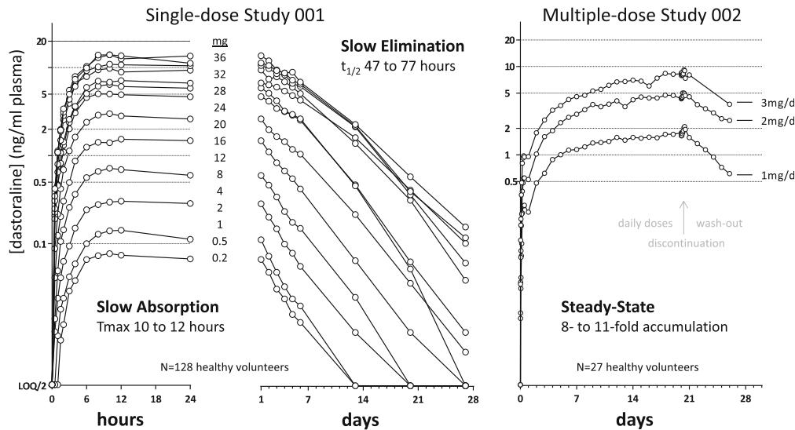  
Fig. 1 Dasotraline pharmacokinetics in healthy adults. Mean dasotraline concentrations (ng/ml plasma) are presented on a logarithmic scale for the first 24 h (left panel), the remaining 28 days (middle panel) following single doses from 0.2 to 36 mg, $N = 9$ subjects (N = 8 for 0.5 mg), and following multiple daily doses (right panel)   
for 21 days followed by a 7-day washout (N = 9, 8, 7 for 1, 2, 3 mg/day, respectively). Plasma lower limit of quantification (LOQ) for dasotraline was 10 pg/ml; values below the LOQ were set to LOQ divided by 2. $t _ { \% }$ half-life, $T _ { m a x }$ time to $C _ { \mathrm { m a x } } , C _ { m a x }$ maximum plasma concentration

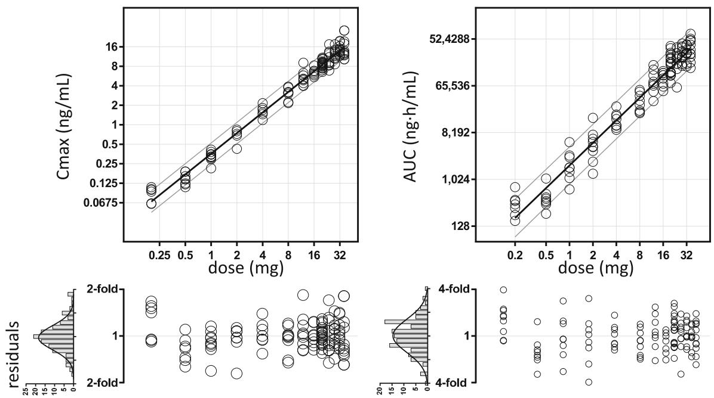  
Fig. 2 Dose-proportionality of dasotraline. A linear equation (±90 % prediction bands) was fit to the relationship between exposure measures [maximum plasma concentration $( C _ { \mathrm { m a x } } ) ,$ area under the concentration–time curve (AUC)] and dose, each on a log base 2 scale to show fold-changes in dose and exposure values. Fitted slope parameters for $C _ { \mathrm { m a x } }$ and AUC were 1.1 and 1.4, respectively, each having lower 95 % confidence values greater than 1. Residuals   
between fitted and observed linear dose-exposure relationships are shown below by dose level. The distribution of residuals across all dose levels are shown in histograms with fitted Gaussian distributions. The Gaussian standard deviation of $C _ { \mathrm { m a x } }$ was 0.25 units or 1.2-fold, yielding an overall estimate of 20 % CV. The Gaussian standard deviation of AUC was 0.70 units or 1.6-fold (60 % CV). CV coefficient of variation

approximately 50 % of its capacity at lower dasotraline concentrations with an estimated Michaelis–Menten constant (Km) of around 1.7 ng/ml. As dasotraline concentrations increased above 3 ng/ml, the nonlinear component contributed less to total elimination such that, in the therapeutic range of concentrations ([6 ng/ml), dasotraline exposure and pharmacokinetics were linear. The functional form of the dasotraline population pharmacokinetic model and final parameter estimates are described in Appendix B (see online Supplementary Material). Covariate analysis failed to identify age, total bilirubin, alanine aminotransferase (ALT), sex, race, or ethnicity as significant predictors of variability in the population pharmacokinetic model (a = 0.05, forward addition; a = 0.001, backward elimination). However, body weight (kg) was a significant covariate for dasotraline exposure and was therefore included in the model. Goodness-of-fit plots (Fig. 3) indicated a good fit of individual predicted concentrations versus observations and with limited bias. The population distributions of concentrations measured at 3 weeks of daily dosing had a mean of 6.6 and 18 ng/ml for the 4 and 8 mg/day dose levels, respectively (top panels Fig. 3). The variability across the population was characterized by the standard deviations of 1.7-fold and 2.0-fold for the Gaussian distributions of dasotraline concentration for 4 and 8 mg/day dose levels, respectively (Fig. 3). The dasotraline concentrations over time observed in adults with ADHD in Study 201 [2] matched well with the final population pharmacokinetic model predictions over time for dasotraline (Fig. 4a).

Population pharmacokinetic model parameter estimates for each individual patient in the phase II clinical trial in ADHD were utilized to simulate 4 weeks of daily doses of either 4 or 8 mg/day, followed by 4 weeks of washout. Simulated washouts were used to fit noncompartmental pharmacokinetic parameters for each subject. The distribution of (natural log) half-life values across the population of individuals included in the phase II clinical trial was normally distributed with a fitted Gaussian mean half-life of 47 h (Fig. 5). Noncompartmental pharmacokinetic parameters of apparent clearance and volume of distribution were also normally distributed across the population with fitted Gaussian parameters mean (l) and standard deviation (r) of l = 26 L/h (l - r = 14, l ? r = 46) for apparent clearance, and l = 1652 L (l - r = 1036, l ? r = 2635) for volume of distribution.

Dasotraline plasma concentrations were associated with decreases in plasma concentrations of the norepinephrine metabolite DHPG. In order to estimate the extent and onset of NET inhibition by dasotraline, a population pharmacokinetic and pharmacodynamic model was developed to describe the relationship between clinically relevant dasotraline exposures. The DHPG model equations and estimated parameters are summarized in Appendix C (see online Supplementary Material). The observed values for DHPG in the phase II clinical trial matched well with model predictions for DHPG changes (Fig. 4b). Covariate analysis failed to identify age, baseline weight, baseline BMI, baseline DHPG, gender, race, or ethnicity as predictors of variability in the parameters of the DHPG model (a = 0.05, forward addition; a = 0.001, backward elimination).

Fig. 3 Population pharmacokinetic model of dasotraline. Model-predicted dasotraline concentrations for individual subjects (symbols) were plotted (scatter plots) against observed dasotraline concentrations for all measured plasma samples collected from subjects in ADHD Study 201. Population distributions (frequency histograms) of observed dasotraline concentrations at steady-state (week 3 measurements) were fit with Gaussian curves by nonlinear regression, and mean (l) and standard deviation (r) values indicated (symbolstop)   
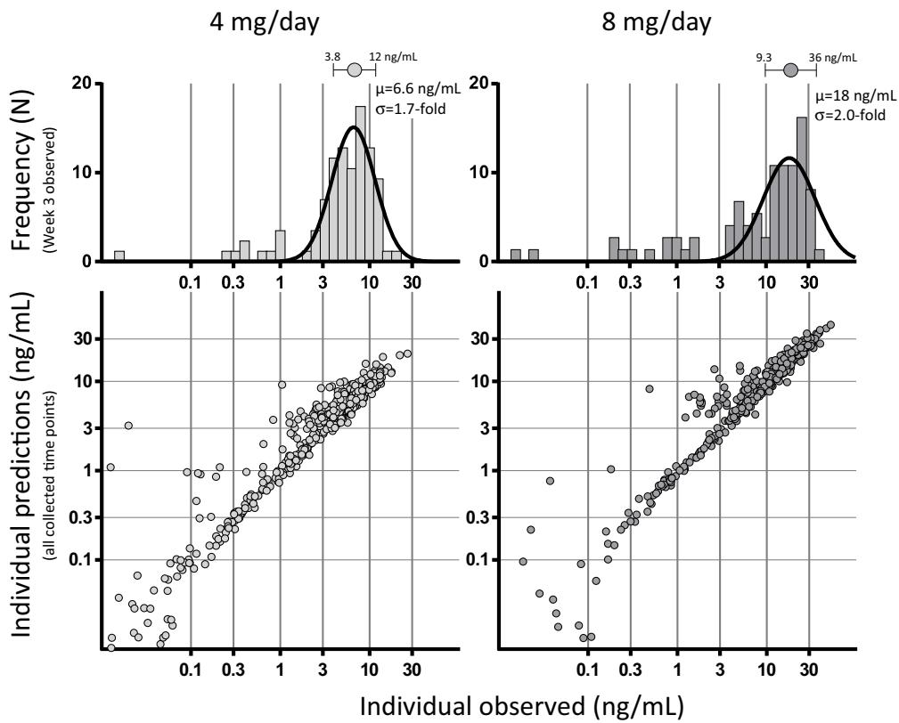

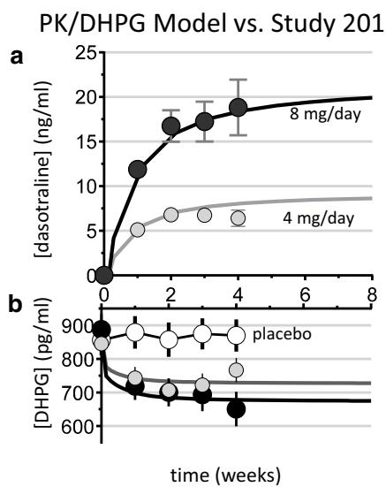

line

| time (weeks) | [dasotraline] (ng/ml) - 8 mg/day | [dasotraline] (ng/ml) - 4 mg/day | [DHPG] (pg/ml) - placebo |
| ------------ | -------------------------------- | ------------------------------- | ------------------------ |
| 0            | 0                                | 0                               | 900                      |
| 2            | ~17                              | ~6                              | ~850                     |
| 4            | ~19                              | ~7                              | ~750                     |
| 8            | ~20                              | ~8                              | ~650                     |

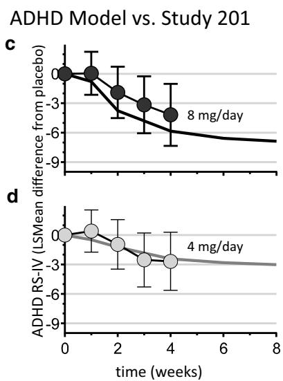

line

| time (weeks) | ADHD RS-IV (LSMean difference from placebo) | 8 mg/day | 4 mg/day |
| ------------ | ------------------------------------------ | -------- | -------- |
| 0            | 0                                          | 0        | 0        |
| 1            | -1                                         | -1       | -1       |
| 2            | -3                                         | -3       | -3       |
| 3            | -5                                         | -5       | -5       |
| 4            | -7                                         | -7       | -7       |
| 8            | -9                                         | -9       | -9       |

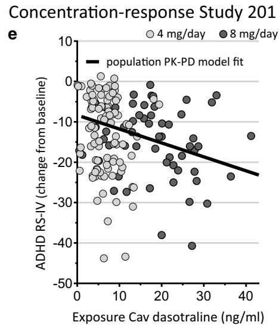

scatter

| Exposure Cav dasotraline (ng/ml) | ADHD RS-IV (change from baseline) | Treatment Group |
| -------------------------------- | ---------------------------------- | --------------- |
| 0                                | 0                                  | 4 mg/day        |
| 5                                | -10                                | 4 mg/day        |
| 10                               | -20                                | 4 mg/day        |
| 15                               | -30                                | 4 mg/day        |
| 20                               | -40                                | 4 mg/day        |
| 25                               | -50                                | 4 mg/day        |
| 30                               | -30                                | 8 mg/day        |
| 35                               | -20                                | 8 mg/day        |
| 40                               | -10                                | 8 mg/day        |

CI; b) compared to population PK and PD model predictions (lines). Reductions in ADHD symptoms observed in the phase II clinical trial (symbols are least square mean differences from placebo ± 95 % CI; c and d) compared to population PK and PD model predictions (lines). Mean dasotraline concentrations (Cav) were linearly related to ADHD symptom reductions in a sigmoid $E _ { \mathrm { m a x } }$ time-course PK and PD model for individual subjects in the phase II clinical trial (e)

Fig. 4 Population pharmacokinetic (PK) and pharmacodynamic (PD) models of dasotraline. Dasotraline concentrations observed in the phase II clinical trial in attention deficit/hyperactivity disorder (ADHD) (symbols mean ± 95 % CI; a) compared to population PK model predicted mean concentrations (lines). Norepinephrine metabolite 3,4-dihydroxyphenylglycol (DHPG) concentrations (pg/ml plasma) observed in the phase II clinical trial (symbols mean ± 95 %   
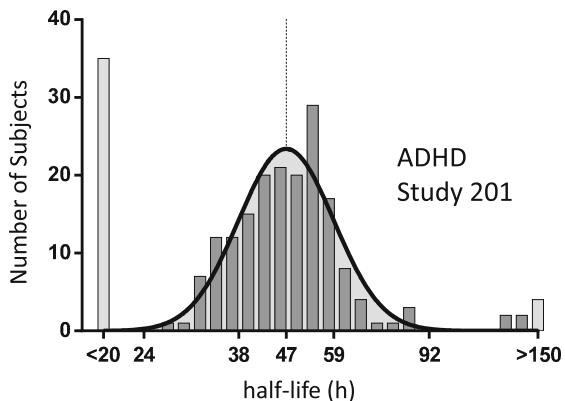

histogram

| half-life (h) | Number of Subjects |
| -------------- | ------------------ |
| <20            | 35                 |
| 24             | 1                  |
| 38             | 12                 |
| 47             | 20                 |
| 59             | 29                 |
| 92             | 3                  |
| >150           | 4                  |

Fig. 5 Distribution of half-life values. Individual subjects in the phase II clinical trial of dasotraline were simulated using the established population pharmacokinetic (PK) model to estimate the PK of dasotraline washout following 4 weeks of daily dosing. The population distribution of (natural log) half-life values was normally distributed and described by Gaussian-fitted values of mean (l) and standard deviation (r) of l = 47 h (l - r = 38, l ? r = 59)

# 3.3 Population Modeling of ADHD RS-IV Scores

ADHD symptom reductions in the phase II clinical trial were modeled as a function of dasotraline exposure. The functional form and parameter estimates are described in Appendix D (see online Supplementary Material). The typical value of baseline ADHD RS-IV total score was estimated at 36.8. The $E _ { \mathrm { m a x } } ,$ which represents the maximum possible reduction in ADHD RS-IV total score from baseline due to time alone was estimated at 10.2. The population mean estimates for the time producing 50 % of $E _ { \mathrm { m a x } }$ (T50) were 0.762 weeks for placebo and 1.08 weeks for the dasotraline treatment arms, respectively. Although the influence of age, baseline weight, baseline BMI, baseline ADHD RS-IV total score, baseline DHPG, baseline insomnia severity index, sex, race, and ethnicity was evaluated in the model, none of the covariates was found to be a statistically significant predictor of variability in ADHD RS-IV total score $( \alpha = 0 . 0 5$ , forward addition; $\alpha = 0 . 0 0 1$ , backward elimination). The model-predicted ADHD RS-IV total scores corresponded well with the observed values (Fig. 4c, d). The population model identified an exposure-response relationship between dasotraline concentrations and improvements in ADHD symptoms (Fig. 4e). The population pharmacokinetic/ADHD model was adequate for simulating clinical trial outcomes.

# 3.4 Time to Study Dropout

In ADHD Study 201, 9 % of placebo subjects and 15 and 45 % of subjects administered 4 and 8 mg/day dropped out of the study, respectively. Time to dropouts was modeled using a Cox proportional hazard survival model. The time to discontinuation (dropout) was modeled as a function of dasotraline exposure (Cav). An interaction term between time to study dropout and dasotraline exposure was incorporated to account for the nonproportional effects of the interaction between both dasotraline exposures and time on the log of the survival function. The modelpredicted risk of study dropout increased with increasing average dasotraline concentrations (hazard ratio of 1.24, 95 % CI 1.12–1.36). The interaction term between dasotraline exposure and time was estimated to be -0.0063 (42.7 % SEM), indicating an increase in study dropout as time increases. The risk of study dropout was reduced by approximately eightfold when comparing the hazard ratio for 8 versus 4 mg/day, assuming the median Cav for each dose. Model-predicted values indicated no apparent bias and illustrated good concordance between the model-based simulations and the observed data estimates of survival for each dose and corresponding range of Cav values observed throughout the study (Fig. 6). Although the influence of age, baseline weight, baseline BMI, baseline ADHD RS-IV total score, baseline DHPG, baseline heart rate, Insomnia Severity Index (baseline and time varying), sex, race, and ethnicity was evaluated in the survival model, none of the covariates were found to be a statistically significant predictor of variability in the dropout rate $( \alpha = 0 . 0 1$ for forward selection).

Fig. 6 Time to study dropout. Simulated percentiles of subjects who dropped out of the study versus days with Kaplan– Meier estimates of the observed data by dasotraline dose   
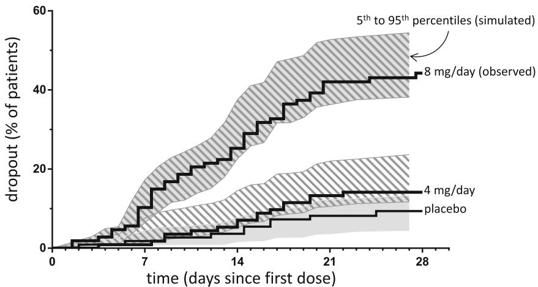

line

| time (days since first dose) | 8 mg/day (observed) | 4 mg/day | placebo |
| ---------------------------- | ------------------- | -------- | ------- |
| 0                            | 0                   | 0        | 0       |
| 7                            | ~15                 | ~5       | ~2      |
| 14                           | ~30                 | ~10      | ~5      |
| 21                           | ~40                 | ~15      | ~8      |
| 28                           | ~45                 | ~20      | ~10     |

# 3.5 Clinical Trial Simulations

Clinical trial simulations (Monte Carlo) were performed to predict the minimal effective dose, the no-effect dose, and the effect sizes expected for longer durations of treatment. Figure 7 summarizes the statistical outcomes (fraction of trials with $P < 0 . 0 5$ for a dasotraline comparison against placebo) of $N = 5 0 0$ simulated clinical trials as a function of dose, duration, and sample size. The effects of time- and concentration-dependent dropouts were applied in the simulations, with a relatively small impact on the probabilities of success. There was at most only a 3 % reduction in the probability of success for simulations conducted under the influence of dropout compared to simulations where all subjects completed the treatment period (no dropout).

The average effect size at 4 weeks for the 4 mg/day treatment group in simulated clinical trials was $0 . 2 5 \pm 0 . 1 1$ standard deviation (SD), matching the week 4 effect size observed in the phase II clinical trial for

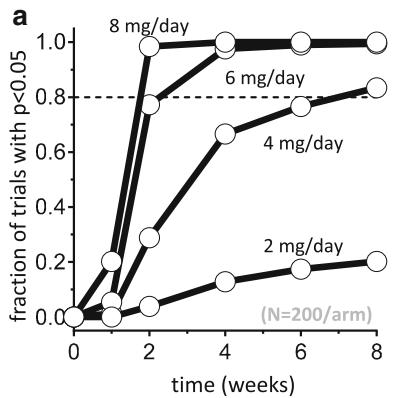

line

| time (weeks) | 2 mg/day | 4 mg/day | 6 mg/day | 8 mg/day |
| ------------ | -------- | -------- | -------- | -------- |
| 0            | 0.0      | 0.0      | 0.0      | 0.0      |
| 2            | 0.1      | 0.3      | 0.8      | 1.0      |
| 4            | 0.15     | 0.7      | 1.0      | 1.0      |
| 6            | 0.2      | 0.8      | 1.0      | 1.0      |
| 8            | 0.2      | 0.9      | 1.0      | 1.0      |

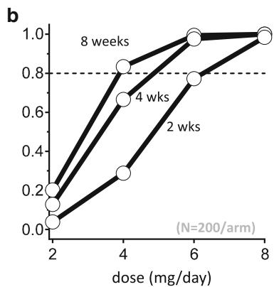

line

| dose (mg/day) | 2    | 4    | 6    | 8    |
| ------------- | ---- | ---- | ---- | ---- |
| 2             | 0.1  | 0.3  | 0.8  | 1.0  |
| 4             | 0.2  | 0.7  | 0.9  | 1.0  |
| 6             | 0.3  | 0.8  | 1.0  | 1.0  |
| 8             | 0.4  | 0.9  | 1.0  | 1.0  |

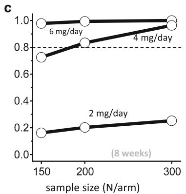

line

| sample size (N/arm) | 6 mg/day | 4 mg/day |
|---|---|---|
| 150 | 0.75 | 0.8 |
| 200 | 0.85 | 0.85 |
| 300 | 0.95 | 0.95 |
(8 weeks)

Fig. 7 Clinical trial simulations with dasotraline in adults with attention deficit/hyperactivity disorder (ADHD). The probability of a trial with statistically significant separation of treatment arms from   
placebo arm was estimated using Monte Carlo simulations of 500 clinical trials as a function of trial duration (a), dose (b), and sample size (c)

4 mg/day [2]. The simulations predicted further increases in effect sizes for trial durations beyond 4 weeks (Fig. 7a); at 8 weeks of treatment, 4 mg/day mean effect size was $0 . 3 1 \pm 0 . 1 1 \mathrm { S D }$ . As a result, the probability of success of a 4 mg/day treatment was above 80 % by 8 weeks of treatment with 200 subjects per arm (Fig. 7b). Therefore, simulations predicted 4 mg/day as the minimum effective dose.

The probability of success for the 4 mg/day dose level at week 8 was below 80 % for sample sizes of 150 per arm. The sample size of 200 subjects per arm improved the probability of success at week 8 to above 80 % for the 4 mg/day doses. At the 2 mg/day dose level, however, further increasing sample size to 300 per arm was still insufficient to demonstrate positive efficacy, thus predicting 2 mg/day as the no-effect dose (Fig. 7c). Increasing the length of the clinical trials from 8 to 12 weeks resulted in only a small increase in the percentage of successful trials, thus predicting an optimal trial duration of 8 weeks.

These clinical trial simulations, based on an understanding of the exposure-response relationship for dasotraline in adults with ADHD, supported further investigation of dasotraline in adults with ADHD in a phase III clinical trial of 8 weeks of treatment, doses of 4 or 6 mg/day, and sample size of 200 subjects per group (NCT02276209).

# 4 Discussion

Pharmacokinetic and pharmacodynamic modeling and simulation were used to integrate the data on dasotraline pharmacology and phase II clinical trial outcomes to inform the design of subsequent clinical trials. The pharmacokinetic and pharmacodynamic model developed from the available data described correlations between dasotraline exposure and various pharmacodynamic outcomes, including: (a) the reduction in ADHD symptoms, (b) the inhibition of norepinephrine reuptake (decreases in plasma DHPG concentrations), (c) the time to study dropout, and (d) outcomes of simulated clinical trials of adults with ADHD. The pharmacokinetic and pharmacodynamic model built on this data provided a quantitative basis for subsequent dasotraline clinical trials.

The PKs of dasotraline in clinical study subjects was well described by a 1-compartment pharmacokinetic model across a range of body weights (40–130 kg), dose levels (0.2–36 mg), and treatment durations (single dose to 28 days). The influence of body weight (kg) on dasotraline concentrations was included in the final model. The variability of dasotraline pharmacokinetics was otherwise independent of clinical covariates of age, sex, race, or indicators of liver functioning. Although the elimination of dasotraline was modeled as time- and concentration-dependent with the relative contribution of nonlinear and linear clearance pathways conditional on the magnitude, frequency, and duration of dosing, overall the model of dasotraline pharmacokinetics was both predictable and nearly dose-proportional in both single-dose and multipledose clinical settings. After 28 days of dosing in adults with ADHD the population mean dasotraline $t _ { \% }$ was estimated to be 47 h and characterized by a relatively narrow population distribution, indicating 10 days is an appropriate clinical estimate of the five $t _ { \mathrm { ^ { 1 } / 2 } } \mathrm { S }$ for washout or establishing steady-state.

Reductions in plasma concentrations of DHPG are a clinically significant effect of NET inhibitors such as duloxetine [8, 9], where decreases are thought to indicate decreased uptake and neuronal metabolism of norepinephrine. Dasotraline concentrations above 2 ng/ml were associated with reductions in plasma DHPG, indicative of central inhibition of NETs. In humans, the extent of inhibition by the selective NET inhibitor atomoxetine was estimated to be above 90 % [10], and daily administration of atomoxetine 80 mg reduced plasma DHPG concentrations by 37 % [11]. By comparison, the dasotraline population pharmacokinetic and pharmacodynamic model of DHPG suggested that the pharmacodynamic response of NET inhibition (mean reductions in DHPG) had not reached maximal levels of inhibition. Overall, the observed values for DHPG in the phase II clinical trial [2] matched well with model predictions for DHPG changes and were consistent with clinically significant levels of NET inhibition by dasotraline within the first days of dosing and sustained over 4 weeks of daily doses.

Methylphenidate, at doses used clinically to treat ADHD, also occupies greater than 50 % of DATs [12], together with measurable occupancy of NETs [13]. A prior human PET study conducted following single doses of 8, 12, or 16 mg demonstrated that dasotraline plasma concentrations of 4.5 ng/ml were associated with 50 % DAT occupancy, and with no significant serotonin transporter occupancy [6]. The exposures reported here suggest that dasotraline efficacy in ADHD is associated with greater than 50 % inhibition of DATs. Taken together these results suggest that dasotraline is acting as a dual dopamine and norepinephrine reuptake inhibitor in ADHD.

Dasotraline demonstrated an exposure-response relationship for reduction in ADHD symptoms. A substantial portion of the change from baseline occurred at the first visit post-baseline (week 1) at a time where dasotraline concentrations were still relatively low compared to steady-state levels. In fact, the LS mean ADHD RS-IV total scores at the week 1 visit were equivalent among treatment groups and likely related to a placebo effect [2]. Based upon population mean parameter estimates derived from ADHD Study 201, a subject with a baseline ADHD RS-IV with adult prompts total score of 36.8 commencing daily dasotraline treatment for 4 weeks had an approximate total reduction in ADHD RS-IV total score of 11 at the end of 4 weeks of treatment (attaining an approximate score of 26) if average drug concentrations achieved consistent levels near 7 ng/ml for 4 mg. Assuming a dose of 8 mg dasotraline and an average concentration of 16.5 ng/ml, an approximate total reduction in ADHD RS-IV total score of 14 for the typical subject was achieved at the end of 4 weeks of treatment (attaining an approximate score of 23).

Dasotraline also demonstrated an exposure- and timedependent relationship for the rate of study discontinuation (dropout) in the phase II clinical trial, generally increasing probabilities for study discontinuation with increasing dasotraline exposure, particularly early during treatment initiation. Adverse events pharmacologically related to the onset of NET and DAT inhibition were the most common reason for study dropout during the double-blind period (27.8 % of 8 mg/day group), supported by the predictions of the pharmacokinetic and pharmacodynamic model relating dasotraline exposure to the probability of study dropout. Due to relatively low sample sizes, reasons for discontinuation (by adverse event terms such as insomnia, dry mouth, appetite, etc.) were not modeled separately within this analysis. When examined as a function of dose, exposure, and time in the study, insomnia itself (both baseline level of insomnia or time-varying changes in insomnia) was not a statistically significant predictor of variability in the dropout rate. Based on this analysis, random allocation to fixed doses of dasotraline, without habitutation or a gradual dose escalation, may have contributed to the observed rates of study discontinuation due to adverse events, particularly for the 8 mg/day dose group.

Clinical trial simulations predicted clinical trial outcomes of longer duration and different dose levels. Simulations incorporating exposure-response relationships for dasotraline pharmacodynamics (DHPG concentrations) and efficacy (ADHD RS-IV total scores) and subject dropout conducted over a range of doses and durations predicted: (a) the minimal effective dose of 4 mg/day, (b) the noeffect dose of 2 mg/day, (c) the optimal 8-week duration of treatment, and (d) sample sizes appropriate for future adequate and well controlled efficacy studies.

# 5 Conclusions

Taken together, these results describe quantitatively the exposure-response relationships of dasotraline and its pharmacological activity in ADHD. The pharmacokinetic and pharmacodynamic models described here supported the further clinical development of dasotraline in ADHD. The novel pharmacokinetic and pharmacodynamic profile of dasotraline in ADHD supports the concept that maintaining constant, steady-state inhibition of both DATs and NETs is a novel pharmacological approach to the management of ADHD symptoms.

Acknowledgments The authors would like to thank the participants of the studies summarized in this paper; and the study investigators involved in the conduct of studies.

# Compliance with Ethical Standards

Funding The study was sponsored by Sunovion Pharmaceuticals Inc. The authors are entirely responsible for the scientific content of the paper. Edward Schweizer, MD, of Paladin Consulting Group, provided editorial assistance for this manuscript under the direction of the authors. Financial support for this editorial assistance was provided by Sunovion Pharmaceuticals Inc.

Conflicts of interest Drs. Hopkins, Sunkaraneni, Skende, Loebel, and Koblan are employees of Sunovion Pharmaceuticals Inc. Drs. Hing and Passarell are employees of Cognigen Corporation, Buffalo, NY, USA that performed the population PK-PD analyses under a contract with Sunovion Pharmaceuticals Inc.

Ethical approval All of the studies included in the current analyses were approved by an institutional review board at each investigational site and each study was conducted in accordance with the International Conference on Harmonisation Good Clinical Practice Guidelines and with the ethical principles of the Declaration of Helsinki. Study 201 implemented an independent data and safety monitoring board to review and monitor patient safety data throughout the study.

Informed Consent Prior to study entry, all patients reviewed and signed an informed consent document explaining study procedures and potential risks.

Open Access This article is distributed under the terms of the Creative Commons Attribution-NonCommercial 4.0 International License (http://creativecommons.org/licenses/by-nc/4.0/), which permits any noncommercial use, distribution, and reproduction in any medium, provided you give appropriate credit to the original author(s) and the source, provide a link to the Creative Commons license, and indicate if changes were made.

# References

1. Faraone SV, Biederman J. What is the prevalence of adult ADHD? Results of a population screen of 966 adults. J Atten Disord. 2005;9:384–91.   
2. Koblan KS, Hopkins SC, Sarma K, et al. Dasotraline for the treatment of Attention-Deficit/Hyperactivity Disorder: a randomized, double-blind, placebo-controlled, proof-of-concept trial in adults. Neuropsychopharmacology. 2015;40:2745–52.   
3. Allerheiligen SR. Next-generation model-based drug discovery and development: quantitative and systems pharmacology. Clin Pharmacol Ther. 2010;88:135–7.   
4. Morgan P, Van Der Graaf PH, Arrowsmith J, et al. Can the flow of medicines be improved? Fundamental pharmacokinetic and pharmacological principles toward improving Phase II survival. Drug Discov Today. 2012;17:419–24.

5. Milligan PA, Brown MJ, Marchant B, et al. Model-based drug development: a rational approach to efficiently accelerate drug development. Clin Pharmacol Ther. 2013;93:502–14.   
6. DeLorenzo C, Lichenstein S, Schaefer K, et al. SEP-225289 serotonin and dopamine transporter occupancy: a PET study. J Nucl Med. 2011;52:1150–5.   
7. Bastien CH, Vallie\`res A, Morin CM. Validation of the Insomnia Severity Index as an outcome measure for insomnia research. Sleep Med. 2001;2:297–307.   
8. Vincent S, Bieck PR, Garland EM, et al. Clinical assessment of norepinephrine transporter blockade through biochemical and pharmacological profiles. Circulation. 2004;109:3202–7.   
9. Chappell JC, Eisenhofer G, Owens MJ, et al. Effects of duloxetine on norepinephrine and serotonin transporter activity in healthy subjects. J Clin Psychopharmacol. 2014;34:9–16.

10. Ding YS, Naganawa M, Gallezot JD, et al. Clinical doses of atomoxetine significantly occupy both norepinephrine and serotonin transports: implications on treatment of depression and ADHD. Neuroimage. 2014;86:164–71.   
11. Kielbasa W, Pan A, Pereira A. A pharmacokinetic/pharmacodynamic investigation: assessment of edivoxetine and atomoxetine on systemic and central 3,4-dihydroxyphenylglycol, a biochemical marker for norepinephrine transporter inhibition. Eur Neuropsychopharmacol. 2015;25:377–85.   
12. Volkow ND, Wang GJ, Fowler JS, et al. Dopamine transporter occupancies in the human brain induced by therapeutic doses of oral methylphenidate. Am J Psychiatry. 1998;155:1325–31.   
13. Hannestad J, Gallezot JD, Planeta-Wilson B, et al. Clinically relevant doses of methylphenidate significantly occupy norepinephrine transporters in humans in vivo. Biol Psychiatry. 2010;68:854–60.