# Improving Efficacy of Inhaled Technosphere Insulin (Afrezza) by Postmeal Dosing: In-silico Clinical Trial with the University of Virginia/Padova Type 1 Diabetes Simulator

Roberto Visentin, PhD,1 Clemens Giegerich, MS,2 Robert Ja¨ger, PhD,2

Raphael Dahmen, MD,2 Anders Boss, MD,3 Marshall Grant, PhD,4

Chiara Dalla Man, PhD,1 Claudio Cobelli, PhD,1 and Thomas Klabunde, PhD2

# Abstract

Background: Technosphere- insulin (TI), an inhaled human insulin with a fast onset of action, provides a novel option for the control of prandial glucose. We used the University of Virginia (UVA)/Padova simulator to explore in-silico the potential benefit of different dosing regimens on postprandial glucose (PPG) control to support the design of further clinical trials. Tested dosing regimens included at-meal or postmeal dosing, or dosing before and after a meal (split dosing).

Methods: Various dosing regimens of TI were compared among one another and to insulin lispro in 100 virtual type-1 patients. Individual doses were identified for each regimen following different titration rules. The resulting postprandial glucose profiles were analyzed to quantify efficacy and the risk for hypoglycemic events.

Results: This approach allowed us to assess the benefit/risk for each TI dosing regimen and to compare results with simulations of insulin lispro. We identified a new titration rule for TI that could significantly improve the efficacy of treatment with TI.

Conclusion: In-silico clinical trials comparing the treatment effect of different dosing regimens with TI and of insulin lispro suggest that postmeal dosing or split dosing of TI, in combination with an appropriate titration rule, can achieve a superior postprandial glucose control while providing a lower risk for hypoglycemic events than conventional treatment with subcutaneously administered rapid-acting insulin products.

# Introduction

ound glycemic control often necessitates basal–bolus insulin treatment in type-1 diabetes (T1D). However, hypoglycemia, weight gain, and the burden of multiple injections often lead to poor adherence.1 An inhaled prandial insulin with rapid kinetics may address some of these concerns and could provide important therapeutic options for individualized diabetes management. Technosphere- insulin (TI; MannKind Corporation, Valencia, CA) is a dry powder formulation of recombinant human insulin adsorbed onto Technosphere microparticles for oral inhalation.2 On inhalation, these microparticles can reach the deep lung allowing absorption into the systemic circulation with a time to maximum serum insulin concentration of 12–15 min.3,4 TI is administered through the Afrezza inhaler device.

In one of its pivotal phase III trials in T1D patients (NCT01445951), TI demonstrated noninferiority to the subcutaneously (SC) administered prandial insulin aspart $( \mathrm { N o v o L o g } ^ { \mathbb { B } } )$ at a 0.4% margin.5 The treatment difference in HbA1c was 0.2% (95% confidence interval 0.08% to 0.38%) to the advantage of insulin aspart. Within this study, patients randomized to TI were to take the prescribed dose at the beginning of the meal and were to increase the dose if postprandial glucose (PPG) 90 min after start of the meal exceeded 160 mg/dL. Patients in the aspart arm were to take their dose 15 min before the meal, as indicated in the prescribing information. Because of the fast onset and short duration of action, the dosing regimen of TI in this study may have been suboptimal. Different TI dosing regimens, for example, postmeal dosing or split dosing (at-meal and postmeal) might provide better postprandial glucose control. The key questions to be answered are as follows. Can the efficacy of TI be improved by changing the dosing regimen? Could an improvement be clinically significant? Which titration rule would be optimal to guide patients to their individual dose with modified dosing regimens?

The availability of validated simulation models allows us to address these questions by performing in-silico meal tests in virtual T1D patients.6,7 Simulation models of the glucose system have been shown to be extremely useful for studying the pathophysiology of T1D. In particular, the University of Virginia (UVA) and Padova T1D simulator, accepted by the U.S. Food and Drug Administration (FDA) as a substitute for preclinical trials of certain insulin treatments, has been largely used for developing and in-silico testing of artificial pancreas closed-loop control algorithms. This has dramatically accelerated progress because animal studies can be replaced by virtual trials.

In the study by Visentin et al.,8 a pharmacokinetic (PK) model of TI insulin was incorporated into the T1D simulator based on clinical data obtained from T1D subjects (PDC-INS-011; MannKind). TI insulin was administered using the MedTone inhaler, a prior inhaler design now superceded by the current Gen2 inhaler, providing a similar PK profile with respect to $\mathrm { T } _ { \mathrm { m a x } }$ but resulting in an approximately one-third lower bioavailability than obtained with the current Gen2 inhaler. In Visentin et al.,8 the ability of the simulator has been successfully demonstrated to describe the PK of TI (administered using the MedTone device) and to predict the glucose dynamics after a meal test with TI dosing at the start of the meal. In this study, an in-silico approach to evaluate different dosing regimens and titration rules with respect to postprandial glucose control and the risk for hypoglycemic events is presented.

# Research Design and Methods

Incorporating PK model of TI and insulin lispro into T1D simulator

The FDA-accepted UVA/Padova T1D simulator6,7 consists of a model of glucose–insulin–glucagon dynamics during a meal and a population of 300 in-silico subjects (100 virtual adults, 100 adolescents, and 100 children). Each virtual subject is represented in the simulator by a vector containing subject-specific model parameters. These were generated by randomly extracting different realizations of the parameter vector from an appropriate joint parameter distribution; a process that has been demonstrated to span the variability of the T1D population observed in vivo.7,9 The current version of the UVA/Padova T1D simulator describes the subcutaneous insulin absorption with the PK profile of the SC prandial insulin lispro (see Dalla Man et al.10 for model equation). A model describing TI insulin PK administered using the current Gen2 inhaler device is incorporated as explained in the following section.

Generation of TI insulin PK model. The PK model of TI is a variation of the single-compartment model described in Potocka et al.11 Model equations are as follows:

$$
\dot {I} _ {T I} (t) = - k _ {a, T I} \cdot I _ {T I} (t) + F _ {T I} \cdot D \quad I _ {T I} (0) = 0 \tag {1}
$$

where $I _ { T I } \left( \mathrm { p m o l / k g } \right)$ is the amount of insulin in the alveolar space; D (pmol/kg/min) is the TI dose; $F _ { T I }$ is the fraction of inhaled insulin that actually appears in plasma; and $k _ { a , T I }$ (min-1 ) is the rate constant of insulin absorption from the lungs. Plasma insulin kinetics are described using the twocompartment configuration currently included into the simulator and described in Ferrannini and Cobelli12:

$$
\left\{ \begin{array}{l l} \dot {I} _ {l} (t) = - \left(m _ {1} + m _ {3}\right) \cdot I _ {l} (t) + m _ {2} \cdot I _ {p} (t) & I _ {l} (0) = I _ {l b} \\ \dot {I} _ {p} (t) = - \left(m _ {2} + m _ {4}\right) \cdot I _ {p} (t) + m _ {1} \cdot I _ {l} (t) & I _ {p} (0) = I _ {p b} \\ + k _ {a T I} \cdot I _ {T I} (t) & \\ I (t) = I _ {p} (t) / V _ {I} & I (0) = I _ {b} \end{array} \right. \tag {2}
$$

where $I _ { p }$ and $I _ { l }$ (pmol/kg) are the mass of insulin in plasma and liver, respectively; I (pmol/L) is the plasma insulin concentration; suffix b denotes basal state; m1, m2, m3, m4 $( \mathrm { m i n } ^ { - 1 } )$ are rate parameters; and $V _ { I }$ (L/kg) is the insulin distribution volume.

The PK model was identified using insulin data from an hyperinsulinemic–euglycemic glucose clamp study (MKC-TI-177, NCT01544881; MannKind) in 12 T1D subjects (nine males, $\mathrm { a g e } = 3 9 \pm 9$ years, body $\mathrm { w e i g h t } = 8 4 . 2 \pm 8 . 8 \mathrm { k g }$ , body mass in $\mathrm { \bar { d e x } } = 2 6 . 6 { \overset { \cdot } { \pm 1 . 9 } } \mathrm { k g / m ^ { 2 } } )$ , each receiving one dose of 20 U of TI inhalation powder administered using the Gen2 inhaler. All subjects provided their written informed consent before initiation of any study-related procedures.

PK model parameters were identified on plasma insulin concentrations by nonlinear weighted least squares implemented in $\mathbf { M A T L A B } ^ { \mathrm { \textregistered } }$ . In particular, due to steady infusion of insulin, insulin concentrations were basal corrected, that is, the net insulin concentration due to TI $I _ { O B } ( t ) = I ( t ) - I _ { b }$ was used in the identification, where $I _ { b }$ is the basal insulin value measured at the time of meal ingestion. Error in insulin measurements was assumed to be uncorrelated, Gaussian, with zero mean, and a variance linked to insulin measurements as reported in Toffolo et al.13 Insulin bolus is the model input assumed to be known without error. Bayesian terms were considered for estimation of $F _ { T I } ,$ with mean $F _ { T I }$ set according to Potocka et al.11

Incorporation of TI/Gen2 PK model into the T1D simulator. Individual PK parameters of TI insulin were randomly extracted from joint parameter distributions created using the parameter estimates obtained from model identification of TI data. Mahalanobis distance lower than that corresponding to the 95% percentile was considered, paralleling what was done in Dalla Man et al.7 Each individual parameter set describing the TI/Gen2 PK was randomly assigned to each insilico subject.

Subsequently, similar to Visentin et al.8 for TI/MedTone, we assessed the simulator incorporating the PK module by simulating the application of 20 U of TI and comparing the resulting plasma insulin levels to the clinically observed insulin profiles. In particular, to capture net changes from baseline due to the treatment, simulations were evaluated against data considering the over-basal insulin time courses, that is, $I _ { O B } ( t ) = I ( t ) - I _ { b } ,$ , obtained by subtracting baseline values of insulin (at meal time) from the measured and simulated values.

# In-silico meal test after administration of TI and insulin lispro

One hundred virtual T1D adults underwent meal tests under several conditions. Subjects received their optimal basal insulin for the entire experiment durations. In all simulations, subjects received an isocaloric meal containing 50 g carbohydrates at time t = 0 and were treated with either TI or insulin lispro.

Insulin lispro. In-silico meal test simulations were run with all 100 virtual patients receiving prandial insulin lispro (Humalog-) administered coincident with the start of the meal (t = 0) or 15 min before (t = -15 min). Meal tests with administration of doses from 0 to 20 U of insulin lispro (1 U increments) were simulated in all virtual patients.

Technosphere insulin. Meal tests with administration of doses from 10 to 80 U of TI (10 U increments) at start of the meal (t = 0), at t = 15, 30, 45, 60, 75, or 90 min (postmeal dosing), or both (split dosing) were simulated in all virtual patients. Note that an Afrezza cartridge containing 10 U insulin is labeled as ‘‘4 units,’’ which accounts for the lower bioavailability of inhaled insulin and differences in effect for TI compared to SC prandial insulins. The conversion provides a conservative guide for estimating starting TI doses when switching from SC prandial insulins. In total, more than 40,000 meal tests were simulated.

Table 1. Performance Metrics 

<table><tr><td></td><td>Description</td></tr><tr><td>PPG2h (mg/dL)</td><td>Postprandial glucose 2 h after start of meal</td></tr><tr><td>MPG6h (mg/dL)</td><td>Mean glucose over 6 h after start of meal</td></tr><tr><td>PPGAUC,4h</td><td>Area under glucose curve over 4 h after start of meal</td></tr><tr><td>Tt (%)</td><td>Time in glucose target range 70 to 180 mg/dL</td></tr><tr><td>Ttt (%)</td><td>Time in tight target range 80 to 140 mg/dL</td></tr><tr><td>Hyporisk-LBGI, final dose</td><td>Estimated risk for hypoglycemic event as expressed by LBGI</td></tr><tr><td>#VP-BG70, uptitration</td><td>Number of virtual patients with events in glucose profile with PPG &lt;70 mg/dL during virtual uptitration</td></tr></table>

LBGI, low blood glucose index; PPG, postprandial glucose; VP, virtual patient.

# Virtual uptitration

The titration rules were defined as $\mathrm { P P G } _ { \mathrm { t i m e } } \leq \mathrm { P P G } _ { \mathrm { l i m i t } } ,$ where $\mathrm { P P G } _ { \mathrm { t i m e } }$ is the plasma glucose at the time specified for a virtual self-monitoring blood glucose (SMBG) measurement and $\mathrm { P P G } _ { \mathrm { l i m i t } }$ is the upper limit of the target glucose concentration at that time. For example, $\mathrm { P P G } _ { 1 2 0 }$ £160 mg/dL represents the condition that the PPG 120 min after the start of the meal should not exceed 160 mg/dL. If $\mathrm { P P G } _ { 1 2 0 }$ >160 mg/dL, the dose should be increased.

Insulin lispro. The individualized dose of insulin lispro for each virtual patient was selected by increasing the dose until the resulting glucose profile satisfied the $\mathrm { P P G } _ { 1 2 0 }$ £160 mg/dL rule, while keeping blood glucose (BG) levels above the threshold of 70 mg/dL to avoid doses associated with a risk for a hypoglycemic event. In cases where $\mathrm { P P G } _ { 1 2 0 }$ £160 mg/dL could only be reached for a dose with $\mathrm { B G } < 7 0 \mathrm { m g / d L }$ at any time in the simulated glucose profile, the dose was not increased and left at the dose level below.

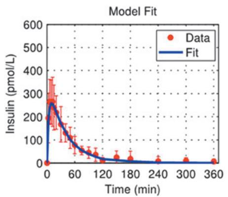

line

| Time (min) | Data (pmol/L) | Fit (pmol/L) |
| ---------- | ------------- | ------------ |
| 0          | 250           | 250          |
| 60         | 100           | 100          |
| 120        | 50            | 50           |
| 180        | 25            | 25           |
| 240        | 10            | 10           |
| 300        | 5             | 5            |
| 360        | 0             | 0            |

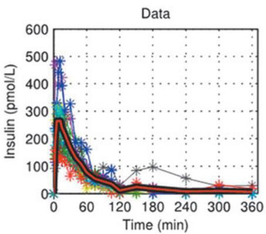

line

| Time (min) | Insulin (pmol/L) |
| ---------- | ---------------- |
| 0          | 500              |
| 60         | 100              |
| 120        | 50               |
| 180        | 30               |
| 240        | 20               |
| 300        | 15               |
| 360        | 10               |

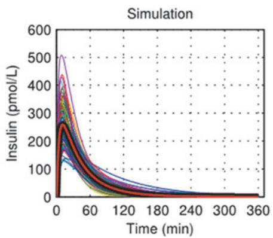

line

| Time (min) | Insulin (pmol/L) |
| ---------- | ---------------- |
| 0          | 500              |
| 60         | 250              |
| 120        | 100              |
| 180        | 50               |
| 240        | 20               |
| 300        | 10               |
| 360        | 5                |

FIG. 1. Model fit of experimental insulin data from a hyperinsulinemic–euglycemic glucose clamp study MKC-TI-177 (left panel) and comparison between over-basal insulin data (middle panel) and simulations (right panel) obtained after an administration of 20 U with Gen2 inhaler. Individual profiles are shown, with averages plotted as thick red lines. TI, Technosphere- insulin.

Technosphere insulin. For each dosing regimen, the individualized dose of TI was selected in the same manner by increasing the dose until the resulting glucose profile satisfied the $\mathrm { P P G } _ { 9 0 } \leq 1 6 0 \mathrm { m g } / \mathrm { d L }$ rule, while keeping BG levels above the threshold of 70 mg/dL to avoid doses associated with a risk for a hypoglycemic event. In cases where $\mathrm { P P G } _ { 9 0 }$ £160 mg/dL could only be reached for a dose with BG <70 mg/dL at any time of the simulated glucose profile, the dose was not increased and left a level below. This procedure matches the titration rule used in the phase III study with at-meal administration in $\mathrm { T } 1 \mathrm { D } . ^ { 5 }$ For the TI single-dose regimens, doses were increased in steps of 10 units TI, corresponding to the minimum possible increment, that is, the content of the lowest dose of TI cartridge. For the split-dose regimen, doses of 10 to 80 U TI were divided into two portions as follows: 10–0 (10 U TI), 10–10 (20 U TI), 10–20 (30 U TI), 10–30 (40 U TI), 10–40 (50 U TI), 20–40 (60 U TI), 20–50 (70 U TI), and 20–60 (80 U TI), where the first number is the at-meal dose and the second number is the postmeal dose.

The titration rule used in the clinical study in $\mathrm { t y p e } { - 1 , 5 }$ $\mathrm { P P G } _ { 9 0 } { \leq } 1 6 0 \mathrm { m g / d L }$ , may not be the optimal one, so additional 19 rules were investigated for a total of 20 representing combinations of five virtual SMBG times at 60, 90, 120, 150, and 180 min after start of the meal and four upper PPG limits at 130, 140, 150, and 160 mg/dL. As above, the individualized dose of TI was either the minimum dose satisfying $\mathrm { P P G } _ { \mathrm { t e s t } } { \le } \mathrm { P P G } _ { \mathrm { l i m i t } }$ or the maximum dose satisfying minBG(t)0–6h >70 mg/dL.

# Assessment of benefit–risk ratio from simulated glucose profiles

For each glucose profile, the efficacy of the individualized dose was quantified using the parameters in Table 1. The number of virtual patients with a BG <70 mg/dL is given as ‘‘#VP-BG70, uptitration.’’ The risk for hypoglycemia for each treatment/dosing regimen after virtual uptitration is derived using an established metric, the ‘‘low blood glucose index’’ (LBGI).14,15 Three hypoglycemia risk categories have been defined based on LBGI: low (LBGI <2.5), moderate (LBGI between 2.5 and 5), and high (LBGI >5). Each virtual patient was individually uptitrated and the LBGI for the glucose profile was calculated. For all treatments/dosing regimens, the mean LBGI across all 100 virtual patients was calculated (‘‘hyporisk-LBGI, final dose’’) and the number of virtual patients with an LBGI >2.5 (equals moderate hyporisk) was determined.

# Results

# Incorporating PK model of TI into T1DM simulator

Model fit of TI data was excellent (Fig. 1, left panel). Estimates of model parameters were as follows: $V _ { I } { = } \bar { 0 } . 0 4 4 \pm$ $0 . 0 0 8 \mathrm { L } / \mathrm { k g } , \mathrm { m } _ { 1 } = 0 . 1 7 8 \pm 0 . 0 3 1$ min- $, \mathrm { m } _ { 2 } { = } 0 . 3 2 2 { \pm } 0 . \dot { 0 } 7 9 \mathrm { m i n } ^ { - 1 } .$ , $\mathrm { m } _ { 3 } = 0 . 2 6 \bar { 7 } \pm 0 . 0 4 7$ min-1 , $\mathrm { m } _ { 4 } { = } 0 . 1 2 9 { \pm } 0 . 0 3 2 \mathrm { m i n } ^ { - 1 } , k _ { a , T I } { = }$ $0 . 0 2 6 { \pm } 0 . 0 1 0 \mathrm { m i n } ^ { - 1 }$ , and $F _ { T I } { = } 0 . 1 4 \pm 0 . 0 3$ . In-silico TI insulin PK profiles were generated based on the distribution of $k _ { a T I }$ and $F _ { T I }$ and used in the T1DM simulator to predict insulin and glucose profiles in a meal test following administration of 20 U TI. The resulting insulin profiles strongly resemble those observed clinically in MKC-TI-177, in terms of both average profiles and intersubject variability (Fig. 1, middle and right panel).

# In-silico meal tests after treatment with insulin lispro

Simulations of meal tests with uptitration of insulin lispro are shown in Figure 2 for one illustrative in-silico subject. As shown, increased doses lead to an increase in the maximal insulin lispro concentration and to a lowering of postprandial glucose. In line with clinical data, the insulin peak concentration after subcutaneous administration of insulin lispro is found to occur around 50 min for the example patient (average $\mathrm { T } _ { \mathrm { m a x } } 5 0 { - } 6 0 \mathrm { m i n } )$ . Also in line with the administration route, the duration of action

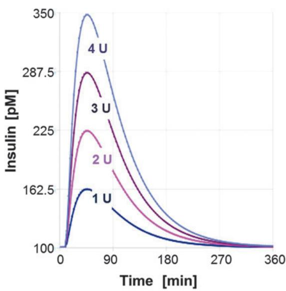

line

| Time [min] | 1 U    | 2 U    | 3 U    | 4 U    |
| ---------- | ------ | ------ | ------ | ------ |
| 0          | 100    | 100    | 100    | 100    |
| 90         | 162.5  | 225    | 287.5  | 350    |
| 180        | 100    | 100    | 100    | 100    |
| 270        | 100    | 100    | 100    | 100    |
| 360        | 100    | 100    | 100    | 100    |

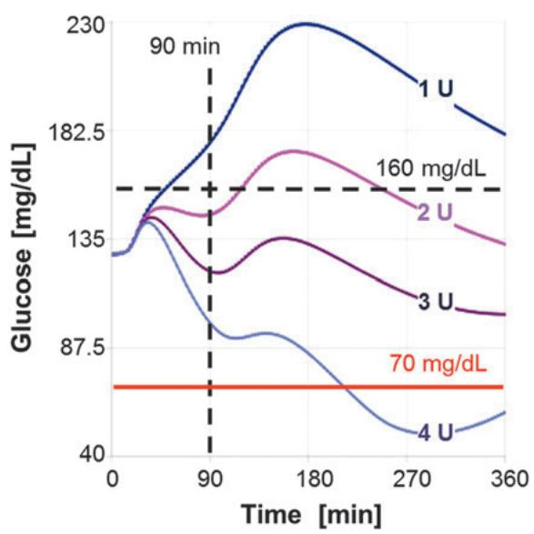

line

| Time [min] | 1 U   | 2 U   | 3 U   | 4 U   |
| ---------- | ----- | ----- | ----- | ----- |
| 0          | 135   | 135   | 135   | 135   |
| 90         | 230   | 182.5 | 135   | 87.5  |
| 180        | 230   | 182.5 | 135   | 87.5  |
| 270        | 230   | 182.5 | 135   | 40    |
| 360        | 230   | 182.5 | 135   | 40    |

FIG. 2. Virtual uptitration of insulin lispro with simulated meal test in one illustrative in-silico subject. Insulin (left) and glucose (right) in response to at-meal administration of four different dosages are shown in different colors.

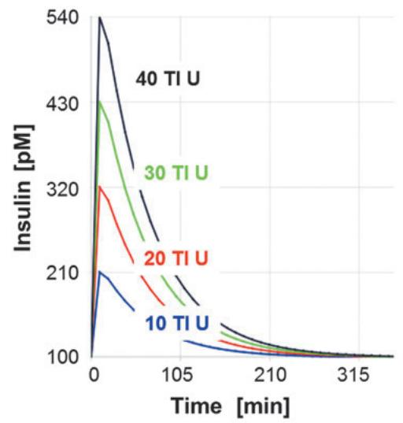

line

| Time [min] | 40 TI U | 30 TI U | 20 TI U | 10 TI U |
| ---------- | ------- | ------- | ------- | ------- |
| 0          | 540     | 430     | 320     | 210     |
| 105        | ~320    | ~280    | ~220    | ~160    |
| 210        | ~160    | ~140    | ~120    | ~100    |
| 315        | ~100    | ~100    | ~100    | ~100    |

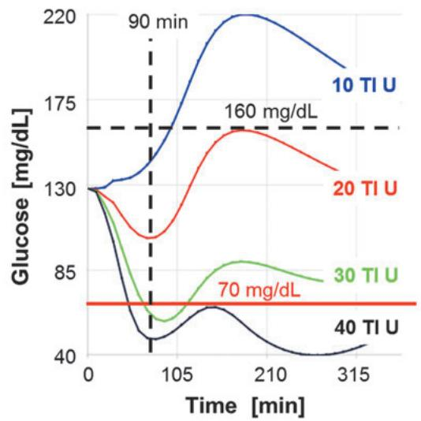

line

| Time [min] | 10 TI U | 20 TI U | 30 TI U | 40 TI U |
| ---------- | ------- | ------- | ------- | ------- |
| 0          | 130     | 130     | 130     | 130     |
| 90         | 175     | 175     | 85      | 40      |
| 160        | 220     | 175     | 85      | 40      |
| 315        | 175     | 130     | 85      | 40      |

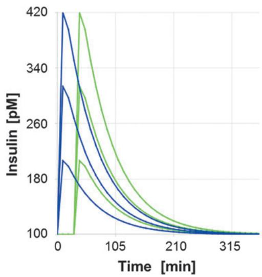

line

| Time [min] | Insulin [pM] (Line 1) | Insulin [pM] (Line 2) | Insulin [pM] (Line 3) | Insulin [pM] (Line 4) |
| ---------- | --------------------- | --------------------- | --------------------- | --------------------- |
| 0          | 420                   | 330                   | 180                   | 100                   |
| 105        | 260                   | 200                   | 120                   | 100                   |
| 210        | 180                   | 140                   | 100                   | 100                   |
| 315        | 100                   | 100                   | 100                   | 100                   |

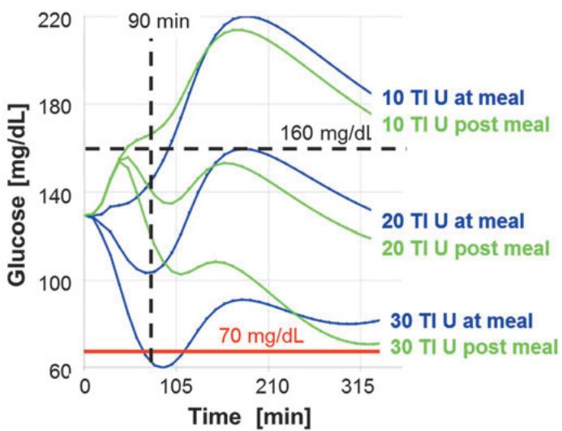

line

| Time [min] | 10 TI U at meal | 10 TI U post meal | 20 TI U at meal | 20 TI U post meal | 30 TI U at meal | 30 TI U post meal |
| ---------- | --------------- | ----------------- | --------------- | ----------------- | --------------- | ----------------- |
| 0          | 135             | 135               | 135             | 135               | 135             | 135               |
| 90         | 140             | 145               | 140             | 145               | 140             | 145               |
| 105        | 60              | 100               | 105             | 110               | 95              | 105               |
| 210        | 170             | 220               | 170             | 180               | 95              | 170               |
| 315        | 140             | 180               | 140             | 160               | 90              | 140               |

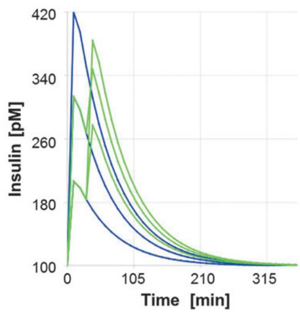

line

| Time [min] | Insulin [pM] (Blue) | Insulin [pM] (Green) |
| ---------- | ------------------- | -------------------- |
| 0          | 420                 | 350                  |
| 10         | 260                 | 300                  |
| 20         | 180                 | 240                  |
| 30         | 140                 | 180                  |
| 40         | 120                 | 160                  |
| 50         | 110                 | 140                  |
| 60         | 105                 | 120                  |
| 70         | 102                 | 110                  |
| 80         | 101                 | 105                  |
| 90         | 100                 | 102                  |
| 100        | 100                 | 101                  |
| 110        | 100                 | 100                  |
| 120        | 100                 | 100                  |
| 130        | 100                 | 100                  |
| 140        | 100                 | 100                  |
| 150        | 100                 | 100                  |

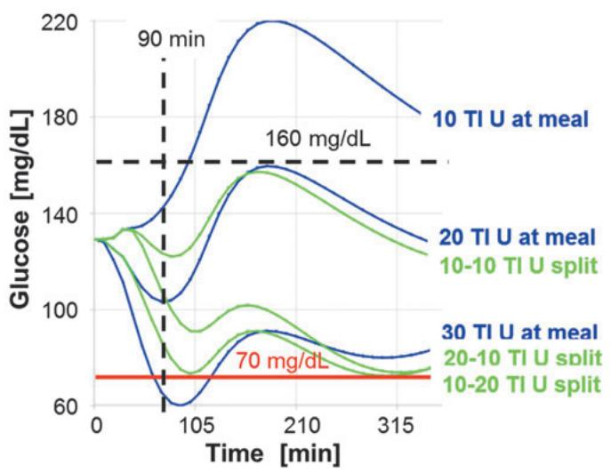

line

| Time [min] | 10 TI U at meal | 20 TI U at meal | 10-10 TI U split | 30 TI U at meal | 20-10 TI U split | 10-20 TI U split |
| ---------- | --------------- | --------------- | ---------------- | --------------- | ---------------- | ---------------- |
| 0          | 135             | 135             | 135              | 135             | 135              | 135              |
| 90         | 140             | 140             | 140              | 140             | 140              | 140              |
| 160        | 220             | 170             | 170              | 95              | 95               | 95               |
| 315        | 180             | 135             | 135              | 75              | 75               | 75               |

FIG. 3. Virtual uptitration for different dosing regimens of TI with simulated meal test in one illustrative in-silico subject. Upper panels: insulin (left) and glucose (right) in response to at-meal administration of four different dosages, shown in different colors. Middle panels: insulin (left) and glucose (right) in response to postmeal dosing (green lines) compared to at-meal dosing (blue lines). Lower panels: insulin (left) and glucose (right) in response to split dosing (green lines) compared to at-meal dosing (blue lines). Two scenarios for the 30 U split dose are shown for illustration.

appears to be longer than 6 h, leading—especially for larger doses—to a significant reduction of glucose late in the simulated glucose profile. In the example depicted in Figure 2, administration of the highest dose of 4 U can be expected to lead to a decline of glucose below 70 mg/dL indicating a risk for a late hypoglycemic event. In this virtual patient, a dose of 2–3 units appears to provide an optimal balance between postprandial glucose control and hypoglycemic risk.

# In-silico meal tests after treatment with TI

Simulations of uptitration for different dosing regimens of TI are shown in Figure 3 during a meal tolerance test for the same virtual patient, as shown in Figure 2. Increased doses lead to an increase in plasma insulin concentration and a lowering of postprandial glucose. Peak insulin concentration $\mathrm { ( T _ { m a x } ) } \ \bar { \sim } 1 5$ min) is reached earlier and returns to baseline faster than after subcutaneous administration of insulin lispro. With at-meal dosing (Fig. 3, top panels), the lowest dose of 10 U TI does not provide sufficient control of postprandial glucose, doses of 30 U TI or more generate a risk of hypoglycemia due to the fast appearance of plasma insulin and sharp early decrease in glucose concentration. The titration rule applied in the phase III study (NCT01445951) would have guided this patient to the 10 U TI dose because the postprandial glucose (PPG) at 90 min after dosing remains under the target of 160 mg/dL $\mathrm { ( P P G _ { 9 0 } < 1 6 0 m g / d L ) }$ . On average, glucose absorption from the meal is only 50% complete after 90 min, and so, testing at t = 90 min may be too soon after dosing. Any of the test times for PPG evaluated ‡120 min would have guided the patient to the 20 U TI dose, which balances postprandial glucose control and low risk for a hypoglycemic event much better.

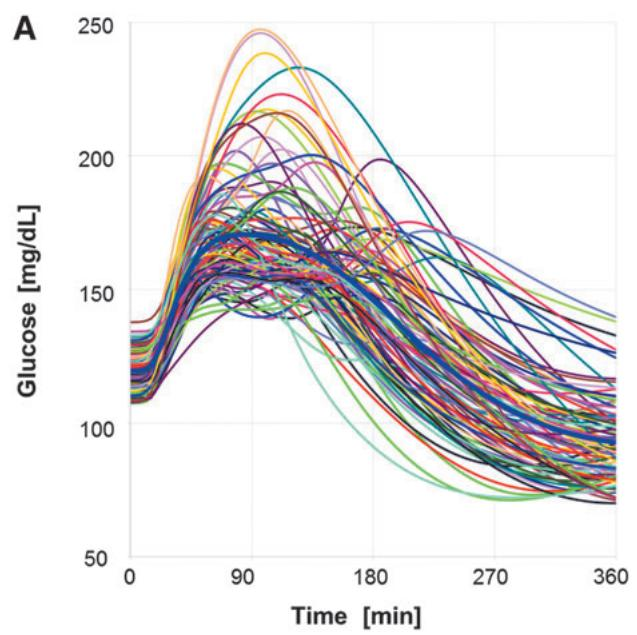

line

| Time [min] | Glucose [mg/dL] |
| ---------- | --------------- |
| 0          | ~120            |
| 90         | ~240            |
| 180        | ~200            |
| 270        | ~150            |
| 360        | ~100            |

FIG. 4. Glucose profiles of 100 virtual patients after in-silico meal test treated with insulin lispro. Each patient received an individualized insulin dose selected by a titration rule to target a glucose value of 160 mg/dL 120 min after start of the meal using at-meal dosing (A) or dosing 15 min before start of the meal (B). A comparison of the mean glucose profiles for at-meal dosing (blue) and premeal dosing (red) is shown in (C).

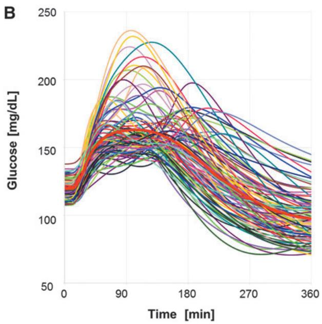

line

| Time [min] | Glucose [mg/dL] |
| ---------- | --------------- |
| 0          | ~120            |
| 90         | ~240            |
| 180        | ~180            |
| 270        | ~150            |
| 360        | ~100            |

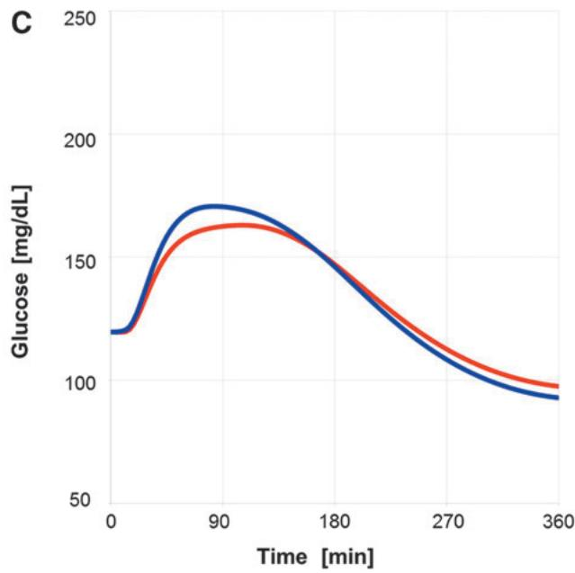

line

| Time [min] | Glucose [mg/dL] (Blue) | Glucose [mg/dL] (Red) |
| ---------- | ---------------------- | --------------------- |
| 0          | 120                    | 120                   |
| 90         | 170                    | 165                   |
| 180        | 150                    | 145                   |
| 270        | 110                    | 105                   |
| 360        | 95                     | 95                    |

A flatter profile with less PPG fluctuations can be obtained by giving the dose 30 min after start of the meal (Fig. 3, middle panels) or by splitting the TI dose into two portions, one administered directly at the start of the meal and one after the meal, for example, 30 min after start of the meal (Fig. 3, lower panels). In these cases, uptitration to higher total doses can be achieved, gaining additional efficacy in postprandial glucose control without inducing an increased risk of hypoglycemia. The rationale behind this is that, with TIs rapid onset of action dosing wholly or, in part, after the meal moves the onset of action of TI to the time when glucose is already appearing in the blood, thus reducing the early trough in PPG and its risk of early hypoglycemic events.

# Uptitration of insulin lispro and assessment of benefit and risk

Figure 4 shows the expected glucose profiles of the 100 virtual patients after receiving an isocaloric meal (50 g carbohydrates) and an individualized dose of insulin lispro at the meal (Fig. 4A) or 15 min before the start of the meal (Fig. 4B); the titration rule was $\mathrm { P P G } _ { 1 2 0 } \leq 1 6 0 \mathrm { m g / d L }$ . Several virtual patients did not reach the target value due to a hypoglycemic event (BG <70 mg/dL) in the virtual uptitration phase (at-meal dosing 45/100, premeal dosing 30/100). The average dose was 3.7 U, resulting in an expected average mean glucose over 6 h $( \mathrm { M P G } _ { 6 \mathrm { h } } )$ of 134 mg/dL. The average hyporisk across the virtual patients receiving their individualized dose is rather low with a mean LBGI value of 0.73 for at-meal dosing and of 0.55 for premeal dosing (with 2 or 1 virtual patients, respectively, having an LBGI value of >2.5 indicating a moderate risk for a hypoglycemic event). The complete assessment of the benefit and hypoglycemic risk of the treatment with insulin lispro (at-meal dosing or 15- min premeal dosing) is given in Table 2 in columns 1 and 2.

# Uptitration of TI insulin and assessment of benefit and risk

Figure 5A shows the simulated glucose profiles of the 100 virtual patients receiving an individualized dose of TI dose following the phase-III titration rule $( \mathrm { P P G } _ { 9 0 } < 1 6 0 \mathrm { m g } / \mathrm { d L } )$ . Across the 100 virtual patients, the average dose was 21.7 U TI, resulting in an average $\mathbf { M P G } _ { \mathrm { 6 h } }$ of 144 mg/dL (Table 2, third column). All but one patient could satisfy the glucose target of $\mathrm { P P G } _ { 9 0 } < 1 6 0 \mathrm { m g / d L }$ without a hypoglycemic event (BG ${ < } 7 0 \mathrm { m g / d L } )$ in the virtual uptitration phase. The average hyporisk across the virtual patients receiving their individualized TI dose is rather low with a mean LBGI value of 0.09 (no virtual patient having an LBGI value of >2.5) and is thus even lower than observed in patients dosed with insulin lispro.

# Optimal titration of TI insulin

It is evident from the glucose profiles in Figure 5A that for TI, the titration rule $\mathrm { P P G } _ { 9 0 } \leq 1 6 0 \mathrm { m g } / \mathrm { d L }$ does not guide the patients to their optimal individual dose. Simulations evaluating 20 titration rules for at-meal, postmeal, split dosing indicate that optimal dosing is achieved when glucose is tested at 150 min after the meal $( \mathrm { P P G } _ { 1 5 0 } )$ (reported in Supplementary Tables S1–S3; Supplementary Data are available at www.liebertonline.com/dia). The simulated glucose profiles obtained using an at-meal individualized dose based on $\mathrm { P P G } _ { 1 5 0 } < 1 6 0 \mathrm { m g / d L }$ are shown in Figure 5B. This titration rule produces slightly higher individual doses (mean at \*29 U TI vs. 22 U TI) and largely improved glycemic control and times in target range (Table 2, fourth column): mean $\mathrm { M P G } _ { \mathrm { 6 h } }$ decreases to 129 mg/dL, glucose fluctuation improves

Table 2. Assessment of Efficacy, Glucose Fluctuation, and Risk for Hypoglycemic Events for Insulin Lispro and Technosphere Insulin Across 100 Virtual Patients Derived from Expected Glucose Profiles After Isocaloric Meal 

<table><tr><td rowspan="2"></td><td colspan="2">Insulin Lispro</td><td colspan="4">TI</td></tr><tr><td>At-meal</td><td>Premeal</td><td>At-meal</td><td>At-meal</td><td>Postmeal</td><td>Split-dose</td></tr><tr><td colspan="7">Uptitration</td></tr><tr><td colspan="7">Titration rule</td></tr><tr><td>PPG test time (min)</td><td>120</td><td>120</td><td>90</td><td>150</td><td>150</td><td>150</td></tr><tr><td>PPG limit (mg/dL)</td><td>160</td><td>160</td><td>160</td><td>160</td><td>150</td><td>150</td></tr><tr><td>#VP-BG70, uptitration</td><td>45/100</td><td>30/100</td><td>1/100</td><td>3/100</td><td>4/100</td><td>5/100</td></tr><tr><td colspan="7">Results final dosing, mean (SD)</td></tr><tr><td>Dose (U) or (U TI)</td><td>3.7 (1.7)</td><td>3.7 (1.8)</td><td>21.7 (13.0)</td><td>29.4 (14.9)</td><td>31.1 (15.5)</td><td>31.7 (15.6)</td></tr><tr><td> $PPG_{2h}$  (mg/dL)</td><td>167 (23)</td><td>162 (20)</td><td>158 (15)</td><td>140 (13)</td><td>134 (14)</td><td>133 (16)</td></tr><tr><td> $MPG_{6h}$  (mg/dL)</td><td>134 (13)</td><td>134 (12)</td><td>144 (17)</td><td>129 (9)</td><td>126 (9)</td><td>124 (9)</td></tr><tr><td> $PPG_{AUC4h}$  (mg/dL·min)</td><td>36,000 (3400)</td><td>35,300 (3100)</td><td>35,400 (3400)</td><td>31,800 (2000)</td><td>31,600 (2100)</td><td>31,000 (2300)</td></tr><tr><td> $T_t$  (%)</td><td>93 (12)</td><td>95 (11)</td><td>91 (15)</td><td>99 (4)</td><td>100 (2)</td><td>100 (1)</td></tr><tr><td> $T_{tt}$  (%)</td><td>50 (13)</td><td>52 (15)</td><td>45 (26)</td><td>73 (19)</td><td>78 (18)</td><td>81 (18)</td></tr><tr><td>Hyporisk-LBGI, final dose</td><td>0.73 (0.71)</td><td>0.55 (0.65)</td><td>0.09 (0.29)</td><td>0.11 (0.26)</td><td>0.19 (0.46)</td><td>0.19 (0.47)</td></tr></table>

Individual dose for each patient has been identified using virtual uptitration following the given titration rule. The number of virtual patients with a blood glucose <70 mg/dL during uptitration is given as ‘‘#VP-BG70, uptitration.’’ For the resulting individualized dose, the mean value across 100 virtual patients is given (standard deviation in parenthesis). The risk for hypoglycemia for each treatment/dosing regimen aftervirtual uptitration is derived using an established metric, the ‘‘LBGI.’’14,15 The mean LBGI across all 100 virtual patients was calculated (‘‘hyporisk-LBGI, final dose’’). Tt and $\mathrm { T _ { t t } }$ describe the average time in the given glucose target range (average for 100 virtual patients). TI, Technosphere- insulin. VP, virtual patient.

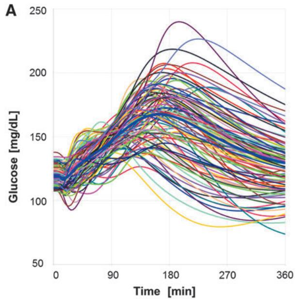

line

| Time [min] | Glucose [mg/dL] |
| ---------- | --------------- |
| 0          | ~100            |
| 90         | ~150            |
| 180        | ~240            |
| 270        | ~200            |
| 360        | ~150            |

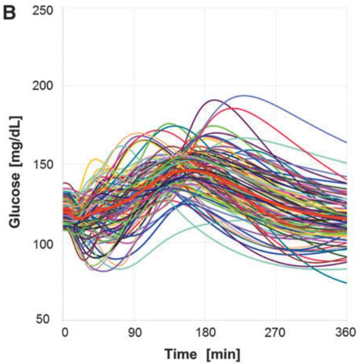

line

| Time [min] | Glucose [mg/dL] |
| ---------- | --------------- |
| 0          | ~120            |
| 90         | ~150            |
| 180        | ~180            |
| 270        | ~160            |
| 360        | ~140            |

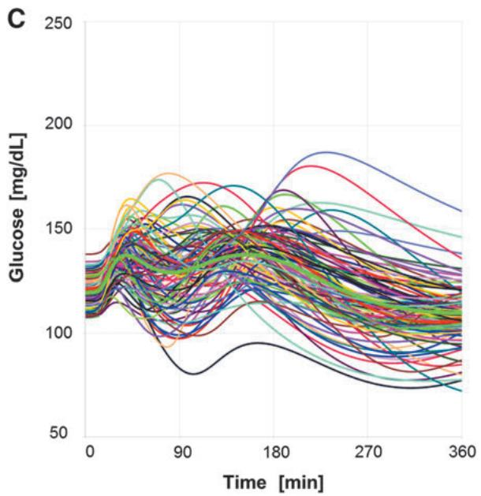

line

| Time [min] | Glucose [mg/dL] |
| ---------- | --------------- |
| 0          | ~130            |
| 90         | ~150            |
| 180        | ~180            |
| 270        | ~160            |
| 360        | ~140            |

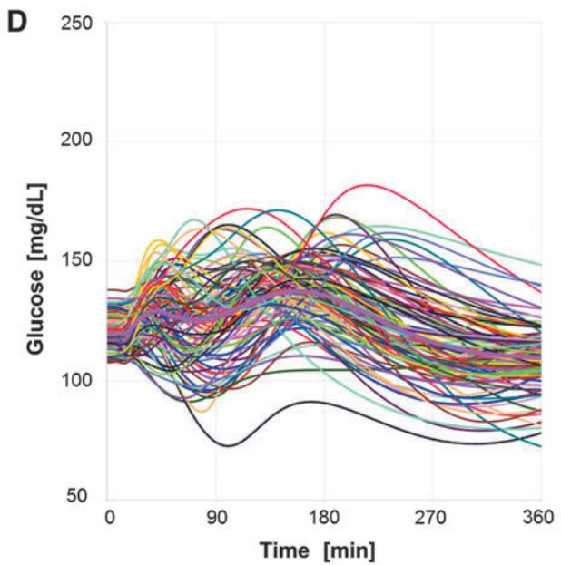

line

| Time [min] | Glucose [mg/dL] |
| ---------- | --------------- |
| 0          | ~120            |
| 90         | ~150            |
| 180        | ~180            |
| 270        | ~160            |
| 360        | ~140            |

FIG. 5. Glucose time courses obtained by simulating meal test in 100 virtual subjects receiving an individualized at-meal dose of TI selected by titration rule based on $\mathrm { P P G } _ { 9 0 } { < } 1 6 0$ mg/dL condition (A), or an individualized at-meal dose of TI selected by titration rule based on $\mathrm { P P G } _ { 1 5 0 } < 1 6 0$ mg/dL condition (B), or an individualized postmeal dose $( \Delta \mathfrak { t } = 1 5$ min) of TI selected by titration rule based on $\mathrm { P P G } _ { 1 5 0 } < 1 5 0$ mg/dL condition (C), or an individualized split dose $( \Delta \mathfrak { t } = 1 5$ min) of TI selected by titration rule based on $\mathrm { P P G } _ { 1 5 0 } < 1 5 0$ mg/dL condition (D). A comparison of the mean glucose profiles for at-meal targeting $\mathrm { P P G } _ { 9 0 } { < } 1 6 0 \mathrm { \bar { m g } / d L }$ (blue), for at-meal dosing targeting $\mathrm { \ P P G } _ { 1 5 0 } < \mathrm { \tilde { 1 6 0 } }$ mg/dL (red), postmeal dosing targeting $\mathrm { P P G } _ { 1 5 0 } < 1 5 0 \mathrm { m g } / \mathrm { d I }$ (green), and split dosing targeting $\mathrm { P P G } _ { 1 5 0 } < 1 5 0 \mathrm { \bar { m g } / d L }$ (magenta) is shown in (E). PPG, postprandial glucose.   
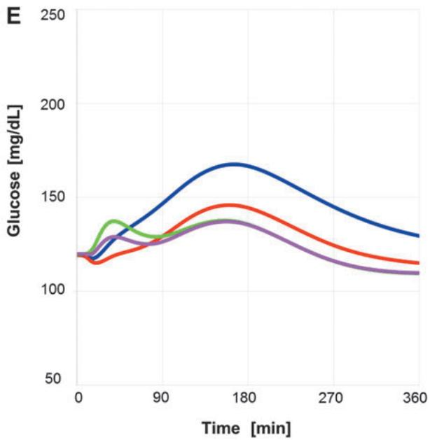

line

| Time [min] | Glucose [mg/dL] (Blue) | Glucose [mg/dL] (Red) | Glucose [mg/dL] (Green) | Glucose [mg/dL] (Purple) |
| ---------- | ---------------------- | --------------------- | ----------------------- | ------------------------ |
| 0          | 120                    | 115                   | 120                     | 120                      |
| 90         | 140                    | 130                   | 135                     | 125                      |
| 180        | 170                    | 145                   | 135                     | 135                      |
| 270        | 150                    | 130                   | 125                     | 120                      |
| 360        | 130                    | 115                   | 110                     | 110                      |

to 99% of time in the target range of 70–180 mg/dL (Tt) and 73% of time in the tight target range of 80–140 mg/dL $( \mathrm { T _ { t t } } )$ . The number of patients with BG <70 mg/dL is increased from 1 to 3 out of 100 during the uptitration phase, but is still significantly lower than the numbers observed under insulin lispro treatment (Table 2). Also, the average hyporisk across the virtual patients receiving their individualized higher TI dose following the adjusted titration rule is still rather low with a mean LBGI value of 0.11 and is thus still lower than observed in patients dosed with insulin lispro.

Regarding the postmeal (shift time 15 or 30 min after start of the meal) and split dosing (split time 15 or 30 min), the individualized doses to achieve the optimal benefit–risk ratio were based on the $\mathrm { P P G } _ { 1 5 0 }$ <150 mg/dL rule. In these dosing regimens, TI onset of action is moved to the time when glucose absorption has begun and the risk of early postprandial hypoglycemia can be reduced. The simulated postprandial glucose profiles for postmeal and split dosing (Fig. 5C, D, respectively) illustrate this reduced risk for early hypoglycemic events, and thus, a more stringent PPG target can be reached. The simulations suggest that patients receiving postmeal or split dosing will ultimately attain higher doses and better postprandial glucose control than those taking TI at the start of the meal (Table 2, fifth and sixth columns): $\mathrm { M P G } _ { \mathrm { 6 h } }$ is further reduced from 129 to 124– 126 mg/dL; time in tight target increases from 73% to 78%– 81%; a similar number of patients with BG <70 mg/dL during uptitration (three to four patients vs. three patients) and a mean LBGI of 0.19, thus a hyporisk in a similar range as for at-meal dosing.

Comparison of expected benefit and risk of TI versus sc. insulin lispro

Summary statistics of the individual glucose profiles for each treatment are compared in Table 2 and in Figure 6 for

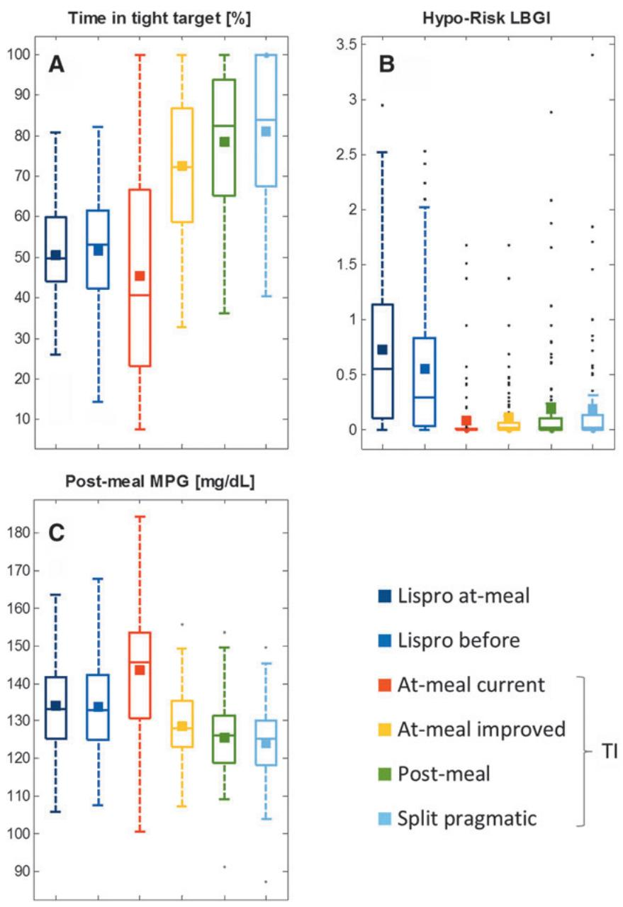  
FIG. 6. Outcome from in-silico meal tests summarizing expected differences of lispro versus TI treatment. The boxplots show the median and the variability in glucose fluctuation (A, time in tight target), hyporisk factor (B, low blood glucose index), and postprandial glucose (C, postprandial 6-h mean blood glucose); the mean of each distribution is shown as square.

Table 3. Expected Treatment Differences for Technosphere Insulin (Different Dosing Regimens/Titration Rules) Versus Insulin Lispro (At-Meal Dosing) 

<table><tr><td></td><td>At-meal PPG 90 min, 160 mg/dL</td><td>At-meal PPG 150 min, 160 mg/dL</td><td>Postmeal PPG 150 min, 150 mg/dL</td><td>Split dose PPG 150 min, 150 mg/dL</td></tr><tr><td> $\Delta MPG_{6h}$  (mg/dL) versus insulin lispro at-meal</td><td>10</td><td>-5</td><td>-8</td><td>-10</td></tr><tr><td>Expected  $\Delta MPG_{24h}$  (mg/dL) versus insulin lispro at-meal</td><td>7.5</td><td>-3.75</td><td>-6</td><td>-6.75</td></tr><tr><td>Expected  $\Delta HbA1c$  (%) versus insulin lispro at-meal</td><td>0.26</td><td>-0.13</td><td>-0.21</td><td>-0.26</td></tr><tr><td>Expected relative hyporisk versus insulin lispro</td><td>Much lower</td><td>Much lower</td><td>Lower</td><td>Lower</td></tr></table>

The predicted difference in $\mathrm { M P G } _ { \mathrm { 6 h } }$ results from a head-to-head comparison in 100 virtual type-1 patients. Differences in expected $\mathbf { M P G } _ { 6 \mathrm { h } }$ are translated into expected differences in $\mathbf { M P G } _ { 2 4 \mathrm { h } }$ by multiplication by a factor of 0.75, assuming a similar lowering of 6-h postprandial glucose for three meals a day (breakfast at 7 am, lunch at 1 pm, dinner at 7 pm) and an unchanged glucose during 1 am to 7 am. Expected $\mathbf { \check { M P G } } _ { 2 4 \mathrm { h } }$ differences are then translated into estimated HbA1c differences, assuming a linear correlation between average glucose over 24 h 24h and HbA1c with a slope of 28.7 mg/dL per 1% HbA1c.16,17 The assessment of relative hyporisk versus insulin lispro is derived using the $\mathrm { L B G I . } ^ { 1 4 , 1 5 }$ It was calculated from the simulated glucose profiles across 100 virtual patients, each receiving an individual dose after virtual uptitration following the given titration rule.

specific parameters capturing the expected treatment benefit on efficacy (postprandial 6h-MPG), glucose fluctuation (time in tight target $\mathrm { T _ { t t } } )$ , and risk for hypoglycemia (LBGI). The simulations indicate that the combination of at-meal dosing and current titration rule for TI does not provide the best possible postprandial glucose control, but is expected to cause fewer hypoglycemic events during the uptitration phase (virtual patients with BG <70 mg/dL) and during stable dosing (mean LBGI of glucose profiles for virtual patients receiving individualized dose) than SC lispro. These results are in accordance with the findings of phase III study in T1D (NCT01445951),5 where SC prandial insulin aspart was found to provide a slightly better control of HbA1c, but also a higher hypoglycemic event rate.

The simulations suggest that by adjusting the dosing regimen and titration rule, the benefit of TI treatment could be considerably improved while preserving the lower risk for hypoglycemic events of TI (Fig. 6). A head-to-head comparison of various TI dosing schemes against insulin lispro (Table 3) illustrates the potential for TI to provide superior postprandial glucose control $( \mathrm { M P G } _ { 6 \mathrm { h } } )$ while maintaining the hypoglycemia risk advantage.

# Discussion

A large percentage of patients with T1D are treated with multiple daily insulin injections. TI inhalation powder with its fast onset of action and shorter duration of action offers an alternative treatment option and novel opportunities for prandial glucose control. It can overcome the delayed onset of action inherent to the current SC injected insulin analogs, but introduces new challenges to cope with the duration of postprandial glucose elevation. Delayed or split dosing— instead of at-meal dosing—might lead to an overall improved glycemic control.

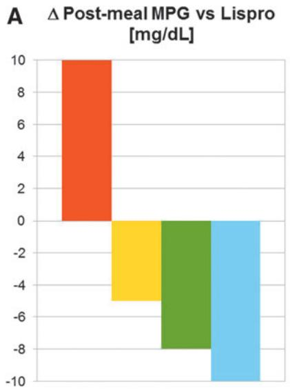

bar

Δ Post-meal MPG vs Lispro [mg/dL]
| Category | Post-meal MPG (mg/dL) |
|---|---|
| Orange Bar | 10 |
| Yellow Bar | -5 |
| Green Bar | -8 |
| Blue Bar | -10 |

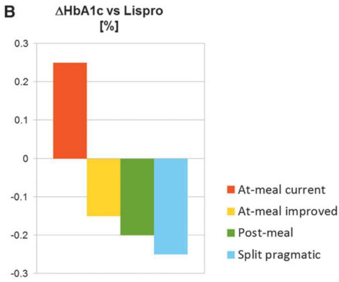

bar

| Category           | ΔHbA1c [%] |
| ------------------ | ---------- |
| At-meal current    | 0.25       |
| At-meal improved   | -0.15      |
| Post-meal          | -0.20      |
| Split pragmatic    | -0.25      |

FIG. 7. Expected benefit of TI treatment on prandial glucose (6-h MPG) versus treatment with insulin lispro at-meal dosing (A) and extrapolation of expected benefit on HbA1c (B). The prediction is based on the expected benefit of $\mathbf { M P G } _ { 2 4 \mathrm { h } }$ resulting from the in-silico meal test, which has been transformed into an expected HbA1c difference.

A clinical study to identify the optimal dosing regimen and the optimal titration rule would be prohibitively expensive because countless combinations would need to be tested. Thus, we have applied a cost-effective alternative and performed in-silico clinical trials using a validated T1D simulator that translates the known PK profile of TI (and insulin lispro as comparator) into the expected postprandial glucose response following a meal tolerance test. In-silico testing with the T1D simulator allowed for exploration of different dosing regimens and different titration rules to guide virtual patients to their individual TI dose. It also allowed the performance of TI to be benchmarked against standard SC insulin analogs.

The simulations suggest that postmeal dosing and split dosing of TI can provide a flatter postprandial glucose profile with lower fluctuation amplitudes than at-meal dosing. In several virtual patients, the flatter profile allows a higher dose without increasing the risk for hypoglycemic events. In addition, the simulations also reflect that selection of the right titration rule is crucial to achieve the optimal treatment benefit. Evaluations of simulated uptitrations using 20 titration rules (different combinations of times for postprandial glucose measurement and glucose target ranges) identified that the best time to measure PPG is 150 min after the meal and the upper threshold for the PPG target should be 150 to 160 mg/dL. Simulated meal tests using these optimized titration rules demonstrated that the efficacy of TI on postprandial glucose control can be considerably improved and can even outreach that of standard SC insulin analogs.

Results obtained for postmeal doses administered at t = 15 or 30 min after start of the meal were similar to each other; split dosing with 15 or 30 min split times also gave similar results to each other. In addition, simulations using hypercaloric meals with 80 g carbohydrate content (not reported) also support the findings from the isocaloric meal tests with 50 g carbohydrates. This suggests that the present results are robust with respect to the length and size of the meal.

The difference in 6-h postprandial glucose (TI treatment versus insulin lispro, Fig. 7A) can also be used to estimate the expected treatment difference in 24-h glycemic control (Table 3) and the corresponding difference in HbA1c. If the MPG6h results from the meal test simulations apply to the three main meals in a day and average glucose concentrations remain at the level of baseline for the remaining 6 h, the average 24-h glucose concentration can be calculated and the expected difference in HbA1c for different treatment arms applying different dosing regimens/titration rules can be estimated using an established correlation.16,17 When this algorithm is applied to compare the previously used TI dosing regimen against insulin lispro, the HbA1c levels of TI patients would be about 0.26% above that of insulin lispro patients (Fig. 7B). This is in the range previously reported in the phase-III study comparing TI against insulin aspart in T1D5 (DHbA1c 0.2% [0.08% to 0.38% with 95% confidence interval]). By adapting the dosing regimen and titration rule, however, an additional reduction of 0.5% in HbA1c could be achieved, suggesting that the optimal dosing of TI can be more efficacious than an SC-injected prandial insulin analog, while keeping a reduced risk of hypoglycemia. Clinical studies are currently planned to validate the results from these in-silico meal test simulations in T1D.

# Author Disclosure Statement

This work was supported by Sanofi-Aventis Deutschland (SAD). T.K., R.J., and R.D. are employees of SAD. A.B. is an employee of Sanofi US. M.G. is an employee at MannKind. C.D.M. and C.C. hold a pending patent on the simulation model. Technosphere and Afrezza are registered trademarks of MannKind Corporation.

# References

1. Morris A, Boyle DI, McMahon AD, et al.: Adherence to insulin treatment, glycaemic control, and ketoacidosis in insulin-dependent diabetes mellitus. The DARTS/MEMO Collaboration. Diabetes Audit and Research in Tayside Scotland. Medicines Monitoring Unit. Lancet 1997;350: 1505–1510.   
2. Leone-Bay A, Grant M: Technosphere/insulin: mimicking endogenous insulin release. In: Rathbone M, Hadgraft J, Roberts M, Lane M, eds. Modified-Release Drug Delivery Technology, Vol. 2, 2nd ed. New York: Informa Healthcare USA, Inc., 2008, pp. 673–679.   
3. Boss AH, Petrucci R, Lorber D: Coverage of prandial insulin requirements by means of an ultra-rapid-acting inhaled insulin. J Diabetes Sci Technol 2012;6:773–779.   
4. Richardson PC, Boss AH: Technosphere insulin technology. Diabetes Technol Ther 2007;9(Suppl. 1):S65–S72   
5. Bode BW, McGill JB, Lorber DL, et al.; Affinity 1 Study Group: Inhaled technosphere insulin compared with injected prandial insulin in type 1 diabetes: a randomized 24- week trial. Diabetes Care 2015;38:2266–2273.   
6. Kovatchev BP, Breton M, Dalla Man C, Cobelli C: In silico preclinical trials: a proof of concept in closed-loop control of type 1 diabetes. J Diabetes Sci Technol 2009;3: 44–55.   
7. Dalla Man C, Micheletto F, Lv D, et al.: The UVA/ PADOVA type 1 diabetes simulator: new features. J Diabetes Sci Technol 2014;8:26–34.   
8. Visentin R, Klabunde T, Grant M, et al.: Incorporation of inhaled insulin into the FDA accepted University of Virginia/Padova Type 1 Diabetes Simulator. Conf Proc IEEE Eng Med Biol Soc 2015;2015:3250–3253.   
9. Visentin R, Dalla Man C, Kovatchev B, Cobelli C: The University of Virginia/Padova type 1 diabetes simulator matches the glucose traces of a clinical trial. Diabetes Technol Ther 2014;16:428–434.   
10. Dalla Man C, Raimondo DM, Rizza RA, Cobelli C: GIM, simulation software of meal glucose-insulin model. J Diabetes Sci Technol 2007;1:323–330.   
11. Potocka E, Baughman RA, Derendorf H: Population pharmacokinetic model of human insulin following different routes of administration. J Clin Pharmacol 2011;51: 1015–1024.   
12. Ferrannini E, Cobelli C: The kinetics of insulin in man. I. General aspects. Diabetes Metab Rev 1987;3:335–363.   
13. Toffolo G, Campioni, Basu R, et al.: A minimal model of insulin secretion and kinetics to assess hepatic insulin extraction. Am J Physiol Endocrinol Metab 2006;290:E169– E176.   
14. Kovatchev BP, Cox DJ, Gonder-Frederick LA, et al.: Assessment of risk for severe hypoglycemia among adults with IDDM: validation of the low blood glucose index. Diabetes Care 1998;21:1870–1875.   
15. Kovatechev PB, Straume M, Cox DJ, Farhy LS: Risk analysis of blood glucose data: a quantitative approach to

optimizing the control of insulin dependent diabetes. J Theor Med 2000; 3:1–10.   
16. Nathan DM, Kuennen J, Borg R, et al.: Translating the A1C assay into estimated average glucose values. Diabetes Care 2008;31:1473–1478.   
17. Moller JB, Kristensen NR, Klim S, et al.: Methods for predicting diabetes phase III efficacy outcome from early data: superior performance obtained using longitudinal approaches. CPT Pharmacometrics Syst Pharmacol 2014;3:e122.

Address correspondence to:

Thomas Klabunde, PhD

Sanofi-Aventis Deutschland GmbH

Industriepark Ho¨chst, Building H831

Frankfurt am Main D-65926

E-mail: thomas.klabunde@sanofi.com