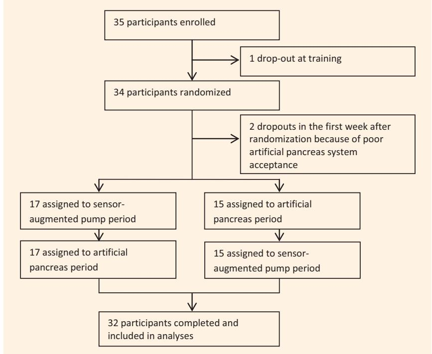
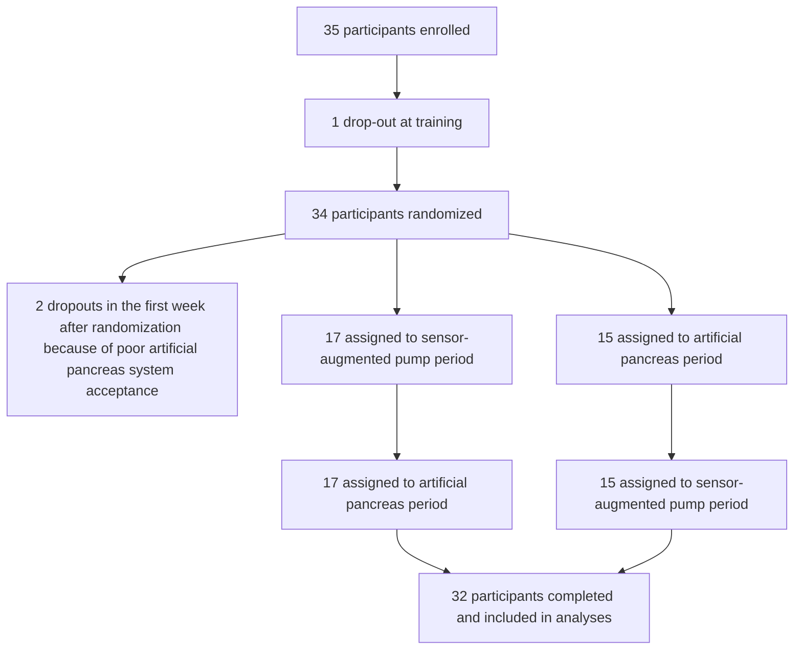
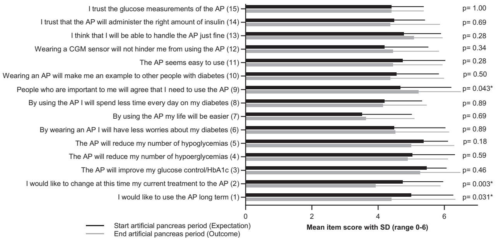

# Research: Educational and Psychological Aspects Psychological outcomes of evening and night closed-loop insulin delivery under free living conditions in people with Type 1 diabetes: a 2-month randomized crossover trial

J. Kropff1 , J. DeJong1 , S. del Favero2 , J. Place3 , M. Messori4 , B. Coestier3 , A. Farret3 , F. Boscari5 , S. Galasso5 , A. Avogaro5 , D. Bruttomesso5 , C. Cobelli2 , E. Renard3 , L. Magni4 , J. H. DeVries1 and the AP@home consortium

1 Internal Medicine F4-222, Academic Medical Centre, Amsterdam, The Netherlands, 2 Information Engineering, University of Padova, Padova, 3 Endocrinology, Diabetes, Nutrition, Montpellier University Hospital, Montpellier, France, 4 Civil Engineering and Architecture, University of Pavia, Pavia, and 5 Internal Medicine, University of Padova, Padova, Italy

Accepted 27 September 2016

# Abstract

Aim To assess the impact on fear of hypoglycaemia and treatment satisfaction with an artificial pancreas system used for 2 consecutive months, as well as participant acceptance of the artificial pancreas system.

Methods In a randomized crossover trial patient-related outcomes associated with an evening-and-night artificial pancreas and sensor-augmented pump therapy were compared. Both intervention periods lasted 8 weeks. The artificial pancreas acceptance questionnaire (range 0–90, higher scores better), Hypoglycaemia Fear Survey II (range 0–72, higher scores worse) and Diabetes Treatment Satisfaction Questionnaire (range 0–36, higher scores better) were completed by 32 participants. Semi-structured interviews were conducted after study completion in a subset of six participants. Outcomes were compared using a repeated-measures ANOVA model or paired t-test when appropriate.

Results The total artificial pancreas acceptance questionnaire score at the end of the artificial pancreas period was 69.1 (SD 14.7; 95% CI 63.5, 74.7), indicating a positive attitude towards the artificial pancreas. No significant differences were found among the scores at baseline, end of sensor-augmented pump therapy period or end of the artificial pancreas period with regard to fear of hypoglycaemia [28.2 (SD 17.5), 23.5 (SD 16.6) and 23.5 (SD 16.7), respectively; P = 0.099] or diabetes treatment satisfaction [29.0 (SD 3.9), 28.2 (SD 5.2) and 28.0 (SD 7.1), respectively; P = 0.43]. Themes frequently mentioned in the interviews were ‘positive effects at work’, ‘improved blood glucose’, ‘fewer worries about blood glucose’, but also ‘frequent alarms’, ‘technological issues’ and ‘demand for an all-in-one device’.

Conclusions The psychological outcomes of artificial pancreas and sensor-augmented pump therapy were similar. Current artificial pancreas technology is promising but user concerns should be taken into account to ensure utility of these systems.

Diabet. Med. 34, 262–271 (2017)

# Introduction

Artificial pancreas systems are capable of automating glucose regulation through real-time glucose monitoring, algorithms for glucose control and insulin infusion. In the past few years Correspondence to: Jort Kropff. E-mail: j.kropff@amc.nl This is an open access article under the terms of the Creative Commons Attribution-NonCommercial License, which permits use, distribution and reproduction in any medium, provided the original work is properly cited and is not used for commercial purposes.

artificial pancreas technology has developed rapidly. Several authors reported improved mean glucose and reduced time spent in hypo- and hyperglycaemia in longer-term studies using wearable artificial pancreas systems under real-life conditions at home [1–3]. These results are promising but even highly efficacious devices will not reach the expected clinical outcomes if they are used infrequently because of poor patient acceptance [4]. Patient-related outcome measures should be taken into account to realize the full potential of this technology [5].

# What’s new?

• To our knowledge this is the first study to examine the treatment satisfaction and acceptance of an artificial pancreas system using validated questionnaires and semi-structured interviews in a long- term, randomized crossover trial in people with Type 1 diabetes.   
• Although participant acceptance of the artificial pancreas was high, no improvement in treatment satisfaction was found compared with sensor-augmented pump therapy. Participants appear to appreciate the positive effects on glucose regulation but technical errors and reduced usability diminish their appreciation for the system.   
• Our results provide further insight into patient acceptance of current artificial pancreas technology and signifies the need for further development of the technology before commercialization.

Previous studies have shown high future acceptance of the artificial pancreas by participants when asked to report their preferences based on a ‘paper case description‘ [6,7]. Ziegler et al. [8] also reported high satisfaction, less worry about hypoglycaemia and increased perceived ease of use after participants had experienced 4 nights’ use of an artificial pancreas system at home [8]; however, only moderately positive acceptance was reported after 4-week real-life night use of the technology [9]. This shows that perception of artificial pancreas acceptance might differ between shortand long-term use, and that it is key to understanding the impact of artificial pancreas use over the longer term in a similar environment to that in which the artificial pancreas can be expected to be used in the future.

We recently reported the results of a multinational, multicentre, long-term, randomized crossover artificial pancreas trial in people with Type 1 diabetes, showing improved time spent with glucose levels in target through reduction of both time spent in hypoglycaemia and hyperglycaemia with the artificial pancreas compared with sensor-augmented pump therapy [1]. The artificial pancreas was used during the evening and night period. In the present paper, we report on a substudy aiming to determine the impact of the current artificial pancreas prototype compared with sensor-augmented pump therapy on treatment satisfaction and fear of hypoglycaemia. In addition, acceptance of the artificial pancreas technology was studied. Semi-structured interviews were performed to provide further insight into participant acceptance of current artificial pancreas technology and to inform future development of artificial pancreas technology.

# Methods

The main study results and methodology have been reported previously (ClinicalTrials.gov number NCT02153190) [1]. In short, participants from three sites in Montpellier, France, Padua, Italy and Amsterdam, the Netherlands were randomly assigned to receive 8 weeks of evening-and-night closed-loop glucose control using an artificial pancreas (artificial pancreas period) and then 8 weeks of insulin pump with continuous glucose monitoring (sensor-augmented pump period) or vice versa. During the daytime participants randomized to the artificial pancreas period used sensoraugmented pump therapy with their artificial pancreas switched off. Both intervention periods were separated by a 4-week washout-period to minimize carry-over effects. A further description of the artificial pancreas system can be found in Appendix S1. Adults with Type 1 diabetes and an HbA level of 58–86 mmol/mol (7.5–10.0%) were included, people with one or more episodes of severe hypoglycaemia in the last year or ketoacidosis in the last 6 months were excluded from participation for safety reasons. The study protocol was approved by the local ethics committee for each participating study site.

# Patient-reported outcomes

Three self-report questionnaires were used to determine the perspective of people with diabetes on artificial pancreas technology: the Hypoglycaemia Fear Survey II (HFS-II); the Diabetes Treatment Satisfaction Questionnaire standard/ change versions (DTSQs/c); and the artificial pancreas acceptance questionnaire [10,11]. The DTSQs/c versions were administered to account for any ceiling effect. The DTSQs and HFS-II were filled in at the first visit and last visit of both study periods while the DTSQc was filled in at the last visit of both periods. The artificial pancreas questionnaire was filled in at first and last visit of the artificial pancreas period only.

The HFS-II was designed to measure the degree of anxiety associated with (anticipated) hypoglycaemia in adults with Type 1 diabetes [10]. The 33-item questionnaire (range 0–4 per item, Cronbach’s a 0.90) comprises two subscales, a behaviour scale and a worry scale. The behaviour scale (Cronbach’s a 0.60) assesses the extent to which people with diabetes engage in active or passive hypoglycaemia-avoidant behaviours (e.g. proactive snacking), the worry subscale (Cronbach’s a 0.89) taps into their worries and fears related to hypoglycaemia (e.g. about losing consciousness in public). HFS-II sum scores are calculated for the total scale (33 items, range 0–132 points), behaviour scale (15 items, range 0–60 points) and worry scale (18 items, range 0–72 points). Validated Dutch, French and Italian versions were used [12]. A higher score indicates higher fear of hypoglycaemia. The DTSQs (Cronbach’s a 0.79) was developed to measure diabetes treatment satisfaction [11]. The DTSQs consists of eight items with a scoring range of 0–6 points, two of which do not pertain to satisfaction but rather perceived frequency hypoglycaemia and hyperglycaemia (range 0–6) and are therefore analysed separately [11]. The DTSQc is similar to the DTSQs, but rather than asking about current treatment satisfaction, participants are asked to compare their current treatment satisfaction with that of the treatment prior to the current intervention. DTSQc items are scored 3 to 3, and were multiplied by two afterwards for ease of comparability between the DTSQc and DTSQs. DTSQs and DTSQc total scores (range 0–36 and 36 to 36) is calculated by the sumscore of items 1 and 4–7. A higher score indicates higher treatment satisfaction. Validated Dutch, French and Italian versions were used [11]. The artificial pancreas questionnaire (Cronbach’s a 0.91) was developed based on the technology acceptance model [7], comprising four themes: perceived usefulness, perceived ease of use, intention to use and trust, distributed over 15 questions, with a scoring range of 0–6 per item. A higher total score indicates higher artificial pancreas acceptance (range 0–90). The artificial pancreas questionnaire was translated for this study into Italian and French using a forward-back translation procedure [7]. The questionnaire is available on request in Dutch, English, French, German and Italian [7].

# Semi-structured interviews

After completion of both study arms of the main study, participants from the clinical site in the Netherlands were invited to participate in a semi-structured interview. These interviews, based on the technology assessment model [7], were performed face-to-face or by telephone, according to the participants’ availability. Interviews were performed until no new information or themes were observed in the data and ‘saturation’ was reached. An overview of the methods used to develop the semi-structured interviews is given in Appendix S1.

# Outcomes

Outcome measures were HFS-II total scores, HFS-II behaviour and worry subscores and the DTSQs/c-scores and the artificial pancreas questionnaire total scores. Secondary outcomes were participants’ motivations and comments on the artificial pancreas, gathered by semi-structured interviews.

# Statistical methods

Missing data from the HFS-II and DTSQs/c were handled as instructed in the questionnaire guidelines. For the artificial pancreas questionnaire any questionnaires with missing data were discarded. Normality of data distribution was visually assessed. Baseline scores and end scores for the artificial pancreas period and sensor-augmented pump period were calculated and compared using a repeated-measures ANOVA model using paired data only. A multilevel ANOVA model including ‘study site’ as a covariate was performed to assess between-site differences. A paired t-test was used for comparison of DTSQc scores. P values < 0.05 were taken to indicate statistical significance. SPSS software (IBM Inc. New York, USA, version 22) was used for data analyses.

# Results

Figure 1 provides a trial profile. A total of 35 eligible participants were enrolled. One participant dropped out before and two just after randomization as a result of poor artificial pancreas acceptance by the participants. Thus, data from a total of 32 participants were available for analyses, of whom 18 were women. Their mean age was 47 years and mean diabetes duration 29 years (Table 1). Before being enrolled in the present study, 14 participants had taken part in one or more previous artificial pancreas studies.

# Questionnaire data

The main findings from the questionnaire data can be found in Table 2. The mean treatment satisfaction score (DTSQs/c) was equally positive for the use of the artificial pancreas and sensor-augmented pump therapy compared with baseline, and no significant difference was found between the treatment modes. There was no significant difference between the treatment groups or compared with baseline for either treatment group in perceived hyper- and hypoglycaemia frequency (item 2 and 3 of the DTSQs).

A numerical, but non-significant reduction of fear of hypoglycaemia (HFS-II total, worry scale and behaviour scale) for both interventions compared with baseline was found, with no difference between the two treatment groups (HFS-II total score: baseline 28.2 vs control: 23.5 and artificial pancreas: 23.5; P = 0.099).

The total artificial pancreas questionnaire end score was 68.1 [SD 14.7 (95% CI 62.5, 73.7); 75.7% of maximum score], indicating a positive attitude towards the artificial pancreas (good acceptance). There was no significant difference among any of the artificial pancreas questionnaire subtheme scores (trust, perceived ease of use, perceived usefulness, intention of use), nor was there a significant difference between artificial pancreas acceptance at the start and the end of the study periods [69.6 vs 68.1 (95% CI of D 0.2; 0.4); P = 0.65]. Figure 2 provides the artificial pancreas questionnaire item scores. Participants expected the artificial pancreas to improve their HbA (item 3, score 5.3) and expected to be able to handle the artificial pancreas well (item 13, score 5.1). Participants scored numerically lower on whether they wanted to switch to the artificial pancreas for their current treatment (item 2, score 3.9) and whether their life would be easier by using the artificial pancreas (item 7, score 3.6) and whether they spent less time on their diabetes treatment (item 8, score 4.2). There was a significant decrease between the willingness to change to the artificial pancreas before and after the artificial pancreas period (score 5.0 vs 4.4; P = 0.003) and the willingness to use the artificial pancreas in the long term (score 5.0 vs 4.4; P = 0.031). There was a significant increase in the attributed importance of using the artificial pancreas by people who were important to the participant before and after the artificial pancreas period (4.7 vs 5.2; P = 0.043). Appendix S1 provides further information on the artificial pancreas questionnaire and a graphical representation of the mean scores per questionnaire subscore. Study site did not significantly affect study outcomes.

flowchart

FIGURE 1 Study flow chart.

Table 1 Participant baseline characteristics (N = 32) 

<table><tr><td colspan="2">Variable</td></tr><tr><td>Mean (sd) age, years</td><td>47.0 (11.2)</td></tr><tr><td>Women, n (%)</td><td>18 (56.3)</td></tr><tr><td>Mean (sd) BMI, kg/m2</td><td>25.1 (3.5)</td></tr><tr><td>Mean (sd) HbA1c mmol/mol</td><td>66 (5)</td></tr><tr><td>%</td><td>8.2 (0.6)</td></tr><tr><td>Mean (sd) diabetes duration, years</td><td>28.6 (10.8)</td></tr><tr><td>Insulin pump use before study, n (%)</td><td>32 (100)</td></tr><tr><td>Median (IQR) pump treatment duration, years</td><td>10.2 (13.1)</td></tr><tr><td>Median (IQR) total daily insulin, U/kg/day</td><td>0.5 (0.2)</td></tr><tr><td>Previous participation in artificial pancreas study, n (%)</td><td>14 (43.8)</td></tr></table>

IQR, interquartile range.

# Interview results

The main findings from the interviews are given per theme, as defined in the technology assessment model in Table 3. Six participants were interviewed until data saturation was reached.

# Trust

Most participants said they trusted the device, but not fully or without double checking its actions. Participants did not perceive themselves to be handing over control to the device, although in general the concept of handing over control was not perceived as a problem.

# Perceived usefulness

Half of the participants indicated that the artificial pancreas had a positive effect on their activities, mainly because they did not have to worry about their glucose control. Participants who exercised regularly reported a negative effect on their ability to exercise because of frequent alarms and the inability to elevate their glucose level before starting exercise by diminishing insulin administration as they would regularly do. Five out of six participants reported sleep interrupted by the alarms and frequent buzzing of the insulin pump, the sixth participant was only troubled by the bulkiness of the device during sleep. In four out of six participants, family and friends were enthusiastic about the new device and backed the participants, but three participants also reported friends or family worried about meddling with technology and episodes of hypoglycaemia. Five out of six participants described better glucose control, although sometimes only minor improvements were reported.

Table 2 Changes in hypoglycaemia fear, diabetes treatment satisfaction and artificial pancreas acceptance by study condition 

<table><tr><td rowspan="2">Score</td><td colspan="3">Hypoglycaemia Fear</td><td colspan="3">Diabetes Treatment Satisfaction</td></tr><tr><td>Total (n = 27)</td><td>Behaviour (n = 31)</td><td>Worry (n = 27)</td><td>DTSQs (n = 30)</td><td>Hypoglycaemia (n = 30)</td><td>Hyperglycaemia (n = 30)</td></tr><tr><td colspan="7"> $Baseline^{\alpha}$ </td></tr><tr><td>Mean (sd; 95% CI)</td><td>28.2 (17.5; 21.3 to 35.2)</td><td>14.0 (7.6; 11.2 to 16.7)</td><td>14.9 (11.8; 10.2 to 19.6)</td><td>29.0 (3.9; 27.5 to 30.4)</td><td>2.6 (1.5; 2.0 to 3.1)</td><td>3.1 (1.5; 2.6 to 3.7)</td></tr><tr><td>% of maximum score</td><td>21.4</td><td>23.3</td><td>20.7</td><td>80.6</td><td>42.8</td><td>52.2</td></tr><tr><td colspan="7"> $Control^{\beta}$ </td></tr><tr><td>Mean (sd; 95% CI)</td><td>23.5 (16.6; 16.9 to 30.0)</td><td>12.4 (7.8; 9.6 to 15.2)</td><td>11.6 (9.9; 7.6 to 15.5)</td><td>28.2 (5.2; 26.2 to 30.1)</td><td>2.5 (1.3; 2.0 to 3.0)</td><td>2.9 (1.4; 2.4 to 3.4)</td></tr><tr><td>% of maximum score</td><td>17.8</td><td>20.7</td><td>16.1</td><td>78.3</td><td>42.2</td><td>48.3</td></tr><tr><td colspan="7"> $Artificial\ Pancreas^{\gamma}$ </td></tr><tr><td>Mean (sd; 95% CI)</td><td>23.5 (16.7; 16.9 to 30.1)</td><td>12.2 (8.1; 9.2 to 15.2)</td><td>11.7 (10.1; 7.7 to 15.7)</td><td>28.0 (7.1; 25.4 to 30.7)</td><td>2.5 (1.5; 1.9 to 3.1)</td><td>3.1 (1.4; 2.5 to 3.6)</td></tr><tr><td>% of maximum score</td><td>17.8</td><td>20.3</td><td>16.2</td><td>77.8</td><td>41.7</td><td>51.1</td></tr><tr><td>Analyses</td><td>α-β-γ;P = 0.099</td><td>α-β-γ;P = 0.27</td><td>α-β-γ;P = 0.074</td><td>α-β-γ;P = 0.43</td><td>α-β-γ;P = 0.91</td><td>α-β-γ;P = 0.49</td></tr></table>

DTSQs/c, Diabetes Treatment Satisfaction Questionnaire change/standard version; HFS-II, Hypoglycaemia Fear Survey II. Changes in hypoglycaemia fear (HFS-II), diabetes treatment satisfaction (DTSQ) and artificial pancreas acceptance are given by study condition. Mean total summed scores are given for each outcome. A repeated-measures ANOVA model was used for comparison of baseline, sensor-augmented pump (control) and artificial pancreas (intervention) scores for HFS-II and DTSQs. A paired t-test was used for comparison of DTSQc scores and artificial pancreas questionnaire scores. P < 0.05 is indicated with an asterisk (\*). The HFS-II consists of a total score, a worry and behaviour score. A lower score equals less fear of hypoglycaemia. The DTSQ consists of a standard version (DTSQs), a change version (DTSQc) and two subscores. For the main score (DTSQs-total DTSQc-total) a higher score indicates higher treatment satisfaction. For the subscores, a higher score indicates higher perceived frequency of hypoglycaemic episodes and higher perceived frequency of hyperglycaemic episodes, respectively.

# Perceived ease of use

There were no reported problems with the actual handling of the devices that constituted the artificial pancreas system. One participant reported that counting carbohydrates was a problem and all participants commented about technological problems, such as frequent loss of connectivity and pump catheter problems.

# Intention to use

No one would want to switch their current treatment for the artificial pancreas as it is now. Technical problems were the main reason not wanting to switch yet. Most participants reported they wanted to try the artificial pancreas again as soon as further development had taken place.

When asked about the ideal system configuration, all participants mentioned that they would like to see the number of devices reduced. Two participants also reported they would like to have an easier way to count carbohydrates.

# Discussion

Patient acceptance of artificial pancreas technology is crucial to the realization of its benefits [5]. To date, assessment of psychosocial factors of the artificial pancreas indicates that, overall, acceptance of the artificial pancreas is good, achieving 75.7% of full acceptance (actual/maximum artificial pancreas questionnaire total score). Compared with previous ‘paper case studies’, the present study showed a lower ‘intention to use’ the artificial pancreas system (70 vs about 85% of artificial pancreas questionnaire theme ‘intention to use’ maximum score) [6,7]. Also no significant improvements in patient-related outcome measures were found vs the comparator (sensor-augmented pump). This is consistent with previous results by Barnard et al. [9] who reported on a 4-week artificial pancreas study using a different artificial pancreas system [9]. Reduced ‘intention to use’ and no improvement over sensor-augmented pump therapy might be a consequence of the developmental stage of the product, including frequent technical errors and reduced ease of use compared with the CGM and insulin pump used in this study, which were at the grade of commercial products. Participants appear to appreciate the positive effects of the artificial pancreas on glucose regulation, but technical errors and reduced usability diminish their appreciation for the system [9]. This was supported by the results of the artificial pancreas questionnaire, showing numerically lower scores on whether ‘patients wanted to switch the artificial pancreas for their current treatment’ (item 2), whether ‘their life would be easier by using the artificial pancreas’ (item 7) and whether ‘they spent less time on their diabetes treatment’ (item 8), together with a higher score on whether ‘they expect to achieve better HbA1c values’ (item 3). Participants seemed to like the idea and functions of the device, but were not yet convinced by the device as it stands. This was also emphasized in the interviews, where participants reported connectivity problems, but at the same time were mostly enthusiastic about their glucose control and the idea of a ‘machine’ controlling their diabetes with less input needed. Also the need for fewer devices with better connectivity was vocalized by our participants. These results signify the importance of using artificial pancreas acceptance information to guide future development of the technology, and the importance of ‘real-life’ assessments [6,7].

<table><tr><td colspan="3"></td><td colspan="5">Artificial Pancreas Questionnaire</td></tr><tr><td>DTSQ change (n = 29)</td><td>Hypoglycaemia change (n = 31)</td><td>Hyperglycamia change (n = 31)</td><td>Total (n = 27)</td><td>Trust (n = 30)</td><td>Perceived ease of use (n = 30)</td><td>Perceived usefulness (n = 28)</td><td>Intention to use (n = 29)</td></tr><tr><td>NA</td><td>NA</td><td>NA</td><td>69.6 (10.4; 65.7 to 73.5)</td><td>9.0 (1.8; 8.4 to 9.7)</td><td>9.1 (2.1; 8.3 to 9.9)</td><td>42.3 (6.3; 39.9 to 44.7)</td><td>9.8 (2.35; 8.9 to 10.7)</td></tr><tr><td>NA</td><td>NA</td><td>NA</td><td>77.3</td><td>75.0</td><td>75.8</td><td>78.3</td><td>81.7</td></tr><tr><td>3.6 (1.7; 3.0 to 4.2)</td><td>-0.1 (2.8; -1.2 to 0.9)</td><td>-0.9 (3.2; -2.1 to 0.3)</td><td>NA</td><td>NA</td><td>NA</td><td>NA</td><td>NA</td></tr><tr><td>60.0</td><td>-1.7</td><td>-15.0</td><td>NA</td><td>NA</td><td>NA</td><td>NA</td><td>NA</td></tr><tr><td>3.3 (2.6; 2.3 to 4.3)</td><td>-0.9 (3.0; -2.0; 0.2)</td><td>-0.4 (3.3; -1.6; 0.8)</td><td>68.1 (62.5 to 73.7)</td><td>8.9 (6.1 to 11.7)</td><td>9.6 (2.0; 8.8 to 10.4)</td><td>41.8 (8.8; 39.4 to 442)</td><td>8.2 (3.9; 6.7 to 9.7)</td></tr><tr><td>55.0</td><td>-15</td><td>-6.7</td><td>75.7</td><td>74.2</td><td>80.0</td><td>77.4</td><td>68.3</td></tr><tr><td>β-γ;P = 0.49</td><td>β-γ;P = 0.51</td><td>α-β-γ;P = 0.91</td><td>α-γP = 0.72</td><td>α-γP = 0.72</td><td>α-γP = 0.22</td><td>α-γP = 0.73</td><td>α-γP = 0.008*</td></tr></table>

In our view, most benefit of using an artificial pancreas system can be achieved in the relatively safe home environment during the evening and night period; therefore, the artificial pancreas was used during the evening-and-night period only. As such, the present results cannot be directly translated to day-and-night artificial pancreas use. Another limitation is the fact that only a small Dutch subset of participants was interviewed; nevertheless, there was no indication of relevant differences in outcomes of the questionnaires between countries. Finally, probable selection bias should be taken into consideration when interpreting these results, as the selected participants would be expected to have been more motivated to use diabetes technology than the average person with diabetes. In other words, acceptance of the system might be lower than was found among the participants of the present study. A strength of the study was the multinational study set-up, the long study duration and assessment of psychosocial aspects of artificial pancreas based on actual experience rather than a paper sketch of an artificial pancreas. The interviews provide additional information for the interpretation of the questionnaire-based results. The current detailed description of psychosocial factors of the artificial pancreas in a long-term study provides valuable new insights to further improve the artificial pancreas systems currently under development.

We can conclude that the artificial pancreas is ready for reallife testing, but technological issues need to be fixed and further development will have to take place before it will be fully acceptable for people with diabetes and thus can be commercialized. There appears to be a general consensus that people with diabetes would like a small, all-in-one,

Table 3 Interview quotes from six participants according to technology assessment model theme 

<table><tr><td>Themes</td><td>ID</td><td>Response</td></tr><tr><td rowspan="6">Trust</td><td>1</td><td>‘I had to get used to ‘handing over’ control, I’m not much of a technical person, so I found it a bit tricky to leave everything to a machine, but that made it exciting too..’‘the device seemed trustworthy’</td></tr><tr><td>2</td><td>‘I have never been worried about nocturnal hypoglycaemia, so in that sense there was nothing to improve by the device’‘On the whole I did trust the device, but still I always checked when I gave a bolus whether something really happened, as it doesn’t give insulin when there’s no connection, without you knowing. So I trust the idea, but not yet the device’‘Handing over control was no problem for me. I simply trust technology’</td></tr><tr><td>3</td><td>‘Of course I did not trust the device, I knew it was in a testing phase. As long as something is being tested, one can’t speak of trust’‘There was no such thing as handing over control, on the contrary, there was extra control as my mind was continuously on the device. At this moment there’s not a doubt in my mind I that would give away control over the glucose’</td></tr><tr><td>4</td><td>‘on the whole, I trusted the device. Yes, alright, it had a couple of misses, but it always managed it in the end. At least if something goes wrongly it warns me in time, so no problems there either’‘with the artificial pancreas there was more control, you have to keep thinking and working yourself. It wasn’t really a case of ‘handing over’ control’</td></tr><tr><td>5</td><td>‘There were some worries, I kept checking the device.. The delay was quite annoying, sometimes it would say I had a hypoglycaemia even though I ate already. In the night I was less worried, but it did show some hypoglycaemic episodes that otherwise would’ve remained unnoticed. So it will probably be better for the regulation, but is also an extra burden’</td></tr><tr><td>6</td><td>‘I trusted the artificial pancreas, but it was quite often wrong about my true glucose level.. So on one hand there is a growing trust in the device, but on the other hand you lose trust every time it gets it wrong..’‘Handing over trust to the artificial pancreas was not a problem, I even though it to be quite exciting and interesting!’</td></tr><tr><td rowspan="6">Perceived ease of use</td><td>1</td><td>‘handling the device was no problem, it’s very simple to use’</td></tr><tr><td>2</td><td>‘I had no trouble handling the device. I’m a technician, but even for others I think it is very easy’</td></tr><tr><td>3</td><td>‘Peripheral devices like the insulin pump and the blood glucose measurement devices were slow and unhandy to use. The user interface of the DiAs (artificial pancreas user interface) was easy to use.’</td></tr><tr><td>4</td><td>‘I had to get used to handling the device, but it was no problem in the end. Giving the bolus was especially easy with it’</td></tr><tr><td>5</td><td>‘I thought the interface was easy, but I expect it’s not as easy for everyone. Counting carbs was quite hard, it had to be precise. Usually I would guess, but I couldn’t do that now.. I suppose this is better, but it’s more of an effort!’</td></tr><tr><td>6</td><td>‘I had no trouble with the handling (of the devices) at all’</td></tr><tr><td rowspan="6">In an ideal situation, I would like..</td><td>1</td><td>‘... an all in one device including the opportunity to use it as a cell phone. The less devices the better to me! Furthermore I’d like to see the carb-counting made easier, for example with an app containing icons of food or that you make a picture of your food and then the device tells you how many carbs it contains...’</td></tr><tr><td>2</td><td>‘... a device connected to the sensor with a wire, instead of wireless, on the same wire as the insulin catheter, as that one is there any way! And that will solve the connectivity problems. Also I would integrate the software in the pump’</td></tr><tr><td>3</td><td>‘... a different way of glucose measurement. Nowadays there are such advanced methods for glucose measuring, like with a lens in the eye, that would be nice, or a sensor under the skin. At least I would like to have everything in one device’</td></tr><tr><td>4</td><td>‘... everything in one device. I would like the artificial pancreas to be integrated into the pump’</td></tr><tr><td>5</td><td>‘... a device that could anticipate to sports and would include a carb counting app.. And would of course be with less devices’‘to have an all-in-one device and perhaps a sensor under the skin or something like that’</td></tr><tr><td>6</td><td>‘... all devices in one, and then with an implanted sensor’</td></tr><tr><td rowspan="2">Perceived usefulness</td><td>1</td><td>‘using the artificial pancreas during (social) activities was nice, I didn’t have to think of the device’‘Sporting with the artificial pancreas was difficult though, since the alarm kept going off until the glucose level was above the hypoglycaemia threshold, which did take a while in some occasions’‘Sleeping was ok, apart from the fact that I couldn’t sleep in my usual position, as the device would be in the way’‘My glucose levels in the morning were superb! Much better than usual. I was more awake and could think more clearly than before’‘My family and friend are in full support of me participating in studies, they hope for my sake it will lead to a ‘near cure’ of the disease’</td></tr><tr><td>2</td><td>‘It was easier for me to concentrate at my work, as the device was regulating my glucose for me’‘the (pump) buzzing woke me up very often, that was a huge problem for me!’‘I was very content with the glucose regulation. Without the artificial pancreas I was never able to control my blood sugars, with the device they were on the spot. Especially during stressful moments regulation was always very hard. With the artificial pancreas even that went well!’‘My family is more worried about this ‘new technology’ than I am. This does not influence my choices though’</td></tr><tr><td rowspan="4"></td><td>3</td><td>‘If everything would’ve worked, there wouldn’t have been any problems during activities. However, at this moment I did not experience a single positive effect on activities. I’ve had so much trouble with the artificial pancreas that it had a negative effect on everything’‘My sleeping pattern was influenced very negatively by the device. The alarms and connectivity problems kept me and my girlfriend from sleeping’‘The glucose regulation was definitely not improved. My glucose pattern became more brittle and I had at least 2 hypo’s a day”‘My girlfriend was very much affected by it and worried about me during the time I used the artificial pancreas. Sometimes it really broke me..’</td></tr><tr><td>4</td><td>‘I didn’t notice any difference (in glucose control) during activities’‘My sleep was interrupted by the frequent alarms, many of which were false..’‘my glucose regulation was slightly better, but my diabetes regulation has always been difficult and unfortunately it still is.. I hoped the artificial pancreas would make it easier, but it didn’t really’‘... people in my environment were very positive about the device. They are excited about its’ (future) possibilities’</td></tr><tr><td>5</td><td>‘I didn’t notice much difference. Hyper- and hypoglycaemic episodes I never really noticed, so neither did I now.. The alarm was rather annoying on parties though and sporting was a problem. I usually purposely create hyperglycaemia before I start, but now it kept correcting it’‘glucose regulation in the night was better, but there was less effect than I had expected. I sort of blamed myself because I thought I wasn’t putting enough effort in counting carbs.. But I’m not sure that was the reason it didn’t really work for me’‘family and friends thought the smartphone was just my phone, so they didn’t notice anything and the people who noticed I had a different device were enthusiastic. My mother was worried about me though’</td></tr><tr><td>6</td><td>‘I could do a better job at work. There was more control over my diabetes and my glucose was better regulated’‘Sleeping was worse with the artificial pancreas. I woke up more often by the alarms. Usually I don’t even wake up because of a hyperglycaemia, and now it started giving me alarms..’‘Glucose regulation was very good, way better regulated than before!’‘People around me were very positive about the artificial pancreas. They saw a positive influence on my mood, so it was beneficial for them too!’</td></tr><tr><td rowspan="6">Intention to use</td><td>1</td><td>‘I’m not sure whether I would like to switch my treatment yet.. I think I’d prefer to wait a bit to see further development’</td></tr><tr><td>2</td><td>‘At the moment I would not switch treatment yet because of trouble with the pump (the buzzing, leaking and connectivity problems), that really gave me quite some trouble. Furthermore I feel resistance against not being able to control my own alarms. I want to decide myself what the devices alarms me for. The device should be personalized on that aspect’</td></tr><tr><td>3</td><td>‘I couldn’t say anything about switching treatments yet, as there isn’t really a reasonable option to change to, so I really couldn’t answer that question’</td></tr><tr><td>4</td><td>‘to make the decision to switch treatments, it has to be a practical choice. At this moment, there just isn’t enough to be gained by switching. The device is too much ‘present’ in my life, it shouldn’t be like that’‘I am quite motivated to keep trying new things.. I’m willing to try out the artificial pancreas, but right now there were too many technical problems to switch treatments..’</td></tr><tr><td>5</td><td>‘Although there were some technical problems, I would like to use the device’‘I believe the current device is only fit for motivated people’‘I am quite motivated to keep trying new things.. I’m willing to try out the artificial pancreas, but right now there were too many technical problems to switch treatments..’</td></tr><tr><td>6</td><td>‘An important reason to switch to the device for me would be that I would have better control over my diabetes and that the glucose regulation is better. So if final things are fixed, I would like to start using it’</td></tr></table>

technologically stable device. Psychosocial factors of insulin automation technology should again be studied in the nextgeneration artificial pancreas systems in a more diverse population to evaluate device trust and to obtain an understanding of the implications of letting the device manage the disease, as these were currently difficult to investigate. A combination of questionnaires specifically developed for artificial pancreas technology combined with semi-structured interviews can provide a framework for future studies.

Current technical problems need to be resolved to achieve full potential of insulin-automation technology. At that time though, artificial pancreas acceptance may be expected to be high.

# Funding sources

The study was supported by the European Community Framework Programme 7 (FP7-ICT-2009-4 grant number 247138). No external parties, including the European Commission, had influence on trial design, analysis or preparation of the manuscript, nor did they have access to any of the trial data.

# Competing interests

C. C. and L. M. hold patent applications related to the study control algorithms. C. C. has received research support from

bar

| Statement | Start artificial pancreas period (Expectation) | End artificial pancreas period (Outcome) |
| :--- | :--- | :--- |
| I trust the glucose measurements of the AP (15) | 4.3 | 4.6 |
| I trust that the AP will administer the right amount of insulin (14) | 4.4 | 4.5 |
| I think that I will be able to handle the AP just fine (13) | 4.8 | 5.0 |
| Wearing a CGM sensor will not hinder me from using the AP (12) | 4.2 | 4.7 |
| The AP seems easy to use (11) | 5.0 | 4.7 |
| Wearing an AP will make me an example to other people with diabetes (10) | 4.7 | 4.3 |
| People who are important to me will agree that I need to use the AP (9) | 4.8 | 5.2 |
| By using the AP I will spend less time every day on my diabetes (8) | 5.0 | 4.2 |
| By using the AP my life will be easier (7) | 4.8 | 3.6 |
| By wearing an AP I will have less worries about my diabetes (6) | 4.7 | 4.8 |
| The AP will reduce my number of hypoglycemias (5) | 5.2 | 5.0 |
| The AP will reduce my number of hypoerglycemias (4) | 5.0 | 4.9 |
| The AP will improve my glucose control/HbA1c (3) | 5.3 | 5.1 |
| I would like to change at this time my current treatment to the AP (2) | 4.8 | 3.9 |
| I would like to use the AP long term (1) | 5.0 | 4.3 |
Mean item score with SD (range 0-6) p= 1.00; p= 0.69; p= 0.28; p= 0.34; p= 0.28; p= 0.50; p= 0.043*; p= 0.89; p= 0.69; p= 0.89; p= 0.18; p= 0.59; p= 0.46; p= 0.003*; p= 0.031*

FIGURE 2 Artificial Pancreas acceptance score is given per questionnaire item as mean score (range 0–6) with standard deviation. Results are given from the start of the study period ‘Expectation’ and the end of the study period ‘Outcome’. Twenty-seven questionnaires were available for pairwise comparison. P < 0.05 is indicated with an asterisk (\*).

Sanofi-Aventis and Adocia. E. R. is a consultant/advisor for Menarini Diagnostics, Abbott, Cellnovo, Dexcom, Eli-Lilly, Johnson & Johnson (Animas, LifeScan), Medtronic, Novo-Nordisk, Roche Diagnostics and Sanofi-Aventis and has received research grant/material support from Abbott, Dexcom, Insulet and Roche Diagnostics. J. H. D. is a consultant/ advisor on the speaker bureaus for Dexcom, Johnson & Johnson (Animas, LifeScan) and Roche Diagnostics. No other potential conflicts of interest relevant to this article are reported.

# Acknowledgements

We thank participants and their family members for their continuous dedication during the study. We also thank Dr. F.J. Snoek, professor of medical psychology, for his critical review of the manuscript.

# References

1 Kropff J, Del Favero S, Place J, Toffanin C, Visentin R, Monaro M et al. 2 month evening and night closed-loop glucose control in patients with type 1 diabetes under free-living conditions: a randomised crossover trial. Lancet Diabetes Endocrinol 2015; 8587: 10–15.   
2 Thabit H, Tauschmann M, Allen JM, Leelarathna L, Hartnell S, Wilinska ME et al. Home use of an artificial beta cell in type 1 diabetes. N Engl J Med 2015; 373: 2129–2140.   
3 Nimri R, Muller I, Atlas E, Miller S, Fogel A, Bratina N et al. MD-Logic overnight control for 6 weeks of home use in patients with type 1 diabetes: randomized crossover trial. Diabetes Care 2014; 37: 3025–3032.

4 Pickup JC, Freeman SC, Sutton AJ. Glycaemic control in type 1 diabetes during real time continuous glucose monitoring compared with self monitoring of blood glucose: meta-analysis of randomised controlled trials using individual patient data. BMJ 2011; 343: d3805.   
5 Oliver NS, Evans ML, Hovorka R, Heller S, Johnston DG, Amiel SA et al. The importance of patient-centred outcomes in artificial pancreas research. Comment on Doyle et al. Closed-loop artificial pancreas systems: engineering the algorithms. Diabetes Care 2014; 37: e226–227.   
6 Bevier WC, Fuller SM, Fuller RP, Rubin RR, Dassau E, Doyle FJ et al. Artificial pancreas (AP) clinical trial participants’ acceptance of future AP technology. Diabetes Technol Ther 2014; 16: 590– 595.   
7 van Bon AC, Brouwer TB, von Basum G, Hoekstra JBL, DeVries JH. Future acceptance of an artificial pancreas in adults with type 1 diabetes. Diabetes Technol Ther 2011; 13: 731–736.   
8 Ziegler C, Liberman A, Nimri R, Muller I, Klemen-ci-c S, Bratina N et al. Reduced Worries of Hypoglycaemia, High Satisfaction, and Increased Perceived Ease of Use after Experiencing Four Nights of MD-Logic Artificial Pancreas at Home (DREAM4). J Diabetes Res 2015; 2015: 590308.   
9 Barnard KD, Wysocki T, Thabit H, Evans ML, Amiel S, Heller S et al. Psychosocial aspects of closed- and open-loop insulin delivery: closing the loop in adults with Type 1 diabetes in the home setting. Diabet Med 2015; 32: 601–608.   
10 Belendez M, Hernandez-Mijares A. Beliefs about insulin as a predictor of fear of hypoglycaemia. Chronic Illn 2009; 5: 250– 256.   
11 Bradley C, Lewis KS. Measures of psychological well-being and treatment satisfaction developed from the responses of people with tablet-treated diabetes. Diabet Med 1990; 7: 445–451.   
12 Gonder-Frederick LA, Vajda KA, Schmidt KM, Cox DJ, Devries JH, Erol O et al. Examining the Behaviour subscale of the Hypoglycaemia Fear Survey: an international study. Diabet Med 2013; 30: 603–609.

# Supporting Information

Additional Supporting Information may be found in the online version of this article:

Appendix S1. Psychological outcomes of evening and night closed-loop insulin delivery under free living conditions in people with Type 1 diabetes: a 2-month randomized crossover trial