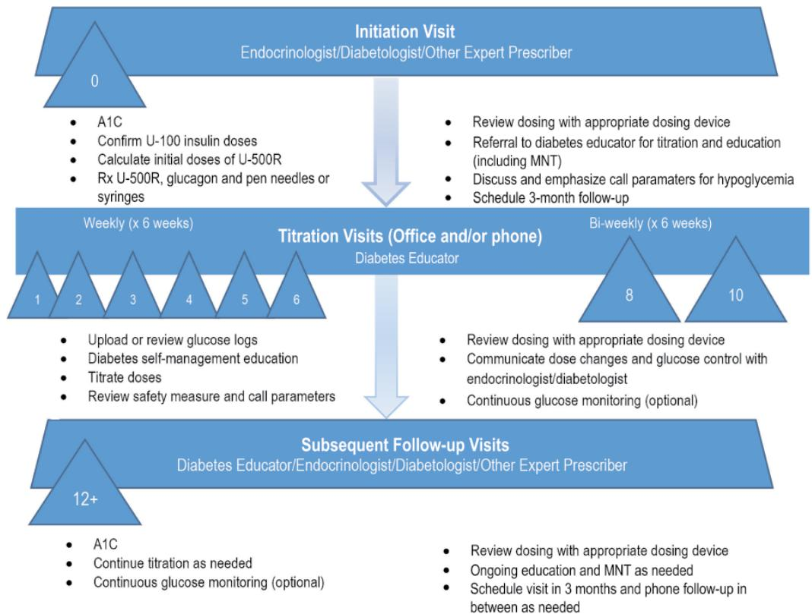
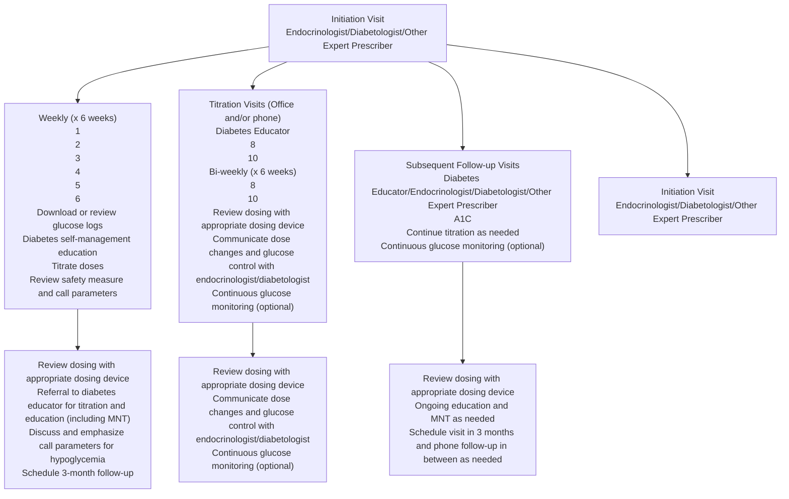

# Translating U-500R Randomized Clinical Trial Evidence to the Practice Setting

# A Diabetes Educator/Expert Prescriber Team Approach

# Purpose

The purpose of this article is to provide recommendations to the diabetes educator/expert prescriber team for the use of human regular U-500 insulin (U-500R) in patients with severely insulin-resistant type 2 diabetes, including its initiation and titration, by utilizing dosing charts and teaching materials translated from a recent U-500R clinical trial.

# Conclusions

Clinically relevant recommendations and teaching materials for the optimal use and management of U-500R in clinical practice are provided based on the efficacy and safety results of and lessons learned from the U-500R clinical trial by Hood et al, current standards of practice, and the authors’ clinical expertise. This trial was the first robustly powered, randomized, titration-to-target trial to compare twice-daily and three-times-daily U-500R dosing regimens. Modifications were made to the initiation and titration dosing algorithms used in this trial to simplify dosing strategies for the clinical setting and align with current glycemic targets recommended by the American Diabetes Association. Leveraging the expertise, resources, and patient interactions of the diabetes educator who can provide diabetes self-management education and support in collaboration with the multidisciplinary diabetes team is strongly recommended to ensure patients treated with U-500R receive the timely and Paula M. Bergen, RN, BSN, CDE

Davida F. Kruger, MSN, APN-BC, BC-ADM

April D. Taylor, MSN, CNS, BC-ADM

Wael E. Eid, MD, FACP, FACE, CDE

Arti Bhan, MD, FACE

Jeffrey A. Jackson, MD, FACP, FACE, CDE

From St Elizabeth Physicians Regional Diabetes Center, Covington, Kentucky (Ms Bergen, Dr Eid); Henry Ford Health System, Detroit, Michigan (Ms Kruger, Dr Bhan); Lilly Diabetes, Lilly USA, LLC, Indianapolis, Indiana (Mrs Taylor, Dr Jackson); University of Kentucky College of Medicine, Lexington, Kentucky (Dr Eid); University of South Dakota Sanford School of Medicine, Sioux Falls, South Dakota (Dr Eid); and University of Alexandria, Egypt (Dr Eid).

Correspondence to Paula M. Bergen, RN, BSN, CDE, St Elizabeth Physicians Regional Diabetes Center, 1500 James Simpson Jr Way, Suite 301, Covington, KY 41011, USA (paula.bergen@stelizabeth.com).

Acknowledgments: The authors thank Edward J. Brauer, PharmD, and Karen M. Paulsrud, RPh, both employees of Eli Lilly and Company, for writing and logistical support to prepare the article for publication. We also thank Jeremy Taylor for his graphic design assistance.

Funding: This work is supported by Lilly USA, LLC, Indianapolis, Indiana. P.M.B. and A.B. have no conflicts of interest to report. D.F.K. serves on advisory boards for Eli Lilly and Company, Novo Nordisk, Abbott, Sanofi Aventis, and Janssen; serves on speakers bureaus for Eli Lilly and Company, Boehringer Ingelheim/Eli Lilly and Company Alliance, Janssen, Valeritas, Astra Zeneca, Animas, Novo Nordisk, and Dexcom; received grants/research support to Henry Ford Health System from Eli Lilly and Company, Astra Zeneca, Novo Nordisk, Helmsley Foundation, Dexcom, Medtronic, and Lexicon; and is a Dexcom stock owner. W.E.E. serves on speakers bureaus for Amgen and Sanofi\_Regeneron. A.D.T. and J.A.J. are full-time employees of Lilly USA, LLC, and J.A.J. is a minor stockholder of Eli Lilly and Company.

DOI: 10.1177/0145721717701579

© 2017 The Author(s)

comprehensive care required to safely and effectively use this highly concentrated insulin.

are of patients with severe insulin resistance (historically defined as a total daily insulin requirement of >200 units/day) requires a great deal of time and resources due to challenging complex regimens delivered in multiple daily injections that often do not achieve individualized glycemic targets.1 These highdose, insulin-treated patients can experience reduced injection burden and improved glycemic control with the use of human regular U-500 insulin (U-500R).1-5

Despite the introduction of the human formulation of regular U-500 insulin to the US market in 1997 and the 9.8 fold-increase in its use from 2005 to 2013,6 limited evidence-based guidance has been available to inform its application. The first robustly powered titration-to-target randomized clinical trial (RCT) with U-500R1,2,7,8 studied U-500R initiation and titration algorithms for patients with severely insulin-resistant type 2 diabetes. While the trial results were beneficial in terms of efficacy and safety, the trial protocol was highly structured, intensive, and not specifically designed for the day-to-day clinical setting. A practical translation of the U-500R trial results and learnings is therefore needed to assist diabetes teams in the management of their U-500R-treated patients in the clinical setting.

The American Diabetes Association recommends the use of a team-based care model (planned visits, selfmanagement support, and evidence-based decision support) in the treatment of diabetes. Team-based care is both coordinated and proactive.9 Despite evidence of the value of diabetes self-management education, utilization and reimbursement are lacking10,11 in contrast to a rising prevalence of obesity, insulin resistance, and type 2 diabetes.12-15 Combined with declining numbers of clinical endocrinologists,16 the US health care system’s ability to provide comprehensive and timely care for patients with type 2 diabetes is strained.

In alignment with these recommendations,9 a teambased approach utilizing the diabetes educator’s skills is proposed for transitioning patients with severe insulin resistance to U-500R therapy. This article provides clinically relevant suggestions and useful teaching materials adapted from dosing algorithms used in the U-500R titration-to-target trial1 with emphasis on the multidisciplinary team in diabetes management. The benefit of a close collaboration between an expert prescriber who determines the initial U-500R dose and the diabetes educator who provides dose titration and ongoing diabetes self-management education is underscored. A program as such would reduce the time and resource burden on the expert prescriber for this population by leveraging the expertise, resources, and patient interactions of the diabetes educator during the transition to this highly concentrated insulin.16

# Time-Action Profile of Human Regular U-500 Insulin

The pharmacokinetic/pharmacodynamic (PK/PD) characteristics of U-500R in obese healthy subjects have been studied17,18 and reviewed3 in prior publications. Simulation modeling to steady-state supports the unique short-acting prandial and longer-acting basal activity of high-dose U-500R for use as insulin monotherapy administered twice-daily (BID) or three-times-daily (TID) and predicts attainment of steady-state within 24 hours after dosage increases.18 When administered at same higher doses (50 units [0.4-0.6 units/kg] and 100 units [0.8-1.3 units/kg]), absorption from the subcutaneous injection site and time to effect (<20 minutes) are similar between human regular U-100 insulin (U-100R) and U-500R;17 however, the peak concentration of U-500R is lower, its time to peak effect is longer (\~6 hours vs \~5 hours17), and its duration of action is more prolonged (up to 24 hours17,19 vs \~18 hours).17 This is in contrast to the time to peak effect (\~3 hours) and duration of action (\~8 hours) observed with the administration of U-100R at lower doses (0.05-0.4 units/kg),20 consistent with the known dose dependency of insulin PK/PD.21 Despite this available evidence, some clinicians continue to believe that U-500R is better absorbed than high-dose U-100 insulins22,23 a nd that U-500R has only basal22 or intermediate-acting23,24 insulin properties.

# Prior U-500R Dosing Recommendations

Prior to the U-500R titration-to-target trial,1 clinicians had only their own clinical experience and largely retrospective, nonrandomized case reports/series,25-29 realworld evidence studies,30-32 and clinical reviews3-5,33-37 to inform U-500R use. Treatment approaches varied among clinicians and experts, with some initiating U-500R with 1-to-1 total daily dose (TDD) transition (U-100 insulins to U-500R) evenly split over multiple daily doses (BID, TID, or 4-times-daily [QID]). Others adjusted the initial starting doses by varying formulas (reduced by 10%-20% depending on baseline glycated hemoglobin [A1C]) to minimize hypoglycemia or accelerate glycemic improvement with various initial dosage proportions.

# The U-500R Titration-to-Target RCT: Summary of Design and Results

This was a 24-week, multicenter, open-label, parallel, titration-to-target trial that enrolled overweight to severely obese patients with uncontrolled type 2 diabetes (A1C: 7.5%-12% [58-108 mmol/mol]) on high-dose U-100 insulins (TDD 201-600 units) with or without oral antihyperglycemic medications.1 The study followed a very structured initiation and titration protocol that called for a reduction in the initial U-500R dose by 20% of the U-100 insulin TDD for patients with an A1C ≤8% (≤64 mmol/ mol) or mean plasma glucose <183 mg/dl (<10.16 mmol/l) (estimated average glucose for an A1C of 8% [64 mmol/ mol]38) within the 7 days before randomization. For patients with an A1C >8% (>64 mmol/mol) or mean plasma glucose ≥183 mg/dl (≥10.16 mmol/l), the U-500R starting dose was 100% of the U-100 insulin TDD. The U-500R TDD was then divided into 60:40 (%) proportions for BID (pre-breakfast:pre-evening meal) dosing or 40:30:30 (%) proportions for TID (pre-breakfast:prelunch:pre-evening meal) dosing. Titration intervals (phone and office visits) were weekly for the first 6 weeks, then biweekly for 6 weeks, then every 3 weeks for the final 12 weeks. Both BID doses and 2 of the 3 TID doses with the greatest need for adjustment could either be increased by 5% to 15% for hyperglycemia or be reduced by 10% for hypoglycemia (≤70 mg/dl [≤3.89 mmol/l]) based on the median of the 3 most recent self-monitored plasma glucose (SMPG) readings for each measured time point, with hypoglycemia prioritized over hyperglycemia for safety.

Key efficacy and safety results of the U-500R titrationto-target trial1 are summarized in Table 1. In brief, change from baseline to 24-week endpoint reductions in A1C were clinically equivalent (1.1%-1.2% [12-13 mmol/ mol]) with a similar low incidence of severe hypoglycemia and similar modest weight gain across BID and TID treatment arms and a higher incidence of nonsevere hypoglycemia in the BID group (Table 1). Importantly, no rescue therapy (BID to TID or TID to QID) for persistent, uncontrolled hyperglycemia was required. Endpoint proportions were also very close to beginning proportions in each arm with similar increases in U-500R TDDs (Table 1). Patient-reported outcomes assessed in the trial showed that transitioning from high-dose, high-volume U-100 insulins to either BID or TID U-500R regimen lessened injection site discomfort, improved patient perception of insulin use and impact of diabetes treatment on daily life function and psychological health, and increased adherence, particularly with BID administration.2

# Learnings From the U-500R Titration-to-Target RCT Applied to Clinical Practice

# Initiation of U-500R

Initiation of U-500R begins with the calculation of the total of all insulins and then converting to the U-500R beginning doses (Figures 1 and 2). It is recommended that the prescriber confirms the patient’s actual home doses to compare with prescribed doses. Complex insulin regimens (up to 10 injections per day)1 can increase patient burden and decrease adherence of all prescribed daily doses.2,3,30,31 When switching to U-500R, if the prescriber neglects to determine the true home doses being administered and a much higher initial U-500R dose is prescribed, the patient is at an increased risk for hypoglycemia in the early transition period.

To simplify the protocol for the clinical setting, a conservative recommendation is to reduce the initial U-500R TDD by 20% of the U-100 insulin TDD with conventional rounding to the nearest 5 units for all patients (as opposed to what was done in Hood et al1 ) to account for possible nonadherence to prescribed U-100 (Figures 1 and 2). As discussed in the titration section, frequent interactions and titrations with the diabetes educator during the dosage adjustment stage will allow for up-titration and compensate for any early underdosing. The prescriber may also opt to individualize the initial U-500R dosing according to patient factors such as A1C,1,7 adherence to prior insulin regimen, age, coexisting comorbidities, hypoglycemic tendencies, and so on.39-44

Once the initial U-500R TDD is determined, clinicians then decide which dosing regimen to use and dose

Table 1   
Key 24-Week Outcomes in the Human Regular U-500 Insulin Titration-to-Target RCTa 

<table><tr><td></td><td>TID (n = 162)</td><td>BID (n = 161)</td><td> $P\ Value^b$ </td></tr><tr><td colspan="4">Efficacy</td></tr><tr><td colspan="4">Endpoint measure</td></tr><tr><td>A1C (%)</td><td>7.5</td><td>7.4</td><td></td></tr><tr><td>CFB (primary endpoint)</td><td>-1.1c</td><td>-1.2c</td><td>.37</td></tr><tr><td>A1C (mmol/mol)</td><td>59.0</td><td>57.0</td><td></td></tr><tr><td>CFB (primary endpoint)</td><td>-12.0c</td><td>-13.0c</td><td>.37</td></tr><tr><td>TDD (units)</td><td>343.1</td><td>335.0</td><td></td></tr><tr><td>CFB</td><td>+55.2c</td><td>+51.4c</td><td>.79</td></tr><tr><td>Fasting SMPG (mg/dl)</td><td>149.1</td><td>144.0</td><td></td></tr><tr><td>CFB</td><td>-24.1c</td><td>-29.2c</td><td>.36</td></tr><tr><td>Fasting SMPG (mmol/l)</td><td>8.28</td><td>7.99</td><td></td></tr><tr><td>CFB</td><td>-1.34c</td><td>-1.62c</td><td>.36</td></tr><tr><td>Daily mean SMPG (mg/dl)</td><td>153.9</td><td>150.4</td><td></td></tr><tr><td>CFB</td><td>-30.3c</td><td>-34.9c</td><td>.27</td></tr><tr><td>Daily mean SMPG (mmol/l)</td><td>8.54</td><td>8.35</td><td></td></tr><tr><td>CFB</td><td>-1.68c</td><td>-1.94c</td><td>.27</td></tr><tr><td>Within-day glycemic  $variability^d$  CFB, median</td><td>-2.0</td><td>-3.3</td><td>.03</td></tr><tr><td colspan="4">Safety</td></tr><tr><td colspan="4">Endpoint measure</td></tr><tr><td colspan="4">Severe hypoglycemiae</td></tr><tr><td>Incidence, n (%)</td><td>3 (1.9)</td><td>6 (3.7)</td><td>.34</td></tr><tr><td colspan="4">Nonsevere hypoglycemiaf</td></tr><tr><td colspan="4">Documented symptomatic (≤70 mg/dl [≤3.89 mmol/l])</td></tr><tr><td>Incidence, n (%)</td><td>149 (92.0)</td><td>145 (90.1)</td><td>.003</td></tr><tr><td colspan="4">Documented symptomatic (&lt;50 mg/dl [&lt;2.78 mmol/l])</td></tr><tr><td>Incidence, n (%)</td><td>91 (56.2)</td><td>103 (64.0)</td><td>.09</td></tr><tr><td colspan="4">Documented symptomatic nocturnal (≤70 mg/dl [≤3.89 mmol/l])</td></tr><tr><td>Incidence, n (%)</td><td>126 (77.8)</td><td>130 (80.8)</td><td>&lt;.001</td></tr><tr><td colspan="4">Documented symptomatic nocturnal (&lt;50 mg/dl [&lt;2.78 mmol/l])</td></tr><tr><td>Incidence, n (%)</td><td>59 (36.4)</td><td>79 (49.1)</td><td>.046</td></tr><tr><td>Weight (kg)</td><td>125.5</td><td>128.5</td><td></td></tr><tr><td>CFB</td><td>+5.4c</td><td>+4.9c</td><td>.34</td></tr></table>

a Data are presented as means for endpoint values and least squares means for change from baseline to endpoint values unless otherwise stated. A1C, glycated hemoglobin; BID, twice daily; CFB, change from baseline; SMPG, self-monitored plasma glucose; TDD, total daily dose; TID, 3 times daily.   
b P values are from BID versus TID treatment comparisons.   
c P < .05 for within-treatment CFB.   
d SD of 7-point SMPG.   
e Severe hypoglycemia was defined as any hypoglycemic episode requiring assistance from another person and accompanied by neurologic/cognitive impairment.   
f Nonsevere hypoglycemic events were categorized as documented symptomatic, nocturnal, or asymptomatic. Documented symptomatic hypoglycemia was defined as 1 or more signs/symptoms typically associated with hypoglycemia accompanied by an SMPG of ≤70 mg/dl or <50 mg/dl. Nocturnal hypoglycemia was defined as any documented symptomatic event occurring between bedtime and waking. Asymptomatic hypoglycemia was defined as any measured SMPG ≤70 mg/dl or <50 mg/dl not accompanied by hypoglycemic signs/symptoms.

Initiation of Twice-Daily Human Regular U-50o Insulin 

<table><tr><td>U-100 TDDa</td><td>Initial U-500R TDDb</td><td>Pre-breakfast dosec,d(60% of U-500R TDD)</td><td>Pre-evening meal dosec,d(40% of U-500R TDD)</td></tr><tr><td colspan="4">INSULIN DOSE IN UNITS</td></tr><tr><td>205</td><td>164</td><td>100</td><td>65</td></tr><tr><td>225</td><td>180</td><td>110</td><td>70</td></tr><tr><td>245</td><td>196</td><td>120</td><td>80</td></tr><tr><td>265</td><td>212</td><td>125</td><td>85</td></tr><tr><td>285</td><td>228</td><td>135</td><td>90</td></tr><tr><td>305</td><td>244</td><td>145</td><td>100</td></tr><tr><td>325</td><td>260</td><td>155</td><td>105</td></tr><tr><td>345</td><td>276</td><td>165</td><td>110</td></tr><tr><td>365</td><td>292</td><td>175</td><td>115</td></tr><tr><td>385</td><td>308</td><td>185</td><td>125</td></tr><tr><td>405</td><td>324</td><td>195</td><td>130</td></tr><tr><td>425</td><td>340</td><td>205</td><td>135</td></tr><tr><td>445</td><td>356</td><td>215</td><td>140</td></tr><tr><td>465</td><td>372</td><td>225</td><td>150</td></tr><tr><td>485</td><td>388</td><td>235</td><td>155</td></tr><tr><td>505</td><td>404</td><td>240</td><td>160</td></tr><tr><td>525</td><td>420</td><td>250</td><td>170</td></tr><tr><td>545</td><td>436</td><td>260</td><td>175</td></tr><tr><td>565</td><td>452</td><td>270</td><td>180</td></tr><tr><td>585</td><td>468</td><td>280</td><td>185</td></tr><tr><td>605</td><td>484</td><td>290</td><td>195</td></tr><tr><td colspan="4">The U-500R doses in this table were adapted from the dosing algorithm used by Hood, et al.1 to convert U-100 insulin TDD to twice-daily U-500R. Abbreviations: TDD, total daily dose; U-500R, human regular U-500 insulin. aTDD equals total of all doses of all U-100 insulins (eg, basal bolus; premix; basal; etc). bU-500R TDD is a 20% reduction of the U-100 insulins TDD. cConventional rounding to nearest five units; administer 30 minutes before meals. dIf using a U-500R prefilled pen or BDTM U-500 Insulin Syringe, the patient dials or draws up, respectively, the number of units prescribed. Alternatively, if using a U-100 insulin or volumetric syringe, specify both the syringe markings and total units on the prescription (see conversion chart for assistance with converting U-500R units to unit or volume [mL] markings on these syringes4).</td></tr></table>

Figure 1. Twice-daily initiation doses. Initial doses are carried over to titration tool at visit 1 (Figure 4) to calculate a new dose (Figure 5). Color coded for guidance: all pre-breakfast doses in blue sections; all pre-evening meal doses in green sections.

proportions. The U-500R titration-to-target trial1,7 demonstrated clinically equivalent results between the BID and TID dosing arms. Three-times-daily dosing demonstrated slightly lower nonsevere hypoglycemia, particularly at night (Table 1), while BID dosing provided less injection burden, a simpler regimen, and a simplified titration.1,2 In the prespecified TDD subgroup analysis,7 no differences were found in efficacy or safety between BID and TID dosing regardless of baseline U-100 insulin TDD, so higherdose U-500R is not a reason to use TID over BID dosing. Given the clinical equivalency of efficacy and safety of BID versus TID, there is no reason necessarily to recommend U-500R TID specifically because a patient eats lunch and a belief in the need to “cover” the lunch post-prandial glucose. For these reasons and to simplify the protocol for use in clinical practice, BID dosing and titration are the

focus of this review. For further details on TID initiation dosing and titration, tools are provided in Figures 2 and 3. Dose proportions (%) of 60:40 for BID and 40:30:30 for TID are recommended for initial dosing (as supported by trial endpoint proportions1 ).

# Titration of U-500R

Figure 4 shows a recommended flow diagram for the U-500R management plan adapted from the U-500R titrationto-target trial.1 Considering that efficacy and safety results of this trial occurred in an investigative site environment with frequent contact and dose adjustments, it is important to note that the first 12 weeks are crucial for dosage titration and patient safety. Initial weekly and biweekly contact may be impractical and resource restrictive for many prescribers. Thus, the partnership of the diabetes educator with the prescriber and other diabetes team members can provide the needed connection and support between the quarterly diabetes office visits and A1C measurements (Figure 4) and provide the necessary frequent patient contact. After the initial dose is calculated, the patient is referred to the diabetes educator for a thorough patient assessment of knowledge, self-management skills, and behaviors and attitudes for the planning, implementation, and titration of the regimen. Based on this assessment, the diabetes educator should provide individualized education and support consisting of a minimum of sick day management, glucose monitoring, activity, and meal planning while making appropriate insulin dose adjustments during the frequent initial contacts, which may be more frequent than weekly in some practices (eg, St

Initiation of Three-Times-Daily Human Regular U-500 Insulin 

<table><tr><td>U-100 TDDa</td><td>Initial U-500R TDDb</td><td>Pre-breakfast dosec,d(40% of U-500R TDD)</td><td>Pre-lunch dosec,d(30% of U-500R TDD)</td><td>Pre-evening meal dosec,d(30% of U-500R TDD)</td></tr><tr><td colspan="5">INSULIN DOSE IN UNITS</td></tr><tr><td>205</td><td>164</td><td>65</td><td>50</td><td>50</td></tr><tr><td>225</td><td>180</td><td>70</td><td>55</td><td>55</td></tr><tr><td>245</td><td>196</td><td>80</td><td>60</td><td>60</td></tr><tr><td>265</td><td>212</td><td>85</td><td>65</td><td>65</td></tr><tr><td>285</td><td>228</td><td>90</td><td>70</td><td>70</td></tr><tr><td>305</td><td>244</td><td>100</td><td>75</td><td>75</td></tr><tr><td>325</td><td>260</td><td>105</td><td>80</td><td>80</td></tr><tr><td>345</td><td>276</td><td>110</td><td>85</td><td>85</td></tr><tr><td>365</td><td>292</td><td>115</td><td>90</td><td>90</td></tr><tr><td>385</td><td>308</td><td>125</td><td>90</td><td>90</td></tr><tr><td>405</td><td>324</td><td>130</td><td>95</td><td>95</td></tr><tr><td>425</td><td>340</td><td>135</td><td>100</td><td>100</td></tr><tr><td>445</td><td>356</td><td>140</td><td>105</td><td>105</td></tr><tr><td>465</td><td>372</td><td>150</td><td>110</td><td>110</td></tr><tr><td>485</td><td>388</td><td>155</td><td>115</td><td>115</td></tr><tr><td>505</td><td>404</td><td>160</td><td>120</td><td>120</td></tr><tr><td>525</td><td>420</td><td>170</td><td>125</td><td>125</td></tr><tr><td>545</td><td>436</td><td>175</td><td>130</td><td>130</td></tr><tr><td>565</td><td>452</td><td>180</td><td>135</td><td>135</td></tr><tr><td>585</td><td>468</td><td>185</td><td>140</td><td>140</td></tr><tr><td>605</td><td>484</td><td>195</td><td>145</td><td>145</td></tr><tr><td colspan="5">The U-500R doses in this table were adapted from the dosing algorithm used by Hood, et al.1 to convert U-100 insulin TDD to three-times-daily U-500R. Abbreviations: TDD, total daily dose; U-500R, human regular U-500 insulin. aTDD equals total of all doses of all U-100 insulins (eg, basal bolus; premix; basal; etc). bU-500R TDD is a 20% reduction of the U-100 insulins TDD. cConventional rounding to nearest five units; administer 30 minutes before meals. dIf using a U-500R prefilled pen or BDTM U-500 Insulin Syringe, the patient dials or draws up, respectively, the number of units prescribed. Alternatively, if using a U-100 insulin or volumetric syringe, specify both the syringe markings and total units on the prescription (see conversion chart for assistance with converting U-500R units to unit or volume [mL] markings on these syringes4).</td></tr></table>

Figure 2. Three-times-daily initiation doses. Initial doses are carried over to titration tool at visit 1 (Figure 4) to calculate a new dose (Figure 3). Color coded for guidance: all pre-breakfast doses in blue sections; all pre-lunch doses in yellow sections; all pre-evening meal doses in green.

Elizabeth Physicians, Covington, Kentucky [P.M.B., W.E.E.]). For the diabetes educator who is not an advanced practice provider or physician, written orders or signed protocol for titration must be obtained.

Titration in the U-500R titration-to-target trial for both BID and TID treatment arms was based on the prandial/ basal characteristics of U-500R identified in pharmacology studies17,18 and reinforced in the trial.1 Figure 5 provides recommendations for revising the trial BID titration algorithm for clinical application. Doses should be titrated according to mean preprandial glucose readings of the subsequent meal (ie, evening meal dose titrated according to pre-breakfast glucose reading). However, hypoglycemia at bedtime (mean SMPG <80 mg/dl [4.44 mmol/l]) or at 3 am (single SMPG <80 mg/dl [4.44 mmol/l]) should result in a 10% evening meal dose

# Titration of Three-Times-Daily Human Regular U-500 Insulin Doses

Titrate 2of 3 doses with the greatest need for adjustment (prioritizing hypoglycemia first). DO NOTADJUSTALL DOSES

Patient Date

<table><tr><td>CURRENTPre-breakfast dose</td><td colspan="2">Adjust pre-breakfast dose according topre-lunch blood glucose assessment. a,b</td><td>NEWPre-breakfast  $dose^c$ </td></tr><tr><td>____ units</td><td>7-day mean pre-lunch BG____ mg/dL</td><td>&lt;80 mg/dL (&lt;4.44 mmol/L): ▼ dose by 10%80-130 mg/dL (4.44-7.22 mmol/L): no change in dose131-180 mg/dL (7.27-9.99 mmol/L): ▲ dose by 5%181-230 mg/dL (10.05-12.77 mmol/L): ▲ dose by 10%&gt;230 mg/dL (&gt;12.77 mmol/L): ▲ dose by 15%</td><td>____ units(round to nearest 5 units)</td></tr><tr><td>CURRENTPre-lunch dose</td><td colspan="2">Adjust pre-lunch dose according topre-evening meal blood glucose assessment. a,b</td><td>NEWPre-lunch  $dose^c$ </td></tr><tr><td>____ units</td><td>7-day mean pre-eveningmeal BG____ mg/dL</td><td>&lt;80 mg/dL (&lt;4.44 mmol/L): ▼ dose by 10%80-130 mg/dL (4.44-7.22 mmol/L): no change in dose131-180 mg/dL (7.27-9.99 mmol/L): ▲ dose by 5%181-230 mg/dL (1.05-12.77 mmol/L): ▲ dose by 10%&gt;230 mg/dL (&gt;12.77 mmol/L): ▲ dose by 15%</td><td>____ units(round to nearest 5 units)</td></tr><tr><td>CURRENTPre-evening meal dose</td><td colspan="2">Adjust pre-evening meal dose according topre-breakfast, bedtime and 3am blood glucose assessment. a,b</td><td>NEWPre-evening meal  $dose^c$ </td></tr><tr><td rowspan="2">____ units</td><td>7-day mean bedtime BG____ mg/dLSINGLE 3am BG____ mg/dL7-day mean pre-breakfast BG____ mg/dL</td><td rowspan="2">&lt;80 mg/dL (&lt;4.44 mmol/L): ▼ dose by 10%ALL &gt;80mg/dL (4.44-7.22 mmol/L): See below</td><td rowspan="2">____ units(round to nearest 5 units)</td></tr><tr><td>Use 7-day mean pre-breakfast BG for titration80-130 mg/dL (4.44-7.22 mmol/L): no change in dose131-180 mg/dL (7.27-9.99 mmol/L): ▲ dose by 5%181-230 mg/dL (10.05-12.77 mmol/L): ▲ dose by 10%&gt;230 mg/dL (&gt;12.77 mmol/L): ▲ dose by 15%</td></tr><tr><td colspan="4">Titration recommendations for three-times-daily U-500R administration in this tool were adapted from the titration algorithm used by Hood, et al.1Abbreviations: ▲ , increase; ▼ , decrease; BG, blood glucose; U-500R, human regular U-500 insulin. aNo dose change if at least 3 readings are not available. Use of the median of the most recent 3 readings is an option for paper-based glucose diary use. bFor any single unexplained hypoglycemic reading &lt;80 mg/dL (&lt;4.44mmol/L), the corresponding dose is NOT increased at the discretion of the prescriber. cIf using a U-500R prefilled pen or  $BD^{TM}$  U-500 Insulin Syringe, the patient dials or draws up, respectively, the number of units prescribed. Alternatively, if using U-100 insulin or volumetric syringe, specify both the syringe markings and total units on the prescription (see conversion chart for assistancea).</td></tr></table>

Figure 3. Three-times-daily titration tool. Color coded for guidance: all pre-breakfast doses in blue sections; all pre-lunch doses in yellow sections; all preevening meal doses in green sections.

reduction even in the event of above target mean premeal glucose readings (hypoglycemia is prioritized over hyperglycemia). Both doses for the BID regimen should be titrated at each visit. Changing from BID to TID dosing may be considered if the patient experiences overnight hypoglycemia or for those who eat lunch and the

glucose pattern suggests significant post-prandial excursions despite adjustments of the breakfast dose.

An important distinction in the U-500R titration-totarget trial was use of percentage dose adjustments versus numerical titrations.1 This was based on the wide range of initial U-100 insulin TDDs (201-600 units) in study

Outpatient Visit Flow Diagram for U-50oR Initiation, Titration and Ongoing Management   

flowchart

Abbreviations:A1C,glycated hmoglobn;Rx,prescription;U-5oR,humanreguarU-50insulin;MNT,Medical Nutrtiorapy

Figure 4. Recommended visit schedule for the diabetes management team collaboration.

participants and the anticipated increases in U-500R TDDs in patients who were quite under-insulinized at randomization. For example, a numerical adjustment of 5 to 15 units per dose per visit would have a much different effect if applied to a patient on a 70-unit pre-meal dose versus a patient requiring 200 units pre-meal. Accordingly, use of 5% to 15% dosage increases for corresponding glucose readings above target and 10% decreases for readings below target is recommended (Figures 3 and 5).

The U-500R titration-to-target trial1 used the median of the 3 most recent glucose measurements for pre-meal and pre-bedtime readings (median was not used for hypoglycemic readings at 3 am). For patients using a paper log, this may still be considered for ease of calculations. However, with the current access of most patients to glucose monitors with data history and download capabilities, many clinicians have access to software to calculate pre-meal, bedtime, and 3 am glucose means. Cloud-based software systems allow patients to upload at home and the health care provider to view from any computer. Due to this access, the proposed titration adjustments for corresponding glucose readings use a 7-day mean (Figures 3 and 5). For missing glucose data, it is essential to assess the reason for the lack of readings and educate the patient on the importance of glucose monitoring to accomplishing U-500R titration. There should be a minimum of 3 readings before a dosing change is made. Otherwise, no change is made.

The glycemic target range of 71 mg/dl to 130 mg/dl (3.94-7.22 mmol/l) was used in the U-500R titration-totarget trial,1 as recommended by the American Diabetes Association in 2012,45 the year the study protocol was approved. These guidelines were changed in 2014 to suggest a target range of 80 mg/dl to 130 mg/dl (4.44-7.22 mmol/l),46 and accordingly, the recommended titration algorithms for translation to the practice setting have been modified to reflect this change (Figures 3 and 5). However, the target range may be individualized based on patient characteristics (eg, duration of diabetes, comorbidities, age/life expectancy, hypoglycemia unawareness).42 The cutoff for 10% reduction in doses has been modified from ≤70 mg/dl (≤3.89 mmol/l) to <80 mg/dl (<4.44 mmol/l), which should reduce the occurrence of hypoglycemia. Intervals for each dosage increase have also been simplified to 50 mg/dl (2.78 mmol/l). It is understood that these modifications to the U-500R titration-to-target trial dosing algorithms may result in a less steep initial drop in A1C values if applied in the practice setting, possibly with less initial A1C lowering. Such a gradual reduction in A1C may be particularly beneficial to patients with long-standing, significant elevations in A1C who may experience subjective hypoglycemic symptoms with steep A1C reductions. The algorithms as modified will also still likely drive patients

Titration of Twice-Daily Human Regular U-500 Insulin Doses 

<table><tr><td>CURRENTPre-breakfast dose</td><td colspan="2">Adjust pre-breakfast dose according topre-evening meal and pre-lunch blood glucose assessment. $^{a,b}$ </td><td>NEWPre-breakfast  $dose^c$ </td></tr><tr><td rowspan="2">____ units</td><td>7-day mean pre-lunch BG____ mg/dL7-cay mean pre-eveningmeal BG____ mg/dL</td><td>&lt;80 mg/dL (&lt;4.44 mmol/L): ▼ dose by 10%BOTH &gt;80mg/dL (4.44-7.22 mmol/L): See below</td><td rowspan="2">____ units(round to nearest 5 units)</td></tr><tr><td colspan="2">Use 7-day mean pre-evening meal BG for titration80-130 mg/dL (4.44-7.22 mmol/L): no change in dose131-180 mg/dL (7.27-9.99 mmol/L): ▲ dose by 5%181-230 mg/dL (10.05-12.77 mmol/L): ▲ dose by 10%&gt;230 mg/dL (&gt;12.77 mmol/L): ▲ dose by 15%</td></tr><tr><td>CURRENTPre-evening meal dose</td><td colspan="2">Adjust pre-evening meal dose according topre-breakfast, bedtime and 3am blood glucose assessment. $^{a,b}$ </td><td>NEWPre-evening meal  $dose^c$ </td></tr><tr><td rowspan="2">____ units</td><td>7-day mean bedtime BG____ mg/dLSINGLE 3am BG____ mg/dL7-day mean pre-breakfast BG____ mg/dL</td><td>&lt;80 mg/dL (&lt;4.44 mmol/L): ▼ dose by 10%ALL &gt;80mg/dL (4.44-7.22 mmol/L): See below</td><td rowspan="2">____ units(round to nearest 5 units)</td></tr><tr><td colspan="2">Use 7-day mean pre-breakfast BG for titration80-130 mg/dL (4.44-7.22 mmol/L): no change in dose131-180 mg/dL (7.27-9.99 mmol/L): ▲ dose by 5%181-230 mg/dL (10.05-12.77 mmol/L): ▲ dose by 10%&gt;23O mg/dL (&gt;12.77 mmol/L): ▲ dose by 15%</td></tr><tr><td colspan="4">Titration recommendations for twice daily U-500R administration in this tool were adapted from the titration algorithm used by Hood, et al. $^1$ Abbreviations: ▲ , increase; ▼ , decrease; BG, blood glucose; U-500R, human regular U-500 insulin. *No dose change if at least 3 readings are not available. Use of the median of the most recent 3 readings is an option for paper-based glucose diary use.  $^b$ For any single unexplained hypoglycemic reading &lt;80 mg/dL (&lt;4.44mmol/L), the corresponding dose is NOT increased at the discretion of the prescriber.  $^c$ If using a U-500R prefilled pen or BD $^TM$ U-500 Insulin Syringe, the patient dials or draws up, respectively, the number of units prescribed. Alternatively, if using U-100 insulin or volumetric syringe, specify both the syringe markings and total units on the prescription (see conversion chart for assistance $^4$ ).</td></tr></table>

Figure 5. Twice-daily titration tool. Color coded for guidance: all pre-breakfast doses in blue section; all pre-evening meal doses in green section.

toward A1Cs approaching what was observed in the U-500R titration-to-target trial. Another very important point for application of the trial to clinical practice is that clinicians should modify titrations based on individualized patient targets for A1C9,40,41,43,44 that may differ from the glycemic targets used in the study. For instance, if a patient’s individualized A1C target is reached, it is reasonable to either suspend up-titration or adjust titration targets while continuing dosage reductions for hypoglycemia.

# Glucose Monitoring

Patients need to perform glucose monitoring before meals and at bedtim e1,47 while on U-500R. Of note, some insurance providers may require a prior approval for the number of test strips required for this frequency of testing (eg, Medicare48 limits to 100 strips/month for insulin users without a medical necessity letter). Early morning (2 am or 3 am) readings should be measured within 2 days of any dosage change. Individualized call parameters for hypoglycemia and hyperglycemia should be determined. Each patient should be encouraged to call when these parameters are reached and to not delay reporting until the next visit. Correction dosing (pre- or post-meal) according to an insulin sensitivity factor is not recommended due to risk of stacking and increased risk of hypoglycemia, particularly when patients are approaching their target A1C. Professional continuous glucose monitoring may be utilized to assist with the monitoring and titration of individual U-500R doses (during the 12-week initiation and titration phase or at the first follow-up visit after doses have stabilized) and is particularly helpful in identifying nocturnal hypoglycemia or providing glucose data if the A1C does not correspond with glucose results (suggesting post-prandial highs or lows).

# Additional Clinical Pearls

# Choosing Appropriate Patients for U-500R

Not every patient with severely insulin-resistant diabetes is a good candidate for use of U-500R. Although 20% of patients enrolled in the U-500R titration-to-target trial were ≥65 years of age, one BID-assigned 72-yearold patient died from irreversible brain injury after experiencing seizure/coma from presumed prolonged severe hypoglycemia after 21 weeks of follow-up.1 This patient lived alone, had a history of missing 7-point SMPG profiles and 3 am readings, and had a history of major cardiovascular disease. Those with history of poor adherence with office visits or glucose monitoring, hypoglycemic unawareness, extreme age with major chronic debilities, cognitive or psychiatric impairment, or extreme meal patterns (ie, 1 meal per day or excessive grazing) may be judged to be inappropriate for U-500R.

# Concomitant Therapy

Concomitant use of other insulins with U-500R is not recommended or necessary based on the U-500R timeaction profile (see Time-Action Profile section) and as demonstrated in the U-500R titration-to-target trial1 and prior case reports/series and reviews .3-5,25-29,33-37 This practice complicates the regimen for patients and makes it more costly30-3 2 (often including multiple co-pays) but is still quite prevalent.32 Use of other antihyperglycemic agents (other than secretagogues) with U-500R can follow clinical guidelines (ADA/EASD39,41 and AACE/ ACE40,43). Combined use of non-insulin injectables30-32,49,50 or sodium-glucose cotransporter-2 inhibitors51 has been increasingly common for high-dose insulin-treated patients and other patients as well; initiation and escalation of doses of U-500R for such patients may need to be modified to reduce the risk of hypoglycemia.

# Education

The 2015 joint position statement from the American Diabetes Association, American Association of Diabetes Educators, and Academy of Nutrition and Dietetics states that clear communication and effective collaboration between a provider, educator, and patient is critical to ensure appropriate care as well as progress toward mutually defined goals. Diabetes self-management education and support should occur when there is a new complicating factor such as a complicated medicine regimen52 (as would be the case with initiation of U-500R). Diabetes self-management for sick days, alcohol ingestion, traveling, activity, and other diabetes education topics for patients treated with U-500R is not different from diabetes self-management for any patient treated with insulin unless as stated in the following for hypoglycemia and meal planning.

Although not accessible to all patients, an initial medical nutrition therapy visit along with follow-up visits as needed for healthy meal planning is strongly encouraged. Meals should be individualized based on the needs of the patient.53 Consistent grams of carbohydrate at consistent meal times (using carbohydrate counting or the plate method) is recommended for patients treated with U-500R to reduce the risk of hypoglycemia. Patients who anticipate skipping a meal should decrease the U-500R dose by 50% for that meal (as was done in the U-500R titration-to-target trial)1 in light of the known prandial/basal activity of U-500R. To decrease the risk of nocturnal hypoglycemia, a bedtime snack is recommended if bedtime glucose is ≤140 mg/dl (≤7.77 mmol/l). For bedtime glucose levels >140 mg/dl (>7.77 mmol/l), no snack is needed, but if desired, patients may choose a small snack with no carbohydrates to avoid nocturnal hyperglycemia. Large snacks, even non-carbohydrate, can result in a higher fasting glucose.

Hypoglycemia for patients on U-500R can be prolonged due to the long duration of action of the insulin. Patients should be instructed to check glucose for any signs or symptoms of hypoglycemia and to treat immediately for any glucose reading ≤70 mg/dl (≤3.89 mmol/l). A repeat BG reading within 15 minutes of treatment is recommended to assess for resolution of the hypoglycemia. Increased checking is recommended during the next 24 hours after a hypoglycemic event. Patients should be carefully instructed on hypoglycemia signs and symptoms and management, including prescribing of glucagon and instruction for family members. Instruct the patient to report hypoglycemia between visits and to not delay reporting in between phone or office contact. If a patient requires urgent or emergency care or is hospitalized, care providers should be notified of the use of U-500R, including doses in units of insulin. Patients should be provided with documentation (eg, identification card) of their current U-500R doses as well as contact information for the diabetes management team.

# Administration

The prandial and basal properties of U-500R allow for administration as insulin monotherapy. Administration is recommended approximately 30 minutes before meals 2 or 3 times daily.19 The U-500R titration-to-target trial1 was conducted using the U-500R vial and non-dedicated U-100 insulin syringes. The U-500R prefilled pen and the 0.5 mL BD U-500 Insulin Syringe19 have recently become available. Use of either dedicated device is strongly recommended for administration due to no dose conversion needed to deliver a dose (eg, dial with the pen or draw up with the U-500 insulin syringe to the 100-unit mark to get 100 units). The U-500 insulin syringe can be dosed up to 250 units per injection,54 and the U-500R pen can be dosed up to 300 units per injection.55 At study endpoint, patients in the U-500R titration-to-target trial had a mean TDD of \~339 units.1 Most patients will not have an individual dose >250 units. However, for patients on an extremely large TDD, they will require more than 1 injection per dose if individual doses exceed 250 units for U-500 insulin syringe or 300 units for U-500 pen. For a U-100 insulin syringe, the total dose of U-500R must be divided by 5 or multiplied by 0.2 to convert to unit markings (eg, the 20-unit marking = 100 units).4 If the patient is using a tuberculin (volumetric) syringe, the total dose of U-500R must be divided by 500 or multiplied by 0.002 to convert to a dose in ml (eg, 0.2 ml = 100 units).4 It is crucially important for the diabetes educator/diabetes team to explain dosing with the prescribed device (syringe or prefilled pen) and to assess and reassess understanding at each office visit and phone call to ensure the patient understands how to administer the dose correctly as well as the total U-500R dose prescribed. Visual assessment of patient technique is recommended frequently to assess for correct measurement, priming (for pen use), site selection, and depth and angle of injection.

# Pharmacy Collaboration

It is highly recommended to use a standardized prescription format. Prescribe the units per dose and indicate NO SUBSTITUTION to avoid substitution at the pharmacy of the U-100 syringe for the BD U-500 Insulin Syringe or a vial for pen. For patients using a nondedicated device, include the units and unit markings for the device. Consult the pharmacist at initiation of U-500R to inform him or her about the titration methods being used and that frequent titrations will particularly occur in the first 12 weeks. This may help to reduce the number of pharmacy call-backs for clarification as well as provide the pharmacist with the knowledge of this intervention when counseling the patient during dispensing. The pharmacist can also be vital in reinforcing the importance of recognition and prompt treatment of hypoglycemia, including appropriate use of glucagon.

# Patient Self-Titration

Some offices may consider self-titration of doses by the patient. This has not been studied for U-500R in clinical trials or published case series and is only appropriate for the patient who is competent with glucose monitoring, provides weekly glucose data, attends all visits (phone or office), and can competently calculate and administer the appropriate doses. All offices may not feel comfortable allowing patients to self-titrate. A written patient/provider treatment plan agreement may be considered that includes a glucose monitoring schedule, meal planning instructions, dosing, and follow-up timing for both the diabetes educator and the prescriber.29

# Conclusion

The U-500R titration-to-target trial1 provides strong evidence-based support for the initiation and titration of

U-500R as prandial/basal insulin monotherapy administered either BID or TID. The multidisciplinary diabetes team plays a crucial role in the management of these patients with severe insulin resistance; however, the complexity of the protocol and algorithms used in the U-500R study may be quite challenging for a busy office practice to apply. As such, this review presents recommended adaptations to the dosing protocol used in this trial for application to the clinical setting, which include initiation formulas and charts, titration worksheets, and an outpatient visit flow diagram emphasizing the utilization of the diabetes team. It also discusses dedicated and nondedicated device options for U-500R administration and other clinical pearls. This information and these materials provide needed, timely, and practical assistance for the diabetes team in the care of this important group of patients with diabetes who require high-dose insulin therapy.

# References

1. Hood RC, Arakaki RF, Wysham C, Li YG, Settles JA, Jackson JA. Two treatment approaches for human regular U-500 insulin in patients with type 2 diabetes not achieving adequate glycemic control on high-dose U-100 insulin therapy with or without oral agents: a randomized, titration-to-target clinical trial. Endocr Pract. 2015;21(7):782-793. Erratum, 2016;22(7):905.   
2. Kabul S, Hood R, Duan R, DeLozier AM, Settles J. Patientreported outcomes in transition from high-dose U-100 insulin to human regular U-500 insulin in severely insulin-resistant patients with type 2 diabetes: analysis of a randomized clinical trial. Health Qual Life Outcomes. 2016;14:139.   
3. Cochran EK, Valentine V, Samaan KH, Corey IB, Jackson JA. Practice tips and tools for the successful use of U-500 regular human insulin. Diabetes Educ. 2014;40(2):153-165.   
4. Segal AR, Brunner JE, Burch FT, Jackson JA. Use of concentrated insulin human regular (U-500) for patients with diabetes. Am J Health Syst Pharm. 2010;67(18):1526-1535.   
5. Lane WS, Cochran EK, Jackson JA, et al. High-dose insulin therapy: is it time for U-500 insulin? Endocr Pract. 2009;15(1):71-79.   
6. Wong M, Jiang D, Perez-Nieves M. Trends of incident and prevalent use of human regular U-500 insulin over a 9-year period in the United States. Presented at: American Association of Clinical Endocrinologists (AACE) 24th Annual Scientific and Clinical Congress; May 13-17 2015; Nashville, TN.   
7. Wysham C, Hood RC, Warren ML, Wang T, Morwick TM, Jackson JA. Effect of total daily dose on efficacy, dosing, and safety of 2 dose titration regimens of human regular U500 insulin in severely insulin-resistant patients with type 2 diabetes. Endocr Pract. 2016;22(6):653-665.   
8. Mari A, Rosenstock J, Ma X, Li YG, Jackson JA. Optimized human regular U-500 insulin treatment improves β-cell function in severely insulin-resistant patients with long-standing type 2 diabetes and high insulin requirements. Endocr Pract. 2015;21(12):1344-1352. Erratum, 2016;22(5):646.   
9. American Diabetes Association. Promoting health and reducing disparities in populations. Diabetes Care. 2017;40(suppl 1):S6-S10.

10. Duncan I, Ahmed T, Li Q, et al. Assessing the value of the diabetes educator. Diabetes Educ. 2011;37(5):638-657.   
11. Martin AL, Lipman RD. The future of diabetes education: expanded opportunities and roles for diabetes educators. Diabetes Educ. 2013;39(4):436-446.   
12. Centers for Disease Control and Prevention, National Center for Health Statistics, Division of Health Interview Statistics. Number (in Millions) of Civilian, Non-Institutionalized Persons With Diagnosed Diabetes, United States, 1980-2014. Atlanta, GA: U.S. Department of Health and Human Services; 2014. http:// www.cdc.gov/diabetes/statistics/prev/national/figpersons.htm. Accessed January 27, 2017.   
13. NCD Risk Factor Collaboration. Worldwide trends in diabetes since 1980: a pooled analysis of 751 population-based studies with 4.4 million participants. Lancet. 2016;387:1513-1530.   
14. World Health Organization. Global Report on Diabetes. Geneva, Switzerland: World Health Organization; 2016. http://apps.who .int/iris/bitstream/10665/204871/1/9789241565257\_eng.pdf? ua=1. Accessed January 27, 2017.   
15. Centers for Disease Control and Prevention, National Center for Chronic Disease Prevention and Health Promotion. National Diabetes Statistics Report: Estimates of Diabetes and Its Burden in the United States, 2014. Atlanta, GA: U.S. Department of Health and Human Services; 2014. http://www.cdc.gov/diabetes/ pubs/statsreport14/national-diabetes-report-web.pdf. Accessed January 27, 2017.   
16. Rizza RA, Vigersky RA, Rodbard HW, et al. A model to determine workforce needs for endocrinologists in the United States until 2020. Diabetes Care. 2003;26(5):1545-1552.   
17. de la Peña A, Riddle M, Morrow LA, et al. Pharmacokinetics and pharmacodynamics of high-dose human regular U-500 insulin versus human regular U-100 insulin in healthy obese subjects. Diabetes Care. 2011;34(12):2496-2501. Erratum, 2014;37(8): 2414.   
18. de la Peña A, Ma X, Reddy S, Ovalle F, Bergenstal RM, Jackson JA. Application of PK/PD modeling and simulation to dosing regimen optimization of high-dose human regular U-500 insulin. J Diabetes Sci Technol. 2014;8(4):821-829.   
19. Humulin® U-500R [package insert]. Indianapolis, IN: Eli Lilly & Co; 2016.   
20. Humulin® U-100R [package insert]. Indianapolis, IN: Eli Lilly & Co; 2015.   
21. Heinemann L. Time-Action Profiles of Insulin Preparations. Mainz, German: Kirchheim & Co; 2004.   
22. American Diabetes Association. Approaches to glycemic treatment. Diabetes Care. 2016;39(suppl 1):S52-S59.   
23. Barnosky A, Shah L, Meah F, Emanuele N, Emanuele MA, Mazhari A. A primer on concentrated insulins: what an internist should know. Postgrad Med. 2016;128(4):381-390.   
24. Lamos EM, Younk LM, Davis SN. Concentrated insulins: the new basal insulins. Ther Clin Risk Manag. 2016;12:389-400.   
25. Fain JA. Insulin resistance and the use of U-500 insulin: a case report. Diabetes Educ. 1987;13(4):386-389.   
26. Neal JM. Analysis of effectiveness of human U-500 insulin in patients unresponsive to conventional insulin therapy. Endocr Pract. 2005;11(5):305-307.   
27. Ballani P, Tran MT, Navar MD, Davidson MB. Clinical experience with U-500 regular insulin in obese, markedly insulinresistant type 2 diabetic patients. Diabetes Care. 2006;29(11): 2504-2505.

28. Nayyar V, Jarvis J, Lawrence I, et al. Long-term follow up of patients on U- 500 insulin: a case series. Pract Diab Int. 2010;27(5):194-197.   
29. Ziesmer AE, Kelly KC, Guerra PA, George KG, Dunn FL. U500 regular insulin use in insulin-resistant type 2 diabetic veteran patients. Endocr Pract. 2012;18(1):34-38.   
30. Eby EL, Wang P, Curtis BH, et al. Cost, healthcare resource utilization, and adherence of individuals with diabetes using U-500 or U-100 insulin: a retrospective database analysis. J Med Econ. 2013;16(4):529-538.   
31. Eby EL, Zagar AJ, Wang P, et al. Healthcare costs and adherence associated with human regular U-500 versus high-dose U-100 insulin in patients with diabetes. Endocr Pract. 2014;20(7):663.   
32. Eby EL, Curtis BH, Gelwicks SC, et al. Initiation of human regular U-500 insulin use is associated with improved glycemic control: a real-world US cohort study. BMJ Open Diabetes Res Care. 2015;3:e000074.   
33. Cochran E, Musso C, Gorden P. The use of U-500 in patients with extreme insulin resistance. Diabetes Care. 2005;28(5):1240-1244.   
34. Dailey AM, Tannock LR. Extreme insulin resistance: indications and approaches to the use of U-500 insulin in type 2 diabetes mellitus. Curr Diab Rep. 2011;11(2):77-82.   
35. Reutrakul S, Wroblewski K, Brown RL. Clinical use of U-500 regular insulin: review and meta-analysis. J Diabetes Sci Technol. 2012;6(2):412.   
36. Jones P, Idris I. The use of U-500 regular insulin in the management of patients with obesity and insulin resistance. Diabetes Obes Metab. 2013;15(10):882.   
37. Schechter R, Reutrakul S. Management of severe insulin resistance in patients with type 1 diabetes. Curr Diab Rep. 2015; 15(10):1-12.   
38. Nathan DM, Kuenen J, Borg R, et al. Translating the A1C assay into estimated average glucose values. Diabetes Care. 2008; 31(8):1473-1478.   
39. Inzucchi SE, Bergenstal RM, Buse JB, et al. Management of hyperglycaemia in type 2 diabetes: a patient-centered approach. Position statement of the American Diabetes Association (ADA) and the European Association for the Study of Diabetes (EASD). Diabetologia. 2012;55(6):1577-1596.   
40. Garber AJ, Abrahamson MJ, Barzilay JI, et al. AACE/ACE comprehensive diabetes management algorithm 2015. Endocr Pract. 2015;21(4):438.   
41. Inzucchi SE, Bergenstal RM, Buse JB, et al. Management of hyperglycemia in type 2 diabetes, 2015: a patient-centered approach: update to a position statement of the American Diabetes Association and the European Association for the Study of Diabetes. Diabetes Care. 2015;38:140-149.   
42. American Diabetes Association. Glycemic targets. Diabetes Care. 2017;40(suppl. 1):S48-S56.

43. Garber AJ, Abrahamson MJ, Barzilay JI, et al. Consensus statement by the American Association of Clinical Endocrinologists and American College of Endocrinology on the comprehensive type 2 diabetes management algorithm—2016 executive summary. Endocr Pract. 2016;22(1):84-113.   
44. Lipska KJ. Nutrition/metabolic disorders. Diabetes in older people. JAMA Patient Page. 2016;316(3):362.   
45. American Diabetes Association. Standards of medical care in diabetes—2012. Diabetes Care. 2012;35(suppl 1):S11-S63.   
46. American Diabetes Association. Glycemic targets. Diabetes Care. 2015;38(suppl):S33-S40.   
47. Bailey TS, Grunberger G, Bode BW, et al. American Association of Clinical Endocrinologists and American College of Endocrinology 2016 outpatient glucose monitoring consensus statement. Endocr Pract. 2016;22(2):231-261.   
48. Centers for Medicare & Medicaid. Provider compliance tips for diabetic test strips. https://www.cms.gov/Outreach-and-Education/Medicare-Learning-Network-MLN/MLNProducts/ Downloads/ProviderComplianceTipsforDiabeticTestStrips-ICN909185.pdf. Accessed January 27, 2017.   
49. Eng C, Kramer CK, Zinman B, Retnakaran R. Glucagon-like peptide-1 receptor agonist and basal insulin combination treatment for the management of type 2 diabetes: a systematic review and meta-analysis. Lancet. 2014;384(9961):2228- 2234.   
50. Lane W, Weinrib S, Rappaport J, Hale C. The effect of addition of liraglutide to high-dose intensive insulin therapy: a randomized prospective trial. Diabetes Obes Metab. 2014;16(9):827-832.   
51. Rosenstock J, Jelaska A, Frappin G, et al. Improved glucose control with weight loss, lower insulin doses, and no increased hypoglycemia with empagliflozin added to titrated multiple daily injections of insulin in obese inadequately controlled type 2 diabetes. Diabetes Care. 2014;37:1815-1823.   
52. Powers MA, Bardsley J, Cypress M, et al. Diabetes self-management education and support in type 2 diabetes: a joint position statement of the American Diabetes Association, the American Association of Diabetes Educators, and the Academy of Nutrition and Dietetics. Diabetes Educ. 2015;41(4):417-430.   
53. American Diabetes Association. Comprehensive medical evaluation and assessment of comorbidities. Diabetes Care. 2017;40(suppl 1):S25-S32.   
54. Instructions for use insulin human injection (500 units/mL, 20 mL vial). http://uspl.lilly.com/humulinru500/humulinru500.html #ug0. Accessed January 27, 2017.   
55. Instructions for use insulin human injection U-500 (500 units/mL, 3 mL pen). http://uspl.lilly.com/humulinru500/humulinru500. html#ug1. Accessed January 27, 2017.

For reprints and permission queries, please visit SAGE’s Web site at http://www.sagepub.com/journalsPermissions.nav.

