# ARTICLE

# New Paradigm for Translational Modeling to Predict Long-term Tuberculosis Treatment Response

IH Bartelink1,2, N Zhang1,3, RJ Keizer1,4, N Strydom1, PJ Converse3, KE Dooley3, EL Nuermberger3 and RM Savic1,∗

Disappointing results of recent tuberculosis chemotherapy trials suggest that knowledge gained from preclinical investigations was not utilized to maximal effect. A mouse-to-human translational pharmacokinetics (PKs) – pharmacodynamics (PDs) model built on a rich mouse database may improve clinical trial outcome predictions. The model included Mycobacterium tuberculosis growth function in mice, adaptive immune response effect on bacterial growth, relationships among moxifloxacin, rifapentine, and rifampin concentrations accelerating bacterial death, clinical PK data, species-specific protein binding, drug-drug interactions, and patient-specific pathology. Simulations of recent trials testing 4-month regimens predicted 65% (95% confidence interval [CI], 55–74) relapse-free patients vs. 80% observed in the REMox-TB trial, and 79% (95% CI, 72–87) vs. 82% observed in the Rifaquin trial. Simulation of 6-month regimens predicted 97% (95% CI, 93–99) vs. 92% and 95% observed in 2RHZE/4RH control arms, and 100% predicted and observed in the 35 mg/kg rifampin arm of PanACEA MAMS. These results suggest that the model can inform regimen optimization and predict outcomes of ongoing trials.

Clin Transl Sci (2017) 10, 366–379; doi:10.1111/cts.12472; published online on 31 May 2017.

# Study Highlights

# WHAT IS THE CURRENT KNOWLEDGE ON THE TOPIC?

✔ Disappointing results of recent TB chemotherapy trials suggest that doses extrapolated from mice to humans failed to accurately predict clinical efficacy and did not account for at least three essential disparities: (1) limitations in our ability to deliver “human-equivalent” PK profiles to animals; (1) differences in immune system response and disease-related pathology; and (2) much higher PK variability in patients compared with genetically similar animals.

# WHAT QUESTION DID THIS STUDY ADDRESS?

✔ Can systems pharmacology models address this “translational gap”?

# WHAT THIS STUDY ADDS TO OUR KNOWLEDGE

Using preclinical exposure-response data, information about disease pathology (i.e., cavitary vs. non-cavitary lung disease), and immune responses linked with clinical PK, the translational model developed here can inform regimen optimization and predict outcomes of late-stage clinical trials.

# HOW THIS MIGHT CHANGE CLINICAL PHARMACOL-OGY OR TRANSLATIONAL SCIENCE

✔ Prospective testing of translational models is a critical step toward bridging the preclinical-clinical divide in more efficient and informative ways. It will eliminate some uncertainty from drug development for TB and will be relevant for other researchers working to bridge this divide across disease areas.

Tuberculosis (TB) has surpassed human immunodeficiency virus as the leading infectious cause of death worldwide.1 Current treatment for drug-susceptible TB—2 months of rifampin (R), isoniazid (H), pyrazinamide (Z) and ethambutol (E) followed by 4 months of RH (2RHZE/4RH), is considered highly effective. However, this treatment is complex, lengthy, consumes substantial health system resources, and results in 5–10% of patients who relapse after treatment.1 Shortening drug regimens is a major objective of TB drug development efforts.

Selection of regimens to test in clinical trials designed to shorten treatment duration relies heavily on results from

preclinical models. In an established mouse model of TB, the substitution of rifapentine for rifampin at the same 10 mg/kg dose level significantly shortened the treatment duration to achieve cure without relapse.2 The results prompted a phase II trial (TBTC study 29) in which rifapentine 10 mg/kg was substituted for rifampin in the first-line regimen.3 The rifapentine dose was extrapolated directly from mice to humans, without more sophisticated pharmacokinetic/pharmacodynamic (PK/PD) modeling and without considering the impact of human PK variability or differences in lung pathology. Unlike results in mice, the rifapentinecontaining regimen was not superior to control in study 29.3

Because the murine studies demonstrated a clear exposure-response relationship for both rifamycins,2,4–6 another clinical trial (TBTC study 29X) was performed in which rifapentine doses ranged from 10 to 20 mg/kg.7 As expected, patients with rifapentine plasma exposures in the two higher tertiles had more rapid sputum culture conversion and higher rate of change in Xpert MTB/RIF assays than the lowest tertile.3,7,8 This result corroborated the hypothesis that increasing rifapentine doses would increase efficacy in humans, but again demonstrated that rifapentine doses required to achieve superior efficacy over rifampin were higher than anticipated based on results in mice.

Replacing isoniazid with moxifloxacin in the first-line regimen and in rifapentine-containing regimens accelerated bacterial killing and reduced the treatment duration necessary for cure in mice by 1–2 months.9,10 Despite few assurances that this effect in mice would translate to a 2-month treatment reduction in humans,10 substitution of moxifloxacin for isoniazid was examined in two phase III trials. Although it did increase in the rate of sputum culture conversion, this substitution was insufficient to successfully shorten treatment from 6 to 4 months in the REMox-TB trial.11 Similarly, replacing isoniazid with moxifloxacin and rifampin with twiceweekly rifapentine in the continuation phase was insufficient to shorten treatment to 4 months in the Rifaquin trial.12

As PK/PD relationships between drug exposure and antimicrobial effect at the site of infection are expected to be largely invariant,13 they should be translatable from preclinical models to the clinic. However, there are at least three major challenges in translating efficacy between animals and patients: (i) difficulties replicating human PK profiles in animals; (ii) differences in disease-related pathology and immune responses; and (iii) much higher PK variability in patients.

Expecting that system’s pharmacology models can address this “translational gap,” we hypothesized that a model describing the interplay among bacterial growth, the adaptive immune response, lung pathology, and the pharmacological relationships of drugs in the regimen would provide better predictions of clinical efficacy. We compiled preclinical PK/PD and clinical PK data and information on disease pathology to build a translational mouse-to-human PK/PD model. Then we used the model to predict PK/PD relationships and long-term clinical trial outcomes, focusing on the efficacy of rifampin, rifapentine, and moxifloxacin and their contributions to regimens evaluated in recent phase III trials.

# MATERIALS AND METHODS Mouse studies

Published and unpublished PK/PD data from 2,187 BALB/c and nude mice were used.2,9,14–16 Mice in each experiment were block-randomized to treatment assignment after aerosol infection with M. tuberculosis H37Rv. Depending on the experiment and incubation period, the infectious dose ranged from $2 - 5 \log _ { 1 0 }$ colony forming units (CFUs). Treatment with one or more drugs began 3–61 days after infection. Multiple dose levels were administered: rifampin (R) from 2.5–640 mg/kg or rifapentine (P) from 5–20 mg/kg administered once daily for 2, 5, or 7 days per week alone, or combined with pyrazinamide (Z; 150–300 mg/kg daily) and either isoniazid (H; 10–75 mg/kg daily) or moxifloxacin (M; 100 mg/kg daily or twice daily) with or without ethambutol (E; 100 mg/kg daily; Table 1). Pyrazinamide was stopped after 8 weeks of treatment in most experiments. Lung CFU counts were measured at predefined intervals; up to 12 weeks after treatment initiation for treated animals and up to 15 weeks for untreated “control mice.”

Plasma samples for PK analysis were collected in separate studies after 3 weeks of administering rifampin and rifapentine at daily doses ranging from 10–40 mg/kg and 5– 20 mg/kg, respectively, 5 days/week. Single-dose PK data were available for moxifloxacin at doses ranging from 100– 400 mg/kg.

# Data analysis

Analyses were performed using nonlinear mixed-effects modeling (NONMEM VII software; ICON Development Solutions, San Antonio, TX). Associated data analyses and visualization were managed using R (R-3.1.1, Development Core Team, 2013). The first-order conditional estimation with interaction method was used, whereas the model-building procedure was guided by the likelihood ratio test, diagnostic plots, and internal model validation techniques, including visual predictive checks and bootstrap.

# Pharmacokinetics of rifampin, rifapentine, and moxifloxacin in mice

One-compartment and two-compartment models with linear and nonlinear absorption and elimination were tested. First, population PK parameters (θ) for clearance (CL), bioavailability, and rate of absorption (Ka) per dose level were estimated from the data. Models incorporating absorption lag times and zero-order and first-order absorption and elimination were also evaluated. Interindividual variability values for CL, Vd, or bioavailability were assumed to be log-normally distributed. Residual variability was described using a proportional error model.

# Model describing bacterial growth dynamics, with or without treatment, in immune-competent and immune-deficient mice

A baseline model was established to describe the growth of bacteria without drug treatment or the effect of the immune system. The residual error was split into two components: one to account for errors with each experiment and one to account for study-arm-specific difference replication residual error (RRES) to avoid bias due to correlations.29 Interindividual variability was estimated on baseline CFU counts and maximum CFU counts $( \mathsf { B } _ { \mathsf { m a x } } )$ . As the distribution of the baseline was not normal, heavy tail, box cox, and binomial distributions of the baseline ε were estimated.

The baseline model was followed by the addition of rifapentine, rifampin, and moxifloxacin treatment response data. First, the antimicrobial effect of the drug $( \mathsf { E _ { d r u g } } )$ was estimated as an effect per dose level to determine the shape of the correlation. The model of drug dose-effect was evaluated individually using a proportional effect on bacterial death or bacterial growth. Then, the drug concentration-effect relationship was modeled using linear or nonlinear $( \mathsf { E } _ { \mathsf { m a x } } )$ equations. In addition, the presence of a time delay between drug administration and the observed effect was explored by introducing an effect compartment $( C _ { e } )$ , with the effect delay characterized by a first-order rate constant $( k _ { e } )$ .

Table 1 Characteristics of tuberculosis treatment studies conducted in mice 

<table><tr><td rowspan="2"></td><td rowspan="2">Immune function</td><td rowspan="2">No. of samples</td><td rowspan="2">Concomitant drugs</td><td colspan="6">Doses, mg/ $kg^a$ </td><td rowspan="2">Frequency, weekly-1</td><td rowspan="2"> $Css^b$ </td></tr><tr><td>R</td><td>P</td><td>M</td><td>Z</td><td>H</td><td>E</td></tr><tr><td colspan="12">PK (Conc. time profiles)</td></tr><tr><td>Moxifloxacin</td><td>Yes</td><td>72</td><td>No</td><td></td><td>-</td><td>150 (100–400)</td><td>-</td><td>-</td><td>-</td><td>Single dose</td><td>No</td></tr><tr><td>Rifapentine</td><td>Yes</td><td>69</td><td>No</td><td></td><td>10 (5–20)</td><td>-</td><td>-</td><td>-</td><td>-</td><td>5/7</td><td>Yes</td></tr><tr><td>Rifampin</td><td>Yes</td><td>66</td><td>No</td><td></td><td>15 (10–40)</td><td>-</td><td>-</td><td>-</td><td>-</td><td>5/7</td><td>Yes</td></tr><tr><td colspan="12">PD (CFU data) $^c$ </td></tr><tr><td rowspan="2">No treatment</td><td>Yes</td><td>477</td><td>No</td><td>-</td><td>-</td><td>-</td><td>-</td><td>-</td><td>-</td><td>-</td><td>Yes</td></tr><tr><td>No</td><td>50</td><td>No</td><td>-</td><td>-</td><td>-</td><td>-</td><td>-</td><td>-</td><td>-</td><td></td></tr><tr><td rowspan="4">Rifapentine</td><td>Yes</td><td>32</td><td>P</td><td>-</td><td>5 (5–10)</td><td>-</td><td>0</td><td>0</td><td>-</td><td>5/7</td><td></td></tr><tr><td>Yes</td><td>67</td><td>PZH</td><td>-</td><td>15 (10–20)</td><td>-</td><td>150 (150–300)</td><td>75 (10–75)</td><td>-</td><td></td><td></td></tr><tr><td>No</td><td>10</td><td>PZH</td><td>-</td><td>10</td><td>-</td><td>150</td><td>10</td><td>-</td><td>5/7</td><td></td></tr><tr><td>Yes</td><td>8</td><td>PZHE</td><td>-</td><td>10</td><td>-</td><td>150</td><td>10</td><td>100</td><td>5/7</td><td></td></tr><tr><td rowspan="5">Rifampin</td><td>Yes</td><td>168</td><td>R</td><td>10 (2.5–640)</td><td>-</td><td>-</td><td>0</td><td>0</td><td>-</td><td>5/7</td><td></td></tr><tr><td>Yes</td><td>578</td><td>RZH</td><td>10 (10–15)</td><td>-</td><td>-</td><td>150 (150–300)</td><td>12.5 (0–75)</td><td>-</td><td>2/7, 5/7, 7/7</td><td></td></tr><tr><td>No</td><td>35</td><td>RZH</td><td>10</td><td>-</td><td>-</td><td>150</td><td>10</td><td>-</td><td>2/7, 5/7, 7/7</td><td></td></tr><tr><td>Yes</td><td>172</td><td>RHZE</td><td>10</td><td>-</td><td>-</td><td>150 (0–150)</td><td>10 (10–25)</td><td>100</td><td>5/7, 7/7</td><td></td></tr><tr><td>No</td><td>258</td><td>RHZE</td><td>10 (3–30)</td><td>-</td><td>-</td><td>150 (0–150)</td><td>10 (0–30)</td><td>100</td><td>5/7, 7/7</td><td></td></tr><tr><td rowspan="3">Moxifloxacin</td><td>Yes</td><td>71</td><td>PMZ</td><td></td><td>15 (7.5–20)</td><td>200 (100–200)</td><td>150 (150–300)</td><td>0</td><td>-</td><td>5/7, 7/7</td><td></td></tr><tr><td>Yes</td><td>207</td><td>RMZ</td><td></td><td>10 (10–15)</td><td>200 (100–200)</td><td>150 (150–300)</td><td>0 (0–75)</td><td>-</td><td>5/7, 7/7</td><td></td></tr><tr><td>Yes</td><td>54</td><td>RMZE</td><td>10</td><td></td><td>100</td><td>150</td><td>0</td><td>100</td><td>5/7</td><td></td></tr></table>

CFU, colony forming unit; Conc., concentration; Css, steady-state concentration; E, ethambutol; H, = isoniazid; M, moxifloxacin; P, rifapentine; PD, pharmacodynamic; PK, pharmacokinetic; R, rifampin; Z, pyrazinamide.   
Immune function yes = BALB/c mice, immune function no = nude mice.   
The medians (ranges) of values are presented, unless specified otherwise.   
aDrugs for the PD studies were administered at multiple dose levels: rifampin (R) from 2.5 to 640 mg/kg or rifapentine (P) from 5 to 20 mg/kg administered once daily for 2, 5, or 7 days per week alone, or combined with pyrazinamide (Z; 150–300 mg/kg daily) and either isoniazid (H; 10–75 mg/kg daily) or moxifloxacin (M; 100 mg/kg daily or twice per day) with or without ethambutol (E; 100 mg/kg daily). bSteady-state plasma samples for PK analysis were collected after 3 weeks of dosing rifampin and rifapentine at daily doses ranging from 10–40 mg/kg and 5–20 mg/kg, respectively, 5 days per week; single-dose PK data were available for moxifloxacin at doses ranging from 100–400 mg/kg. cLung CFUs were measured in the homogenized lungs of mice euthanized at predefined intervals, up to 12 weeks following treatment initiation for treated animals and up to 15 weeks for untreated “control mice.” In some studies, the proportion of mice with culture-positive relapse 12 weeks after completing various durations of treatment was assessed.

# Clinical trial simulations using a translational pharmacokinetic/pharmacodynamic model

PK/PD relationships in patients were simulated by integrating patient PK parameters, species-specific protein binding, drug-drug interactions, and patient-specific disease pathology (e.g., lung cavities and immunodeficiency), together with treatment response information and immune responses derived from mice (Figure 1 and Table 2).5–7,17–28

Patient-derived PK parameters of moxifloxacin,17,18 rifampin,30 and rifapentine5 were derived from the literature (Table 2) and dose-dependent bioavailability and/or clearance of rifamycins was considered.7,19,20 Effects of drug-drug interactions of rifamycins on moxifloxacin clearance were included21,31 as was the effect of food on rifapentine.20 As free fractions of drugs in plasma were presumed to be the active fractions, the effective concentration in patients was adjusted using ratios of literature-derived free fractions between humans and mice (Table 2).22–25 Baseline CFU

counts observed in the HIGHRIF1 trial were implemented.26 The adaptive immune response of patients without immunodeficiency was considered similar to the immune function during chronic infection derived from mice at day 60 postinfection in combination with drugs $( \mathsf { K } _ { \mathsf { i m m u n e } } = \mathsf { i } . 2 2 \mathrm { ~ \texttimes ~ } 1 0 ^ { - 3 }$ day−1). The immune response was predicted to be steady throughout treatment, consistent with other studies of immune response in TB.32

Effects of disease pathology on PK/PD were explored (Table 2). Reduction in the adaptive immune effect was implemented to estimate drug efficacy in patients with immunodeficiency (e.g., advanced human immunodeficiency virus infection) by simulating with immune parameters between 0 and the estimated effect. The effects of 10% retention of rifampin at the site of action compared with plasma27 and fourfold higher $\mathsf { E C } _ { 5 0 }$ of rifapentine were explored.28

Regimens and dosing schedules of clinical trials were introduced to generate plasma concentration-time profiles at steady state and CFU counts during treatment and for 1 year post-treatment. These were simulated in 200 hypothetical subjects per study arm.

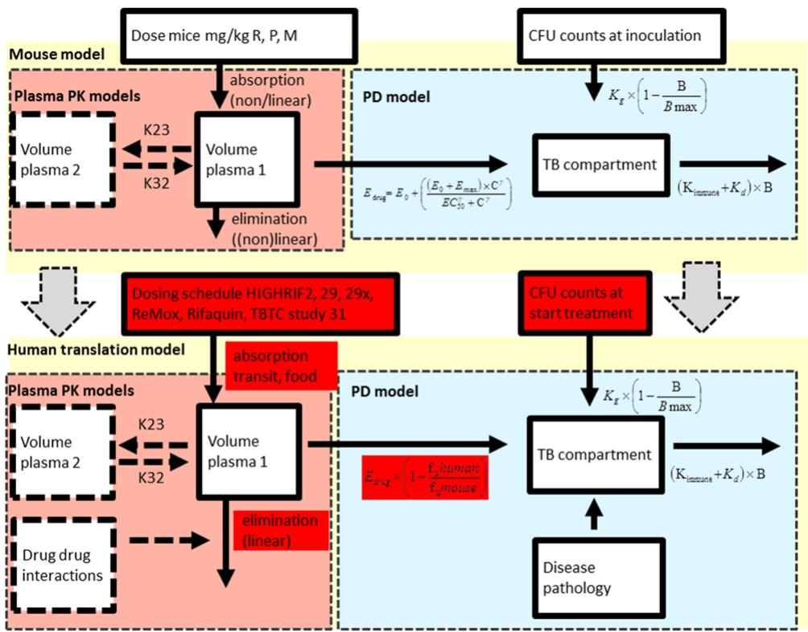

flowchart

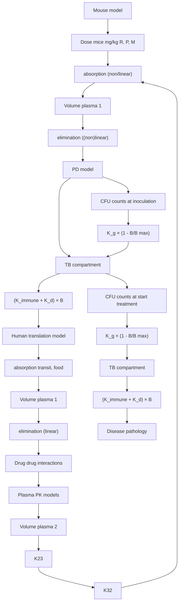

Figure 1 A translational pharmacokinetic/pharmacodynamic (PK/PD) model derived from mouse data used to predict colony forming unit (CFU) counts in patients. In this translational model, we assumed the following characteristics: (i) that the rate of bacterial growth in BALB/c mice and in human patients with drug-sensitive pulmonary tuberculosis (TB) are the same, and (ii) that the concentrationresponse relationship in mice and human patients at the site of action is the same. Therefore, the parameters assumed to be equivalent to the preclinical values are not highlighted, whereas the patient-based parameters are highlighted in red. Baseline, number of bacteria at inoculation; $\mathsf { B } _ { \mathsf { m a x } } ,$ maximum number of bacteria; $\gamma ,$ the sigmoidicity factor, which defines the shape of the relationship; γ immune response, the sigmoidicity factor, which defines the shape of the immune system – bacterial effect relationship; $\Pi _ { 5 0 } ,$ the time that produces 50% of the maximum immune effect; $\mathsf { K } _ { \mathsf { d e a t h } } .$ , bacterial death constant; ${ \sf K } _ { \sf { g r o w t h } }$ , bacterial growth constant; M, moxifloxacin; P, rifapentine; R, rifampin; $\theta _ { \mathsf { K D O } \mathsf { l } . 0 } ,$ immune killing rate in treated animals at average incubation time; $\theta _ { \mathsf { K D O } \mathsf { l } , \mathsf { t } } ,$ , the increase in killing rate in experiments with a longer than average incubation period; $\theta _ { \mathsf { K I N D } }$ , the maximum immune dependent killing rate in untreated animals; $\mathsf { E C } _ { 5 0 } ,$ the antibiotic concentration that produces 50% of the maximum effect; $\mathsf { E _ { \mathrm { d r u g } } } ,$ effect with a certain drug treatment; $\mathsf { E } _ { \mathsf { m a x } }$ , the maximal achievable effect with a certain drug treatment.

Numbers of relapse-free and culture-negative subjects were estimated as the numbers of patients with CFU <1 at the relevant time points. Long-term treatment response was defined as the number of patients with CFU <1 at 1 year (using a cure boundary).33

# RESULTS

# Pharmacokinetics of rifampin, rifapentine, and moxifloxacin in mice and human patients

The model building process of PK in mice and results are described in detail in Supplementary Table S2 and final model results are shown in Figure ${ \tt r a } ,$ Supplementary Table $\$ 12,$ and Supplementary Figure S1. For none of the three drugs were area under the curve (AUC) and peak plasma concentration $( \mathsf { C } _ { \mathsf { m a x } } )$ comparable to those in patients receiving the same mg/kg dose at steady-state concentration (Supplementary Figure S2). In addition, these exposure parameters could not be predicted using conventional allometric scaling of CL and ${ \mathsf { V } } _ { \mathsf { d } } ,$ , demonstrating that we should not rely on mouse dosing or allometric scaling34,35 of preclinical PK parameters alone to predict clinical PK or equivalent doses.

# Model describing bacterial growth dynamics, with or without treatment, in immune-competent and immune-deficient mice

The Gompertz model (Eq. (1)) was used to describe the number of viable bacteria as a function of net growth rate $( K _ { n e t } )$ and the maximum growth rate when the mouse lung is saturated $( B _ { m a x } ) ^ { 3 6 }$ (Figure 3a). As incubation times varied between experiments, a binomial distribution of ε (variability on baseline estimation) improved the model ( objective function value [OFV] = −8.6; df +1; P < 0.01). $K _ { n e t }$ did not significantly differ among experiments with either a long or short incubation period (0.68 relative standard error [RSE] 5% vs. 0.64 RSE 6%, respectively). In addition, $K _ { n e t }$ was similar in BALB/c mice and nude mice (0.63 day−1 RSE 6% vs. $0 . 6 9 ~ \mathsf { d a y } ^ { - 1 }$ RSE 26%, respectively). However, CFU counttime profiles of immune-competent mice showed that $K _ { n e t }$ gradually reduced due to the onset of the adaptive immune response $( K _ { i m m u n e } )$ .

$$
\frac {\mathrm{dB}}{\mathrm{dt}} = K _ {n e t} \times \left(1 - \frac {B}{B _ {\max}}\right) \times B - (K _ {i m m u n e}) \times B \tag {1}
$$

Table 2 Parameters used for translational pharmacokinetic/pharmacodynamic model of rifampin, rifapentine, and moxifloxacin to predict colony forming unit counts in patients 

<table><tr><td>Parameters</td><td>Parameter</td><td>Rifampin</td><td>Rifapentine</td><td>Moxifloxacin</td></tr><tr><td>Protein binding</td><td> $Ratio^a$ </td><td>0.11  $patients^{25}/0.04 mice^6$ </td><td>0.02  $patients^{23}/0.04 mice^{24}$ </td><td>0.55  $patients^{22}/0.69 mice^{22}$ </td></tr><tr><td rowspan="5">PK model patients</td><td>Model</td><td>1-Compartment linear model</td><td>2-Compartment linear model, with induction of CL over time and dose dependent bioavailability</td><td>2-Compartment linear model</td></tr><tr><td rowspan="2">PK parameters</td><td>CL: 602.4 L/day $^{18}$ V1: 69.5 LKA: 27.6/dayLAG: 0.1 day</td><td>CL: 44.6 L/day*1.2 (induction) $^7$ </td><td>CL: 254.4 L/day $^{17}$ V1: 114 LV2: 89.8 LKA: 6 day-1</td></tr><tr><td>Dose-dependent clearance:CL (600 mg R): 602.4 L/day $^{19}$ CL (900 mg R): 446.4 L/day $^{19}$ CL (1,200 mg R): 391.2 L/day $^{19}$ </td><td>V2: 51.7 mg/L $^5$ V2 (600 mg): 53.2 mg/LV2 (900 mg and 1,200 mg): 53.2 mg/LKA: 40.56 d $^{-1}$   $^5$ KA (600 mg R): 27.6 d $^{-1}$ KA (900 mg R): 27.6 d $^{-1}$ KA (1,200 mg R): 27.6 d $^{-1}$ F1 (fraction): $^{7,20}$ 600-mg dose 0.91900-mg dose 0.831,200-mg dose 0.74</td><td>Q: 51.36 L/dayF1: 1</td></tr><tr><td>Drug-drug interaction</td><td></td><td></td><td>P on M: CL*1.08 $^{21}$ R on M: CL*1.30 $^{31}$ </td></tr><tr><td>Food effect</td><td>NA</td><td>F (fraction) at 1,200 mg dose: $^{20}$ Fasting fraction 0.76Low-fat food fraction 0.82High-fat fraction 0.86Egg fraction 0.82</td><td>NA</td></tr><tr><td rowspan="2">PK/PD model TB patients</td><td>Baseline model</td><td> $\frac{\mathrm {dB}}{\mathrm {dt}} = K_{\text {net}} \times B - (K_{\text {immune}} + E_{\text {drug}}) \times B$ Baseline CFU count: 6 log $_{10}$  CFU/mL $^{26}$ K $_{net}$ : 0.65 (derived from mouse model)K $_{immune}$ : 1.22 × 10 $^{-3}$  d $^{-1}$ (maximum immune effect derived from mouse model)</td><td></td><td></td></tr><tr><td>Drug effect</td><td> $E_{drug} = E_0 + (\frac{(E_0 + E_{max}) \times C_{adj}^{\gamma}}{EC_{50}^{\gamma} + C_{adj}^{\gamma}})$ Derived from mouse model:EC50: 1.77 mg/Lγ: 0.23E $_{max}$ : 1.64 d $^{-1}$ additional effect E $_{HZ}$ :0.0172 d $^{-1}$ additional effect E $_{HZE}$ :0.0243 d $^{-1}$ additional effect E $_{MZ}$ : 0.161 d $^{-1}$ </td><td> $E_{drug} = E_0 + (\frac{(E_0 + E_{max}) \times C_{adj}^{\gamma}}{EC_{50}^{\gamma} + C_{adj}^{\gamma}})$ Derived from mouse model:EC50: 0.50 mg/Lγ: 0.86E $_{max}$ : 1.00 d $^{-1}$ additional effect E $_{HZ}$ : -0.0156 d $^{-1}$ additional effect E $_{MZ}$ : 0.07 d $^{-1}$ </td><td> $E_{drug} = E_0 + (E \times C_{adj})$ Derived from mouse model:E: 3.279 g/Ladditional effect E $_{E}$ : 0.0344 d $^{-1}$ </td></tr><tr><td rowspan="2">Disease pathology</td><td>PK/PD at the site of action</td><td colspan="3">Prolonged retention time at site of action: Effect compartment with 10% longer retention compared with plasma $^{27}$ Rifapentine EC $_{50}$  fourfold higher in cavity compared with noncavity $^{28}$ </td></tr><tr><td>Immunity</td><td colspan="3">Reduced levels of immunity by changing the immune parameters between 0 and the estimated effectKimmune = 0– max 1.22 × 10 $^{-3}$ d $^{-1}$ </td></tr><tr><td rowspan="2">Dosing schedules</td><td>REMox-TB trial</td><td colspan="3">Control arm: (Months 0–2) Rifampin 10 mg/kg, isoniazid 300 mg, pyrazinamide 25 mg/kg, and ethambutol 20 mg/kg, daily; (Months 2–6) Rifampin 10 mg/kg and isoniazid 300 mg daily.Ethambutol arm: (Months 0–2) Rifampin 10 mg/kg, moxifloxacin 400 mg, pyrazinamide 25 mg/kg, and ethambutol 20 mg/kg daily; (Months 2–4) Rifampin 10 mg/kg and moxifloxacin 400 mg daily</td></tr><tr><td>Rifaquin trial</td><td colspan="3">Control arm: (Months 0–2) Rifampin 10 mg/kg, isoniazid 300 mg, pyrazinamide 25 mg/kg, and ethambutol 20 mg/kg daily; (Months 2–6) Rifampin 10 mg/kg and isoniazid 300 mg daily.Four-month arm: (Months 0–2) Rifampin 10 mg/kg, moxifloxacin 400 mg, pyrazinamide 25 mg/kg, and ethambutol 20 mg/kg daily; (Months 2–4) Rifapentine 15 mg/kg and moxifloxacin 400 mg twice weekly.Six-month arm: (Months 0–2) Rifampin 10 mg/kg, moxifloxacin 400 mg, pyrazinamide 25 mg/kg, and ethambutol 20 mg/kg daily; (Months 2–6) Rifapentine 20 mg/kg and moxifloxacin 400 mg weekly.</td></tr></table>

(Continued)

Table 2 Continued 

<table><tr><td>Parameters</td><td>Parameter</td><td>Rifampin</td><td>Rifapentine</td><td>Moxifloxacin</td></tr><tr><td></td><td>TBTC study 31</td><td colspan="3">Control arm: (Months 0–2) Rifampin 10 mg/kg, isoniazid 300 mg, pyrazinamide 25 mg/kg, and ethambutol 20 mg/kg daily; (Months 2–6) Rifampin 10 mg/kg and isoniazid 300 mg daily. Four-month arm: Rifapentine arm: (Months 0–2) Rifapentine 1,200 mg, isoniazid 300 mg, pyrazinamide 25 mg/kg, and ethambutol 20 mg/kg daily; (Months 2–4) Rifapentine 1,200 mg and isoniazid 300 mg daily. Rifapentine and moxifloxacin arm: (Months 0–2) Rifapentine 1,200 mg, isoniazid 300 mg, moxifloxacin 400 mg, and pyrazinamide 25 mg/kg daily; (Months 2–4) Rifapentine 1,200 mg, isoniazid 300 mg, and moxifloxacin 400 mg daily.</td></tr></table>

CFU, colony forming unit; CL, clearance; F1, bioavailability; KA, absorption constant; LAG, lag-time; M, moxifloxacin; NA, not applicable; P, rifapentine; PD, pharmacodynamic; $\mathsf { P K } ,$ pharmacokinetic; Q, the intercompartmental rate; TB, tuberculosis; V1, volume of distribution of the central compartment; V2, volume of distribution of the second compartment.   
Baseline, number of bacteria at inoculation; $\mathsf { B } _ { \mathsf { m a x } } ,$ , maximum number of bacteria; $\mathsf { E _ { d r u g } } ,$ effect with a certain drug treatment; $\mathsf { E } _ { \mathsf { m a x } } ,$ the maximal achievable effect with a certain drug treatment; $\mathsf { E C } _ { 5 0 } ,$ , the antibiotic concentration that produces 50% of the maximum effect; $\mathsf { K } _ { \mathsf { n e t } }$ , bacterial net growth constant; $\mathsf { K } _ { \mathsf { i m m u n e } } ,$ , estimated immune killing rate (at maximum effect as observed in mice); γ , the sigmoidicity factor that defines the shape of the relationship; $\complement _ { \mathsf { a d j } } ,$ adjusted concentration: the free fraction of drug in plasma was presumed to be the active fraction, therefore, the effective concentration in patients was adjusted using the ratio in free fraction between humans and mice was derived from the literature.   
aRatio of free fraction in humans/free fraction in mice.   
The parameters assumed to be equivalent to the preclinical values derived in mice are not highlighted, whereas the patient-based and literature derived parameters are highlighted in red.

B  bacterial count in mouse lungs (log CFU); $B _ { m a x } = \mathsf { m a x } -$ imal bacterial count that can be reached in mouse lungs; $K _ { g } =$ bacterial growth rate; and $K _ { d } =$ natural bacterial death rate.

In Eq. (1), the onset of the adaptive immune-dependent killing effect $( K _ { i m m u n e } )$ was first introduced using a lag-time $( \Delta 0 \mathsf { F V } - 4 3 . 5 ;$ ; df $+ 2 ; P < 0 . 0 1 )$ ). A sigmoid-shaped function with γ as the sigmoidicity factor and an onset $( \Pi _ { 5 0 } )$ 4 weeks after incubation improved the model $\begin{array} { r } { ( \Delta \mathsf { O F V } = - 7 5 ; } \end{array}$ df −2; $P < 0 . 0 0 1 ;$ ; Eq. (2) left). This time-varying function optimally described the immune system-time-bacterial effect relationship (Figure 3b).

$$
\begin{array}{l} K _ {i m m u n e} = \left(\frac {\theta_ {K I N D} \times \mathsf {t i m e} ^ {\gamma}}{I T _ {5 0} ^ {\gamma} + \mathsf {t i m e} ^ {\gamma}}\right) \\ + \left(\theta_ {\mathrm{KDOI.0}} + \frac {\text {incubation time}}{\text {mean}} \times \theta_ {\mathrm{KDOI.t}}\right) \tag {2} \\ \end{array}
$$

Based on data from treated and untreated BALB/c mice, $K _ { i m m u n e }$ was further separated into immune-dependent killing in the absence (Eq. (2) left; Figure 3b) or presence (Eq. (2) right; Figure 3c) of drugs. In treated animals, the effect of the immune function showed a linear correlation with time after inoculation using $\theta _ { K D O I }$ in Eq. (1) (in the presence of drugs, $\theta _ { K I N D } = 0 )$ . This linear model showed an improved fit compared with a categorical model of chronic and acute infection (OFV = −20; df $- 1 ; P < 0 . 0 1 )$ with a minimum incubation period of 3 days. The estimated immune-dependent killing effect resulted in distinctly different profiles in acute and chronic mouse infection models (Figure 3c).

The observed and predicted data of immune-dependent killing and drug-dependent killing are shown in Figure 2b and model parameters are presented in Supplementary Table S1b.

# Drug effect model in mice

In the full PK/PD model, the bacterial growth dynamics submodel and the mouse population PK model were combined, and equations were introduced that characterized the effect that the drug imposed on the bacteria (Supplementary Table S1).

Models with individual drug effects $( E _ { d r u g } )$ enhancing the bacterial death rate (Eq. (3) using an additive, or Eq. (4) a proportional model) or inhibiting the bacterial growth rate (Eq. (5)) were first evaluated by dose level and concentration level. In these subanalyses, $K _ { n e t }$ was separated into a bacterial growth rate $( K _ { g } )$ and a natural bacterial death rate $( K _ { d }$ , Eq. $( 3 ) - ( 5 ) ) . ^ { 3 6 } \mathsf { A } K _ { g }$ of 0.78/day was adapted from Gill et al.37 (day 0–13 experiment).

$$
\begin{array}{l} \frac {\mathrm{dB}}{\mathrm{dt}} = K _ {g} \times \left(1 - \frac {\mathrm{B}}{B _ {\max}}\right) \\ \times \mathsf {B} - \left(K _ {d} + K _ {I N D} + K _ {D O I} + E _ {d r u g}\right) \times \mathsf {B} \tag {3} \\ \end{array}
$$

$$
\frac {\mathrm{dB}}{\mathrm{dt}} = K _ {g} \times \left(1 - \frac {\mathrm{B}}{B _ {\max}}\right)
$$

$$
\times \mathsf {B} - \left([ K _ {d} + K _ {I N D} + K _ {D O I} ] \times \left[ 1 + E _ {d r u g} \right]\right) \times \mathsf {B} \tag {4}
$$

$$
\frac {\mathrm{dB}}{\mathrm{dt}} = K _ {g} \times \left(1 - E _ {\text { drug }}\right) \times \left(1 - \frac {\mathrm{B}}{B _ {\max}}\right)
$$

$$
\times \mathsf {B} - (K _ {d} + K _ {I N D} + K _ {D O I}) \times \mathsf {B} \tag {5}
$$

# Rifampin

Dose-mediated bacterial killing by rifampin was best described with a function of drug effect enhancing bacterial death rate (Eqs. (3) and (4); Supplementary Figure 4a) compared with inhibiting bacterial growth (Eq. (5); $\Delta O F \lor =$ −937; df $0 ; P < 0 . 0 1 )$ . Proportional and additive models (Eqs. (3) and (4)) provided the same results. The bacterial-killing effect of rifampin was nonlinearly dependent on drug dose and concentration level (Supplementary Figure S4a). A nonlinear $\mathsf { E } _ { \mathsf { m a x } }$ model significantly improved the model fit compared with a linear model $( \Delta { \sf O F V } = - 7 1 8 ;$ df $+ 1 ; P < 0 . 0 1$ ; Supplementary Figure S4a). A sigmoidal $\mathsf { E } _ { \mathsf { m a x } }$ function (Eq. (7)) with an $\mathsf { E C } _ { 5 0 }$ of 1.79 mg/L $( \mathsf { R S E } = 2 0 \% )$ best described the concentration-effect relationship in mice (Supplementary Figure $\mathtt { s 4 a , b , e } _ { \mathtt { i } }$ , Supplementary Table S1c). Inclusion of delayed effect did not significantly improve the model $( \Delta O F V - 1 . 4 ; \mathsf { d f } - 1 ; P = 0 . 2 3 7 )$ ). This model was able to predict CFU change at dosing frequencies of 1, 2, and 5 days per week (Supplementary Figure S4e).

a   
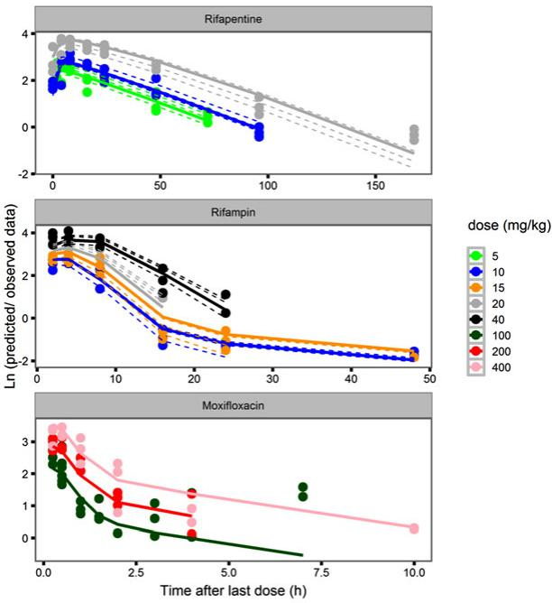

b   
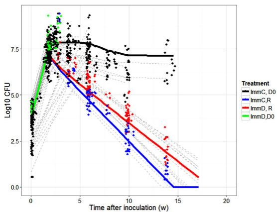

line

| Time after inoculation (w) | ImmC, D0 | ImmC,R | ImmD, R | ImmD,D0 |
| ------------------------- | -------- | ------ | ------- | ------- |
| 0                         | 7.5      | 7.5    | 7.5     | 7.5     |
| 5                         | 7.5      | 5.0    | 5.0     | 5.0     |
| 10                        | 7.5      | 2.5    | 2.5     | 2.5     |
| 15                        | 7.5      | 0.0    | 0.0     | 0.0     |
| 20                        | 7.5      | 0.0    | 0.0     | 0.0     |

Figure 2 (a) Observed and model-predicted concentrations of moxifloxacin, rifapentine and rifampin per dose level (in mg/kg). Solid lines are population predicted values, dotted lines are individual predicted values (no inter-individual variability could be estimated in the moxifloxacin model) and dots are the observed data. (b) Observed and model-predicted colony forming unit (CFU) counts of several components of the pharmacokinetic/pharmacodynamic (PK/PD) data and model: CFU counts in untreated immune competent (black) and immune deficient (green) mice and the effect of treatment with rifampin 10 mg/kg, isoniazid 10 mg/kg, and pyrazinamide 150 mg/kg in immune competent (blue) and immune deficient (red) mice. Solid lines are population predicted values, dotted gray lines are individual predicted trial results (in which variability in baseline and $\mathsf { B } _ { \mathsf { m a x } }$ was included and dots are the observed data.

$$
E _ {\text { drug }} = E \times C \tag {6}
$$

$$
E _ {d r u g} = \left(\frac {E _ {\max} \times \mathbf {C} ^ {\gamma}}{E \mathbf {C} _ {5 0} ^ {\gamma} + \mathbf {C} ^ {\gamma}}\right) \tag {7}
$$

$E _ { m a x }$ indicates the maximal achievable antibacterial effect with a certain drug; $E C _ { 5 0 }$ is antibiotic concentration producing 50% of $E _ { m a x } ;$ and γ is the sigmoidicity factor.

# Rifapentine

A function to describe the dose-response enhancing the bacterial death rate was also the best fit for rifapentine (Eq. (3)) as compared with a model with drug effect inhibiting bacterial growth (Eq. (5); $\Delta O F V = - 6 8 6 ;$ df $0 ; P = 0 . 0 0 1$ ; Supplementary Figure S4c). The concentration-effect relationship was best described using a sigmoidal $\mathsf { E } _ { \mathsf { m a x } }$ model (Eq. (7)) with an $\mathsf { E C } _ { 5 0 }$ of 0.5 mg/L $( \mathsf { R S E } = 4 6 \% ;$ Figure $\mathfrak { s e } ;$ Supplementary Figure $\texttt { s 4 c , d , }$ and Supplementary Table S1c).

Comparison of rifamycin concentration-effect relationships in mice shows that at the same concentration, rifampin $\mathsf { E } _ { \mathsf { m a x } }$ is significantly higher and $1 \mathsf { C } _ { 9 0 }$ lower compared with rifapentine (Supplementary Table S1; Supplementary Figure S5a). However, in these once-daily dosing studies, the $\mathsf { E C } _ { 9 0 }$ of rifapentine was reached for a prolonged time period compared with rifampin at the same dose level. In mice receiving 10 mg/kg 5 days/week, rifapentine reached the $\mathsf { E C } _ { 9 0 }$ of 0.9 day−1 75% of the time, vs. 25% for rifampin (Supplementary Figure S5b).

# Moxifloxacin

The drug-mediated-killing effect of moxifloxacin was tested in combination with isoniazid and pyrazinamide. The PK/PD model for moxifloxacin could be described with a drug effect either inhibiting the bacterial growth rate or enhancing the bacterial death rate $\begin{array} { r } { ( \Delta 0 \mathsf { F V } = + 1 ; } \end{array}$ df +0; NS). In the dose range of 0–200 mg/kg, the data were best described using a linear correlation (Eq. (6)) between moxifloxacin concentration and drug effect (Figure 3g; Supplementary Figure S4f). The $\mathsf { E C } _ { 5 0 }$ of moxifloxacin in mice was not reached with a 200 mg/kg dose, corresponding to an AUC between 40 and 45 mg\*h/L, equivalent to that observed in patients receiving 400 mg (Supplementary Figure S2 and Supplementary Table S1c).

# Composite drug effect of combination treatment

The effect of other components in the drug regimen (i.e., 150 mg/kg pyrazinamide, 25 mg/kg isoniazid, and/or 100 mg/kg ethambutol) was described using an extra efficacy term: (E0) on $K _ { d }$ (Eq. (8)) to capture antagonistic, additive, or synergistic effects of the additional drugs.

$$
E _ {\text { drug }} = E _ {0} + \left(\frac {(E _ {0} + E _ {\max}) \times \mathbf {C} ^ {\gamma}}{E \mathbf {C} _ {5 0} ^ {\gamma} + \mathbf {C} ^ {\gamma}}\right) \quad \text { or }
$$

$$
E _ {\text { drug }} = E _ {0} + (E \times C _ {\text { moxifioxacin }}) \tag {8}
$$

Only a small beneficial effect of adding once daily dosing of 150 mg/kg pyrazinamide and 25 mg/kg isoniazid, with or without 100 mg/kg ethambutol, to rifampin was estimated; HZ to rifampin $( E _ { H Z } )$ was $0 . 0 1 7 { \mathrm { ~ d } } ^ { - 1 }$ (RSE 59%) and E on top of RHZ $( E _ { H Z E } )$ was $0 . 0 2 4 ~ \mathsf { d } ^ { - 1 }$ (RSE 97%; Figure 3f; Supplementary Table S1c, and Supplementary Figure S4b).

A small but significant decrease in drug effect was estimated when adding daily pyrazinamide and isoniazid to rifapentine $( E _ { \mathsf { P H Z } }$ by −0.015; RSE 50; Figure 3f, and Supplementary Table S1c).

The effect of a regimen including moxifloxacin at both dose levels in combination with rifampin 10 mg/kg or rifapentine 10 mg/kg, pyrazinamide and ethambutol (but not isoniazid) were larger compared with the control group with isoniazid instead of moxifloxacin (Supplementary Figure S4g). Simulations of moxifloxacin 200 mg/kg alone using the estimates of its contribution to the combination with rifampin and pyrazinamide predicted only limited bacteriostatic activity, whereas, in prior studies, a bactericidal effect of moxifloxacin monotherapywas observed in mice38,39 (Figure 3g, gray line). The efficacy of moxifloxacin was larger when it was combined with rifampin at 10 mg/kg $( 0 . 1 6 1 { \mathrm { ~ d } } ^ { - 1 } ;$ RSE 3%; compared with rifapentine at 10 mg/kg; $0 . 0 7 ~ { \mathsf { d } } ^ { - 1 }$ ; RSE 50%; Supplementary Table S1c and Supplementary Figure S4g). Also, only a small beneficial effect of adding ethambutol (0.0344 d−1; RSE: 30%) to the RMZ combination was estimated (Supplementary Table S1c).

# Clinical trial simulations using a translational pharmacokinetic/pharmacodynamic model

A visual presentation of the translational PK/PD model is shown in Figure 1 and parameters are shown in Table 2.

# Can the translational model predict pharmacokinetic/pharmacodynamic relationships in patients?

We tested dose increases of rifampin and rifapentine and compared results to observations in the TBTC study 29X,7 HIGHRIF2,19 and PanACEA MAMS trials.40 Rifapentine dose escalation from 10 to 40 mg/kg had a beneficial effect on regimen efficacy (Supplementary Figure S6a), and the predicted responses were in agreement with the observed data of TBTC study 29X,7 (Table 3 and Supplementary Figure S7a). Proportions of participants predicted to have negative cultures at 8 weeks were comparable to observed data in all rifapentine arms: for 10 mg/kg, 88.6% predicted (95% confidence interval [CI], 82–94%) vs. 87.1% observed; for 15 mg/kg, 97% predicted (95% CI, 93–100%) vs. 96.7% observed; for 20 mg/kg, 98.8% predicted (95% CI, 95–100%) vs. 89.7% observed, respectively (Supplementary Figure S7c, Table 3). None of the patients was predicted to relapse at 1 year after completing 4–6 months of treatment.

To account for possible overprediction by the model, we explored revising the expected PK/PD relationship for rifapentine in the presence of cavitary TB. Rifapentine penetration into cavitary lesions may be reduced.28 In TBTC studies 29 and 29X, one-third of the subjects had cavitary lesions.28 In those with cavities -4 cm, a higher exposure did not reduce the estimated average time to stable culture conversion, whereas in others without large cavities, a clear exposure-response relationship was observed.28 Supplementary Figure S6e shows simulation results of a weaker rifapentine-mediated killing effect in cavities.

Consistent with results from recent clinical trials,18,19,40 our simulations showed that high-dose rifampin (35–40 mg/kg) improved treatment outcomes (Supplementary Figure S6b). The proportion of participants predicted to be culturenegative at 8 weeks for rifampin at 10 mg/kg was 38.5% (95% CI, 30–47) vs. 77% observed; at 15 mg/kg, 60.9% (95% CI, 50.5–70) vs. 74% observed; and at 20 mg/kg, 72.2% (95% CI, 63.5–80) vs. 80% observed, showing underprediction of rifampin’s killing effect at 10 mg/kg, but more accurate prediction for higher doses (Supplementary Figure S7b, Table 3). One year after completing 6 months of treatment (assuming 4 months of $\mathsf { H R } _ { 1 0 \mathsf { m g / k g } }$ in the continuation phase), 3% of patients were predicted to relapse in the control arm vs. 3% observed, and in the 35 mg/kg rifampin group none of the patients was predicted to relapse, which is in agreement with the PanACEA MAMS trial results40 (Supplementary Figure S7d, Table 3).

Rifampin shows prolonged retention and accumulation in caseous lung lesions.27 The relatively rapid clearance from plasma may enhance this effect in comparison with other drugs.27 Therefore, we explored whether a prolonged retention time at the site of action might account for the underprediction of the rifampin 10 mg/kg effect at 8 weeks.27

Supplementary Figure S6c shows that, at 10% retention in the lung, the drug-mediated decline in CFU counts is steeper. Thus, including disease pathology in the model produced better predictions of PK/PD relationships for both rifamycins. The model confirmed the observed efficacy of rifampin-containing regimens, including improved outcomes with higher doses.18 The model also confirmed the clinical observation that increasing the rifapentine dose had only a small beneficial effect on the responses in subjects with cavities -4 cm.28 The results suggest that the influence of caseous lesions on rifamycin distribution and retention is one reason that PK/PD relationships based on plasma exposures in BALB/c mice may not translate directly to human patients with cavitary TB.

# Can the translational model predict long-term efficacy?

We tested substituting moxifloxacin for isoniazid and compared the results to observations from the REMox-TB11 and Rifaquin12 trials. This substitution did not improve predicted outcomes for patients receiving rifampin (Supplementary Figure S8a), but did improve predicted outcomes for those receiving rifapentine (Supplementary Figure S8b).

Simulations of the REMox-TB11 and the Rifaquin12 trials are shown in Figure 4a. They did not predict the modest beneficial effect of substituting moxifloxacin for isoniazid on sputum culture conversion at 8 weeks observed in the REMox-TB and Rifaquin trials (Supplementary Figure S8, Table 3). However, as observed in both trials, the simulations predicted that the substitution was insufficient to shorten the treatment duration to 4 months (Figure 4a). In the REMox-TB trial, the number of relapse-free patients in the 4-month 2RMZE/2RM arm was 65% (95% CI, 55–74) predicted vs. 80% observed; and in the control arm 97% (95% CI, 93–99) predicted vs. 92% observed (Figure 4b, Table 3). In the

a   
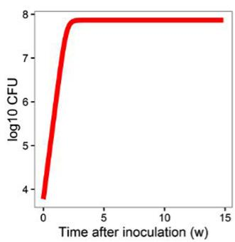

line

| Time after inoculation (w) | log10 CFU |
| ------------------------- | --------- |
| 0                         | 3.8       |
| 2                         | 7.8       |
| 5                         | 7.9       |
| 10                        | 7.9       |
| 15                        | 7.9       |

b   
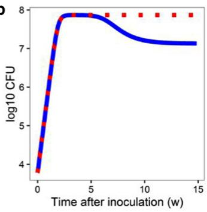

line

| Time after inoculation (w) | log10 CFU |
| -------------------------- | --------- |
| 0                          | 3.8       |
| 1                          | 6.0       |
| 2                          | 7.8       |
| 3                          | 7.9       |
| 4                          | 7.9       |
| 5                          | 7.8       |
| 6                          | 7.7       |
| 7                          | 7.6       |
| 8                          | 7.5       |
| 9                          | 7.4       |
| 10                         | 7.3       |
| 11                         | 7.2       |
| 12                         | 7.1       |
| 13                         | 7.1       |
| 14                         | 7.1       |
| 15                         | 7.1       |

C   
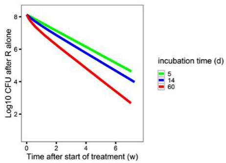

line

| Time after start of treatment (w) | log10 CFU after R alone (incubation time 5 d) | log10 CFU after R alone (incubation time 14 d) | log10 CFU after R alone (incubation time 60 d) |
| --------------------------------- | --------------------------------------------- | --------------------------------------------- | --------------------------------------------- |
| 0                                 | 8.0                                           | 8.0                                           | 8.0                                           |
| 2                                 | ~7.5                                          | ~7.0                                          | ~6.5                                          |
| 4                                 | ~6.5                                          | ~6.0                                          | ~5.0                                          |
| 6                                 | ~5.5                                          | ~5.0                                          | ~3.5                                          |
| 8                                 | ~4.5                                          | ~4.0                                          | ~2.5                                          |

d   
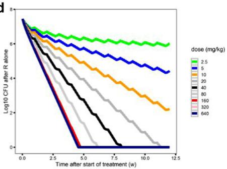

line

| Time after start of treatment (w) | dose (mg/kg) 2.5 | dose (mg/kg) 5 | dose (mg/kg) 10 | dose (mg/kg) 20 | dose (mg/kg) 40 | dose (mg/kg) 80 | dose (mg/kg) 160 | dose (mg/kg) 320 | dose (mg/kg) 640 |
| --------------------------------- | ---------------- | -------------- | --------------- | --------------- | --------------- | --------------- | ---------------- | ---------------- | ---------------- |
| 0.0                               | 7.5              | 7.5            | 7.5             | 7.5             | 7.5             | 7.5             | 7.5              | 7.5              | 7.5              |
| 2.5                               | 6.5              | 6.5            | 6.5             | 6.5             | 6.5             | 6.5             | 6.5              | 6.5              | 6.5              |
| 5.0                               | 5.5              | 5.5            | 5.5             | 5.5             | 5.5             | 5.5             | 5.5              | 5.5              | 5.5              |
| 7.5                               | 4.5              | 4.5            | 4.5             | 4.5             | 4.5             | 4.5             | 4.5              | 4.5              | 4.5              |
| 10.0                              | 3.5              | 3.5            | 3.5             | 3.5             | 3.5             | 3.5             | 3.5              | 3.5              | 3.5              |
| 12.5                              | 2.5              | 2.5            | 2.5             | 2.5             | 2.5             | 2.5             | 2.5              | 2.5              | 2.5              |

e   
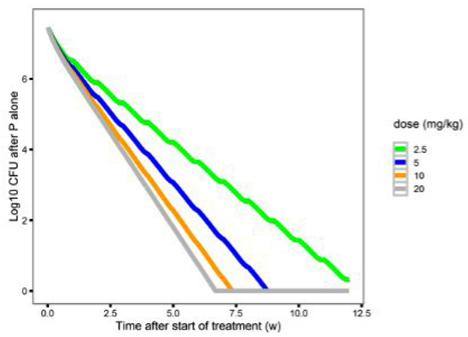

line

| Time after start of treatment (w) | dose (mg/kg) | Log10 CFU after P alone |
| --------------------------------- | ------------ | ------------------------ |
| 0.0                               | 2.5          | 6.0                      |
| 2.5                               | 5            | 4.5                      |
| 5.0                               | 10           | 3.0                      |
| 7.5                               | 20           | 1.5                      |
| 10.0                              | 2.5          | 0.5                      |
| 12.5                              | 2.5          | 0.0                      |

f   
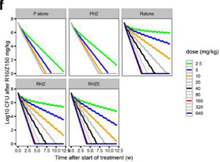

line

| Treatment | Time (w) | dose (mg/kg) | Log10 CFU after R10/250 mg/kg |
| :--- | :--- | :--- | :--- |
| P alone | 0.0 | 2.5 | 8 |
| P alone | 2.5 | 5 | 7 |
| P alone | 5.0 | 10 | 6 |
| P alone | 7.5 | 20 | 5 |
| P alone | 10.0 | 40 | 4 |
| P alone | 12.5 | 80 | 3 |
| PHZ | 0.0 | 2.5 | 8 |
| PHZ | 2.5 | 5 | 7 |
| PHZ | 5.0 | 10 | 6 |
| PHZ | 7.5 | 20 | 5 |
| PHZ | 10.0 | 40 | 4 |
| PHZ | 12.5 | 80 | 3 |
| Ralone | 0.0 | 2.5 | 8 |
| Ralone | 2.5 | 5 | 7 |
| Ralone | 5.0 | 10 | 6 |
| Ralone | 7.5 | 20 | 5 |
| Ralone | 10.0 | 40 | 4 |
| Ralone | 12.5 | 80 | 3 |
| RHZ | 0.0 | 2.5 | 8 |
| RHZ | 2.5 | 5 | 7 |
| RHZ | 5.0 | 10 | 6 |
| RHZ | 7.5 | 20 | 5 |
| RHZ | 10.0 | 40 | 4 |
| RHZ | 12.5 | 80 | 3 |
| RHZE | 0.0 | 2.5 | 8 |
| RHZE | 2.5 | 5 | 7 |
| RHZE | 5.0 | 10 | 6 |
| RHZE | 7.5 | 20 | 5 |
| RHZE | 10.0 | 40 | 4 |
| RHZE | 12.5 | 80 | 3 |
The chart displays a line graph with 'Time after start of treatment' on the x-axis and 'Log10 CFU after R10/250 mg/kg' on the y-axis, with each line representing a different dose level. The legend indicates 'dose (mg/kg)' values ranging from 2.5 to 640 mg/kg, though no specific data points are labeled in the image.

g   
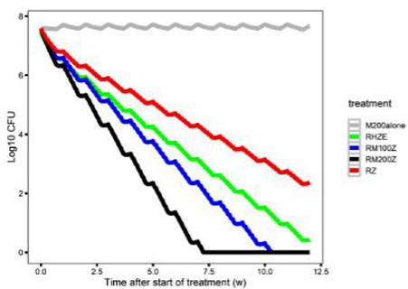  
Figure 3 Components of the pharmacokinetic/pharmacodynamic (PK/PD) model. (a) Baseline model of bacterial growth in mice without immune function (red). (b) Bacterial growth in untreated mice is dependent on the immune competency (immune-competent BALB/c mice, blue; immune-deficient nude mice, red). (c) The additive effect of immune function on the killing effect of rifampin (R) alone is smaller in acute infection models (5-day [green] or 14-day [blue] incubation period prior to treatment onset [time 0]) compared with a chronic infection model (61-day incubation period (red). Simulation of the concentration-colony forming unit (CFU) count relationship of (d) rifampin alone, or (e) rifapentine (P) alone, at different dose levels tested in the mouse model. (f) The effect of combining R or P with isoniazid (H) 25 mg/kg and pyrazinamide (Z) 150 mg/kg ± E 100 mg/kg in immune-competent mice. (g) The estimated effect of moxifloxacin in combination with R10 mg/kg and Z 150 mg/kg and predicted effect of moxifloxacin alone\*. E, ethambutol; M, moxifloxacin. \*Moxifloxacin alone simulations alone effect was based on the difference in effect between rifampin/ pyrazinamide and rifampin/moxifloxacin/pyrazinamide.

Table 3 Predictions of efficacy in clinical trials using the translational pharmacokinetic/pharmacodynamic model and comparison to the observed trial outcomes 

<table><tr><td rowspan="2">Study</td><td rowspan="2">Arm</td><td colspan="6">Predicted data 8 weeks</td><td colspan="3">1 year</td><td rowspan="2">Observed data 8 weeks Negative culture at 8  $weeks^a$ </td><td rowspan="2">End of treatment Favorable  $outcome^b$ </td></tr><tr><td colspan="3">CFU (mean, 95% CI)</td><td colspan="3">TB free (%, 95% CI)</td><td colspan="3">TB free (%, 95% CI)</td></tr><tr><td colspan="13">Study 29x</td></tr><tr><td>Control</td><td>2R10HZE/4RH</td><td>2.98</td><td>0.00</td><td>9.29</td><td>39</td><td>30</td><td>47</td><td>97</td><td>93</td><td>99</td><td>52/64 (81.3%)</td><td></td></tr><tr><td>P10</td><td>2P10HZE/4RH</td><td>0.47</td><td>0.00</td><td>3.49</td><td>89</td><td>82</td><td>94</td><td>100</td><td>100</td><td>100</td><td>54/62 (87.1%)</td><td></td></tr><tr><td>P15</td><td>2P15HZE/4RH</td><td>0.12</td><td>0.00</td><td>1.63</td><td>97</td><td>93</td><td>100</td><td>100</td><td>100</td><td>100</td><td>58/60 (96.7%)</td><td></td></tr><tr><td>P20</td><td>2P20HZE/4RH</td><td>0.11</td><td>0.00</td><td>1.51</td><td>98</td><td>95</td><td>100</td><td>100</td><td>100</td><td>100</td><td>26/29 (89.7%)</td><td></td></tr><tr><td colspan="13">HIGHRIF2/ PanACEA MAMS</td></tr><tr><td></td><td>2R10HZE/4RH</td><td>2.98</td><td>0.00</td><td>9.29</td><td>39</td><td>30</td><td>47</td><td>97</td><td>93</td><td>99</td><td>11/48 (77%)</td><td>3/105 (95%)</td></tr><tr><td></td><td>2R15HZE/4RH</td><td>1.72</td><td>0.00</td><td>7.58</td><td>61</td><td>50</td><td>70</td><td>99</td><td>97</td><td>100</td><td>12/48 (74%)</td><td></td></tr><tr><td></td><td>2R20HZE/4RH</td><td>1.19</td><td>0.00</td><td>6.59</td><td>72</td><td>63</td><td>80</td><td>100</td><td>98</td><td>100</td><td>9/47 (80%)</td><td></td></tr><tr><td colspan="13">PanACEA MAMS</td></tr><tr><td></td><td>2R35HZE/4RH</td><td>0.35</td><td>0.00</td><td>3.94</td><td>92</td><td>86</td><td>97</td><td>100</td><td>100</td><td>100</td><td></td><td>0/52 (100%)</td></tr><tr><td></td><td>2R20MHZ/4RH</td><td>0.80</td><td>0.00</td><td>4.58</td><td>82</td><td>75</td><td>90</td><td>100</td><td>99</td><td>100</td><td></td><td>0/58 (100%)</td></tr><tr><td colspan="13">REMox-TB</td></tr><tr><td>Control</td><td>2RHZE/4RH</td><td>2.98</td><td>0.00</td><td>9.29</td><td>39</td><td>30</td><td>47</td><td>97</td><td>93</td><td>99</td><td>393/474 (83%)</td><td>510/467 (92%)</td></tr><tr><td>Ethambutol-arm</td><td>2RMZE/2RM</td><td>4.43</td><td>0.00</td><td>11.68</td><td>26</td><td>18</td><td>34</td><td>65</td><td>55</td><td>74</td><td>448/517 (87%)</td><td>524/419 (80%)</td></tr><tr><td colspan="13">Rifaquin trial</td></tr><tr><td>Control</td><td>2RHZE/4RH</td><td>2.98</td><td>0.00</td><td>9.29</td><td>39</td><td>30</td><td>47</td><td>97</td><td>93</td><td>99</td><td>187/219 (85.3%)</td><td>155/163 (95%)</td></tr><tr><td>Four-months</td><td>2RMZE/2PM2week</td><td>4.43</td><td>0.00</td><td>11.68</td><td>26</td><td>19</td><td>36</td><td>79</td><td>72</td><td>87</td><td>394/436 (90.4%)</td><td>135/165 (81.8%)</td></tr><tr><td>Six-months</td><td>2RMZE/4PM1week</td><td>4.43</td><td>0.00</td><td>11.68</td><td>26</td><td>19</td><td>36</td><td>81</td><td>73</td><td>91</td><td></td><td>174/186 (93.5%)</td></tr><tr><td colspan="13">Study 31</td></tr><tr><td>Control</td><td>2RHZE/4RH</td><td>2.98</td><td>0.00</td><td>9.29</td><td>39</td><td>30</td><td>47</td><td>97</td><td>93</td><td>99</td><td>study ongoing</td><td></td></tr><tr><td></td><td>2P1200HZE/2P1200H</td><td>0.02</td><td>0.00</td><td>0.29</td><td>99</td><td>95</td><td>100</td><td>100</td><td>100</td><td>100</td><td></td><td></td></tr><tr><td></td><td>2P1200HZM/2P1200HM</td><td>0.02</td><td>0.00</td><td>0.24</td><td>99</td><td>95</td><td>100</td><td>100</td><td>100</td><td>100</td><td></td><td></td></tr><tr><td colspan="13">R to P, high-dose M</td></tr><tr><td></td><td>4RMZE</td><td>2.08</td><td>0.00</td><td>5.57</td><td>25</td><td>18</td><td>34</td><td>64</td><td>50</td><td>63</td><td></td><td></td></tr><tr><td></td><td>4RM800ZE</td><td>1.82</td><td>0.00</td><td>5.04</td><td>27</td><td>19</td><td>36</td><td>68</td><td>56</td><td>77</td><td></td><td></td></tr><tr><td></td><td>4PMZE</td><td>0.00</td><td>0.00</td><td>0.00</td><td>100</td><td>100</td><td>100</td><td>100</td><td>100</td><td>100</td><td></td><td></td></tr><tr><td></td><td>4PM800ZE</td><td>0.00</td><td>0.00</td><td>0.00</td><td>100</td><td>100</td><td>100</td><td>100</td><td>100</td><td>100</td><td></td><td></td></tr><tr><td colspan="13">R to P, high-dose M</td></tr><tr><td>Control</td><td>2RHZE/4RH</td><td>2.98</td><td>0.00</td><td>9.29</td><td>39</td><td>30</td><td>47</td><td>97</td><td>93</td><td>99</td><td></td><td></td></tr><tr><td></td><td>2R35HZE/2RH</td><td>0.35</td><td>0.00</td><td>3.94</td><td>92</td><td>86</td><td>97</td><td>100</td><td>100</td><td>100</td><td></td><td></td></tr></table>

CFU, colony forming unit; CI, confidence interval; E, ethambutol; H, isoniazid; M, moxifloxacin; P, rifapentine; R, rifampin; TB, tuberculosis; Z, pyrazinamide. aIntention to treat + solid culture data. bFavorable outcome at the end of treatment at 1 year or at the last study time point.

Rifaquin trial, the number of relapse-free patients in the 4-month arm was 79% (95% CI, 72–87) predicted vs. 81.8% observed; and in the control arm 97% (95% CI, 93–99) predicted vs. 95% observed (Table 3, Figure 4b). These results show that the model accurately predicted the most relevant clinical outcome—cure without relapse (Figure 4b, Table 3).

# Can the translational model predict the results of ongoing trials?

To prospectively explore outcomes of ongoing trials, we tested substituting high-dose rifapentine for rifampin with or without also substituting moxifloxacin for ethambutol to mirror TBTC study 31 (NCT02410772) in which two 4-month arms $( 2 \mathsf { P } _ { 1 2 0 0 \mathrm { m g } } \mathsf { H Z E } / 2 \mathsf { P } _ { 1 2 0 0 \mathrm { m g } }$ H and 2P1200mg HZM/2P1200mg HM) are compared with 2RHZE/4RH. After 4 weeks of treatment, the predicted lung $\mathsf { l o g } _ { 1 0 } \mathsf { C F U }$ count in the $2 \mathsf { P } _ { 1 2 0 0 \mathsf { m g } }$

${ \mathsf { H } } Z { \mathsf { E } } / 2 { \mathsf { P } } _ { 1 2 0 0 { \mathsf { m g } } }$ H group was 2.06 (0.70–3.22) and in the $2 \mathsf { P } _ { 1 2 0 0 \mathrm { m g } } \mathsf { H Z M } / 2 \mathsf { P } _ { 1 2 0 0 \mathrm { m g } }$ HM group was 2.07 (0.77–3.24) vs. $7 . 6 3 ( 3 . 8 9 - 1 1 . 4 3 )$ in the control arm (Figure 4c). At 4 months and beyond, all simulated patients in the two 4-month study arms had negative cultures and their disease did not relapse (Figure 4c, Table 3).

The effect of immune status was tested in simulations of TBTC study 31 by reducing the immune function to lower values between 0 and the estimated effect $( \mathsf { K } _ { \mathrm { i m m u n e } } 0 -$ $1 . 2 2 \times 1 0 ^ { - 3 } ~ \mathrm { d a y ^ { - 1 } ~ d ^ { - 1 } } )$ . Immunodeficient patients receiving ${ 2 \mathsf { P } _ { 1 2 0 0 \mathrm { m g } } \ \mathsf { H Z E } } / { 2 \mathsf { P } _ { 1 2 0 0 \mathrm { m g } } }$ H or $2 \mathsf { P } _ { 1 2 0 0 \mathrm { m g } } \mathsf { H Z M } / 2 \mathsf { P } _ { 1 2 0 0 \mathrm { m g } }$ HM showed good responses, whereas 2RHZE/4HR was not predicted to have a durable response (Supplementary Figure S7d).

We also tested whether high-dose rifampin $( 2 \mathsf { R } _ { 3 5 \mathsf { m g / k g } }$ ${ \sf H Z E } / 2 \mathsf { R } _ { 3 5 \mathsf { m g / k g } } { \sf H } )$ could shorten treatment to 4 months. None of the patients was predicted to have their disease relapse at 1 year (Figure 4d, Table 3).

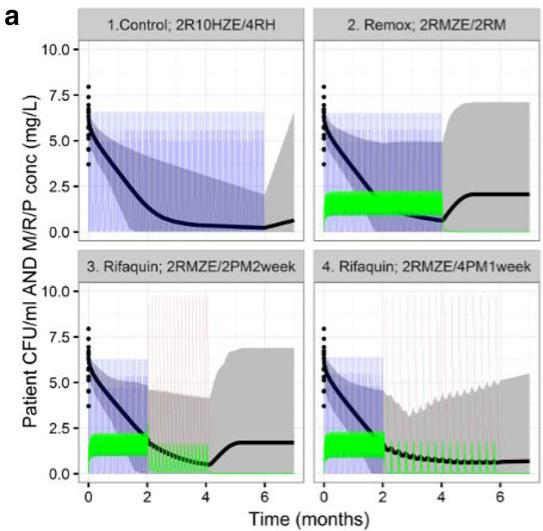

line

| Treatment Group | Time (months) | Patient CFU/ml AND M/R/P conc (mg/L) |
| --- | --- | --- |
| Control; 2R10HZE/4RH | 0 | 7.5 |
| Control; 2R10HZE/4RH | 1 | 5.0 |
| Control; 2R10HZE/4RH | 2 | 2.5 |
| Control; 2R10HZE/4RH | 3 | 1.0 |
| Control; 2R10HZE/4RH | 4 | 0.5 |
| Control; 2R10HZE/4RH | 5 | 0.5 |
| Control; 2R10HZE/4RH | 6 | 0.5 |
| Remox; 2RMZE/2RM | 0 | 7.5 |
| Remox; 2RMZE/2RM | 1 | 5.0 |
| Remox; 2RMZE/2RM | 2 | 2.5 |
| Remox; 2RMZE/2RM | 3 | 1.0 |
| Remox; 2RMZE/2RM | 4 | 0.5 |
| Remox; 2RMZE/2RM | 5 | 0.5 |
| Remox; 2RMZE/2RM | 6 | 0.5 |
| Rifaquin; 2RMZE/2PM2week | 0 | 7.5 |
| Rifaquin; 2RMZE/2PM2week | 1 | 5.0 |
| Rifaquin; 2RMZE/2PM2week | 2 | 2.5 |
| Rifaquin; 2RMZE/2PM2week | 3 | 1.0 |
| Rifaquin; 2RMZE/2PM2week | 4 | 0.5 |
| Rifaquin; 2RMZE/2PM2week | 5 | 0.5 |
| Rifaquin; 2RMZE/2PM2week | 6 | 0.5 |
| Rifaquin; 2RMZE/4PM1week | 0 | 7.5 |
| Rifaquin; 2RMZE/4PM1week | 1 | 5.0 |
| Rifaquin; 2RMZE/4PM1week | 2 | 2.5 |
| Rifaquin; 2RMZE/4PM1week | 3 | 1.0 |
| Rifaquin; 2RMZE/4PM1week | 4 | 0.5 |
| Rifaquin; 2RMZE/4PM1week | 5 | 0.5 |
| Rifaquin; 2RMZE/4PM1week | 6 | 0.5 |

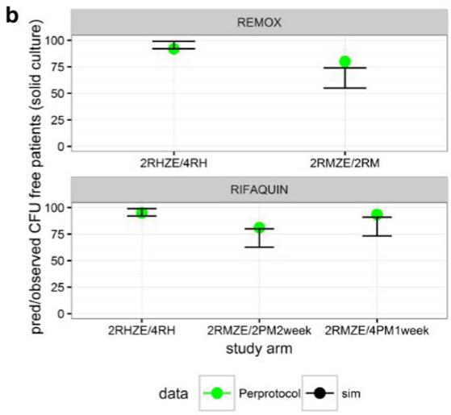

scatter

| Study Arm       | Remox Perprotocol | Remox sim | RIFAQUIN Perprotocol | RIFAQUIN sim |
| --------------- | ----------------- | --------- | -------------------- | ------------ |
| 2RHZE/4RH       | 95                | 98        | 95                   | 98           |
| 2RMZE/2RM       | 80                | 75        | 80                   | 75           |
| 2RMZE/4PM1week  | 90                | 85        | 90                   | 85           |

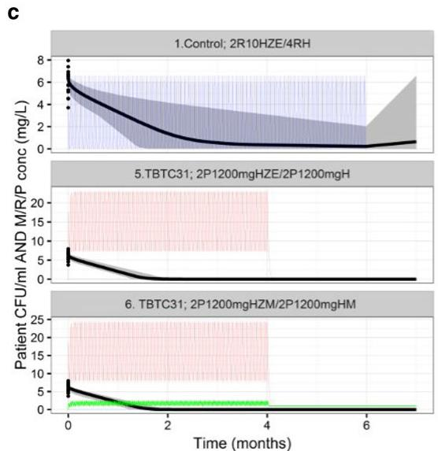

line

| Treatment Group | Time (months) | CFU/ml Concentration (mg/L) |
| --- | --- | --- |
| Control; 2R10HZE/4RH | 0 | 8 |
| Control; 2R10HZE/4RH | 6 | ~1 |
| Control; 2R10HZE/4RH | 12 | ~0.5 |
| Control; 2R10HZE/4RH | 20 | ~0.3 |
| Control; 2R10HZE/4RH | 28 | ~0.2 |
| TBTC31; 2P1200mgHZE/2P1200mgH | 0 | ~7 |
| TBTC31; 2P1200mgHZE/2P1200mgH | 6 | ~1 |
| TBTC31; 2P1200mgHZE/2P1200mgH | 12 | ~0.5 |
| TBTC31; 2P1200mgHZE/2P1200mgH | 20 | ~0.3 |
| TBTC31; 2P1200mgHZM/2P1200mgHM | 0 | ~6 |
| TBTC31; 2P1200mgHZM/2P1200mgHM | 6 | ~0.5 |
| TBTC31; 2P1200mgHZM/2P1200mgHM | 12 | ~0.3 |
| TBTC31; 2P1200mgHZM/2P1200mgHM | 20 | ~0.2 |
| TBTC31; 2P1200mgHZM/2P1200mgHM | 28 | ~0.1 |

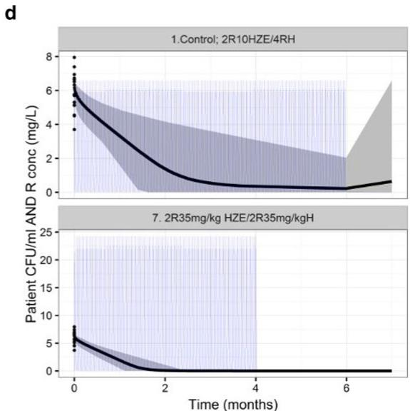

line

| Time (months) | Control; 2R10HZE/4RH (mg/L) | 2R35mg/kg HZE/2R35mg/kgH (mg/L) |
| ------------- | --------------------------- | -------------------------------- |
| 0             | 8                           | 8                                |
| 2             | 1                           | 1                                |
| 4             | 0.5                         | 0.5                              |
| 6             | 0.5                         | 0.5                              |
| 7             | 0.5                         | 0.5                              |

Figure 4 Pharmacokinetic/pharmacodynamic (PK/PD) simulations of patient outcomes in trial scenarios. (a) Simulated sputum colony forming unit (CFU) counts and drug concentrations in patients receiving treatment with the control regimen or moxifloxacin 400 mg in combination with pyrazinamide, ethambutol, and either rifampin or rifapentine (REMox-TB and Rifaquin trials). (b) Estimated and observed results of the REMox-TB and Rifaquin trials, as indicated by the number of relapse-free (CFU-free) patients (per protocol analysis). (c) Simulations of patient outcomes in TBTC study 31. (d) Simulations of patient outcomes in a hypothetical trial of a 4-month high-dose rifampin-containing regimen. E, ethambutol; H, isoniazid; M, moxifloxacin; P, rifapentine; R, rifampin; Z, pyrazinamide. PK parameters observed in clinical trials and PD parameters obtained from the mouse studies were used for the simulations (Table 2). Solid lines are the mean predicted CFU counts (black) and plasma concentrations (rifampin, blue; moxifloxacin, green; rifapentine, red). Gray-shaded areas are the areas between the lower and upper limits of the 95% confidence intervals of the predicted CFU counts. Dosing schedule: REMox-TB trial, control arm: (months 0–2) rifampin 10 mg/kg, isoniazid 300 mg, pyrazinamide 25 mg/kg, and ethambutol 20 mg/kg, daily; (months 2–6) rifampin 10 mg/kg and isoniazid 300 mg daily. Ethambutol arm: (months 0–2) rifampin 10 mg/kg, moxifloxacin 400 mg, pyrazinamide 25mg/kg, and ethambutol 20 mg/kg daily; (months 2–4) rifampin 10 mg/kg and moxifloxacin 400 mg daily. Rifaquin trial, control arm: (months 0–2) rifampin 10 mg/kg, isoniazid 300 mg, pyrazinamide 25 mg/kg, and ethambutol 20 mg/kg daily; (months 2–6) rifampin 10 mg/kg and isoniazid 300 mg daily. Four-month arm: (months 0–2) rifampin 10 mg/kg, moxifloxacin 400 mg, pyrazinamide 25 mg/kg, and ethambutol 20 mg/kg daily; (months 2–4) rifapentine 15 mg/kg and moxifloxacin 400 mg twice weekly. Six-month arm: (months 0–2) rifampin 10 mg/kg, moxifloxacin 400 mg, pyrazinamide 25 mg/kg, and ethambutol 20 mg/kg daily; (months 2–6) rifapentine 20 mg/kg and moxifloxacin 400 mg weekly. TBTC study 31, control arm: (months 0–2) rifampin 10 mg/kg, isoniazid 300 mg, pyrazinamide 25 mg/kg, and ethambutol 20 mg/kg daily; (months 2–6) rifampin 10 mg/kg and isoniazid 300 mg daily. Four-month arm: rifapentine arm: (months 0–2) rifapentine 1200 mg, isoniazid 300 mg, pyrazinamide 25 mg/kg and ethambutol 20 mg/kg daily; (months 2–4) rifapentine 1,200 mg and isoniazid 300 mg daily. Rifapentine and moxifloxacin arm: (months 0–2) rifapentine 1,200 mg, isoniazid 300 mg, moxifloxacin 400 mg, and pyrazinamide 25 mg/kg daily; (months 2–4) rifapentine 1,200 mg, isoniazid 300 mg, and moxifloxacin 400 mg daily.

The high success rates predicted with either high-dose rifamycin regimens suggest that the translational model can inform regimen optimization and predict outcomes of late-stage clinical trials. The results of these ongoing trials will determine the accuracy of these predictions.

# DISCUSSION

Mouse models have been used for decades to evaluate new TB drugs and regimens and to inform clinical trials. Selection of regimens to test in phase II/III trials to shorten treatment duration relies heavily on results in mice. However, disappointing results of recent trials of fluoroquinolone-containing regimens and the imperfect translation of rifapentine doseresponses observed in BALB/c mice,3,7,11,12,19 suggest that knowledge gained from preclinical investigations was not utilized fully in informing dose selection and regimen optimization. Therefore, we developed a translational PK/PD model describing M. tuberculosis growth in mice, effects of the adaptive immune response on bacterial growth, and relationships between drug concentration and accelerated bacterial death in mice. We expanded the model to include clinical steady-state PK data, species-specific protein binding, drug-drug interactions, and patient-specific pathology (e.g., cavitary disease). This translational PK/PD model adequately predicted exposure-response relationships of rifamycins and long-term outcomes observed in recent clinical trials. In addition, the validated model predicted minimal risk of relapse at 1 year following 4 months of treatment with highdose rifapentine regimens in the ongoing TBTC study 31 (NCT02410772) and with high-dose rifampin regimens in the ongoing RIFASHORT trial (NCT02581527). This provides a basis for prospective evaluations to determine the predictive accuracy of the model.

The challenges of interpreting preclinical PK/PD data for TB drugs require advanced PK/PD modeling techniques. Treatment outcomes in mice were highly influenced by experimental variables, such as the infectious dose, incubation period, and immune status. Moreover, there is great interindividual variability in lung pathology in patients with TB, in which the extent of caseous disease, presence or absence of cavitation, and size of cavities influence drug distribution and treatment outcomes. In contrast, the mouse strains used in the experiments that informed the model do not develop caseous lung lesions. Accounting for the influence of such lesions improved the translational model. Recent advances in developing more pathologically representative animal models41,42 and new approaches for studying drug concentrations at the site of infection43 have laid the groundwork for further study of the impact of tissue pathology on regimen efficacy. Further research should focus on lesion heterogeneity and its impacts on drug distribution and efficacy, the metabolic state of bacteria and microenvironmental conditions affecting drug action.

We quantified the adaptive immune effect for the purpose of quantifying the true drug effect (contribution of drug alone to efficacy), which can now be applied to estimate drug efficacy in immunodeficient patients. Simulations with the final translational model show a greater contribution of the immune system to bacterial killing and treatment outcome in patients receiving standard-dose rifampin compared with high-dose rifapentine. This suggests that in patients with advanced human immunodeficiency virus infection, rifapentine may be preferred over rifampin, as suggested by a study in athymic nude mice.44 This effect is likely due to massive killing of intracellular bacilli by high-dose rifapentine, but the precise mechanisms of such immune-mediated effects require further study.

Combining isoniazid and pyrazinamide with rifampin or rifapentine had only a limited beneficial or even a slight antagonistic effect on bacterial clearance in this model, consistent with previous studies demonstrating potential antagonistic effects in mice and human patients.45,46 However, the ability to discriminate the effects of individual agents used in combinations was limited by the available data. We are currently working to incorporate more variations in component drug combinations (including monotherapy) and drug doses. This will enhance our understanding of the pharmacodynamic interactions and the contribution to the sum effect of these drugs in combination, which will be useful to study new drug combinations.

Our translational modeling approach can be extended to the prediction of clinical trial outcomes for regimens comprised of other TB drugs and for other diseases in which a largely invariant relationship exists between drug exposure and effect at the site of action in preclinical models and in patients, such as other infections, cancer, pain, and neurological diseases. An example of a similar approach in cancer is provided by Betts et al.47 who developed a translational PK/PD model of inotuzumab ozogamicin for acute lymphocytic leukemia using preclinical and clinical data.

In conclusion, we built a translational PK/PD model to predict clinical outcomes utilizing preclinical exposure-response data, information about disease pathology, and immune responses linked with clinical PK and validated the model based on long-term outcomes of recent clinical trials. This model can inform design and predict outcomes of phase II/III trials of new TB regimens, such as TBTC study 31 and the RIFASHORT trial. When enhanced with individual effects of each drug and additional cross-species PK/PD response differences related to differences in pathology in future studies, this model is expected to provide better predictions of trial outcomes for new regimens in development. Our approach is relevant for researchers working across disease areas to bridge the preclinical-clinical divide in more efficient and informative ways.

Acknowledgments. The authors thank the Critical Path to TB Drug Regimens (CPTR) and specifically the advice and support of the M&S team at CPTR. In addition, we thank the researchers in the Center for Tuberculosis Research at The Johns Hopkins University School of Medicine who conducted the mouse model experiments that generated the data used in these analyses: Deepak Almeida, Opokua Amoabeng, Fabrice Betoudji, Jean-Philippe Lanoix, Si-Yang Li, Austin Minkowski, Aimee Ormond, Sang Won Park, Zahoor Parry, Ian Rosenthal, Rokeya Tasneen, Dinesh Taylor, Sandeep Tyagi, Kathy Williams, Tetsuyuki Yoshimatsu, Ming Zhang, and Tianyu Zhang.

Source of Funding. This work was supported by the National Institutes of Health (R01AI111992) and by the Critical Path to TB Drug Regimens initiative which is a funded through the Bill & Melinda Gates Foundation (OPP1031105). The mouse efficacy data used for the analyses were generated with support from the National Institutes of Health, the U.S. Food and Drug Administration, the Bill & Melinda Gates Foundation, and the Global Alliance for TB Drug Development. Dr Zhang was supported by the Clinical Pharmacology Postdoctoral Fellowship at JHU. Dr Bartelink received funding from the Ruth L. Kirschstein National Research Service Award T32 National Institutes of Health grant, 5T32GM007546.

Author Contributions. I.H.B., N.Z., R.J.K., N.S.S., P.J.C., K.E.D., E.L.N., and R.M.S. wrote the manuscript. I.H.B., N.Z., R.J.K., P.J.C., K.E.D., E.L.N., and R.M.S. designed the research. I.H.B., N.Z., R.J.K., N.S.S., E.L.N., and R.M.S. performed the research. I.H.B., N.Z., R.J.K., N.S.S., K.E.D., and R.M.S. analyzed the data. I.H.B., N.Z., E.L.N., and R.M.S. contributed new reagents/analytical tools.

# Conflict of Interest. The authors declared no conflict of interest.

1. World Health Organization. Global tuberculosis report 2016. http://www.who.int/ tb/publications/global\_report/en/ (2016).   
2. Rosenthal, I.M. et al. Dose-ranging comparison of rifampin and rifapentine in two pathologically distinct murine models of tuberculosis. Antimicrob. Agents Chemother. 56, 4331–4340 (2012).   
3. Dorman, S.E. et al. Substitution of rifapentine for rifampin during intensive phase treatment of pulmonary tuberculosis: study 29 of the tuberculosis trials consortium. J. Infect. Dis. 206, 1030–1040 (2012).   
4. Jayaram, R. et al. Pharmacokinetics-pharmacodynamics of rifampin in an aerosol infection model of tuberculosis. Antimicrob. Agents Chemother. 47, 2118–2124 (2003).   
5. Weiner, M. et al. Rifapentine pharmacokinetics and tolerability in children and adults treated once weekly with rifapentine and isoniazid for latent tuberculosis infection. J. Pediatric Infect. Dis. Soc. 3, 132–145 (2014).   
6. de Steenwinkel, J.E. et al. Optimization of the rifampin dosage to improve the therapeutic efficacy in tuberculosis treatment using a murine model. Am. J. Respir. Crit. Care Med. 187, 1127–1134 (2013).   
7. Dorman, S.E. et al. Daily rifapentine for treatment of pulmonary tuberculosis. A randomized, dose-ranging trial. Am. J. Respir. Crit. Care Med. 191, 333–343 (2015).   
8. Jayakumar, A. et al. Xpert MTB/RIF assay shows faster clearance of mycobacterium tuberculosis DNA with higher levels of rifapentine exposure. J. Clin. Microbiol. 54, 3028– 3033 (2016).   
9. Rosenthal, I.M., Zhang, M., Almeida, D., Grosset, J.H. & Nuermberger, E.L. Isoniazid or moxifloxacin in rifapentine-based regimens for experimental tuberculosis? Am. J. Respir. Crit. Care Med. 178, 989–993 (2008).   
10. Lanoix, J.-P., Chaisson, R.E. & Nuermberger, E.L. Shortening tuberculosis treatment with fluoroquinolones: lost in translation? Clin. Infect. Dis. 62, 484–490 (2016).   
11. Gillespie, S.H. et al. Four-month moxifloxacin-based regimens for drug-sensitive tuberculosis. N. Engl. J. Med. 371, 1577–1587 (2014).   
12. Jindani, A. et al. High-dose rifapentine with moxifloxacin for pulmonary tuberculosis. N. Engl. J. Med. 371, 1599–1608 (2014).   
13. De Groote, M.A. et al. Comparative studies evaluating mouse models used for efficacy testing of experimental drugs against Mycobacterium tuberculosis. Antimicrob. Agents Chemother. 55, 1237–1247 (2011).   
14. Rosenthal, I.M. et al. Daily dosing of rifapentine cures tuberculosis in three months or less in the murine model. PLoS Med. 4, e344 (2007).   
15. Rosenthal, I.M. et al. Weekly moxifloxacin and rifapentine is more active than the Denver regimen in murine tuberculosis. Am. J. Respir. Crit. Care Med. 172, 1457–1462 (2005).   
16. Nuermberger, E. et al. Powerful bactericidal and sterilizing activity of a regimen containing PA-824, moxifloxacin, and pyrazinamide in a murine model of tuberculosis. Antimicrob. Agents Chemother. 52, 1522–1524 (2008).   
17. Zvada, S.P. et al. Moxifloxacin population pharmacokinetics and model-based comparison of efficacy between moxifloxacin and ofloxacin in African patients. Antimicrob. Agents Chemother. 58, 503–510 (2014).   
18. Boeree, M.J. et al. A dose-ranging trial to optimize the dose of rifampin in the treatment of tuberculosis. Am. J. Respir. Crit. Care Med. 191, 1058–1065 (2015).

19. Aarnoutse, R.E. et al. HIGHRIF2: a phase II trial comparing 10, 15, and 20 mg/kg rifampicin for two months. https://www.regist2.virology-education.com/2014/ 7th\_TB\_PK/7\_aarnoutse.pdf. (2014).   
20. Zvada, S.P. et al. Effects of four different meal types on the population pharmacokinetics of single-dose rifapentine in healthy male volunteers. Antimicrob. Agents Chemother. 54, 3390–3394 (2010).   
21. Zvada, S.P. et al. Moxifloxacin population pharmacokinetics in patients with pulmonary tuberculosis and the effect of intermittent high-dose rifapentine. Antimicrob. Agents Chemother. 56, 4471–4473 (2012).   
22. Siefert, H.M., Domdey-Bette, A., Henninger, K., Hucke, F., Kohlsdorfer, C. & Stass, H.H. Pharmacokinetics of the 8-methoxyquinolone, moxifloxacin: a comparison in humans and other mammalian species. J. Antimicrob. Chemother. 43 Suppl B, 69–76 (1999).   
23. Egelund, E.F. et al. Protein binding of rifapentine and its 25-desacetyl metabolite in patients with pulmonary tuberculosis. Antimicrob. Agents Chemother. 58, 4904–4910 (2014).   
24. Assandri, A., Ratti, B. & Cristina, T. Pharmacokinetics of rifapentine, a new long lasting rifamycin, in the rat, the mouse and the rabbit. J. Antibiot. (Tokyo) 37, 1066– 1075 (1984).   
25. Woo, J., Cheung, W., Chan, R., Chan, H.S., Cheng, A. & Chan, K. In vitro protein binding characteristics of isoniazid, rifampicin, and pyrazinamide to whole plasma, albumin, and alpha-1-acid glycoprotein. Clin. Biochem. 29, 175–177 (1996).   
26. Bowness, R. et al. The relationship between Mycobacterium tuberculosis MGIT time to positivity and cfu in sputum samples demonstrates changing bacterial phenotypes potentially reflecting the impact of chemotherapy on critical sub-populations. J. Antimicrob. Chemother. 70, 448–455 (2015).   
27. Prideaux, B. et al. The association between sterilizing activity and drug distribution into tuberculosis lesions. Nat. Med. 21, 1223–1227 (2015).   
28. Savic, R.M. et al. Defining the optimal dose of rifapentine for pulmonary tuberculosis: exposure-response relations from two phase II clinical trials. Clin. Pharmacol. Ther. (2017). [Epub ahead of print]   
29. Karlsson, M.O., Beal, S.L. & Sheiner, L.B. Three new residual error models for population PK/PD analyses. J. Pharmacokinet. Biopharm. 23, 651–672 (1995).   
30. Wilkins, J.J. et al. Population pharmacokinetics of rifampin in pulmonary tuberculosis patients, including a semimechanistic model to describe variable absorption. Antimicrob. Agents Chemother. 52, 2138–2148 (2008).   
31. Nijland, H.M. et al. Rifampicin reduces plasma concentrations of moxifloxacin in patients with tuberculosis. Clin. Infect. Dis. 45, 1001–1007 (2007).   
32. Kirschner, D.E., Hunt, C.A., Marino, S., Fallahi-Sichani, M. & Linderman, J.J. Tuneable resolution as a systems biology approach for multi-scale, multi-compartment computational models. Wiley Interdiscip. Rev. Syst. Biol. Med. 6, 289–309 (2014).   
33. Snoeck, E. et al. A comprehensive hepatitis C viral kinetic model explaining cure. Clin. Pharmacol. Ther. 87, 706–713 (2010).   
34. Ritschel, W.A., Vachharajani, N.N., Johnson, R.D. & Hussain, A.S. The allometric approach for interspecies scaling of pharmacokinetic parameters. Comp. Biochem. Physiol. C. 103, 249–253 (1992).   
35. Sharma, V. & McNeill, J.H. To scale or not to scale: the principles of dose extrapolation. Br. J. Pharmacol. 157, 907–921 (2009).   
36. Nielsen, E.I. & Friberg, L.E. Pharmacokinetic-pharmacodynamic modeling of antibacterial drugs. Pharmacol. Rev. 65, 1053–1090 (2013).   
37. Gill, W.P., Harik, N.S., Whiddon, M.R., Liao, R.P., Mittler, J.E. & Sherman, D.R. A replication clock for Mycobacterium tuberculosis. Nat. Med. 15, 211–214 (2009).   
38. Ahmad, Z., Tyagi, S., Minkowski, A., Peloquin, C.A., Grosset, J.H. & Nuermberger, E.L. Contribution of moxifloxacin or levofloxacin in second-line regimens with or without continuation of pyrazinamide in murine tuberculosis. Am. J. Respir. Crit. Care Med. 188, 97–102 (2013).   
39. Yoshimatsu, T., Neurmberger, E., Tyagi, S., Chaisson, R., Bishai, W. & Grosset, J. Bactericidal activity of increasing daily and weekly doses of moxifloxacin in murine tuberculosis. Antimicrob. Agents Chemother. 46, 1875–1879 (2002).   
40. Boeree, M.J. et al. High-dose rifampicin, moxifloxacin, and SQ109 for treating tuberculosis: a multi-arm, multi-stage randomised controlled trial. Lancet Infect. Dis. 17, 39–49 (2017).   
41. Kramnik, I. & Beamer, G. Mouse models of human TB pathology: roles in the analysis of necrosis and the development of host-directed therapies. Semin. Immunopathol. 38, 221–237 (2016).   
42. Nuermberger, E. & Hanna, D. Assessing the landscape of tools and approaches for novel tuberculosis regimen development. J. Infect. Dis. 211 Suppl 3, S81–S82 (2015).   
43. Dartois, V. The path of anti-tuberculosis drugs: from blood to lesions to mycobacterial cells. Nat. Rev. Microbiol. 12, 159–167 (2014).   
44. Zhang, M. et al. Treatment of tuberculosis with rifamycin-containing regimens in immune-deficient mice. Am. J. Respir. Crit. Care Med. 183, 1254–1261 (2011).   
45. Almeida, D. et al. Paradoxical effect of isoniazid on the activity of rifampin-pyrazinamide combination in a mouse model of tuberculosis. Antimicrob. Agents Chemother. 53, 4178– 4184 (2009).

46. Swaminathan, S. et al. Drug concentration thresholds predictive of therapy failure and death in children with tuberculosis: bread crumb trails in random forests. Clin. Infect. Dis. 63 (suppl 3) S63–S74 (2016).   
47. Betts, A.M. et al. Preclinical to clinical translation of antibody-drug conjugates using PK/PD modeling: a retrospective analysis of inotuzumab ozogamicin. AAPS J. 18, 1101– 1116 (2016).

-C 2017 The Authors. Clinical and Translational Science published by Wiley Periodicals, Inc. on behalf of American Society for Clinical Pharmacology and Therapeutics. This is an open access article under the terms of the Creative Commons Attribution-NonCommercial-NoDerivs License, which permits use and distribution in any medium, provided the original work is properly cited, the use is non-commercial and no modifications or adaptations are made.

Supplementary information accompanies this paper on the Clinical and Translational Science website. (http://onlinelibrary.wiley.com/journal/10.1111/(ISSN)1752-8062)