# Model-Based Approach to Predict Adherence to Protocol During Antiobesity Trials

The Journal of Clinical Pharmacology 2018, 58(2) 240–253

-C 2017, The Authors. The Journal of Clinical Pharmacology published by Wiley Periodicals, Inc. on behalf of American College of Clinical Pharmacology

DOI: 10.1002/jcph.994

Vishnu D. Sharma, PhD1, Franc¸ois P. Combes, PhD1, Majid Vakilynejad, PhD2, Gezim Lahu, PhD3, Lawrence J. Lesko, PhD, FCP1, and Mirjam N. Trame, PharmD, PhD1

# Abstract

Development of antiobesity drugs is continuously challenged by high dropout rates during clinical trials. The objective was to develop a population pharmacodynamic model that describes the temporal changes in body weight, considering disease progression, lifestyle intervention, and drug effects. Markov modeling (MM) was applied for quantification and characterization of responder and nonresponder as key drivers of dropout rates, to ultimately support the clinical trial simulations and the outcome in terms of trial adherence. Subjects (n = 4591) from 6 Contrave-R trials were included in this analysis. An indirect-response model developed by van Wart et al was used as a starting point. Inclusion of drug effect was dose driven using a population dose- and time-dependent pharmacodynamic (DTPD) model. Additionally, a population-pharmacokinetic parameter- and data (PPPD)-driven model was developed using the final DTPD model structure and final parameter estimates from a previously developed population pharmacokinetic model based on available Contrave-R pharmacokinetic concentrations. Last, MM was developed to predict transition rate probabilities among responder, nonresponder, and dropout states driven by the pharmacodynamic effect resulting from the DTPD or PPPD model. Covariates included in the models and parameters were diabetes mellitus and race. The linked DTPD-MM and PPPD-MM was able to predict transition rates among responder, nonresponder, and dropout states well. The analysis concluded that body-weight change is an important factor influencing dropout rates, and the MM depicted that overall a DTPD model-driven approach provides a reasonable prediction of clinical trial outcome probabilities similar to a pharmacokinetic-driven approach.

# Keywords

Nonlinear Mixed-Effect Models, Population Pharmacodynamics, NONMEM, Obesity, Markov Model, Contrave-R , Clinical Trials

Obesity is widely recognized as one of the largest and fastest growing public health concerns and is mostly defined as subjects having a body mass index (BMI) of over 30 kg/m2. 1 More than one-third of adults are obese in the United States, with men and women being equally affected.1 Of particular concern is obesity’s association with other comorbidities, premature mortality, impaired quality of life, and large healthcare costs.2 Major comorbidities include type 2 diabetes mellitus, metabolic syndrome, hyperlipidemia, coronary heart disease, stroke, hypertension, myocardial infarction, sleep apnea, cancer, liver diseases, and osteoarthritis,3 which contribute to over 300,000 deaths annually in the United States.4 As a result, 21% of annual medical spending (around \$190 billion/annum) of the United States is being funneled into obesityrelated comorbidities.5

Limited efficacy of lifestyle interventions (LSI), including diet and exercise in weight management programs, necessitates the use of drug therapies.6 Yet only 5 drugs—orlistat (Xenical- ), a gastric and pancreaticlipase inhibitor; lorcaserin (Belviq-R ), a 5-HT receptor agonist; a fixed-dose combination of phentermine and topiramate (Qsymia-R ), CNS acting drugs; liraglutide (Saxenda-R ), a glucagon-like peptide-1 receptor agonist; and a fixed-dose combination of bupropion/naltrexone (Contrave-R ) have been approved by regulatory authorities as antiobesity treatments over the last 15 years.6 Major reasons for the limited number of approved drugs for this indication include strict regulatory requirements (>5% of placebo-subtracted body-weight [BW] loss maintained over 1 year with high benefit-torisk ratio), limited clinical efficacy of drugs, and high costs of clinical trials caused by high dropout rates, lack

1Center for Pharmacometrics and Systems Pharmacology, Department of Pharmaceutics, College of Pharmacy, University of Florida, Orlando, FL, USA

2Takeda Pharmaceuticals Research Division, Pharmacometrics,Deerfield, IL, USA

3Takeda Pharmaceuticals Research Division, Pharmacometrics, Zurich, Switzerland

This is an open access article under the terms of the Creative Commons Attribution-NonCommercial License, which permits use, distribution and reproduction in any medium, provided the original work is properly cited and is not used for commercial purposes.

Submitted for publication 24 March 2017; accepted 13 July 2017.

# Corresponding Author:

Mirjam N. Trame, PharmD, PhD, Center for Pharmacometrics and Systems Pharmacology, Department of Pharmaceutics, College of Pharmacy, 6550 Sanger Road, Orlando, FL, 32827

Email: mtrame@cop.ufl.edu

ACCP Fellow: Lawrence J Lesko, PhD, FCP of follow-up, and inadequate enrollment of subjects.7 In order to circumvent these problems, better clinical trial designs are needed to reduce the methodological errors and to evaluate the true potential of drugs in obesity trials.

Recently, a combination treatment (Contrave-R ) was approved by the US Food and Drug Administration at doses of 32 mg of naltrexone and 360 mg of bupropion, along with a reduced-calorie diet and increased physical activity for obesity treatment.8 It is hypothesized that the combination stimulates the pro-opiomelanocortin neurons and inhibits β-endorphins in the hypothalamus, which leads to anorectic behavior; this is further supplemented by effective mesolimbic reward pathway regulations leading to BW loss.9 Clinically, the drug combination has shown average BW loss of 5% to 8% as compared to 1% to 5% BW loss under placebo at 56 weeks. Also, 42% to 57% of treated subjects lost at least 5% of their BW (as compared to 17% to 43% in the placebo arm) at 56 weeks.10,11 However, the Contrave-R trials have reported 42% to 49% dropout rates in both treatment and placebo arms, similar to other antiobesity clinical trials. Possible reasons for high dropout rates as a result of low clinical trial adherence to protocol may include noncompliance, environmental factors that lead to weight gain (eg, low education, high costs for healthy food, less physical activity), medical and/or genetic factors, and inadequate systemic drug exposures due to variation in the pharmacokinetics (PK) of antiobesity drugs as the distribution of a drug between fat and lean tissue may influence its PK in obese patients. Robust populationmodeling frameworks are promising tools that can be utilized to forecast potential dropout rates in clinical trial simulations in order to help plan better clinical trial designs, predict clinical trial outcomes, and potentially save time and costs during drug development programs, which are ultimately a result of successful adherence to protocol during clinical trials.12–14

The aim of this analysis was to develop a modeling and simulation framework that can be used to predict the outcome of antiobesity clinical trials based on clinical trial adherence to protocol by determining clinical trial dropout rates using a linked population pharmacodynamic (PopPD) Markov modeling (MM) approach. Contrave-R trial data were leveraged in order to develop this framework. The framework development was 2-fold: (1) to develop a PopPD model that can effectively describe time-course changes of BW in obese subjects after accounting for disease progression, Life-style intervention (LSI), and drug effect and (2) to establish a MM that can predict responder, nonresponder, and dropout rates during clinical trial simulations based on adherence to the interventions. To this extent the developed PopPD model was linked to the MM, and the transition rates among responder, nonresponder, and dropout states were driven using the clinical outcome predicted by the PopPD model, in this case the change of BW over time as a result of adherence to the trial interventions.15 Additionally, it was of interest to compare 2 types of PopPD models being linked to the MM, a population dose- and timedependent pharmacodynamic (DTPD) model in which the drug effect is included as a dose-driven response and a population pharmacokinetic (PK) parameter- and data (PPPD)-driven model that predicts the drug effect using parameter estimates derived from a previously developed Population PK (PopPK) model based on sparse PK sampling from only one Contrave-R clinical trial. It would be beneficial to be able to utilize a simple model framework in which PK measurements are not needed and a dose response could be used to assess the response and success rates, in terms of predicting adherence to protocol, of new antiobesity drugs during clinical drug development in the target patient population.

# Methods

# Study Design

Individual subject-level data of observed BW from 6 multicenter, double-blind, placebo-controlled phase 2 and 3 Contrave-R trials (naltrexone/bupropion combination 8 mg/90 mg) (OT-101, NB-201, NB-301, NB-302, NB-303, and NB-304, and referenced later as studies 1 to 6, respectively) were available during this analysis (Supplementary Table 1).10,11,16–18 Phase 2 studies were designed to assess the efficacy and safety of Contrave-R in addition to a behavioral modification program for subjects with uncomplicated obesity and with a BMI ranging from 27 to 45 kg/m2. Phase 3 studies have evaluated the efficacy of the drug in obese subjects with comorbidities (including dyslipidemia, controlled hypertension, or both) and have reported 1- year BW outcome data using modified intent-to-treat analysis as well as attrition. Study 6 (NB-304) was the only study including obese subjects with type 2 diabetes mellitus (T2DM). All subjects received LSI with a hypocaloric diet (–500 to –1500 kcal/day) and a recommended increased physical activity (at least a 30-minute walk 3 times per week). Longitudinal BW along with potential explanatory covariates and dropout information were extracted for placebo and treatment groups. Sparse plasma concentration vs time data of Contrave-R (naltrexone and bupropion concentrations) were available from only 1 study, NB-303. The final PopPK model parameter estimates from a previously developed PopPK model using Contrave-R sparse plasma sample from NB-303 study were used during model development process of the PPP&D model (internal Takeda report dated February 9, 2010). Subject demographics of all studies are shown in Table 1. For model development only 5 studies were used, and BW data from study NB-301 were kept aside as external model evaluation data set.

Table 1. Subjects’ Baseline Characteristics for Contrave-R Clinical Trial for All Studies Merged and Stratified by Study 

<table><tr><td rowspan="2">Demographic Variables</td><td colspan="7">Number of Subjects [Percentage of Subjects per Study]</td></tr><tr><td>Studies 1-6</td><td>Study 1 (OT-101)</td><td>Study 2 (NB-201)</td><td>Study 3 (NB-301)</td><td>Study 4 (NB-302)</td><td>Study 5 (NB-303)</td><td>Study 6 (NB-304)</td></tr><tr><td>Male/female subjects</td><td>797/3794</td><td>10/81</td><td>33/224</td><td>240/1346</td><td>78/682</td><td>217/1179</td><td>219/282</td></tr><tr><td>Age (y)</td><td>46 [11.3]</td><td>44 [9.6]</td><td>45 [10.5]</td><td>45 [11.2]</td><td>47 [10.6]</td><td>45 [11.2]</td><td>55 [9.3]</td></tr><tr><td>BW (kg)</td><td>99 [15.8]</td><td>94 [12.6]</td><td>94 [13.1]</td><td>98 [15.1]</td><td>99.5 [15.3]</td><td>98 [16.4]</td><td>104 [18.3]</td></tr><tr><td>LBM (kg)</td><td>55.7 [11.1]</td><td>54.8 [8.9]</td><td>54.1 [10.1]</td><td>55.4 [10.4]</td><td>55.6 [9.7]</td><td>55.7 [11.2]</td><td>61.7 [13.9]</td></tr><tr><td>Race</td><td></td><td></td><td></td><td></td><td></td><td></td><td></td></tr><tr><td>White</td><td>3542 [77.2]</td><td>63 [69.2]</td><td>187 [72]</td><td>1191 [75]</td><td>532 [70.0]</td><td>1170 [83.8]</td><td>399 [79.6]</td></tr><tr><td>Asian</td><td>49 [1.1]</td><td>0 [0]</td><td>0 [0]</td><td>14 [0.9]</td><td>8 [1.1]</td><td>15 [1.1]</td><td>12 [2.4]</td></tr><tr><td>Black</td><td>848 [18.5]</td><td>27 [29.7]</td><td>69 [29.7]</td><td>306 [19.3]</td><td>180 [23.7]</td><td>186 [13.3]</td><td>80 [15.9]</td></tr><tr><td>Other</td><td>152 [3.3]</td><td>1 [1.1]</td><td>1 [0.4]</td><td>75 [4.7]</td><td>40 [5.3]</td><td>25 [1.8]</td><td>10 [2.0]</td></tr><tr><td>Obesity</td><td></td><td></td><td></td><td></td><td></td><td></td><td></td></tr><tr><td>Overweight</td><td>114 [2.4]</td><td>0 [0]</td><td>0 [0]</td><td>39 [2.5]</td><td>9 [1.2]</td><td>37 [2.7]</td><td>29 [5.8]</td></tr><tr><td>Class I</td><td>1746 [38.0]</td><td>41 [45.1]</td><td>122 [47.5]</td><td>602 [38.0]</td><td>266 [35.0]</td><td>556 [39.8]</td><td>159 [31.7]</td></tr><tr><td>Class II</td><td>1661 [36.2]</td><td>45 [49.9]</td><td>123 [47.9]</td><td>566 [35.7]</td><td>297 [39.1]</td><td>458 [32.8]</td><td>172 [34.3]</td></tr><tr><td>Class III</td><td>1070 [23.3]</td><td>5 [5.5]</td><td>12 [4.7]</td><td>379 [23.9]</td><td>188 [24.7]</td><td>345 [24.7]</td><td>141 [28.1]</td></tr></table>

Median [SD] are shown in the table. LBM indicates lean body-mass; BW, body weight; SD, standard deviation.

# Data Analysis

Data were analyzed by nonlinear mixed-effect modeling using Monolix 4.3.3.19 Population parameters were estimated using the method of maximum likelihood, followed by a Bayesian approach of maximum a posteriori20,21 to estimate the individual parameters. To maximize the likelihood, Monolix 4.3.3 uses the stochastic approximation EM algorithm.22 R version 3.2.3 was employed for data management purposes and graphic outputs.

# Population Pharmacodynamic Model Development

Population Dose- and Time-Dependent Pharmacodynamic Model. A PopPD model previously developed by Van Wart et al was utilized as a starting point to predict disease progression in terms of long-term BW loss using the available Contrave-R trial data (equation (1)).23 The structural PopPD model by van Wart et al had accounted for disease progression and LSI to describe the time courses of BW change in overweight/obese subjects under placebo treatment. The PopPD model is an indirect response model with a zero-order rate constant describing the BW gain $( \mathrm { k } _ { \mathrm { i n } } )$ and a first-order rate constant for BW loss $\mathrm { ( k _ { o u t } ) }$ . The stimulatory effect of LSI on $\mathbf { k _ { \mathrm { o u t } } }$ was incorporated using a Batemanlike function and expressed as the maximum fractional increase in ${ \bf k } _ { \mathrm { o u t } }$ due to LSI (DSTIM). The rationale for using an inverse Bateman function was that the effect of the LSI drives the initial change in BW but dissipates over time. The effect of disease progression, measured in BW regain, results in a linear increase in BW over time and becomes the predominant factor once the effect of LSI disappears. Therefore, an inverse Bateman function was needed to capture the behavior of the individual BW change.

The Bateman function was made flexible by including first-order rate constants for the onset $\mathrm { ( k _ { d e } ) }$ and loss $\mathrm { ( k _ { r e l } ) }$ of the theoretical maximal LSI effect. To account for the disease progression, long-term surveillance data from NHANES (the National Health and Nutrition Examination Survey) were utilized and have shown a linear increase of BW, ie, 0.7 kg per year (equation (2)).24,25 Therefore, $\bf k _ { \mathrm { p r o } }$ was fixed to 0.7 kg per year for subjects without T2DM but was estimated for T2DM subjects to evaluate the effect of diabetes mellitus on the disease progression. The baseline BW after accounting for disease progression (BWDP) was employed to estimate $\mathbf { k } _ { \mathrm { i n } }$ (equation (3)).

$$
\mathrm{BW} _ {\mathrm{DP}} (t) = \mathrm{BW} _ {\text { baseline }} + \mathrm{k} _ {\text { pro }} \times t \tag {1}
$$

$$
\mathrm{k} _ {\text { in }} = \mathrm{k} _ {\text { out }} \times \mathrm{BW} _ {\mathrm{DP}} (\mathrm{t}) \tag {2}
$$

$$
\begin{array}{l} \frac {\mathrm{d} \mathbf {B W} _ {\text { prog } , 1}}{\mathrm{d} t} = \mathrm{k} _ {\text { in }} - \mathrm{k} _ {\text { out }} \times \mathbf {B W} _ {\text { prog }, 1} (\mathrm{t}) \tag {3} \\ \times \left(1 + \frac {\mathrm{DSTIM} \times k _ {\mathrm{de}}}{k _ {\mathrm{de}} - k _ {\mathrm{rel}}} \times \left(e ^ {- k _ {\mathrm{rel}} \times t} - e ^ {- k _ {\mathrm{de}} \times t}\right)\right) \\ \end{array}
$$

In a second step, the drug effect (E) was incorporated into the model on BW disease progression $( \mathbf { B W } _ { \mathrm { p r o g } , 1 } )$

using an additional DTPD function.26 Several drug effect models were evaluated to describe the exposure-response relationship of naltrexone and bupropion such as slope and $\mathrm { E } _ { \mathrm { m a x } }$ drug effect relationships. The pharmacodynamic (PD) models were tested for their inhibitory, stimulatory, additive, or multiplicative impact on key model parameters such as $\mathrm { \bf B W } _ { \mathrm { p r o g , l } } , \mathrm { k } _ { \mathrm { i n } } ,$ and ${ \bf k } _ { \mathrm { o u t } }$ . The PD models incorporated both drug- and time-driven components and were tested for both drugs exhibiting their effect either individually or in combination on BW change. Interindividual variabilities (IIV) were tested on all model parameters of the final DTPD model in exponential and additive terms using forward inclusion $( \alpha \ : = \ : 0 . 0 5 )$ and backward elimination $( \alpha ~ = ~ 0 . 0 0 1 )$ . The final PD model that was selected among all tested ones was an inhibitory $\mathrm { E } _ { \mathrm { m a x } }$ model (equation (4)) impacting $\mathrm { \Delta B W _ { p r o g , l } }$ of the main PopPD model (equation (1)).

$$
\mathrm{BW} _ {\text { prog }, 2} = \mathrm{BW} _ {\text { prog }, 1} - \mathrm{E} _ {\text { DTPD }} \tag {4}
$$

and $\mathrm { E _ { D T P D } }$ is calculated as:

$$
\begin{array}{l} \mathrm{E} _ {\mathrm{DTPD}} = \frac {\mathrm{E} _ {\max} \times \mathrm{t}}{(\mathrm{t} + \mathrm{ET} _ {5 0})} \\ \times \left(\frac {\mathrm{NAL}}{\mathrm{ED} _ {5 0 _ {\mathrm{NAL}}} + \mathrm{NAL}} + \frac {\mathrm{BUP}}{\mathrm{ED} _ {5 0 _ {\mathrm{BUP}}} + \mathrm{BUP}}\right) \\ \end{array}
$$

where $\mathrm { E } _ { \mathrm { m a x } }$ is the maximal drug effect; NAL and BUP stand for doses of naltrexone and bupropion, respectively; and $\mathrm { E D } _ { 5 0 , }$ , and $\mathrm { E T } _ { 5 0 }$ are the required dose and time, respectively, needed to exhibit half of the maximal drug response.

The final PD model was determined based on the change in objective function value (OFV) (statistical significance tested at 5% level, or $P < . 0 5 )$ , individual fit plots, and goodness-of -fit (GOF) plots.

# Covariate Analysis

Covariates considered for final covariate model building were diabetes mellitus, age, BMI, lean body mass (LBM), sex, and race (Table 1). Diabetes mellitus was found to be an important covariate and was included in the model as a fixed covariate on all parameters. Additional covariates were tested for inclusion in addition to diabetic status. LBM was missing in 40% of the subjects and was therefore imputed when missing. Different methods to impute LBM were evaluated: linear Boer and Hume method (equation (5)) and nonlinear James and Duffull method (equation (6)).27

$$
\begin{array}{l} \mathrm{LBM} _ {\text { predicted }} = \text { Slope } _ {\mathrm{WT}} \times \text { Weight } \tag {5} \\ + \text { Slope } _ {\mathrm{HT}} \times \text { Height } + \text { Intercept } \\ \end{array}
$$

$$
\mathrm{LBM} _ {\text { predicted }} = \text { Slope } _ {\mathrm{WT}} \times \text { Weight } + \text { Slope } _ {\text { ratio }} \tag {6}
$$

$$
\times \left(\frac {\text { Weight }}{\text { Height }}\right) ^ {2} + \text { Intercept }
$$

The data set consisted of the following races: whites, Asians, blacks, Pacific Islanders, Native Hawaiians, Native Americans or Alaska Natives, and others. However, the proportion of Pacific Islanders, Native Hawaiians, Native Americans, Alaska Natives, and others in the data set were very low to have a meaningful impact on the PopPD models when tested individually and thus were lumped together into one category, listed as “others” in the data. All covariates were screened for a potential impact on model parameters, ie, $\mathrm { k _ { o u t } , k _ { r e l } } .$ , DSTIM, $\mathrm { E D } _ { 5 0 } , \mathrm { E } _ { \mathrm { m a x } } ,$ , and $\mathrm { T } _ { 5 0 }$ . Covariate effects were tested at the $\alpha = 0 . 0 5$ level in case of forward inclusion and at the $\alpha = 0 . 0 0 1$ level during backward elimination. Diagnostic plots, change in the OFV, parameter variability, and clinical impact were used to select final covariates that improved the model predictions.

PopPK Parameter and Data Model. A PPPD model was established to evaluate the impact of the PK of the drug combination in predicting BW change over time in comparison to the DTPD model.28 A previously developed PopPK model (internal Takeda report dated February 9, 2010), describing the concentration-vstime profiles of naltrexone and bupropion combination treatment for study NB-303, and the respective final population parameter estimates of this model were utilized during the PPPD model development. In this approach the final PopPK parameter estimates were used to drive the drug effect (equation (7)) of the PopPD model instead of using the dose (equation 4) as implemented during the DTPD model-building process. The model structure of the PopPD model was kept identical in both the DTPD and PPPD models. The IIVs were tested as exponential and additive terms on all model parameters of the final PPPD model using the same statistical criteria of forward inclusion $( \alpha = 0 . 0 5 )$ and backward elimination $( \alpha = 0 . 0 0 1 )$ as for the DTPD approach.

$$
\mathrm{BW} _ {\text { prog }, 2} = \mathrm{BW} _ {\text { prog }, 1} - \mathrm{E} _ {\text { PPPD }} \tag {7}
$$

and $\mathrm { E _ { P P P D } }$ is calculated as:

$$
\begin{array}{l} E _ {P P P D} = \frac {E _ {\max} \times t}{t + E T _ {5 0}} \\ \times \left(\frac {\mathrm{NAL}}{\mathrm{EC} _ {5 0 _ {\mathrm{NAL}}} + \mathrm{NAL}} + \frac {\mathrm{BUP}}{\mathrm{EC} _ {5 0 _ {\mathrm{BUP}}} + \mathrm{BUP}}\right) \\ \end{array}
$$

where $\mathrm { E } _ { \mathrm { m a x } }$ is the maximal drug effect; NAL and BUP stand for the concentrations of naltrexone and bupropion, respectively; and $\mathrm { E C } _ { 5 0 }$ and $\mathrm { E T } _ { 5 0 }$ are the required concentrations and time, respectively, needed to exhibit half of the maximal drug response.

# Markov Model Development

A MM was developed in order to allow for adherence predictions during antiobesity trials, predicting the numerical dynamics of probabilities of how many subjects are going to be nonresponders, responders, and dropouts throughout a clinical trial period. Probability functions were used to predict transition rates (Tr) among the 3 states, allowing the subjects to transition between responders and nonresponders at any time as well as continuing to stay within the same state. Once dropped out, subjects remain as dropouts throughout the study.15 Figure 1 shows a schematic of the MM, and the model equations used are shown in equation (8). After implementation of the MM, a drug effect was implemented into the MM by linking the predicted PD outcome of the developed DTPD and PPPD models to the different Tr (ie, $\mathrm { T r } _ { 1 0 } , \ \mathrm { T r } _ { 1 2 } , \ \mathrm { T r } _ { 0 1 } , \ \mathrm { T r } _ { 0 2 } )$ within the MM. Implementation of the drug effect on the Tr from responder to nonresponder $\left( \mathrm { T r } _ { 1 0 } \right)$ was found to be statistically significant with the greatest drop in OFV and was thus kept in the model. The PD outcome was the percentage BW change predicted at each time point in each subject throughout the study period. A cutoff value of 5% BW change from baseline, as per the FDA recommendation for a positive antiobesity trial outcome, was used to place the subjects into the respective states in the MM as well as allowing them to transition between the states or drop out.6 The IIVs were incorporated on all transition rates of the final MM model using exponential terms.

$$
\mathrm{P} \left(\text { state } _ {0}\right) = \mathrm{P} _ {\text { init0 }}
$$

$$
\mathrm{P} \left(\text {state} _ {1}\right) = 1 - \mathrm{P} _ {\text {init0}} - \mathrm{P} _ {\text {init2}}
$$

$$
\mathrm{P} (\mathrm{state} _ {2}) = \mathrm{P} _ {\mathrm{init2}}
$$

$$
\text { Transition   Rate } (0, 1) = \operatorname{Tr} _ {0 1}
$$

$$
\text { Transition   Rate } (0, 2) = \mathrm{Tr} _ {0 2}
$$

$$
\text { Transition   Rate } (1, 0) = \operatorname{Tr} _ {1 0 ^ {*}} \operatorname{Eff} _ {\mathrm{DTPD/PPPD}}
$$

$$
\text { Transition   Rate } (1, 2) = \mathrm{Tr} _ {1 2}
$$

$$
\begin{array}{l} \mathrm{Eff} _ {\mathrm{DTPD}} = \mathrm{E} _ {\max} \\ \times \left(\frac {\mathrm{NAL}}{\mathrm{ED} _ {5 0 _ {\mathrm{NAL}}} - \mathrm{NAL}} + \frac {\mathrm{BUP}}{\mathrm{ED} _ {5 0 _ {\mathrm{BUP}}} + \mathrm{BUP}}\right) \\ \end{array}
$$

$$
\mathrm{Eff} _ {\mathrm{PPPD}} = \mathrm{E} _ {\max}
$$

$$
\times \left(\frac {\mathrm{NAL}}{\mathrm{EC} _ {5 0 _ {\mathrm{NAL}}} - \mathrm{NAL}} + \frac {\mathrm{BUP}}{\mathrm{EC} _ {5 0 _ {\mathrm{BUP}}} + \mathrm{BUP}}\right)
$$

where 0, 1, and 2 are categories of nonresponders, responders, and dropouts, respectively; P $( \mathrm { Y } \_ { 1 } = \mathrm { i } )$ represents initial probability of a given category for the observation named Y; and Transition Rate (i,j) represents transition rate from a given category i to a category j, grouped by law of transition for each starting category i. EffDTPD and $\mathrm { E f f _ { P P P D } }$ are the drug effects of the DTPD and PPPD models, where all parameters of DTPD and PPPD equations hold the same meaning as stated for equations (4) and (7), respectively.

# Model Evaluation

Population Pharmacodynamic Models. Both internal and external model evaluations were performed for the final DTPD and PPPD models. Internal model evaluation was performed by graphical comparison using GOF plots as well as visual predictive checks (VPCs). A cohort of 500 patients using VPC were simulated using the model structure and final parameter estimates of both developed PopPD models, DTPD and PPPD. The median, 5th, and 95th percentiles of the simulated data were compared with the corresponding percentiles of the observed data for model evaluation. The VPCs were also performed for external model evaluations of the developed PopPD models using clinical study 3 as external data set, which consisted of BW observations from 1586 subjects receiving Contrave-R treatment in combination with LSI treatment. The predictions were obtained from the parameter estimates (mean and variance) of both PopPD models based on normalized prediction distribution error matrix and the design of validation data sets.28,29 Additionally, both models, DTPD and PPPD, along with their respective parameter estimates were utilized to simulate longitudinal BW change over 56 weeks. The resulting predictions of both PopPD models were evaluated with the observed outcome in terms of change in BW during and at the end of trial for placebo vs drug treatment and diabetic vs nondiabetic obese subjects.

Markov Model. For the internal MM evaluation, the proportions of subjects present in a given state (nonresponder, responder, or dropout) were estimated over time using the DTPD-MM and the PPPD-MM and compared with the observed trend. To this extent, the median and 90% CI of the proportions of nonresponders, responders, and dropouts were overlaid with the corresponding median and 90% CI of observed data during 0 to 28 weeks and 28 to 56 weeks intervals using box plots. For the external MM evaluation, the model structure and population estimates of both DTPD- and PPPD-MM models were used to simulate time-varying clinical states (nonresponders, responders, and dropouts) of clinical study 3, and the resulting predictions were overlaid with the observed nonresponder, responder, and dropout rates during the late phase of the antiobesity trial, ie, 28 to 56 weeks.

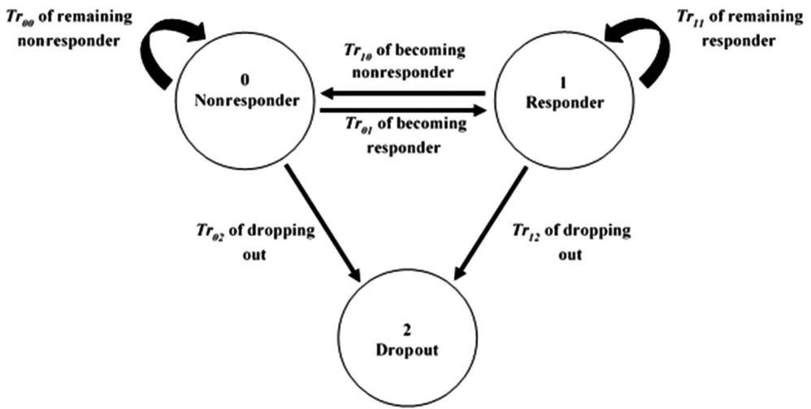

flowchart

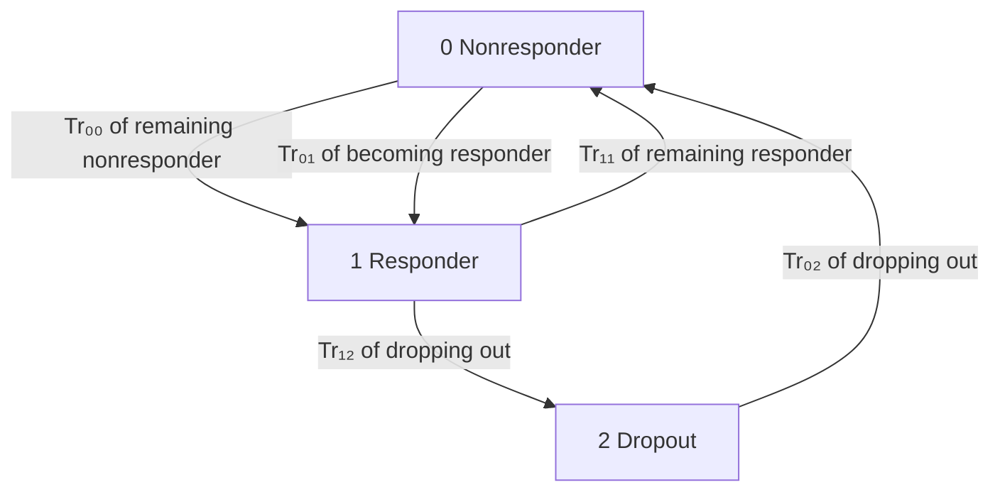

Figure 1. Markov model showing transition rates among 3 possible states: nonresponder (0), responder (1), and dropout (2). These 3 states were calculated based on a 5% body-weight change from baseline threshold using the individual predicted body weights.

# Results

# Study Design

Data from 6 Contrave-R trials, including 4591 subjects with a total of 21,488 observed BW measurements for a span of 20 to 65 weeks after baseline, were analyzed. During model development, data from 5 Contrave-R trials were used, and data from 1 Contrave-R trial (NB-301) were kept as external model evaluation data set. Clinical study 4, NB-304, which was comprised of obese subjects with T2DM, constitutes 10.9% of the total obese population. All patient demographics are shown in Table 1. The study population consists predominantly of women (more than 80%) in their mid-40s of white (-77 %) origin. The subjects were categorized into 4 obesity categories: overweight (BMI 25.0-29.9), class-I obesity (BMI 30-34.9), class-II obesity (BMI 35- 39.9), and class-III obesity (BMI  40).

# Population Pharmacodynamic Model Development

Population Dose- and Time-Dependent Pharmacodynamic Model. A systematic model-building strategy was applied to build structural, statistical, and covariate models using the model developed by van Wart et al as a starting point.23 The PD response of bupropion and naltrexone individually as well as in combination was tested on 3 key model parameters: ${ \mathrm { \bf K } } _ { \mathrm { i n } } , \ { \mathrm { \bf K } } _ { \mathrm { o u t } } ,$ and $\mathrm { B W _ { p r o g , l } }$ of the PopPD model. For constructing the structural DTPD model, several possibilities were tested including additive, multiplicative, inhibitory, and stimulatory drug effect; slope, and $\mathrm { E } _ { \mathrm { m a x } }$ concentration effect; combined $\mathrm { E } _ { \mathrm { m a x } }$ and individual $\mathrm { E } _ { \mathrm { m a x } }$ for both drugs; median time $\mathrm { ( E T _ { 5 0 } ) }$ , and time at steady state; monophasic and biphasic $\mathrm { E T } _ { 5 0 } ;$ and, last, combined and individual $\mathrm { E T } _ { 5 0 }$ for both drugs. Based on OFV and diagnostic plots, the best model fit was obtained with a simple $\mathrm { E } _ { \mathrm { m a x } }$ dose-effect model consisting of a combined $\mathrm { E } _ { \mathrm { m a x } }$ and individual $\mathrm { E D } _ { 5 0 }$ for naltrexone and bupropion (results not shown). Additionally, a doseand time-dependent function containing $\mathrm { E T } _ { 5 0 }$ was incorporated into the structural $\mathrm { E } _ { \mathrm { m a x } }$ model to account for time-dependent BW changes. The PD outcome of the resulting structural DTPD model was found to be best described when inhibiting the overall $\mathrm { B W _ { p r o g , l } }$ (equation 4). IIV was added exponentially on all final model parameter estimates except on ${ \bf k } _ { \mathrm { d e } }$ and $\bf k _ { \mathrm { p r o } }$ because no IIV was tested statistically significant on these parameters. Residual unexplained variability in the model was best described using an additive error model.

# Covariate Analysis

LBM values were missing in 40% of subjects and were imputed using 2 approaches, linear (Boer and Hume formula) and nonlinear (James and Duffull equations) regression analysis (equations (5) and (6)),27,30–32 by taking into account the observed individual BMI, sex, and age information. Given that all 4 approaches showed very similar predictions of LBM, and the Boer formula is the one most commonly used to predict LBM, the Boer formula was used during this analysis for imputation of missing $\mathrm { L B M } . ^ { 2 7 }$ Diabetes mellitus as a covariate was found to be statistically significant and impacting $\mathrm { E } _ { \mathrm { m a x } } ,$ kout, and $\bf k _ { \mathrm { p r o } }$ . For instance, higher drug effect $\mathrm { { E } } _ { \mathrm { { m a x } , } }$ of 4.69 kg and BW loss $\mathrm { k _ { o u t } }$ of 0.0543/week were observed for nondiabetic subjects as compared to those of diabetic population (Table 2). Diabetes mellitus was therefore implemented into the model as a fixed covariate on all parameters.

Table 2. Population Parameter Estimates for the DTPD and PPPD Models 

<table><tr><td rowspan="3"></td><td colspan="6">Population Parameter Estimates [RSE%]</td></tr><tr><td colspan="3">DTPD Model</td><td colspan="3">PPPD Model</td></tr><tr><td>Obese Nondiabetic Subjects</td><td>Diabetic Subjects</td><td>IIV%</td><td>Obese Nondiabetic Subjects</td><td>Diabetic Subjects</td><td>IIV%</td></tr><tr><td> $ED_{50,BUP}$ (mg)</td><td>645 [33]</td><td></td><td>607 [6]</td><td> $630^a$  [1]</td><td></td><td>7.09 [7]</td></tr><tr><td> $ED_{50,NAL}$ (mg)</td><td>54.6 [12]</td><td></td><td>207 [6]</td><td> $49.4^a$  [1]</td><td></td><td>13.9 [7]</td></tr><tr><td> $E_{max}$ (kg)</td><td>4.69 [3]</td><td>3.74 [6]</td><td>52.6 [13]</td><td>4.01 [1]</td><td>4.09 [1]</td><td>5.44 [9]</td></tr><tr><td> $T_{50}$ (week $^{-1}$ )</td><td>9.14 [1]</td><td></td><td>12.5 [6]</td><td>10.3 [1]</td><td></td><td>8.3 [8]</td></tr><tr><td> $k_{out}$ (week $^{-1}$ )</td><td>0.0543 [3]</td><td>0.0381 [7]</td><td>3.8 [4]</td><td>0.117 [5]</td><td>0.0665 [9]</td><td>132 [4]</td></tr><tr><td> $k_{rel}$ (week $^{-1}$ )</td><td>0.0344 [6]</td><td></td><td>177 [3]</td><td>0.0242 [8]</td><td></td><td>282 [3]</td></tr><tr><td> $k_{de}$ (week $^{-1}$ )</td><td>0.0792 [2]</td><td></td><td>-</td><td>0.0793 [2]</td><td></td><td>37.6 [4]</td></tr><tr><td>DSTIM (%)</td><td></td><td></td><td></td><td></td><td></td><td></td></tr><tr><td>White and Asian</td><td>18.5 [3]</td><td></td><td>17.7 [3]</td><td>19.5 [2]</td><td></td><td>46.8 [3]</td></tr><tr><td>Black</td><td>10.9 [10]</td><td></td><td></td><td>14.4 [4]</td><td></td><td></td></tr><tr><td>Other</td><td>9.73 [32]</td><td></td><td></td><td>21.8 [11]</td><td></td><td></td></tr><tr><td>Baseline BW (kg)</td><td>98.4 [0]</td><td>103 [1]</td><td>15.7 [1]</td><td>98.5 [0]</td><td>103 [1]</td><td>15.8 [1]</td></tr><tr><td> $k_{pro}$ (kg/y)</td><td>0.7 [FIXED]</td><td>2.7 [11]</td><td>-</td><td>0.7 [FIXED]</td><td>0.81 [2]</td><td>9.98 [12]</td></tr><tr><td>Additive error (kg)</td><td>1.35 [1]</td><td>-</td><td></td><td>1.48 [1]</td><td></td><td>-</td></tr></table>

$\mathsf { E D } _ { 5 0 } ,$ , BUP, median effective dose for buproprion; $\mathsf { E D } _ { 5 0 } ,$ , NAL,median effective dose for naltrexone; $\mathsf { E } _ { \mathsf { m a x } } ,$ the maximal drug effect; ${ \sf T } _ { 5 0 } ,$ medium effective time; ${ \sf K } _ { \sf { o u t } } ,$ , first-order rate constant of bodyweight loss; $\mathbf { k } _ { \mathrm { r e l } } ,$ first-order rate constant of onset of theoretical maximal LSI effect; ${ \bf k } _ { \sf d e }$ , first-order rate constant of loss of theoretical maximal LSI effect; $k _ { \mathsf { p r o } } .$ , disease progression rate constant; DSTIM indicates maximal fractional increase in $\mathbf { k _ { o u t } }$ due to LSI; DTPD, population doseand time-dependent pharmacodynamic; IIV, interindividual variability; PPPD, population-pharmacokinetic parameters and data; RSE, relative standard error.   
$^ { \mathtt { a } } \mathsf { E C } _ { 5 0 }$ (mg/L) values are reported here for both naltrexone and bupropion in PPPD models.

The DTPD model resulted in a higher estimated disease progression $( { \bf k } _ { \mathrm { p r o } } )$ being 2.7 kg/year for the diabetic obese population as compared to the fixed value of $\mathrm { k } _ { \mathrm { p r o } } \ 0 . 7$ kg/year in the nondiabetic obese population. Additional covariates were then tested for inclusion in addition to diabetic status. Among all the other tested covariates, race was found to have a significant impact on DSTIM: maximal fractional increase in ${ \bf k } _ { \mathrm { o u t } }$ due to LSI. During covariate model building, all 4 race groups, that is, white, Asian, black, and others, were tested individually as well as in different combinations for their potential impact on various model parameters including $\mathbf { k } _ { \mathrm { i n } } , \mathbf { k } _ { \mathrm { o u t } }$ , DSTIM, ${ \bf k } _ { \mathrm { d e } } ,$ and ${ \bf k } _ { \mathrm { r e l } }$ . Race had a statistically significant impact on DSTIM, with DSTIM varying from 18.5% for whites and Asians, 10.9% for blacks, and 9.73% for all other races included in these trials. This shows that the effect of LSI (hypocaloric diet and increased physical activity) contributing to BW loss was seen to be greatest in whites and Asians, followed by blacks and other races. The white and Asian populations were first tested separately before being merged into 1 group, as no difference could be estimated for Asians compared to whites as a result of only 18 Asians being included in the trials. Further covariates such as age and sex were hypothesized to have an impact on the maximal drug effect $\mathrm { E } _ { \mathrm { m a x } }$ and the LSI effect $\mathrm { k _ { r e l } } ;$ however, inclusion of these covariates was not statistically significant $( P > . 0 5 )$ and did not show any significant improvements in model diagnostics. In the final DTPD model, diabetes and race were thus added as categorical covariates based on GOF diagnostics, model stability, and precision of model parameter estimates. Table 2 summarizes the final population parameter estimates for the DTPD model.

Population PK Parameter and Data Model. To evaluate the impact of a PK-driven drug effect approach on BW change, a PPPD model was developed. The previously developed PopPK model (internal Takeda report dated February 9, 2010) based on PK data from study NB-303 (final parameter estimates are shown in Supplementary Table 2) was linked with the PopPD structural model developed during the DTPD model-building step. Final PopPK model estimates were utilized to drive the drug effect component E of the PopPD model, as shown in equation (7). The final parameter estimates of the PPPD and DTPD model are shown in Table 2 to allow the direct comparison between the concentration-driven (PPPD model) and dose-driven (DTPD model) approaches. The estimated disease progression $( { \mathrm { k } _ { \mathrm { p r o } } } )$ value was different in T2DM obese patients for DTPD and PPPD models. The estimated $\bf k _ { \mathrm { p r o } }$ value was fixed at 0.7 kg/week in nondiabetic obese subjects for both DTPD and PPPD model. The DTPD model estimated a significantly different $\bf k _ { \mathrm { p r o } }$ value of 2.7 kg/week for diabetic obese subjects, whereas the $\bf k _ { \mathrm { p r o } }$ estimated based on PPPD model was ${ \sim } 0 . 8$ kg/week for diabetic subjects, which was similar to that used as fixed value for nondiabetic obese subjects. In addition to $\mathrm { k } _ { \mathrm { p r o } } ,$ differences were also observed in BW loss parameter $\mathrm { k _ { o u t } }$ , with the PPPD model showing a higher BW loss $( \mathrm { k _ { o u t } = 0 . 1 1 7 ~ w e e k ^ { - 1 } } )$ compared to the ${ \bf k } _ { \mathrm { o u t } }$ of 0.0543 week−1 predicted using the DTPD model for nondiabetic obese subjects. Similar trend and magnitude of difference in ${ \bf k } _ { \mathrm { o u t } }$ were observed in diabetic subjects. When the IIVs of both PopPD models were compared, differences in population estimates were mainly observed in the IIVs of $\mathrm { E D } _ { 5 0 }$ and $\mathrm { E C } _ { 5 0 }$ for naltrexone and bupropion. The DTPD model estimated higher IIVs, with 607% for bupropion and 207% for naltrexone; whereas IIVs on $\mathrm { E C } _ { 5 0 }$ in the PPPD model were significantly lower, with 7.1% and 13.9% for bupropion and naltrexone, respectively.

Table 3. Population Parameter Estimates for DTPD-MM and PPPD-MM Models Describing Transition Rates Among Responder, Nonresponder, and Dropout States 

<table><tr><td rowspan="3"></td><td colspan="4">Population Parameters Estimates [RSE%]</td></tr><tr><td colspan="2">DTPD-Markov Model</td><td colspan="2">PPPD-Markov Model</td></tr><tr><td>Parameter Estimates [RSE]</td><td>IIV% [RSE]</td><td>Parameter Estimates [RSE]</td><td>IIV% [RSE]</td></tr><tr><td> $Tr_{10}$  (responder to nonresponder)</td><td>0.504 [50]</td><td>1210 [10]</td><td>0.000547 [3]</td><td>12 [12]</td></tr><tr><td> $Tr_{01}$  (nonresponder to responder)</td><td>0.145 [6]</td><td>16.9 [30]</td><td>0.0775 [4]</td><td>17 [12]</td></tr><tr><td> $Tr_{12}$  (responder to dropout)</td><td>0.506 [6]</td><td>23.4 [171]</td><td>0.647 [9]</td><td>294 [4]</td></tr><tr><td> $Tr_{02}$  (nonresponder to dropout)</td><td>0.293 [8]</td><td>9.54 [15]</td><td>0.388 [3]</td><td>11.9 [11]</td></tr><tr><td> $Tr_{00}$  (nonresponder to nonresponder) $^a$ </td><td>-0.438</td><td>...</td><td>-0.465</td><td>...</td></tr><tr><td> $Tr_{11}$  (responder to responder) $^a$ </td><td>-1.01</td><td>...</td><td>-0.647</td><td>...</td></tr></table>

DTPD indicates population dose- and time-dependent pharmacodynamic; IIV, interindividual variability; PPPD, population-pharmacokinetic parameters and data; RSE, relative standard error; Tr, transition rate.   
$^ \mathrm { a } \mathsf { T r } _ { | | }$ and $\mathtt { T r } _ { 0 0 }$ were calculated in accordance with law of transition, ie, $\mathsf { T r } _ { 1 1 } + \mathsf { T r } _ { 1 0 } + \mathsf { T r } _ { 1 2 } = 0 ,$ , and $\mathsf { T r } _ { 0 0 } + \mathsf { T r } _ { 0 1 } + \mathsf { T r } _ { 0 2 } = 0 ,$ , respectively.

# Markov Model Development

All subjects were categorized into nonresponders, responders, and dropouts at each time point based on the 5% BW change from baseline threshold using the individual predicted BW of both DTPD and PPPD models. The final counts of nonresponders, responders, and dropouts predicted using the DTPD and PPPD models at week 56 were compared with the observed data (Figure S1). The DTPD model had slightly overpredicted nonresponders and underpredicted responders by -11% difference from the observed data. The PPPD model had predicted the nonresponders and responders with only -3% difference from the observed data (Figure S1).

After linking the predicted PD outcome, BW change, derived from the developed DTPD and PPPD models to the $\mathrm { T R } _ { 1 0 }$ in the MM, the model was used to predict the proportions of nonresponders, responders, and dropouts over time. The parameter estimates of the DTPD-MM and PPPD-MM models are shown in Table 3. All model parameters were well estimated with acceptable precision. There was higher probability of being a nonresponder predicted by the DTPD-MM (high $\mathrm { T r } _ { 1 0 }$ and low $\mathrm { T r } _ { 0 2 } )$ as compared to the predictions of the PPPD-MM . In the PPPD-MM more subjects were switching from nonresponder to responder rather than nonresponder $( \mathrm { T r } _ { 0 1 }$ of $0 . 0 6 9 > \mathrm { T r } _ { 1 0 }$ of 0.000547) as compared to DTPD-MM $( \mathrm { T r } _ { 0 1 }$ of $0 . 1 4 5 \mathrm { ~ < ~ } \mathrm { T r } _ { 1 0 }$ of 0.504). High IIV were observed for $\mathrm { T r } _ { 1 0 }$ (1210) in the DTPD-MM and $\mathrm { T r } _ { 1 2 }$ (294) in the PPP&D-MM. Overall, the PPP&D-MM predictions were closer to the observed nonresponders, responders, and dropouts as compared to DTPD-MM, which showed the importance of collecting drug concentrations even in a limited number of clinical trials to inform the model building and improve model prediction.

# Model Evaluation

Population PD Models. Both developed PopPD models, DTPD and PPPD, were evaluated using internal and external model evaluation tools. Internal model evaluation was performed using GOF plots, individual fit plots, and VPCs. The GOF and individual fit plots showed an overall good fit for both PopPD models (Figure S2-4). Observed data were slightly better predicted using the PPPD model over the DTPD model seen in a closer and more symmetrical distribution of the observed vs predicted BWs around the line of identity. Underprediction of ${ \bf k } _ { \mathrm { o u t } }$ resulted in BW overprediction for the DTPD model, which in turn translates into prediction bias, as observed in its GOF plots. Superiority of the PPPD model seen in the GOF plots was attributed to the PK component used in this model, hence leading to a better prediction of the true drug effect as well as the overall IIV predictions. The VPCs demonstrated that both models captured the observed data well, based on the comparison of the median and 90% CI of the observed data with the simulations (Figure 2 A). Only the 95th percentile of the PPPD model was slightly underpredicted by the model, which was found to be an artifact from the diabetic obese population (study 6) seen when stratifying the VPCs based on diabetic vs nondiabetic obese (Figure S5).

For external model evaluation, simulations of BW data for study 3 were performed using the final population estimates and model structures of both PopPD models and the information of the study design of study 3. Simulations of BW change over time were overlaid with the observed data of study 3 (Figure 2 B); where the median and 90% CI of the observed data were within the 90% CI of the corresponding predictions. Both PopPD models allowed a good prediction of the longitudinal BW change of subjects in the clinical study 3.

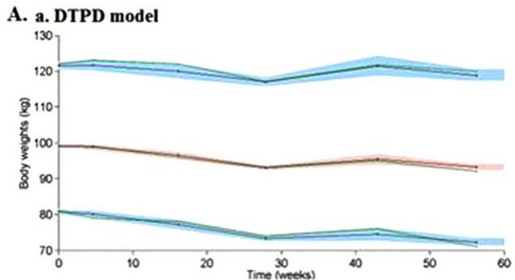

line

| Time (weeks) | Body weights (kg) - Line 1 | Body weights (kg) - Line 2 | Body weights (kg) - Line 3 |
| ------------ | -------------------------- | -------------------------- | -------------------------- |
| 0            | 120                        | 100                        | 80                         |
| 30           | 115                        | 95                         | 75                         |
| 60           | 120                        | 95                         | 70                         |

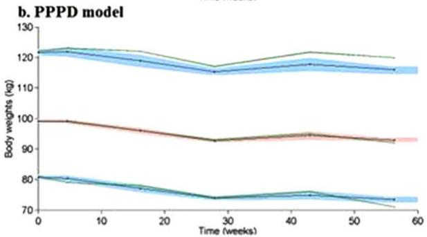

line

| Time (weeks) | Body weights (kg) - Line 1 | Body weights (kg) - Line 2 | Body weights (kg) - Line 3 | Body weights (kg) - Line 4 | Body weights (kg) - Line 5 |
| ------------ | -------------------------- | -------------------------- | -------------------------- | -------------------------- | -------------------------- |
| 0            | 122                        | 123                        | 100                        | 80                         | 81                         |
| 10           | 121                        | 122                        | 99                         | 79                         | 80                         |
| 20           | 120                        | 121                        | 98                         | 78                         | 79                         |
| 30           | 118                        | 119                        | 93                         | 75                         | 76                         |
| 40           | 120                        | 121                        | 95                         | 76                         | 77                         |
| 50           | 119                        | 120                        | 94                         | 74                         | 75                         |
| 60           | 118                        | 119                        | 93                         | 73                         | 74                         |

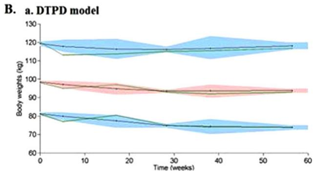

line

| Time (weeks) | Body weights (kg) - Blue Area | Body weights (kg) - Green Area | Body weights (kg) - Red Area |
| ------------ | ----------------------------- | ------------------------------ | ---------------------------- |
| 0            | 120                           | 120                            | 100                          |
| 30           | 115                           | 115                            | 95                           |
| 60           | 120                           | 120                            | 95                           |

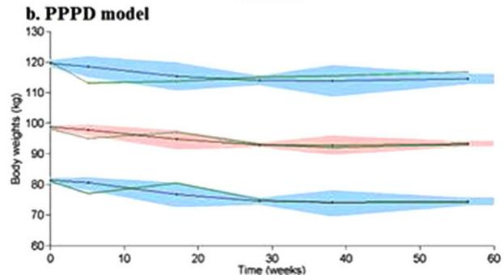

line

| Time (weeks) | Body weights (kg) - Line 1 | Body weights (kg) - Line 2 | Body weights (kg) - Line 3 |
| ------------ | -------------------------- | -------------------------- | -------------------------- |
| 0            | 120                        | 100                        | 80                         |
| 60           | 115                        | 95                         | 75                         |

Figure 2. A.a: Internal model evaluation of DTPD model. A.b: Internal model evaluation of PPPD model. B.a: External model evaluation of DTPD model. B.b: External model evaluation of PPPD model. Visual predictive check (VPC) plots show the median, 5th, and 95th percentiles of the observed BW (middle, lower, and upper green lines, respectively) and the median, 5th, and 95th percentiles of the simulated BW (middle, lower, and upper black lines, respectively) with 95%CI (red-shaded area of simulated median and the lower and upper blue-shaded areas of simulated 5th and 95th percentiles, respectively). BW indicates body weight; DTPD, dose- and time-dependent pharmacodynamic; PPPD, population-pharmacokinetic parameter and data.

Additionally, both PopPD models were evaluated on their ability to predict longitudinal BW change over a study period of 56 weeks. The final model structures and their respective population parameter estimates were utilized and predicted a greater BW loss for the treatment (naltrexone/bupropion) arm compared to that of the placebo arm (Figure 3). Overall, the diabetic obese population was simulated to have a smaller BW reduction in either the treatment or the placebo arm by 2% to 3% as compared to nondiabetic obese, which reflected the trend seen in the observed data from the Contrave-R trials. Comparison between the DTPD and PPPD models revealed that the DTPD model underpredicted the BW change; however, both models have shown a maximum BW reduction around weeks 30 to 35, which was in agreement with the observed data.

Markov Model. For internal MM evaluation, 500 data sets were simulated (Table 3) and compared to the observed data. The proportions of nonresponders, responders, and dropouts were evaluated for the time periods of 0 to 28 weeks and 28 to 56 weeks (Figure 4). The DTPD-MM model overpredicted the nonresponders and underpredicted the responder rates during the time frame of 28 to 56 weeks seen when the predictions are overlaid with the median proportions of the respective states of the observed data (Figure 4a). This observation was attributed to the higher predicted Tr10 and Tr00 values as compared to the respective transition rate of the PPPD-MM (Table 3). The PPPD-MM predictions were closer to the observed proportion of nonresponders and responders over 0 to 56 weeks (Figure 4b). Also, PPPD-MM predictions for dropouts over 0 to 28 weeks were closer to the observed data as compared to the DTPD-MM predictions.

For external MM evaluation, the population estimates of both model estimates were utilized to estimate the transition of responders/nonresponders/dropouts over time using clinical study 3 as an external dataset (Figure 5). Both, DTPD-MM and PPPD-MM predictions of nonresponder, responder, and dropout counts were close to the observed data during the period of 28 to 56 weeks.

# Discussion

Obesity remains a critical and important unmet medical need with ever increasing healthcare costs.1–5 Thus, there is a need to improve antiobesity clinical trial efficiency in terms of adherence to a clinical trial. Mathematical modeling has become a viable tool to predict a treatment response during drug development and thus the efficacy rate of a new drug product during clinical trials.33 During this analysis, a quantitative modeling framework was developed that can be utilized to predict the outcome in terms of efficacy and adherence to a new antiobesity drug product during a clinical trial using a MM approach. A previously developed PopPD model by Van Wart et al was used as a starting point that accounted for LSI and disease progression to describe the time course of longitudinal BW change in antiobesity trials.23 By use of the data from 6 Contrave-R clinical trials, the drug effect was implemented into the Van Wart model for the combination therapy of naltrexone/bupropion to allow for predictions of longitudinal BW change under drug treatment besides placebo and LSI treatment during antiobesity clinical trials.23

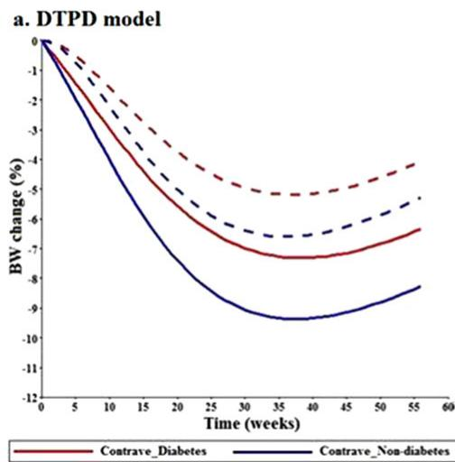

line

| Time (weeks) | Contrave_Diabetes | Contrave_Non-diabetes |
| ------------ | ----------------- | --------------------- |
| 0            | 0.0               | 0.0                   |
| 5            | -1.5              | -2.0                  |
| 10           | -3.0              | -4.0                  |
| 15           | -4.5              | -6.0                  |
| 20           | -5.5              | -7.5                  |
| 25           | -6.0              | -8.5                  |
| 30           | -6.5              | -9.0                  |
| 35           | -7.0              | -9.5                  |
| 40           | -7.5              | -9.0                  |
| 45           | -7.0              | -8.5                  |
| 50           | -6.5              | -8.0                  |
| 55           | -6.0              | -7.5                  |
| 60           | -5.5              | -7.0                  |

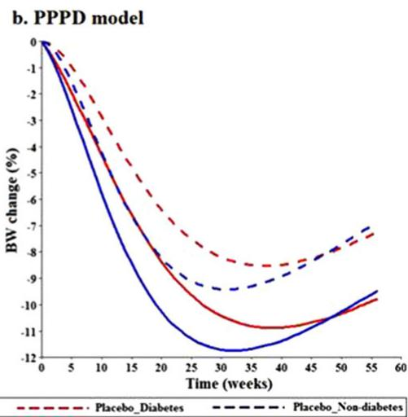

line

| Time (weeks) | Placebo_Diabetes | Placebo_Non-diabetes |
| ------------ | ---------------- | -------------------- |
| 0            | 0.0              | 0.0                  |
| 5            | -1.5             | -2.0                 |
| 10           | -3.0             | -4.0                 |
| 15           | -4.5             | -6.0                 |
| 20           | -6.0             | -8.0                 |
| 25           | -7.5             | -9.0                 |
| 30           | -9.0             | -10.0                |
| 35           | -10.0            | -11.0                |
| 40           | -9.5             | -10.5                |
| 45           | -8.5             | -9.5                 |
| 50           | -7.5             | -8.5                 |
| 55           | -6.5             | -7.5                 |
| 60           | -5.5             | -6.5                 |

Figure 3. a: Typical predictions of percentage BW change over time using the DTPD model. b: Typical predictions of percentage BW change over time using the PPPD model. Solid lines indicate $\mathsf { C o n t r a v e ^ { \textregistered } }$ treated arm; dashed lines represent placebo arm, blue color indicates nondiabetic obese population, and red color diabetic obese population. BW indicates body weight;DTPD, dose- and time-dependent pharmacodynamic; PPPD, populationpharmacokinetic parameter and data.

To this extent, 2 different PopPD models were developed in which the drug effect was either a dose-driven DTPD model or a concentration-driven PPPD model. The DTPD model comparatively underestimated the LSI effect, as a result of lower DSTIM values and a higher $\mathbf { k } _ { \mathrm { r e l } }$ value (Table 2). The underprediction of weight loss $\mathrm { ( k _ { o u t } ) }$ as a result of the DTPD model leads to slight overpredictions of the nonresponder rate and underpredictions of the responder rate by the DTPD-MM compared to the PPPD-MM. Another important observation was the difference in parameter estimation of $\bf k _ { \mathrm { p r o } }$ between diabetic and nondiabetic obese subjects. It must be mentioned that $\bf k _ { \mathrm { p r o } }$ was fixed to 0.7 kg/week for nondiabetic subjects in both PopPD models, and estimation was only done for diabetic obese subjects in both PopPD models. The reason for fixing $\bf k _ { \mathrm { p r o } }$ was that the value of this parameter was adequately described in the literature for nondiabetic obese subjects, and trying to estimate this parameter led to identifiability issues of the model. In addition, fixing the parameter $\bf k _ { \mathrm { p r o } }$ made it possible to stabilize the model, adequately fit the observations, and it ensured parameter identifiability of all model parameters. The DTPD model was further able to distinguish between diabetic and nondiabetic obese subjects, as suggested by significantly different values predicted for $\mathbf { k } _ { \mathrm { p r o } } .$ . However, population estimates of $\bf k _ { \mathrm { p r o } }$ predicted by the PPPD model were similar for both diabetic and nondiabetic obese subjects. Because the final PopPK parameter estimates used in the PPPD approach were mainly derived from study 5, which included only nondiabetic obese subjects, we hypothesize that the final PPPD model may not be able to capture the difference in disease progression between diabetic and nondiabetic obese subjects. This observation may suggest that diabetes mellitus does play a role in the PK of the drugs; however, the exact reason is uncertain.34 The DTPD model used the drug response of diabetic and nondiabetic obese subjects to predict the disease progression and drug effect. Thus, this may account for the ability to predict a difference between diabetic and nondiabetic obese subjects. For instance, higher predicted $\bf k _ { \mathrm { p r o } }$ values (ie, 2.7 kg/week) for diabetic subjects using the DTPD model were observed as compared to the nondiabetic population (0.7 kg/week), which indicated higher BW gain in diabetic subjects. One limitation of the analysis was the narrow range of doses used based on the included clinical Contrave-R trials, which resulted in higher $\mathrm { E D } _ { 5 0 }$ and $\mathrm { E C } _ { 5 0 }$ final parameter estimates as expected for the DTPD and PPPD model, respectively. Further, high IIVs in $\mathrm { E D } _ { 5 0 }$ were observed for both naltrexone and bupropion when the DTPD approach was used, whereas for the PPPD model, the PK-driven response might have contributed to the lower IIVs in $\mathrm { E C } _ { 5 0 }$ for both drugs. The high IIVs are also assumed to be a result of the narrow dose range tested as well as that drug-specific parameters are driven with a dose response using the DTPD model rather than with a PK response. Sufficient sensitivity analysis using log-likelihood profiling was performed, and the high IIV did not seem to influence the population mean parameter estimates. This can be attributed to the limitation of the data at hand rendering full characterization of dose or exposure response difficult.

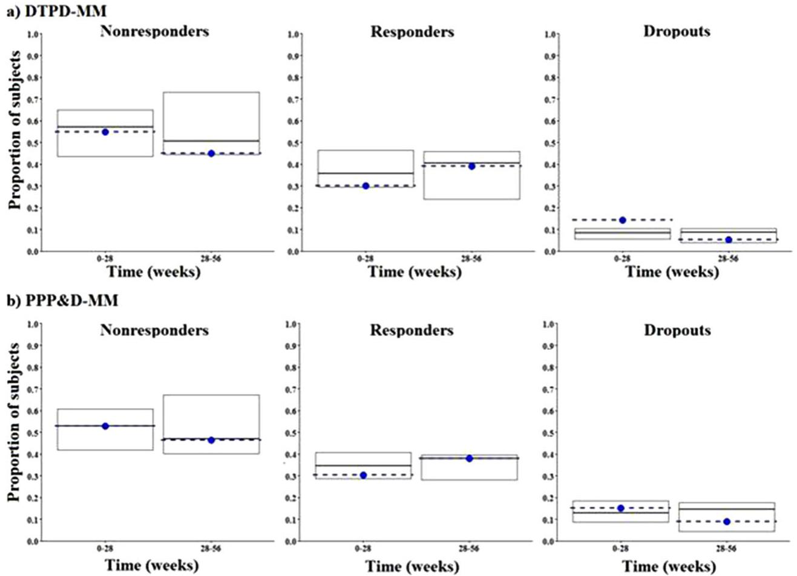  
Figure 4. a: Internal model evaluation of DTPD-MM. b: Internal model evaluation of PPPD-MM. Each plot shows the median proportions of simulated subjects (middle black line of box plot) and observed (dotted blue line) in each state along with the 5th and 95th simulated percentiles (top and lower edge of box plot). Nonresponders, responders, and dropout states are represented in the left, middle, and right side plots, respectively. DTPD indicates dose- and time-dependent pharmacodynamic; MM, Markov model; PPPD, population-pharmacokinetic parameter and data.

For further understanding of the model and its estimates, longitudinal BW change over time was simulated using the final model structures and the respective final population-parameter estimates of both DTPD and PPPD models (Figure 3). As discussed before, the DTPD model underpredicted the BW loss as a result of lower predicted DSTIM values and a higher predicted value of $\mathbf { k } _ { \mathrm { r e l } }$ (Table 2). Both models indicated a maximum BW reduction in diabetic and nondiabetic obese subjects around 30 to 35 weeks after treatment start, along with the superiority of the treatment arm over the placebo arm. Comparison of the predictions between the DTPD and the PPPD models revealed that for the diabetic obese population, the DTPD model forecast the observed trend better and was able to distinguish between nondiabetic population due to the difference in $\mathrm { E } _ { \mathrm { m a x } }$ and $\bf k _ { \mathrm { p r o } }$ values (Table 2). However, lower values for $\bf k _ { \mathrm { p r o } }$ for the diabetic obese population for the PPPD model stabilizes the effect of $\mathrm { k _ { o u t } }$ after 35 weeks and thus results in overprediction of BW loss at 56 weeks as compared to observed data.

The aim of this analysis was to understand the pattern of dropouts and factors leading to high dropout rates in antiobesity clinical trials. Multiple statistical strategies have been reported in literature for modeling dropout data including Markov chain models,

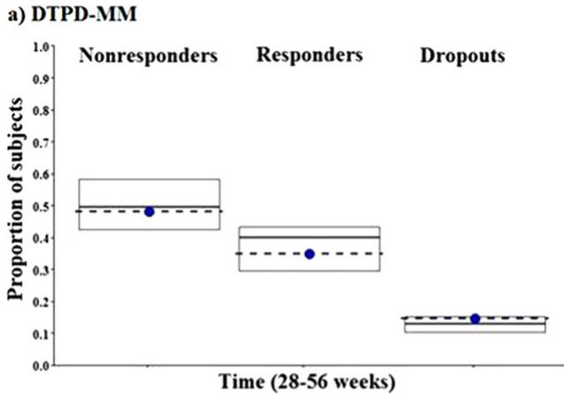

boxplot

| Group        | Proportion of subjects |
| ------------ | ---------------------- |
| Nonresponders | 0.5                    |
| Responders   | 0.35                   |
| Dropouts     | 0.15                   |

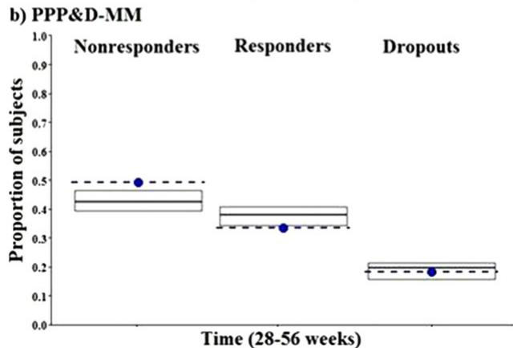

boxplot

| Group        | Proportion of subjects |
| ------------ | ---------------------- |
| Nonresponders | 0.5                    |
| Responders   | 0.35                   |
| Dropouts     | 0.2                    |

Figure 5. a: External model evaluation of DTPD-MM during weeks 28- 56. b: External model evaluation of PPPD-MM during weeks 28-56. Each plot shows the median proportions of subject simulated (middle black line of box plot) and observed (dotted blue line) in each state along with the 5th and 95th simulated percentiles (top and lower edge of box plot). Nonresponders, responders, and dropout states are respectively represented in the left, middle, and right side plots, respectively. DTPD indicates dose- and time-dependent pharmacodynamic; MM, Markov model; PPPD, population-pharmacokinetic parameter and data.

Kaplan-Meier estimation, and Cox proportional hazard models.35 In the present study MM was used because of its superiority in terms of multiple as well as recurrent outcomes, accommodating censored data, competing risks (informative censoring), frailty, and nonconstant survival probabilities.36 The present analysis has employed BW change, being the predicted clinical outcome of both PopPD models, to drive the transitions among nonresponder, responder, and dropout states of the MM based on the subject’s adherence to the trial interventions of the clinical trial protocol.15 Because the observed “categorical” response was derived from a threshold of 5% BW change, and BW change is itself a slow process, transitions between different states (ie, nonresponder, responder, and dropout) over a small time scale were not sufficiently described. Therefore, proportions of nonresponders, responders, and dropouts were evaluated over periods of 0 to 28 weeks and 28 to 56 weeks (Figure 4) rather than on a daily or weekly basis. In addition, measuring BW at times such as baseline, midstudy, and end of study is common in a phase 3 trial because the primary outcome is usually the BW change from baseline at 6 months (28 weeks) and 1 year (56 weeks).

Comparing the results of both PopPD-MM models indicated that the DTPD-MM predicted a higher probability of staying a nonresponder as compared to the PPPD-MM (Table 3). The trend supporting superiority of drug treatment over placebo was reflected in the responder-to-nonresponder transition, where more subjects were switching to become responders rather than nonresponders as predicted by the PPPD-MM compared to DTPD-MM. Therefore, PPPD-MM showed higher responder numbers as compared to nonresponders (Figure S1). Higher IIVs were observed for Tr10 in DTPD-MM as compared to PPPD-MM because the dose-driven approach was used in DTPD-MM as compared to PK-driven approach of PPPD-MM (Table 3).

The internal model evaluations of both PopPD-MM models showed that both models were able to adequately capture the transition rates among nonresponders, responders, and dropouts from 0 to 28 weeks and from 28 to 56 weeks (Figure 4). High dropout rates observed during start of the trial (0-28 weeks) are mainly the result of subject noncompliance resulting in nonadherence to clinical trials and dropping out from the study. The drug effect and related trial outcomes are analyzed during late phases of antiobesity trials. Therefore, the external model evaluation evaluated the performance of both PopPD-MM during 28 to 56 weeks, which revealed that both models were able to capture the transitions among nonresponders, responders, and dropouts during the late phase of the clinical antiobesity trials (weeks 28-56) adequately well. Additionally, the present study confirms that the DTPD model, which has a simpler model framework, can be used to assess the response and success of new antiobesity drugs during early drug development, although increasing the model complexity by adding PK information, as shown for the PPPD model, does not add much more value.

This analysis based on Contrave-R clinical trial data is limited by the fact that the study population consists of mainly middle-aged white women (around 80% overall). This is a common limitation in antiobesity phase 3 studies, as women are more likely to seek antiobesity treatment than men.24 Another limitation of the MM was its inability to capture variability of observed data over a small timeframe. The reason for that trend is that the MM was predicting the transition over the entire 56 weeks assuming 5% BW change (a slow phenomenon) as the responder/nonresponder criterion. Decreasing the 5%

BW threshold to 1% to 2% might be able to “correct” the transition probabilities in order to capture the variability of observed data over small unit of time and improve the predictability of the Markov models. The hypothesis is yet to be tested in future studies.

# Conclusion

Both DTPD and PPPD models described the longitudinal BW loss and transitions among nonresponder, responder, and dropout states during the studied antiobesity trials adequately well. Incorporation of PK information to drive the drug’s PD effect improved the precision of the model parameter estimates for the drug effect. Even though slight improvement has been seen with the PPPD approach, a DTPD approach might still be considered as an alternative approach during drug development where PK data are not available from all clinical trials. Therefore, the present analysis proposed a DTPD-MM as an alternative modeling framework that might be used for informing clinical drug development to predict the clinical outcomes and dropout rates of future antiobesity trials. Hence, it can be used as an armamentarium of modeling techniques to implement model-informed drug development providing quantitative insight into clinical trial protocol adherence and its impact on clinical response. The developed PopPD-MM modeling framework can further be utilized and applied to predict the outcome and responder rates of clinical trials in a variety of drug development programs in addition to antiobesity trials.

# Conflict of Interests/Disclosure

This work was supported by Takeda Pharmaceuticals Research Division, Pharmacometrics, Deerfield, IL, USA.

# Author Contributions

M.N.T., M.V., G.L., and L.L. designed the research. V.D.S., F.P.C., and M.N.T. performed the research. V.D.S. and F.P.C. contributed equally to the analysis. V.D.S., F.P.C., M.N.T., M.V., L.L., and G.L. analyzed the results. V.D.S., F.P.C., M.N.T., M.V., G.L., and L.L. wrote the manuscript.

# Clinical Trials Registry

Clinical trials mentioned in this paper (studies 2-5) were registered under the numbers: NCT00364871, NCT00532779, NCT00567255, and NCT00456521.

# References

1. Rodgers RJ, Tschop MH, Wilding JP. Anti-obesity drugs: past, present and future. Dis Model Mech. 2012;5(5):621–626.   
2. Shields M, Carroll MD, Ogden CL. Adult obesity prevalence in Canada and the United States. NCHS Data Brief. 2011(56): 1–8.

3. Flegal KM, Graubard BI, Williamson DF, Gail MH. Causespecific excess deaths associated with underweight, overweight, and obesity. JAMA. 2007;298(17):2028–2037.   
4. Daniels J. Obesity: America’s epidemic. Am J Nurs. 2006;106(1):40–49, quiz 49-50.   
5. Cawley J, Meyerhoefer C. The medical care costs of obesity: an instrumental variables approach. J Health Econ. 2012;31(1):219– 230.   
6. Hussain HT, Parker JL, Sharma AM. Clinical trial success rates of anti-obesity agents: the importance of combination therapies. Obes Rev. 2015;16(9):707–714.   
7. Gadde KM. Current pharmacotherapy for obesity: extrapolation of clinical trials data to practice. Expert Opin Pharmacother. 2014;15(6):809–822.   
8. Label. Contrave (naltrexone HCl and bupropion HCl) Extended-Release Tablets La Jolla, CA: Orexigen Therapeutics; 2014.   
9. Ornellas T, Chavez B. Naltrexone SR/bupropion SR (Contrave): a new approach to weight loss in obese adults. P T. 2011;36(5):255–262.   
10. Greenway FL, Fujioka K, Plodkowski RA, et al. Effect of naltrexone plus bupropion on weight loss in overweight and obese adults (COR-I): a multicentre, randomised, double-blind, placebo-controlled, phase 3 trial. Lancet. 2010;376(9741):595– 605.   
11. Apovian CM, Aronne L, Rubino D, et al. A randomized, phase 3 trial of naltrexone SR/bupropion SR on weight and obesity-related risk factors (COR-II). Obesity (Silver Spring). 2013;21(5):935–943.   
12. Sharma VD, Singla A, Chaudhary M, Taneja M. Population pharmacokinetics of fixed dose combination of ceftriaxone and sulbactam in healthy and infected subjects. AAPS Pharm-SciTech. 2016;17(5):1192–1203.   
13. Bazzoli C, Retout S, Mentre F. Design evaluation and optimisation in multiple response nonlinear mixed effect models: PFIM 3.0. Comput Methods Programs Biomed. 2010;98(1):55–65.   
14. Combes FP, Retout S, Frey N, Mentre F. Prediction of shrinkage of individual parameters using the Bayesian information matrix in non-linear mixed effect models with evaluation in pharmacokinetics. Pharm Res. 2013;30(9):2355–2367.   
15. Lacroix BD, Lovern MR, Stockis A, Sargentini-Maier ML, Karlsson MO, Friberg LE. A pharmacodynamic Markov mixedeffects model for determining the effect of exposure to certolizumab pegol on the ACR20 score in patients with rheumatoid arthritis. Clin Pharmacol Ther. 2009;86(4):387–395.   
16. Hollander P, Gupta AK, Plodkowski R, et al. Effects of naltrexone sustained-release/bupropion sustained-release combination therapy on body weight and glycemic parameters in overweight and obese patients with type 2 diabetes. Diabetes Care. 2013;36(12):4022–4029.   
17. Wadden TA, Foreyt JP, Foster GD, et al. Weight loss with naltrexone SR/bupropion SR combination therapy as an adjunct to behavior modification: the COR-BMOD trial. Obesity (Silver Spring). 2011;19(1):110–120.   
18. Orexigen-Therapeutics. New Drug Application 200063: Contrave (Naltrexone 4 mg, 8 mg/Bupropion HCl 90 mg extended release tablet). La Jolla, CA: Orexigen Therapeutics; 2010.   
19. Chan PL, Jacqmin P, Lavielle M, McFadyen L, Weatherley B. The use of the SAEM algorithm in MONOLIX software for estimation of population pharmacokinetic-pharmacodynamicviral dynamics parameters of maraviroc in asymptomatic HIV subjects. J Pharmacokinet Pharmacodyn. 2011;38(1):41- 61.   
20. Petersson KJ, Hanze E, Savic RM, Karlsson MO. Semiparametric distributions with estimated shape parameters. Pharm Res. 2009;26(9):2174–2185.

21. Pillai GC, Mentre F, Steimer JL. Non-linear mixed effects modeling—from methodology and software development to driving implementation in drug development science. J Pharmacokinet Pharmacodyn. 2005;32(2):161–183.   
22. Lavielle M, Mentre F. Estimation of population pharmacokinetic parameters of saquinavir in HIV patients with the MONO-LIX software. J Pharmacokinet Pharmacodyn. 2007;34(2):229– 249.   
23. Van Wart S, Tsai M, Chan J, Cirincione BB. Modeling the timecourse of body weight for subjects given placebo in an obesity trial. American Conference on Pharmacometrics; April 3, 2011; San Diego, CA.   
24. Flegal KM, Carroll MD, Kit BK, Ogden CL. Prevalence of obesity and trends in the distribution of body mass index among US adults, 1999-2010. JAMA. 2012;307(5):491–497.   
25. Ogden CL, Carroll MD, Kit BK, Flegal KM. Prevalence of obesity and trends in body mass index among US children and adolescents, 1999-2010. JAMA. 2012;307(5):483–490.   
26. Naik H, Lu J, Cao C, Pfister M, Vakilynejad M, Leifke E. Pharmacometric approaches to guide dose selection of the novel GPR40 agonist TAK-875 in subjects with type 2 diabetes mellitus. CPT Pharmacometrics Syst Pharmacol. 2013;2:e22. https://doi.org/10.1038/psp.2012.23   
27. Boer P. Estimated lean body mass as an index for normalization of body fluid volumes in humans. Am J Physiol. 1984;247(4 Pt 2):F632–F636.   
28. Zhang L, Beal SL, Sheiner LB. Simultaneous vs. sequential analysis for population PK/PD data I: best-case performance. J Pharmacokinet Pharmacodyn. 2003;30(6):387–404.

29. Brendel K, Comets E, Laffont C, Laveille C, Mentre F. Metrics for external model evaluation with an application to the population pharmacokinetics of gliclazide. Pharm Res. 2006;23(9):2036–2049.   
30. Hume R. Prediction of lean body mass from height and weight. J Clin Pathol. 1966;19(4):389–391.   
31. James WPT. Research on obesity. Nutr Bull. 1977;4(3):187–190.   
32. Green B, Duffull S. Caution when lean body weight is used as a size descriptor for obese subjects. Clin Pharmacol Ther. 2002;72(6):743–744.   
33. Gieschke R, Steimer JL. Pharmacometrics: modelling and simulation tools to improve decision making in clinical drug development. Eur J Drug Metab Pharmacokinet. 2000;25(1):49–58.   
34. Dostalek M, Akhlaghi F, Puzanovova M. Effect of diabetes mellitus on pharmacokinetic and pharmacodynamic properties of drugs. Clin Pharmacokinet. 2012;51(8):481–499.   
35. Lindsey JK. Dropouts in longitudinal studies: definitions and models. J Biopharm Stat. 2000;10(4):503–525.   
36. Abner EL, Charnigo RJ, Kryscio RJ. Markov chains and semi-Markov models in time-to-event analysis. J Biometr Biostat Suppl. 2014. https://doi.org/10.4172/2155-6180.S1-e001

# Supporting Information

Additional Supporting Information may be found in the online version of this article at the publisher’s website.