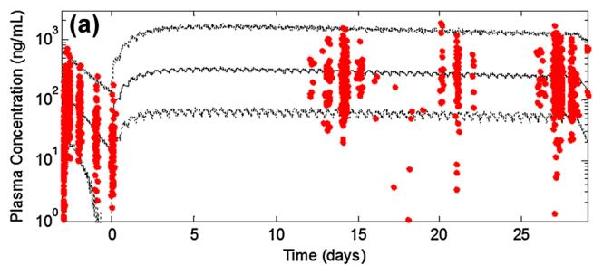
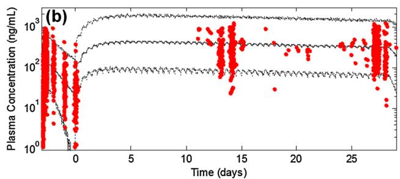
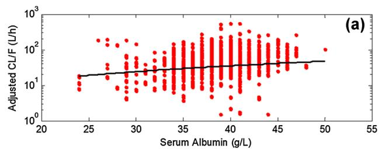
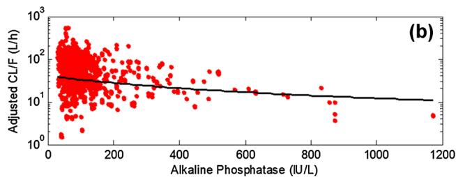
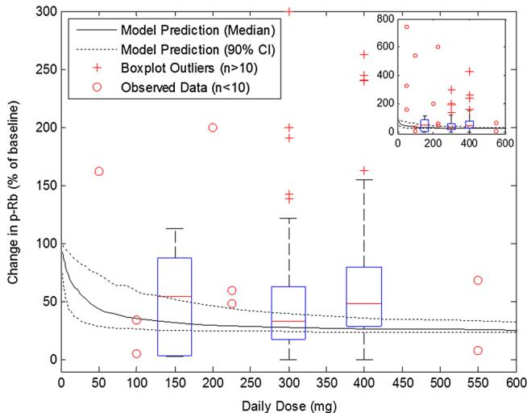

ORIGINAL RESEARCH ARTICLE

# A Population Pharmacokinetic and Pharmacodynamic Analysis of Abemaciclib in a Phase I Clinical Trial in Cancer Patients

Sonya C. Tate1 • Amanda K. Sykes1 • Palaniappan Kulanthaivel2 • Edward M. Chan2 • P. Kellie Turner2 • Damien M. Cronier1

Published online: 24 May 2017

\- The Author(s) 2017. This article is an open access publication

# Abstract

Background and Objectives Abemaciclib, a dual inhibitor of cyclin-dependent kinases 4 and 6, has demonstrated clinical activity in a number of different cancer types. The objectives of this study were to characterize the pharmacokinetics of abemaciclib in cancer patients using population pharmacokinetic (popPK) modeling, and to evaluate target engagement at clinically relevant dose levels.

Methods A phase I study was conducted in cancer patients which incorporated intensive pharmacokinetic sampling after single and multiple oral doses of abemaciclib. Data were analyzed by popPK modeling, and patient demographics contributing to pharmacokinetic variability were explored. Target engagement was evaluated by combining the clinical popPK model with a previously developed preclinical pharmacokinetic/pharmacodynamic model.

Results The pharmacokinetic analysis incorporated 4012 plasma concentrations from 224 patients treated with abemaciclib at doses ranging from 50 to 225 mg every 24 h and 75 to 275 mg every 12 h. A linear one-compartment model with time- and dose-dependent relative

bioavailability $( F _ { \mathrm { r e l } } )$ adequately described the pharmacokinetics of abemaciclib. Serum albumin and alkaline phosphatase were the only significant covariates identified in the model, the inclusion of which reduced inter-individual variability in $F _ { \mathrm { r e l } }$ by 10.3 percentage points. By combining the clinical popPK model with the previously developed pre-clinical pharmacokinetic/pharmacodynamic model, the extent of target engagement in skin in cancer patients was successfully predicted.

Conclusion The proportion of abemaciclib pharmacokinetic variability that can be attributed to patient demographics is negligible, and as such there are currently no dose adjustments recommended for adult patients of different sex, age, or body weight.

Trial registration NCT01394016 (ClinicalTrials.gov).

# Key Points

Abemaciclib pharmacokinetics in cancer patients were successfully described using a linear onecompartment model with time- and dose-dependent relative bioavailability.

No clinically relevant covariates were identified; therefore, no abemaciclib dose adjustments are currently recommended for adult patients of different sex, age, or body weight.

The abemaciclib pre-clinical pharmacokinetic/ pharmacodynamic relationship was successfully translated to the clinical setting, demonstrating target engagement at clinically effective dose levels, and supporting the translational use of xenograft tumors.

Electronic supplementary material The online version of this article (doi:10.1007/s40262-017-0559-8) contains supplementary material, which is available to authorized users.

# 1 Introduction

Retinoblastoma protein (Rb) is phosphorylated by cyclindependent kinases (CDKs) 4 and 6, enabling progression of the cell cycle through the G1 restriction point into the S phase [1, 2]. Functional loss of the Rb pathway results in loss of cell cycle control, and is associated with a number of malignancies, including breast cancer, non-small cell lung cancer (NSCLC), and malignant glioma [3, 4]. Abemaciclib, a selective inhibitor of CDK4 and CDK6, induces cell cycle arrest and inhibits xenograft tumor growth in a range of cell lines [5–7]. In the phase I first-in-human study (ClinicalTrials.gov identifier NCT01394016), abemaciclib demonstrated anti-tumor activity as a single agent on a continuous dosing schedule [8]. Abemaciclib is currently in phase III clinical evaluation for patients with breast cancer (NCT02107703; NCT02246621) and KRAS-mutant NSCLC (NCT02152631).

In addition to evaluating safety and clinical activity of abemaciclib, pharmacokinetic and pharmacodynamic data were also collected throughout the phase I trial to support and inform dose selection. As described previously [8], abemaciclib in cancer patients exhibited a slow absorption phase, followed by extensive distribution and clearance, with considerable inter-individual variability in the resulting plasma exposure. At the doses evaluated for clinical efficacy, expression of phosphorylated Rb (p-Rb)—used to monitor target engagement in keratinocytes—was suppressed throughout the dosing interval, indicating sustained CDK4 and CDK6 inhibition by abemaciclib [8]. Notably, the majority (70%) of hormone receptor-positive breast cancer patients who achieved stable disease or partial response to abemaciclib treatment exhibited C60% inhibition of p-Rb expression in epidermal keratinocytes [8], consistent with pre-clinical findings in human xenograft tumors [5, 9].

By identifying patient factors that contribute to interindividual variability in abemaciclib plasma exposure, dose adjustments might be recommended for specific patient populations to potentially improve efficacy, reduce toxicity, and thus optimally target the therapeutic window. The objective of this study, therefore, was to characterize the pharmacokinetics of abemaciclib in adult cancer patients enrolled in the phase I clinical trial and to identify sources of inter-individual variability in exposure using population pharmacokinetic (popPK) analysis techniques [10, 11]. Furthermore, to provide additional support for the translatability of xenograft biomarker studies and insight into the clinical pharmacokinetic/pharmacodynamic (PK/PD) relationship for p-Rb inhibition, the popPK model developed in this work was combined with the previously developed pre-clinical semi-mechanistic PK/PD model [9] to simulate the p-Rb dose-response curve for abemaciclib.

# 2 Methods

# 2.1 Clinical Study Design

The clinical trial (NCT01394016) was a multicenter, nonrandomized, open-label, dose-escalation, phase I study of abemaciclib for the treatment of adult patients with advanced cancer. The study design consisted of a dose escalation phase (Part A) and six tumor-specific cohorts (Parts B [NSCLC], C [glioblastoma multiforme; GBM], D [breast cancer], E [melanoma], F [colorectal cancer], and G [hormone receptor-positive metastatic breast cancer in combination with fulvestrant]). Further details of the trial design, and patient inclusion and exclusion criteria, have been described previously [8].

During dose escalation, patients received abemaciclib in capsules on two different schedules: either at 50, 100, 150, or 225 mg every 24 h (q24h), or at 75, 100, 150, 200, or 275 mg every 12 h (q12h). In the tumor-specific cohorts, patients were treated on a q12h schedule at a dose no greater than the maximum tolerated dose of 200 mg q12h [8]. Doses were reduced when a patient experienced unacceptable toxicity; sequential dose reductions were permitted from 200 mg q12h to 150, 100, and 75 mg q12h. Individual dosing information was collected using patient diaries.

Patients were asked not to consume food 1 h before through to 1 h after taking a dose of abemaciclib. As abemaciclib is primarily metabolized by cytochrome P450 (CYP) 3A [12], patients were advised against both drinking grapefruit juice and taking inducers or strong inhibitors of CYP3A4 during the trial.

# 2.2 Patient Characteristics

Information such as date of birth, habits (e.g., alcohol consumption, smoking), historical diagnoses, and chronic conditions were self-reported by the patient. Clinical parameters such as weight and height were measured at visits to the investigative site. Creatinine clearance was estimated using the Cockcroft-Gault formula [13].

# 2.3 Pharmacokinetic/Pharmacodynamic (PK/PD) Sampling Schedule

The pharmacokinetic sampling schedule was designed to characterize both the single-dose and multiple-dose pharmacokinetics of abemaciclib. Patients received a single dose of abemaciclib on day-3, and then began continuous treatment starting on day 1 through day 28 of cycle 1. On day 28, patients received a single dose of abemaciclib; those enrolled on the q12h dosing regimen did not receive a second abemaciclib dose on day 28, in order to better characterize the steady-state half-life of abemaciclib. Blood samples for pharmacokinetic analysis were drawn on day-3 (pre-dose, 1, 2, 4, 6, 8, 10, 24, 48, and 72 h), day 15 (pre-dose, 1, 2, and 4 h), day 22 (pre-dose), and day 28 (pre-dose, 1, 2, 4, 6, 8, 10, and 24 h) of the first cycle. Plasma concentrations were assayed using a validated liquid chromatography with tandem mass spectrometry method [8].

The pharmacodynamic sampling schedule was designed to evaluate changes in p-Rb expression in epidermal keratinocytes at steady state as a result of abemaciclib-mediated cell cycle inhibition, while maintaining a relatively sparse schedule due to the procedural nature of the sampling technique. Skin biopsies for pharmacodynamic analysis were scheduled at baseline (prior to the first dose of abemaciclib; any time between day-14 through day-4) and on day 15 (pre-dose and 4 h post-dose) of cycle 1.

# 2.4 Base Pharmacokinetic Model Development

The base pharmacokinetic model was developed to describe the single and multiple oral dose pharmacokinetics of abemaciclib in patients with advanced cancer. A variety of model structures were explored, including linear versus nonlinear absorption rate, delayed absorption (lag times, transit compartments), linear versus non-linear clearance, time-dependent clearance, and monophasic versus biphasic distribution. During model development, it was observed that the apparent clearance (CL/F) and apparent volume of distribution $( V _ { \mathrm { d } } / F )$ parameters were strongly correlated, which was confirmed by incorporating a formal correlation assessment. As these parameters are both dependent on bioavailability, a relative bioavailability term $( F _ { \mathrm { r e l } } )$ was used to capture the inter-individual variability that could be attributed to this apparent correlation between CL/F and $V _ { \mathrm { d } } /$ F. Further explorations with this model structure included dose and time dependence on $F _ { \mathrm { r e l } } .$ .

For each new model structure, variability terms were investigated for all parameters; variability was assumed to be log-normally distributed. Inter-occasion variability and residual error models (additive, proportional, or combined) were evaluated with each assessment of inter-individual variability.

# 2.5 Final Population Pharmacokinetic (PopPK) Model Development

Once the base model was established, the impact of patient factors on the disposition of abemaciclib was assessed. Any inter-occasion variability and parameter correlations were removed from the base model for covariate evaluation to avoid parameter/relationship bias; these relationships were reconsidered for the final model once the covariate analysis was complete.

Patient factors tested comprised both categorical covariates (e.g., sex, alcohol consumption, and smoking status) and continuous covariates (e.g., age, body weight, serum albumin, aspartate transaminase, alanine transaminase, alkaline phosphatase, blood urea nitrogen, lactate dehydrogenase, serum creatinine, and creatinine clearance). Both serum creatinine and creatinine clearance were tested given the observed change in serum creatinine levels as a result of abemaciclib treatment [8]. Covariate relationships were considered for all combinations of pharmacokinetic parameters (those with inter-individual variability) and patient factors. For continuous covariates, relationships were first tested using a linear model (Eq. 1); if the linear model demonstrated significance (change [D] in objective function value $[ \mathrm { O F V } ] - 3 . 8 4 , p < 0 . 0 5 )$ then a power model was tested (Eq. 2) and the covariate relationship with the lowest OFV was selected. For categorical covariates, relationships with the relevant pharmacokinetic parameters were evaluated using a categorical model (Eq. 3).

$$
P = \Theta_ {1} \cdot (1 + \Theta_ {2} \cdot (\mathrm{COV-MED})) \tag {1}
$$

$$
P = \Theta_ {1} \cdot \left(\frac {\mathrm{COV}}{\mathrm{MED}}\right) ^ {\Theta_ {2}} \tag {2}
$$

$$
P = \Theta_ {1} \cdot (1 + \Theta_ {2} \cdot \mathrm{IND}), \tag {3}
$$

where P is the individual’s estimate of the parameter, $\Theta _ { 1 }$ represents the typical value of the parameter, $\Theta _ { 2 }$ represents the effect of the covariate, COV is the value of the covariate, and MED is the population median of the covariate. IND is an indicator variable with a value of 0 or 1 for a dichotomous categorical covariate, or with a value from 1 to n for various values of a categorical covariate (where n is the number of categories).

For any time-dependent pharmacokinetic parameters in the structural model $( \mathrm { i } . \mathrm { e } . , F _ { \mathrm { r e l } } )$ , the covariate relationship was tested separately on each of the initial and steady-state parameter terms. If either one was significant (DOFV - 3.84, $p < 0 . 0 5 )$ , the covariate was then tested on the global pharmacokinetic parameter. If the covariate relationship for the global pharmacokinetic parameter resulted in the same or greater change in OFV, the relationship was retained on the global parameter.

For covariates that vary over time (body weight, serum albumin, aspartate transaminase, alanine transaminase, alkaline phosphatase, blood urea nitrogen, and lactate dehydrogenase), the covariate relationship was assessed using the patient information collected at each visit. Where no new information was available, the last observation was carried forward.

Following covariate evaluation, a full model was developed by incorporating all individual covariate relationships that were identified in the covariate selection step. The significance of each of these potential covariates was evaluated using backward elimination, where at each iteration the least significant covariate not resulting in an increase of 10.828 or greater in OFV $( p < 0 . 0 0 1 )$ was removed. For each of the remaining covariates, if the increase in the inter-individual variability on its omission was less than 5% points, the covariate was removed.

# 2.6 Model Implementation and Selection

Pharmacokinetic parameter estimates, inter-individual variability estimates, and error terms were obtained by fitting a model to the concentration–time data by means of the non-linear mixed-effects modeling program, NONMEM (version 7.2; Icon Development Solutions, Ellicott City, MD, USA). The first-order conditional estimation method with interaction was used for all analyses. Base model selection was based on significant decreases in OFV, goodness-of-fit plots, and visual predictive checks (VPCs). Final model selection was based on the forwards inclusion and backwards exclusion approach, and the criteria described in Sect. 2.5.

# 2.7 Pharmacokinetic/Pharmacodynamic (PK/PD) Model Simulations

A semi-mechanistic pre-clinical PK/PD model was previously developed to describe the relationship between abemaciclib pharmacokinetics and inhibition of p-Rb in mouse xenograft tumors [9]. By combining the human popPK model developed in the present work with the previously developed mouse PK/PD model, the p-Rb response to abemaciclib in human epidermal keratinocytes was predicted given the following key assumptions:

As abemaciclib protein binding is extensive ([95%) and in vitro values for mouse and human were within twofold, it was assumed that species differences in protein binding were negligible.   
As the xenograft cell line was derived from a human tumor, it was assumed that there were no speciesspecific differences in potency for abemaciclib against CDK4 and 6 as measured by p-Rb inhibition.   
• It has previously been noted that the metabolites of abemaciclib are also inhibitors of CDK4 and 6 with similar potency values as the parent compound [14]. In the absence of in vivo data, it was assumed that the

exposures of such active metabolites were comparable between species.

Finally, it was assumed that differences in biomarker matrix (i.e., tumor p-Rb vs. skin p-Rb) were negligible.

# 3 Results

# 3.1 Pharmacokinetic Analysis Data

The demographics of the patients included in the popPK dataset are described in Table 1.

The popPK evaluation included 4110 abemaciclib plasma concentrations from 224 patients, of which 31 post-dose samples (0.8%; n = 29 patients) were below the limit of quantitation. These were treated as missing from the dataset (M1 method [15]). A number of samples (67, n = 8 patients) were excluded due to implausible abemaciclib concentrations detected more than 3 days after the last recorded dose. No patient was entirely excluded from the analysis. In total, 4012 evaluable abemaciclib concentrations obtained from 224 patients were included in the analysis dataset. A summary of the dataset is provided in Table 2.

The popPK model was developed based on pharmacokinetic data obtained in cycle 1, during which there were 54 dose reductions recorded for 48 patients. Most patients received just one dose reduction within the pharmacokinetic sampling period (n = 42; 87.5%); six patients received two dose reductions (12.5%). None received the maximum of three dose reductions. The majority of dose reductions recorded within the pharmacokinetic sampling period (70.4%) were to reduce the dose from 200 to 150 mg q12h.

# 3.2 Base Pharmacokinetic Model

The abemaciclib concentration–time data were best described by a one-compartment structural model parameterized in terms of CL/F and Vd/F. This model adequately described the disposition of abemaciclib in cancer patients over a range of doses (50–275 mg) and dosing regimens (q12h vs. q24h), as indicated by the goodness-of-fit plots (Electronic Supplementary Material [ESM] Fig. 1) and VPCs (Fig. 1 and ESM Fig. 2). While there was an apparent under-prediction of population exposures at high observed concentrations (ESM Fig. 1), the prediction accuracy of individual concentrations was satisfactory and there was no evidence of a time-dependent bias in model fit. Furthermore, the VPCs (Fig. 1 and ESM Fig. 2) indicate that the model performed well across the range of doses administered, especially at the most populated doses

Table 1 Summary of patient demographics at enrolment 

<table><tr><td>Demographic</td><td>n (%)</td><td>Median (CV%)</td><td>Range</td></tr><tr><td>Sex</td><td></td><td></td><td></td></tr><tr><td>Male</td><td>74 (33)</td><td></td><td></td></tr><tr><td>Female</td><td>150 (67)</td><td></td><td></td></tr><tr><td>Race</td><td></td><td></td><td></td></tr><tr><td>White</td><td>211 (94)</td><td></td><td></td></tr><tr><td>Black/African American</td><td>5 (2)</td><td></td><td></td></tr><tr><td>Asian</td><td>8 (4)</td><td></td><td></td></tr><tr><td>Age (years)</td><td></td><td>61 (18)</td><td>24–85</td></tr><tr><td>Body weight (kg)</td><td></td><td>70.4 (27)</td><td>43.6–175</td></tr><tr><td>Serum albumin (g/L)</td><td></td><td>39 (11)</td><td>24–48</td></tr><tr><td>Alkaline phosphatase (IU/L)</td><td></td><td>81 (103)</td><td>36–1175</td></tr><tr><td>Aspartate transaminase (IU/L)</td><td></td><td>21 (76)</td><td>8–192</td></tr><tr><td>Alanine transaminase (IU/L)</td><td></td><td>18 (78)</td><td>4–140</td></tr><tr><td>Lactate dehydrogenase (IU/L)</td><td></td><td>184 (151)</td><td>113–4530</td></tr><tr><td>Blood urea nitrogen (mmol/L)</td><td></td><td>5.4 (33)</td><td>2.1–13.6</td></tr><tr><td>Creatinine clearance (mL/min)a</td><td></td><td>88.3 (37)</td><td>39.8–300</td></tr><tr><td>Serum creatinine (μmol/L)</td><td></td><td>70 (26)</td><td>41–139</td></tr></table>

CV coefficient of variation   
a Calculated using Cockcroft–Gault formulae [13]

Table 2 Summary of the data disposition in the population pharmacokinetic analysis 

<table><tr><td rowspan="2">Part</td><td rowspan="2">Dose (mg)</td><td rowspan="2">Tumor type</td><td colspan="4">Number of patients/number of observations</td></tr><tr><td>Available source data</td><td>Non-quantifiable abemaciclib concentrationsa</td><td>Implausible abemaciclib concentrationsb</td><td>Final analysis dataset</td></tr><tr><td>A</td><td>50 q24h</td><td>Mixed</td><td>4/58</td><td></td><td></td><td>4/58</td></tr><tr><td>A</td><td>100 q24h</td><td>Mixed</td><td>3/57</td><td>1/2</td><td></td><td>3/55</td></tr><tr><td>A</td><td>150 q24h</td><td>Mixed</td><td>3/57</td><td>2/2</td><td></td><td>3/55</td></tr><tr><td>A</td><td>225 q24h</td><td>Mixed</td><td>3/56</td><td></td><td></td><td>3/56</td></tr><tr><td>A</td><td>75 q12h</td><td>Mixed</td><td>3/63</td><td></td><td></td><td>3/63</td></tr><tr><td>A</td><td>100 q12h</td><td>Mixed</td><td>4/81</td><td></td><td></td><td>4/81</td></tr><tr><td>A</td><td>150 q12h</td><td>Mixed</td><td>3/63</td><td></td><td></td><td>3/63</td></tr><tr><td>A</td><td>200 q12h</td><td>Mixed</td><td>7/128</td><td>1/1</td><td></td><td>7/127</td></tr><tr><td>A</td><td>275 q12h</td><td>Mixed</td><td>3/42</td><td></td><td>1/15</td><td>3/27</td></tr><tr><td>B</td><td>150 q12h</td><td>NSCLC</td><td>25/476</td><td>5/5</td><td></td><td>25/471</td></tr><tr><td>B</td><td>200 q12h</td><td>NSCLC</td><td>42/713</td><td>5/5</td><td>2/13</td><td>42/695</td></tr><tr><td>C</td><td>150 q12h</td><td>GBM</td><td>2/31</td><td></td><td></td><td>2/31</td></tr><tr><td>C</td><td>200 q12h</td><td>GBM</td><td>15/271</td><td>2/2</td><td>1/8</td><td>15/261</td></tr><tr><td>D</td><td>150 q12h</td><td>Breast</td><td>25/488</td><td>2/2</td><td></td><td>25/486</td></tr><tr><td>D</td><td>200 q12h</td><td>Breast</td><td>22/372</td><td>3/4</td><td></td><td>22/368</td></tr><tr><td>E</td><td>150 q12h</td><td>Melanoma</td><td>13/249</td><td>4/4</td><td>1/9</td><td>13/236</td></tr><tr><td>E</td><td>200 q12h</td><td>Melanoma</td><td>13/230</td><td>2/2</td><td>1/11</td><td>13/217</td></tr><tr><td>F</td><td>150 q12h</td><td>Colorectal</td><td>15/301</td><td>1/1</td><td>1/9</td><td>15/291</td></tr><tr><td>G</td><td>200 q12h</td><td>Breast (HR+)</td><td>19/374</td><td>1/1</td><td>1/2</td><td>19/371</td></tr><tr><td>Total</td><td></td><td></td><td>224/4110</td><td>29/31</td><td>8/67</td><td>224/4012</td></tr></table>

GBM glioblastoma multiforme, HR? hormone receptor positive, NSCLC non-small cell lung cancer, q12h every 12 h, q24h every 24 h   
a Samples recorded as below limit of quantitation (BLQ) after first dose   
b Abemaciclib concentrations detected more than 3 days after last recorded dose, considered implausible and removed from the analysis

line

| Time (days) | Plasma Concentration (ng/mL) |
| ----------- | ---------------------------- |
| 0           | 1                            |
| 5           | 100                          |
| 10          | 1000                         |
| 15          | 100                          |
| 20          | 1000                         |
| 25          | 100                          |
| 30          | 10                           |

line

| Time (days) | Plasma Concentration (ng/mL) |
| ----------- | ---------------------------- |
| 0           | 10^0                         |
| 5           | ~10^2                        |
| 10          | ~10^2                        |
| 15          | ~10^3                        |
| 20          | ~10^2                        |
| 25          | ~10^3                        |
| 28          | ~10^2                        |

Fig. 1 Visual predictive checks of the clinical abemaciclib population pharmacokinetic model after every 12 h dosing at 150 mg (a) or 200 mg (b). The circles denote observed abemaciclib plasma concentration data, and the solid and dotted lines represent the median and the 5th and 95th percentiles of 1000 individual model simulations, respectively

of 150 and 200 mg q12h, which are also currently undergoing phase III clinical evaluation. The pharmacokinetic model parameters (Table 3) indicate that abemaciclib is absorbed slowly, extensively distributed, and moderately to extensively cleared.

During the course of model development, inter-individual variability was found to be highly correlated between CL/F and $V _ { \mathrm { d } } / F$ , which was confirmed with a formal correlation assessment. The non-compartmental analysis demonstrated extensive variability in exposure, which was considerably greater than the variability in the elimination half-life [8]. Given this finding, and the complex absorption observed in pre-clinical species [9], $F _ { \mathrm { r e l } }$ was used to describe the extensive variability in exposure and the correlation between CL/F and $V _ { \mathrm { d } } / F .$ . Through model development, it was noted that by incorporating time and dose dependence on $F _ { \mathrm { r e l } }$ , model fits and VPCs were considerably improved (Eqs. 4 and 5).

$$
\text { Dose   dependency }: F _ {\mathrm{rel,ss}} = 1 - \frac {\text { Dose }}{\mathrm{D} _ {5 0} + \text { Dose }} \tag {4}
$$

$$
\text { Time   dependency }: F _ {\mathrm{rel}} = F _ {\mathrm{rel,ss}} - \left(F _ {\mathrm{rel,ss}} - F _ {\mathrm{rel,i}}\right) \cdot \exp^ {- \lambda t}, \tag {5}
$$

Table 3 Pharmacokinetic parameters for the abemaciclib pharmacokinetic model 

<table><tr><td rowspan="2">Parameter</td><td colspan="3">Base model</td><td colspan="3">Final model</td></tr><tr><td>Mean estimate (%SEE [%ηS])</td><td>IIV (%SEE [%εS])</td><td>IOV (%SEE [%εS])</td><td>Mean estimate (%SEE [%ηS])</td><td>IIV (%SEE [%εS])</td><td>IOV (%SEE [%εS])</td></tr><tr><td> $F_{rel,i}$ </td><td>1 (fixed)</td><td>83.7 (5.1 [8])</td><td></td><td>1 (fixed)</td><td>73.4 (5.4 [9])</td><td></td></tr><tr><td> $F_{rel,ss}$ </td><td>a</td><td>133 (9.8 [21])</td><td></td><td>a</td><td>123 (10 [22])</td><td></td></tr><tr><td> $D_{50}$  (mg)</td><td>102 (20)</td><td></td><td></td><td>101 (20)</td><td></td><td></td></tr><tr><td> $k_a$  (/h)</td><td>0.197 (5.9)</td><td>78.0 (10 [15])</td><td></td><td>0.197 (6.6)</td><td>77.6 (10 [15])</td><td></td></tr><tr><td> $λ$  (/h)</td><td>0.00193 (12)</td><td></td><td></td><td>0.00197 (9.5)</td><td></td><td></td></tr><tr><td>CL/F (L/h)</td><td>34.1 (5.9)</td><td>30.3 (20 [37])</td><td>52.2 (8.1 [42])</td><td>35.9 (5.8)</td><td>29.6 (23 [37])</td><td>52.1 (8.3 [41])</td></tr><tr><td> $V_d/F$  (L)</td><td>975 (5.2)</td><td></td><td></td><td>1050 (5.6)</td><td></td><td></td></tr><tr><td> $Θ_1$ , serum albumin on  $F_{rel}^b$ </td><td></td><td></td><td></td><td>-1.32 (20)</td><td></td><td></td></tr><tr><td> $Θ_2$ , alkaline phosphatase on  $F_{rel}^b$ </td><td></td><td></td><td></td><td>0.00197 (29)</td><td></td><td></td></tr><tr><td>Residual error</td><td></td><td></td><td></td><td></td><td></td><td></td></tr><tr><td>Additive (ng/mL)</td><td>14.8 (28)</td><td></td><td></td><td>14.8 (27)</td><td></td><td></td></tr><tr><td>Proportional (%)</td><td>17.1 (18 [12])</td><td></td><td></td><td>17.1 (8.9 [12])</td><td></td><td></td></tr></table>

CL/F apparent clearance, $D _ { 5 O }$ is the dose at which $F _ { \mathrm { r e l , s s } }$ is equal to 0.5, $F _ { r e l , i }$ i initial relative bioavailability, $F _ { r e l , s s }$ steady-state relative bioavailability, IIV inter-individual variability, IOV inter-occasion variability, $k _ { \mathrm { a } }$ rate of absorption, SEE standard error of the estimate, $V _ { d } / F$ apparent volume of distribution, eS e-shrinkage, gS g-shrinkage, $\theta _ { I }$ typical value of the parameter, $\Theta _ { 2 }$ effect of the covariate, k rate at which steady-state relative bioavailability is attained   
a Frel;ss ¼ 1  $\begin{array} { r } { \mathbf { \Pi } ^ { \mathrm { a } } \ F _ { \mathrm { r e l , s s } } = 1 - \frac { \mathrm { D o s e } } { \mathrm { D } _ { 5 0 } + \mathrm { D o s e } } } \end{array}$   
b $\boldsymbol { F } _ { \mathrm { r e l } } = \mathrm { T V } \_ { \boldsymbol { F } _ { \mathrm { r e l } } }$ -(serum albumin $( \mathrm { g } / \mathrm { L } ) / 3 9 ) \stackrel { \Theta } { \scriptscriptstyle 1 } \cdot ( 1 + \Theta _ { 2 }$ - (alkaline phosphatase (IU/L) - 81))

where $F _ { \mathrm { r e l } }$ is the relative bioavailability at start of treatment $( F _ { \mathrm { r e l , i } } )$ and at steady state $( F _ { \mathrm { r e l , s s } } )$ , dictated by the rate at which $F _ { \mathrm { r e l , s s } }$ is attained, $\lambda . D _ { 5 0 }$ is the dose at which $F _ { \mathrm { r e l , s s } }$ is equal to 0.5.

As shown in Eqs. 4 and 5, $F _ { \mathrm { r e l } }$ was found to be dependent on time and dose (at steady state), where increasing dose and/or duration of treatment results in a reduction in the fraction of dose absorbed. Using model parameter estimates, the calculated mean population estimate of $F _ { \mathrm { r e l } }$ at the end of cycle 1 is approximately 0.55 for a 150 mg dose, and 0.50 for a 200 mg dose. Thus, for a 33% increase in dose from 150 to 200 mg, the total relative amount of drug entering circulation at steady state increases by only 21%. For the time-dependency component of $F _ { \mathrm { r e l } } ,$ , the halflife for the transition between initial ${ \cal F } _ { \mathrm { r e l } } \left( { \cal F } _ { \mathrm { r e l , i } } \right)$ and steadystate $F _ { \mathrm { r e l } } ( F _ { \mathrm { r e l , s s } } )$ is estimated to be 14 days, thus $F _ { \mathrm { r e l , s s } }$ is attained approximately 70 days after start of treatment.

# 3.3 Final Pharmacokinetic Model

Given the extensive variability present in the pharmacokinetic parameters, a covariate search was performed to identify patient demographics and/or laboratory parameters that could account for population variation. Of the covariates investigated, only serum albumin on $F _ { \mathrm { r e l } }$ and alkaline phosphatase on $F _ { \mathrm { r e l } }$ were found to be statistically significant $( p < 0 . 0 0 1 )$ and also reduce the inter-individual variability $b \mathrm { y } \ \ge 5 \%$ points. The covariate relationships determined by the model overlaid with observed data are shown in Fig. 2. Equivalent graphs for key patient demographics which were not found to influence abemaciclib pharmacokinetics are provided in ESM Fig. 3. The addition of these covariate relationships to the pharmacokinetic model reduced inter-individual variability in $F _ { \mathrm { r e l , i } }$ and $F _ { \mathrm { r e l , s s } }$ by approximately 10 percentage points each from 83.7 to 73.4% and from 133 to 123%, respectively (Table 3). Residual error and inter-individual variability in rate of absorption and CL/F was unchanged.

scatter

| Serum Albumin (g/L) | Adjusted CL/F (J/h) |
| ------------------- | ------------------- |
| 25                  | ~10                 |
| 30                  | ~10                 |
| 35                  | ~10                 |
| 40                  | ~100                |
| 45                  | ~100                |
| 50                  | ~100                |

scatter

| Alkaline Phosphatase (IU/L) | Adjusted CL/F (L/h) |
| --------------------------- | --------------------- |
| 0                           | 10^3                  |
| 200                         | 10^2                  |
| 400                         | 10^1                  |
| 600                         | 10^1                  |
| 800                         | 10^1                  |
| 1000                        | 10^1                  |
| 1200                        | 10^1                  |

Fig. 2 The covariate relationships retained in the final population pharmacokinetic model for serum albumin (a) and alkaline phosphatase (b) versus adjusted post hoc estimates of CL/F (i.e., CL/ $F \times 1 / F _ { \mathrm { r e l } } )$ . The circles denote observed patient covariates and model-predicted parameter estimates, and the solid line denotes the estimated covariate–parameter relationship. CL/F apparent clearance, $F _ { r e l }$ relative bioavailability

# 3.4 PK/PD Model Simulations

By combining the clinical popPK model described in this study with the previously developed semi-mechanistic preclinical PK/PD model [9], the extent of p-Rb inhibition in the skin of metastatic breast cancer patients was successfully predicted (Fig. 3). This combined PK/PD model supports the translatability of xenograft biomarker studies in pre-clinical drug development and indicates that maximal inhibition of p-Rb is achieved at steady-state exposures at both the 150 and 200 mg q12h dose levels.

# 4 Discussion

In this study, a popPK model was developed to describe the pharmacokinetics of oral abemaciclib in the adult cancer patient population. By combining this popPK model with a previously developed semi-mechanistic pre-clinical PK/PD model [9], the clinical p-Rb response to CDK4 and CDK6 inhibition in the skin of breast cancer patients was successfully predicted. This work offers the first in-depth analysis of abemaciclib pharmacokinetics in cancer patients, and demonstrates the successful translation of a pre-clinical pharmacodynamic biomarker model to the clinical setting.

During pharmacokinetic model development, the correlation observed between CL/F and $V _ { \mathrm { d } } / F$ was attributed to inter-individual variability in their common denominator, i.e., bioavailability. In the absence of intravenous pharmacokinetic data, a relative bioavailability parameter $( F _ { \mathrm { r e l } } )$ was used, wherein individuals with abemaciclib exposure that was higher or lower than the population mean, and which was attributed in the model to bioavailability, would exhibit estimates of $F _ { \mathrm { r e l } }$ that are higher or lower than 1, respectively. While this approach renders the inter-individual variability of $V _ { \mathrm { { d } } } / F$ unidentifiable [16], it allows the $F _ { \mathrm { r e l } }$ post hoc estimates to be expressed in a more easily interpretable format.

As model development progressed, it was found that abemaciclib concentration–time data were best described when $F _ { \mathrm { r e l } }$ was incorporated as both a time- and dose-dependent parameter. Indeed, incorporating time- and/or dose-dependent effects on $F _ { \mathrm { r e l } }$ were found to offer greater improvements to OFV and model fits than time- and/or dose-dependent effects on clearance. While there is currently no evidence to support saturation and/or induction of abemaciclib clearance either in vitro or in vivo, pre-clinical pharmacokinetic studies have demonstrated saturation of absorption [5, 9], thus highlighting the potential for complex absorption processes in human and supporting the approach used the present work.

bar_line

| Daily Dose (mg) | Change in p-Rb (% of baseline) |
| ---------------- | ------------------------------ |
| 0                | 100                            |
| 50               | 80                             |
| 100              | 40                             |
| 150              | 20                             |
| 200              | 10                             |
| 250              | 5                              |
| 300              | 3                              |
| 350              | 2                              |
| 400              | 1                              |
| 450              | 0.5                            |
| 500              | 0.3                            |
| 550              | 0.2                            |
| 600              | 0.1                            |

Fig. 3 Simulated change in p-Rb expression from baseline using the abemaciclib clinical population pharmacokinetic model in combination with the semi-mechanistic pre-clinical pharmacodynamic model. Curtailed axes are used in the main plot to aid interpretation of the dose-response curve; the complete plot with all observed data is provided in the inset pane. The boxplots represent the observed change in p-Rb expression in epidermal keratinocytes at day 15 (predose) compared to baseline for the most populated daily doses (150 mg [combined as 75 mg q12h and 150 mg q24h], 300 mg [150 mg q12h], and 400 mg [200 mg q12h]), where the box is constructed using the median, 25th, and 75th percentiles, and the whiskers extend to the most extreme datapoints not considered outliers; boxplot outliers are represented by red crosses. For the less populated doses (50, 100, and 225 mg q24h, and 100 and 275 mg q12h), the observed change in p-Rb expression at day 15 (pre-dose) for individual patients is represented by red circles. The solid and dotted lines represent the median, and the 5th and 95th percentiles of 1000 individual model simulations, respectively. CI confidence interval, p-Rb phosphorylated retinoblastoma protein, q12h every 12 h, q24h every 24 h

The time- and dose-dependent popPK model indicated that repeated oral administration of 200 mg q12h abemaciclib resulted in proportionally less drug absorbed than administration of 150 mg q12h. This apparent decrease in abemaciclib absorption during treatment could be attributed to Grade 1/2 diarrhea [8], resulting in loss of drug from the gastrointestinal tract. This hypothesis is supported by the increasing incidence of diarrhea with increasing dose, and the timing of the onset of diarrhea, which began approximately 1–2 weeks into a continuous abemaciclib regimen [8]. While the time-dependent change in exposure and its relationship to adverse events could instead indicate reduced compliance as tolerability worsens, this scenario was considered less likely as each dose was manually recorded in individual patient diaries. Future model development should evaluate the potential relationship between onset of diarrhea and reduced abemaciclib exposure.

While the empirical absorption model structure presented in the current work was sufficient to describe the concentration–time data obtained in the phase I clinical study, semi-mechanistic absorption modeling may help to explore the proposed hypotheses for dose- and time-dependent changes in $F _ { \mathrm { r e l } } .$ . A multitude of such mechanistically driven model structures were considered in the present analysis, but all required knowledge of absolute bioavailability (i.e., intravenous and oral data) for the parameters to be globally identifiable. Thus, model development in the current work was limited to empirical structures to describe abemaciclib pharmacokinetics. As a result of the modelling work described herein, an absolute bioavailability study was initiated to further evaluate the extent of absorption of abemaciclib following an oral dose. Future popPK analyses may benefit from including pharmacokinetic data from this absolute bioavailability study (NCT02327143) [17] to better inform more complex absorption model structures.

Effects of different covariates (including sex, age, body weight, race, albumin, and markers for hepatic and renal function) were investigated for their influence on the disposition of abemaciclib in adult cancer patients. Serum albumin on $F _ { \mathrm { r e l } }$ and alkaline phosphatase on $F _ { \mathrm { r e l } }$ were the only significant covariates that were retained in the final model. Although in the model these covariates significantly impacted $F _ { \mathrm { r e l } } ,$ they more likely impacted both CL/F and $V _ { \mathrm { { d } } } / F$ or, more simply, impacted abemaciclib exposure as a whole. As abemaciclib is primarily cleared by CYP3Amediated metabolism [12], it is not unexpected that covariates that may be related to hepatic function significantly impact abemaciclib exposure. However, inter-individual variability in $F _ { \mathrm { r e l } }$ was reduced by approximately 10 percentage points as a result of the covariate analysis, representing just 7.7–12.3% of inter-individual variability in $F _ { \mathrm { r e l } } .$ . As a considerable proportion of inter-individual variability (\*80%) was not described by changes in serum albumin and alkaline phosphatase, the impact of these markers is not expected to be clinically relevant. Data from an ongoing clinical trial (NCT02387814) to investigate the effect of hepatic impairment on abemaciclib exposure will be used to inform any recommended changes in dose levels for patients with decreased liver function. Future popPK analyses for abemaciclib may benefit from considering the potential impact of liver metastases and resulting hepatic function on plasma drug exposure. However, at the current time, this popPK analysis indicates no need to adjust the dose of abemaciclib for adult patients of different sex, age, or body weight.

By combining the clinical popPK model described in this study with the previously developed semi-mechanistic preclinical PK/PD model, the clinical p-Rb response in epidermal keratinocytes to abemaciclib was accurately reproduced. Such an approach was made possible in part by using normalized biomarker data [18], thereby circumventing the potential inter-species or inter-matrix differences in baseline p-Rb expression. The pre-clinical/clinical model exploration reported here supports the use of xenograft biomarker response in the pre-clinical setting and its potential clinical relevance to patients. Indeed, the threshold trough plasma concentration for efficacy (200 ng/mL) determined in the pre-clinical PK/PD analysis [9] is consistent with the trough concentrations observed at clinically efficacious doses in patients with hormone receptor-positive breast cancer [8]. Notably, the majority of responders to abemaciclib treatment exhibited C60% inhibition of p-Rb expression in epidermal keratinocytes [8], which is consistent with pre-clinical findings in human xenograft tumors [5, 9]. The relationship between p-Rb inhibition and RECIST (Response Evaluation Criteria In Solid Tumors) response was not explored further in the current analysis due to the heterogeneity of the disease population included. It is notable that the assumptions in the translational modelling exercise, such as assuming that consistent exposures of active metabolites [14] between species, did not affect PK/PD prediction accuracy. The dynamics of these metabolites should be monitored in future pharmacokinetic and PK/PD evaluations to characterize their potential influence on abemaciclib efficacy and/or toxicity.

While the popPK model analysis comprised only phase I trial data and cannot be considered a final assessment of covariates describing altered abemaciclib exposure in specific patient populations (such as hepatic or renal impairment), the results of this early popPK analysis nevertheless provided critical insight to drive further investigation of the pharmacokinetic properties. As a result of the apparent complexity in abemaciclib absorption captured in this model, an absolute bioavailability study (NCT02327143) was initiated to evaluate both the source of inter-individual variability and the $\mathrm { C L } / F { - } V _ { \mathrm { d } } / F$ correlation. In addition, the apparent decrease in abemaciclib concentrations with repeated administration impacted planned pharmacokinetic sampling in phase II/III, wherein samples were scheduled in later cycles to characterize the timeframe of this change in absorption. Furthermore, work described herein highlights the need for complex resourceintensive analyses to further assess the mechanistic basis of abemaciclib absorption, and to characterize the potential interplay between abemaciclib dose/exposure, onset of diarrhea, and the subsequent impact on abemaciclib absorption. Collectively, this work highlights the utility and impact of early popPK analyses in drug development beyond covariate assessment.

# 5 Conclusion

While variability in abemaciclib exposure in cancer patients is extensive, only a negligible proportion could be explained by patient demographics. As such, currently no change in abemaciclib dose is recommended for adult patients of different sex, age, or body weight. The observed clinical dose-response relationship for target engagement in epidermal keratinocytes [9] and the correlation of p-Rb suppression to clinical activity in phase I [8] supports the dose levels of abemaciclib (150 and 200 mg q12h) that are currently in phase III clinical evaluation. Future studies and subsequent popPK analyses will be used to inform patient dosing, as clinical development of abemaciclib continues.

# Compliance with Ethical Standards

Funding This study was sponsored by Eli Lilly and Company.

Conflict of interest SCT, AKS, PK, EMC, PKT, and DMC are employees of Eli Lilly and Company. AKS, PK, EMC, PKT, and DMC own stock in Eli Lilly and Company.

Ethical approval The clinical trial was conducted in accordance with the Declaration of Helsinki and the International Conference on Harmonisation. The study protocol was approved by all institutional review boards.

Informed consent Written informed consent was collected from all patients before conducting study procedures.

Open Access This article is distributed under the terms of the Creative Commons Attribution-NonCommercial 4.0 International License (http://creativecommons.org/licenses/by-nc/4.0/), which permits any noncommercial use, distribution, and reproduction in any medium, provided you give appropriate credit to the original author(s) and the source, provide a link to the Creative Commons license, and indicate if changes were made.

# References

1. Harbour JW, Luo RX, Dei Santi A, Postigo AA, Dean DC. Cdk phosphorylation triggers sequential intramolecular interactions that progressively block Rb functions as cells move through G1. Cell. 1999;98(6):859–69.   
2. Knudsen KE, Weber E, Arden KC, Cavenee WK, Feramisco JR, Knudsen ES. The retinoblastoma tumor suppressor inhibits cellular proliferation through two distinct mechanisms: inhibition of cell cycle progression and induction of cell death. Oncogene. 1999;18(37):5239–45. doi:10.1038/sj.onc.1202910.   
3. Paggi MG, Baldi A, Bonetto F, Giordano A. Retinoblastoma protein family in cell cycle and cancer: a review. J Cell Biochem.

1996;62(3):418–30. doi:10.1002/(SICI)1097-4644(199609)62: 3\418:AID-JCB12[3.0.CO;2-E.   
4. Nevins JR. The Rb/E2F pathway and cancer. Hum Mol Genet. 2001;10(7):699–703.   
5. Gelbert LM, Cai S, Lin X, Sanchez-Martinez C, Del Prado M, Lallena MJ, et al. Preclinical characterization of the CDK4/6 inhibitor LY2835219: in-vivo cell cycle-dependent/independent anti-tumor activities alone/in combination with gemcitabine. Investig New Drugs. 2014;32(5):825–37. doi:10.1007/s10637- 014-0120-7.   
6. Yadav V, Burke TF, Huber L, Van Horn RD, Zhang Y, Buchanan SG, et al. The CDK4/6 inhibitor LY2835219 overcomes vemurafenib resistance resulting from MAPK reactivation and cyclin D1 upregulation. Mol Cancer Ther. 2014;13(10):2253–63. doi:10. 1158/1535-7163.MCT-14-0257.   
7. Raub TJ, Wishart GN, Kulanthaivel P, Staton BA, Ajamie RT, Sawada GA, et al. Brain exposure of two selective dual CDK4 and CDK6 inhibitors and the antitumor activity of CDK4 and CDK6 inhibition in combination with temozolomide in an intracranial glioblastoma xenograft. Drug Metab Dispos. 2015;43(9):1360–71. doi:10.1124/dmd.114.062745.   
8. Patnaik A, Rosen LS, Tolaney SM, Tolcher AW, Goldman JW, Gandhi L, et al. Efficacy and safety of abemaciclib, an inhibitor of CDK4 and CDK6, for patients with breast cancer, non-small cell lung cancer, and other solid tumors. Cancer Discov. 2016;6(7):740–53. doi:10.1158/2159-8290.CD-16-0095.   
9. Tate SC, Cai S, Ajamie RT, Burke T, Beckmann RP, Chan EM, et al. Semi-mechanistic pharmacokinetic/pharmacodynamic modeling of the antitumor activity of LY2835219, a new cyclindependent kinase 4/6 inhibitor, in mice bearing human tumor xenografts. Clin Cancer Res. 2014;20(14):3763–74. doi:10.1158/ 1078-0432.CCR-13-2846.

10. Duffull SB, Wright DF, Winter HR. Interpreting population pharmacokinetic–pharmacodynamic analyses—a clinical viewpoint. Br J Clin Pharmacol. 2011;71(6):807–14. doi:10.1111/j. 1365-2125.2010.03891.x.   
11. Mould DR, Upton RN. Basic concepts in population modeling, simulation, and model-based drug development-part 2: introduction to pharmacokinetic modeling methods. CPT Pharmacometr Syst Pharmacol. 2013;2:e38. doi:10.1038/psp.2013.14.   
12. Kulanthaivel P, Mahadevan D, Turner PK, Royalty J, Ng WT, Yi P, et al. Pharmacokinetic drug interactions between abemaciclib and CYP3A inducers and inhibitors [abstract no. CT153]. In: AACR annual meeting, 16–20 April 2016, New Orleans.   
13. Cockcroft DW, Gault MH. Prediction of creatinine clearance from serum creatinine. Nephron. 1976;16(1):31–41.   
14. Burke T, Torres R, McNulty A, Dempsey J, Kolis S, Kulanthaivel P, et al. The major human metabolites of abemaciclib are inhibitors of CDK4 and CDK6 [abstract no. 2830]. In: AACR annual meeting, 16–20 April 2016, New Orleans.   
15. Beal SL. Ways to fit a PK model with some data below the quantification limit. J Pharmacokinet Pharmacodyn. 2001;28(5):481–504.   
16. Lavielle M, Aarons L. What do we mean by identifiability in mixed effects models? J Pharmacokinet Pharmacodyn. 2016;43(1):111–22. doi:10.1007/s10928-015-9459-4.   
17. Turner PK, Chappell J, Kulanthaivel P, Ng WT, Royalty J. Food effect on the pharmacokinetics of 200-mg abemaciclib in healthy subject [abstract no. CT152]. In: AACR annual meeting, 16–20 April 2016, New Orleans.   
18. Mager DE, Woo S, Jusko WJ. Scaling pharmacodynamics from in vitro and preclinical animal studies to humans. Drug Metab Pharmacokinet. 2009;24(1):16–24.