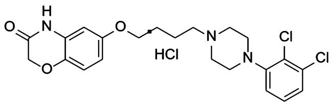
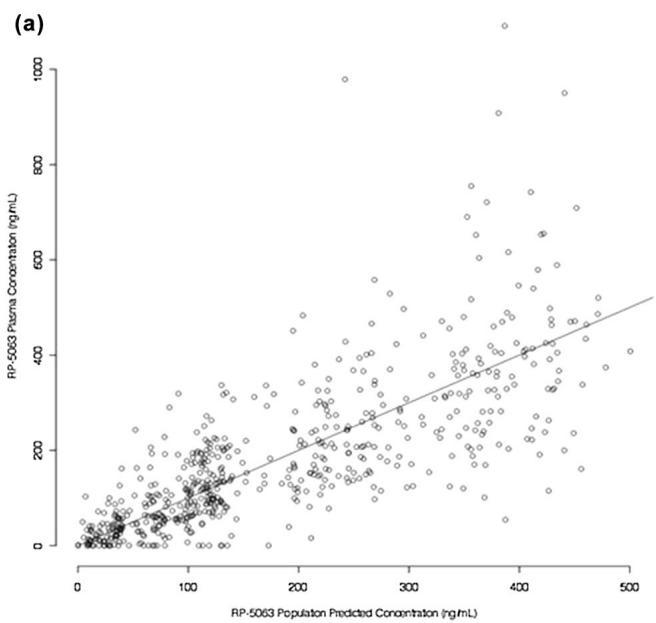
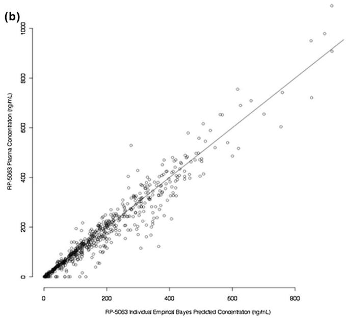
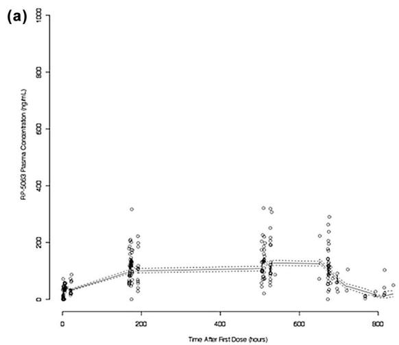
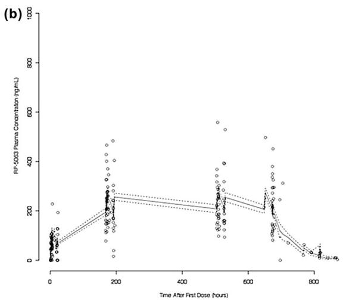
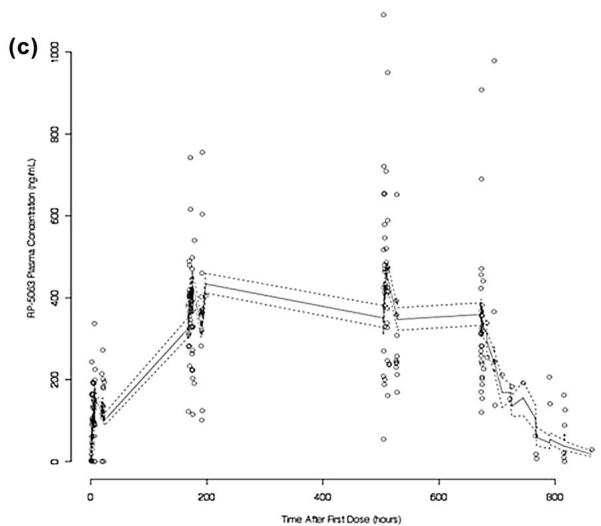
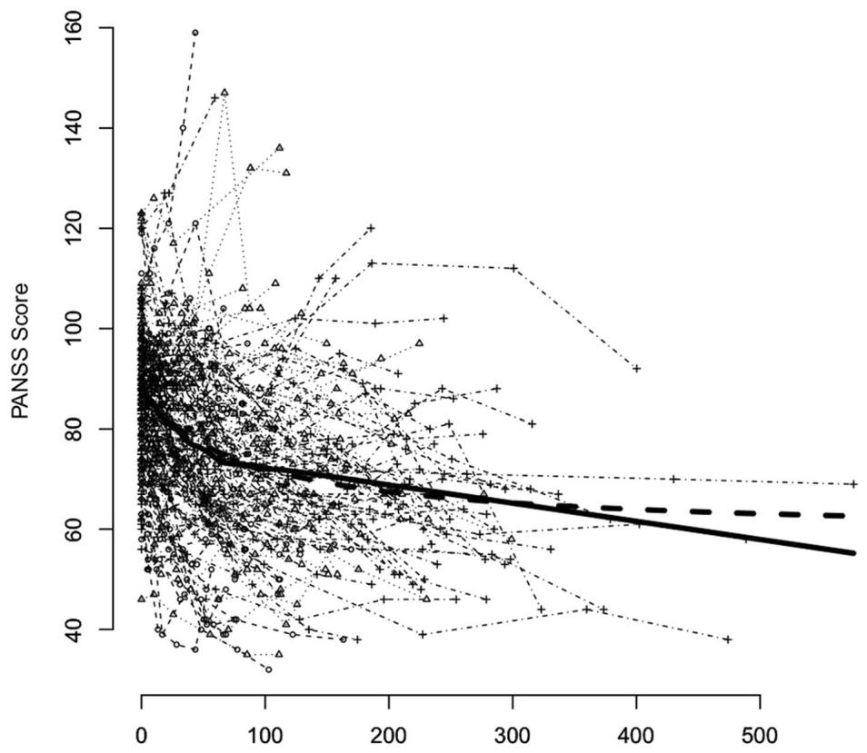
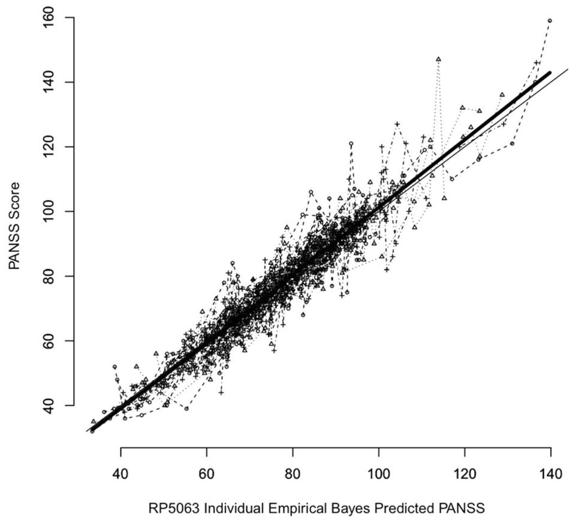
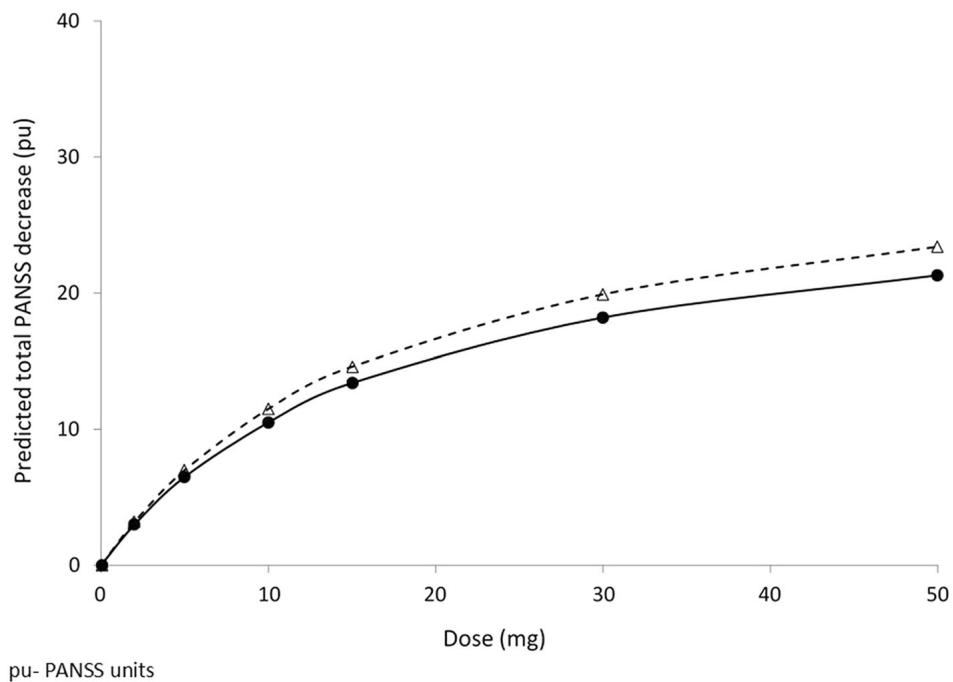

ORIGINAL RESEARCH ARTICLE

# A Population Pharmacokinetic and Pharmacodynamic Analysis of RP5063 Phase 2 Study Data in Patients with Schizophrenia or Schizoaffective Disorder

Marc Cantillon1 • Robert Ings1 • Arul Prakash1 • Laxminarayan Bhat1

Published online: 4 April 2018 - The Author(s) 2018

# Abstract

Background and Objective RP5063 is a novel multimodal dopamine (D)–serotonin (5-HT) stabilizer possessing partial agonist activity for $\mathrm { D } _ { 2 / 3 / 4 }$ and $5 { \mathrm { - H T } } _ { 1 \mathbf { A } / 2 \mathbf { A } } .$ , antagonist activity for ${ \bf 5 - H T _ { 2 B / 2 C / 7 . } }$ , and moderate affinity for the serotonin transporter. Phase 2 trial data analysis of RP5063 involving patients with schizophrenia and schizoaffective disorder defined: (1) the pharmacokinetic profile; and (2) the pharmacokinetic/pharmacodynamic relationships.

Methods Pharmacokinetic sample data (175 patients on RP5063; 28 doses/patient) were analyzed, utilized one- and two-compartment models, and evaluated the impact of covariates. Pharmacodynamic analysis involved development of an $E _ { \mathrm { m a x } }$ model.

Results The pharmacokinetic analysis identified a onecompartment model incorporating body mass index influence on volume as the optimum construct, with fixed-effect parameters: (1) oral clearance $( C l / F ) , 5 . 1 1 \pm 0 . 1 1 \mathrm { L } / \hbar ; ( 2 )$ volume of distribution $( V _ { \mathrm { { c } } } / F ) .$ , 328.00 ± 31.40 L; (3) absorption constant $( k a ) ~ 0 . 4 2 \pm 0 . 1 7 ~ \mathrm { h } ^ { - 1 } ;$ (4) lag time (t lag) of $0 . 4 1 \pm 0 . 0 2 \mathrm { h } ;$ and (5) a calculated half-life of 44.5 h. Pharmacokinetics were linear related to dose. An $E _ { \mathrm { m a x } }$ model for total Positive and Negative Syndrome Scale (PANSS) scores as the response factor against cumulative area under the curve (AUC) provided fixed-effect estimates: (1) $E _ { \mathrm { o } } = 8 7 . 3 \pm 0 . 7 1$ (PANSS Units; pu); (2) ${ E _ { \operatorname* { m a x } } } = - ~ 3 1 . 6 0 \pm 4 . 0 5$ (pu); and (3) $\mathrm { A U C } _ { 5 0 } = 8 9 . 6 0 \pm$ 30.10 (lg-h/mL). The predicted PANSS improvement reflected a clinical dose range of 5–30 mg.

Conclusions Pharmacokinetics of RP5063 behaved predictably and consistently. Pharmacodynamics were characterized using an $E _ { \mathrm { m a x } }$ model, reflecting total PANSS score as a function of cumulative AUC, that showed high predictability and low variability when correlated with actual observations.

# Key Points

Population pharmacokinetic analysis identified a one-compartment model with the following parameters: (a) oral clearance $( C l / F ) , 5 . 1 1 \pm 0 . 1 1 \mathrm { L } /$ h; (b) volume of distribution $( V _ { \mathrm { { c } } } / F ) .$ , $3 2 8 . 0 0 \pm 3 1 . 4 0 \mathrm { L } ; $ (c) absorption constant (ka) $0 . 4 2 \pm 0 . 1 7 \mathrm { h } ^ { - 1 } ;$ ; (d) lag time (t lag) of $0 . 4 1 \pm 0 . 0 2$ h; and (e) a calculated half-life of 44.5 h.

Pharmacokinetics were linear with respect to dose.

$E _ { \mathrm { m a x } }$ model for total Positive and Negative Syndrome Scale (PANSS) as the response factor against cumulative area under the curve (AUC) provided fixed-effect estimates for $E _ { \mathrm { o } } = 8 7 . 3 \pm 0 . 7 1$ (PANSS Units; pu), $E _ { \mathrm { m a x } } = -$ $3 1 . 6 0 \pm 4 . 0 5$ (pu); and $\mathrm { A U C } _ { 5 0 } ~ = 8 9 . 6 0 \pm 3 0 . 1 0$ (lg-h/mL). Predicted PANSS improvement revealed a dose range between 5 and 30 mg.

Electronic supplementary material The online version of this article (https://doi.org/10.1007/s13318-018-0472-z) contains supplementary material, which is available to authorized users.

# 1 Introduction

Schizophrenia is a complex, chronic, and debilitating psychiatric syndrome that affects 1% of the world’s population [1]. This disorder is characterized by a complex mix of positive and negative symptoms along with mood and cognitive impairment [2–5].

Treatment involves typical and atypical antipsychotic agents [6]. Typical agents selectively block dopamine (D) receptors, specifically $\mathbf { D } _ { 2 } .$ While this interaction improves positive symptoms, it leads to side effects— particularly extrapyramidal symptoms (EPS) and hyperprolactinemia—that undermine compliance. Atypical agents act on the serotonin (5-HT) receptor, particularly the ${ \mathsf { S } } { \mathrm { - H T } } _ { 2 \mathbf { A } , }$ in addition to the $\mathbf { D } _ { 2 }$ receptor. The effectiveness of this class is also far from optimal in controlling much of the comorbidity from negative symptoms to mood and cognitive impairment. Side effects, including metabolic, endocrine, and cardiovascular effects, pose a significant limitation [7–10]. Considering these issues for both classes, 30% of patients with schizophrenia remain refractory to treatment [6].

RP5063, a multimodal modulator of dopamine (D) and serotonin (5-HT) receptors stabilizes the D/5-HT system and was specifically designed to overcome many of the current antipsychotic limitations in the treatment of schizophrenia and other psychotic conditions. This compound represents a promising therapeutic for the management of schizophrenia. RP5063 is a new chemical entity with a chemical formula of $\mathrm { C } _ { 2 2 } \mathrm { H } _ { 2 6 } \mathrm { C } _ { 1 3 } \mathrm { N } _ { 3 } \mathrm { O } _ { 3 }$ and molecular weight 486.82 g/Mol (450 g/Mol [free base] (unpublished). Its IUPAC name is 6-(4-(4-(2,3-dichlorophenyl)- piperazin-1-yl)-butoxy)-2H-benzo[b] [1, 4] oxazin-3(4H)- one hydrochloride (Fig. 1). It is a relatively lipophilic, basic molecule with a CLog P of 4.8, polar surface area (tPSA) of 54, and pKa of 6.13 (unpublished). As a consequence, it is freely permeable across lipid biological membranes and should distribute freely into tissues.

RP5063 possesses high binding affinity (inhibitory constant [Ki], nM) for $\mathrm { D } _ { 2 \mathrm { S } }$ (0.28), D (0.45), D (3.7), and $\mathrm { D } _ { 4 . 4 } ~ ( 6 . 0 )$ , as well as for ${ 5 { \mathrm { - } } \mathrm { H T } _ { 1 \mathrm { A } } }$ (1.5), 5-HT2A (2.5), $5 \mathrm { - } \mathrm { H T _ { 2 B } } ~ ( 0 . 1 9 ) , ~ 5 \mathrm { - } \mathrm { H T _ { 2 C } } ~ ( 3 9 ) , ~ 5 \mathrm { - } \mathrm { H T _ { 3 } } ~ ( 7 8 ) , ~ 5 \mathrm { - } \mathrm { H T _ { 6 } } ~ ( 5 1 )$ , and 5-HT7 (2.7) [11, 12]. It also displayed moderate binding affinity (Ki, nM) for $\mathrm { D } _ { 1 }$ (100), serotonin transporter, SERT (107), and nicotinic acetylcholine receptor, ${ \tt a } _ { 4 } \beta _ { 2 }$ (36.3) [11, 12]. It possesses partial agonist activity at $\mathrm { D } _ { 2 / 3 / 4 }$ and ${ 5 { \mathrm { - } } { \mathrm { H T } } _ { 1 { \mathrm { A / } } 2 { \mathrm { A } } } }$ receptors, and antagonist activity at $5 \mathrm { - } \mathrm { H T } _ { 2 \mathrm { B } / 6 / 7 }$ receptors [11], thereby balancing agonistic and antagonistic properties of D and 5-HT receptors and providing an overall stabilizing effect [11] that differentiates RP5063 from: (1) approved antipsychotics possessing $\mathbf { D } _ { 2 }$ antagonist activity and (2) $\mathrm { D } _ { 2 }$ partial agonists each being associated undesired side effects [13–16].

chemical

Chemical structure of a triazine derivative with methoxy and chloroethyl substituents

Fig. 1 Chemical structure of RP5063

Rodent models of pharmacologic-induced behaviors associated with schizophrenia demonstrated that RP5063 was active in limiting both psychosis and cognitive symptoms [11, 17, 18]. RP5063 was also well tolerated in toxicity evaluations ranging from 1 to 9 months and produced no dose-limiting cardiovascular, pulmonary, or central nervous system side effects (unpublished). Preclinical pharmacokinetic studies showed that RP5063 was well absorbed, widely distributed, highly protein bound, and is dose-dependent in its systemic exposure (unpublished). Metabolic studies found that RP5063 was mainly eliminated by metabolism, primarily through cytochrome P450 (CYP) 3A4 (64%) and minimally by CYP2D6 (17%) (unpublished data). This experience led to the initial development for this compound in schizophrenia and related disorders

Two-phase 1 studies characterized the safety of a single dose (10- and 15-mg fasting; 15-mg fed/fasting) in healthy volunteers and multiple doses of RP5063 (10, 20, 50, and 100 mg fed) over 10 days in patients with stable schizophrenia [19, 20]. In both studies, the compound was generally well tolerated and safe with all TEAEs resolved and none leading to withdrawal or death [20].

From the pharmacokinetic analysis of these studies, RP5063 displayed a dose-dependent maximum concentration $( C _ { \mathrm { m a x } } )$ at $^ { 4 - 6 \ h , }$ dose proportionality for both maximum concentration $C _ { \mathrm { m a x } }$ and area under the curve (AUC), and a half-life between 40 and 71 h [19]. In the single-dose study, food slightly increased the extent of drug absorption. In the multiple-dose study, steady state was approached after 120 h of daily dosing. Pooled data in the single-dose study indicated that the pharmacokinetic profile appeared to be comparable between Japanese and Caucasians [19].

An initial pharmacodynamic evaluation in the multipledose study also showed promising preliminary clinical behavioral and cognition activity signals in patients with stable disease over 10-day period [20]. Significant improvements were seen with RP5063 $( P < 0 . 0 5 )$ over placebo in a secondary analysis of patients with a baseline PANSS score $> 5 0$ for Positive Subscale Scores. Furthermore, improvements of Trails A and Trails B Test results were observed for patients treated in 50-mg dose group for Days 5, 10, and 16 [20].

A Phase 2 evaluation was conducted in patients with acute exacerbations of schizophrenia or schizoaffective disorder (REFRESH; NCT01490086) to evaluate the efficacy, safety, tolerability, and pharmacokinetics of RP5063 versus placebo. The analysis of the primary endpoint, Positive and Negative Syndrome Scale (PANSS total scores, showed improvement with the RP5063 15-, 30-, and 50-mg arms by a mean (SE) of - 20.23 (2.65), - 15.42 (2.04), and - 19.21 (2.39), respectively. The difference between treatment and placebo was significant for the 15 mg $( P = 0 . 0 2 1 )$ and 50 mg $( P = 0 . 0 1 6 )$ arms. Improvement with RP5063 was also seen for multiple secondary efficacy outcomes. The most common TEAEs were insomnia (17–28%) and agitation (7–10%). No significant changes in body weight, electrocardiogram, incidence of orthostatic hypotension, or decrease in blood glucose, lipid profiles, and prolactin levels were observed. Discontinuation for any reason for RP5063 (14, 25, 12%) was much lower than for placebo (26%) and aripiprazole (35%).

Utilizing a population approach, an analysis of plasma data of RP5063 obtained from this trial was undertaken to define: (1) the pharmacokinetics of RP5063; and (2) the pharmacokinetic/pharmacodynamic relationships of RP5063.

# 2 Methods

# 2.1 Phase 2 Study Design

This in-patient, international, multi-center, randomized, double-blind, placebo-controlled study [11] was conducted under the International Conference on Harmonization of Technical Requirements for Registration of Pharmaceuticals for Human Use (ICH) compliant and Good Clinical Practice standards for a US Food and Drug Administration registration trial. It received investigational review board approval, obtained informed consent from patients, maintained a data safety monitoring committee, and monitored clinical sites and data.

A total of 234 patients (18–65 years; diagnosed with an acute exacerbation of schizophrenia or schizoaffective disorder) were randomized to RP5063 (15, 30, or 50 mg); aripiprazole (15 mg); or placebo (ratio, 3:3:3:1:2) given orally once daily. Study participants were dosed daily following an overnight fast and 1 h before breakfast for 28 days and followed up 1 week after the last dose. Patients were required to remain in the testing facility for the study duration to ensure accurate dosing and sample time collection.

The primary efficacy endpoint was the change of total PANSS, a validated 30-item, drug-sensitive instrument of relevant signs and symptoms that is required by the FDA for use in registration studies for antipsychotics for the management of schizophrenia, from baseline and to Day 28 [3, 21]. PANSS data were obtained at least 2 h after dosing on Days 4, 8, 15, 22, and 28 (or end of study) [1, 3]. Only total PANSS measurements were used in the current analysis. To assure consistency and robustness of the PANSS data collection, the study included: (1) a clearly defined standard for PANSS in the protocol; (2) training program around the use of the PANSS instrument; (3) Clintara pen-based technology for remote site independent review; (4) a study monitoring plan to insure compliance; and (5) training and certification of clinical sites based upon achievement of a threshold score during post-training testing. The study also employed blinded site-independent review, which reflected between site-based and blinded, site-independent raters showing a high correlation $( r = 0 . 9 2 3 )$ , and concordance of the PANSS Scores.

The design for this analysis was set to examine the population pharmacokinetics under both non-steady-state and steady-state conditions in order to better define both the volume of distribution (V /F) and the clearance (Cl/ F) of RP5063. Five blood samples (10 mL) were collected from each patient into K2EDTA vacutainers/vacuettes by direct venipuncture from patients on RP5063. One sample (Supplemental data Appendix A) was obtained pre-dose at baseline and on Days 1, 8, 22, and 28 during one of four time-blocks allocating a predesignated number of patients, so samples covered the whole duration of the dosing and out to 220 h after the last dose to cover both pre- and poststeady-state (approximately 120 h) time periods [19]. The model encompasses both non-steady-state and steady-state conditions with this type of sampling [19].

Plasma was prepared from blood by centrifugation and each plasma sample stored at - 20 C prior to bioanalysis, using liquid chromatography/mass spectrometry (LC/MS/ MS) validated according to the FDA guidelines over a concentration range of 1.00–500 ng/mL [22]. In summary, the plasma samples were extracted using methanolic protein precipitation also containing RP5063-d8 internal standard, the analytes of interest separated by isocratic elution and detection was with mass spectrometry using electrospray with multiple ion monitoring in positive ion mode and transitions of 449.91–285.10 for RP5063 and 458.11–293.10 for RP5063-d8 (Supplemental data Appendix B).

Additional data collected included covariates [body weight (kg), body mass index (BMI), age, sex (male, female), smoking (no, yes), concomitant drug use (no, yes), race/ethnicity (Not Hispanic/Latino, White/Caucasian, Southern Asian, Other), geographic area of clinical site (USA, India, Philippines, Malaysia, Moldova), and creatinine clearance [Cockcroft Gault] as a surrogate for glomerular filtration rate (GFR)].

# 2.2 Data Set Identification and Organization

Only patients receiving RP5063 were included in the population pharmacokinetic analysis. Excluded were samples where the exact sampling time could not be established, as well as the 0.0833 h time point for one patient with a RP5063 concentration of 200 ng/mL, not seen with any other patient or in any other previous study. This observation was considered an anomalous outlier, later confirmed by a clinical site inspection. Having such an isolated error is not uncommon in a large, multi-center clinical trials. After testing with and without its exclusion, it was determined that the data set with its exclusion would be used for further evaluation.

Data from patients receiving RP5063 were collated and organized into a format suitable for NONMEM version 7.1.0 (Icon Development Solutions, Ellicott City, MD): (1) patient identification; (2) patient code; (3) daily dose (mg); (4) time after first dose (h); (5) number of doses; (6) dosing interval (h); (7) dependent variable (plasma concentration of parent compound [ng/mL]); and (8) covariates (previously described). The data management and graphics were performed using statistical package R.

# 2.3 Pharmacokinetic Analysis

# 2.3.1 Derivation of Pharmacokinetic Models

The data set was analyzed using a traditional, non-linear, mixed-effect modeling technique, as described by Lindstrom and colleagues [23]. Models were fitted to the data using NONMEM version 7 (sub-parameters included ADVAN1 for oral absorption and ADVAN2 for PKPD), and a first-order conditional estimation method with centering. For accuracy and stability, a non-parametric, bootstrap resampling method was performed: (1) sampling at random and with replacement from individuals in the original data set; (2) fitting the non-linear mixed-effect model to the data set obtained; (3) computing bootstrap statistics using the resulting empirical distribution of the estimates; and (4) comparing these with the estimates obtained using the original data set. Bootstrap samples were generated until a convergence criterion (the mean relative absolute difference between the current estimates of the standard deviation of the bootstrap parameters and the estimates that lag m = 5 bootstrap samples) was satisfied [24–26]. The bootstrap was stopped when the criterion was less than the threshold, 0.001.

Both a one-compartment and two-compartment model with the first-order absorption and fixed-effect parameters were developed to assess the best fit of the data for a Base model, which included: (1) oral clearance $( C l = C l / F _ { \mathrm { : } }$ , where F is the bioavailability fraction); and (2) oral volume of distribution $( V _ { \mathrm { c } } = V _ { \mathrm { c } } / F ) ;$ ; (3) absorption rate constant (ka); and (4) lag time (t lag). These parameters were expressed by the following relationships, where $\eta _ { 1 j }$ and $\eta _ { 2 j }$ are assumed to be correlated and $\eta _ { 3 j }$ is independently distributed:

One compartment (Eq. 1):

$$
C l _ {j} = C l e ^ {\eta_ {1 j}}
$$

$$
V _ {\mathrm{c} j} = V _ {\mathrm{c}} e _ {\eta 2 j} \tag {1}
$$

$$
k a _ {j} = k a e ^ {\eta_ {3 j}}
$$

$$
t \text {-lag} _ {j} = t \text {-lag}
$$

Two compartments: as above plus (Eq. 2):

$$
\begin{array}{l} Q _ {j} = Q e ^ {\eta_ {4 j}} \\ V _ {\mathrm{p} j} = V _ {\mathrm{pe} _ {5 j} ^ {\eta}} \tag {2} \\ \end{array}
$$

where Q represents inter-compartmental flow and $V _ { \mathfrak { p } }$ represents the volume of the peripheral compartment.

# 2.3.2 Assessment of Covariate Influence to Determine the Final Model

The initial screen for covariate influence involved methods described by Mandema [27]. This examination evaluated the relationship between individual empirical Bayes estimates of the parameters Cl, $V _ { \mathrm { c } } ,$ and ka obtained from the Base model which was tested using generalized additive statistical models [28].

Based on the initial screen results, covariates showing an influence were further examined using the definitive method of stepwise addition/subtraction of the covariates to the Base Model. For the jth individual, the relationship between the ith parameter, $\theta _ { i } ,$ , and the kth covariate, $\mathrm { c o v } _ { k } ,$ is expressed as (Eq. 3):

$$
\vartheta_ {i j} = \vartheta_ {i} \left(\operatorname{cov} _ {k j} / \operatorname{mean} \left(\operatorname{cov} _ {k}\right)\right) ^ {\gamma k} \tag {3}
$$

where the parameter $\gamma _ { k }$ quantifies the extent of the relationship, if $\mathrm { c o v } _ { k }$ is continuous, and (Eq. 4):

$$
\vartheta_ {i j} = \vartheta_ {i} (1 + \gamma_ {k} \mathrm{cov} _ {k}) \tag {4}
$$

if the covariate is an indicator variable (i.e., has values 0,1).The model for the ith parameter could include multiple covariates (Eq. 5):

$$
\vartheta_ {i j} = \vartheta_ {i} \left(\operatorname{cov} _ {k j} / \operatorname{mean} \left(\operatorname{cov} _ {k}\right)\right) ^ {\gamma k} \left(1 + \gamma_ {l} \operatorname{cov} _ {l}\right) \tag {5}
$$

The covariates were iteratively added, selecting the pair covariate/parameter that obtained the lowest value of the objective function (log-likelihood). After selection of the best pair covariate/parameter, the search successively added another covariate, again selecting the best pair covariate/parameter. To obtain a model that included two covariates, the process was repeated, adding covariate/parameter pairs to build a larger model. At the end of the addition process, the algorithm then iteratively removed parameter/covariate pairs until a statistical selection criterion (Chi-squared test with Bonferroni correction) stopped decreasing and eliminating statistically insignificant variables.

From the first screening, five covariates (gender, BMI, age, GFR, and smoking) that showed an influence on Cl, $V _ { \mathrm { c } } ,$ and ka (not t lag), together with concomitant therapy, were investigated further. The data were fitted to 18 possible alternative models corresponding to all possible combinations on each of the pharmacokinetic parameters (Cl, $V _ { \mathrm { c } } ,$ and ka) until a best model was identified. Once this final pharmacokinetic model with covariates was established, the half-life was derived from the oral volume of distribution $( V _ { \mathrm { c } } / F )$ and apparent oral clearance (Cl/F). Pairwise t tests were used to determine if the Cl/F differed from each other as a means of establishing if the pharmacokinetic was linear.

# 2.4 Pharmacokinetic/Pharmacodynamic Analysis

# 2.4.1 Pharmacokinetic/Pharmacodynamic Modeling

The pharmacodynamic response involved the total PANSS at day 1 (pre-dose) and days 4, 8, 15, 22, and 28 (post-dose). The pharmacokinetic profile used the parameters for the final population pharmacokinetic as previously described above.

The pharmacodynamics data set was analyzed using a non-linear mixed-effect model [23], conditioning on the pharmacokinetic data analysis. Briefly, a vector of observations from the jth individual, $y _ { j } ,$ , collected at times $t _ { j }$ is described by (Eq. 6) [29]:

$$
y _ {j} = E \left(\left(C \left(t _ {j}, \hat {\vartheta} _ {j}\right), \rho_ {j}\right) + \varepsilon_ {j} \right. \tag {6}
$$

where E is a pharmacodynamic response (see below), C is the RP5063 plasma concentration determined from the pharmacokinetic model of RP5063 (15, 30, or 50 mg) described previously, $\hat { \vartheta } _ { j }$ are the corresponding empirical Bayes pharmacokinetic parameter estimates for the $j \mathrm { t h }$ individual, $\rho _ { j }$ are pharmacodynamic parameters to be estimated from the pharmacodynamic analysis, and $\varepsilon _ { j }$ are independent normally distributed ‘‘errors’’ with variance $\sigma ^ { 2 }$ characterizing intra-subject variability. Prior experience has shown that conditioning the analysis of the pharmacodynamic data on the estimates of the pharmacokinetic model, $\vartheta _ { j } ,$ , as opposed to a simultaneous analysis of pharmacokinetic and pharmacodynamic data, provides the most robust type of analysis. This approach thereby protects the estimates from possible biases resulting from model misspecification. The prediction of the effect is given by (Eq. 7):

$$
E (x) = g (x, \rho_ {j}) \tag {7}
$$

Consistent with the pharmacokinetic/pharmacodynamic literature, the predictors (a) through (d) were used [30]. The following alternatives were used for the predictor variable:

$$
x = C \left(t _ {j}, \vartheta_ {j}\right) \tag {8}
$$

predicted drug concentration at time $t _ { j }$ (Eq. 8):

$$
x = C e \left(t _ {j}, \vartheta_ {j}\right) \tag {9}
$$

predicted drug concentration in an effect compartment (Eq. 9):

$$
x = \int_ {d _ {j}} ^ {d _ {j} + 2 4} C (t _ {j}, \vartheta_ {j}) d t / 2 4 \tag {10}
$$

‘‘average’’ drug concentration at the day of collection, where $d _ { j }$ was the day of collection corresponding to $t _ { j }$ (Eq. 10):

$$
x = \mathrm{AUC} _ {t j,} = \int_ {0} ^ {b} C (t, \vartheta_ {j}) \mathrm{d} t \tag {11}
$$

$\begin{array} { r } { X = \mathrm { A U C } _ { t _ { y } } = \int _ { 0 } ^ { t _ { j } } C ( t , \vartheta _ { j } ) \mathrm { d } t } \end{array}$ ‘‘exposure’’, or area under the curve up to time $t _ { j } \ ( \mathrm { E q . } \ 1 1 )$ , where, now, $\vartheta _ { j }$ indicated the empirical Bayes pharmacokinetic parameter estimates for the jth individual.

The PANSS treatment data were analyzed using models (12) and (13) as follows (Eqs. 12, 13):

$$
E (x) = E _ {0} + E _ {\max} \frac {x}{x + x _ {5 0}} \tag {12}
$$

or

$$
E (x) = E _ {0} + E _ {\max} \frac {x}{x + x _ {5 0}} + \propto t _ {j} \tag {13}
$$

In these models, $a t _ { j }$ is the (population average) placebo effect estimated from the placebo data. It was assumed the following distribution (Eqs. 14–17) for the parameters in models (9) through (10):

$$
E _ {\mathrm{o} j} = E _ {\mathrm{o}} + \eta_ {1 j} \tag {14}
$$

$$
E _ {\max j} = E _ {\max} + \eta_ {2 j} \tag {15}
$$

$$
x _ {5 0 j} = x _ {5 0} e ^ {\eta_ {3 j}} \tag {16}
$$

$$
\alpha_ {j} = \alpha + \eta_ {4 j} \tag {17}
$$

where $\eta _ { 1 j } , . . . , \eta _ { 4 j }$ are assumed to be independent normally distributed random effects. Note that the random effects for $E _ { \mathrm { o } j } , E _ { \mathrm { m a x j } }$ ; and $\alpha _ { j }$ are additive. Therefore, individual subjects are allowed to either increase $( E _ { \mathrm { m a x j } }$ or $\alpha _ { j }$ positive) or decrease $( E _ { \mathrm { m a x j } }$ or aj negative) PANSS levels as a function of the predictors.

Covariate model selection was performed as previously described, with final inclusion based on a Chi-squared test and Bonferroni correction. Analysis and graph generation were performed using the statistical package R.

# 3 Results

# 3.1 Population

Of the 234 enrolled patients, 175 were treated with RP5063. Demographic and baseline clinical characteristics were similar across all dose groups (Table 1). Study population had a mean population of 36 years of age and consisted of 80% males and 20% females. More than 90% had acute schizophrenia (98, 96, and 93% in the 15-, 30-, and 50-mg groups, respectively). Patients had a mean PANSS total score of 87.4 at baseline.

# 3.2 Base Population Pharmacokinetic Model

A one-compartment model was selected as the Base model, since the computation of the covariance with the twocompartment model gave a correlation of most parameters [ 0.95 preventing the calculation of standard error. The one-compartment model, NONMEM estimates with standard errors for Cl/F, Vc/F, ka, and t lag were $5 . 0 3 \pm 0 . 7 0 \mathrm { L } / \mathrm { h } , 3 2 6 . 0 0 \pm 1 4 . 9 0 \mathrm { L } , 0 . 4 0 \pm 0 . 0 4 \mathrm { h } ^ { - 1 }$ , and $0 . 4 1 \pm 0 . 1 3 \mathrm { ~ h ~ }$ , respectively. The intersubject coefficients of variation rates were 14.90 and 21.40% for Cl/F and Vc/ F, respectively, but 241.0% for ka. The intra-subject coefficient of variation was approximately 8.0%.

# 3.3 Population Pharmacokinetic Model with the Influence of Covariates

An initial analysis evaluating covariate influence on the empirical Bayes estimates in the Base model using generalized additive models suggested influence of (1) sex, GFR, and smoking on Cl/F: and (2) BMI and age on Vc/F. However, from the stepwise addition process, BMI only emerged as having a significant effect on volume in terms of decrease of objective function (Eq. 18):

$$
V _ {j} = V \left(B M I _ {j} / 2 3. 0 1\right) ^ {\gamma 1} e ^ {\eta_ {2 j}} \tag {18}
$$

This analysis was concluded upon the examination of the objective function value decline with different covariates, with a relatively large decrease of 26.8 points seen for BMI and volume. When a second covariate was added to the model, BMI affecting $C l , C l _ { j } = C l ( B M I _ { j } / 2 3 . 0 1 ) ^ { \gamma _ { 2 } } e ^ { \eta _ { 1 j } }$ , there was a decline in the objective function of only 6.66 points, followed by sex on $V _ { \mathrm { c } } , V _ { \mathrm { c } j } = V ( B M I _ { j } / 2 3 . 0 1 ) ^ { \gamma _ { \mathrm { l } } }$ $( 1 + \gamma _ { 3 } \mathrm { S E X } _ { j } ) e ^ { \eta _ { 2 j } }$ , with a decline of 3.1 points. Further additions resulted in decreases of less than 1 point. The critical value at $P = 0 . 0 5$ with a Chi-squared test for the addition of 1 parameter was 3.84. A Bonferroni correction corresponding to the $m = 5 1$ parameter/covariate pair comparisons, which were iteratively required until the statistical selection criteria stopped decreasing and eliminating statistically insignificant variables in order to identify the largest model, was 10.86. The backward elimination used this value as a selection criterion, which resulted in the choice of the model (Table 2) with only BMI affecting volume: $V _ { \mathrm { c } j } = V _ { \mathrm { c } } ( \mathbf { B M I } _ { j } / 2 3 . 0 1 ) ^ { \gamma 1 }$ . Half-life was subsequently calculated from $V _ { \mathrm { { c } } } / F$ and Cl/F as 44.5 h.

Table 1 REFRESH phase 2 study population baseline characteristics (RP5063 patients) Adapted with permission from Elsevier [11] 

<table><tr><td>Parameters</td><td>15 mg (N = 58)</td><td>30 mg (N = 59)</td><td>50 mg (N = 58)</td></tr><tr><td>Age [years, mean (SD)]</td><td>36 (10)</td><td>37 (12)</td><td>35 (9)</td></tr><tr><td>Sex, n (%)</td><td></td><td></td><td></td></tr><tr><td>Male</td><td>41 (71)</td><td>50 (85)</td><td>42 (72)</td></tr><tr><td>Female</td><td>17 (29)</td><td>9 (15)</td><td>16 (28)</td></tr><tr><td>Race, n (%)</td><td></td><td></td><td></td></tr><tr><td>Asian/Indian</td><td>51 (88)</td><td>53 (90)</td><td>52 (72)</td></tr><tr><td>Black/African American</td><td>3 (5)</td><td>3 (5)</td><td>3 (5)</td></tr><tr><td>White/Caucasian</td><td>3 (5)</td><td>3 (5)</td><td>3 (5)</td></tr><tr><td>Hispanic/Latino</td><td>0</td><td>0</td><td>0</td></tr><tr><td>Other</td><td>0</td><td>1 (2)</td><td>0</td></tr><tr><td>Diagnosis, n (%)</td><td></td><td></td><td></td></tr><tr><td>Schizophrenia</td><td>55 (98)</td><td>55 (96)</td><td>53 (93)</td></tr><tr><td>Schizoaffective disorder</td><td>1 (2)</td><td>2 (4)</td><td>4 (7)</td></tr><tr><td>Duration of illness [years, mean (SD)]</td><td>9 (7)</td><td>9 (8)</td><td>8 (6)</td></tr><tr><td>PANSS total [score, mean (SD)]</td><td>87.6 (13.3)</td><td>88.7 (13.4)</td><td>85.9 (14.9)</td></tr><tr><td>BMI [kg/m2, mean (SD)]</td><td>23.2 (4.2)</td><td>22.3 (4.6)</td><td>23.4 (3.3)</td></tr></table>

BMI, body mass index; PANSS, positive and negative syndrome scale; SD, standard deviation

Table 2 Final pharmacokinetic model parameter estimates from the stepwise covariate analysis 

<table><tr><td>Parameter</td><td>Estimate</td><td>Standard error (SE)</td><td>Bootstrap estimate</td><td>Bootstrap SE</td></tr><tr><td> $Cl$  (L/h)</td><td>5.11</td><td>0.11</td><td>5.11</td><td>0.17</td></tr><tr><td> $V_c$  (L)</td><td>328.00</td><td>31.40</td><td>329.00</td><td>2.05</td></tr><tr><td> $ka$  ( $h^{-1}$ )</td><td>0.42</td><td>0.17</td><td>0.45</td><td>0.12</td></tr><tr><td> $t$  lag (h)</td><td>0.41</td><td>0.02</td><td>0.47</td><td>0.11</td></tr><tr><td> $\gamma$ </td><td>0.90</td><td>0.36</td><td>0.84</td><td>0.34</td></tr><tr><td> $Var$  ( $\eta_1$ )</td><td>0.16</td><td>0.10</td><td>0.16</td><td>0.02</td></tr><tr><td> $Var$  ( $\eta_2$ )</td><td>0.28</td><td>0.16</td><td>0.256</td><td>0.07</td></tr><tr><td> $Cov$  ( $\eta_1, \eta_2$ )</td><td>0.04</td><td>0.15</td><td>0.05</td><td>0.03</td></tr><tr><td> $Var$  ( $\eta_3$ )</td><td>2.09</td><td>6.63</td><td>2.36</td><td>0.66</td></tr><tr><td> $\sigma_1^2$ </td><td>0.07</td><td>0.02</td><td>0.07</td><td>0.001</td></tr></table>

Cl, clearance; Cov, covariance; c, Parameter that quantifies the extent of the relationship among covariates; ka, absorption rate constant; $\boldsymbol { \mathsf { \Pi } } \eta ,$ random effects and are multivariate normal with mean zero and variance– covariance matrix X; r2 , variance characterizing the intra-subject variability; t, lag lag time; Var, variance; V, volume of distribution

In Fig. 2, diagnostic plots reflect a fit of the final model to the data: (1) observations versus population predictions, with a superimposed identity line (Panel a); and (2) observations vs individual (empirical Bayes) predictions (Panel a). A comparison of $R ^ { 2 }$ values for the fit of a linear regression to the observations versus prediction (0.8116 for the base model versus 0.8164 for the final model) and the fit of the observations versus empirical Bayes predictions (0.9664 for the base model versus 0.9665 for final model) showed that BMI addition, as a covariate, offered a slight improvement.

In Fig. 3, the bootstrap predictions used to evaluate accuracy and stability of the model showed the data with the superimposed median (solid line) and 95% bootstrap point-wise confidence bands (dashed lines) for all doses. Noteworthy was the occasional jagged appearance of the median and point-wise confidence band. This effect was due to the presence of individual BMI values in the model and the bootstrap sampling. It should be noted that bootstrap point-wise confidence bands are for the population

scatter

| RP-5063 Population Predicted Concentration (ng/mL) | RP-5063 Plasma Concentration (ng/mL) |
| -------------------------------------------------- | ------------------------------------ |
| 0                                                  | 0                                    |
| 100                                                | 100                                  |
| 200                                                | 200                                  |
| 300                                                | 300                                  |
| 400                                                | 400                                  |
| 500                                                | 500                                  |

scatter

| RP-5063 Individual Empirical Bayes Predicted Concentration (ng/mL) | RP-5063 Plasma Concentration (ng/mL) |
| --- | --- |
| 0 | 0 |
| 200 | 200 |
| 400 | 400 |
| 600 | 600 |
| 800 | 800 |
| 1000 | 1000 |

Fig. 2 Diagnostic plots reflected a fit of the final model to the data: observations vs population predictions, with superimposed identity line (a) and observations vs individual (empirical Bayes) predictions (b)

scatter

| Time After First Dose (hours) | RP-5003 Pauma Concentration (ng/mL) |
| ----------------------------- | ----------------------------------- |
| 0                             | ~50                                 |
| 100                           | ~100                                |
| 200                           | ~150                                |
| 300                           | ~150                                |
| 400                           | ~150                                |
| 500                           | ~150                                |
| 600                           | ~150                                |
| 700                           | ~100                                |
| 800                           | ~50                                 |

line

| Time After First Dose (hours) | RP-5033 Plasma Concentration (ng/mL) |
| ----------------------------- | ------------------------------------ |
| 0                             | 0                                    |
| 100                           | 100                                  |
| 200                           | 200                                  |
| 300                           | 250                                  |
| 400                           | 250                                  |
| 500                           | 250                                  |
| 600                           | 250                                  |
| 700                           | 150                                  |
| 800                           | 50                                   |

line

| Time After First Dose (hours) | RP-5033 Plasma Concentration (ng/mL) |
| ----------------------------- | ------------------------------------ |
| 0                             | 0                                    |
| 100                           | 100                                  |
| 200                           | 400                                  |
| 300                           | 450                                  |
| 400                           | 400                                  |
| 500                           | 350                                  |
| 600                           | 350                                  |
| 700                           | 150                                  |
| 800                           | 50                                   |

Fig. 3 Population bootstrap predictions for the final model showed the data for all doses with superimposed median (solid lines) and 95% bootstrap point-wise confidence bands (dashed lines) for 15 mg (a), 30 mg (b), and 50 mg (c) RP5063

prediction that explains the relative narrowness of the bands seen within this figure.

The mean estimates for Cl/F calculated for the individual empirical Bayes were $5 . 1 7 \pm 0 . 2 4 , \ 5 . 4 5 \pm 0 . 2 3$ , and $5 . 2 6 \pm 0 . 2 4 \ : \mathrm { L } / \mathrm { h } .$ , for the 15, 30, and 50 mg doses, respectively. Pairwise t tests did not reject the null hypothesis that the mean Cl/F for the three doses are different from each other, demonstrating that RP5063 elimination is linear with respect to dose in this patient population over this dose range (P values were: 0.384, 0.789, and 0.508 for the comparisons dose 15 vs 30 mg, dose 15 vs 50 mg, and dose 30 vs 50 mg, respectively).

# 3.4 Population Pharmacokinetic/Pharmacodynamic Model

Model selection indicated that the best predictor for total PANSS was the cumulative AUC. Inclusion of a placebo effect did not improve fit.

In the stepwise addition for identification of the influence of covariates, the parameter/covariate pair that reduced the objective function the most for each step (40 points from the Base model) was that of geographical area, which was attributed to a single site. Other covariates additions decreased the objective function to a lesser extent (6–10 points for each addition) (Supplemental Information Appendix C). The backward stepwise elimination retained only the geographic site as influencing the $E _ { \mathrm { m a x } }$ parameter (the critical value corresponding to the $m = 2 1 3$ comparisons required to perform the stepwise addition is 13.53).

Final $E _ { \mathrm { m a x } }$ model (Table 3) estimates were: (1) $E _ { 0 } = 8 7 . 3 \pm 0 . 7 1 1$ (PANSS units; pu); (2) $E _ { \mathrm { m a x } } = -$ 31.6 ± 4.05 (pu); (3) and $\mathrm { A U C } _ { 5 0 } { = } 8 9 . 6 \pm 3 0 . 1$ 1 (lg-h/mL). In $E _ { \mathrm { m a x } j } = E _ { \mathrm { m a x } } ( 1 + \gamma _ { 1 } G E O G 5 )$ , c was estimated at - $1 . 9 3 \pm 0 . 5 3 5$ , which corresponds to an average positive $E _ { \mathrm { m a x } }$ of 29.4 (pu) for individuals at that site (Moldova).

Figures 4, 5 reflect a good quality of the fit to the observed data. A comparison of PANSS improvement $\mathrm { \bf A U C } _ { 5 0 } ,$ area under the curve at 50% of maximal effect; $\mathrm { E } _ { \mathrm { m a x } } ,$ , the maximal effect at high drug concentrations when all the receptors are occupied by the drug; $\mathrm { E _ { 0 } } ,$ baseline effect; c, parameter that quantifies the extent of the relationship. In this case, it relates to the influence of Geographic Area 5 (Moldova); $\eta _ { \mathrm { j } } ,$ random effects and are multivariate normal with mean zero and variance–covariance matrix X; pu, PANSS units; $\sigma ^ { 2 }$ , variance characterizing the intra-subject variability

Table 3 Final $E _ { \mathrm { m a x } }$ model parameter estimates incorporating baseline and site as identified from the covariate analysis 

<table><tr><td>Parameter</td><td>Estimate</td><td>Standard error (SE)</td></tr><tr><td> $E_0$  (pu)</td><td>87.3</td><td>0.711</td></tr><tr><td> $E_{\text{max}}$  (pu)</td><td>-31.6</td><td>4.05</td></tr><tr><td>AUC $_{50}$  ( $\mu$ g·h/mL)</td><td>89.6</td><td>30.1</td></tr><tr><td> $\gamma$ </td><td>-1.93</td><td>0.535</td></tr><tr><td>Var ( $\eta_1$ )</td><td>164</td><td>632</td></tr><tr><td>Var ( $\eta_2$ )</td><td>464</td><td>308</td></tr><tr><td>Var ( $\eta_3$ )</td><td>0.476</td><td>0.878</td></tr><tr><td> $\sigma^2$ </td><td>47.1</td><td>6.04</td></tr></table>

calculated for different doses of RP5063 indicated that daily doses between 5 and 30 mg should adequately describe a clinically relevant dose/efficacy relationship (Fig. 6).

# 4 Discussion

The plasma concentration data collection used a sparse sampling regimen for each patient during and after a 28-day daily dosage regimen of RP5063 (15–50 mg/daily). These data were best fitted to a one-compartment model with a first-order absorption and a lag time. This approach is consistent with the population pharmacokinetics of other antipsychotic agents (e.g., aripiprazole and olanzapine) [30, 31].

However, in the previous Phase 1 studies with RP5063, in which the more traditional frequent blood sampling was used, the plasma profile was more typical of a two-compartment model with an initial, more rapid decline of the RP5063 plasma levels followed by a slower second phase [19]. A detailed examination of the initial decline phase of RP5063 revealed that its AUC was \ 10% of the total AUC, demonstrating that it represented only a small proportion of the total elimination of the compound. Therefore, it was not a surprise, as related to this current sparse data set, that the model reduced from a two- to a onecompartment construct. A more frequent sampling at the early times (within the first day) following each dose, especially in the non-steady-state period, would be necessary to identify two-compartment model adequately.

Fig. 4 Treatment PANSS versus AUCt, using $E _ { \mathrm { m a x } }$ model (Solid line represents the smoothing function and the thick dotted line represents the model fit using cumulative RP5063 AUC)   

scatter

| PANSS Score | X Value | Y Value |
|-------------|---------|---------|
| 160         | 50      | 120     |
| 140         | 75      | 130     |
| 120         | 100     | 110     |
| 100         | 125     | 90      |
| 80          | 150     | 70      |
| 60          | 175     | 50      |
| 40          | 200     | 30      |
| 20          | 225     | 10      |
| 10          | 250     | 5       |
| 5           | 275     | 2       |
| 2           | 300     | 1       |
| 1           | 325     | 0.5     |
| 0.5         | 350     | 0.2     |
| 0.2         | 375     | 0.1     |
| 0.1         | 400     | 0.05    |
| 0.05        | 425     | 0.02    |
| 0.02        | 450     | 0.01    |
| 0.01        | 475     | 0.005   |
| 0.005       | 500     | 0.002   |
| 0.002       | 525     | 0.001   |
| 0.001       | 550     | 0.0005  |
| 0.0005      | 575     | 0.0002  |
| 0.0002      | 600     | 0.0001  |
| 0.0001      | 625     | 0.00005 |
| 0.00005     | 650     | 0.00002 |
| 0.00002     | 675     | 0.00001 |
| 0.00001     | 700     | 0.000005|
| 0.000005    | 725     | 0.000002|
| 0.000002    | 750     | 0.000001|
| 0.000001    | 775     | 0.0000005|
| 0.0000005   | 800     | 0.0000002|
| 0.0000002   | 825     | 0.0000001|
| 0.0000001   | 850     | 0.00000005|
| 0.00000005  | 875     | 0.00000002|
| 0.00000002  | 900     | 0.00000001|
| 0.00000001  | 925     | 0.00000001|
| 68          | 95      | 135     |
| 66          | 97      | 133     |
| 64          | 99      | 131     |
| 62          | 144     | 128     |
| 64          | 146     | 126     |
| 62          | 148     | 124     |
| 66          | 192     | 122     |
| 68          | 194     | 121     |
| 66          | 196     | 123     |
| 68          | 248     | 124     |
| 72          | 248     | 123     |
| 74          | 248     | 124     |
| 72          | 248     | 124     |
| 74          | 312     | 123     |
| 78          | 312     | 123     |
| 81          | 336     | 123     |
| 79          | 338     | 123     |
| 83          | -       | -       |
| -           | -       | -       |
| -           | -       | -       |
| -           | -       | -       |
| -           | -       | -       |
| -           | -       | -       |
| -           | -       | -       |
| -           | -       | -       |
| -           | -       | -       |
| -           | -       | -       |
| -           | -       | -       |
| -            | -       | -       |
| -            | -       | -       |
| -            | -       | -       |
| -            | -       | -       |
| -            | -       | -       |
| -            | -       | -       |
| -            | -       | -       |
| -            | -       | -       |
| -            | -       | -       |
| -            | -       | -       |
| -             | -       | -       |
| -             | -       | -       |
| -             | -       | -       |
| -             | -       | -       |
| -             | -       | -       |
| -             | -       | -       |
| -             | -       | -       |
| -             | -       | -       |
| -             | -       | -       |
| -             | -       | -       |
| -              | -       | -       |
| -              | -       | -       |
| -              | -       | -       |
| -              | -       | -       |
| -              | -       | -       |
| -              | -       | -       |
| -              | -       | -       |
| -              | -       | -       |
| -              | -       | -       |
| -              | -       | -       |
| -             | -       | -       |
| -             | -       | -       |
| -             | -       | -       |
| -             | -       | -       |
| -             | -       | -       |
| -             | -       | -       |
| -             | -       | -       |
| -             | -       | -       |
| -             | -       | -       |
| -            | -       | -       |
| -            | -       | -       |
| -            | -       | -       |
| -            | -       | -       |
| -            | -       | -       |
| -            | -       | -       |
| -            | -       | -       |
| -            | -       | -       |
| -            | -       | -       |
| ...         ...    ...|
* The data is a scatter plot with 'x' as the x-axis and 'PANSS Score' as the y-axis. The data points are labeled with 'x' values and 'PANSS Score'. The chart title is 'PanSS Score'. The legend indicates different symbols: circles for '○', triangles for '×', plus signs for '+', and crosses for '◇'. The plot includes a dashed line for reference.

RP5063 Predicted AUC (μg'h/mL)(Empirical Bayes)

Fig. 5 Treatment PANSS versus predicted PANSS Model (Thin line is the line of the identity. Solid line represents the smoothing function and the thick dotted line represents the model fit using cumulative RP5063 Predicted PANSS)   

scatter

| RP5063 Individual Empirical Bayes Predicted PANSS | PANSS Score |
| -------------------------------------------------- | ----------- |
| 40                                                 | 40          |
| 60                                                 | 60          |
| 80                                                 | 80          |
| 100                                                | 100         |
| 120                                                | 120         |
| 140                                                | 140         |

Fig. 6 Predicted dose–response relationship of RP5063 in schizophrenic patients as measured by total PANSS (solid line: base model; dashed line: model incorporating the geographic site effect on $E _ { \mathrm { m a x } } )$   

line

| Dose (mg) | Predicted total PANSS decrease (pu) - Solid Line | Predicted total PANSS decrease (pu) - Dashed Line |
| --------- | ----------------------------------------------- | ------------------------------------------------- |
| 0         | 0                                               | 0                                                 |
| 5         | 3                                               | 4                                                 |
| 10        | 10                                              | 12                                                |
| 15        | 13                                              | 15                                                |
| 30        | 18                                              | 20                                                |
| 50        | 21                                              | 23                                                |

The study protocol required the patients to remain in the testing facility, thereby ensuring better compliance, a known dosing history, dosing time, and, hence, sampling time in relation to each dose. Despite a reduction in the parameters for the model discussed above, the data were fitted with a high level of precision resulting in relatively small standard errors for the parameter estimates except for ka. As with the one versus two-compartment model, this observation reflected that additional sampling would be needed at the very early times after each dose to better estimate this parameter. The calculated half-life of 44.5 h was similar to that observed previously in the phase 1 studies [19]. While the observations versus population predictions data appeared to show a broad scatter, the observations vs individual (Empirical Bayes) predictions provided a better fit. The $R ^ { 2 }$ for the model was 0.8116 for the base model versus 0.8164 for the final model. The fit of the observations versus empirical Bayes predictions was 0.9664 for the base model versus 0.9665 for final model. These statistical results were felt to be reasonable, since such variability has been observed in other population studies [32–36]. No further validation methods (e.g., PRED vs WRES or CWRES; and internal data splitting, Jack-Knife approach) were undertaken with these data and can be addressed further in future analyses.

The pharmacokinetic analysis did detect an influence of BMI on Vc/F. This finding should not be surprising considering the lipophilic character of RP5063 previously described in the introduction. Furthermore, the initial screen of the covariates using generalized additive models demonstrated no detectable effect of concomitant medication, geographic location, or ethnicity on the empirical Bayes estimates of individual parameters, although this test tends to overestimate the influence of covariates. The definitive stepwise addition and deletion approach with Chi-squared test and Bonferroni correction, however, demonstrated that only BMI had a statistically significant influence on volume of distribution. All the other covariates either had a clinically irrelevant or no effect on the pharmacokinetic of RP5063. Since BMI only affected volume of distribution, this covariate should not affect the average steady-state plasma levels of RP5063, since clearance did not change.

Concomitant medications (Supplemental data Appendix D) were mainly benzodiazepines, although lorazepam and zolpidem were most frequently used (24 and 22 patients reporting concurrent use of these agents with RP5063, respectively), along with occasional use of anti-hypertensives, antiepileptic, antibiotics, and other agents. Antipsychotic and adjuvant drugs were added at the end of the study after cessation of RP5063 treatment, but, when RP5063 levels were still being measured, such sequencing would make any drug–drug interaction assessment a nonissue. None of the co-administered agents appeared to exert any discernable interaction on the pharmacokinetics of RP5063, especially Cl, since concomitant drugs did not appear to be a significant influencing factor during the covariate analysis. In essence, population pharmacokinetic analysis should identify drug–drug interactions of the allowed concomitant agents within the pharmacokinetic covariate analysis. This step did not identify any such influence.

It should be noted that unlike some other psychotropic drugs [37, 38], only 17% of RP5063 is metabolized by CYP2D6 (unpublished). Thus, genotyping of this enzyme was not performed in the phase 2 study and, consequently, could not be used as a covariate. Interestingly, neither the geographic location of the clinical site nor the ethnicity of the patients in this international trial showed any influence, suggesting no difference in the pharmacokinetic of RP5063 between the clinical sites with no relevant differences in the patient populations tested.

While it might be tempting to assert that the lack of effect of ethnicity on RP5063 pharmacokinetics might be due to the small sample size of non-Asian subjects (\* 10%), it is important to recognize that this consideration is unlikely. First, the phase 1 single-dose study found no difference in the pharmacokinetics between Caucasian and Asian subjects [19]. Second, the phase 1 multiple-dose study, in which 90% of the participants were non-Asian, RP5063 reached steady state within 5–6 days and displayed a similar pharmacokinetic profile to the findings in this population pharmacokinetic analysis; thus, technically, there should not be any difference in pharmacokinetics between 10 and 28 days of dosing [19]. Finally, the covariate analysis in this evaluation did not find any influence of race or site of the pharmacokinetics of RP5063.

Relating pharmacodynamics to pharmacokinetics enhances the utility of pharmacokinetics in dosage regimen design. Consequently, the pharmacokinetic/pharmacodynamic relationship of RP5063 was evaluated in this study using total PANSS as the response factor. Several models were tested relating total PANSS to plasma concentration, effect compartment concentration, average daily plasma concentrations, and cumulative AUC. The cumulative AUC option provided the best model with respect to objective function and with good predictions that almost overlap with a smoothing function, except at the very highest values of exposure. While an attempt was also made to correct for the placebo effect, the objective function showed a distinct increase, as reflected in a visual deterioration of the plot of predicted versus observed PANSS. Thus, the model relating total PANSS to cumulative AUC without incorporating the placebo effect was adopted for the further evaluation of the clinical dose–response relationship of RP5063.

When the covariates on the pharmacokinetic/pharmacodynamic relationship were evaluated, it was identified that one site influenced $E _ { \mathrm { m a x } } .$ This covariate resulted in the predictions for the PANSS for this site increasing as a function of cumulative AUC. There was no effect of geographical site on the pharmacokinetics of RP5063. It was concluded that the underlying cause resulted from the pharmacodynamic measurements at this site. In this case, it is not uncommon to see such isolated discrepancy in a multi-center clinical trial; and, hence, such data would be considered as an outlier. Nevertheless, the pharmacodynamic response predictions using the population pharmacokinetic/pharmacodynamic models, either excluding or including the single-site covariate, demonstrated that doses between 5 and 30 mg should adequately define the dose– response relationship of RP5063. This relationship can be addressed further in a future population pharmacokinetic/ pharmacodynamic analysis based on phase 3 data, which should include additional early sampling.

# 5 Conclusions

This population analysis in patients with acute exacerbations of schizophrenia or schizophrenic disorders showed that RP5063 behaved predictably and consistently. For pharmacokinetics, a one-compartment model with a single covariate of BMI of $V _ { \mathrm { { c } } } / F$ was identified as the final construct $( V _ { \mathrm { c } j } = V _ { \mathrm { c } } ( \mathbf { B } \mathbf { M } \mathrm { I } _ { j } / 2 3 . 0 1 ) ^ { \gamma 1 } )$ . It provided for: (1) estimates of Cl/F, V/F, ka, and t lag of $5 . 1 1 \pm 0 . 1 0 7$ L/h, $3 2 8 \pm 3 1 . 4$ L, 0.408 ± 0.165 h-1 and $0 . 4 1 3 \pm 0 . 0 2 3 5$ h, respectively; and (2) calculation of a half-life of 44.5 h. Statistical testing of non-linearity demonstrated that pharmacokinetics of oral RP5063 was linear.

For pharmacodynamic, an $E _ { \mathrm { m a x } }$ model with baseline identified total PANSS score as a function of cumulative AUC as the best construct. Correlation of predicted with observed PANSS scores demonstrated high predictability and low variability. Evaluation of PANSS improvement at different doses of RP5063 indicated a clinically adequate dose–response relationship between 5 and 30 mg.

Acknowledgements Davide Verotta, PhD, Professor Emeritus, School of Pharmacy, University of California, San Francisco, conducted mathematical/statistical analysis. John M. York, PharmD, MBA, a consultant to Reviva Pharmaceuticals, Inc., provided editorial support.

# Compliance with Ethical Standards

Funding Reviva Pharmaceuticals, Inc. provided sponsorship funding for the REFRESH clinical trial and for a grant to Davide Verotta, PhD for population analysis, and for editorial development by Akita Biomedical, Inc.

Conflict of Interest Arul Prakash, M. Pharm., Laxminarayan Bhat, PhD, and Marc Cantillon, MD are employees of Reviva Pharmaceuticals, Inc., and Robert Ings, PhD is a consultant to Reviva Pharmaceuticals, Inc.

Ethical Approval All procedures performed in the phase 2 REFRESH trial were in accordance with the 1964 Helsinki declaration (and its amendments). This study was approved by institutional review boards for each of the investigative sites located in India, Philippines, Malaysia, Moldova, and USA. Written informed consent was obtained from participants directly, or from parents or care givers of all participants.

Open Access This article is distributed under the terms of the Creative Commons Attribution-NonCommercial 4.0 International License (http://creativecommons.org/licenses/by-nc/4.0/), which permits any noncommercial use, distribution, and reproduction in any medium, provided you give appropriate credit to the original author(s) and the source, provide a link to the Creative Commons license, and indicate if changes were made.

# References

1. van Os J, Kapur S. Schizophr Lancet. 2009;374(9690):635–45.   
2. American Psychiatric Association. Schizophrenia and other psychotic disorders. Diagnostic and statistical manual of mental disorders. 5th ed. Washington: American Psychiatric Association; 2013. p. 89–122.   
3. National Institute of Mental Health. Schizophrenia. 2009. Available at: http://www.nimh.nih.gov/health/publications/schizophrenia-easyto-read/nimh-schizophrenia-quadfold.pdf. Accessed 20 June 2014.   
4. ) National Institute of Mental Health. What is Schizophrenia? 2015. http://www.nimh.nih.gov/health/topics/schizophrenia/ index.shtml. Accessed 4 June 2017.   
5. Opler L, Kay S, Lindenmayer JP, et al. Structured clinical interview—positive and negative syndrome scale. North Tonawanda: Multi-Health Systems; 1999. https://www.mhs.com/ MHS-Assessment?prodname=panss. Accessed 4 June 2017.   
6. The American College of Neuropsychopharmacology (ACNP). Neuropsychopharmacology-5th Generation of Progress (2010) Section 6, Schizophrenia. Available at: http://www.acnp.org/ publications/neuro5thgeneration.aspx. Accessed 4 June 2017.   
7. Meltzer HY, Risinger R, Nasrallah HA. A randomized, doubleblind, placebo-controlled trial of aripiprazole lauroxil in acute exacerbation of schizophrenia. J Clin Psychiatry. 2015;76(8): 1085–90.   
8. Baldwin D, Mayers A. Sexual side-effects of antidepressant and antipsychotic drugs. Adv Psychiatry Ther. 2003;9:202–10.   
9. Hansen TE, Casey DE, Hoffman WF. Neuroleptic intolerance. Schizophr Bull. 1997;23(4):567–82.   
10. U¨ c¸ok A, Gaebel W. Side effects of atypical antipsychotics: a brief overview. World Psychiatry. 2008;7:58–62.   
11. Cantillon M, Prakash A, Alexander A, et al. Dopamine serotonin stabilizer RP5063: a randomized, double-blind, placebo-controlled multicenter trial of safety and efficacy in exacerbation of schizophrenia or schizoaffective disorder. Schizophr Res. 2017;189:126–33.   
12. Koeste LS, Carbon M, Correll CU. Emerging drugs for schizophrenia: an update. Expert Opin Emerg Drugs. 2014;19(4):511–31.   
13. Belgamwar RB, El-Sayeh HG. Aripiprazole versus placebo for schizophrenia. Cochrane Database Syst Rev. 2011;8:006622. https://doi.org/10.1002/14651858.cd006622.pub2 (Review. PubMed PMID: 21833956.).   
14. Hirose T, Kikuchi T. Aripiprazole, a novel antipsychotic agent: dopamine D2 receptor partial agonist. J Med Investig. 2005;52(suppl):284–90.   
15. Kiss B, Horvath A, Nemethy Z, et al. Cariprazine (RGH-188), a dopamine D3 receptor-preferring, D3/D2 dopamine receptor antagonist–partial agonist antipsychotic candidate: in vitro and neurochemical profile. J Pharmacol Exp Ther. 2010;333(1):328–40.

16. Maeda K, Sugino H, Akazawa H, et al. Brexpiprazole I: in vitro and in vivo characterization of a novel serotonin-dopamine activity modulators. J Pharmacol Exp Ther. 2014;350:589–604.   
17. Rajagopal L, Kwon S, Huang M, et al. RP5063, an atypical antipsychotic drug with a unique pharmacologic profile, improves declarative memory and psychosis in mouse models of schizophrenia. Behav Brain Res. 2017;332:180–99.   
18. Bhat L, Adiey K, Seema R Bhat SR, et al. RP5063, a novel dopamine serotonin stabilizer, displays antipsychotic efficacy in rodents. Front Pharmacol. (Submitted).   
19. Cantillon M, Ings R, Bhat L. Pharmacokinetics of RP5063 following single doses to normal healthy volunteers and multiple doses over 10 days to stable schizophrenic patients. Clin Transl Sci. 2017;00:1–9.   
20. Cantillon M, Ings R, Bhat L. Initial clinical experience of RP5063 following single doses in normal healthy volunteers and multiple doses in patients with stable schizophrenia. Clin Transl Sci. 2018;00:1–10. https://doi.org/10.1111/cts.12545.   
21. Kay SR, Fiszbein A, Opler LA. The positive and negative syndrome scale (PANSS) for schizophrenia. Schizophr Bull. 1987;13(2):261–76.   
22. FDA Guidance: Guidance to Industry: bioanalytical method validation. Draft Guidance. September 2013. https://www.fda. gov/downloads/Drugs/Guidances/ucm368107.pdf. Accessed date 13 May 2017.   
23. Lindstrom MJ, Bates DM. Nonlinear mixed effects models for repeated measures data. Biometrics. 1990;46(3):673–87.   
24. Dartois C, Lemenuel-Diot A, Laveille C, et al. Evaluation of uncertainty parameters estimated by different population pharmacokinetic software and methods. J Pharmacokinet Pharmacodyn. 2007;34(3):289–311.   
25. Gelman A, Rubin DB. Inference from iterative simulation using multiple sequences. Stat Sci. 1992;7:457–72.   
26. Nicholas D, Pattengale D, Alipour M, et al. How many bootstrap replicates are necessary? J Comput Biol. 2010;17(3):337–54.   
27. Mandema JW, Verotta D, Sheiner LB. Building population pharmacokinetic–pharmacodynamic models. J Pharmacokin Biopharm. 1992;20:511–28.   
28. Hastie TJ, Tibshirani RJ. Generalized additive models. New York: Chapman and Hall/CRC; 1990.

29. Csajka C, Verotta D. Pharmacokinetic-pharmacodynamic modelling: history and perspectives. J Pharmacokinet Pharmacodyn. 2006;33(3):227–79.   
30. Kim J, Seo HB, Cho JY, et al. Population pharmacokinetic modelling of aripiprazole and its metabolite, dehydroaripiprazole, in psychiatric patients. Br J Clin Pharmacol. 2008;66:802–10.   
31. Lobo ED, Robertson-Plouch C, Quinlan T, et al. Oral olanzepine disposition in adolescents with schizophrenia or bipolar I disorder: a population pharmacokinetic model. Paediatr Drug. 2010;12:201–11.   
32. Yang S, Noh H, Hahn J, et al. Population pharmacokinetics of remifentanil in critically ill patients receiving extracorporeal membrane oxygen. Sci Rep. 2017;7(1):16276. https://doi.org/10. 1038/s41598-017-16358-6.   
33. Stepniewska K, Taylor W, Sirima SB, et al. Population pharmacokinetics of artesunate and amodiaquine in African children. Malar J. 2009;8:200. https://doi.org/10.1186/1475-2875-8-200.   
34. Frank T. Population pharmacokinetics of lixisenatide, a oncedaily human glucagon-like peptide-1 receptor agonist, in healthy subjects and in patients with type 2 diabetes. J Pharm Drug Deliv Res. 2013;2:1. https://doi.org/10.4172/2325-9604.1000112.   
35. Van Kesteren Ch, Mathoˆt RA, Raymond E, et al. Population pharmacokinetics of the novel anticancer agent E7070 during 4 phase 1 studies: model building and validation. J Clin Oncol. 2002;20(19):4065–73.   
36. Kim JR, Seo HB, Cho JY, et al. Population pharmacokinetic modelling of aripiprazole and its active metabolite, dehydroaripiprazole in psychiatric patients. Br J Clin Pharmacol. 2008;66(6):802–10.   
37. Kubo M, Koue T, Maune H, et al. Pharmacokinetics of aripiprazole, a new antipsychotic, following oral dosing in healthy adult Japanese volunteers: influence of CYP2D6 polymorphism. Drug Metab Pharmacokinet. 2007;22(5):358–66.   
38. Ayano G. Psychotropic medications metabolized by cytochromes P450 (CYP) 2D6 enzyme and relevant drug interactions. Clin Pharmacol Biopharm. 2016;5(4):1000162. https://doi.org/10. 4172/2167-065X.1000162.